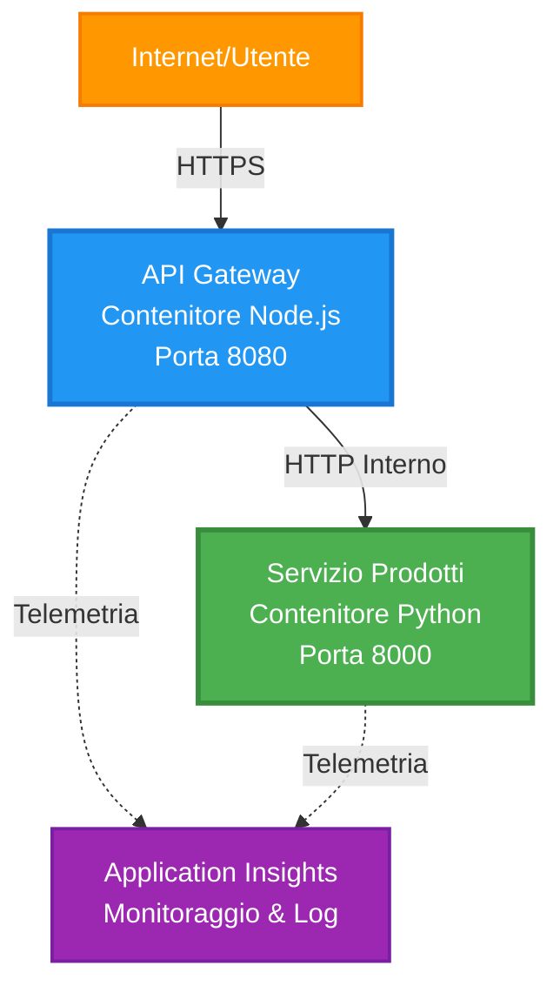
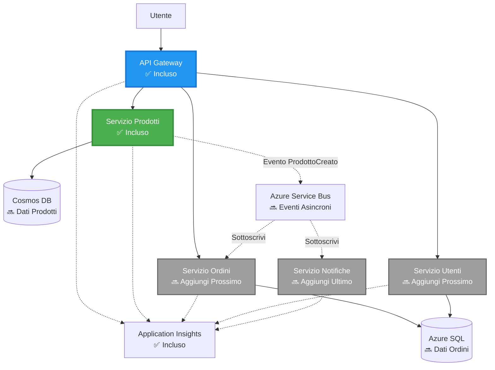
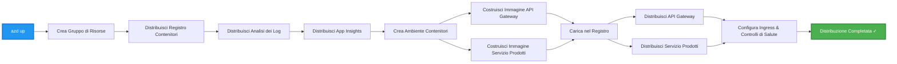
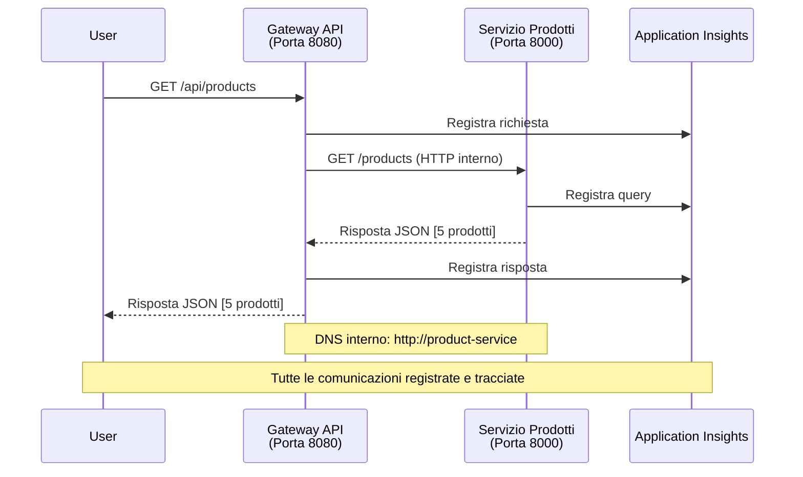

# Architettura Microservices - Esempio di App Container

⏱️ **Tempo Stimato**: 25-35 minuti | 💰 **Costo Stimato**: ~$50-100/mese | ⭐ **Complessità**: Avanzata

**📚 Percorso di Apprendimento:**
- ← Precedente: [API Flask Semplice](../../../../examples/container-app/simple-flask-api) - Basi di un singolo container
- 🎯 **Sei Qui**: Architettura Microservices (fondazione a 2 servizi)
- → Successivo: [Integrazione AI](../../../../docs/ai-foundry) - Aggiungi intelligenza ai tuoi servizi
- 🏠 [Home del Corso](../../README.md)

---

Una **architettura microservices semplificata ma funzionale** distribuita su Azure Container Apps utilizzando AZD CLI. Questo esempio dimostra la comunicazione tra servizi, l'orchestrazione dei container e il monitoraggio con una configurazione pratica a 2 servizi.

> **📚 Approccio di Apprendimento**: Questo esempio parte da una architettura minima a 2 servizi (API Gateway + Backend Service) che puoi effettivamente distribuire e da cui imparare. Dopo aver padroneggiato questa base, forniamo indicazioni per espandere verso un ecosistema completo di microservices.

## Cosa Imparerai

Completando questo esempio, imparerai a:
- Distribuire più container su Azure Container Apps
- Implementare la comunicazione tra servizi con rete interna
- Configurare scalabilità basata sull'ambiente e controlli di salute
- Monitorare applicazioni distribuite con Application Insights
- Comprendere i modelli di distribuzione dei microservices e le migliori pratiche
- Espandere progressivamente da architetture semplici a complesse

## Architettura

### Fase 1: Cosa Stiamo Costruendo (Incluso in Questo Esempio)


**Dettagli dei Componenti:**

| Componente | Scopo | Accesso | Risorse |
|------------|-------|---------|---------|
| **API Gateway** | Instrada richieste esterne ai servizi backend | Pubblico (HTTPS) | 1 vCPU, 2GB RAM, 2-20 repliche |
| **Product Service** | Gestisce il catalogo prodotti con dati in memoria | Solo interno | 0.5 vCPU, 1GB RAM, 1-10 repliche |
| **Application Insights** | Logging centralizzato e tracciamento distribuito | Portale Azure | 1-2 GB/mese di ingestione dati |

**Perché Iniziare Semplice?**
- ✅ Distribuisci e comprendi rapidamente (25-35 minuti)
- ✅ Impara i modelli principali dei microservices senza complessità
- ✅ Codice funzionante che puoi modificare e sperimentare
- ✅ Costi più bassi per l'apprendimento (~$50-100/mese contro $300-1400/mese)
- ✅ Acquisisci fiducia prima di aggiungere database e code di messaggi

**Analogia**: Pensalo come imparare a guidare. Inizi in un parcheggio vuoto (2 servizi), padroneggi le basi, poi progredisci al traffico cittadino (5+ servizi con database).

### Fase 2: Espansione Futura (Architettura di Riferimento)

Una volta padroneggiata l'architettura a 2 servizi, puoi espandere a:


Consulta la sezione "Guida all'Espansione" alla fine per istruzioni passo-passo.

## Funzionalità Incluse

✅ **Service Discovery**: Scoperta automatica basata su DNS tra container  
✅ **Load Balancing**: Bilanciamento del carico integrato tra repliche  
✅ **Auto-scaling**: Scalabilità indipendente per servizio basata su richieste HTTP  
✅ **Monitoraggio della Salute**: Probes di liveness e readiness per entrambi i servizi  
✅ **Logging Distribuito**: Logging centralizzato con Application Insights  
✅ **Rete Interna**: Comunicazione sicura tra servizi  
✅ **Orchestrazione dei Container**: Distribuzione e scalabilità automatica  
✅ **Aggiornamenti Senza Interruzioni**: Aggiornamenti rolling con gestione delle revisioni  

## Prerequisiti

### Strumenti Necessari

Prima di iniziare, verifica di avere installato questi strumenti:

1. **[Azure Developer CLI (azd)](https://learn.microsoft.com/azure/developer/azure-developer-cli/install-azd)** (versione 1.0.0 o superiore)
   ```bash
   azd version
   # Output previsto: versione azd 1.0.0 o superiore
   ```

2. **[Azure CLI](https://learn.microsoft.com/cli/azure/install-azure-cli)** (versione 2.50.0 o superiore)
   ```bash
   az --version
   # Output previsto: azure-cli 2.50.0 o superiore
   ```

3. **[Docker](https://www.docker.com/get-started)** (per sviluppo/test locale - opzionale)
   ```bash
   docker --version
   # Output previsto: versione Docker 20.10 o superiore
   ```

### Verifica della Configurazione

Esegui questi comandi per confermare che sei pronto:

```bash
# Controlla Azure Developer CLI
azd version
# ✅ Previsto: azd versione 1.0.0 o superiore

# Controlla Azure CLI
az --version
# ✅ Previsto: azure-cli 2.50.0 o superiore

# Controlla Docker (opzionale)
docker --version
# ✅ Previsto: Docker versione 20.10 o superiore
```

**Criteri di Successo**: Tutti i comandi restituiscono numeri di versione che corrispondono o superano i minimi richiesti.

### Requisiti Azure

- Un **abbonamento Azure** attivo ([crea un account gratuito](https://azure.microsoft.com/free/))
- Permessi per creare risorse nel tuo abbonamento
- Ruolo **Contributor** sull'abbonamento o gruppo di risorse

### Prerequisiti di Conoscenza

Questo è un esempio di livello **avanzato**. Dovresti avere:
- Completato l'esempio [API Flask Semplice](../../../../examples/container-app/simple-flask-api) 
- Comprensione di base dell'architettura microservices
- Familiarità con REST API e HTTP
- Comprensione dei concetti di container

**Nuovo alle Container Apps?** Inizia con l'esempio [API Flask Semplice](../../../../examples/container-app/simple-flask-api) per imparare le basi.

## Avvio Rapido (Passo-Passo)

### Passo 1: Clona e Naviga

```bash
git clone https://github.com/microsoft/AZD-for-beginners.git
cd AZD-for-beginners/examples/microservices
```

**✓ Verifica del Successo**: Controlla che vedi `azure.yaml`:
```bash
ls
# Previsto: README.md, azure.yaml, infra/, src/
```

### Passo 2: Autenticati con Azure

```bash
azd auth login
```

Questo apre il browser per l'autenticazione su Azure. Accedi con le tue credenziali Azure.

**✓ Verifica del Successo**: Dovresti vedere:
```
Logged in to Azure.
```

### Passo 3: Inizializza l'Ambiente

```bash
azd init
```

**Prompt che vedrai**:
- **Nome dell'ambiente**: Inserisci un nome breve (es. `microservices-dev`)
- **Abbonamento Azure**: Seleziona il tuo abbonamento
- **Località Azure**: Scegli una regione (es. `eastus`, `westeurope`)

**✓ Verifica del Successo**: Dovresti vedere:
```
SUCCESS: New project initialized!
```

### Passo 4: Distribuisci Infrastruttura e Servizi

```bash
azd up
```

**Cosa succede** (richiede 8-12 minuti):


**✓ Verifica del Successo**: Dovresti vedere:
```
SUCCESS: Your application was deployed to Azure in X minutes Y seconds.
Endpoint: https://api-gateway-<unique-id>.azurecontainerapps.io
```

**⏱️ Tempo**: 8-12 minuti

### Passo 5: Testa la Distribuzione

```bash
# Ottieni l'endpoint del gateway
GATEWAY_URL=$(azd env get-values | grep API_GATEWAY_URL | cut -d '=' -f2 | tr -d '"')

# Testa la salute dell'API Gateway
curl $GATEWAY_URL/health
```

**✅ Output previsto:**
```json
{
  "status": "healthy",
  "service": "api-gateway",
  "timestamp": "2025-11-19T10:30:00Z"
}
```

**Testa il servizio prodotti tramite gateway**:
```bash
# Elenca prodotti
curl $GATEWAY_URL/api/products
```

**✅ Output previsto:**
```json
[
  {"id":1,"name":"Laptop","price":999.99,"stock":50},
  {"id":2,"name":"Mouse","price":29.99,"stock":200},
  {"id":3,"name":"Keyboard","price":79.99,"stock":150}
]
```

**✓ Verifica del Successo**: Entrambi gli endpoint restituiscono dati JSON senza errori.

---

**🎉 Congratulazioni!** Hai distribuito un'architettura microservices su Azure!

## Struttura del Progetto

Tutti i file di implementazione sono inclusi—questo è un esempio completo e funzionante:

```
microservices/
│
├── README.md                         # This file
├── azure.yaml                        # AZD configuration
├── .gitignore                        # Git ignore patterns
│
├── infra/                           # Infrastructure as Code (Bicep)
│   ├── main.bicep                   # Main orchestration
│   ├── abbreviations.json           # Naming conventions
│   ├── core/                        # Shared infrastructure
│   │   ├── container-apps-environment.bicep  # Container environment + registry
│   │   └── monitor.bicep            # Application Insights + Log Analytics
│   └── app/                         # Service definitions
│       ├── api-gateway.bicep        # API Gateway container app
│       └── product-service.bicep    # Product Service container app
│
└── src/                             # Application source code
    ├── api-gateway/                 # Node.js API Gateway
    │   ├── app.js                   # Express server with routing
    │   ├── package.json             # Node dependencies
    │   └── Dockerfile               # Container definition
    └── product-service/             # Python Product Service
        ├── main.py                  # Flask API with product data
        ├── requirements.txt         # Python dependencies
        └── Dockerfile               # Container definition
```

**Cosa Fa Ogni Componente:**

**Infrastruttura (infra/)**:
- `main.bicep`: Orchestra tutte le risorse Azure e le loro dipendenze
- `core/container-apps-environment.bicep`: Crea l'ambiente Container Apps e Azure Container Registry
- `core/monitor.bicep`: Configura Application Insights per il logging distribuito
- `app/*.bicep`: Definizioni individuali dei container app con scalabilità e controlli di salute

**API Gateway (src/api-gateway/)**:
- Servizio pubblico che instrada richieste ai servizi backend
- Implementa logging, gestione degli errori e inoltro delle richieste
- Dimostra comunicazione HTTP tra servizi

**Product Service (src/product-service/)**:
- Servizio interno con catalogo prodotti (in memoria per semplicità)
- API REST con controlli di salute
- Esempio di pattern di microservice backend

## Panoramica dei Servizi

### API Gateway (Node.js/Express)

**Porta**: 8080  
**Accesso**: Pubblico (ingresso esterno)  
**Scopo**: Instrada richieste in arrivo ai servizi backend appropriati  

**Endpoint**:
- `GET /` - Informazioni sul servizio
- `GET /health` - Endpoint di controllo della salute
- `GET /api/products` - Inoltra al servizio prodotti (lista completa)
- `GET /api/products/:id` - Inoltra al servizio prodotti (dettaglio per ID)

**Caratteristiche Principali**:
- Routing delle richieste con axios
- Logging centralizzato
- Gestione degli errori e dei timeout
- Scoperta dei servizi tramite variabili d'ambiente
- Integrazione con Application Insights

**Highlight del Codice** (`src/api-gateway/app.js`):
```javascript
// Comunicazione interna del servizio
app.get('/api/products', async (req, res) => {
  const response = await axios.get(`${PRODUCT_SERVICE_URL}/products`, {
    timeout: 5000
  });
  res.json(response.data);
});
```

### Product Service (Python/Flask)

**Porta**: 8000  
**Accesso**: Solo interno (nessun ingresso esterno)  
**Scopo**: Gestisce il catalogo prodotti con dati in memoria  

**Endpoint**:
- `GET /` - Informazioni sul servizio
- `GET /health` - Endpoint di controllo della salute
- `GET /products` - Lista completa dei prodotti
- `GET /products/<id>` - Dettaglio prodotto per ID

**Caratteristiche Principali**:
- API RESTful con Flask
- Archivio prodotti in memoria (semplice, senza database)
- Monitoraggio della salute con probes
- Logging strutturato
- Integrazione con Application Insights

**Modello Dati**:
```python
{
  "id": 1,
  "name": "Laptop",
  "description": "High-performance laptop",
  "price": 999.99,
  "stock": 50
}
```

**Perché Solo Interno?**
Il servizio prodotti non è esposto pubblicamente. Tutte le richieste devono passare attraverso l'API Gateway, che offre:
- Sicurezza: Punto di accesso controllato
- Flessibilità: Può cambiare il backend senza influenzare i client
- Monitoraggio: Logging centralizzato delle richieste

## Comprendere la Comunicazione tra Servizi

### Come i Servizi Comunicano tra Loro


In questo esempio, l'API Gateway comunica con il Product Service utilizzando **chiamate HTTP interne**:

```javascript
// Gateway API (src/api-gateway/app.js)
const PRODUCT_SERVICE_URL = process.env.PRODUCT_SERVICE_URL;

// Effettuare una richiesta HTTP interna
const response = await axios.get(`${PRODUCT_SERVICE_URL}/products`);
```

**Punti Chiave**:

1. **Scoperta Basata su DNS**: Container Apps fornisce automaticamente DNS per i servizi interni
   - FQDN del Product Service: `product-service.internal.<environment>.azurecontainerapps.io`
   - Semplificato come: `http://product-service` (Container Apps lo risolve)

2. **Nessuna Esposizione Pubblica**: Il Product Service ha `external: false` in Bicep
   - Accessibile solo all'interno dell'ambiente Container Apps
   - Non raggiungibile da internet

3. **Variabili d'Ambiente**: Gli URL dei servizi vengono iniettati al momento della distribuzione
   - Bicep passa il FQDN interno al gateway
   - Nessun URL hardcoded nel codice dell'applicazione

**Analogia**: Pensalo come stanze di ufficio. L'API Gateway è la reception (pubblica), e il Product Service è una stanza interna (solo interno). I visitatori devono passare attraverso la reception per raggiungere qualsiasi stanza.

## Opzioni di Distribuzione

### Distribuzione Completa (Consigliata)

```bash
# Distribuire l'infrastruttura e entrambi i servizi
azd up
```

Questa distribuisce:
1. Ambiente Container Apps
2. Application Insights
3. Container Registry
4. Container dell'API Gateway
5. Container del Product Service

**Tempo**: 8-12 minuti

### Distribuisci Servizio Individuale

```bash
# Distribuisci solo un servizio (dopo il primo azd up)
azd deploy api-gateway

# Oppure distribuisci il servizio prodotto
azd deploy product-service
```

**Caso d'Uso**: Quando hai aggiornato il codice in un servizio e vuoi ridistribuire solo quel servizio.

### Aggiorna Configurazione

```bash
# Cambia i parametri di scalabilità
azd env set GATEWAY_MAX_REPLICAS 30

# Ridistribuisci con la nuova configurazione
azd up
```

## Configurazione

### Configurazione della Scalabilità

Entrambi i servizi sono configurati con autoscaling basato su HTTP nei loro file Bicep:

**API Gateway**:
- Min repliche: 2 (sempre almeno 2 per disponibilità)
- Max repliche: 20
- Trigger di scalabilità: 50 richieste concorrenti per replica

**Product Service**:
- Min repliche: 1 (può scalare a zero se necessario)
- Max repliche: 10
- Trigger di scalabilità: 100 richieste concorrenti per replica

**Personalizza Scalabilità** (in `infra/app/*.bicep`):
```bicep
scale: {
  minReplicas: 1
  maxReplicas: 10
  rules: [
    {
      name: 'http-scale-rule'
      http: {
        metadata: {
          concurrentRequests: '100'  // Adjust this
        }
      }
    }
  ]
}
```

### Allocazione delle Risorse

**API Gateway**:
- CPU: 1.0 vCPU
- Memoria: 2 GiB
- Motivo: Gestisce tutto il traffico esterno

**Product Service**:
- CPU: 0.5 vCPU
- Memoria: 1 GiB
- Motivo: Operazioni leggere in memoria

### Controlli di Salute

Entrambi i servizi includono probes di liveness e readiness:

```bicep
probes: [
  {
    type: 'Liveness'
    httpGet: {
      path: '/health'
      port: 8080
    }
    initialDelaySeconds: 10
    periodSeconds: 30
  }
  {
    type: 'Readiness'
    httpGet: {
      path: '/health'
      port: 8080
    }
    initialDelaySeconds: 5
    periodSeconds: 10
  }
]
```

**Cosa Significa**:
- **Liveness**: Se il controllo di salute fallisce, Container Apps riavvia il container
- **Readiness**: Se non pronto, Container Apps smette di instradare traffico a quella replica

## Monitoraggio e Osservabilità

### Visualizza i Log dei Servizi

```bash
# Trasmetti i log da API Gateway
azd logs api-gateway --follow

# Visualizza i log recenti del servizio prodotti
azd logs product-service --tail 100

# Visualizza tutti i log di entrambi i servizi
azd logs --follow
```

**Output Previsto**:
```
[api-gateway] API Gateway listening on port 8080
[api-gateway] Product Service URL: http://product-service
[api-gateway] GET /api/products 200 - 45ms
[product-service] Retrieved 5 products
```

### Query di Application Insights

Accedi a Application Insights nel Portale Azure, poi esegui queste query:

**Trova Richieste Lente**:
```kusto
requests
| where timestamp > ago(1h)
| where duration > 1000  // Requests taking >1 second
| summarize count() by name, cloud_RoleName
| order by count_ desc
```

**Traccia Chiamate tra Servizi**:
```kusto
dependencies
| where timestamp > ago(1h)
| where type == "Http"
| project timestamp, name, target, duration, success
| order by timestamp desc
```

**Tasso di Errori per Servizio**:
```kusto
exceptions
| where timestamp > ago(24h)
| summarize errorCount = count() by cloud_RoleName, type
| order by errorCount desc
```

**Volume delle Richieste nel Tempo**:
```kusto
requests
| where timestamp > ago(1h)
| summarize requestCount = count() by bin(timestamp, 5m), cloud_RoleName
| render timechart
```

### Accedi alla Dashboard di Monitoraggio

```bash
# Ottieni i dettagli di Application Insights
azd env get-values | grep APPLICATIONINSIGHTS

# Apri il monitoraggio del portale Azure
az monitor app-insights component show \
  --app $(azd env get-values | grep APPLICATIONINSIGHTS_CONNECTION_STRING | cut -d '=' -f2) \
  --resource-group $(azd env get-values | grep AZURE_RESOURCE_GROUP | cut -d '=' -f2) \
  --query "appId" -o tsv
```

### Metriche Live

1. Vai su Application Insights nel Portale Azure
2. Clicca su "Metriche Live"
3. Visualizza richieste, errori e prestazioni in tempo reale
4. Testa eseguendo: `curl $(azd env get-values | grep API_GATEWAY_URL | cut -d '=' -f2 | tr -d '"')/api/products`

## Esercizi Pratici

### Esercizio 1: Aggiungi un Nuovo Endpoint per i Prodotti ⭐ (Facile)

**Obiettivo**: Aggiungi un endpoint POST per creare nuovi prodotti

**Punto di Partenza**: `src/product-service/main.py`

**Passaggi**:

1. Aggiungi questo endpoint dopo la funzione `get_product` in `main.py`:

```python
@app.route('/products', methods=['POST'])
def create_product():
    """Create a new product"""
    data = request.get_json()
    
    # Convalida i campi obbligatori
    if not data or 'name' not in data or 'price' not in data:
        return jsonify({'error': 'Missing required fields: name, price'}), 400
    
    new_id = max(p['id'] for p in products) + 1
    new_product = {
        'id': new_id,
        'name': data['name'],
        'description': data.get('description', ''),
        'price': float(data['price']),
        'stock': int(data.get('stock', 0))
    }
    products.append(new_product)
    logger.info(f"Created product {new_id}")
    return jsonify(new_product), 201
```

2. Aggiungi il route POST all'API Gateway (`src/api-gateway/app.js`):

```javascript
// Aggiungi questo dopo la route GET /api/products
app.post('/api/products', async (req, res) => {
  try {
    console.log(`Forwarding POST request to ${PRODUCT_SERVICE_URL}/products`);
    const response = await axios.post(`${PRODUCT_SERVICE_URL}/products`, req.body, {
      timeout: 5000
    });
    res.status(201).json(response.data);
  } catch (error) {
    console.error('Error calling product service:', error.message);
    res.status(503).json({
      error: 'Product service unavailable',
      message: error.message
    });
  }
});
```

3. Ridistribuisci entrambi i servizi:

```bash
azd deploy product-service
azd deploy api-gateway
```

4. Testa il nuovo endpoint:

```bash
GATEWAY_URL=$(azd env get-values | grep API_GATEWAY_URL | cut -d '=' -f2 | tr -d '"')

# Creare un nuovo prodotto
curl -X POST $GATEWAY_URL/api/products \
  -H "Content-Type: application/json" \
  -d '{"name":"USB Cable","price":9.99,"stock":500}'
```

**✅ Output previsto:**
```json
{"id":6,"name":"USB Cable","description":"","price":9.99,"stock":500}
```

5. Verifica che appaia nella lista:

```bash
curl $GATEWAY_URL/api/products
# Dovrebbe ora mostrare 6 prodotti inclusi il nuovo cavo USB
```

**Criteri di successo**:
- ✅ La richiesta POST restituisce HTTP 201
- ✅ Il nuovo prodotto appare nella lista GET /api/products
- ✅ Il prodotto ha un ID auto-incrementato

**Tempo**: 10-15 minuti

---

### Esercizio 2: Modifica delle Regole di Autoscaling ⭐⭐ (Medio)

**Obiettivo**: Modificare il servizio Product per scalare in modo più aggressivo

**Punto di partenza**: `infra/app/product-service.bicep`

**Passaggi**:

1. Apri `infra/app/product-service.bicep` e trova il blocco `scale` (intorno alla riga 95)

2. Modifica da:
```bicep
scale: {
  minReplicas: 1
  maxReplicas: 10
  rules: [
    {
      name: 'http-scale-rule'
      http: {
        metadata: {
          concurrentRequests: '100'  // OLD
        }
      }
    }
  ]
}
```

A:
```bicep
scale: {
  minReplicas: 2  // Always have 2 running
  maxReplicas: 20  // Allow more scaling
  rules: [
    {
      name: 'http-scale-rule'
      http: {
        metadata: {
          concurrentRequests: '20'  // Scale at lower threshold
        }
      }
    }
  ]
}
```

3. Ridistribuisci l'infrastruttura:

```bash
azd up
```

4. Verifica la nuova configurazione di scaling:

```bash
az containerapp show \
  --name $(azd env get-values | grep PRODUCT_SERVICE | head -1 | cut -d '/' -f5) \
  --resource-group $(azd env get-values | grep AZURE_RESOURCE_GROUP | cut -d '=' -f2 | tr -d '"') \
  --query "properties.template.scale" -o json
```

**✅ Output previsto:**
```json
{
  "minReplicas": 2,
  "maxReplicas": 20,
  "rules": [...]
}
```

5. Testa l'autoscaling con carico:

```bash
# Genera richieste simultanee
for i in {1..500}; do curl $GATEWAY_URL/api/products & done

# Osserva la scalabilità in azione
azd logs product-service --follow
# Cerca: Eventi di scalabilità delle Container Apps
```

**Criteri di successo**:
- ✅ Il servizio Product esegue sempre almeno 2 repliche
- ✅ Sotto carico, scala a più di 2 repliche
- ✅ Il portale Azure mostra le nuove regole di scaling

**Tempo**: 15-20 minuti

---

### Esercizio 3: Aggiungi Query di Monitoraggio Personalizzata ⭐⭐ (Medio)

**Obiettivo**: Creare una query personalizzata in Application Insights per monitorare le prestazioni dell'API dei prodotti

**Passaggi**:

1. Vai su Application Insights nel portale Azure:
   - Accedi al portale Azure
   - Trova il tuo gruppo di risorse (rg-microservices-*)
   - Clicca sulla risorsa Application Insights

2. Clicca su "Logs" nel menu a sinistra

3. Crea questa query:

```kusto
requests
| where timestamp > ago(1h)
| where name contains "products"
| summarize 
    RequestCount = count(),
    AvgDuration = avg(duration),
    P95Duration = percentile(duration, 95),
    SuccessRate = 100.0 * countif(success == true) / count()
  by bin(timestamp, 5m)
| render timechart
```

4. Clicca su "Run" per eseguire la query

5. Salva la query:
   - Clicca su "Save"
   - Nome: "Prestazioni API Prodotti"
   - Categoria: "Performance"

6. Genera traffico di test:

```bash
for i in {1..100}; do curl $GATEWAY_URL/api/products; sleep 1; done
```

7. Aggiorna la query per visualizzare i dati

**✅ Output previsto:**
- Grafico che mostra il conteggio delle richieste nel tempo
- Durata media < 500ms
- Tasso di successo = 100%
- Intervalli di tempo di 5 minuti

**Criteri di successo**:
- ✅ La query mostra 100+ richieste
- ✅ Tasso di successo è 100%
- ✅ Durata media < 500ms
- ✅ Il grafico mostra intervalli di tempo di 5 minuti

**Risultato di apprendimento**: Comprendere come monitorare le prestazioni del servizio con query personalizzate

**Tempo**: 10-15 minuti

---

### Esercizio 4: Implementa Logica di Retry ⭐⭐⭐ (Avanzato)

**Obiettivo**: Aggiungere logica di retry al Gateway API quando il servizio Product non è temporaneamente disponibile

**Punto di partenza**: `src/api-gateway/app.js`

**Passaggi**:

1. Installa la libreria di retry:

```bash
cd src/api-gateway
npm install axios-retry --save
cd ../..
```

2. Aggiorna `src/api-gateway/app.js` (aggiungi dopo l'import di axios):

```javascript
const axiosRetry = require('axios-retry');

// Configura la logica di ritentativo
axiosRetry(axios, {
  retries: 3,
  retryDelay: (retryCount) => {
    return retryCount * 1000; // 1s, 2s, 3s
  },
  retryCondition: (error) => {
    // Ritenta in caso di errori di rete o risposte 5xx
    return axiosRetry.isNetworkOrIdempotentRequestError(error) ||
           (error.response && error.response.status >= 500);
  }
});

console.log('Retry logic configured: 3 retries with exponential backoff');
```

3. Ridistribuisci il Gateway API:

```bash
azd deploy api-gateway
```

4. Testa il comportamento di retry simulando un errore del servizio:

```bash
# Ridimensiona il servizio dei prodotti a 0 (simula un guasto)
az containerapp update \
  --name $(azd env get-values | grep PRODUCT_SERVICE | head -1 | cut -d '/' -f5) \
  --resource-group $(azd env get-values | grep AZURE_RESOURCE_GROUP | cut -d '=' -f2 | tr -d '"') \
  --min-replicas 0 \
  --max-replicas 0

# Prova ad accedere ai prodotti (ritenterà 3 volte)
time curl -v $GATEWAY_URL/api/products
# Osserva: La risposta impiega ~6 secondi (1s + 2s + 3s tentativi)

# Ripristina il servizio dei prodotti
az containerapp update \
  --name $(azd env get-values | grep PRODUCT_SERVICE | head -1 | cut -d '/' -f5) \
  --resource-group $(azd env get-values | grep AZURE_RESOURCE_GROUP | cut -d '=' -f2 | tr -d '"') \
  --min-replicas 1 \
  --max-replicas 10
```

5. Visualizza i log di retry:

```bash
azd logs api-gateway --tail 50
# Cerca: Messaggi di tentativo di ripetizione
```

**✅ Comportamento previsto:**
- Le richieste tentano 3 volte prima di fallire
- Ogni retry attende più a lungo (1s, 2s, 3s)
- Le richieste hanno successo dopo il riavvio del servizio
- I log mostrano i tentativi di retry

**Criteri di successo**:
- ✅ Le richieste tentano 3 volte prima di fallire
- ✅ Ogni retry attende più a lungo (backoff esponenziale)
- ✅ Le richieste hanno successo dopo il riavvio del servizio
- ✅ I log mostrano i tentativi di retry

**Risultato di apprendimento**: Comprendere i pattern di resilienza nei microservizi (circuit breakers, retry, timeout)

**Tempo**: 20-25 minuti

---

## Verifica delle Conoscenze

Dopo aver completato questo esempio, verifica la tua comprensione:

### 1. Comunicazione tra Servizi ✓

Testa la tua conoscenza:
- [ ] Sai spiegare come il Gateway API scopre il servizio Product? (Scoperta basata su DNS)
- [ ] Cosa succede se il servizio Product è inattivo? (Il Gateway restituisce errore 503)
- [ ] Come aggiungeresti un terzo servizio? (Crea un nuovo file Bicep, aggiungilo a main.bicep, crea una cartella src)

**Verifica pratica**:
```bash
# Simulare guasto del servizio
az containerapp update --name <product-service-name> --min-replicas 0 --max-replicas 0
curl $GATEWAY_URL/api/products
# ✅ Previsto: 503 Servizio non disponibile

# Ripristinare il servizio
az containerapp update --name <product-service-name> --min-replicas 1 --max-replicas 10
```

### 2. Monitoraggio e Osservabilità ✓

Testa la tua conoscenza:
- [ ] Dove visualizzi i log distribuiti? (Application Insights nel portale Azure)
- [ ] Come monitori le richieste lente? (Query Kusto: `requests | where duration > 1000`)
- [ ] Sai identificare quale servizio ha causato un errore? (Controlla il campo `cloud_RoleName` nei log)

**Verifica pratica**:
```bash
# Genera una simulazione di richiesta lenta
curl "$GATEWAY_URL/api/products?delay=2000"

# Interroga Application Insights per richieste lente
# Vai al Portale Azure → Application Insights → Logs
# Esegui: requests | where duration > 1000 | project timestamp, name, duration, cloud_RoleName
```

### 3. Scaling e Prestazioni ✓

Testa la tua conoscenza:
- [ ] Cosa attiva l'autoscaling? (Regole di richieste HTTP concorrenti: 50 per il gateway, 100 per il prodotto)
- [ ] Quante repliche sono attualmente in esecuzione? (Controlla con `az containerapp revision list`)
- [ ] Come scaleresti il servizio Product a 5 repliche? (Aggiorna minReplicas nel file Bicep)

**Verifica pratica**:
```bash
# Genera carico per testare l'autoscaling
for i in {1..1000}; do curl $GATEWAY_URL/api/products & done

# Osserva l'aumento delle repliche
azd logs api-gateway --follow
# ✅ Aspettativa: Vedi eventi di scaling nei log
```

**Criteri di successo**: Sei in grado di rispondere a tutte le domande e verificare con comandi pratici.

---

## Analisi dei Costi

### Costi Mensili Stimati (Per Questo Esempio a 2 Servizi)

| Risorsa | Configurazione | Costo Stimato |
|---------|----------------|---------------|
| Gateway API | 2-20 repliche, 1 vCPU, 2GB RAM | $30-150 |
| Servizio Product | 1-10 repliche, 0.5 vCPU, 1GB RAM | $15-75 |
| Container Registry | Tier base | $5 |
| Application Insights | 1-2 GB/mese | $5-10 |
| Log Analytics | 1 GB/mese | $3 |
| **Totale** | | **$58-243/mese** |

### Suddivisione dei Costi per Utilizzo

**Traffico leggero** (test/apprendimento): ~$60/mese
- Gateway API: 2 repliche × 24/7 = $30
- Servizio Product: 1 replica × 24/7 = $15
- Monitoraggio + Registry = $13

**Traffico moderato** (piccola produzione): ~$120/mese
- Gateway API: 5 repliche medie = $75
- Servizio Product: 3 repliche medie = $45
- Monitoraggio + Registry = $13

**Traffico elevato** (periodi di picco): ~$240/mese
- Gateway API: 15 repliche medie = $225
- Servizio Product: 8 repliche medie = $120
- Monitoraggio + Registry = $13

### Consigli per Ottimizzare i Costi

1. **Scala a Zero per lo Sviluppo**:
   ```bicep
   scale: {
     minReplicas: 0  // Save $30-40/month when not in use
     maxReplicas: 10
   }
   ```

2. **Usa il Piano di Consumo per Cosmos DB** (quando lo aggiungi):
   - Paga solo per ciò che utilizzi
   - Nessun costo minimo

3. **Imposta il Campionamento in Application Insights**:
   ```javascript
   appInsights.defaultClient.config.samplingPercentage = 50; // Campiona il 50% delle richieste
   ```

4. **Elimina Risorse Non Necessarie**:
   ```bash
   azd down --force --purge
   ```

### Opzioni Free Tier

Per apprendimento/test, considera:
- ✅ Usa i crediti gratuiti di Azure ($200 per i primi 30 giorni con nuovi account)
- ✅ Mantieni il numero minimo di repliche (risparmia ~50% dei costi)
- ✅ Elimina dopo il test (nessun costo continuo)
- ✅ Scala a zero tra le sessioni di apprendimento

**Esempio**: Eseguire questo esempio per 2 ore/giorno × 30 giorni = ~$5/mese invece di $60/mese

---

## Riferimenti Rapidi per la Risoluzione dei Problemi

### Problema: `azd up` fallisce con "Subscription not found"

**Soluzione**:
```bash
# Accedi di nuovo con abbonamento esplicito
az account set --subscription <your-subscription-id>
azd env set AZURE_SUBSCRIPTION_ID <your-subscription-id>
azd up
```

### Problema: Il Gateway API restituisce 503 "Servizio prodotti non disponibile"

**Diagnosi**:
```bash
# Controlla i log del servizio prodotto
azd logs product-service --tail 50

# Controlla lo stato di salute del servizio prodotto
az containerapp show \
  --name $(azd env get-values | grep PRODUCT_SERVICE | head -1 | cut -d '/' -f5) \
  --resource-group $(azd env get-values | grep AZURE_RESOURCE_GROUP | cut -d '=' -f2 | tr -d '"') \
  --query "properties.runningStatus"
```

**Cause Comuni**:
1. Il servizio Product non è stato avviato (controlla i log per errori Python)
2. Il controllo di salute fallisce (verifica che l'endpoint `/health` funzioni)
3. La build dell'immagine del container è fallita (controlla il registro per l'immagine)

### Problema: L'autoscaling non funziona

**Diagnosi**:
```bash
# Controlla il conteggio attuale delle repliche
az containerapp revision list \
  --name $(azd env get-values | grep API_GATEWAY | head -1 | cut -d '/' -f5) \
  --resource-group $(azd env get-values | grep AZURE_RESOURCE_GROUP | cut -d '=' -f2 | tr -d '"') \
  --query "[].properties.replicas"

# Genera carico per il test
for i in {1..1000}; do curl $GATEWAY_URL/api/products & done

# Osserva gli eventi di scalabilità
azd logs api-gateway --follow | grep -i scale
```

**Cause Comuni**:
1. Il carico non è sufficiente per attivare la regola di scaling (necessarie >50 richieste concorrenti)
2. Il numero massimo di repliche è già stato raggiunto (controlla la configurazione Bicep)
3. La regola di scaling è configurata male in Bicep (verifica il valore concurrentRequests)

### Problema: Application Insights non mostra i log

**Diagnosi**:
```bash
# Verifica che la stringa di connessione sia impostata
azd env get-values | grep APPLICATIONINSIGHTS

# Controlla se i servizi stanno inviando telemetria
az monitor app-insights component show \
  --app $(azd env get-values | grep APPLICATIONINSIGHTS_NAME | cut -d '=' -f2 | tr -d '"') \
  --resource-group $(azd env get-values | grep AZURE_RESOURCE_GROUP | cut -d '=' -f2 | tr -d '"') \
  --query "properties.InstrumentationKey"
```

**Cause Comuni**:
1. La stringa di connessione non è passata al container (controlla le variabili di ambiente)
2. L'SDK di Application Insights non è configurato (verifica gli import nel codice)
3. Il firewall blocca la telemetria (raro, controlla le regole di rete)

### Problema: La build Docker fallisce localmente

**Diagnosi**:
```bash
# Testare la build del Gateway API
cd src/api-gateway
docker build -t test-gateway .

# Testare la build del Servizio Prodotti
cd ../product-service
docker build -t test-product .
```

**Cause Comuni**:
1. Dipendenze mancanti in package.json/requirements.txt
2. Errori di sintassi nel Dockerfile
3. Problemi di rete durante il download delle dipendenze

**Ancora bloccato?** Consulta [Guida ai Problemi Comuni](../../docs/troubleshooting/common-issues.md) o [Risoluzione dei Problemi di Azure Container Apps](https://learn.microsoft.com/azure/container-apps/troubleshooting)

---

## Pulizia

Per evitare costi continui, elimina tutte le risorse:

```bash
azd down --force --purge
```

**Prompt di Conferma**:
```
? Total resources to delete: 6, are you sure you want to continue? (y/N)
```

Digita `y` per confermare.

**Cosa viene eliminato**:
- Ambiente Container Apps
- Entrambi i Container Apps (gateway e servizio prodotti)
- Container Registry
- Application Insights
- Workspace Log Analytics
- Gruppo di risorse

**✓ Verifica Pulizia**:
```bash
az group list --query "[?starts_with(name,'rg-microservices')]" --output table
```

Dovrebbe restituire vuoto.

---

## Guida all'Espansione: Da 2 a 5+ Servizi

Una volta padroneggiata questa architettura a 2 servizi, ecco come espandere:

### Fase 1: Aggiungi Persistenza del Database (Prossimo Passo)

**Aggiungi Cosmos DB per il Servizio Prodotti**:

1. Crea `infra/core/cosmos.bicep`:
   ```bicep
   resource cosmosAccount 'Microsoft.DocumentDB/databaseAccounts@2023-04-15' = {
     name: name
     location: location
     kind: 'GlobalDocumentDB'
     properties: {
       databaseAccountOfferType: 'Standard'
       consistencyPolicy: { defaultConsistencyLevel: 'Session' }
       locations: [{ locationName: location, failoverPriority: 0 }]
     }
   }
   ```

2. Aggiorna il servizio prodotti per utilizzare l'SDK Python di Azure Cosmos DB invece dei dati in memoria

3. Costo aggiuntivo stimato: ~$25/mese (serverless)

### Fase 2: Aggiungi un Terzo Servizio (Gestione Ordini)

**Crea il Servizio Ordini**:

1. Nuova cartella: `src/order-service/` (Python/Node.js/C#)
2. Nuovo Bicep: `infra/app/order-service.bicep`
3. Aggiorna il Gateway API per instradare `/api/orders`
4. Aggiungi Azure SQL Database per la persistenza degli ordini

**L'architettura diventa**:
```
API Gateway → Product Service (Cosmos DB)
           → Order Service (Azure SQL)
```

### Fase 3: Aggiungi Comunicazione Asincrona (Service Bus)

**Implementa Architettura Event-Driven**:

1. Aggiungi Azure Service Bus: `infra/core/servicebus.bicep`
2. Il servizio prodotti pubblica eventi "ProductCreated"
3. Il servizio ordini si sottoscrive agli eventi dei prodotti
4. Aggiungi un servizio di notifiche per elaborare gli eventi

**Pattern**: Richiesta/Risposta (HTTP) + Event-Driven (Service Bus)

### Fase 4: Aggiungi Autenticazione Utente

**Implementa il Servizio Utenti**:

1. Crea `src/user-service/` (Go/Node.js)
2. Aggiungi Azure AD B2C o autenticazione JWT personalizzata
3. Il Gateway API valida i token prima di instradare
4. I servizi verificano i permessi utente

### Fase 5: Prontezza per la Produzione

**Aggiungi Questi Componenti**:
- ✅ Azure Front Door (bilanciamento del carico globale)
- ✅ Azure Key Vault (gestione dei segreti)
- ✅ Azure Monitor Workbooks (dashboard personalizzati)
- ✅ Pipeline CI/CD (GitHub Actions)
- ✅ Deployment Blue-Green
- ✅ Identità gestita per tutti i servizi

**Costo Architettura Completa in Produzione**: ~$300-1,400/mese

---

## Per Saperne di Più

### Documentazione Correlata
- [Documentazione Azure Container Apps](https://learn.microsoft.com/azure/container-apps/)
- [Guida all'Architettura Microservizi](https://learn.microsoft.com/azure/architecture/guide/architecture-styles/microservices)
- [Application Insights per il Tracing Distribuito](https://learn.microsoft.com/azure/azure-monitor/app/distributed-tracing)
- [Documentazione Azure Developer CLI](https://learn.microsoft.com/azure/developer/azure-developer-cli/)

### Prossimi Passi in Questo Corso
- ← Precedente: [API Flask Semplice](../../../../examples/container-app/simple-flask-api) - Esempio per principianti con un singolo container
- → Successivo: [Guida all'Integrazione AI](../../../../docs/ai-foundry) - Aggiungi funzionalità AI
- 🏠 [Home del Corso](../../README.md)

### Confronto: Quando Usare Cosa

| Caratteristica | Singolo Container | Microservizi (Questo) | Kubernetes (AKS) |
|----------------|-------------------|-----------------------|------------------|
| **Caso d'Uso** | App semplici | App complesse | App aziendali |
| **Scalabilità** | Servizio singolo | Scaling per servizio | Massima flessibilità |
| **Complessità** | Bassa | Media | Alta |
| **Dimensione del Team** | 1-3 sviluppatori | 3-10 sviluppatori | 10+ sviluppatori |
| **Costo** | ~$15-50/mese | ~$60-250/mese | ~$150-500/mese |
| **Tempo di Deployment** | 5-10 minuti | 8-12 minuti | 15-30 minuti |
| **Ideale per** | MVP, prototipi | App di produzione | Multi-cloud, networking avanzato |

**Raccomandazione**: Inizia con Container Apps (questo esempio), passa ad AKS solo se hai bisogno di funzionalità specifiche di Kubernetes.

---

## Domande Frequenti

**D: Perché solo 2 servizi invece di 5+?**  
R: Progressione educativa. Impara le basi (comunicazione tra servizi, monitoraggio, scalabilità) con un esempio semplice prima di aggiungere complessità. I modelli che impari qui si applicano anche ad architetture con 100 servizi.

**D: Posso aggiungere più servizi da solo?**  
R: Assolutamente! Segui la guida di espansione sopra. Ogni nuovo servizio segue lo stesso schema: crea la cartella src, crea il file Bicep, aggiorna azure.yaml, distribuisci.

**D: È pronto per la produzione?**  
R: È una solida base. Per la produzione, aggiungi: identità gestita, Key Vault, database persistenti, pipeline CI/CD, avvisi di monitoraggio e strategia di backup.

**D: Perché non usare Dapr o altri service mesh?**  
R: Mantieni tutto semplice per imparare. Una volta che comprendi il networking nativo di Container Apps, puoi aggiungere Dapr per scenari avanzati (gestione dello stato, pub/sub, binding).

**D: Come faccio a fare debug in locale?**  
R: Esegui i servizi in locale con Docker:  
```bash
cd src/api-gateway
docker build -t local-gateway .
docker run -p 8080:8080 -e PRODUCT_SERVICE_URL=http://localhost:8000 local-gateway
```
  
**D: Posso usare linguaggi di programmazione diversi?**  
R: Certo! Questo esempio mostra Node.js (gateway) + Python (servizio prodotto). Puoi mescolare qualsiasi linguaggio che funzioni nei container: C#, Go, Java, Ruby, PHP, ecc.

**D: E se non ho crediti Azure?**  
R: Usa il livello gratuito di Azure (i primi 30 giorni con nuovi account ottengono $200 di crediti) oppure distribuisci per brevi periodi di test e cancella immediatamente. Questo esempio costa circa $2/giorno.

**D: In cosa è diverso da Azure Kubernetes Service (AKS)?**  
R: Container Apps è più semplice (non serve conoscenza di Kubernetes) ma meno flessibile. AKS ti offre il controllo completo di Kubernetes ma richiede più competenze. Inizia con Container Apps, passa ad AKS se necessario.

**D: Posso usarlo con servizi Azure esistenti?**  
R: Certo! Puoi connetterti a database esistenti, account di archiviazione, Service Bus, ecc. Aggiorna i file Bicep per fare riferimento a risorse esistenti invece di crearne di nuove.

---

> **🎓 Riepilogo del percorso di apprendimento**: Hai imparato a distribuire un'architettura multi-servizio con scalabilità automatica, networking interno, monitoraggio centralizzato e modelli pronti per la produzione. Questa base ti prepara per sistemi distribuiti complessi e architetture di microservizi aziendali.

**📚 Navigazione del corso:**
- ← Precedente: [API Flask semplice](../../../../examples/container-app/simple-flask-api)
- → Successivo: [Esempio di integrazione con database](../../../../database-app)
- 🏠 [Home del corso](../../README.md)
- 📖 [Best Practices per Container Apps](../../docs/deployment/deployment-guide.md)

---

**✨ Congratulazioni!** Hai completato l'esempio di microservizi. Ora sai come costruire, distribuire e monitorare applicazioni distribuite su Azure Container Apps. Pronto per aggiungere funzionalità AI? Dai un'occhiata alla [Guida all'integrazione AI](../../../../docs/ai-foundry)!

---

<!-- CO-OP TRANSLATOR DISCLAIMER START -->
**Disclaimer**:  
Questo documento è stato tradotto utilizzando il servizio di traduzione AI [Co-op Translator](https://github.com/Azure/co-op-translator). Sebbene ci impegniamo per garantire l'accuratezza, si prega di notare che le traduzioni automatizzate possono contenere errori o imprecisioni. Il documento originale nella sua lingua nativa dovrebbe essere considerato la fonte autorevole. Per informazioni critiche, si raccomanda una traduzione professionale umana. Non siamo responsabili per eventuali incomprensioni o interpretazioni errate derivanti dall'uso di questa traduzione.
<!-- CO-OP TRANSLATOR DISCLAIMER END -->