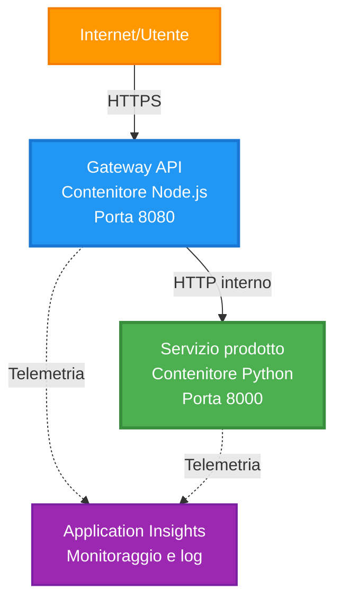
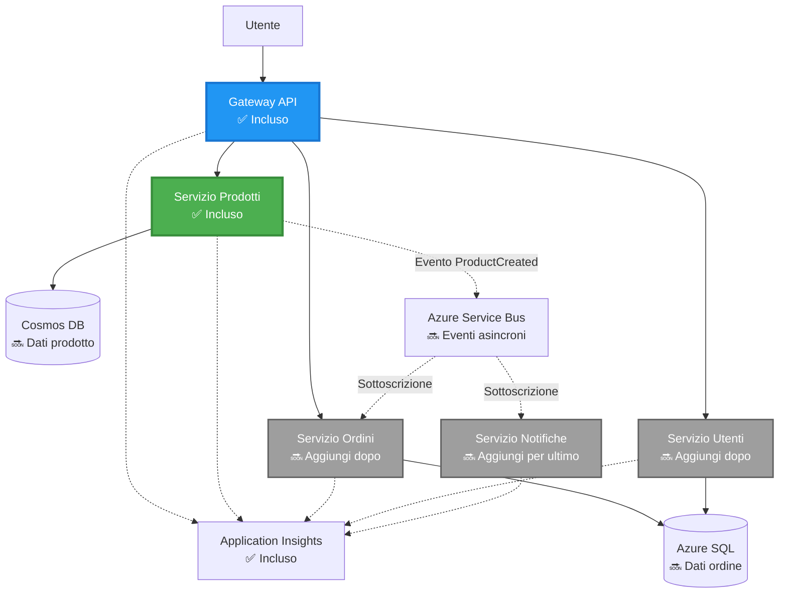
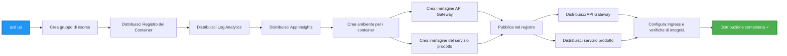
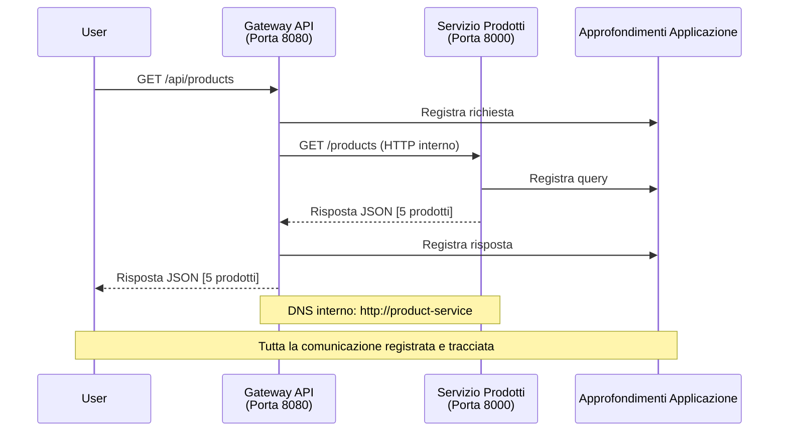

# Architettura a Microservizi - Esempio Container App

⏱️ **Tempo stimato**: 25-35 minuti | 💰 **Costo stimato**: ~$50-100/mese | ⭐ **Complessità**: Avanzato

**📚 Percorso di apprendimento:**
- ← Precedente: [Simple Flask API](../../../../examples/container-app/simple-flask-api) - Fondamenti di un singolo contenitore
- 🎯 **Sei Qui**: Architettura a Microservizi (fondazione a 2 servizi)
- → Successivo: [AI Integration](../../../../docs/ai-foundry) - Aggiungi intelligenza ai tuoi servizi
- 🏠 [Home del corso](../../README.md)

---

Un'architettura a microservizi **semplificata ma funzionale** distribuita su Azure Container Apps usando AZD CLI. Questo esempio dimostra la comunicazione servizio-servizio, l'orchestrazione dei container e il monitoraggio con un setup pratico a 2 servizi.

> **📚 Approccio di apprendimento**: Questo esempio inizia con un'architettura minima a 2 servizi (API Gateway + Servizio Backend) che puoi effettivamente distribuire e studiare. Dopo aver padroneggiato questa base, forniamo indicazioni per espandere verso un ecosistema microservizi completo.

## Cosa Imparerai

Completando questo esempio, tu:
- Distribuirai più container su Azure Container Apps
- Implementerai comunicazione servizio-servizio con networking interno
- Configurerai scalabilità basata sull'ambiente e controlli di integrità
- Monitorerai applicazioni distribuite con Application Insights
- Capirai i pattern di deployment dei microservizi e le best practice
- Imparerai un'espansione progressiva da architetture semplici a complesse

## Architettura

### Fase 1: Cosa stiamo costruendo (incluso in questo esempio)


```mermaid
graph TB
    Internet[Internet/Utente]
    Gateway[Gateway API<br/>Contenitore Node.js<br/>Porta 8080]
    Product[Servizio prodotto<br/>Contenitore Python<br/>Porta 8000]
    AppInsights[Application Insights<br/>Monitoraggio e log]
    
    Internet -->|HTTPS| Gateway
    Gateway -->|HTTP interno| Product
    Gateway -.->|Telemetria| AppInsights
    Product -.->|Telemetria| AppInsights
    
    style Gateway fill:#2196F3,stroke:#1976D2,stroke-width:3px,color:#fff
    style Product fill:#4CAF50,stroke:#388E3C,stroke-width:3px,color:#fff
    style Internet fill:#FF9800,stroke:#F57C00,stroke-width:2px,color:#fff
    style AppInsights fill:#9C27B0,stroke:#7B1FA2,stroke-width:2px,color:#fff
```
**Dettagli dei componenti:**

| Componente | Scopo | Accesso | Risorse |
|-----------|---------|--------|-----------|
| **API Gateway** | Indirizza le richieste esterne ai servizi backend | Pubblico (HTTPS) | 1 vCPU, 2GB RAM, 2-20 repliche |
| **Product Service** | Gestisce il catalogo prodotti con dati in memoria | Solo interno | 0.5 vCPU, 1GB RAM, 1-10 repliche |
| **Application Insights** | Logging centralizzato e tracciamento distribuito | Azure Portal | 1-2 GB/mese ingestione dati |

**Perché iniziare semplice?**
- ✅ Distribuisci e capisci rapidamente (25-35 minuti)
- ✅ Impara i pattern core dei microservizi senza complessità
- ✅ Codice funzionante che puoi modificare e sperimentare
- ✅ Costo inferiore per l'apprendimento (~$50-100/mese vs $300-1400/mese)
- ✅ Costruisci fiducia prima di aggiungere database e code di messaggistica

**Analogia**: Pensalo come imparare a guidare. Inizi con un parcheggio vuoto (2 servizi), padroneggi le basi, poi passi al traffico cittadino (5+ servizi con database).

### Fase 2: Espansione futura (Architettura di riferimento)

Una volta che hai padroneggiato l'architettura a 2 servizi, puoi espandere a:


```mermaid
graph TB
    User[Utente]
    Gateway[Gateway API<br/>✅ Incluso]
    Product[Servizio Prodotti<br/>✅ Incluso]
    Order[Servizio Ordini<br/>🔜 Aggiungi dopo]
    UserSvc[Servizio Utenti<br/>🔜 Aggiungi dopo]
    Notify[Servizio Notifiche<br/>🔜 Aggiungi per ultimo]
    
    CosmosDB[(Cosmos DB<br/>🔜 Dati prodotto)]
    AzureSQL[(Azure SQL<br/>🔜 Dati ordine)]
    ServiceBus[Azure Service Bus<br/>🔜 Eventi asincroni]
    AppInsights[Application Insights<br/>✅ Incluso]
    
    User --> Gateway
    Gateway --> Product
    Gateway --> Order
    Gateway --> UserSvc
    
    Product --> CosmosDB
    Order --> AzureSQL
    UserSvc --> AzureSQL
    
    Product -.->|Evento ProductCreated| ServiceBus
    ServiceBus -.->|Sottoscrizione| Notify
    ServiceBus -.->|Sottoscrizione| Order
    
    Gateway -.-> AppInsights
    Product -.-> AppInsights
    Order -.-> AppInsights
    UserSvc -.-> AppInsights
    Notify -.-> AppInsights
    
    style Product fill:#4CAF50,stroke:#388E3C,stroke-width:3px,color:#fff
    style Gateway fill:#2196F3,stroke:#1976D2,stroke-width:3px,color:#fff
    style Order fill:#9E9E9E,stroke:#616161,stroke-width:2px,color:#fff
    style UserSvc fill:#9E9E9E,stroke:#616161,stroke-width:2px,color:#fff
    style Notify fill:#9E9E9E,stroke:#616161,stroke-width:2px,color:#fff
```
Vedi la sezione "Guida all'espansione" alla fine per istruzioni passo dopo passo.

## Funzionalità Incluse

✅ **Service Discovery**: Scoperta automatica basata su DNS tra i container  
✅ **Bilanciamento del carico**: Bilanciamento integrato tra le repliche  
✅ **Auto-scaling**: Scalabilità indipendente per servizio basata sulle richieste HTTP  
✅ **Monitoraggio della salute**: Sonde di liveness e readiness per entrambi i servizi  
✅ **Logging distribuito**: Logging centralizzato con Application Insights  
✅ **Networking interno**: Comunicazione sicura servizio-servizio  
✅ **Orchestrazione dei container**: Deployment e scalabilità automatici  
✅ **Aggiornamenti senza downtime**: Aggiornamenti rolling con gestione delle revisioni  

## Prerequisiti

### Strumenti richiesti

Prima di iniziare, verifica di avere questi strumenti installati:

1. **[Azure Developer CLI (azd)](https://learn.microsoft.com/azure/developer/azure-developer-cli/install-azd)** (versione 1.0.0 o superiore)
   ```bash
   azd version
   # Output previsto: azd versione 1.0.0 o superiore
   ```

2. **[Azure CLI](https://learn.microsoft.com/cli/azure/install-azure-cli)** (versione 2.50.0 o superiore)
   ```bash
   az --version
   # Output previsto: azure-cli 2.50.0 o superiore
   ```

3. **[Docker](https://www.docker.com/get-started)** (per sviluppo/test locali - opzionale)
   ```bash
   docker --version
   # Output previsto: Docker versione 20.10 o superiore
   ```

### Verifica la tua configurazione

Esegui questi comandi per confermare che sei pronto:

```bash
# Controlla Azure Developer CLI
azd version
# ✅ Previsto: azd versione 1.0.0 o superiore

# Controlla Azure CLI
az --version
# ✅ Previsto: azure-cli 2.50.0 o superiore

# Controlla Docker (opzionale)
docker --version
# ✅ Previsto: versione Docker 20.10 o superiore
```

**Criteri di successo**: Tutti i comandi restituiscono numeri di versione uguali o superiori ai minimi richiesti.

### Requisiti di Azure

- Una **sottoscrizione Azure** attiva ([crea un account gratuito](https://azure.microsoft.com/free/))
- Permessi per creare risorse nella tua sottoscrizione
- Ruolo **Contributor** sulla sottoscrizione o sul gruppo di risorse

### Conoscenze richieste

Questo è un esempio di livello **avanzato**. Dovresti avere:
- Completato l'esempio [Simple Flask API](../../../../examples/container-app/simple-flask-api) 
- Comprensione di base dell'architettura a microservizi
- Familiarità con API REST e HTTP
- Comprensione dei concetti di container

**Nuovo a Container Apps?** Inizia con l'esempio [Simple Flask API](../../../../examples/container-app/simple-flask-api) per apprendere le basi.

## Avvio rapido (Passo-passo)

### Passo 1: Clona e naviga

```bash
git clone https://github.com/microsoft/AZD-for-beginners.git
cd AZD-for-beginners/examples/microservices
```

**✓ Verifica di successo**: Verifica di vedere `azure.yaml`:
```bash
ls
# Previsto: README.md, azure.yaml, infra/, src/
```

### Passo 2: Autenticati con Azure

```bash
azd auth login
```

Questo apre il browser per l'autenticazione Azure. Accedi con le tue credenziali Azure.

**✓ Verifica di successo**: Dovresti vedere:
```
Logged in to Azure.
```

### Passo 3: Inizializza l'ambiente

```bash
azd init
```

**Prompt che vedrai**:
- **Environment name**: Inserisci un nome breve (es., `microservices-dev`)
- **Azure subscription**: Seleziona la tua sottoscrizione
- **Azure location**: Scegli una regione (es., `eastus`, `westeurope`)

**✓ Verifica di successo**: Dovresti vedere:
```
SUCCESS: New project initialized!
```

### Passo 4: Distribuisci infrastruttura e servizi

```bash
azd up
```

**Cosa succede** (richiede 8-12 minuti):


```mermaid
graph LR
    A[azd up] --> B[Crea gruppo di risorse]
    B --> C[Distribuisci Registro dei Container]
    C --> D[Distribuisci Log Analytics]
    D --> E[Distribuisci App Insights]
    E --> F[Crea ambiente per i container]
    F --> G[Crea immagine API Gateway]
    F --> H[Crea immagine del servizio prodotto]
    G --> I[Pubblica nel registro]
    H --> I
    I --> J[Distribuisci API Gateway]
    I --> K[Distribuisci servizio prodotto]
    J --> L[Configura Ingress e verifiche di integrità]
    K --> L
    L --> M[Distribuzione completata ✓]
    
    style A fill:#2196F3,stroke:#1976D2,stroke-width:3px,color:#fff
    style M fill:#4CAF50,stroke:#388E3C,stroke-width:3px,color:#fff
```
**✓ Verifica di successo**: Dovresti vedere:
```
SUCCESS: Your application was deployed to Azure in X minutes Y seconds.
Endpoint: https://api-gateway-<unique-id>.azurecontainerapps.io
```

**⏱️ Tempo**: 8-12 minuti

### Passo 5: Testa il deployment

```bash
# Ottieni l'endpoint del gateway
GATEWAY_URL=$(azd env get-values | grep API_GATEWAY_URL | cut -d '=' -f2 | tr -d '"')

# Verifica la salute dell'API Gateway
curl $GATEWAY_URL/health
```

**✅ Output atteso:**
```json
{
  "status": "healthy",
  "service": "api-gateway",
  "timestamp": "2025-11-19T10:30:00Z"
}
```

**Test del servizio prodotti tramite il gateway**:
```bash
# Elenco prodotti
curl $GATEWAY_URL/api/products
```

**✅ Output atteso:**
```json
[
  {"id":1,"name":"Laptop","price":999.99,"stock":50},
  {"id":2,"name":"Mouse","price":29.99,"stock":200},
  {"id":3,"name":"Keyboard","price":79.99,"stock":150}
]
```

**✓ Verifica di successo**: Entrambi gli endpoint restituiscono dati JSON senza errori.

---

**🎉 Congratulazioni!** Hai distribuito un'architettura a microservizi su Azure!

## Struttura del progetto

Tutti i file di implementazione sono inclusi—questo è un esempio completo e funzionante:

```
microservices/
│
├── README.md                         # This file
├── azure.yaml                        # AZD configuration
├── .gitignore                        # Git ignore patterns
│
├── infra/                           # Infrastructure as Code (Bicep)
│   ├── main.bicep                   # Main orchestration
│   ├── abbreviations.json           # Naming conventions
│   ├── core/                        # Shared infrastructure
│   │   ├── container-apps-environment.bicep  # Container environment + registry
│   │   └── monitor.bicep            # Application Insights + Log Analytics
│   └── app/                         # Service definitions
│       ├── api-gateway.bicep        # API Gateway container app
│       └── product-service.bicep    # Product Service container app
│
└── src/                             # Application source code
    ├── api-gateway/                 # Node.js API Gateway
    │   ├── app.js                   # Express server with routing
    │   ├── package.json             # Node dependencies
    │   └── Dockerfile               # Container definition
    └── product-service/             # Python Product Service
        ├── main.py                  # Flask API with product data
        ├── requirements.txt         # Python dependencies
        └── Dockerfile               # Container definition
```

**Cosa fa ogni componente:**

**Infrastruttura (infra/)**:
- `main.bicep`: Orchestra tutte le risorse Azure e le loro dipendenze
- `core/container-apps-environment.bicep`: Crea l'ambiente Container Apps e Azure Container Registry
- `core/monitor.bicep`: Configura Application Insights per il logging distribuito
- `app/*.bicep`: Definizioni delle singole container app con scalabilità e sonde di integrità

**API Gateway (src/api-gateway/)**:
- Servizio esposto pubblicamente che instrada le richieste ai servizi backend
- Implementa logging, gestione degli errori e inoltro delle richieste
- Dimostra la comunicazione HTTP servizio-servizio

**Product Service (src/product-service/)**:
- Servizio interno con catalogo prodotti (in memoria per semplicità)
- API REST con sonde di integrità
- Esempio del pattern microservizio backend

## Panoramica dei servizi

### API Gateway (Node.js/Express)

**Porta**: 8080  
**Accesso**: Pubblico (ingress esterno)  
**Scopo**: Indirizza le richieste in ingresso ai servizi backend appropriati  

**Endpoint**:
- `GET /` - Informazioni sul servizio
- `GET /health` - Endpoint di controllo dello stato
- `GET /api/products` - Inoltra al servizio prodotti (lista completa)
- `GET /api/products/:id` - Inoltra al servizio prodotti (ottieni per ID)

**Caratteristiche principali**:
- Instradamento delle richieste con axios
- Logging centralizzato
- Gestione degli errori e timeout
- Service discovery tramite variabili d'ambiente
- Integrazione con Application Insights

**Evidenza di codice** (`src/api-gateway/app.js`):
```javascript
// Comunicazione interna tra servizi
app.get('/api/products', async (req, res) => {
  const response = await axios.get(`${PRODUCT_SERVICE_URL}/products`, {
    timeout: 5000
  });
  res.json(response.data);
});
```

### Product Service (Python/Flask)

**Porta**: 8000  
**Accesso**: Solo interno (nessun ingress esterno)  
**Scopo**: Gestisce il catalogo prodotti con dati in memoria  

**Endpoint**:
- `GET /` - Informazioni sul servizio
- `GET /health` - Endpoint di controllo dello stato
- `GET /products` - Elenca tutti i prodotti
- `GET /products/<id>` - Ottieni prodotto per ID

**Caratteristiche principali**:
- API RESTful con Flask
- Store prodotti in memoria (semplice, nessun database richiesto)
- Monitoraggio della salute con sonde
- Logging strutturato
- Integrazione con Application Insights

**Modello dati**:
```python
{
  "id": 1,
  "name": "Laptop",
  "description": "High-performance laptop",
  "price": 999.99,
  "stock": 50
}
```

**Perché solo interno?**
Il servizio prodotti non è esposto pubblicamente. Tutte le richieste devono passare attraverso l'API Gateway, che fornisce:
- Sicurezza: Punto di accesso controllato
- Flessibilità: Possibilità di modificare il backend senza impattare i client
- Monitoraggio: Logging delle richieste centralizzato

## Comprendere la comunicazione tra servizi

### Come i servizi comunicano tra loro


```mermaid
sequenceDiagram
    participant User
    participant Gateway as Gateway API<br/>(Porta 8080)
    participant Product as Servizio Prodotti<br/>(Porta 8000)
    participant AI as Approfondimenti Applicazione
    
    User->>Gateway: GET /api/products
    Gateway->>AI: Registra richiesta
    Gateway->>Product: GET /products (HTTP interno)
    Product->>AI: Registra query
    Product-->>Gateway: Risposta JSON [5 prodotti]
    Gateway->>AI: Registra risposta
    Gateway-->>User: Risposta JSON [5 prodotti]
    
    Note over Gateway,Product: DNS interno: http://product-service
    Note over User,AI: Tutta la comunicazione registrata e tracciata
```
In questo esempio, l'API Gateway comunica con il Product Service usando **chiamate HTTP interne**:

```javascript
// Gateway API (src/api-gateway/app.js)
const PRODUCT_SERVICE_URL = process.env.PRODUCT_SERVICE_URL;

// Effettua una richiesta HTTP interna
const response = await axios.get(`${PRODUCT_SERVICE_URL}/products`);
```

**Punti chiave**:

1. **Discovery basata su DNS**: Container Apps fornisce automaticamente DNS per i servizi interni
   - FQDN del Product Service: `product-service.internal.<environment>.azurecontainerapps.io`
   - Semplificato come: `http://product-service` (Container Apps lo risolve)

2. **Nessuna esposizione pubblica**: Product Service ha `external: false` in Bicep
   - Accessibile solo all'interno dell'ambiente Container Apps
   - Non raggiungibile da Internet

3. **Variabili d'ambiente**: Gli URL dei servizi vengono iniettati al momento del deployment
   - Bicep passa il FQDN interno al gateway
   - Nessun URL hardcoded nel codice dell'applicazione

**Analogia**: Pensalo come stanze in un ufficio. L'API Gateway è la reception (esposta al pubblico), e il Product Service è una stanza interna. I visitatori devono passare dalla reception per raggiungere qualsiasi ufficio.

## Opzioni di distribuzione

### Distribuzione completa (consigliata)

```bash
# Distribuire l'infrastruttura e entrambi i servizi
azd up
```

Questo distribuisce:
1. Ambiente Container Apps
2. Application Insights
3. Container Registry
4. Container API Gateway
5. Container Product Service

**Tempo**: 8-12 minuti

### Distribuire un singolo servizio

```bash
# Distribuire un solo servizio (dopo l'azd up iniziale)
azd deploy api-gateway

# Oppure distribuire il servizio product
azd deploy product-service
```

**Caso d'uso**: Quando hai aggiornato il codice in un servizio e vuoi ridistribuire solo quel servizio.

### Aggiorna la configurazione

```bash
# Cambia i parametri di scalabilità
azd env set GATEWAY_MAX_REPLICAS 30

# Ridistribuisci con la nuova configurazione
azd up
```

## Configurazione

### Configurazione della scalabilità

Entrambi i servizi sono configurati con autoscaling basato su HTTP nei loro file Bicep:

**API Gateway**:
- Repliche minime: 2 (sempre almeno 2 per disponibilità)
- Repliche massime: 20
- Trigger di scalabilità: 50 richieste concorrenti per replica

**Product Service**:
- Repliche minime: 1 (può scalare a zero se necessario)
- Repliche massime: 10
- Trigger di scalabilità: 100 richieste concorrenti per replica

**Personalizza la scalabilità** (in `infra/app/*.bicep`):
```bicep
scale: {
  minReplicas: 1
  maxReplicas: 10
  rules: [
    {
      name: 'http-scale-rule'
      http: {
        metadata: {
          concurrentRequests: '100'  // Adjust this
        }
      }
    }
  ]
}
```

### Allocazione delle risorse

**API Gateway**:
- CPU: 1.0 vCPU
- Memoria: 2 GiB
- Motivo: Gestisce tutto il traffico esterno

**Product Service**:
- CPU: 0.5 vCPU
- Memoria: 1 GiB
- Motivo: Operazioni leggere in memoria

### Controlli di integrità

Entrambi i servizi includono sonde di liveness e readiness:

```bicep
probes: [
  {
    type: 'Liveness'
    httpGet: {
      path: '/health'
      port: 8080
    }
    initialDelaySeconds: 10
    periodSeconds: 30
  }
  {
    type: 'Readiness'
    httpGet: {
      path: '/health'
      port: 8080
    }
    initialDelaySeconds: 5
    periodSeconds: 10
  }
]
```

**Cosa significa questo**:
- **Liveness**: Se la sonda fallisce, Container Apps riavvia il container
- **Readiness**: Se non è pronto, Container Apps smette di instradare traffico a quella replica

## Monitoraggio e osservabilità

### Visualizza i log dei servizi

```bash
# Visualizza i log usando azd monitor
azd monitor --logs

# Oppure usa Azure CLI per Container Apps specifiche:
# Visualizza in streaming i log dell'API Gateway
az containerapp logs show --name api-gateway --resource-group $RG_NAME --follow

# Visualizza i log recenti del servizio product
az containerapp logs show --name product-service --resource-group $RG_NAME --tail 100
```

**Output previsto**:
```
[api-gateway] API Gateway listening on port 8080
[api-gateway] Product Service URL: http://product-service
[api-gateway] GET /api/products 200 - 45ms
[product-service] Retrieved 5 products
```

### Query di Application Insights

Accedi a Application Insights nel portale Azure, poi esegui queste query:

**Trova richieste lente**:
```kusto
requests
| where timestamp > ago(1h)
| where duration > 1000  // Requests taking >1 second
| summarize count() by name, cloud_RoleName
| order by count_ desc
```

**Traccia le chiamate servizio-servizio**:
```kusto
dependencies
| where timestamp > ago(1h)
| where type == "Http"
| project timestamp, name, target, duration, success
| order by timestamp desc
```

**Tasso di errore per servizio**:
```kusto
exceptions
| where timestamp > ago(24h)
| summarize errorCount = count() by cloud_RoleName, type
| order by errorCount desc
```

**Volume delle richieste nel tempo**:
```kusto
requests
| where timestamp > ago(1h)
| summarize requestCount = count() by bin(timestamp, 5m), cloud_RoleName
| render timechart
```

### Accedi alla dashboard di monitoraggio

```bash
# Recupera i dettagli di Application Insights
azd env get-values | grep APPLICATIONINSIGHTS

# Apri il monitoraggio nel Portale di Azure
az monitor app-insights component show \
  --app $(azd env get-values | grep APPLICATIONINSIGHTS_CONNECTION_STRING | cut -d '=' -f2) \
  --resource-group $(azd env get-values | grep AZURE_RESOURCE_GROUP | cut -d '=' -f2) \
  --query "appId" -o tsv
```

### Metriche in tempo reale

1. Vai su Application Insights nel portale Azure
2. Clicca su "Live Metrics"
3. Guarda richieste, errori e prestazioni in tempo reale
4. Testa eseguendo: `curl $(azd env get-values | grep API_GATEWAY_URL | cut -d '=' -f2 | tr -d '"')/api/products`

## Esercizi pratici

### Esercizio 1: Aggiungi un nuovo endpoint prodotto ⭐ (Facile)

**Obiettivo**: Aggiungere un endpoint POST per creare nuovi prodotti

**Punto di partenza**: `src/product-service/main.py`

**Passaggi**:

1. Aggiungi questo endpoint dopo la funzione `get_product` in `main.py`:

```python
@app.route('/products', methods=['POST'])
def create_product():
    """Create a new product"""
    data = request.get_json()
    
    # Verificare i campi obbligatori
    if not data or 'name' not in data or 'price' not in data:
        return jsonify({'error': 'Missing required fields: name, price'}), 400
    
    new_id = max(p['id'] for p in products) + 1
    new_product = {
        'id': new_id,
        'name': data['name'],
        'description': data.get('description', ''),
        'price': float(data['price']),
        'stock': int(data.get('stock', 0))
    }
    products.append(new_product)
    logger.info(f"Created product {new_id}")
    return jsonify(new_product), 201
```

2. Aggiungi la route POST all'API Gateway (`src/api-gateway/app.js`):

```javascript
// Aggiungi questo dopo la route GET /api/products
app.post('/api/products', async (req, res) => {
  try {
    console.log(`Forwarding POST request to ${PRODUCT_SERVICE_URL}/products`);
    const response = await axios.post(`${PRODUCT_SERVICE_URL}/products`, req.body, {
      timeout: 5000
    });
    res.status(201).json(response.data);
  } catch (error) {
    console.error('Error calling product service:', error.message);
    res.status(503).json({
      error: 'Product service unavailable',
      message: error.message
    });
  }
});
```

3. Redeploy both services:

```bash
azd deploy product-service
azd deploy api-gateway
```

4. Test the new endpoint:

```bash
GATEWAY_URL=$(azd env get-values | grep API_GATEWAY_URL | cut -d '=' -f2 | tr -d '"')

# Crea un nuovo prodotto
curl -X POST $GATEWAY_URL/api/products \
  -H "Content-Type: application/json" \
  -d '{"name":"USB Cable","price":9.99,"stock":500}'
```

**✅ Expected output:**
```json
{"id":6,"name":"USB Cable","description":"","price":9.99,"stock":500}
```

5. Verify it appears in the list:

```bash
curl $GATEWAY_URL/api/products
# Dovrebbe ora mostrare 6 prodotti, incluso il nuovo cavo USB.
```

**Success Criteria**:
- ✅ POST request returns HTTP 201
- ✅ New product appears in GET /api/products list
- ✅ Product has auto-incremented ID

**Time**: 10-15 minutes

---

### Exercise 2: Modify Autoscaling Rules ⭐⭐ (Medium)

**Goal**: Change Product Service to scale more aggressively

**Starting Point**: `infra/app/product-service.bicep`

**Steps**:

1. Open `infra/app/product-service.bicep` and find the `scale` block (around line 95)

2. Change from:
```bicep
scale: {
  minReplicas: 1
  maxReplicas: 10
  rules: [
    {
      name: 'http-scale-rule'
      http: {
        metadata: {
          concurrentRequests: '100'  // OLD
        }
      }
    }
  ]
}
```

To:
```bicep
scale: {
  minReplicas: 2  // Always have 2 running
  maxReplicas: 20  // Allow more scaling
  rules: [
    {
      name: 'http-scale-rule'
      http: {
        metadata: {
          concurrentRequests: '20'  // Scale at lower threshold
        }
      }
    }
  ]
}
```

3. Redeploy infrastructure:

```bash
azd up
```

4. Verify new scaling configuration:

```bash
az containerapp show \
  --name $(azd env get-values | grep PRODUCT_SERVICE | head -1 | cut -d '/' -f5) \
  --resource-group $(azd env get-values | grep AZURE_RESOURCE_GROUP | cut -d '=' -f2 | tr -d '"') \
  --query "properties.template.scale" -o json
```

**✅ Expected output:**
```json
{
  "minReplicas": 2,
  "maxReplicas": 20,
  "rules": [...]
}
```

5. Test autoscaling with load:

```bash
# Genera richieste concorrenti
for i in {1..500}; do curl $GATEWAY_URL/api/products & done

# Osserva lo scaling che avviene usando Azure CLI
az containerapp logs show --name product-service --resource-group $RG_NAME --follow
# Cerca: eventi di scaling delle Container Apps
```

**Success Criteria**:
- ✅ Product Service always runs at least 2 replicas
- ✅ Under load, scales to more than 2 replicas
- ✅ Azure Portal shows new scaling rules

**Time**: 15-20 minutes

---

### Exercise 3: Add Custom Monitoring Query ⭐⭐ (Medium)

**Goal**: Create a custom Application Insights query to track product API performance

**Steps**:

1. Navigate to Application Insights in Azure Portal:
   - Go to Azure Portal
   - Find your resource group (rg-microservices-*)
   - Click on Application Insights resource

2. Click "Logs" in the left menu

3. Create this query:

```kusto
requests
| where timestamp > ago(1h)
| where name contains "products"
| summarize 
    RequestCount = count(),
    AvgDuration = avg(duration),
    P95Duration = percentile(duration, 95),
    SuccessRate = 100.0 * countif(success == true) / count()
  by bin(timestamp, 5m)
| render timechart
```

4. Click "Run" to execute the query

5. Save the query:
   - Click "Save"
   - Name: "Product API Performance"
   - Category: "Performance"

6. Generate test traffic:

```bash
for i in {1..100}; do curl $GATEWAY_URL/api/products; sleep 1; done
```

7. Refresh the query to see data

**✅ Expected output:**
- Chart showing request counts over time
- Average duration < 500ms
- Success rate = 100%
- Time bins of 5 minutes

**Success Criteria**:
- ✅ Query shows 100+ requests
- ✅ Success rate is 100%
- ✅ Average duration < 500ms
- ✅ Chart displays 5-minute time bins

**Learning Outcome**: Understand how to monitor service performance with custom queries

**Time**: 10-15 minutes

---

### Exercise 4: Implement Retry Logic ⭐⭐⭐ (Advanced)

**Goal**: Add retry logic to API Gateway when Product Service is temporarily unavailable

**Starting Point**: `src/api-gateway/app.js`

**Steps**:

1. Install retry library:

```bash
cd src/api-gateway
npm install axios-retry --save
cd ../..
```

2. Update `src/api-gateway/app.js` (add after axios import):

```javascript
const axiosRetry = require('axios-retry');

// Configura la logica di retry
axiosRetry(axios, {
  retries: 3,
  retryDelay: (retryCount) => {
    return retryCount * 1000; // 1s, 2s, 3s
  },
  retryCondition: (error) => {
    // Ritentare in caso di errori di rete o risposte 5xx
    return axiosRetry.isNetworkOrIdempotentRequestError(error) ||
           (error.response && error.response.status >= 500);
  }
});

console.log('Retry logic configured: 3 retries with exponential backoff');
```

3. Redeploy API Gateway:

```bash
azd deploy api-gateway
```

4. Test retry behavior by simulating service failure:

```bash
# Portare il servizio prodotti a 0 (simulare un guasto)
az containerapp update \
  --name $(azd env get-values | grep PRODUCT_SERVICE | head -1 | cut -d '/' -f5) \
  --resource-group $(azd env get-values | grep AZURE_RESOURCE_GROUP | cut -d '=' -f2 | tr -d '"') \
  --min-replicas 0 \
  --max-replicas 0

# Provare ad accedere ai prodotti (ritenterà 3 volte)
time curl -v $GATEWAY_URL/api/products
# Osservare: la risposta impiega ~6 secondi (1s + 2s + 3s dei tentativi)

# Ripristinare il servizio prodotti
az containerapp update \
  --name $(azd env get-values | grep PRODUCT_SERVICE | head -1 | cut -d '/' -f5) \
  --resource-group $(azd env get-values | grep AZURE_RESOURCE_GROUP | cut -d '=' -f2 | tr -d '"') \
  --min-replicas 1 \
  --max-replicas 10
```

5. View retry logs:

```bash
az containerapp logs show --name api-gateway --resource-group $RG_NAME --tail 50
# Cerca: messaggi di tentativi di riprova
```

**✅ Expected behavior:**
- Requests retry 3 times before failing
- Each retry waits longer (1s, 2s, 3s)
- Successful requests after service restarts
- Logs show retry attempts

**Success Criteria**:
- ✅ Requests retry 3 times before failing
- ✅ Each retry waits longer (exponential backoff)
- ✅ Successful requests after service restarts
- ✅ Logs show retry attempts

**Learning Outcome**: Understand resilience patterns in microservices (circuit breakers, retries, timeouts)

**Time**: 20-25 minutes

---

## Knowledge Checkpoint

After completing this example, verify your understanding:

### 1. Service Communication ✓

Test your knowledge:
- [ ] Can you explain how API Gateway discovers the Product Service? (DNS-based service discovery)
- [ ] What happens if Product Service is down? (Gateway returns 503 error)
- [ ] How would you add a third service? (Create new Bicep file, add to main.bicep, create src folder)

**Hands-On Verification:**
```bash
# Simulare il malfunzionamento del servizio
az containerapp update --name <product-service-name> --min-replicas 0 --max-replicas 0
curl $GATEWAY_URL/api/products
# ✅ Previsto: 503 Servizio non disponibile

# Ripristina il servizio
az containerapp update --name <product-service-name> --min-replicas 1 --max-replicas 10
```

### 2. Monitoring & Observability ✓

Test your knowledge:
- [ ] Where do you see distributed logs? (Application Insights in Azure Portal)
- [ ] How do you track slow requests? (Kusto query: `requests | where duration > 1000`)
- [ ] Can you identify which service caused an error? (Check `cloud_RoleName` field in logs)

**Hands-On Verification:**
```bash
# Genera una simulazione di una richiesta lenta
curl "$GATEWAY_URL/api/products?delay=2000"

# Interroga Application Insights per le richieste lente
# Vai al Portale di Azure → Application Insights → Log
# Esegui: requests | where duration > 1000 | project timestamp, name, duration, cloud_RoleName
```

### 3. Scaling & Performance ✓

Test your knowledge:
- [ ] What triggers autoscaling? (HTTP concurrent request rules: 50 for gateway, 100 for product)
- [ ] How many replicas are running now? (Check with `az containerapp revision list`)
- [ ] How would you scale Product Service to 5 replicas? (Update minReplicas in Bicep)

**Hands-On Verification:**
```bash
# Generare carico per testare la scalabilità automatica
for i in {1..1000}; do curl $GATEWAY_URL/api/products & done

# Osservare l'aumento delle repliche usando Azure CLI
az containerapp logs show --name api-gateway --resource-group $RG_NAME --follow
# ✅ Previsto: Vedere gli eventi di scalabilità nei log
```

**Success Criteria**: You can answer all questions and verify with hands-on commands.

---

## Cost Analysis

### Estimated Monthly Costs (For This 2-Service Example)

| Resource | Configuration | Estimated Cost |
|----------|--------------|----------------|
| API Gateway | 2-20 replicas, 1 vCPU, 2GB RAM | $30-150 |
| Product Service | 1-10 replicas, 0.5 vCPU, 1GB RAM | $15-75 |
| Container Registry | Basic tier | $5 |
| Application Insights | 1-2 GB/month | $5-10 |
| Log Analytics | 1 GB/month | $3 |
| **Total** | | **$58-243/month** |

### Cost Breakdown by Usage

**Light traffic** (testing/learning): ~$60/month
- API Gateway: 2 replicas × 24/7 = $30
- Product Service: 1 replica × 24/7 = $15
- Monitoring + Registry = $13

**Moderate traffic** (small production): ~$120/month
- API Gateway: 5 avg replicas = $75
- Product Service: 3 avg replicas = $45
- Monitoring + Registry = $13

**High traffic** (busy periods): ~$240/month
- API Gateway: 15 avg replicas = $225
- Product Service: 8 avg replicas = $120
- Monitoring + Registry = $13

### Cost Optimization Tips

1. **Scale to Zero for Development**:
   ```bicep
   scale: {
     minReplicas: 0  // Save $30-40/month when not in use
     maxReplicas: 10
   }
   ```

2. **Use Consumption Plan for Cosmos DB** (when you add it):
   - Pay only for what you use
   - No minimum charge

3. **Set Application Insights Sampling**:
   ```javascript
   appInsights.defaultClient.config.samplingPercentage = 50; // Campiona il 50% delle richieste
   ```

4. **Clean Up When Not Needed**:
   ```bash
   azd down --force --purge
   ```

### Free Tier Options

For learning/testing, consider:
- ✅ Use Azure free credits ($200 for first 30 days with new accounts)
- ✅ Keep to minimum replicas (saves ~50% costs)
- ✅ Delete after testing (no ongoing charges)
- ✅ Scale to zero between learning sessions

**Example**: Running this example for 2 hours/day × 30 days = ~$5/month instead of $60/month

---

## Troubleshooting Quick Reference

### Problem: `azd up` fails with "Subscription not found"

**Solution**:
```bash
# Accedi di nuovo con sottoscrizione esplicita
az account set --subscription <your-subscription-id>
azd env set AZURE_SUBSCRIPTION_ID <your-subscription-id>
azd up
```

### Problem: API Gateway returns 503 "Product service unavailable"

**Diagnose**:
```bash
# Controlla i log del servizio del prodotto usando Azure CLI
az containerapp logs show --name product-service --resource-group $RG_NAME --tail 50

# Controlla lo stato di salute del servizio del prodotto
az containerapp show \
  --name $(azd env get-values | grep PRODUCT_SERVICE | head -1 | cut -d '/' -f5) \
  --resource-group $(azd env get-values | grep AZURE_RESOURCE_GROUP | cut -d '=' -f2 | tr -d '"') \
  --query "properties.runningStatus"
```

**Common Causes**:
1. Product service didn't start (check logs for Python errors)
2. Health check failing (verify `/health` endpoint works)
3. Container image build failed (check registry for image)

### Problem: Autoscaling not working

**Diagnose**:
```bash
# Controlla il numero corrente di repliche
az containerapp revision list \
  --name $(azd env get-values | grep API_GATEWAY | head -1 | cut -d '/' -f5) \
  --resource-group $(azd env get-values | grep AZURE_RESOURCE_GROUP | cut -d '=' -f2 | tr -d '"') \
  --query "[].properties.replicas"

# Genera carico per testare
for i in {1..1000}; do curl $GATEWAY_URL/api/products & done

# Monitora gli eventi di ridimensionamento tramite Azure CLI
az containerapp logs show --name api-gateway --resource-group $RG_NAME --follow | grep -i scale
```

**Common Causes**:
1. Load not high enough to trigger scale rule (need >50 concurrent requests)
2. Max replicas already reached (check Bicep configuration)
3. Scale rule misconfigured in Bicep (verify concurrentRequests value)

### Problem: Application Insights not showing logs

**Diagnose**:
```bash
# Verificare che la stringa di connessione sia impostata
azd env get-values | grep APPLICATIONINSIGHTS

# Verificare se i servizi stanno inviando telemetria
az monitor app-insights component show \
  --app $(azd env get-values | grep APPLICATIONINSIGHTS_NAME | cut -d '=' -f2 | tr -d '"') \
  --resource-group $(azd env get-values | grep AZURE_RESOURCE_GROUP | cut -d '=' -f2 | tr -d '"') \
  --query "properties.InstrumentationKey"
```

**Common Causes**:
1. Connection string not passed to container (check environment variables)
2. Application Insights SDK not configured (verify imports in code)
3. Firewall blocking telemetry (rare, check network rules)

### Problem: Docker build fails locally

**Diagnose**:
```bash
# Test di compilazione dell'API Gateway
cd src/api-gateway
docker build -t test-gateway .

# Test di compilazione del Product Service
cd ../product-service
docker build -t test-product .
```

**Common Causes**:
1. Missing dependencies in package.json/requirements.txt
2. Dockerfile syntax errors
3. Network issues downloading dependencies

**Still Stuck?** See [Common Issues Guide](../../docs/chapter-07-troubleshooting/common-issues.md) or [Azure Container Apps Troubleshooting](https://learn.microsoft.com/azure/container-apps/troubleshooting)

---

## Cleanup

To avoid ongoing charges, delete all resources:

```bash
azd down --force --purge
```

**Confirmation Prompt**:
```
? Total resources to delete: 6, are you sure you want to continue? (y/N)
```

Type `y` to confirm.

**What Gets Deleted**:
- Container Apps Environment
- Both Container Apps (gateway & product service)
- Container Registry
- Application Insights
- Log Analytics Workspace
- Resource Group

**✓ Verify Cleanup**:
```bash
az group list --query "[?starts_with(name,'rg-microservices')]" --output table
```

Should return empty.

---

## Expansion Guide: From 2 to 5+ Services

Once you've mastered this 2-service architecture, here's how to expand:

### Phase 1: Add Database Persistence (Next Step)

**Add Cosmos DB for Product Service**:

1. Create `infra/core/cosmos.bicep`:
   ```bicep
   resource cosmosAccount 'Microsoft.DocumentDB/databaseAccounts@2023-04-15' = {
     name: name
     location: location
     kind: 'GlobalDocumentDB'
     properties: {
       databaseAccountOfferType: 'Standard'
       consistencyPolicy: { defaultConsistencyLevel: 'Session' }
       locations: [{ locationName: location, failoverPriority: 0 }]
     }
   }
   ```

2. Update product service to use Azure Cosmos DB Python SDK instead of in-memory data

3. Estimated additional cost: ~$25/month (serverless)

### Phase 2: Add Third Service (Order Management)

**Create Order Service**:

1. New folder: `src/order-service/` (Python/Node.js/C#)
2. New Bicep: `infra/app/order-service.bicep`
3. Update API Gateway to route `/api/orders`
4. Add Azure SQL Database for order persistence

**Architecture becomes**:
```
API Gateway → Product Service (Cosmos DB)
           → Order Service (Azure SQL)
```

### Phase 3: Add Async Communication (Service Bus)

**Implement Event-Driven Architecture**:

1. Add Azure Service Bus: `infra/core/servicebus.bicep`
2. Product Service publishes "ProductCreated" events
3. Order Service subscribes to product events
4. Add Notification Service to process events

**Pattern**: Request/Response (HTTP) + Event-Driven (Service Bus)

### Phase 4: Add User Authentication

**Implement User Service**:

1. Create `src/user-service/` (Go/Node.js)
2. Add Azure AD B2C or custom JWT authentication
3. API Gateway validates tokens before routing
4. Services check user permissions

### Phase 5: Production Readiness

**Add These Components**:
- ✅ Azure Front Door (global load balancing)
- ✅ Azure Key Vault (secret management)
- ✅ Azure Monitor Workbooks (custom dashboards)
- ✅ CI/CD Pipeline (GitHub Actions)
- ✅ Blue-Green Deployments
- ✅ Managed Identity for all services

**Full Production Architecture Cost**: ~$300-1,400/month

---

## Learn More

### Related Documentation
- [Azure Container Apps Documentation](https://learn.microsoft.com/azure/container-apps/)
- [Microservices Architecture Guide](https://learn.microsoft.com/azure/architecture/guide/architecture-styles/microservices)
- [Application Insights for Distributed Tracing](https://learn.microsoft.com/azure/azure-monitor/app/distributed-tracing)
- [Azure Developer CLI Documentation](https://learn.microsoft.com/azure/developer/azure-developer-cli/)

### Next Steps in This Course
- ← Previous: [Simple Flask API](../../../../examples/container-app/simple-flask-api) - Beginner single-container example
- → Next: [AI Integration Guide](../../../../docs/ai-foundry) - Add AI capabilities
- 🏠 [Course Home](../../README.md)

### Comparison: When to Use What

| Feature | Single Container | Microservices (This) | Kubernetes (AKS) |
|---------|-----------------|---------------------|------------------|
| **Use Case** | Simple apps | Complex apps | Enterprise apps |
| **Scalability** | Single service | Per-service scaling | Maximum flexibility |
| **Complexity** | Low | Medium | High |
| **Team Size** | 1-3 developers | 3-10 developers | 10+ developers |
| **Cost** | ~$15-50/month | ~$60-250/month | ~$150-500/month |
| **Deployment Time** | 5-10 minutes | 8-12 minutes | 15-30 minutes
| **Ideale per** | MVP e prototipi | Applicazioni di produzione | Multi-cloud, networking avanzato |

**Raccomandazione**: Inizia con Container Apps (questo esempio), passa a AKS solo se hai bisogno di funzionalità specifiche di Kubernetes.

---

## Domande frequenti

**D: Perché solo 2 servizi invece di 5+?**  
R: Progressione didattica. Padroneggia i concetti fondamentali (comunicazione tra servizi, monitoraggio, scaling) con un esempio semplice prima di aggiungere complessità. I modelli che impari qui si applicano ad architetture con 100 servizi.

**D: Posso aggiungere altri servizi da solo?**  
R: Assolutamente! Segui la guida di espansione sopra. Ogni nuovo servizio segue lo stesso schema: crea la cartella src, crea il file Bicep, aggiorna azure.yaml, distribuisci.

**D: È pronto per la produzione?**  
R: È una solida base. Per la produzione, aggiungi: managed identity, Key Vault, database persistenti, pipeline CI/CD, avvisi di monitoraggio e strategia di backup.

**D: Perché non usare Dapr o un altro service mesh?**  
R: Mantieni la semplicità per l'apprendimento. Una volta compresa la rete nativa di Container Apps, puoi aggiungere Dapr per scenari avanzati (gestione dello stato, pub/sub, binding).

**D: Come faccio il debug in locale?**  
R: Esegui i servizi in locale con Docker:
```bash
cd src/api-gateway
docker build -t local-gateway .
docker run -p 8080:8080 -e PRODUCT_SERVICE_URL=http://localhost:8000 local-gateway
```

**D: Posso usare linguaggi di programmazione diversi?**  
R: Sì! Questo esempio mostra Node.js (gateway) + Python (servizio prodotti). Puoi mixare qualsiasi linguaggio che giri in container: C#, Go, Java, Ruby, PHP, ecc.

**D: E se non ho crediti Azure?**  
R: Usa il piano gratuito di Azure (i nuovi account hanno $200 di crediti nei primi 30 giorni) oppure distribuisci per brevi periodi di test ed elimina subito dopo. Questo esempio costa circa $2/giorno.

**D: In cosa si differenzia da Azure Kubernetes Service (AKS)?**  
R: Container Apps è più semplice (non richiede conoscenze Kubernetes) ma meno flessibile. AKS ti dà il pieno controllo di Kubernetes ma richiede più competenze. Inizia con Container Apps, passa ad AKS se necessario.

**D: Posso usare questo con servizi Azure esistenti?**  
R: Sì! Puoi connetterti a database esistenti, account di archiviazione, Service Bus, ecc. Aggiorna i file Bicep per fare riferimento a risorse esistenti invece di crearne di nuove.

---

> **🎓 Riepilogo del percorso di apprendimento**: Hai imparato a distribuire un'architettura multi-servizio con scaling automatico, rete interna, monitoraggio centralizzato e modelli pronti per la produzione. Questa base ti prepara per sistemi distribuiti complessi e architetture di microservizi enterprise.

**📚 Navigazione del corso:**
- ← Precedente: [API Flask semplice](../../../../examples/container-app/simple-flask-api)
- → Successivo: [Esempio di integrazione del database](../../../../database-app)
- 🏠 [Home del corso](../../README.md)
- 📖 [Best practice per Container Apps](../../docs/chapter-04-infrastructure/deployment-guide.md)

---

**✨ Complimenti!** Hai completato l'esempio sui microservizi. Ora sai come costruire, distribuire e monitorare applicazioni distribuite su Azure Container Apps. Pronto ad aggiungere capacità AI? Dai un'occhiata alla [Guida all'integrazione AI](../../../../docs/ai-foundry)!

---

<!-- CO-OP TRANSLATOR DISCLAIMER START -->
Dichiarazione di non responsabilità:
Questo documento è stato tradotto utilizzando il servizio di traduzione automatica [Co-op Translator](https://github.com/Azure/co-op-translator). Pur impegnandoci per l'accuratezza, si prega di notare che le traduzioni automatiche possono contenere errori o imprecisioni. Il documento originale nella sua lingua madre deve essere considerato la fonte autorevole. Per informazioni critiche si raccomanda una traduzione professionale effettuata da un traduttore umano. Non ci riteniamo responsabili per eventuali incomprensioni o interpretazioni errate derivanti dall'uso di questa traduzione.
<!-- CO-OP TRANSLATOR DISCLAIMER END -->