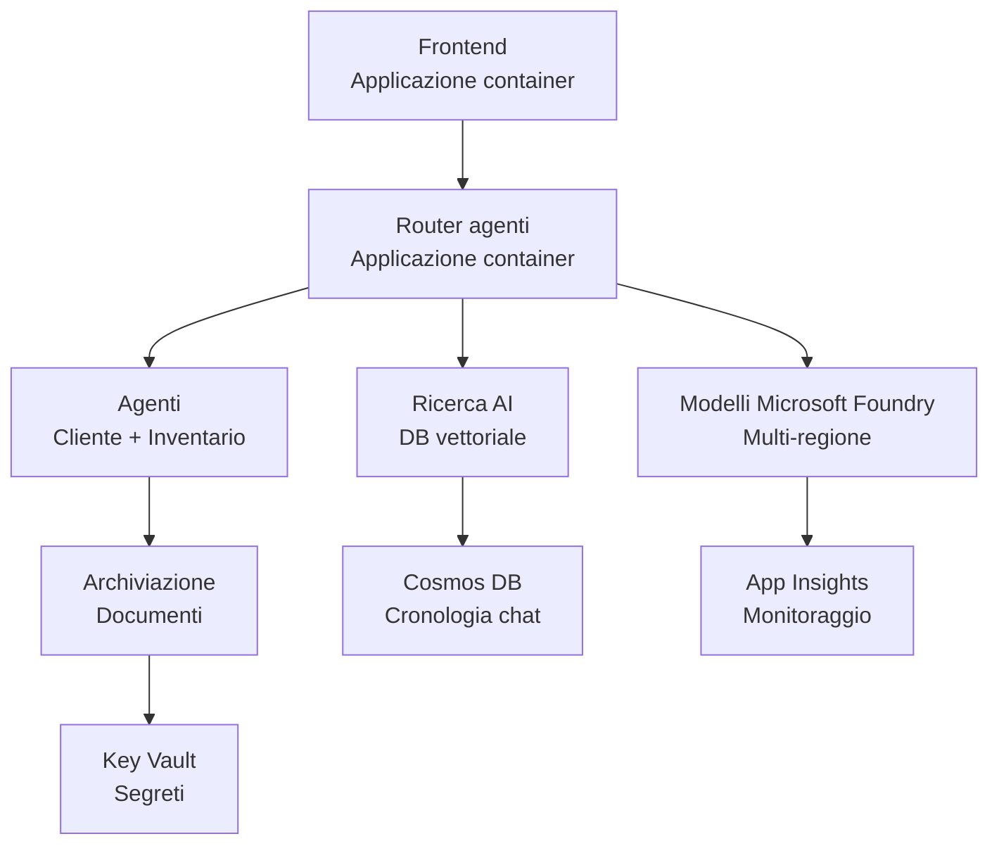

# Retail Multi-Agent Solution - Infrastructure Template

**Capitolo 5: Pacchetto di Distribuzione in Produzione**
- **📚 Home del Corso**: [AZD per principianti](../../README.md)
- **📖 Capitolo correlato**: [Capitolo 5: Soluzioni AI Multi-Agente](../../README.md#-chapter-5-multi-agent-ai-solutions-advanced)
- **📝 Guida allo scenario**: [Architettura completa](../retail-scenario.md)
- **🎯 Distribuzione rapida**: [Distribuzione con un clic](#-quick-deployment)

> **⚠️ SOLO TEMPLATE DI INFRASTRUTTURA**  
> Questo template ARM distribuisce **risorse Azure** per un sistema multi-agente.  
>  
> **Cosa viene distribuito (15-25 minuti):**
> - ✅ Microsoft Foundry Models (gpt-4.1, gpt-4.1-mini, embeddings in 3 regioni)
> - ✅ Servizio Azure AI Search (vuoto, pronto per la creazione di indici)
> - ✅ Container Apps (immagini segnaposto, pronti per il tuo codice)
> - ✅ Storage, Cosmos DB, Key Vault, Application Insights
>  
> **Cosa NON è incluso (richiede sviluppo):**
> - ❌ Codice di implementazione degli agenti (Customer Agent, Inventory Agent)
> - ❌ Logica di instradamento e endpoint API
> - ❌ UI chat frontend
> - ❌ Schemi di indice di ricerca e pipeline di dati
> - ❌ **Sforzo di sviluppo stimato: 80-120 ore**
>  
> **Usa questo template se:**
> - ✅ Vuoi provisioning dell'infrastruttura Azure per un progetto multi-agente
> - ✅ Hai intenzione di sviluppare l'implementazione degli agenti separatamente
> - ✅ Hai bisogno di una baseline di infrastruttura pronta per la produzione
>  
> **Non usarlo se:**
> - ❌ Ti aspetti una demo multi-agente funzionante immediatamente
> - ❌ Cerchi esempi di codice applicativo completi

## Panoramica

Questa directory contiene un template completo di Azure Resource Manager (ARM) per distribuire le **fondamenta infrastrutturali** di un sistema di supporto clienti multi-agente. Il template provvede a tutte le risorse Azure necessarie, configurate e interconnesse correttamente, pronte per lo sviluppo della tua applicazione.

**Dopo la distribuzione, avrai:** Infrastruttura Azure pronta per la produzione  
**Per completare il sistema, serve:** Codice degli agenti, UI frontend e configurazione dei dati (vedi [Guida all'architettura](../retail-scenario.md))

## 🎯 Cosa viene distribuito

### Infrastruttura principale (Stato dopo la distribuzione)

✅ **Microsoft Foundry Models Services** (Pronti per chiamate API)
  - Regione primaria: deployment gpt-4.1 (capacità 20K TPM)
  - Regione secondaria: deployment gpt-4.1-mini (capacità 10K TPM)
  - Regione terziaria: modello di embedding testuale (capacità 30K TPM)
  - Regione di valutazione: modello grader gpt-4.1 (capacità 15K TPM)
  - **Stato:** Completamente funzionante - è possibile effettuare chiamate API immediatamente

✅ **Azure AI Search** (Vuoto - pronto per la configurazione)
  - Capacità di ricerca vettoriale abilitata
  - Tier Standard con 1 partition, 1 replica
  - **Stato:** Servizio in esecuzione, ma richiede la creazione di indici
  - **Azione necessaria:** Creare l'indice di ricerca con il proprio schema

✅ **Account di archiviazione Azure** (Vuoto - pronto per upload)
  - Contenitori Blob: `documents`, `uploads`
  - Configurazione sicura (solo HTTPS, nessun accesso pubblico)
  - **Stato:** Pronto a ricevere file
  - **Azione necessaria:** Caricare i dati dei prodotti e i documenti

⚠️ **Container Apps Environment** (Immagini segnaposto distribuite)
  - App router degli agenti (immagine nginx di default)
  - App frontend (immagine nginx di default)
  - Auto-scaling configurato (0-10 istanze)
  - **Stato:** Container segnaposto in esecuzione
  - **Azione necessaria:** Compilare e distribuire le tue applicazioni agenti

✅ **Azure Cosmos DB** (Vuoto - pronto per i dati)
  - Database e container pre-configurati
  - Ottimizzato per operazioni a bassa latenza
  - TTL abilitato per pulizia automatica
  - **Stato:** Pronto per memorizzare la cronologia delle chat

✅ **Azure Key Vault** (Opzionale - pronto per i segreti)
  - Soft delete abilitato
  - RBAC configurato per managed identities
  - **Stato:** Pronto a memorizzare chiavi API e stringhe di connessione

✅ **Application Insights** (Opzionale - monitoraggio attivo)
  - Connesso a Log Analytics workspace
  - Metriche personalizzate e avvisi configurati
  - **Stato:** Pronto a ricevere telemetria dalle tue app

✅ **Document Intelligence** (Pronto per chiamate API)
  - Tier S0 per carichi di lavoro di produzione
  - **Stato:** Pronto a processare documenti caricati

✅ **Bing Search API** (Pronto per chiamate API)
  - Tier S1 per ricerche in tempo reale
  - **Stato:** Pronto per query di ricerca web

### Modalità di distribuzione

| Mode | OpenAI Capacity | Container Instances | Search Tier | Storage Redundancy | Best For |
|------|-----------------|---------------------|-------------|-------------------|----------|
| **Minimal** | 10K-20K TPM | 0-2 replicas | Basic | LRS (Local) | Dev/test, apprendimento, proof-of-concept |
| **Standard** | 30K-60K TPM | 2-5 replicas | Standard | ZRS (Zone) | Produzione, traffico moderato (<10K utenti) |
| **Premium** | 80K-150K TPM | 5-10 replicas, zone-redundant | Premium | GRS (Geo) | Enterprise, traffico elevato (>10K utenti), SLA 99.99% |

**Impatto sui costi:**
- **Minimal → Standard:** aumento di costo ~4x ($100-370/mo → $420-1,450/mo)
- **Standard → Premium:** aumento di costo ~3x ($420-1,450/mo → $1,150-3,500/mo)
- **Scegli in base a:** carico previsto, requisiti SLA, vincoli di budget

**Pianificazione della capacità:**
- **TPM (Token al minuto):** Totale tra tutti i deployment dei modelli
- **Container Instances:** Intervallo di auto-scaling (repliche min-max)
- **Search Tier:** Influenza le prestazioni delle query e i limiti di dimensione degli indici

## 📋 Prerequisiti

### Strumenti richiesti
1. **Azure CLI** (versione 2.50.0 o superiore)
   ```bash
   az --version  # Verificare la versione
   az login      # Autenticare
   ```

2. **Sottoscrizione Azure attiva** con accesso Owner o Contributor
   ```bash
   az account show  # Verificare l'abbonamento
   ```

### Quote Azure richieste

Prima della distribuzione, verifica quote sufficienti nelle regioni target:

```bash
# Verifica la disponibilità dei modelli Microsoft Foundry nella tua regione
az cognitiveservices account list-skus \
  --kind OpenAI \
  --location eastus2

# Verifica la quota OpenAI (esempio per gpt-4.1)
az cognitiveservices usage list \
  --location eastus2 \
  --query "[?name.value=='OpenAI.Standard.gpt-4.1']"

# Verifica la quota di Container Apps
az provider show \
  --namespace Microsoft.App \
  --query "resourceTypes[?resourceType=='managedEnvironments'].locations"
```

**Quote minime richieste:**
- **Microsoft Foundry Models:** 3-4 deployment di modelli across regioni
  - gpt-4.1: 20K TPM (Token al minuto)
  - gpt-4.1-mini: 10K TPM
  - text-embedding-ada-002: 30K TPM
  - **Nota:** gpt-4.1 potrebbe avere liste d'attesa in alcune regioni - controlla la [disponibilità dei modelli](https://learn.microsoft.com/azure/ai-services/openai/concepts/models)
- **Container Apps:** Managed environment + 2-10 istanze container
- **AI Search:** Tier Standard (Basic non sufficiente per la ricerca vettoriale)
- **Cosmos DB:** Throughput provisionato standard

**Se la quota non è sufficiente:**
1. Vai al Portale di Azure → Quotas → Richiedi aumento
2. Oppure usa Azure CLI:
   ```bash
   az support tickets create \
     --ticket-name "OpenAI-Quota-Increase" \
     --severity "minimal" \
     --description "Request quota increase for Microsoft Foundry Models gpt-4.1 in eastus2"
   ```
3. Considera regioni alternative con disponibilità

## 🚀 Distribuzione rapida

### Opzione 1: Usare Azure CLI

```bash
# Clona o scarica i file del modello
git clone <repository-url>
cd examples/retail-multiagent-arm-template

# Rendi eseguibile lo script di distribuzione
chmod +x deploy.sh

# Distribuisci con le impostazioni predefinite
./deploy.sh -g myResourceGroup

# Distribuisci in produzione con funzionalità premium
./deploy.sh -g myProdRG -e prod -m premium -l eastus2
```

### Opzione 2: Usare il Portale Azure

[](https://portal.azure.com/#create/Microsoft.Template/uri/https%3A%2F%2Fraw.githubusercontent.com%2Fmicrosoft%2Fazd-for-beginners%2Fmain%2Fexamples%2Fretail-multiagent-arm-template%2Fazuredeploy.json)

### Opzione 3: Usare direttamente Azure CLI

```bash
# Crea il gruppo di risorse
az group create --name myResourceGroup --location eastus2

# Distribuisci il modello
az deployment group create \
  --resource-group myResourceGroup \
  --template-file azuredeploy.json \
  --parameters azuredeploy.parameters.json
```

## ⏱️ Timeline di distribuzione

### Cosa aspettarsi

| Phase | Duration | What Happens |
|-------|----------|--------------||
| **Template Validation** | 30-60 seconds | Azure valida la sintassi del template ARM e i parametri |
| **Resource Group Setup** | 10-20 seconds | Crea il resource group (se necessario) |
| **OpenAI Provisioning** | 5-8 minutes | Crea 3-4 account OpenAI e distribuisce i modelli |
| **Container Apps** | 3-5 minutes | Crea l'ambiente e distribuisce container segnaposto |
| **Search & Storage** | 2-4 minutes | Provisiona il servizio AI Search e gli account di storage |
| **Cosmos DB** | 2-3 minutes | Crea il database e configura i container |
| **Monitoring Setup** | 2-3 minutes | Imposta Application Insights e Log Analytics |
| **RBAC Configuration** | 1-2 minutes | Configura managed identities e permessi |
| **Total Deployment** | **15-25 minutes** | Infrastruttura completa pronta |

**Dopo la distribuzione:**
- ✅ **Infrastruttura pronta:** Tutti i servizi Azure provisionati e in esecuzione
- ⏱️ **Sviluppo applicativo:** 80-120 ore (responsabilità tua)
- ⏱️ **Configurazione indici:** 15-30 minuti (richiede il tuo schema)
- ⏱️ **Upload dei dati:** Varia in base alla dimensione del dataset
- ⏱️ **Test & convalida:** 2-4 ore

---

## ✅ Verificare il successo della distribuzione

### Passo 1: Controllare il provisioning delle risorse (2 minuti)

```bash
# Verificare che tutte le risorse siano state distribuite con successo
az resource list \
  --resource-group myResourceGroup \
  --query "[?provisioningState!='Succeeded'].{Name:name, Status:provisioningState, Type:type}" \
  --output table
```

**Atteso:** Tabella vuota (tutte le risorse mostrano stato "Succeeded")

### Passo 2: Verificare i deployment dei Microsoft Foundry Models (3 minuti)

```bash
# Elenca tutti gli account OpenAI
az cognitiveservices account list \
  --resource-group myResourceGroup \
  --query "[?kind=='OpenAI'].{Name:name, Location:location, Status:properties.provisioningState}" \
  --output table

# Controlla le distribuzioni dei modelli per la regione primaria
OPENAI_NAME=$(az cognitiveservices account list \
  --resource-group myResourceGroup \
  --query "[?kind=='OpenAI'] | [0].name" -o tsv)

az cognitiveservices account deployment list \
  --name $OPENAI_NAME \
  --resource-group myResourceGroup \
  --output table
```

**Atteso:** 
- 3-4 account OpenAI (regioni primaria, secondaria, terziaria, di valutazione)
- 1-2 deployment di modello per account (gpt-4.1, gpt-4.1-mini, text-embedding-ada-002)

### Passo 3: Testare gli endpoint dell'infrastruttura (5 minuti)

```bash
# Ottieni gli URL dell'app Container
az containerapp list \
  --resource-group myResourceGroup \
  --query "[].{Name:name, URL:properties.configuration.ingress.fqdn, Status:properties.runningStatus}" \
  --output table

# Endpoint di test del router (verrà restituita un'immagine segnaposto)
ROUTER_URL=$(az containerapp show \
  --name retail-router \
  --resource-group myResourceGroup \
  --query "properties.configuration.ingress.fqdn" -o tsv)

echo "Testing: https://$ROUTER_URL"
curl -I https://$ROUTER_URL || echo "Container running (placeholder image - expected)"
```

**Atteso:** 
- Le Container Apps mostrano stato "Running"
- Il nginx segnaposto risponde con HTTP 200 o 404 (ancora nessun codice applicativo)

### Passo 4: Verificare l'accesso API ai Microsoft Foundry Models (3 minuti)

```bash
# Ottieni endpoint e chiave di OpenAI
OPENAI_ENDPOINT=$(az cognitiveservices account show \
  --name $OPENAI_NAME \
  --resource-group myResourceGroup \
  --query "properties.endpoint" -o tsv)

OPENAI_KEY=$(az cognitiveservices account keys list \
  --name $OPENAI_NAME \
  --resource-group myResourceGroup \
  --query "key1" -o tsv)

# Testa il deployment di gpt-4.1
curl "${OPENAI_ENDPOINT}openai/deployments/gpt-4.1/chat/completions?api-version=2024-08-01-preview" \
  -H "Content-Type: application/json" \
  -H "api-key: $OPENAI_KEY" \
  -d '{
    "messages": [{"role": "user", "content": "Say hello"}],
    "max_tokens": 10
  }'
```

**Atteso:** Risposta JSON con completion di chat (conferma che OpenAI è funzionante)

### Cosa funziona vs. cosa no

**✅ Funzionante dopo la distribuzione:**
- Modelli Microsoft Foundry Models distribuiti e che accettano chiamate API
- Servizio AI Search in esecuzione (vuoto, ancora senza indici)
- Container Apps in esecuzione (immagini nginx segnaposto)
- Account di storage accessibili e pronti per upload
- Cosmos DB pronto per operazioni sui dati
- Application Insights che raccoglie telemetria infrastrutturale
- Key Vault pronto per memorizzazione segreti

**❌ Non funzionante ancora (richiede sviluppo):**
- Endpoint degli agenti (nessun codice applicativo distribuito)
- Funzionalità di chat (richiede frontend + backend)
- Query di ricerca (nessun indice di ricerca creato)
- Pipeline di elaborazione documenti (nessun dato caricato)
- Telemetria personalizzata (richiede instrumentazione dell'applicazione)

**Prossimi passi:** Vedi [Post-Deployment Configuration](#-post-deployment-next-steps) per sviluppare e distribuire la tua applicazione

---

## ⚙️ Opzioni di configurazione

### Parametri del template

| Parameter | Type | Default | Description |
|-----------|------|---------|-------------|
| `projectName` | string | "retail" | Prefisso per tutti i nomi delle risorse |
| `location` | string | Resource group location | Regione primaria di deployment |
| `secondaryLocation` | string | "westus2" | Regione secondaria per deployment multi-regione |
| `tertiaryLocation` | string | "francecentral" | Regione per il modello di embeddings |
| `environmentName` | string | "dev" | Designazione ambiente (dev/staging/prod) |
| `deploymentMode` | string | "standard" | Configurazione di deployment (minimal/standard/premium) |
| `enableMultiRegion` | bool | true | Abilita deployment multi-regione |
| `enableMonitoring` | bool | true | Abilita Application Insights e logging |
| `enableSecurity` | bool | true | Abilita Key Vault e sicurezza avanzata |

### Personalizzare i parametri

Modifica `azuredeploy.parameters.json`:

```json
{
  "$schema": "https://schema.management.azure.com/schemas/2019-04-01/deploymentParameters.json#",
  "contentVersion": "1.0.0.0",
  "parameters": {
    "projectName": {
      "value": "mycompany"
    },
    "environmentName": {
      "value": "prod"
    },
    "deploymentMode": {
      "value": "premium"
    },
    "location": {
      "value": "eastus2"
    }
  }
}
```

## 🏗️ Panoramica dell'architettura


## 📖 Uso dello script di deployment

Lo script `deploy.sh` fornisce un'esperienza di distribuzione interattiva:

```bash
# Mostra aiuto
./deploy.sh --help

# Distribuzione di base
./deploy.sh -g myResourceGroup

# Distribuzione avanzata con impostazioni personalizzate
./deploy.sh \
  -g myProductionRG \
  -p companyname \
  -e prod \
  -m premium \
  -l eastus2

# Distribuzione di sviluppo senza multi-regione
./deploy.sh \
  -g myDevRG \
  -e dev \
  -m minimal \
  --no-multi-region \
  --no-security
```

### Funzionalità dello script

- ✅ **Validazione prerequisiti** (Azure CLI, stato di login, file del template)
- ✅ **Gestione del resource group** (crea se non esiste)
- ✅ **Validazione del template** prima della distribuzione
- ✅ **Monitoraggio del progresso** con output colorato
- ✅ **Output della distribuzione** visualizzati
- ✅ **Guida post-distribuzione**

## 📊 Monitoraggio della distribuzione

### Controllare lo stato della distribuzione

```bash
# Elenca le distribuzioni
az deployment group list --resource-group myResourceGroup --output table

# Ottieni i dettagli della distribuzione
az deployment group show \
  --resource-group myResourceGroup \
  --name retail-deployment-YYYYMMDD-HHMMSS

# Monitora l'avanzamento della distribuzione
az deployment group create \
  --resource-group myResourceGroup \
  --template-file azuredeploy.json \
  --parameters azuredeploy.parameters.json \
  --verbose
```

### Output della distribuzione

Dopo una distribuzione riuscita, sono disponibili i seguenti output:

- **Frontend URL**: Endpoint pubblico per l'interfaccia web
- **Router URL**: Endpoint API per l'agent router
- **OpenAI Endpoints**: Endpoint dei servizi OpenAI primario e secondario
- **Search Service**: Endpoint del servizio Azure AI Search
- **Storage Account**: Nome dell'account di storage per i documenti
- **Key Vault**: Nome del Key Vault (se abilitato)
- **Application Insights**: Nome del servizio di monitoraggio (se abilitato)

## 🔧 Post-Deployment: Prossimi passi
> **📝 Importante:** L'infrastruttura è distribuita, ma è necessario sviluppare e distribuire il codice dell'applicazione.

### Fase 1: Sviluppare le applicazioni agent (Tua responsabilità)

The ARM template creates **empty Container Apps** with placeholder nginx images. You must:

**Sviluppo richiesto:**
1. **Agent Implementation** (30-40 hours)
   - Agente per l'assistenza clienti con integrazione gpt-4.1
   - Agente di inventario con integrazione gpt-4.1-mini
   - Logica di instradamento degli agenti

2. **Frontend Development** (20-30 hours)
   - Interfaccia utente chat (React/Vue/Angular)
   - Funzionalità di caricamento file
   - Rendering e formattazione delle risposte

3. **Backend Services** (12-16 hours)
   - Router FastAPI o Express
   - Middleware di autenticazione
   - Integrazione della telemetria

**Vedi:** [Guida all'architettura](../retail-scenario.md) per modelli di implementazione dettagliati ed esempi di codice

### Fase 2: Configurare l'indice di ricerca AI (15-30 minutes)

Crea un indice di ricerca che corrisponda al tuo modello di dati:

```bash
# Ottieni i dettagli del servizio di ricerca
SEARCH_NAME=$(az search service list \
  --resource-group myResourceGroup \
  --query "[0].name" -o tsv)

SEARCH_KEY=$(az search admin-key show \
  --service-name $SEARCH_NAME \
  --resource-group myResourceGroup \
  --query "primaryKey" -o tsv)

# Crea un indice con il tuo schema (esempio)
curl -X POST "https://${SEARCH_NAME}.search.windows.net/indexes?api-version=2023-11-01" \
  -H "Content-Type: application/json" \
  -H "api-key: ${SEARCH_KEY}" \
  -d '{
    "name": "products",
    "fields": [
      {"name": "id", "type": "Edm.String", "key": true},
      {"name": "title", "type": "Edm.String", "searchable": true},
      {"name": "content", "type": "Edm.String", "searchable": true},
      {"name": "category", "type": "Edm.String", "filterable": true},
      {"name": "content_vector", "type": "Collection(Edm.Single)", 
       "searchable": true, "dimensions": 1536, "vectorSearchProfile": "default"}
    ],
    "vectorSearch": {
      "algorithms": [{"name": "default", "kind": "hnsw"}],
      "profiles": [{"name": "default", "algorithm": "default"}]
    }
  }'
```

**Risorse:**
- [Progettazione dello schema dell'indice di ricerca AI](https://learn.microsoft.com/azure/search/search-what-is-an-index)
- [Configurazione della ricerca vettoriale](https://learn.microsoft.com/azure/search/vector-search-how-to-create-index)

### Fase 3: Carica i tuoi dati (Time varies)

Una volta che hai dati di prodotto e documenti:

```bash
# Ottieni i dettagli dell'account di archiviazione
STORAGE_NAME=$(az storage account list \
  --resource-group myResourceGroup \
  --query "[0].name" -o tsv)

STORAGE_KEY=$(az storage account keys list \
  --account-name $STORAGE_NAME \
  --resource-group myResourceGroup \
  --query "[0].value" -o tsv)

# Carica i tuoi documenti
az storage blob upload-batch \
  --destination documents \
  --source /path/to/your/product/docs \
  --account-name $STORAGE_NAME \
  --account-key $STORAGE_KEY

# Esempio: caricamento di un singolo file
az storage blob upload \
  --container-name documents \
  --name "product-manual.pdf" \
  --file /path/to/product-manual.pdf \
  --account-name $STORAGE_NAME \
  --account-key $STORAGE_KEY
```

### Fase 4: Crea e distribuisci le tue applicazioni (8-12 hours)

Una volta sviluppato il codice dei tuoi agenti:

```bash
# 1. Creare Azure Container Registry (se necessario)
az acr create \
  --name myregistry \
  --resource-group myResourceGroup \
  --sku Basic

# 2. Costruire e caricare l'immagine del router dell'agente
docker build -t myregistry.azurecr.io/agent-router:v1 /path/to/your/router/code
az acr login --name myregistry
docker push myregistry.azurecr.io/agent-router:v1

# 3. Costruire e caricare l'immagine del frontend
docker build -t myregistry.azurecr.io/frontend:v1 /path/to/your/frontend/code
docker push myregistry.azurecr.io/frontend:v1

# 4. Aggiornare le Container Apps con le tue immagini
az containerapp update \
  --name retail-router \
  --resource-group myResourceGroup \
  --image myregistry.azurecr.io/agent-router:v1

az containerapp update \
  --name retail-frontend \
  --resource-group myResourceGroup \
  --image myregistry.azurecr.io/frontend:v1

# 5. Configurare le variabili d'ambiente
az containerapp update \
  --name retail-router \
  --resource-group myResourceGroup \
  --set-env-vars \
    OPENAI_ENDPOINT=secretref:openai-endpoint \
    OPENAI_KEY=secretref:openai-key \
    SEARCH_ENDPOINT=secretref:search-endpoint \
    SEARCH_KEY=secretref:search-key
```

### Fase 5: Testa la tua applicazione (2-4 hours)

```bash
# Ottieni l'URL della tua applicazione
ROUTER_URL=$(az containerapp show \
  --name retail-router \
  --resource-group myResourceGroup \
  --query "properties.configuration.ingress.fqdn" -o tsv)

# Endpoint dell'agente di test (una volta che il tuo codice è distribuito)
curl -X POST "https://${ROUTER_URL}/chat" \
  -H "Content-Type: application/json" \
  -d '{
    "message": "Hello, I need help with my order",
    "agent": "customer"
  }'

# Controlla i log dell'applicazione
az containerapp logs show \
  --name retail-router \
  --resource-group myResourceGroup \
  --follow
```

### Risorse per l'implementazione

**Architettura e design:**
- 📖 [Guida completa all'architettura](../retail-scenario.md) - Modelli di implementazione dettagliati
- 📖 [Modelli di progettazione multi-agente](https://learn.microsoft.com/azure/architecture/ai-ml/guide/multi-agent-systems)

**Esempi di codice:**
- 🔗 [Esempio chat modelli Microsoft Foundry](https://github.com/Azure-Samples/azure-search-openai-demo) - pattern RAG
- 🔗 [Semantic Kernel](https://github.com/microsoft/semantic-kernel) - Framework per agent (C#)
- 🔗 [LangChain Azure](https://github.com/langchain-ai/langchain) - Orchestrazione degli agenti (Python)
- 🔗 [AutoGen](https://github.com/microsoft/autogen) - Conversazioni multi-agente

**Stima totale dello sforzo:**
- Distribuzione infrastruttura: 15-25 minutes (✅ Completato)
- Sviluppo dell'applicazione: 80-120 hours (🔨 Il tuo lavoro)
- Test e ottimizzazione: 15-25 hours (🔨 Il tuo lavoro)

## 🛠️ Risoluzione dei problemi

### Problemi comuni

#### 1. Quota modelli Microsoft Foundry superata

```bash
# Controlla l'utilizzo corrente della quota
az cognitiveservices usage list --location eastus2

# Richiedi un aumento della quota
az support tickets create \
  --ticket-name "OpenAI-Quota-Increase" \
  --severity "minimal" \
  --description "Request quota increase for Microsoft Foundry Models in region X"
```

#### 2. Distribuzione Container Apps non riuscita

```bash
# Controlla i log dell'applicazione del contenitore
az containerapp logs show \
  --name retail-router \
  --resource-group myResourceGroup \
  --follow

# Riavvia l'applicazione del contenitore
az containerapp revision restart \
  --name retail-router \
  --resource-group myResourceGroup
```

#### 3. Inizializzazione del servizio di ricerca

```bash
# Verifica lo stato del servizio di ricerca
az search service show \
  --name <search-service-name> \
  --resource-group myResourceGroup

# Testare la connettività del servizio di ricerca
curl -X GET "https://<search-service-name>.search.windows.net/indexes?api-version=2023-11-01" \
  -H "api-key: <search-admin-key>"
```

### Convalida della distribuzione

```bash
# Verificare che tutte le risorse siano create
az resource list \
  --resource-group myResourceGroup \
  --output table

# Controllare lo stato di salute delle risorse
az resource list \
  --resource-group myResourceGroup \
  --query "[?provisioningState!='Succeeded'].{Name:name, Status:provisioningState, Type:type}" \
  --output table
```

## 🔐 Considerazioni sulla sicurezza

### Gestione delle chiavi
- Tutti i segreti sono archiviati in Azure Key Vault (quando abilitato)
- I container app utilizzano managed identity per l'autenticazione
- Gli storage account hanno impostazioni predefinite sicure (solo HTTPS, nessun accesso pubblico ai blob)

### Sicurezza di rete
- I container app utilizzano rete interna dove possibile
- Il servizio di ricerca è configurato con l'opzione private endpoints
- Cosmos DB configurato con le autorizzazioni minime necessarie

### Configurazione RBAC
```bash
# Assegna i ruoli necessari per l'identità gestita
az role assignment create \
  --assignee <container-app-managed-identity> \
  --role "Cognitive Services OpenAI User" \
  --scope <openai-resource-id>
```

## 💰 Ottimizzazione dei costi

### Stime dei costi (mensili, USD)

| Modalità | OpenAI | Container Apps | Ricerca | Archiviazione | Tot. stim. |
|------|--------|----------------|--------|---------|------------|
| Minimale | $50-200 | $20-50 | $25-100 | $5-20 | $100-370 |
| Standard | $200-800 | $100-300 | $100-300 | $20-50 | $420-1450 |
| Premium | $500-2000 | $300-800 | $300-600 | $50-100 | $1150-3500 |

### Monitoraggio dei costi

```bash
# Configura avvisi sul budget
az consumption budget create \
  --account-name <subscription-id> \
  --budget-name "retail-budget" \
  --amount 500 \
  --time-grain Monthly \
  --start-date 2024-01-01 \
  --end-date 2024-12-31
```

## 🔄 Aggiornamenti e manutenzione

### Aggiornamenti del template
- Versiona i file del template ARM
- Testa le modifiche prima nell'ambiente di sviluppo
- Usa la modalità di deployment incrementale per gli aggiornamenti

### Aggiornamenti delle risorse
```bash
# Aggiorna con nuovi parametri
az deployment group create \
  --resource-group myResourceGroup \
  --template-file azuredeploy.json \
  --parameters azuredeploy.parameters.json \
  --mode Incremental
```

### Backup e ripristino
- Backup automatico di Cosmos DB abilitato
- Soft delete di Key Vault abilitato
- Le revisioni dei container app sono mantenute per il rollback

## 📞 Supporto

- **Problemi del template**: [GitHub Issues](https://github.com/microsoft/azd-for-beginners/issues)
- **Supporto Azure**: [Azure Support Portal](https://portal.azure.com/#blade/Microsoft_Azure_Support/HelpAndSupportBlade)
- **Comunità**: [Azure AI Discord](https://discord.gg/microsoft-azure)

---

**⚡ Pronto per distribuire la tua soluzione multi-agente?**

Inizia con: `./deploy.sh -g myResourceGroup`

---

<!-- CO-OP TRANSLATOR DISCLAIMER START -->
**Dichiarazione di non responsabilità**:
Questo documento è stato tradotto utilizzando il servizio di traduzione AI [Co-op Translator](https://github.com/Azure/co-op-translator). Pur impegnandoci per l'accuratezza, si prega di notare che le traduzioni automatiche possono contenere errori o imprecisioni. Il documento originale nella sua lingua dovrebbe essere considerato la fonte autorevole. Per informazioni critiche, si raccomanda una traduzione professionale effettuata da un traduttore umano. Non siamo responsabili per eventuali malintesi o interpretazioni errate derivanti dall'uso di questa traduzione.
<!-- CO-OP TRANSLATOR DISCLAIMER END -->