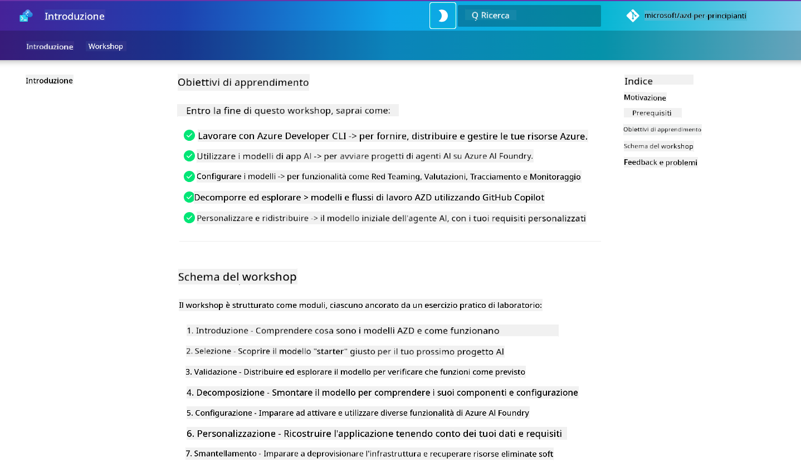

<!--
CO_OP_TRANSLATOR_METADATA:
{
  "original_hash": "9cc966416ab431c38b2ab863884b196c",
  "translation_date": "2025-09-24T14:43:47+00:00",
  "source_file": "workshop/README.md",
  "language_code": "it"
}
-->
# Workshop AZD per Sviluppatori AI

Benvenuto al workshop pratico per imparare Azure Developer CLI (AZD) con un focus sul deployment di applicazioni AI. Questo workshop ti aiuterà a comprendere l'utilizzo dei template AZD in 3 passaggi:

1. **Scoperta** - trova il template giusto per te.
1. **Deployment** - distribuisci e verifica che funzioni.
1. **Personalizzazione** - modifica e adatta il template alle tue esigenze!

Durante il workshop, ti verranno introdotti anche strumenti e flussi di lavoro essenziali per sviluppatori, per semplificare il tuo percorso di sviluppo end-to-end.

<br/>

## Guida Basata su Browser

Le lezioni del workshop sono in formato Markdown. Puoi navigarle direttamente su GitHub - oppure avviare un'anteprima basata su browser come mostrato nello screenshot qui sotto.



Per utilizzare questa opzione - fai un fork del repository nel tuo profilo e avvia GitHub Codespaces. Una volta attivo il terminale di VS Code, digita questo comando:

```bash title="" linenums="0"
mkdocs serve > /dev/null 2>&1 &
```

In pochi secondi, vedrai un dialogo pop-up. Seleziona l'opzione `Open in browser`. La guida basata su web si aprirà ora in una nuova scheda del browser. Alcuni vantaggi di questa anteprima:

1. **Ricerca integrata** - trova rapidamente parole chiave o lezioni.
1. **Icona di copia** - passa il mouse sui blocchi di codice per vedere questa opzione.
1. **Cambio tema** - alterna tra temi scuri e chiari.
1. **Ottieni aiuto** - clicca sull'icona Discord nel footer per unirti!

<br/>

## Panoramica del Workshop

**Durata:** 3-4 ore  
**Livello:** Principiante a Intermedio  
**Prerequisiti:** Familiarità con Azure, concetti di AI, VS Code e strumenti da riga di comando.

Questo è un workshop pratico dove impari facendo. Una volta completati gli esercizi, ti consigliamo di rivedere il curriculum AZD For Beginners per continuare il tuo percorso di apprendimento su sicurezza e produttività.

| Tempo | Modulo  | Obiettivo |
|:---|:---|:---|
| 15 min | [Introduzione](docs/instructions/0-Introduction.md) | Imposta il contesto, comprendi gli obiettivi |
| 30 min | [Seleziona Template AI](docs/instructions/1-Select-AI-Template.md) | Esplora le opzioni e scegli un template iniziale | 
| 30 min | [Valida Template AI](docs/instructions/2-Validate-AI-Template.md) | Distribuisci la soluzione predefinita su Azure |
| 30 min | [Decomponi Template AI](docs/instructions/3-Deconstruct-AI-Template.md) | Esplora la struttura e la configurazione |
| 30 min | [Configura Template AI](docs/instructions/4-Configure-AI-Template.md) | Attiva e prova le funzionalità disponibili |
| 30 min | [Personalizza Template AI](docs/instructions/5-Customize-AI-Template.md) | Adatta il template alle tue esigenze |
| 30 min | [Smantella Infrastruttura](docs/instructions/6-Teardown-Infrastructure.md) | Pulisci e rilascia le risorse |
| 15 min | [Conclusione e Prossimi Passi](docs/instructions/7-Wrap-up.md) | Risorse di apprendimento, sfida del workshop |

<br/>

## Cosa Imparerai

Pensa al Template AZD come a un sandbox di apprendimento per esplorare varie capacità e strumenti per lo sviluppo end-to-end su Azure AI Foundry. Alla fine del workshop, dovresti avere una comprensione intuitiva di vari strumenti e concetti in questo contesto.

| Concetto  | Obiettivo |
|:---|:---|
| **Azure Developer CLI** | Comprendere i comandi e i flussi di lavoro dello strumento |
| **Template AZD**| Comprendere la struttura del progetto e la configurazione |
| **Azure AI Agent**| Provisioning e distribuzione di un progetto Azure AI Foundry |
| **Azure AI Search**| Abilitare l'ingegneria del contesto con gli agenti |
| **Osservabilità**| Esplorare tracciamento, monitoraggio e valutazioni |
| **Red Teaming**| Esplorare test avversari e mitigazioni |

<br/>

## Struttura del Workshop

Il workshop è strutturato per guidarti in un percorso che va dalla scoperta del template, al deployment, alla decomposizione e alla personalizzazione - utilizzando il template ufficiale [Getting Started with AI Agents](https://github.com/Azure-Samples/get-started-with-ai-agents) come base.

### [Modulo 1: Seleziona Template AI](docs/instructions/1-Select-AI-Template.md) (30 min)

- Cosa sono i Template AI?
- Dove posso trovare i Template AI?
- Come posso iniziare a costruire AI Agents?
- **Lab**: Quickstart con GitHub Codespaces

### [Modulo 2: Valida Template AI](docs/instructions/2-Validate-AI-Template.md) (30 min)

- Qual è l'architettura del Template AI?
- Qual è il flusso di lavoro di sviluppo AZD?
- Come posso ottenere aiuto con lo sviluppo AZD?
- **Lab**: Distribuisci e valida il template AI Agents

### [Modulo 3: Decomponi Template AI](docs/instructions/3-Deconstruct-AI-Template.md) (30 min)

- Esplora il tuo ambiente in `.azure/` 
- Esplora la configurazione delle risorse in `infra/` 
- Esplora la configurazione AZD in `azure.yaml`
- **Lab**: Modifica le variabili d'ambiente e ridistribuisci

### [Modulo 4: Configura Template AI](docs/instructions/4-Configure-AI-Template.md) (30 min)
- Esplora: Retrieval Augmented Generation
- Esplora: Valutazione degli agenti e Red Teaming
- Esplora: Tracciamento e monitoraggio
- **Lab**: Esplora AI Agent + Osservabilità 

### [Modulo 5: Personalizza Template AI](docs/instructions/5-Customize-AI-Template.md) (30 min)
- Definisci: PRD con requisiti di scenario
- Configura: Variabili d'ambiente per AZD
- Implementa: Lifecycle Hooks per attività aggiuntive
- **Lab**: Personalizza il template per il mio scenario

### [Modulo 6: Smantella Infrastruttura](docs/instructions/6-Teardown-Infrastructure.md) (30 min)
- Riepilogo: Cosa sono i Template AZD?
- Riepilogo: Perché usare Azure Developer CLI?
- Prossimi Passi: Prova un template diverso!
- **Lab**: Deprovisiona infrastruttura e pulizia

<br/>

## Sfida del Workshop

Vuoi metterti alla prova e fare di più? Ecco alcune idee di progetto - oppure condividi le tue idee con noi!!

| Progetto | Descrizione |
|:---|:---|
|1. **Decomponi un Template AI Complesso** | Usa il flusso di lavoro e gli strumenti che abbiamo illustrato e verifica se riesci a distribuire, validare e personalizzare un template di soluzione AI diverso. _Cosa hai imparato?_|
|2. **Personalizza con il tuo Scenario**  | Prova a scrivere un PRD (Product Requirements Document) per uno scenario diverso. Poi usa GitHub Copilot nel tuo repository di template in Agent Model - e chiedigli di generare un flusso di lavoro di personalizzazione per te. _Cosa hai imparato? Come potresti migliorare queste proposte?_|
| | |

## Hai feedback?

1. Pubblica un issue su questo repository - taggalo `Workshop` per comodità.
1. Unisciti al Discord di Azure AI Foundry - connettiti con i tuoi colleghi!


| | | 
|:---|:---|
| **📚 Home del Corso**| [AZD For Beginners](../README.md)|
| **📖 Documentazione** | [Introduzione ai template AI](https://learn.microsoft.com/en-us/azure/ai-foundry/how-to/develop/ai-template-get-started)|
| **🛠️Template AI** | [Template Azure AI Foundry](https://ai.azure.com/templates) |
|**🚀 Prossimi Passi** | [Accetta la Sfida](../../../workshop) |
| | |

<br/>

---

**Precedente:** [Guida alla Risoluzione dei Problemi AI](../docs/troubleshooting/ai-troubleshooting.md) | **Successivo:** Inizia con [Lab 1: Fondamenti AZD](../../../workshop/lab-1-azd-basics)

**Pronto a iniziare a costruire applicazioni AI con AZD?**

[Inizia Lab 1: Fondamenti AZD →](./lab-1-azd-basics/README.md)

---

