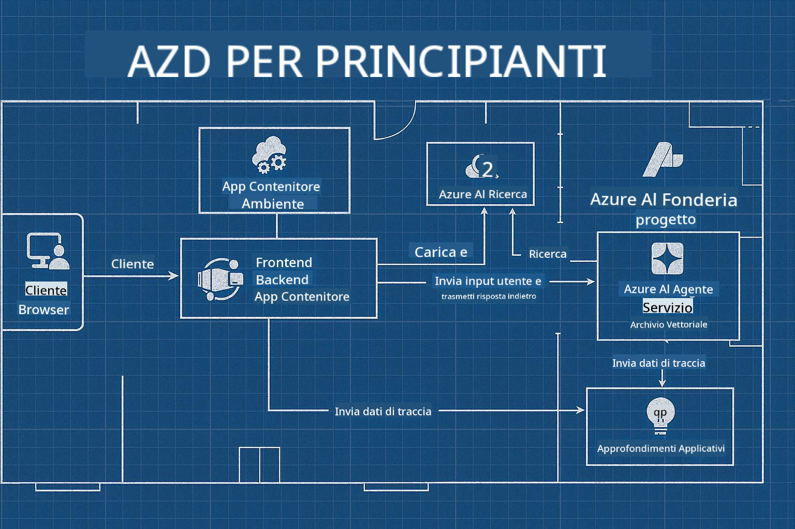

<!--
CO_OP_TRANSLATOR_METADATA:
{
  "original_hash": "245d24997bbcf2bae93bb2a503845d37",
  "translation_date": "2025-09-23T11:52:47+00:00",
  "source_file": "workshop/README.md",
  "language_code": "it"
}
-->
# Workshop AZD per Sviluppatori AI

## Template AZD

Costruire una soluzione AI di livello aziendale per il tuo scenario specifico è molto simile a costruire la tua casa. Puoi progettarla da solo, costruirla mattone dopo mattone e assumerti la responsabilità di garantire che rispetti tutte le linee guida di governance e sviluppo.

**OPPURE ....**

Puoi lavorare con un architetto che ti fornisca un _progetto_ per una casa di partenza e poi collaborare con lui per _personalizzarla_ in base alle tue esigenze. Questo ti permette di concentrarti su ciò che rende **la tua casa** speciale, lasciando che esperti si occupino di cablaggio, impianti idraulici e altre dipendenze sottostanti.

**Questo è l'approccio dietro [AI App Templates](https://ai.azure.com/templates)** - una serie di progetti per costruire diversi tipi di "case" applicative AI a seconda delle tue esigenze principali e delle dipendenze.

## Personalizzazione dei Template

I template sono progettati per funzionare con [Azure AI Foundry](https://ai.azure.com). Pensa a questa piattaforma come al tuo "impresario edile" con accesso a tutte le risorse, strumenti ed esperienze necessarie per portare a termine il lavoro!

Tutto ciò che devi fare è scegliere [i tuoi template di partenza](https://learn.microsoft.com/en-us/azure/ai-foundry/how-to/develop/ai-template-get-started). Ad esempio, ci concentreremo sul template _Get Started with AI Agents_ per costruire una "Casa AI Agentica" dotata di funzionalità come AI Search, Red Teaming, Valutazioni, Tracciamento, Monitoraggio e altro!



Tutto ciò che serve è prenotare del tempo con l'architetto, che ti guiderà nel processo di personalizzazione. [GitHub Copilot for Azure](https://learn.microsoft.com/en-us/azure/developer/github-copilot-azure/get-started) può essere quella guida. Basta "chattare con lui" per:

- Scoprire le funzionalità di Azure nel tuo template
- Distribuire risorse Azure
- Ottenere informazioni sulla tua distribuzione
- Diagnosticare e risolvere problemi!

In questo workshop, impareremo a _decomporre_ il template esistente (per capire cosa offre), quindi a _personalizzarlo_ (per soddisfare i nostri requisiti) - un passo alla volta.

I Template AI **fanno funzionare tutto** - completando il workshop imparerai a **farlo tuo**

----

**Navigazione del Workshop**
- **📚 Home del Corso**: [AZD Per Principianti](../README.md)
- **📖 Capitoli Correlati**: Copre [Capitolo 1](../README.md#-chapter-1-foundation--quick-start), [Capitolo 2](../README.md#-chapter-2-ai-first-development-recommended-for-ai-developers), e [Capitolo 5](../README.md#-chapter-5-multi-agent-ai-solutions-advanced)
- **🛠️ Laboratorio Pratico**: [Laboratorio AI Workshop](../docs/ai-foundry/ai-workshop-lab.md)
- **🚀 Prossimi Passi**: [Moduli del Workshop](../../../workshop)

Benvenuto al workshop pratico per imparare Azure Developer CLI (AZD) con un focus sul deployment di applicazioni AI. Questo workshop è progettato per portarti dalle basi di AZD alla distribuzione di soluzioni AI pronte per la produzione.

## Panoramica del Workshop

**Durata:** 2-3 ore  
**Livello:** Principiante a Intermedio  
**Prerequisiti:** Conoscenza di base di Azure, strumenti da riga di comando e concetti AI

### Cosa Imparerai

- **Fondamenti di AZD**: Comprendere l'Infrastructure as Code con AZD
- 🤖 **Integrazione di Servizi AI**: Distribuire Azure OpenAI, AI Search e altri servizi AI
- **Distribuzione di Container**: Utilizzare Azure Container Apps per applicazioni AI
- **Best Practice di Sicurezza**: Implementare Managed Identity e configurazioni sicure
- **Monitoraggio e Osservabilità**: Configurare Application Insights per carichi di lavoro AI
- **Pattern di Produzione**: Strategie di distribuzione pronte per l'azienda

## Struttura del Workshop

### Modulo 1: Fondamenti di AZD (30 minuti)
- Installazione e configurazione di AZD
- Comprendere la struttura del progetto AZD
- La tua prima distribuzione con AZD
- **Lab**: Distribuire una semplice applicazione web

### Modulo 2: Integrazione con Azure OpenAI (45 minuti)
- Configurazione delle risorse Azure OpenAI
- Strategie di distribuzione dei modelli
- Configurazione dell'accesso API e autenticazione
- **Lab**: Distribuire un'applicazione di chat con GPT-4

### Modulo 3: Applicazioni RAG (45 minuti)
- Integrazione con Azure AI Search
- Elaborazione documenti con Azure Document Intelligence
- Embedding vettoriali e ricerca semantica
- **Lab**: Costruire un sistema di Q&A per documenti

### Modulo 4: Distribuzione in Produzione (30 minuti)
- Configurazione di Container Apps
- Ottimizzazione delle prestazioni e scalabilità
- Monitoraggio e logging
- **Lab**: Distribuire in produzione con osservabilità

### Modulo 5: Pattern Avanzati (15 minuti)
- Distribuzioni multi-ambiente
- Integrazione CI/CD
- Strategie di ottimizzazione dei costi
- **Conclusione**: Checklist per la prontezza alla produzione

## Prerequisiti

### Strumenti Richiesti

Installa questi strumenti prima del workshop:

```bash
# Azure Developer CLI
curl -fsSL https://aka.ms/install-azd.sh | bash

# Azure CLI
curl -sL https://aka.ms/InstallAzureCLIDeb | sudo bash

# Git
sudo apt-get install git

# Docker
curl -fsSL https://get.docker.com -o get-docker.sh
sudo sh get-docker.sh

# Python 3.10+
sudo apt-get install python3.10 python3.10-venv python3-pip
```

### Configurazione Account Azure

1. **Sottoscrizione Azure**: [Iscriviti gratuitamente](https://azure.microsoft.com/free/)
2. **Accesso ad Azure OpenAI**: [Richiedi accesso](https://aka.ms/oai/access)
3. **Permessi Richiesti**:
   - Ruolo di Contributor sulla sottoscrizione o sul gruppo di risorse
   - User Access Administrator (per assegnazioni RBAC)

### Verifica dei Prerequisiti

Esegui questo script per verificare la tua configurazione:

```bash
#!/bin/bash
echo "Verifying workshop prerequisites..."

# Check AZD installation
if command -v azd &> /dev/null; then
    echo "✅ Azure Developer CLI: $(azd --version)"
else
    echo "❌ Azure Developer CLI not found"
fi

# Check Azure CLI
if command -v az &> /dev/null; then
    echo "✅ Azure CLI: $(az --version | head -n1)"
else
    echo "❌ Azure CLI not found"
fi

# Check Docker
if command -v docker &> /dev/null; then
    echo "✅ Docker: $(docker --version)"
else
    echo "❌ Docker not found"
fi

# Check Python
if command -v python3 &> /dev/null; then
    echo "✅ Python: $(python3 --version)"
else
    echo "❌ Python 3 not found"
fi

# Check Azure login
if az account show &> /dev/null; then
    echo "✅ Azure: Logged in as $(az account show --query user.name -o tsv)"
else
    echo "❌ Azure: Not logged in (run 'az login')"
fi

echo "Setup verification complete!"
```

## Materiali del Workshop

### Esercizi di Laboratorio

Ogni modulo include laboratori pratici con codice iniziale e istruzioni passo-passo:

- **[lab-1-azd-basics/](../../../workshop/lab-1-azd-basics)** - La tua prima distribuzione con AZD
- **[lab-2-openai-chat/](../../../workshop/lab-2-openai-chat)** - Applicazione di chat con Azure OpenAI
- **[lab-3-rag-search/](../../../workshop/lab-3-rag-search)** - Applicazione RAG con AI Search
- **[lab-4-production/](../../../workshop/lab-4-production)** - Pattern di distribuzione in produzione
- **[lab-5-advanced/](../../../workshop/lab-5-advanced)** - Scenari di distribuzione avanzati

### Materiali di Riferimento

- **[Guida all'Integrazione con AI Foundry](../docs/ai-foundry/azure-ai-foundry-integration.md)** - Pattern di integrazione completi
- **[Guida alla Distribuzione di Modelli AI](../docs/ai-foundry/ai-model-deployment.md)** - Best practice per la distribuzione di modelli
- **[Pratiche AI in Produzione](../docs/ai-foundry/production-ai-practices.md)** - Pattern di distribuzione aziendali
- **[Guida alla Risoluzione dei Problemi AI](../docs/troubleshooting/ai-troubleshooting.md)** - Problemi comuni e soluzioni

### Template di Esempio

Template di avvio rapido per scenari AI comuni:

```
workshop/templates/
├── minimal-chat/          # Basic OpenAI chat app
├── rag-application/       # RAG with AI Search
├── multi-model/          # Multiple AI services
└── production-ready/     # Enterprise template
```

## Iniziare

### Opzione 1: GitHub Codespaces (Consigliato)

Il modo più veloce per iniziare il workshop:

[](https://github.com/codespaces/new?hide_repo_select=true&ref=main&repo=YOUR_REPO_ID)

### Opzione 2: Sviluppo Locale

1. **Clona il repository del workshop:**
```bash
git clone https://github.com/YOUR_ORG/AZD-for-beginners.git
cd AZD-for-beginners/workshop
```

2. **Accedi ad Azure:**
```bash
az login
azd auth login
```

3. **Inizia con il Lab 1:**
```bash
cd lab-1-azd-basics
cat README.md  # Follow the instructions
```

### Opzione 3: Workshop con Istruttore

Se stai partecipando a una sessione con istruttore:

- 🎥 **Registrazione del Workshop**: [Disponibile su richiesta](https://aka.ms/azd-ai-workshop)
- 💬 **Community su Discord**: [Unisciti per supporto live](https://aka.ms/foundry/discord)
- **Feedback sul Workshop**: [Condividi la tua esperienza](https://aka.ms/azd-workshop-feedback)

## Cronologia del Workshop

### Apprendimento Autonomo (3 ore)

```
⏰ 00:00 - 00:30  Module 1: AZD Foundations
⏰ 00:30 - 01:15  Module 2: Azure OpenAI Integration
⏰ 01:15 - 02:00  Module 3: RAG Applications
⏰ 02:00 - 02:30  Module 4: Production Deployment
⏰ 02:30 - 02:45  Module 5: Advanced Patterns
⏰ 02:45 - 03:00  Q&A and Next Steps
```

### Sessione con Istruttore (2,5 ore)

```
⏰ 00:00 - 00:15  Welcome & Prerequisites Check
⏰ 00:15 - 00:40  Module 1: Live Demo + Lab
⏰ 00:40 - 01:20  Module 2: OpenAI Integration
⏰ 01:20 - 01:30  Break
⏰ 01:30 - 02:10  Module 3: RAG Applications
⏰ 02:10 - 02:30  Module 4: Production Patterns
⏰ 02:30 - 02:45  Module 5: Advanced Topics
⏰ 02:45 - 03:00  Q&A and Resources
```

## Criteri di Successo

Alla fine di questo workshop, sarai in grado di:

✅ **Distribuire applicazioni AI** utilizzando i template AZD  
✅ **Configurare Azure OpenAI** con la giusta sicurezza  
✅ **Costruire applicazioni RAG** con integrazione di Azure AI Search  
✅ **Implementare pattern di produzione** per carichi di lavoro AI aziendali  
✅ **Monitorare e risolvere problemi** nelle distribuzioni di applicazioni AI  
✅ **Applicare strategie di ottimizzazione dei costi** per carichi di lavoro AI  

## Community e Supporto

### Durante il Workshop

- 🙋 **Domande**: Usa la chat del workshop o alza la mano
- 🐛 **Problemi**: Consulta la [guida alla risoluzione dei problemi](../docs/troubleshooting/ai-troubleshooting.md)
- **Consigli**: Condividi scoperte con gli altri partecipanti

### Dopo il Workshop

- 💬 **Discord**: [Community Azure AI Foundry](https://aka.ms/foundry/discord)
- **GitHub Issues**: [Segnala problemi con i template](https://github.com/YOUR_ORG/AZD-for-beginners/issues)
- 📧 **Feedback**: [Modulo di valutazione del workshop](https://aka.ms/azd-workshop-feedback)

## Prossimi Passi

### Continua a Imparare

1. **Scenari Avanzati**: Esplora [distribuzioni multi-regione](../docs/ai-foundry/production-ai-practices.md#multi-region-deployment)
2. **Integrazione CI/CD**: Configura [workflow GitHub Actions](../docs/deployment/github-actions.md)
3. **Template Personalizzati**: Crea i tuoi [template AZD](../docs/getting-started/custom-templates.md)

### Applica nei Tuoi Progetti

1. **Valutazione**: Usa la nostra [checklist di prontezza](./production-readiness-checklist.md)
2. **Template**: Inizia con i nostri [template specifici per AI](../../../workshop/templates)
3. **Supporto**: Unisciti al [Discord di Azure AI Foundry](https://aka.ms/foundry/discord)

### Condividi il Tuo Successo

- ⭐ **Metti una stella al repository** se questo workshop ti è stato utile
- 🐦 **Condividi sui social media** con #AzureDeveloperCLI #AzureAI
- 📝 **Scrivi un post sul blog** sul tuo percorso di distribuzione AI

---

## Feedback sul Workshop

Il tuo feedback ci aiuta a migliorare l'esperienza del workshop:

| Aspetto | Valutazione (1-5) | Commenti |
|--------|--------------|----------|
| Qualità dei Contenuti | ⭐⭐⭐⭐⭐ | |
| Laboratori Pratici | ⭐⭐⭐⭐⭐ | |
| Documentazione | ⭐⭐⭐⭐⭐ | |
| Livello di Difficoltà | ⭐⭐⭐⭐⭐ | |
| Esperienza Complessiva | ⭐⭐⭐⭐⭐ | |

**Invia il feedback**: [Modulo di Valutazione del Workshop](https://aka.ms/azd-workshop-feedback)

---

**Precedente:** [Guida alla Risoluzione dei Problemi AI](../docs/troubleshooting/ai-troubleshooting.md) | **Successivo:** Inizia con [Lab 1: Fondamenti di AZD](../../../workshop/lab-1-azd-basics)

**Pronto a iniziare a costruire applicazioni AI con AZD?**

[Inizia il Lab 1: Fondamenti di AZD →](./lab-1-azd-basics/README.md)

---

