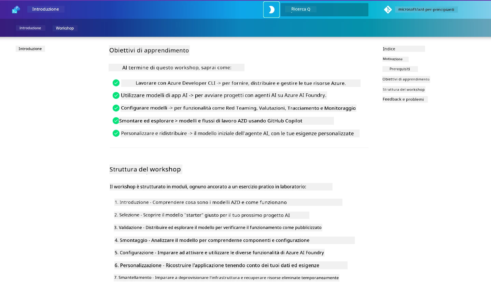

<div align="center">
  <div style="background: linear-gradient(135deg, #0078d4, #106ebe); border-radius: 10px; padding: 20px; margin: 20px 0; box-shadow: 0 4px 15px rgba(0, 120, 212, 0.3); border: 2px solid #005a9e;">
    <h2 style="color: white; margin: 0; font-size: 24px; text-shadow: 1px 1px 2px rgba(0,0,0,0.3);">
      🎯 AZD per sviluppatori AI - Workshop
    </h2>
    <p style="color: white; margin: 10px 0 0 0; font-size: 16px; text-shadow: 1px 1px 2px rgba(0,0,0,0.3);">
      <strong>Un workshop pratico per creare applicazioni AI con Azure Developer CLI.</strong><br>
      Completa 7 moduli per padroneggiare i template AZD e i flussi di lavoro di deployment per l'AI.
    </p>
    <div style="margin-top: 15px;">
      <span style="background: rgba(255,255,255,0.2); padding: 5px 10px; border-radius: 15px; color: white; font-size: 14px;">
        📅 Ultimo aggiornamento: marzo 2026
      </span>
    </div>
  </div>
</div>

# AZD per sviluppatori AI - Workshop

Benvenuto al workshop pratico per imparare Azure Developer CLI (AZD) con un focus sul deployment di applicazioni AI. Questo workshop ti aiuta ad acquisire una comprensione applicata dei template AZD in 3 passaggi:

1. **Scoperta** - trova il template giusto per te.
1. **Distribuzione** - distribuisci e verifica che funzioni
1. **Personalizzazione** - modifica e itera per renderlo tuo!

Nel corso di questo workshop, ti verranno inoltre presentati gli strumenti e i flussi di lavoro fondamentali per sviluppatori, per aiutarti a snellire il tuo percorso di sviluppo end-to-end.

<br/>

## Guida basata sul browser

Le lezioni del workshop sono in Markdown. Puoi navigarle direttamente su GitHub - oppure avviare un'anteprima nel browser come mostrato nello screenshot qui sotto.



Per usare questa opzione - esegui il fork del repository nel tuo profilo e avvia GitHub Codespaces. Una volta attivo il terminale di VS Code, digita questo comando:

This browser preview works in GitHub Codespaces, dev containers, or a local clone with Python and MkDocs installed.

```bash title="" linenums="0"
mkdocs serve > /dev/null 2>&1 &
```

In pochi secondi vedrai un dialog popup. Seleziona l'opzione `Open in browser`. La guida web si aprirà in una nuova scheda del browser. Alcuni vantaggi di questa anteprima:

1. **Built-in search** - trova parole chiave o lezioni rapidamente.
1. **Copy icon** - passa il mouse sui blocchi di codice per vedere questa opzione
1. **Theme toggle** - passa dal tema scuro a quello chiaro
1. **Get help** - clicca l'icona Discord nel footer per unirti!

<br/>

## Panoramica del workshop

**Durata:** 3-4 ore  
**Livello:** Principiante - Intermedio  
**Prerequisiti:** Familiarità con Azure, concetti di AI, VS Code e strumenti da riga di comando.

Questo è un workshop pratico dove impari facendo. Una volta completati gli esercizi, ti consigliamo di rivedere il curriculum AZD For Beginners per continuare il tuo percorso di apprendimento verso le best practice di Sicurezza e Produttività.

| Time| Module  | Objective |
|:---|:---|:---|
| 15 mins | [Introduzione](docs/instructions/0-Introduction.md) | Porre le basi, comprendere gli obiettivi |
| 30 mins | [Seleziona template AI](docs/instructions/1-Select-AI-Template.md) | Esplora le opzioni e scegli il punto di partenza | 
| 30 mins | [Valida template AI](docs/instructions/2-Validate-AI-Template.md) | Distribuisci la soluzione predefinita su Azure |
| 30 mins | [Deconstruisci template AI](docs/instructions/3-Deconstruct-AI-Template.md) | Esplora struttura e configurazione |
| 30 mins | [Configura template AI](docs/instructions/4-Configure-AI-Template.md) | Attiva e prova le funzionalità disponibili |
| 30 mins | [Personalizza template AI](docs/instructions/5-Customize-AI-Template.md) | Adatta il template alle tue esigenze |
| 30 mins | [Smantella infrastruttura](docs/instructions/6-Teardown-Infrastructure.md) | Pulizia e rilascio delle risorse |
| 15 mins | [Conclusione e prossimi passi](docs/instructions/7-Wrap-up.md) | Risorse di apprendimento, sfida del workshop |

<br/>

## Cosa imparerai

Considera il Template AZD come una sandbox di apprendimento per esplorare varie capacità e strumenti per lo sviluppo end-to-end su Microsoft Foundry. Alla fine di questo workshop, dovresti avere un senso intuitivo per diversi strumenti e concetti in questo contesto.

| Concept  | Objective |
|:---|:---|
| **Azure Developer CLI** | Comprendere i comandi dello strumento e i workflow|
| **AZD Templates**| Comprendere la struttura del progetto e la configurazione|
| **Azure AI Agent**| Provisioning e distribuzione del progetto Microsoft Foundry  |
| **Azure AI Search**| Abilitare l'ingegneria del contesto con gli agenti |
| **Observability**| Esplorare tracing, monitoring e valutazioni |
| **Red Teaming**| Esplorare test avversariali e mitigazioni |

<br/>

## Struttura del workshop

Il workshop è strutturato per accompagnarti in un percorso dalla scoperta del template, alla distribuzione, de-costruzione e personalizzazione - utilizzando come base il template ufficiale [Getting Started with AI Agents](https://github.com/Azure-Samples/get-started-with-ai-agents) starter template.

### [Modulo 1: Seleziona template AI](docs/instructions/1-Select-AI-Template.md) (30 mins)

- Cosa sono i template AI?
- Dove posso trovare i template AI?
- Come posso iniziare a costruire AI Agents?
- **Lab**: Quickstart in Codespaces o in un dev container

### [Modulo 2: Valida template AI](docs/instructions/2-Validate-AI-Template.md) (30 mins)

- Qual è l'architettura del template AI?
- Qual è il workflow di sviluppo con AZD?
- Come posso ottenere aiuto con lo sviluppo AZD?
- **Lab**: Distribuisci e valida il template AI Agents

### [Modulo 3: Deconstruisci template AI](docs/instructions/3-Deconstruct-AI-Template.md) (30 mins)

- Esplora il tuo ambiente in `.azure/` 
- Esplora la configurazione delle risorse in `infra/` 
- Esplora la configurazione AZD nei `azure.yaml` 
- **Lab**: Modifica le variabili d'ambiente e ridistribuisci

### [Modulo 4: Configura template AI](docs/instructions/4-Configure-AI-Template.md) (30 mins)
- Esplora: Retrieval Augmented Generation
- Esplora: Valutazione degli agenti e Red Teaming
- Esplora: Tracing e Monitoring
- **Lab**: Esplora AI Agent + Observability 

### [Modulo 5: Personalizza template AI](docs/instructions/5-Customize-AI-Template.md) (30 mins)
- Definisci: PRD con i requisiti dello scenario
- Configura: Variabili d'ambiente per AZD
- Implementa: Hook di lifecycle per attività aggiuntive
- **Lab**: Personalizza il template per il mio scenario

### [Modulo 6: Smantella infrastruttura](docs/instructions/6-Teardown-Infrastructure.md) (30 mins)
- Ricapitolando: Cosa sono i template AZD?
- Ricapitolando: Perché usare Azure Developer CLI?
- Prossimi passi: Prova un template diverso!
- **Lab**: Deprovisioning dell'infrastruttura e pulizia

<br/>

## Sfida del workshop

Vuoi metterti alla prova per fare di più? Ecco alcuni suggerimenti di progetto - oppure condividi le tue idee con noi!!

| Project | Description |
|:---|:---|
|1. **Decomponi un template AI complesso** | Usa il workflow e gli strumenti che abbiamo illustrato e verifica se riesci a distribuire, validare e personalizzare un template di soluzione AI differente. _Cosa hai imparato?_|
|2. **Personalizza per il tuo scenario**  | Prova a scrivere un PRD (Documento dei requisiti del prodotto) per uno scenario diverso. Poi usa GitHub Copilot nel tuo repository del template in Agent Model - e chiedigli di generare un flusso di lavoro di personalizzazione per te. _Cosa hai imparato? Come potresti migliorare questi suggerimenti?_|
| | |

## Hai feedback?

1. Apri un issue in questo repo - taggalo con `Workshop` per comodità.
1. Unisciti al Microsoft Foundry Discord - connettiti con i tuoi pari!


| | | 
|:---|:---|
| **📚 Home del corso**| [AZD For Beginners](../README.md)|
| **📖 Documentazione** | [Get started with AI templates](https://learn.microsoft.com/en-us/azure/ai-foundry/how-to/develop/ai-template-get-started)|
| **🛠️AI Templates** | [Microsoft Foundry Templates](https://ai.azure.com/templates) |
|**🚀 Prossimi passi** | [Inizia il workshop](#panoramica-del-workshop) |
| | |

<br/>

---

**Navigazione:** [Corso principale](../README.md) | [Introduzione](docs/instructions/0-Introduction.md) | [Modulo 1: Seleziona template](docs/instructions/1-Select-AI-Template.md)

**Pronto per iniziare a costruire applicazioni AI con AZD?**

[Inizia il workshop: Introduzione →](docs/instructions/0-Introduction.md)

---

<!-- CO-OP TRANSLATOR DISCLAIMER START -->
**Disclaimer**:
Questo documento è stato tradotto utilizzando il servizio di traduzione AI [Co-op Translator](https://github.com/Azure/co-op-translator). Pur impegnandoci per la precisione, si prega di notare che le traduzioni automatiche possono contenere errori o inesattezze. Il documento originale nella sua lingua originale deve essere considerato la fonte autorevole. Per informazioni critiche, si raccomanda una traduzione professionale effettuata da un umano. Non siamo responsabili per eventuali fraintendimenti o interpretazioni errate derivanti dall'uso di questa traduzione.
<!-- CO-OP TRANSLATOR DISCLAIMER END -->