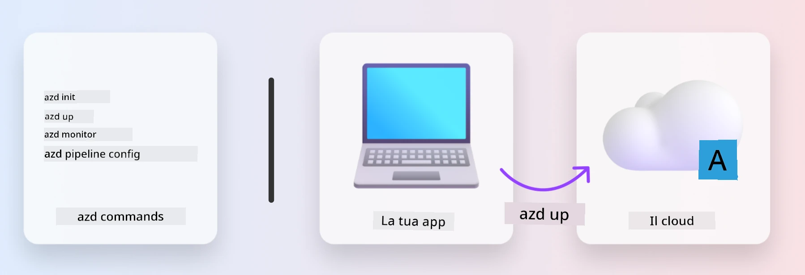
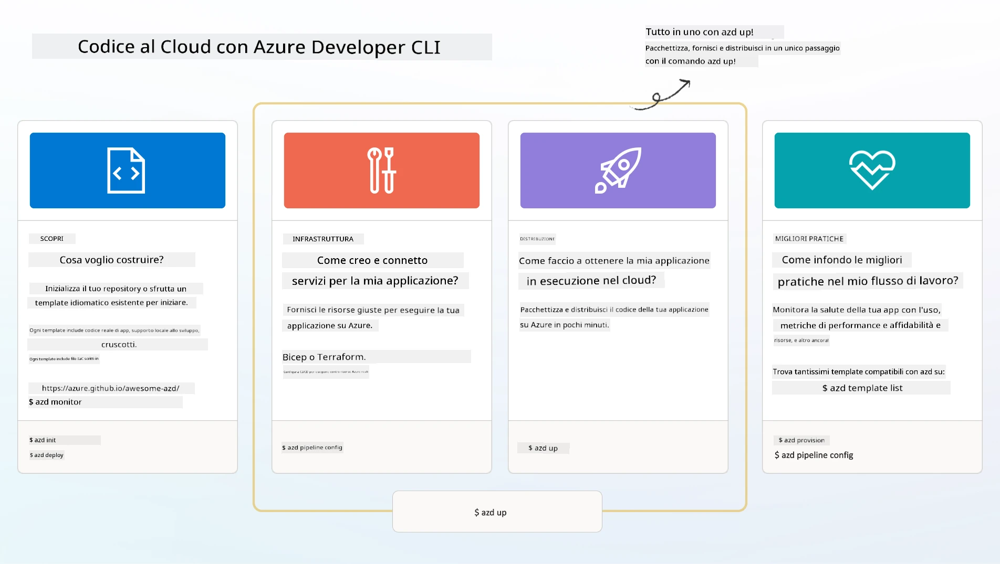

# 1. Seleziona un Modello

!!! tip "ENTRO LA FINE DI QUESTO MODULO SARAI IN GRADO DI"

    - [ ] Descrivere cosa sono i template AZD
    - [ ] Scoprire e utilizzare i template AZD per l'IA
    - [ ] Iniziare con il template Agenti AI
    - [ ] **Lab 1:** AZD Avvio rapido con GitHub Codespaces

---

## 1. Un'analogia del costruttore

Costruire un'applicazione AI moderna e pronta per l'impresa _da zero_ può essere scoraggiante. È un po' come costruire la tua nuova casa da solo, mattone dopo mattone. Sì, è possibile! Ma non è il modo più efficace per ottenere il risultato desiderato!

Invece, spesso partiamo da un _progetto di riferimento_ esistente e lavoriamo con un architetto per personalizzarlo in base alle nostre esigenze personali. Ed è esattamente l'approccio da adottare quando si sviluppano applicazioni intelligenti. Prima trova una buona architettura di progettazione che si adatti al tuo spazio di problemi. Poi lavora con un solution architect per personalizzare e sviluppare la soluzione per il tuo scenario specifico.

Ma dove possiamo trovare questi progetti di riferimento? E come troviamo un architetto disposto a insegnarci come personalizzare e distribuire questi progetti da soli? In questo workshop rispondiamo a queste domande presentandoti tre tecnologie:

1. [Azure Developer CLI](https://aka.ms/azd) - uno strumento open-source che accelera il percorso dello sviluppatore dal development locale (build) alla distribuzione sul cloud (ship).
1. [Microsoft Foundry Templates](https://ai.azure.com/templates) - repository open-source standardizzati contenenti codice di esempio, infrastruttura e file di configurazione per distribuire un'architettura di soluzione AI.
1. [GitHub Copilot Agent Mode](https://code.visualstudio.com/docs/copilot/chat/chat-agent-mode) - un agente di coding basato sulla conoscenza di Azure, che può guidarci nella navigazione del codebase e nelle modifiche, usando il linguaggio naturale.

Con questi strumenti a disposizione, ora possiamo _scoprire_ il template giusto, _distribuirlo_ per convalidarne il funzionamento e _personalizzarlo_ per adattarlo ai nostri scenari specifici. Immergiamoci e impariamo come funzionano.

---

## 2. Azure Developer CLI

The [Azure Developer CLI](https://learn.microsoft.com/en-us/azure/developer/azure-developer-cli/) (o `azd`) è uno strumento da riga di comando open-source che può accelerare il tuo percorso dal codice al cloud con una serie di comandi pensati per gli sviluppatori che funzionano in modo coerente nel tuo IDE (development) e negli ambienti CI/CD (devops).

Con `azd`, il tuo percorso di deployment può essere così semplice:

- `azd init` - Inizializza un nuovo progetto AI da un template AZD esistente.
- `azd up` - Esegue il provisioning dell'infrastruttura e distribuisce la tua applicazione in un unico passaggio.
- `azd monitor` - Ottieni monitoraggio e diagnostica in tempo reale per la tua applicazione distribuita.
- `azd pipeline config` - Configura pipeline CI/CD per automatizzare la distribuzione su Azure.

**🎯 | ESERCIZIO**: <br/> Esplora lo strumento da riga di comando `azd` nel tuo ambiente GitHub Codespaces ora. Inizia digitando questo comando per vedere cosa può fare lo strumento:

```bash title="" linenums="0"
azd help
```



---

## 3. Il template AZD

Perché `azd` possa fare tutto questo, deve sapere quale infrastruttura eseguire il provisioning, quali impostazioni di configurazione applicare e quale applicazione distribuire. È qui che entrano in gioco gli [AZD templates](https://learn.microsoft.com/en-us/azure/developer/azure-developer-cli/azd-templates?tabs=csharp).

I template AZD sono repository open-source che combinano codice di esempio con file di infrastruttura e configurazione necessari per distribuire l'architettura della soluzione.
Utilizzando un approccio _Infrastructure-as-Code_ (IaC), consentono che le definizioni delle risorse del template e le impostazioni di configurazione siano gestite con il controllo di versione (proprio come il codice sorgente dell'app) - creando flussi di lavoro riutilizzabili e coerenti tra gli utenti di quel progetto.

Quando crei o riutilizzi un template AZD per _il tuo_ scenario, considera queste domande:

1. Cosa stai costruendo? → Esiste un template che abbia codice di avvio per quello scenario?
1. Come è progettata la tua soluzione? → Esiste un template che contenga le risorse necessarie?
1. Come viene distribuita la tua soluzione? → Pensa a `azd deploy` con hook di pre/post-elaborazione!
1. Come puoi ottimizzarla ulteriormente? → Pensa al monitoraggio integrato e alle pipeline di automazione!

**🎯 | ESERCIZIO**: <br/> 
Visita la [Awesome AZD](https://azure.github.io/awesome-azd/) gallery e usa i filtri per esplorare i 250+ template attualmente disponibili. Verifica se riesci a trovare uno che si allinei ai requisiti del _tuo_ scenario.



---

## 4. Template per app AI

Per le applicazioni basate su AI, Microsoft fornisce template specializzati che includono **Microsoft Foundry** e **Foundry Agents**. Questi template accelerano il tuo percorso per costruire applicazioni intelligenti pronte per la produzione.

### Microsoft Foundry & Foundry Agents Templates

Seleziona un template qui sotto per distribuirlo. Ogni template è disponibile su [Awesome AZD](https://azure.github.io/awesome-azd/) e può essere inizializzato con un singolo comando.

| Template | Descrizione | Deploy Command |
|----------|-------------|----------------|
| **[AI Chat with RAG](https://azure.github.io/awesome-azd/?tags=ai&tags=rag)** | Applicazione di chat con Retrieval Augmented Generation usando Microsoft Foundry | `azd init -t azure-samples/azure-search-openai-demo` |
| **[Foundry Agent Service Starter](https://azure.github.io/awesome-azd/?tags=ai&tags=agents)** | Build AI agents with Foundry Agents for autonomous task execution | `azd init -t azure-samples/foundry-agent-service-starter` |
| **[Multi-Agent Orchestration](https://azure.github.io/awesome-azd/?tags=ai&tags=agents)** | Coordinare più Foundry Agents per flussi di lavoro complessi | `azd init -t azure-samples/multi-agent-orchestration` |
| **[AI Document Intelligence](https://azure.github.io/awesome-azd/?tags=ai&tags=document)** | Estrai e analizza documenti con i modelli Microsoft Foundry | `azd init -t azure-samples/ai-document-processing` |
| **[Conversational AI Bot](https://azure.github.io/awesome-azd/?tags=ai&tags=bot)** | Crea chatbot intelligenti con integrazione Microsoft Foundry | `azd init -t azure-samples/ai-chat-protocol` |
| **[AI Image Generation](https://azure.github.io/awesome-azd/?tags=ai&tags=dalle)** | Genera immagini usando DALL-E tramite Microsoft Foundry | `azd init -t azure-samples/ai-image-generation` |
| **[Semantic Kernel Agent](https://azure.github.io/awesome-azd/?tags=ai&tags=semantic-kernel)** | Agenti AI che utilizzano Semantic Kernel con Foundry Agents | `azd init -t azure-samples/semantic-kernel-agent` |
| **[AutoGen Multi-Agent](https://azure.github.io/awesome-azd/?tags=ai&tags=autogen)** | Sistemi multi-agente usando il framework AutoGen | `azd init -t azure-samples/autogen-multi-agent` |

### Avvio rapido

1. **Sfoglia i template**: Visita [https://azure.github.io/awesome-azd/](https://azure.github.io/awesome-azd/) e filtra per `AI`, `Agents`, o `Microsoft Foundry`
2. **Seleziona il tuo template**: Scegline uno che corrisponda al tuo caso d'uso
3. **Inizializza**: Esegui il comando `azd init` per il template scelto
4. **Distribuisci**: Esegui `azd up` per effettuare il provisioning e distribuire

**🎯 | ESERCIZIO**: <br/>
Seleziona uno dei template sopra in base al tuo scenario:

- **Stai costruendo un chatbot?** → Inizia con **AI Chat with RAG** o **Conversational AI Bot**
- **Hai bisogno di agenti autonomi?** → Prova **Foundry Agent Service Starter** o **Multi-Agent Orchestration**
- **Elabori documenti?** → Usa **AI Document Intelligence**
- **Vuoi assistenza alla codifica AI?** → Esplora **Semantic Kernel Agent** o **AutoGen Multi-Agent**

```bash title="Example: Deploy the AI Chat with RAG template" linenums="0"
azd init -t azure-samples/azure-search-openai-demo
azd up
```

!!! info "Esplora altri template"
    The [Awesome AZD Gallery](https://azure.github.io/awesome-azd/) contiene 250+ template. Use the filters to find templates matching your specific requirements for language, framework, and Azure services.

---

<!-- CO-OP TRANSLATOR DISCLAIMER START -->
Esclusione di responsabilità:
Questo documento è stato tradotto utilizzando il servizio di traduzione basato su IA [Co-op Translator](https://github.com/Azure/co-op-translator). Pur facendo del nostro meglio per garantire l'accuratezza, si tenga presente che le traduzioni automatiche possono contenere errori o imprecisioni. Il documento originale nella sua lingua nativa deve essere considerato la fonte autorevole. Per informazioni di natura critica, si consiglia una traduzione professionale effettuata da un traduttore umano. Non siamo responsabili per eventuali malintesi o interpretazioni errate derivanti dall'uso di questa traduzione.
<!-- CO-OP TRANSLATOR DISCLAIMER END -->