# 2. Convalidare un Template

!!! tip "ENTRO LA FINE DI QUESTO MODULO SARAI IN GRADO DI"

    - [ ] Analizzare l'architettura della soluzione AI
    - [ ] Comprendere il flusso di distribuzione AZD
    - [ ] Usare GitHub Copilot per ottenere aiuto sull'uso di AZD
    - [ ] **Lab 2:** Distribuire & convalidare il template AI Agents

---


## 1. Introduzione

L'[Azure Developer CLI](https://learn.microsoft.com/en-us/azure/developer/azure-developer-cli/) o `azd` è uno strumento da riga di comando open-source che semplifica il flusso di lavoro degli sviluppatori durante la creazione e la distribuzione di applicazioni su Azure. 

[AZD Templates](https://learn.microsoft.com/azure/developer/azure-developer-cli/azd-templates) sono repository standardizzati che includono codice di esempio dell'applicazione, asset di _infrastructure-as-code_ e file di configurazione `azd` per un'architettura di soluzione coerente. Il provisioning dell'infrastruttura diventa semplice come un comando `azd provision` - mentre usare `azd up` permette di effettuare il provisioning dell'infrastruttura **e** distribuire l'applicazione in un'unica soluzione!

Di conseguenza, avviare il processo di sviluppo della tua applicazione può essere semplice come trovare il giusto _AZD Starter template_ che si avvicina maggiormente alle tue esigenze di applicazione e infrastruttura - quindi personalizzare il repository per adattarlo ai requisiti del tuo scenario.

Prima di iniziare, assicuriamoci che tu abbia installato l'Azure Developer CLI.

1. Apri un terminale di VS Code e digita questo comando:

      ```bash title="" linenums="0"
      azd version
      ```

1. Dovresti vedere qualcosa di simile a questo!

      ```bash title="" linenums="0"
      azd version 1.19.0 (commit b3d68cea969b2bfbaa7b7fa289424428edb93e97)
      ```

**Ora sei pronto per selezionare e distribuire un template con azd**

---

## 2. Selezione del Template

La piattaforma Microsoft Foundry include un [insieme di AZD template consigliati](https://learn.microsoft.com/en-us/azure/ai-foundry/how-to/develop/ai-template-get-started) che coprono scenari di soluzione popolari come _automazione di flussi di lavoro multi-agente_ e _elaborazione di contenuti multimodale_. Puoi anche scoprire questi template visitando il portale Microsoft Foundry.

1. Visita [https://ai.azure.com/templates](https://ai.azure.com/templates)
1. Accedi al portale Microsoft Foundry quando richiesto - vedrai qualcosa di simile a questo.

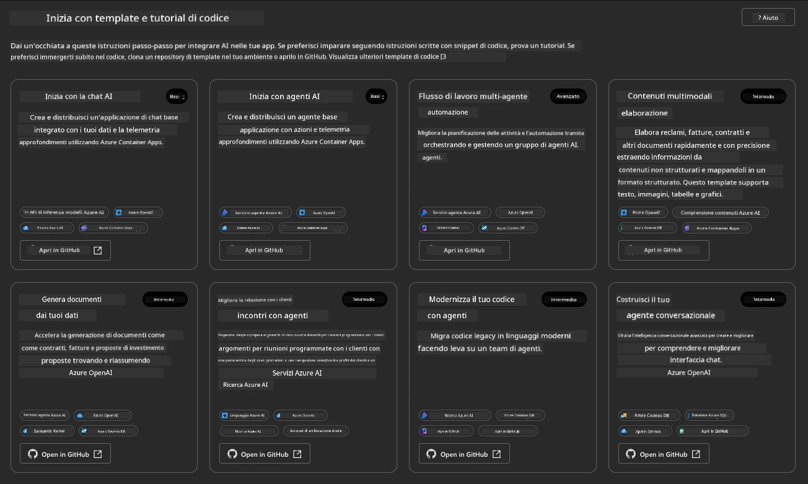


Le opzioni **Basic** sono i tuoi template di partenza:

1. [ ] [Get Started with AI Chat](https://github.com/Azure-Samples/get-started-with-ai-chat) che distribuisce una semplice applicazione di chat _con i tuoi dati_ su Azure Container Apps. Usalo per esplorare uno scenario base di chatbot AI.
1. [X] [Get Started with AI Agents](https://github.com/Azure-Samples/get-started-with-ai-agents) che distribuisce anche un AI Agent standard (con i Foundry Agents). Usalo per familiarizzare con soluzioni AI agentiche che coinvolgono strumenti e modelli.

Visita il secondo link in una nuova scheda del browser (o fai clic su `Open in GitHub` per la scheda correlata). Dovresti vedere il repository per questo AZD Template. Prenditi un minuto per esplorare il README. L'architettura dell'applicazione è la seguente:

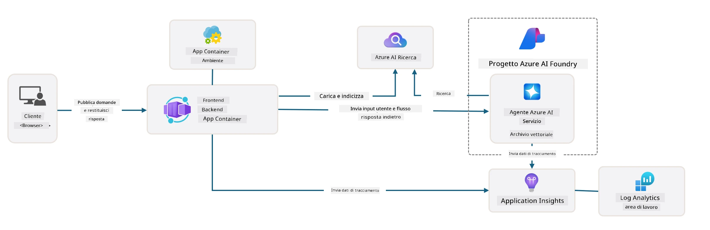

---

## 3. Attivazione del Template

Proviamo a distribuire questo template e assicuriamoci che sia valido. Seguiremo le linee guida nella sezione [Getting Started](https://github.com/Azure-Samples/get-started-with-ai-agents?tab=readme-ov-file#getting-started).

1. Clicca [questo link](https://github.com/codespaces/new/Azure-Samples/get-started-with-ai-agents) - conferma l'azione predefinita per `Create codespace`
1. Si apre una nuova scheda del browser - attendi che la sessione GitHub Codespaces completi il caricamento
1. Apri il terminale di VS Code in Codespaces - digita il seguente comando:

   ```bash title="" linenums="0"
   azd up
   ```

Completa i passaggi del flusso di lavoro che questo attiverà:

1. Ti verrà richiesto di effettuare l'accesso ad Azure - segui le istruzioni per autenticarti
1. Inserisci un nome ambiente univoco per te - ad es., io ho usato `nitya-mshack-azd`
1. Questo creerà una cartella `.azure/` - vedrai una sottocartella con il nome dell'ambiente
1. Ti verrà richiesto di selezionare un nome di sottoscrizione - seleziona quella predefinita
1. Ti verrà richiesto di indicare una posizione - usa `East US 2`

Ora, attendi che il provisioning sia completato. **Questo richiede 10-15 minuti**

1. Quando è terminato, la tua console mostrerà un messaggio di SUCCESSO come questo:
      ```bash title="" linenums="0"
      SUCCESS: Your up workflow to provision and deploy to Azure completed in 10 minutes 17 seconds.
      ```
1. Il tuo Azure Portal avrà ora un gruppo di risorse provisionato con quel nome ambiente:

      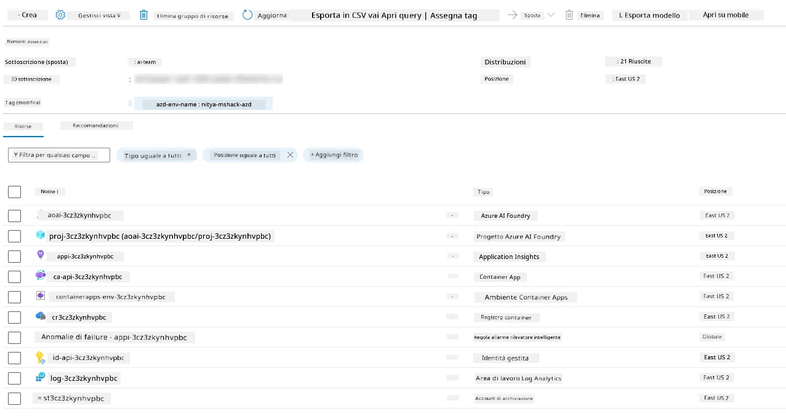

1. **Ora sei pronto per convalidare l'infrastruttura e l'applicazione distribuite**.

---

## 4. Convalida del Template

1. Visita la pagina Azure Portal [Resource Groups](https://portal.azure.com/#browse/resourcegroups) - accedi quando richiesto
1. Clicca sul RG per il nome del tuo ambiente - vedrai la pagina sopra

      - clicca sulla risorsa Azure Container Apps
      - clicca sull'Application Url nella sezione _Essentials_ (in alto a destra)

1. Dovresti vedere un'interfaccia front-end dell'applicazione ospitata come questa:

   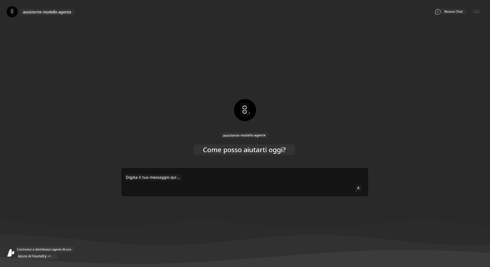

1. Prova a porre un paio di [domande di esempio](https://github.com/Azure-Samples/get-started-with-ai-agents/blob/main/docs/sample_questions.md)

      1. Chiedi: ```What is the capital of France?``` 
      1. Chiedi: ```What's the best tent under $200 for two people, and what features does it include?```

1. Dovresti ottenere risposte simili a quanto mostrato di seguito. _Ma come funziona questo?_ 

      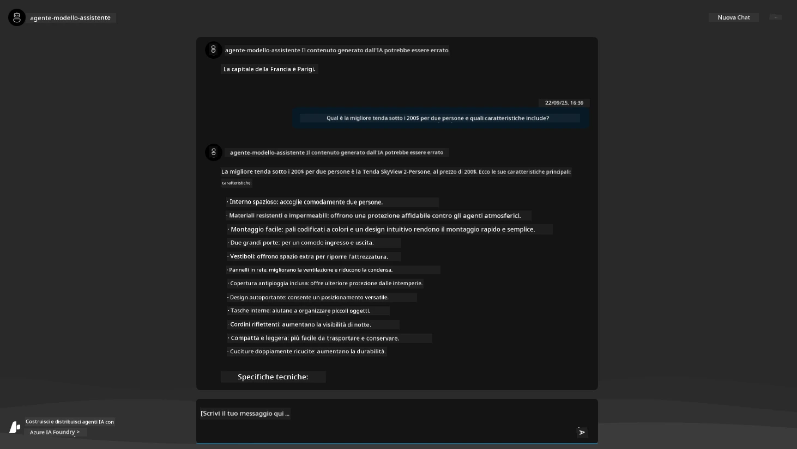

---

## 5. Convalida dell'Agent

L'Azure Container App distribuisce un endpoint che si collega all'AI Agent provisionato nel progetto Microsoft Foundry per questo template. Diamo un'occhiata a cosa significa.

1. Torna alla pagina di panoramica (Overview) del tuo gruppo di risorse nel Portale Azure

1. Clicca sulla risorsa `Microsoft Foundry` in quell'elenco

1. Dovresti vedere questo. Clicca sul pulsante `Go to Microsoft Foundry Portal`. 
   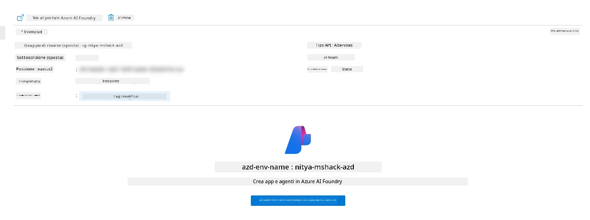

1. Dovresti vedere la pagina del Foundry Project per la tua applicazione AI
   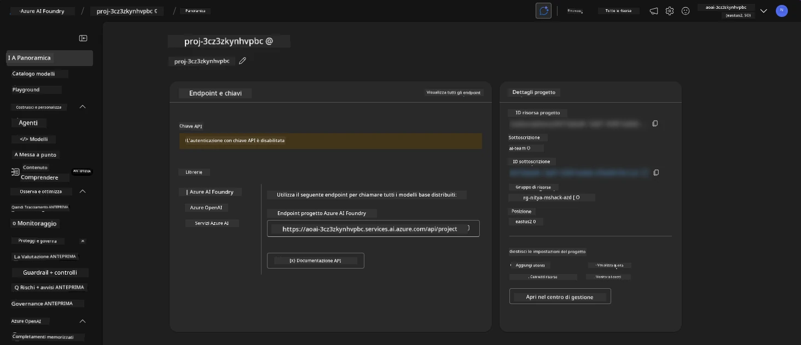

1. Clicca su `Agents` - vedrai l'Agent predefinito provisionato nel tuo progetto
   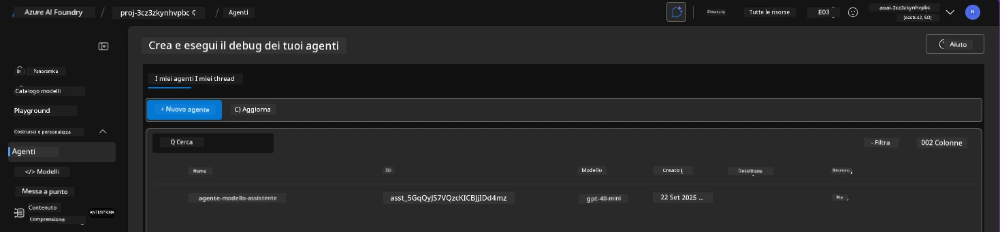

1. Selezionalo - e vedrai i dettagli dell'Agent. Nota quanto segue:

      - L'agent usa File Search per impostazione predefinita (sempre)
      - la `Knowledge` dell'agent indica che sono stati caricati 32 file (per la ricerca nei file)
      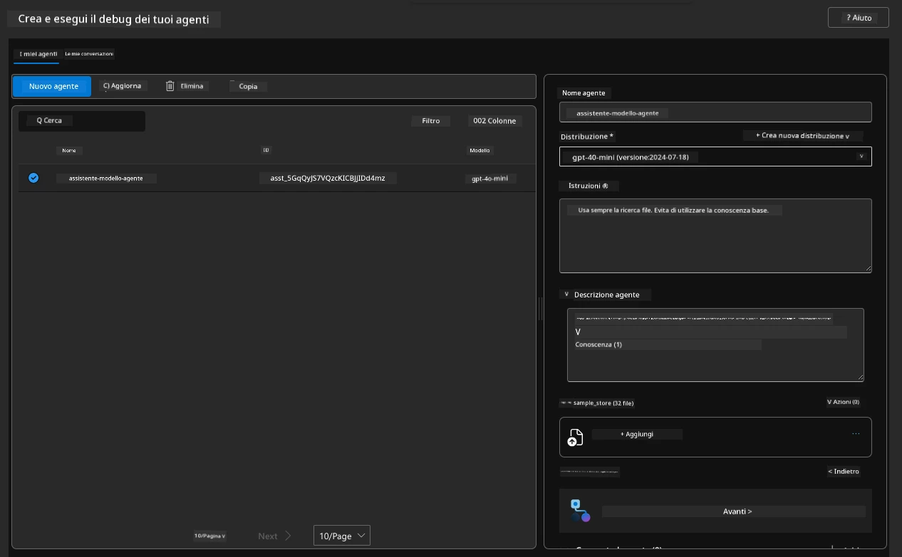

1. Cerca l'opzione `Data+indexes` nel menu a sinistra e clicca per i dettagli. 

      - Dovresti vedere i 32 file di dati caricati per la knowledge.
      - Questi corrisponderanno ai 12 file dei clienti e ai 20 file dei prodotti sotto `src/files` 
      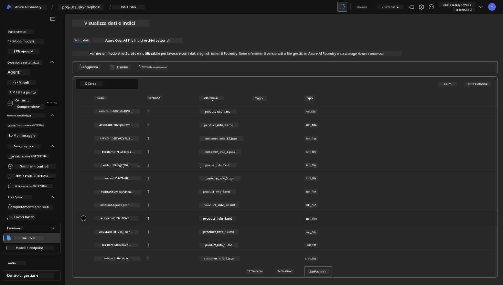

**Hai convalidato il funzionamento dell'Agent!** 

1. Le risposte dell'agent sono ancorate alla knowledge contenuta in quei file. 
1. Ora puoi porre domande relative a quei dati e ottenere risposte ancorate.
1. Esempio: `customer_info_10.json` descrive i 3 acquisti effettuati da "Amanda Perez"

Ritorna alla scheda del browser con l'endpoint della Container App e chiedi: `What products does Amanda Perez own?`. Dovresti vedere qualcosa di simile a questo:

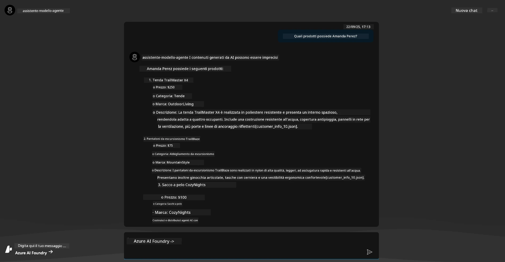

---

## 6. Agent Playground

Costruiamo un po' più di intuizione sulle capacità di Microsoft Foundry, mettendo l'Agent alla prova nell'Agents Playground. 

1. Torna alla pagina `Agents` in Microsoft Foundry - seleziona l'agent predefinito
1. Clicca sull'opzione `Try in Playground` - dovresti ottenere un'interfaccia Playground come questa
1. Poni la stessa domanda: `What products does Amanda Perez own?`

    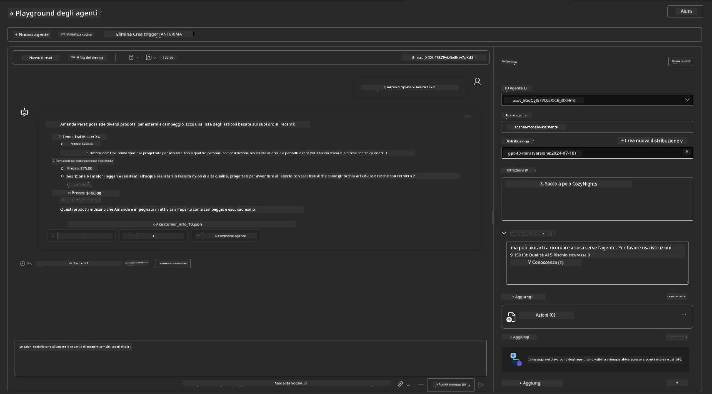

Otterrai la stessa (o una risposta simile) - ma ottieni anche informazioni aggiuntive che puoi usare per comprendere la qualità, i costi e le prestazioni della tua app agentica. Per esempio:

1. Nota che la risposta cita i file di dati usati per "ancorare" la risposta
1. Passa il mouse sopra uno qualsiasi di questi label di file - i dati corrispondono alla tua query e alla risposta mostrata?

Vedi anche una riga di _stats_ sotto la risposta. 

1. Passa il mouse sopra una qualsiasi metrica - ad es., Safety. Vedrai qualcosa del genere
1. La valutazione assegnata corrisponde alla tua intuizione sul livello di sicurezza della risposta?

      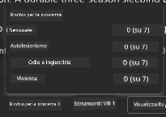

---

## 7. Osservabilità Integrata

L'osservabilità riguarda l'istrumentazione della tua applicazione per generare dati che possono essere utilizzati per comprendere, eseguire il debug e ottimizzare le sue operazioni. Per farti un'idea:

1. Clicca sul pulsante `View Run Info` - dovresti vedere questa vista. Questo è un esempio di [Agent tracing](https://learn.microsoft.com/en-us/azure/ai-foundry/how-to/develop/trace-agents-sdk#view-trace-results-in-the-azure-ai-foundry-agents-playground) in azione. _Puoi anche ottenere questa vista cliccando su Thread Logs nel menu di livello superiore_.

   - Fatti un'idea dei passaggi di esecuzione e degli strumenti coinvolti dall'agent
   - Comprendi il conteggio totale di Token (vs. l'uso dei token di output) per la risposta
   - Comprendi la latenza e dove il tempo viene speso nell'esecuzione

      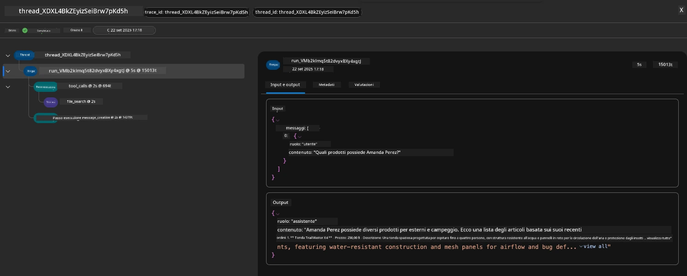

1. Clicca sulla scheda `Metadata` per vedere attributi aggiuntivi della run, che possono fornire contesto utile per il debug di problemi in seguito.   

      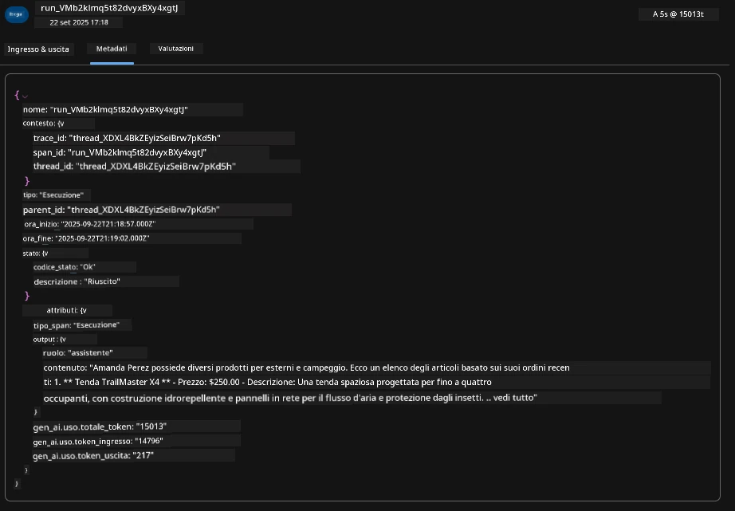


1. Clicca sulla scheda `Evaluations` per vedere le auto-valutazioni effettuate sulla risposta dell'agent. Queste includono valutazioni di sicurezza (ad es., Self-harm) e valutazioni specifiche per l'agent (ad es., risoluzione dell'intento, aderenza al compito).

      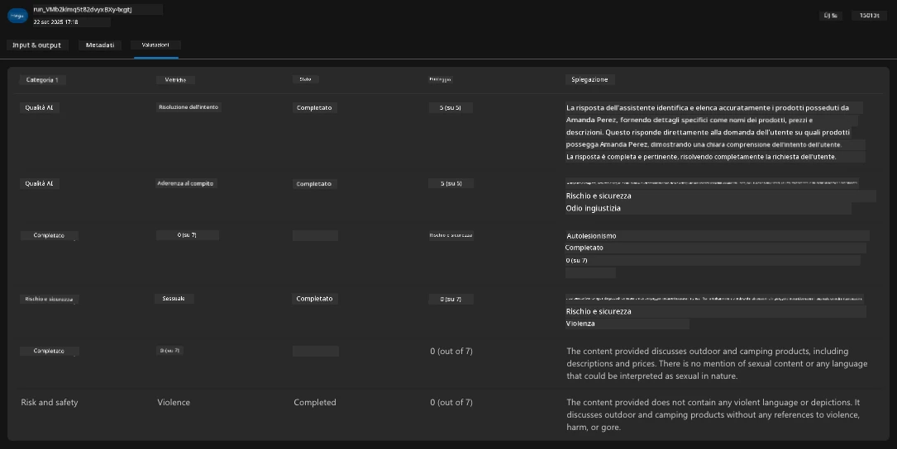

1. Ultimo ma non meno importante, clicca sulla scheda `Monitoring` nel menu laterale.

      - Seleziona la scheda `Resource usage` nella pagina visualizzata - e visualizza le metriche.
      - Monitora l'utilizzo dell'applicazione in termini di costi (token) e carico (richieste).
      - Monitora la latenza dell'applicazione fino al primo byte (elaborazione input) e all'ultimo byte (output).

      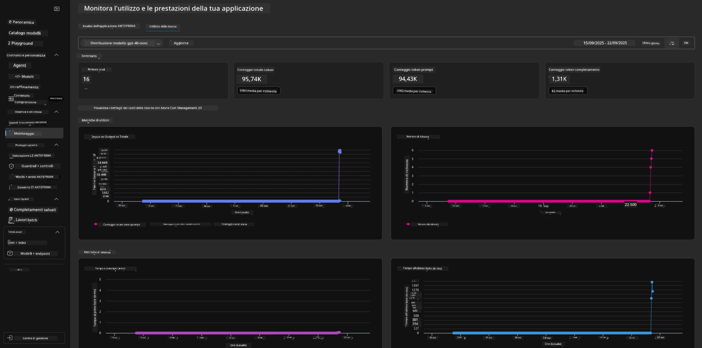

---

## 8. Variabili d'Ambiente

Finora, abbiamo percorso la distribuzione nel browser - e convalidato che la nostra infrastruttura è stata provisionata e l'applicazione è operativa. Ma per lavorare con l'applicazione in modalità _code-first_, dobbiamo configurare il nostro ambiente di sviluppo locale con le variabili rilevanti necessarie per lavorare con queste risorse. Usare `azd` rende questo semplice.

1. L'Azure Developer CLI [usa variabili d'ambiente](https://learn.microsoft.com/en-us/azure/developer/azure-developer-cli/manage-environment-variables?tabs=bash) per memorizzare e gestire le impostazioni di configurazione per le distribuzioni delle applicazioni.

1. Le variabili d'ambiente sono memorizzate in `.azure/<env-name>/.env` - questo le vincola all'ambiente `env-name` usato durante la distribuzione e ti aiuta a isolare gli ambienti tra diversi target di distribuzione nello stesso repo.

1. Le variabili d'ambiente vengono caricate automaticamente dal comando `azd` ogni volta che esegue un comando specifico (ad es., `azd up`). Nota che `azd` non legge automaticamente le variabili d'ambiente a livello di OS (ad es., impostate nella shell) - invece usa `azd set env` e `azd get env` per trasferire informazioni all'interno degli script.


Proviamo alcuni comandi:

1. Ottieni tutte le variabili d'ambiente impostate per `azd` in questo ambiente:

      ```bash title="" linenums="0"
      azd env get-values
      ```
      
      Vedrai qualcosa di simile:

      ```bash title="" linenums="0"
      AZURE_AI_AGENT_DEPLOYMENT_NAME="gpt-4.1-mini"
      AZURE_AI_AGENT_NAME="agent-template-assistant"
      AZURE_AI_EMBED_DEPLOYMENT_NAME="text-embedding-3-small"
      AZURE_AI_EMBED_DIMENSIONS=100
      ...
      ```

1. Ottieni un valore specifico - ad es., voglio sapere se abbiamo impostato il valore `AZURE_AI_AGENT_MODEL_NAME`

      ```bash title="" linenums="0"
      azd env get-value AZURE_AI_AGENT_MODEL_NAME 
      ```
      
      Vedrai qualcosa del genere - non era impostato per impostazione predefinita!

      ```bash title="" linenums="0"
      ERROR: key 'AZURE_AI_AGENT_MODEL_NAME' not found in the environment values
      ```

1. Imposta una nuova variabile d'ambiente per `azd`. Qui, aggiorniamo il nome del modello dell'agent. _Nota: eventuali modifiche apportate verranno immediatamente riflesse nel file `.azure/<env-name>/.env`._

      ```bash title="" linenums="0"
      azd env set AZURE_AI_AGENT_MODEL_NAME gpt-4.1
      azd env set AZURE_AI_AGENT_MODEL_VERSION 2025-04-14
      azd env set AZURE_AI_AGENT_DEPLOYMENT_CAPACITY 150
      ```

      Ora, dovremmo trovare il valore impostato:

      ```bash title="" linenums="0"
      azd env get-value AZURE_AI_AGENT_MODEL_NAME 
      ```

1. Nota che alcune risorse sono persistenti (ad es., deployment di modelli) e richiederanno più di un semplice `azd up` per forzare la redistribuzione. Proviamo a smantellare la distribuzione originale e ridistribuire con le variabili d'ambiente modificate.

1. **Aggiorna** Se in precedenza hai distribuito l'infrastruttura utilizzando un azd template - puoi _aggiornare_ lo stato delle tue variabili d'ambiente locali in base allo stato corrente della tua distribuzione Azure usando questo comando:

      ```bash title="" linenums="0"
      azd env refresh
      ```

      Questo è un modo potente per _sincronizzare_ le variabili di ambiente tra due o più ambienti di sviluppo locali (ad es., un team con più sviluppatori) - consentendo all'infrastruttura distribuita di fungere da fonte di verità per lo stato delle variabili di ambiente. I membri del team semplicemente _aggiornano_ le variabili per tornare sincronizzati.

---

## 9. Congratulazioni 🏆

Hai appena completato un flusso di lavoro end-to-end in cui hai:

- [X] Hai selezionato il modello AZD che vuoi usare
- [X] Hai avviato il modello con GitHub Codespaces 
- [X] Hai distribuito il modello e verificato che funzioni

---

<!-- CO-OP TRANSLATOR DISCLAIMER START -->
**Esclusione di responsabilità**:
Questo documento è stato tradotto utilizzando il servizio di traduzione automatica [Co-op Translator](https://github.com/Azure/co-op-translator). Pur facendo del nostro meglio per garantire l'accuratezza, si tenga presente che le traduzioni automatiche possono contenere errori o inesattezze. Il documento originale nella sua lingua dovrebbe essere considerato la fonte autorevole. Per informazioni critiche, si raccomanda una traduzione professionale effettuata da un traduttore umano. Non siamo responsabili per eventuali malintesi o interpretazioni errate derivanti dall'uso di questa traduzione.
<!-- CO-OP TRANSLATOR DISCLAIMER END -->