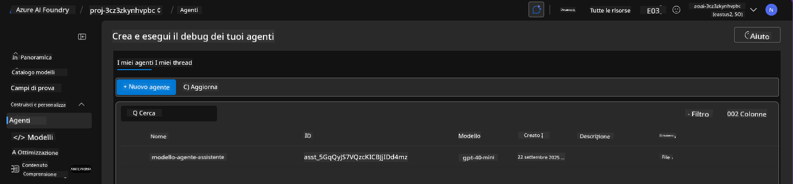

<!--
CO_OP_TRANSLATOR_METADATA:
{
  "original_hash": "7816c6ec50c694c331e7c6092371be4d",
  "translation_date": "2025-09-24T15:02:59+00:00",
  "source_file": "workshop/docs/instructions/2-Validate-AI-Template.md",
  "language_code": "it"
}
-->
# 2. Validare un Template

!!! tip "ALLA FINE DI QUESTO MODULO SARAI IN GRADO DI"

    - [ ] Analizzare l'architettura della soluzione AI
    - [ ] Comprendere il flusso di lavoro di distribuzione di AZD
    - [ ] Utilizzare GitHub Copilot per ottenere supporto sull'uso di AZD
    - [ ] **Lab 2:** Distribuire e validare il template degli agenti AI

---

## 1. Introduzione

La [Azure Developer CLI](https://learn.microsoft.com/en-us/azure/developer/azure-developer-cli/) o `azd` è uno strumento open-source da riga di comando che semplifica il flusso di lavoro degli sviluppatori nella creazione e distribuzione di applicazioni su Azure.

I [Template AZD](https://learn.microsoft.com/azure/developer/azure-developer-cli/azd-templates) sono repository standardizzati che includono codice di esempio per applicazioni, risorse di _infrastructure as code_ e file di configurazione `azd` per un'architettura di soluzione coesa. Il provisioning dell'infrastruttura diventa semplice come un comando `azd provision`, mentre l'uso di `azd up` consente di effettuare il provisioning dell'infrastruttura **e** distribuire la tua applicazione in un'unica operazione!

Di conseguenza, avviare il processo di sviluppo della tua applicazione può essere semplice come trovare il giusto _AZD Starter template_ che si avvicina alle tue esigenze di applicazione e infrastruttura, per poi personalizzare il repository in base ai requisiti del tuo scenario.

Prima di iniziare, assicurati di avere installato la Azure Developer CLI.

1. Apri un terminale di VS Code e digita questo comando:

      ```bash title="" linenums="0"
      azd version
      ```

1. Dovresti vedere qualcosa di simile!

      ```bash title="" linenums="0"
      azd version 1.19.0 (commit b3d68cea969b2bfbaa7b7fa289424428edb93e97)
      ```

**Ora sei pronto per selezionare e distribuire un template con azd**

---

## 2. Selezione del Template

La piattaforma Azure AI Foundry offre un [set di template AZD consigliati](https://learn.microsoft.com/en-us/azure/ai-foundry/how-to/develop/ai-template-get-started) che coprono scenari di soluzione popolari come _automazione del flusso di lavoro multi-agente_ e _elaborazione di contenuti multi-modale_. Puoi anche scoprire questi template visitando il portale Azure AI Foundry.

1. Visita [https://ai.azure.com/templates](https://ai.azure.com/templates)
1. Accedi al portale Azure AI Foundry quando richiesto - vedrai qualcosa di simile.


Le opzioni **Basic** sono i tuoi template iniziali:

1. [ ] [Get Started with AI Chat](https://github.com/Azure-Samples/get-started-with-ai-chat) che distribuisce un'applicazione di chat di base _con i tuoi dati_ su Azure Container Apps. Usalo per esplorare uno scenario di chatbot AI di base.
1. [X] [Get Started with AI Agents](https://github.com/Azure-Samples/get-started-with-ai-agents) che distribuisce anche un agente AI standard (con il servizio Azure AI Agent). Usalo per familiarizzare con soluzioni AI agentiche che coinvolgono strumenti e modelli.

Visita il secondo link in una nuova scheda del browser (o clicca su `Open in GitHub` per la scheda correlata). Dovresti vedere il repository per questo template AZD. Prenditi un minuto per esplorare il README. L'architettura dell'applicazione appare così:


---

## 3. Attivazione del Template

Proviamo a distribuire questo template e assicuriamoci che sia valido. Seguiremo le linee guida nella sezione [Getting Started](https://github.com/Azure-Samples/get-started-with-ai-agents?tab=readme-ov-file#getting-started).

1. Clicca su [questo link](https://github.com/codespaces/new/Azure-Samples/get-started-with-ai-agents) - conferma l'azione predefinita per `Create codespace`
1. Si aprirà una nuova scheda del browser - attendi il completamento del caricamento della sessione GitHub Codespaces
1. Apri il terminale di VS Code in Codespaces - digita il seguente comando:

   ```bash title="" linenums="0"
   azd up
   ```

Completa i passaggi del flusso di lavoro che verranno attivati:

1. Ti verrà richiesto di accedere ad Azure - segui le istruzioni per autenticarti
1. Inserisci un nome univoco per l'ambiente - ad esempio, ho usato `nitya-mshack-azd`
1. Questo creerà una cartella `.azure/` - vedrai una sottocartella con il nome dell'ambiente
1. Ti verrà richiesto di selezionare un nome di sottoscrizione - seleziona quello predefinito
1. Ti verrà richiesto di scegliere una posizione - usa `East US 2`

Ora, attendi il completamento del provisioning. **Questo richiede 10-15 minuti**

1. Al termine, la tua console mostrerà un messaggio di SUCCESSO simile a questo:
      ```bash title="" linenums="0"
      SUCCESS: Your up workflow to provision and deploy to Azure completed in 10 minutes 17 seconds.
      ```
1. Il tuo portale Azure avrà ora un gruppo di risorse provisionato con il nome dell'ambiente:

      

1. **Ora sei pronto per validare l'infrastruttura e l'applicazione distribuite**.

---

## 4. Validazione del Template

1. Visita la pagina [Resource Groups](https://portal.azure.com/#browse/resourcegroups) del portale Azure - accedi quando richiesto
1. Clicca sul RG per il nome del tuo ambiente - vedrai la pagina sopra

      - clicca sulla risorsa Azure Container Apps
      - clicca sull'URL dell'applicazione nella sezione _Essentials_ (in alto a destra)

1. Dovresti vedere un'interfaccia utente front-end dell'applicazione ospitata simile a questa:

   

1. Prova a fare alcune [domande di esempio](https://github.com/Azure-Samples/get-started-with-ai-agents/blob/main/docs/sample_questions.md)

      1. Chiedi: ```Qual è la capitale della Francia?``` 
      1. Chiedi: ```Qual è la migliore tenda sotto i $200 per due persone e quali caratteristiche include?```

1. Dovresti ottenere risposte simili a quelle mostrate di seguito. _Ma come funziona tutto questo?_ 

      

---

## 5. Validazione dell'Agente

L'app Azure Container distribuisce un endpoint che si connette all'agente AI provisionato nel progetto Azure AI Foundry per questo template. Diamo un'occhiata a cosa significa.

1. Torna alla pagina _Overview_ del portale Azure per il tuo gruppo di risorse

1. Clicca sulla risorsa `Azure AI Foundry` in quell'elenco

1. Dovresti vedere questo. Clicca sul pulsante `Go to Azure AI Foundry Portal`. 
   

1. Dovresti vedere la pagina del progetto Foundry per la tua applicazione AI
   

1. Clicca su `Agents` - vedrai l'agente predefinito provisionato nel tuo progetto
   

1. Selezionalo - e vedrai i dettagli dell'agente. Nota quanto segue:

      - L'agente utilizza File Search per impostazione predefinita (sempre)
      - La `Knowledge` dell'agente indica che sono stati caricati 32 file (per la ricerca nei file)
      

1. Cerca l'opzione `Data+indexes` nel menu a sinistra e clicca per i dettagli. 

      - Dovresti vedere i 32 file di dati caricati per la conoscenza.
      - Questi corrisponderanno ai 12 file cliente e ai 20 file prodotto sotto `src/files` 
      

**Hai validato il funzionamento dell'agente!** 

1. Le risposte dell'agente sono basate sulla conoscenza contenuta in quei file. 
1. Ora puoi fare domande relative a quei dati e ottenere risposte basate su di essi.
1. Esempio: `customer_info_10.json` descrive i 3 acquisti effettuati da "Amanda Perez"

Ritorna alla scheda del browser con l'endpoint dell'app Container e chiedi: `Quali prodotti possiede Amanda Perez?`. Dovresti vedere qualcosa di simile:


---

## 6. Playground dell'Agente

Costruiamo un po' di intuizione sulle capacità di Azure AI Foundry, facendo un giro con l'agente nel Playground degli Agenti. 

1. Torna alla pagina `Agents` in Azure AI Foundry - seleziona l'agente predefinito
1. Clicca sull'opzione `Try in Playground` - dovresti ottenere un'interfaccia Playground simile
1. Fai la stessa domanda: `Quali prodotti possiede Amanda Perez?`

    

Ottieni la stessa (o simile) risposta - ma ottieni anche informazioni aggiuntive che puoi utilizzare per comprendere la qualità, il costo e le prestazioni della tua app agentica. Ad esempio:

1. Nota che la risposta cita i file di dati utilizzati per "fondare" la risposta
1. Passa il mouse su una qualsiasi di queste etichette di file - i dati corrispondono alla tua query e alla risposta visualizzata?

Vedi anche una riga di _statistiche_ sotto la risposta. 

1. Passa il mouse su una qualsiasi metrica - ad esempio, Sicurezza. Vedi qualcosa di simile
1. La valutazione assegnata corrisponde alla tua intuizione sul livello di sicurezza della risposta?

      

---

## 7. Osservabilità Integrata

L'osservabilità riguarda l'instrumentazione della tua applicazione per generare dati che possono essere utilizzati per comprendere, debug e ottimizzare le sue operazioni. Per avere un'idea di questo:

1. Clicca sul pulsante `View Run Info` - dovresti vedere questa vista. Questo è un esempio di [tracciamento dell'agente](https://learn.microsoft.com/en-us/azure/ai-foundry/how-to/develop/trace-agents-sdk#view-trace-results-in-the-azure-ai-foundry-agents-playground) in azione. _Puoi anche ottenere questa vista cliccando su Thread Logs nel menu principale_.

   - Ottieni un'idea dei passaggi di esecuzione e degli strumenti utilizzati dall'agente
   - Comprendi il conteggio totale dei token (rispetto all'uso dei token di output) per la risposta
   - Comprendi la latenza e dove viene speso il tempo nell'esecuzione

      

1. Clicca sulla scheda `Metadata` per vedere attributi aggiuntivi per l'esecuzione, che potrebbero fornire un contesto utile per il debug di problemi in seguito.   

      

1. Clicca sulla scheda `Evaluations` per vedere le valutazioni automatiche effettuate sulla risposta dell'agente. Queste includono valutazioni di sicurezza (ad esempio, Autolesionismo) e valutazioni specifiche dell'agente (ad esempio, Risoluzione dell'intento, Adesione al compito).

      

1. Infine, clicca sulla scheda `Monitoring` nel menu laterale.

      - Seleziona la scheda `Resource usage` nella pagina visualizzata - e visualizza le metriche.
      - Monitora l'utilizzo dell'applicazione in termini di costi (token) e carico (richieste).
      - Monitora la latenza dell'applicazione al primo byte (elaborazione input) e all'ultimo byte (output).

      

---

## 8. Variabili d'Ambiente

Finora, abbiamo esaminato la distribuzione nel browser - e validato che la nostra infrastruttura è stata provisionata e l'applicazione è operativa. Ma per lavorare con il codice dell'applicazione _in modalità codice_, dobbiamo configurare il nostro ambiente di sviluppo locale con le variabili pertinenti necessarie per lavorare con queste risorse. Usare `azd` rende tutto più semplice.

1. La Azure Developer CLI [utilizza variabili d'ambiente](https://learn.microsoft.com/en-us/azure/developer/azure-developer-cli/manage-environment-variables?tabs=bash) per memorizzare e gestire le impostazioni di configurazione per le distribuzioni delle applicazioni.

1. Le variabili d'ambiente sono memorizzate in `.azure/<env-name>/.env` - questo le limita all'ambiente `<env-name>` utilizzato durante la distribuzione e ti aiuta a isolare gli ambienti tra diversi obiettivi di distribuzione nello stesso repository.

1. Le variabili d'ambiente vengono caricate automaticamente dal comando `azd` ogni volta che esegue un comando specifico (ad esempio, `azd up`). Nota che `azd` non legge automaticamente le variabili d'ambiente a livello di sistema operativo (ad esempio, impostate nella shell) - usa invece `azd set env` e `azd get env` per trasferire informazioni all'interno degli script.

Proviamo alcuni comandi:

1. Ottieni tutte le variabili d'ambiente impostate per `azd` in questo ambiente:

      ```bash title="" linenums="0"
      azd env get-values
      ```
      
      Vedrai qualcosa di simile:

      ```bash title="" linenums="0"
      AZURE_AI_AGENT_DEPLOYMENT_NAME="gpt-4o-mini"
      AZURE_AI_AGENT_NAME="agent-template-assistant"
      AZURE_AI_EMBED_DEPLOYMENT_NAME="text-embedding-3-small"
      AZURE_AI_EMBED_DIMENSIONS=100
      ...
      ```

1. Ottieni un valore specifico - ad esempio, voglio sapere se abbiamo impostato il valore `AZURE_AI_AGENT_MODEL_NAME`

      ```bash title="" linenums="0"
      azd env get-value AZURE_AI_AGENT_MODEL_NAME 
      ```
      
      Vedrai qualcosa di simile - non è stato impostato di default!

      ```bash title="" linenums="0"
      ERROR: key 'AZURE_AI_AGENT_MODEL_NAME' not found in the environment values
      ```

1. Imposta una nuova variabile d'ambiente per `azd`. Qui, aggiorniamo il nome del modello dell'agente. _Nota: qualsiasi modifica effettuata sarà immediatamente riflessa nel file `.azure/<env-name>/.env`.

      ```bash title="" linenums="0"
      azd env set AZURE_AI_AGENT_MODEL_NAME gpt-4.1
      azd env set AZURE_AI_AGENT_MODEL_VERSION 2025-04-14
      azd env set AZURE_AI_AGENT_DEPLOYMENT_CAPACITY 150
      ```

      Ora, dovremmo trovare il valore impostato:

      ```bash title="" linenums="0"
      azd env get-value AZURE_AI_AGENT_MODEL_NAME 
      ```

1. Nota che alcune risorse sono persistenti (ad esempio, distribuzioni di modelli) e richiederanno più di un semplice `azd up` per forzare la ridistribuzione. Proviamo a eliminare la distribuzione originale e ridistribuire con variabili d'ambiente modificate.

1. **Aggiorna** Se hai precedentemente distribuito l'infrastruttura utilizzando un template azd - puoi _aggiornare_ lo stato delle tue variabili d'ambiente locali in base allo stato attuale della tua distribuzione Azure utilizzando questo comando:
      ```bash title="" linenums="0"
      azd env refresh
      ```

      Questo è un modo potente per _sincronizzare_ le variabili d'ambiente tra due o più ambienti di sviluppo locali (ad esempio, un team con più sviluppatori) - permettendo all'infrastruttura distribuita di fungere da fonte di verità per lo stato delle variabili d'ambiente. I membri del team semplicemente _aggiornano_ le variabili per tornare sincronizzati.

---

## 9. Congratulazioni 🏆

Hai appena completato un flusso di lavoro end-to-end in cui hai:

- [X] Selezionato il Template AZD che vuoi utilizzare
- [X] Lanciato il Template con GitHub Codespaces 
- [X] Distribuito il Template e verificato che funzioni

---

