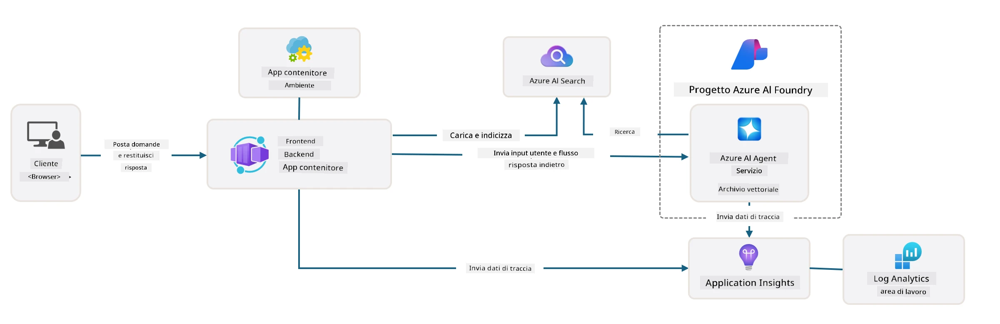

# 3. Decostruire un Template

!!! tip "ENTRO LA FINE DI QUESTO MODULO SARAI IN GRADO DI"

    - [ ] Attivare GitHub Copilot con i server MCP per assistenza Azure
    - [ ] Comprendere la struttura delle cartelle del template AZD e i componenti
    - [ ] Esplorare i modelli di organizzazione dell'infrastruttura come codice (Bicep)
    - [ ] **Lab 3:** Usare GitHub Copilot per esplorare e comprendere l'architettura del repository 

---


Con i template AZD e l'Azure Developer CLI (`azd`) possiamo avviare rapidamente il nostro percorso di sviluppo AI con repository standardizzati che forniscono codice di esempio, infrastruttura e file di configurazione - sotto forma di un _progetto di partenza_ pronto per il deployment.

**Ma ora, dobbiamo capire la struttura del progetto e il codice - e essere in grado di personalizzare il template AZD - senza alcuna esperienza o conoscenza pregressa di AZD!**

---

## 1. Attivare GitHub Copilot

### 1.1 Installare GitHub Copilot Chat

È il momento di esplorare [GitHub Copilot with Agent Mode](https://code.visualstudio.com/docs/copilot/chat/chat-agent-mode). Ora, possiamo usare il linguaggio naturale per descrivere il nostro compito a un alto livello e ottenere assistenza nell'esecuzione. Per questo laboratorio, useremo il [piano Copilot Free](https://github.com/github-copilot/signup) che ha un limite mensile per completamenti e interazioni in chat.

L'estensione può essere installata dal marketplace, ma dovrebbe già essere disponibile nel tuo ambiente Codespaces. _Clicca `Open Chat` dal menu a discesa dell'icona Copilot - e digita un prompt come `What can you do?`_ - potresti essere invitato a effettuare il login. **GitHub Copilot Chat è pronto**.

### 1.2. Installare i server MCP

Perché la modalità Agent sia efficace, ha bisogno di accesso agli strumenti giusti per aiutarla a recuperare conoscenza o eseguire azioni. Qui entrano in gioco i server MCP. Configureremo i seguenti server:

1. [Server MCP di Azure](../../../../../workshop/docs/instructions)
1. [Server MCP di Microsoft Docs](../../../../../workshop/docs/instructions)

Per attivarli:

1. Crea un file chiamato `.vscode/mcp.json` se non esiste
1. Copia quanto segue in quel file - e avvia i server!
   ```json title=".vscode/mcp.json"
   {
      "servers": {
         "Azure MCP Server": {
            "command": "npx",
            "args": [
            "-y",
            "@azure/mcp@latest",
            "server",
            "start"
            ]
         },
         "microsoft.docs.mcp": {
            "type": "http",
            "url": "https://learn.microsoft.com/api/mcp"
         }
      }
   }
   ```

??? warning "Potrebbe apparire un errore che `npx` non è installato (clicca per espandere la soluzione)"

      Per risolvere, apri il file `.devcontainer/devcontainer.json` e aggiungi questa riga alla sezione features. Poi ricostruisci il container. Dovresti ora avere `npx` installato.

      ```title="" linenums="0"
         "features": {
            "ghcr.io/devcontainers/features/node:1": {},
            ...
         },
      ```


---

### 1.3. Testare GitHub Copilot Chat

**Per prima cosa usa `az login` per autenticarti con Azure dalla riga di comando di VS Code.**

Dovresti ora essere in grado di interrogare lo stato della tua sottoscrizione Azure e porre domande sulle risorse distribuite o sulla configurazione. Prova questi prompt:

1. `List my Azure resource groups`
1. `#foundry list my current deployments`

Puoi anche porre domande alla documentazione Azure e ottenere risposte basate sul server MCP di Microsoft Docs. Prova questi prompt:

1. `#microsoft_docs_search What is Azure Developer CLI?`
1. `#microsoft_docs_search Show me a Python tutorial to chat with deployed model`

Oppure puoi chiedere frammenti di codice per completare un'attività. Prova questo prompt.

1. `Give me a Python code example that uses AAD for an interactive chat client`

In modalità `Ask`, questo fornirà codice che puoi copiare-incollare e provare. In modalità `Agent`, questo potrebbe fare un passo avanti e creare le risorse rilevanti per te - inclusi script di setup e documentazione - per aiutarti a eseguire quel compito.

**Ora sei attrezzato per iniziare a esplorare il repository del template**

---

## 2. Decostruire l'Architettura

??? prompt "CHIEDI: Spiega l'architettura dell'applicazione in docs/images/architecture.png in 1 paragrafo"

      Questa applicazione è un'applicazione di chat potenziata dall'AI costruita su Azure che dimostra un'architettura moderna basata su agenti. La soluzione ruota attorno a un Azure Container App che ospita il codice principale dell'applicazione, il quale processa l'input dell'utente e genera risposte intelligenti attraverso un agente AI. 
      
      L'architettura sfrutta Microsoft Foundry Project come base per le capacità AI, connettendosi ai servizi Azure AI che forniscono i modelli di linguaggio sottostanti (come GPT-4o-mini) e le funzionalità di agent. Le interazioni degli utenti fluiscono attraverso un frontend basato su React verso un backend FastAPI che comunica con il servizio agente AI per generare risposte contestuali. 
      
      Il sistema incorpora capacità di recupero della conoscenza attraverso la ricerca di file o il servizio Azure AI Search, permettendo all'agente di accedere e citare informazioni dai documenti caricati. Per l'eccellenza operativa, l'architettura include un monitoraggio completo tramite Application Insights e Log Analytics Workspace per tracing, logging e ottimizzazione delle prestazioni. 
      
      Azure Storage fornisce lo storage blob per i dati dell'applicazione e i caricamenti di file, mentre Managed Identity garantisce accesso sicuro tra le risorse Azure senza memorizzare credenziali. L'intera soluzione è progettata per scalabilità e manutenibilità, con l'applicazione containerizzata che scala automaticamente in base alla domanda fornendo allo stesso tempo sicurezza, monitoraggio e capacità CI/CD tramite l'ecosistema di servizi gestiti di Azure.



---

## 3. Struttura del Repository

!!! prompt "CHIEDI: Spiega la struttura delle cartelle del template. Inizia con un diagramma gerarchico visivo."

??? info "RISPOSTA: Diagramma Gerarchico Visivo"

      ```bash title="" 
      get-started-with-ai-agents/
      ├── 📋 Configurazione e impostazioni
      │   ├── azure.yaml                    # Configurazione di Azure Developer CLI
      │   ├── docker-compose.yaml           # Container per sviluppo locale
      │   ├── pyproject.toml                # Configurazione progetto Python
      │   ├── requirements-dev.txt          # Dipendenze di sviluppo
      │   └── .devcontainer/                # Configurazione dev container per VS Code
      │
      ├── 🏗️ Infrastruttura (infra/)
      │   ├── main.bicep                    # Template infrastruttura principale
      │   ├── api.bicep                     # Risorse specifiche per l'API
      │   ├── main.parameters.json          # Parametri dell'infrastruttura
      │   └── core/                         # Componenti infrastrutturali modulari
      │       ├── ai/                       # Configurazioni dei servizi AI
      │       ├── host/                     # Infrastruttura di hosting
      │       ├── monitor/                  # Monitoraggio e logging
      │       ├── search/                   # Configurazione Azure AI Search
      │       ├── security/                 # Sicurezza e identità
      │       └── storage/                  # Configurazioni account di storage
      │
      ├── 💻 Sorgente Applicazione (src/)
      │   ├── api/                          # Backend API
      │   │   ├── main.py                   # Punto di ingresso dell'applicazione FastAPI
      │   │   ├── routes.py                 # Definizioni delle route API
      │   │   ├── search_index_manager.py   # Funzionalità di ricerca
      │   │   ├── data/                     # Gestione dati dell'API
      │   │   ├── static/                   # Asset web statici
      │   │   └── templates/                # Template HTML
      │   ├── frontend/                     # Frontend React/TypeScript
      │   │   ├── package.json              # Dipendenze Node.js
      │   │   ├── vite.config.ts            # Configurazione build Vite
      │   │   └── src/                      # Codice sorgente frontend
      │   ├── data/                         # File di dati di esempio
      │   │   └── embeddings.csv            # Embeddings pre-calcolati
      │   ├── files/                        # File della knowledge base
      │   │   ├── customer_info_*.json      # Campioni di dati cliente
      │   │   └── product_info_*.md         # Documentazione prodotto
      │   ├── Dockerfile                    # Configurazione container
      │   └── requirements.txt              # Dipendenze Python
      │
      ├── 🔧 Automazione e script (scripts/)
      │   ├── postdeploy.sh/.ps1           # Configurazione post-deploy
      │   ├── setup_credential.sh/.ps1     # Configurazione credenziali
      │   ├── validate_env_vars.sh/.ps1    # Validazione delle variabili d'ambiente
      │   └── resolve_model_quota.sh/.ps1  # Gestione quote modelli
      │
      ├── 🧪 Test e valutazione
      │   ├── tests/                        # Test unitari e di integrazione
      │   │   └── test_search_index_manager.py
      │   ├── evals/                        # Framework di valutazione degli agenti
      │   │   ├── evaluate.py               # Esecutore di valutazioni
      │   │   ├── eval-queries.json         # Query di test
      │   │   └── eval-action-data-path.json
      │   ├── sandbox/                      # Area di sviluppo
      │   │   ├── 1-quickstart.py           # Esempi per iniziare
      │   │   └── aad-interactive-chat.py   # Esempi di autenticazione
      │   └── airedteaming/                 # Valutazione della sicurezza AI
      │       └── ai_redteaming.py          # Test red team
      │
      ├── 📚 Documentazione (docs/)
      │   ├── deployment.md                 # Guida al deployment
      │   ├── local_development.md          # Istruzioni per lo sviluppo locale
      │   ├── troubleshooting.md            # Problemi comuni e soluzioni
      │   ├── azure_account_setup.md        # Prerequisiti Azure
      │   └── images/                       # Risorse per la documentazione
      │
      └── 📄 Metadati del progetto
         ├── README.md                     # Panoramica del progetto
         ├── CODE_OF_CONDUCT.md           # Linee guida della community
         ├── CONTRIBUTING.md              # Guida alle contribuzioni
         ├── LICENSE                      # Termini della licenza
         └── next-steps.md                # Guida post-deploy
      ```

### 3.1. Architettura principale dell'app

Questo template segue un modello di **applicazione web full-stack** con:

- **Backend**: API Python FastAPI con integrazione Azure AI
- **Frontend**: TypeScript/React con sistema di build Vite
- **Infrastructure**: Template Azure Bicep per le risorse cloud
- **Containerization**: Docker per deployment coerenti

### 3.2 Infrastruttura come codice (Bicep)

Il livello di infrastruttura utilizza template **Azure Bicep** organizzati modularmente:

   - **`main.bicep`**: Orchestra tutte le risorse Azure
   - **`core/` modules**: Componenti riutilizzabili per diversi servizi
      - Servizi AI (Azure OpenAI, AI Search)
      - Hosting container (Azure Container Apps)
      - Monitoraggio (Application Insights, Log Analytics)
      - Sicurezza (Key Vault, Managed Identity)

### 3.3 Sorgente dell'applicazione (`src/`)

**API Backend (`src/api/`)**:

- API REST basata su FastAPI
- Integrazione con Foundry Agents
- Gestione dell'indice di ricerca per il recupero della conoscenza
- Capacità di upload ed elaborazione file

**Frontend (`src/frontend/`)**:

- SPA moderna React/TypeScript
- Vite per sviluppo rapido e build ottimizzate
- Interfaccia chat per interazioni con l'agente

**Base di conoscenza (`src/files/`)**:

- Dati esempio su clienti e prodotti
- Dimostra il recupero di conoscenza basato su file
- Esempi in formato JSON e Markdown


### 3.4 DevOps e automazione

**Script (`scripts/`)**:

- Script PowerShell e Bash multipiattaforma
- Validazione e configurazione dell'ambiente
- Configurazione post-deploy
- Gestione quote modello

**Integrazione con Azure Developer CLI**:

- Configurazione `azure.yaml` per i flussi di lavoro di `azd`
- Provisioning e deployment automatizzati
- Gestione delle variabili d'ambiente

### 3.5 Test e assicurazione della qualità

**Framework di valutazione (`evals/`)**:

- Valutazione delle prestazioni dell'agente
- Test della qualità delle risposte alle query
- Pipeline di valutazione automatizzata

**Sicurezza AI (`airedteaming/`)**:

- Test red team per la sicurezza AI
- Scansione per vulnerabilità di sicurezza
- Pratiche di AI responsabile

---

## 4. Congratulazioni 🏆

Hai usato con successo GitHub Copilot Chat con i server MCP per esplorare il repository.

- [X] Hai attivato GitHub Copilot per Azure
- [X] Hai compreso l'architettura dell'applicazione
- [X] Hai esplorato la struttura del template AZD

Questo ti dà un'idea degli asset di _infrastruttura come codice_ per questo template. Successivamente, esamineremo il file di configurazione per AZD.

---

<!-- CO-OP TRANSLATOR DISCLAIMER START -->
Dichiarazione di non responsabilità:
Questo documento è stato tradotto utilizzando il servizio di traduzione automatica basato su intelligenza artificiale Co‑op Translator (https://github.com/Azure/co-op-translator). Pur impegnandoci per garantire l’accuratezza, si prega di notare che le traduzioni automatiche possono contenere errori o imprecisioni. Il documento originale nella sua lingua deve essere considerato la fonte autorevole. Per informazioni critiche si raccomanda una traduzione professionale eseguita da un traduttore umano. Non siamo responsabili per eventuali malintesi o interpretazioni errate derivanti dall’uso di questa traduzione.
<!-- CO-OP TRANSLATOR DISCLAIMER END -->