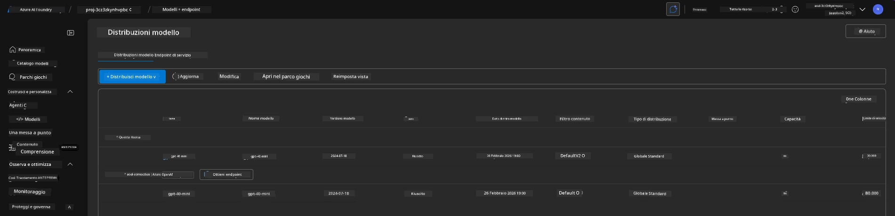

# 6. Smantellare l'Infrastruttura

!!! tip "ALLA FINE DI QUESTO MODULO SARAI IN GRADO DI"

    - [ ] Elemento
    - [ ] Elemento
    - [ ] Elemento

---

## Esercizi Bonus

Prima di smantellare il progetto, prenditi qualche minuto per fare un'esplorazione aperta.

!!! danger "NITYA-TODO: Definire alcuni suggerimenti da provare"

---

## Deprovisionare l'Infrastruttura

1. Smantellare l'infrastruttura è semplice come:
      
      ```bash title="" linenums="0"
      azd down --purge
      ```
1. Il flag `--purge` garantisce che vengano eliminati anche i servizi cognitivi soft-deleted, liberando così la quota occupata da queste risorse. Una volta completato, vedrai qualcosa di simile a questo:
      
      ```bash title="" linenums="0"
      ? Total resources to delete: 11, are you sure you want to continue? Yes
      Deleting your resources can take some time.
      (✓) Done: Deleted resource group rg-nitya-mshack-azd
      (✓) Done: Purging Cognitive Account: aoai-3cz3zkynhvpbc

      SUCCESS: Your application was removed from Azure in 11 minutes 4 seconds.
      ```

1. (Opzionale) Se ora esegui di nuovo `azd up`, noterai che il modello gpt-4.1 viene distribuito poiché la variabile d'ambiente è stata modificata (e salvata) nella cartella locale `.azure`.

      Ecco le distribuzioni del modello **prima**:

      

      Ed ecco **dopo**:
      

---

