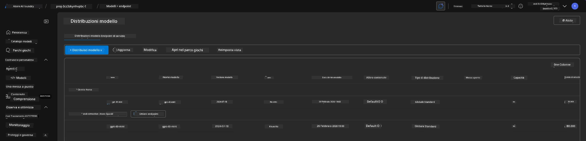
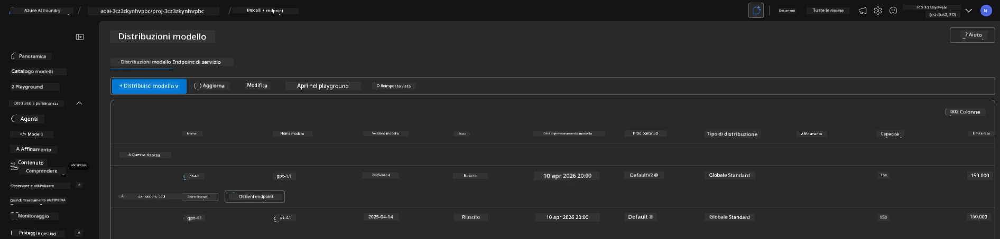

# 6. Smantellare l'infrastruttura

!!! tip "AL TERMINE DI QUESTO MODULO SARAI IN GRADO DI"

    - [ ] Comprendere l'importanza della pulizia delle risorse e della gestione dei costi
    - [ ] Usare `azd down` per rimuovere in modo sicuro l'infrastruttura
    - [ ] Recuperare i servizi cognitivi eliminati in soft-delete, se necessario
    - [ ] **Lab 6:** Pulire le risorse di Azure e verificare la rimozione

---

## Esercizi bonus

Prima di smantellare il progetto, prenditi qualche minuto per un'esplorazione libera.

!!! info "Prova questi suggerimenti per l'esplorazione"

    **Sperimenta con GitHub Copilot:**
    
    1. Chiedi: `What other AZD templates could I try for multi-agent scenarios?`
    2. Chiedi: `How can I customize the agent instructions for a healthcare use case?`
    3. Chiedi: `What environment variables control cost optimization?`
    
    **Esplora il Portale di Azure:**
    
    1. Esamina le metriche di Application Insights per la tua distribuzione
    2. Controlla l'analisi dei costi per le risorse provisionate
    3. Esplora di nuovo il playground degli agenti del portale Microsoft Foundry

---

## Rimozione dell'infrastruttura

1. Smantellare l'infrastruttura è semplice come:
      
      ```bash title="" linenums="0"
      azd down --purge
      ```
1. Il flag `--purge` assicura che vengano inoltre eliminati i servizi cognitivi rimossi in soft-delete, rilasciando così la quota occupata da queste risorse. Al termine vedrai qualcosa di simile:
      
      ```bash title="" linenums="0"
      ? Total resources to delete: 11, are you sure you want to continue? Yes
      Deleting your resources can take some time.
      (✓) Done: Deleted resource group rg-nitya-mshack-azd
      (✓) Done: Purging Cognitive Account: aoai-3cz3zkynhvpbc

      SUCCESS: Your application was removed from Azure in 11 minutes 4 seconds.
      ```

1. (Opzionale) Se ora esegui di nuovo `azd up`, noterai che il modello gpt-4.1 viene distribuito poiché la variabile d'ambiente è stata modificata (e salvata) nella cartella locale `.azure`. 

      Ecco le distribuzioni del modello **prima**:

      

      Ecco come appare **dopo**:
      

---

<!-- CO-OP TRANSLATOR DISCLAIMER START -->
Dichiarazione di non responsabilità:
Questo documento è stato tradotto utilizzando il servizio di traduzione basato su intelligenza artificiale Co-op Translator (https://github.com/Azure/co-op-translator). Sebbene ci impegniamo per garantire l'accuratezza, si prega di notare che le traduzioni automatiche possono contenere errori o imprecisioni. Il documento originale nella sua lingua di origine deve essere considerato la fonte autorevole. Per informazioni critiche, si raccomanda una traduzione professionale effettuata da un traduttore umano. Non siamo responsabili per eventuali fraintendimenti o interpretazioni errate derivanti dall'uso di questa traduzione.
<!-- CO-OP TRANSLATOR DISCLAIMER END -->