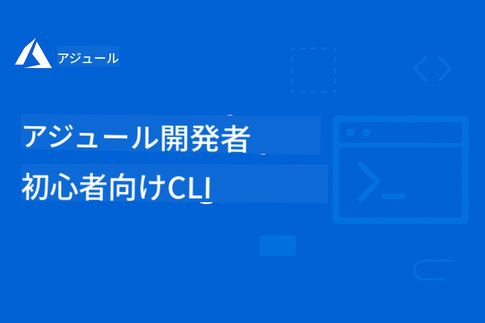

<!--
CO_OP_TRANSLATOR_METADATA:
{
  "original_hash": "3bd0e0644b110276e4364eb753ddcef8",
  "translation_date": "2025-09-09T16:24:30+00:00",
  "source_file": "README.md",
  "language_code": "ja"
}
-->
# AZD初心者向けガイド

 

[](https://GitHub.com/microsoft/azd-for-beginners/watchers/?WT.mc_id=academic-105485-koreyst)  
[](https://GitHub.com/microsoft/azd-for-beginners/network/?WT.mc_id=academic-105485-koreyst)  
[](https://GitHub.com/microsoft/azd-for-beginners/stargazers/?WT.mc_id=academic-105485-koreyst)  

[](https://discord.gg/microsoft-azure)  
[](https://discord.gg/kzRShWzttr)  

以下の手順に従って、これらのリソースを使い始めましょう:  
1. **リポジトリをフォークする**: [](https://GitHub.com/microsoft/azd-for-beginners/fork) をクリック  
2. **リポジトリをクローンする**: `git clone https://github.com/microsoft/azd-for-beginners.git`  
3. [**Azure Discordコミュニティに参加して、専門家や他の開発者と交流する**](https://discord.com/invite/ByRwuEEgH4)  

### 🌐 多言語対応

#### GitHub Actionによるサポート (自動化 & 常に最新)

[French](../fr/README.md) | [Spanish](../es/README.md) | [German](../de/README.md) | [Russian](../ru/README.md) | [Arabic](../ar/README.md) | [Persian (Farsi)](../fa/README.md) | [Urdu](../ur/README.md) | [Chinese (Simplified)](../zh/README.md) | [Chinese (Traditional, Macau)](../mo/README.md) | [Chinese (Traditional, Hong Kong)](../hk/README.md) | [Chinese (Traditional, Taiwan)](../tw/README.md) | [Japanese](./README.md) | [Korean](../ko/README.md) | [Hindi](../hi/README.md) | [Bengali](../bn/README.md) | [Marathi](../mr/README.md) | [Nepali](../ne/README.md) | [Punjabi (Gurmukhi)](../pa/README.md) | [Portuguese (Portugal)](../pt/README.md) | [Portuguese (Brazil)](../br/README.md) | [Italian](../it/README.md) | [Polish](../pl/README.md) | [Turkish](../tr/README.md) | [Greek](../el/README.md) | [Thai](../th/README.md) | [Swedish](../sv/README.md) | [Danish](../da/README.md) | [Norwegian](../no/README.md) | [Finnish](../fi/README.md) | [Dutch](../nl/README.md) | [Hebrew](../he/README.md) | [Vietnamese](../vi/README.md) | [Indonesian](../id/README.md) | [Malay](../ms/README.md) | [Tagalog (Filipino)](../tl/README.md) | [Swahili](../sw/README.md) | [Hungarian](../hu/README.md) | [Czech](../cs/README.md) | [Slovak](../sk/README.md) | [Romanian](../ro/README.md) | [Bulgarian](../bg/README.md) | [Serbian (Cyrillic)](../sr/README.md) | [Croatian](../hr/README.md) | [Slovenian](../sl/README.md) | [Ukrainian](../uk/README.md) | [Burmese (Myanmar)](../my/README.md)  

**追加の翻訳を希望する場合は、[こちら](https://github.com/Azure/co-op-translator/blob/main/getting_started/supported-languages.md)に対応言語が記載されています。**

## はじめに

Azure Developer CLI (azd) の包括的なガイドへようこそ。このリポジトリは、学生からプロフェッショナルな開発者まで、あらゆるレベルの開発者がAzure Developer CLIを学び、効率的なクラウドデプロイメントを実現するための支援を目的としています。この構造化された学習リソースは、Azureクラウドデプロイメントの実践的な経験、一般的な問題のトラブルシューティング、成功するAZDテンプレートデプロイメントのベストプラクティスの実装を提供します。

## 学習目標

このリポジトリを通じて以下を学びます:
- Azure Developer CLIの基本とコアコンセプトを習得する
- インフラストラクチャコードを使用してAzureリソースをデプロイおよびプロビジョニングする方法を学ぶ
- 一般的なAZDデプロイメントの問題に対するトラブルシューティングスキルを開発する
- デプロイ前の検証とキャパシティプランニングを理解する
- セキュリティのベストプラクティスとコスト最適化戦略を実装する
- Azureにプロダクション対応のアプリケーションをデプロイする自信を構築する

## 学習成果

このコースを完了すると、以下ができるようになります:
- Azure Developer CLIを正常にインストール、設定、使用する
- AZDテンプレートを使用してアプリケーションを作成およびデプロイする
- 認証、インフラストラクチャ、およびデプロイメントの問題をトラブルシューティングする
- キャパシティプランニングやSKU選択を含むデプロイ前のチェックを実行する
- モニタリング、セキュリティ、およびコスト管理のベストプラクティスを実装する
- AZDワークフローをCI/CDパイプラインに統合する

## 目次

- [Azure Developer CLIとは](../..)
- [クイックスタート](../..)
- [ドキュメント](../..)
- [例とテンプレート](../..)
- [リソース](../..)
- [コントリビューション](../..)

## Azure Developer CLIとは

Azure Developer CLI (azd) は、Azureへのアプリケーションの構築とデプロイを加速する開発者向けのコマンドラインインターフェイスです。以下を提供します:

- **テンプレートベースのデプロイメント** - 一般的なアプリケーションパターンのための事前構築テンプレートを使用
- **インフラストラクチャコード** - BicepまたはTerraformを使用してAzureリソースを管理
- **統合ワークフロー** - アプリケーションのプロビジョニング、デプロイ、およびモニタリングをシームレスに実行
- **開発者向け** - 開発者の生産性と体験を最適化

## クイックスタート

### 必要条件
- Azureサブスクリプション
- Azure CLIがインストールされていること
- Git (テンプレートをクローンするため)

### インストール
```bash
# Windows (PowerShell)
powershell -ex AllSigned -c "Invoke-RestMethod 'https://aka.ms/install-azd.ps1' | Invoke-Expression"

# macOS/Linux
curl -fsSL https://aka.ms/install-azd.sh | bash
```

### 初めてのデプロイメント
```bash
# Initialize a new project
azd init --template todo-nodejs-mongo

# Provision Azure resources and deploy
azd up
```

## ドキュメント

### 入門
- [**AZDの基本**](docs/getting-started/azd-basics.md) - コアコンセプトと用語
- [**インストールとセットアップ**](docs/getting-started/installation.md) - プラットフォーム別のインストールガイド
- [**設定**](docs/getting-started/configuration.md) - 環境設定と認証
- [**初めてのプロジェクト**](docs/getting-started/first-project.md) - ステップバイステップのチュートリアル

### デプロイメントとプロビジョニング
- [**デプロイメントガイド**](docs/deployment/deployment-guide.md) - 完全なデプロイメントワークフロー
- [**リソースのプロビジョニング**](docs/deployment/provisioning.md) - Azureリソース管理

### デプロイ前のチェック
- [**キャパシティプランニング**](docs/pre-deployment/capacity-planning.md) - Azureリソースのキャパシティ検証
- [**SKU選択**](docs/pre-deployment/sku-selection.md) - 適切なAzure SKUの選択
- [**事前チェック**](docs/pre-deployment/preflight-checks.md) - 自動化された検証スクリプト

### トラブルシューティング
- [**一般的な問題**](docs/troubleshooting/common-issues.md) - よくある問題と解決策
- [**デバッグガイド**](docs/troubleshooting/debugging.md) - ステップバイステップのデバッグ戦略

## 例とテンプレート

### スターターテンプレート
- [**シンプルなWebアプリケーション**](../../examples/simple-web-app) - 基本的なNode.js Webアプリケーションのデプロイ
- [**静的ウェブサイト**](../../examples/static-website) - Azure Storageでの静的ウェブサイトホスティング
- [**コンテナアプリケーション**](../../examples/container-app) - コンテナ化されたアプリケーションのデプロイ
- [**データベースアプリケーション**](../../examples/database-app) - データベース統合を含むWebアプリケーション

### 高度なシナリオ
- [**マイクロサービス**](../../examples/microservices) - 複数サービスのアプリケーションアーキテクチャ
- [**サーバーレス関数**](../../examples/serverless-function) - Azure Functionsのデプロイ
- [**設定例**](../../examples/configurations) - 再利用可能な設定パターン

## リソース

### クイックリファレンス
- [**コマンドチートシート**](resources/cheat-sheet.md) - 必須のazdコマンド
- [**用語集**](resources/glossary.md) - Azureとazdの用語
- [**FAQ**](resources/faq.md) - よくある質問
- [**学習ガイド**](resources/study-guide.md) - 包括的な学習目標と練習問題

### 外部リソース
- [Azure Developer CLIドキュメント](https://learn.microsoft.com/en-us/azure/developer/azure-developer-cli/)
- [Azureアーキテクチャセンター](https://learn.microsoft.com/en-us/azure/architecture/)
- [Azure料金計算機](https://azure.microsoft.com/pricing/calculator/)
- [Azureステータス](https://status.azure.com/)

## 学習パス

### 学生と初心者向け
1. [AZDの基本](docs/getting-started/azd-basics.md)から始める
2. [インストールガイド](docs/getting-started/installation.md)を確認する
3. [初めてのプロジェクト](docs/getting-started/first-project.md)を完了する
4. [シンプルなWebアプリの例](../../examples/simple-web-app)で練習する

### 開発者向け
1. [設定ガイド](docs/getting-started/configuration.md)を確認する
2. [デプロイメントガイド](docs/deployment/deployment-guide.md)を学ぶ
3. [データベースアプリの例](../../examples/database-app)を実践する
4. [コンテナアプリの例](../../examples/container-app)を探索する

### DevOpsエンジニア向け
1. [リソースのプロビジョニング](docs/deployment/provisioning.md)を習得する
2. [事前チェック](docs/pre-deployment/preflight-checks.md)を実装する
3. [キャパシティプランニング](docs/pre-deployment/capacity-planning.md)を練習する
4. 高度な[マイクロサービスの例](../../examples/microservices)を試す

## コントリビューション

コントリビューションを歓迎します！詳細は[コントリビューションガイド](CONTRIBUTING.md)をご覧ください:
- 問題や機能リクエストの提出方法
- コードコントリビューションのガイドライン
- ドキュメントの改善
- コミュニティ標準

## サポート

- **問題**: [バグ報告と機能リクエスト](https://github.com/microsoft/azd-for-beginners/issues)
- **ディスカッション**: [Microsoft Azure DiscordコミュニティでのQ&Aとディスカッション](https://discord.gg/microsoft-azure)
- **メール**: 非公開の問い合わせ
- **Microsoft Learn**: [公式Azure Developer CLIドキュメント](https://learn.microsoft.com/en-us/azure/developer/azure-developer-cli/)

## ライセンス

このプロジェクトはMITライセンスの下でライセンスされています。詳細は[LICENSE](../../LICENSE)ファイルをご覧ください。

## 🎒 その他のコース

私たちのチームが提供する他のコースもチェックしてください:

- [**NEW** Model Context Protocol (MCP) For Beginners](https://github.com/microsoft/mcp-for-beginners?WT.mc_id=academic-105485-koreyst)  
- [AI Agents for Beginners](https://github.com/microsoft/ai-agents-for-beginners?WT.mc_id=academic-105485-koreyst)  
- [Generative AI for Beginners using .NET](https://github.com/microsoft/Generative-AI-for-beginners-dotnet?WT.mc_id=academic-105485-koreyst)  
- [Generative AI for Beginners](https://github.com/microsoft/generative-ai-for-beginners?WT.mc_id=academic-105485-koreyst)  
- [Generative AI for Beginners using Java](https://github.com/microsoft/generative-ai-for-beginners-java?WT.mc_id=academic-105485-koreyst)  
- [ML for Beginners](https://aka.ms/ml-beginners?WT.mc_id=academic-105485-koreyst)  
- [Data Science for Beginners](https://aka.ms/datascience-beginners?WT.mc_id=academic-105485-koreyst)  
- [AI for Beginners](https://aka.ms/ai-beginners?WT.mc_id=academic-105485-koreyst)  
- [Cybersecurity for Beginners](https://github.com/microsoft/Security-101??WT.mc_id=academic-96948-sayoung)  
- [初心者向けWeb開発](https://aka.ms/webdev-beginners?WT.mc_id=academic-105485-koreyst)  
- [初心者向けIoT](https://aka.ms/iot-beginners?WT.mc_id=academic-105485-koreyst)  
- [初心者向けXR開発](https://github.com/microsoft/xr-development-for-beginners?WT.mc_id=academic-105485-koreyst)  
- [GitHub Copilotを活用したAIペアプログラミングの習得](https://aka.ms/GitHubCopilotAI?WT.mc_id=academic-105485-koreyst)  
- [C#/.NET開発者向けGitHub Copilotの習得](https://github.com/microsoft/mastering-github-copilot-for-dotnet-csharp-developers?WT.mc_id=academic-105485-koreyst)  
- [自分で選ぶCopilotの冒険](https://github.com/microsoft/CopilotAdventures?WT.mc_id=academic-105485-koreyst)  

---

**ナビゲーション**  
- **次のレッスン**: [AZDの基本](docs/getting-started/azd-basics.md)  

---

**免責事項**:  
この文書は、AI翻訳サービス [Co-op Translator](https://github.com/Azure/co-op-translator) を使用して翻訳されています。正確性を追求しておりますが、自動翻訳には誤りや不正確な部分が含まれる可能性があります。元の言語で記載された文書が正式な情報源とみなされるべきです。重要な情報については、専門の人間による翻訳を推奨します。この翻訳の使用に起因する誤解や誤解について、当社は責任を負いません。