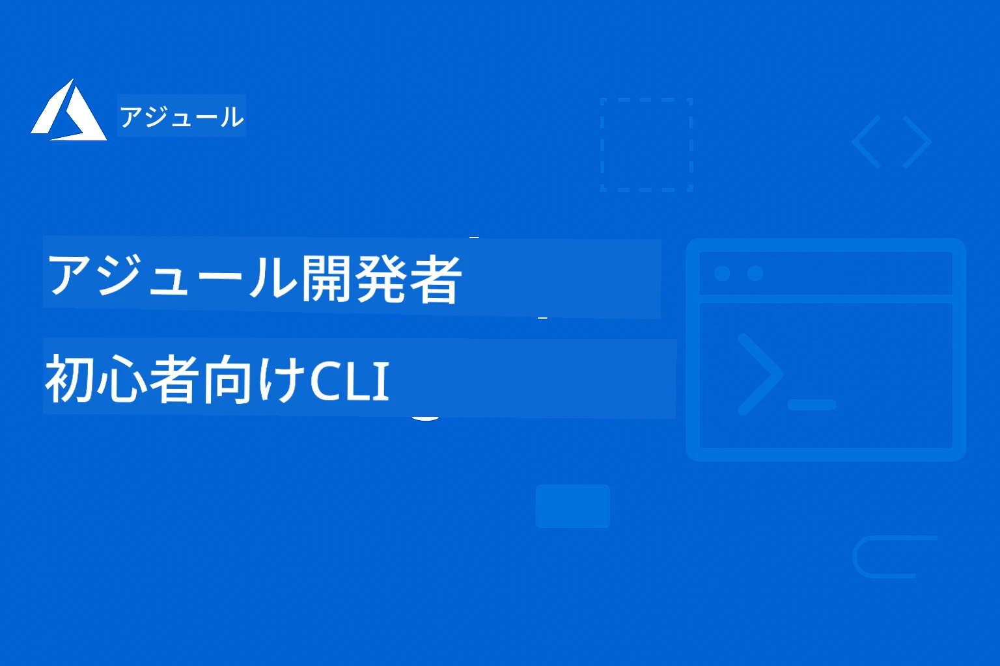

<!--
CO_OP_TRANSLATOR_METADATA:
{
  "original_hash": "068c87cc2641a81ca353ad7064ff326a",
  "translation_date": "2026-01-01T12:29:38+00:00",
  "source_file": "README.md",
  "language_code": "ja"
}
-->
# AZD For Beginners: A Structured Learning Journey

 

[](https://GitHub.com/microsoft/azd-for-beginners/watchers/)
[](https://GitHub.com/microsoft/azd-for-beginners/network/)
[](https://GitHub.com/microsoft/azd-for-beginners/stargazers/)

[](https://discord.gg/microsoft-azure)
[](https://discord.gg/nTYy5BXMWG)

## このコースの開始方法

AZD学習を始めるには、以下の手順に従ってください：

1. **リポジトリをフォークする**: Click [](https://GitHub.com/microsoft/azd-for-beginners/fork)
2. **リポジトリをクローンする**: `git clone https://github.com/microsoft/azd-for-beginners.git`
3. **コミュニティに参加する**: [Azure Discord コミュニティ](https://discord.com/invite/ByRwuEEgH4) で専門的なサポートを受ける
4. **学習パスを選択する**: 以下の章から自分の経験レベルに合った章を選んでください

### 多言語サポート

#### 自動翻訳（常に最新）

<!-- CO-OP TRANSLATOR LANGUAGES TABLE START -->
[アラビア語](../ar/README.md) | [ベンガル語](../bn/README.md) | [ブルガリア語](../bg/README.md) | [ビルマ語（ミャンマー）](../my/README.md) | [中国語（簡体字）](../zh/README.md) | [中国語（繁体字、香港）](../hk/README.md) | [中国語（繁体字、マカオ）](../mo/README.md) | [中国語（繁体字、台湾）](../tw/README.md) | [クロアチア語](../hr/README.md) | [チェコ語](../cs/README.md) | [デンマーク語](../da/README.md) | [オランダ語](../nl/README.md) | [エストニア語](../et/README.md) | [フィンランド語](../fi/README.md) | [フランス語](../fr/README.md) | [ドイツ語](../de/README.md) | [ギリシャ語](../el/README.md) | [ヘブライ語](../he/README.md) | [ヒンディー語](../hi/README.md) | [ハンガリー語](../hu/README.md) | [インドネシア語](../id/README.md) | [イタリア語](../it/README.md) | [日本語](./README.md) | [カンナダ語](../kn/README.md) | [韓国語](../ko/README.md) | [リトアニア語](../lt/README.md) | [マレー語](../ms/README.md) | [マラヤーラム語](../ml/README.md) | [マラーティー語](../mr/README.md) | [ネパール語](../ne/README.md) | [ナイジェリア・ピジン語](../pcm/README.md) | [ノルウェー語](../no/README.md) | [ペルシア語（ファルシー）](../fa/README.md) | [ポーランド語](../pl/README.md) | [ポルトガル語（ブラジル）](../br/README.md) | [ポルトガル語（ポルトガル）](../pt/README.md) | [パンジャブ語（グルムキー）](../pa/README.md) | [ルーマニア語](../ro/README.md) | [ロシア語](../ru/README.md) | [セルビア語（キリル文字）](../sr/README.md) | [スロバキア語](../sk/README.md) | [スロベニア語](../sl/README.md) | [スペイン語](../es/README.md) | [スワヒリ語](../sw/README.md) | [スウェーデン語](../sv/README.md) | [タガログ語（フィリピン）](../tl/README.md) | [タミル語](../ta/README.md) | [テルグ語](../te/README.md) | [タイ語](../th/README.md) | [トルコ語](../tr/README.md) | [ウクライナ語](../uk/README.md) | [ウルドゥー語](../ur/README.md) | [ベトナム語](../vi/README.md)
<!-- CO-OP TRANSLATOR LANGUAGES TABLE END -->

## コース概要

Azure Developer CLI（azd）を段階的な章で学び、習熟します。**特に Microsoft Foundry と連携した AI アプリケーションのデプロイに重点を置きます。**

### なぜこのコースが現代の開発者に不可欠なのか

Microsoft Foundry の Discord コミュニティの見解に基づくと、**45% の開発者が AI ワークロードに AZD を使用したい**と考えていますが、以下の課題に直面しています：
- 複雑なマルチサービスの AI アーキテクチャ
- 本番向け AI デプロイのベストプラクティス
- Azure AI サービスの統合と設定
- AI ワークロードのコスト最適化
- AI 固有のデプロイに関するトラブルシューティング

### 学習目標

この構造化されたコースを修了することで、あなたは以下を達成できます：
- **AZDの基本をマスターする**: コア概念、インストール、設定
- **AIアプリケーションをデプロイする**: Microsoft Foundry サービスと AZD を使用
- **Infrastructure as Code を実装する**: Bicep テンプレートで Azure リソースを管理
- **デプロイのトラブルシューティングを行う**: よくある問題を解決しデバッグする
- **本番向けに最適化する**: セキュリティ、スケーリング、監視、コスト管理
- **マルチエージェントソリューションを構築する**: 複雑な AI アーキテクチャをデプロイ

## 📚 学習章

*経験レベルと目標に基づいて学習パスを選んでください*

### 🚀 第1章：基礎とクイックスタート
**前提条件**: Azure サブスクリプション、基本的なコマンドライン知識  
**所要時間**: 30-45 分  
**難易度**: ⭐

#### 学習内容
- Azure Developer CLI の基本の理解
- プラットフォームへの AZD のインストール
- 最初のデプロイの成功

#### 学習リソース
- **🎯 ここから始める**: [Azure Developer CLIとは？](../..)
- **📖 理論**: [AZDの基本](docs/getting-started/azd-basics.md) - コア概念と用語
- **⚙️ セットアップ**: [インストールとセットアップ](docs/getting-started/installation.md) - プラットフォーム別ガイド
- **🛠️ ハンズオン**: [最初のプロジェクト](docs/getting-started/first-project.md) - ステップバイステップチュートリアル
- **📋 クイックリファレンス**: [コマンド チートシート](resources/cheat-sheet.md)

#### 実践演習
```bash
# インストールの簡易チェック
azd version

# 最初のアプリケーションをデプロイする
azd init --template todo-nodejs-mongo
azd up
```

**💡 章の成果**: AZD を使用してシンプルな Web アプリケーションを Azure に正常にデプロイする

**✅ 成功の検証:**
```bash
# 第1章を終えたら、次のことができるようになっているはずです:
azd version              # インストールされているバージョンを表示します
azd init --template todo-nodejs-mongo  # プロジェクトを初期化します
azd up                  # Azure にデプロイします
azd show                # 実行中のアプリの URL を表示します
# アプリケーションがブラウザーで開き、動作します
azd down --force --purge  # リソースをクリーンアップします
```

**📊 所要時間:** 30-45 分  
**📈 習得レベル:** 基本的なアプリケーションを独立してデプロイできる

**✅ 成功の検証:**
```bash
# 第1章を修了すると、次のことができるようになります:
azd version              # インストールされているバージョンを表示する
azd init --template todo-nodejs-mongo  # プロジェクトを初期化する
azd up                  # Azure にデプロイする
azd show                # 実行中のアプリの URL を表示する
# アプリがブラウザで開いて動作する
azd down --force --purge  # リソースをクリーンアップする
```

**📊 所要時間:** 30-45 分  
**📈 習得レベル:** 基本的なアプリケーションを独立してデプロイできる

---

### 🤖 第2章：AIファースト開発（AI開発者推奨）
**前提条件**: 第1章を修了していること  
**所要時間**: 1-2 時間  
**難易度**: ⭐⭐

#### 学習内容
- AZD と Microsoft Foundry の統合
- AI搭載アプリケーションのデプロイ
- AIサービスの設定の理解

#### 学習リソース
- **🎯 ここから始める**: [Microsoft Foundry 統合](docs/microsoft-foundry/microsoft-foundry-integration.md)
- **📖 パターン**: [AIモデルのデプロイ](docs/microsoft-foundry/ai-model-deployment.md) - AI モデルのデプロイと管理
- **🛠️ ワークショップ**: [AI ワークショップラボ](docs/microsoft-foundry/ai-workshop-lab.md) - AI ソリューションを AZD 対応にする
- **🎥 インタラクティブガイド**: [ワークショップ資料](workshop/README.md) - MkDocs を使用したブラウザベースの学習 * DevContainer 環境
- **📋 テンプレート**: [Microsoft Foundry テンプレート](../..)
- **📝 例**: [AZD デプロイ例](examples/README.md)

#### 実践演習
```bash
# 最初のAIアプリケーションをデプロイする
azd init --template azure-search-openai-demo
azd up

# 追加のAIテンプレートを試す
azd init --template openai-chat-app-quickstart
azd init --template agent-openai-python-prompty
```

**💡 章の成果**: RAG 機能を備えた AI チャットアプリケーションをデプロイおよび構成する

**✅ 成功の検証:**
```bash
# 第2章の後、次のことができるようになります:
azd init --template azure-search-openai-demo
azd up
# AIチャットインターフェースをテストする
# 質問をして、出典付きのAIによる回答を得る
# 検索統合が機能することを確認する
azd monitor  # Application Insights がテレメトリを表示していることを確認する
azd down --force --purge
```

**📊 所要時間:** 1-2 時間  
**📈 習得レベル:** 本番対応の AI アプリケーションをデプロイおよび構成できる  
**💰 コスト認識:** 開発で月 $80-150、運用で月 $300-3500 のコストを理解する

#### 💰 AI デプロイのコストに関する考慮事項

**開発環境（推定 $80-150/月）:**
- Azure OpenAI（従量課金）: $0-50/月（トークン使用量に基づく）
- AI Search（Basic ティア）: $75/月
- Container Apps（消費課金）: $0-20/月
- ストレージ（Standard）: $1-5/月

**本番環境（推定 $300-3,500+/月）:**
- Azure OpenAI（安定したパフォーマンスのための PTU）: $3,000+/月 または 大量利用時は従量課金
- AI Search（Standard ティア）: $250/月
- Container Apps（専用）: $50-100/月
- Application Insights: $5-50/月
- ストレージ（Premium）: $10-50/月

**💡 コスト最適化のヒント:**
- 学習には **Free Tier** の Azure OpenAI を利用する（50,000 トークン/月が含まれる）
- `azd down` を実行して、アクティブに開発していないときはリソースの割り当てを解除する
- まずは消費ベースの課金で開始し、本番用にのみ PTU にアップグレードする
- デプロイ前に `azd provision --preview` でコストを見積もる
- オートスケーリングを有効にする：実際の使用分のみ支払う

**コスト監視:**
```bash
# 推定の月間費用を確認する
azd provision --preview

# Azure ポータルで実際の費用を監視する
az consumption budget list --resource-group <your-rg>
```

---

### ⚙️ 第3章：設定と認証
**前提条件**: 第1章を修了していること  
**所要時間**: 45-60 分  
**難易度**: ⭐⭐

#### 学習内容
- 環境の設定と管理
- 認証とセキュリティのベストプラクティス
- リソース命名と整理

#### 学習リソース
- **📖 設定**: [設定ガイド](docs/getting-started/configuration.md) - 環境設定
- **🔐 セキュリティ**: [認証パターンとマネージドID](docs/getting-started/authsecurity.md) - 認証パターン
- **📝 例**: [データベースアプリの例](examples/database-app/README.md) - AZD データベースの例

#### 実践演習
- 複数の環境を設定する（dev、staging、prod）
- マネージド ID 認証を設定する
- 環境固有の設定を実装する

**💡 章の成果**: 適切な認証とセキュリティを備えた複数の環境を管理する

---

### 🏗️ 第4章：Infrastructure as Code（IaC）とデプロイ
**前提条件**: 第1〜3章を修了していること  
**所要時間**: 1-1.5 時間  
**難易度**: ⭐⭐⭐

#### 学習内容
- 高度なデプロイパターン
- Bicep を使った Infrastructure as Code
- リソースプロビジョニング戦略

#### 学習リソース
- **📖 デプロイ**: [デプロイガイド](docs/deployment/deployment-guide.md) - 完全なワークフロー
- **🏗️ プロビジョニング**: [リソースのプロビジョニング](docs/deployment/provisioning.md) - Azure リソース管理
- **📝 例**: [Container App の例](../../examples/container-app) - コンテナ化されたデプロイ

#### 実践演習
- カスタム Bicep テンプレートを作成する
- マルチサービスアプリケーションをデプロイする
- ブルーグリーンデプロイ戦略を実装する

**💡 章の成果**: カスタムインフラテンプレートを使用して複雑なマルチサービスアプリケーションをデプロイする

---

### 🎯 第5章：マルチエージェントAIソリューション（上級）
**前提条件**: 第1〜2章を修了していること  
**所要時間**: 2-3 時間  
**難易度**: ⭐⭐⭐⭐

#### 学習内容
- マルチエージェントアーキテクチャパターン
- エージェントのオーケストレーションと調整
- 本番対応の AI デプロイ

#### 学習リソース
- **🤖 注目プロジェクト**: [小売マルチエージェントソリューション](examples/retail-scenario.md) - 完全な実装
- **🛠️ ARM テンプレート**: [ARM Template Package](../../examples/retail-multiagent-arm-template) - ワンクリックでのデプロイ
- **📖 アーキテクチャ**: [マルチエージェント調整パターン](/docs/pre-deployment/coordination-patterns.md) - パターン

#### 実践演習
```bash
# 完全な小売向けマルチエージェントソリューションを展開する
cd examples/retail-multiagent-arm-template
./deploy.sh

# エージェントの構成を確認する
az deployment group show --resource-group <rg-name> --name <deployment-name>
```

**💡 チャプターの成果**: カスタマーとインベントリアージェントを備えた本番対応のマルチエージェントAIソリューションをデプロイおよび管理する

---

### 🔍 第6章: 事前デプロイ検証と計画
**前提条件**: 第4章を完了済み  
**所要時間**: 1時間  
**難易度**: ⭐⭐

#### 学習内容
- キャパシティプランニングとリソース検証
- SKU選定戦略
- 事前チェックと自動化

#### 学習資料
- **📊 計画**: [キャパシティプランニング](docs/pre-deployment/capacity-planning.md) - リソース検証
- **💰 選定**: [SKU選定](docs/pre-deployment/sku-selection.md) - コスト効率の良い選択
- **✅ 検証**: [事前チェック](docs/pre-deployment/preflight-checks.md) - 自動化スクリプト

#### 実践演習
- キャパシティ検証スクリプトを実行する
- コスト最適化のためにSKU選定を最適化する
- 自動化された事前デプロイチェックを実装する

**💡 チャプターの成果**: 実行前にデプロイを検証および最適化する

---

### 🚨 第7章: トラブルシューティングとデバッグ
**前提条件**: 任意のデプロイ章を完了済み  
**所要時間**: 1～1.5時間  
**難易度**: ⭐⭐

#### 学習内容
- 体系的なデバッグ手法
- 一般的な問題と解決策
- AI固有のトラブルシューティング

#### 学習資料
- **🔧 よくある問題**: [Common Issues](docs/troubleshooting/common-issues.md) - FAQと解決策
- **🕵️ デバッグ**: [Debugging Guide](docs/troubleshooting/debugging.md) - 手順に沿った戦略
- **🤖 AI問題**: [AI-Specific Troubleshooting](docs/troubleshooting/ai-troubleshooting.md) - AIサービスの問題

#### 実践演習
- デプロイ失敗を診断する
- 認証の問題を解決する
- AIサービスの接続性をデバッグする

**💡 チャプターの成果**: 一般的なデプロイの問題を独力で診断・解決できるようになる

---

### 🏢 第8章: 本番およびエンタープライズパターン
**前提条件**: 第1章～第4章を完了済み  
**所要時間**: 2～3時間  
**難易度**: ⭐⭐⭐⭐

#### 学習内容
- 本番環境へのデプロイ戦略
- エンタープライズ向けセキュリティパターン
- 監視とコスト最適化

#### 学習資料
- **🏭 本番**: [Production AI Best Practices](docs/microsoft-foundry/production-ai-practices.md) - エンタープライズパターン
- **📝 例**: [Microservices Example](../../examples/microservices) - 複雑なアーキテクチャ
- **📊 監視**: [Application Insights integration](docs/pre-deployment/application-insights.md) - 監視

#### 実践演習
- エンタープライズ向けセキュリティパターンを実装する
- 包括的な監視を設定する
- 適切なガバナンスのもとで本番環境にデプロイする

**💡 チャプターの成果**: 完全な本番機能を備えたエンタープライズ対応アプリケーションをデプロイする

---

## 🎓 ワークショップ概要: ハンズオン学習体験

> **⚠️ ワークショップ状況: 開発中**  
> ワークショップ資料は現在開発および改良中です。コアモジュールは稼働していますが、一部の高度なセクションは未完成です。すべてのコンテンツ完成に向けて積極的に作業しています。 [進捗を確認 →](workshop/README.md)

### インタラクティブなワークショップ資料
**ブラウザベースのツールとガイド付き演習による包括的なハンズオン学習**

当ワークショップ資料は、上記の章ベースのカリキュラムを補完する構造化されたインタラクティブな学習体験を提供します。ワークショップは自己学習と講師主導の両方に対応するよう設計されています。

#### 🛠️ ワークショップの特徴
- **ブラウザベースのインターフェース**: 検索、コピー、テーマ機能を備えたMkDocsによるワークショップ
- **GitHub Codespaces 統合**: ワンクリックで開発環境をセットアップ
- **構造化された学習パス**: 7ステップのガイド付き演習（合計3.5時間）
- **発見 → デプロイ → カスタマイズ**: 段階的な方法論
- **インタラクティブな DevContainer 環境**: 事前構成されたツールと依存関係

#### 📚 ワークショップ構成
ワークショップは **発見 → デプロイ → カスタマイズ** の方法論に従っています:

1. **発見フェーズ** (45分)
   - Microsoft Foundry テンプレートとサービスを探索する
   - マルチエージェントアーキテクチャパターンを理解する
   - デプロイ要件と前提条件を確認する

2. **デプロイフェーズ** (2時間)
   - AZDを使ったAIアプリケーションのハンズオンデプロイ
   - Azure AIサービスとエンドポイントを構成する
   - セキュリティと認証パターンを実装する

3. **カスタマイズフェーズ** (45分)
   - 特定のユースケース向けにアプリケーションを修正する
   - 本番デプロイ向けに最適化する
   - 監視とコスト管理を実装する

#### 🚀 ワークショップの始め方
```bash
# オプション1: GitHub Codespaces（推奨）
# リポジトリで「Code」をクリックし、「Create codespace on main」を選択

# オプション2: ローカル開発
git clone https://github.com/microsoft/azd-for-beginners.git
cd azd-for-beginners/workshop
# workshop/README.md にあるセットアップ手順に従ってください
```

#### 🎯 ワークショップの学習成果
ワークショップを完了すると、参加者は以下を達成できます:
- **本番向けAIアプリケーションをデプロイする**: AZDとMicrosoft Foundryサービスを使用
- **マルチエージェントアーキテクチャを習得する**: 協調するAIエージェントソリューションを実装
- **セキュリティベストプラクティスを実装する**: 認証とアクセス制御を構成
- **スケール向けに最適化する**: コスト効率が高くパフォーマンスの良いデプロイを設計
- **デプロイのトラブルシューティングを行う**: 一般的な問題を独力で解決

#### 📖 ワークショップ資料
- **🎥 インタラクティブガイド**: [Workshop Materials](workshop/README.md) - ブラウザベースの学習環境
- **📋 ステップバイステップの手順**: [Guided Exercises](../../workshop/docs/instructions) - 詳細なウォークスルー
- **🛠️ AIワークショップラボ**: [AI Workshop Lab](docs/microsoft-foundry/ai-workshop-lab.md) - AIに焦点を当てた演習
- **💡 クイックスタート**: [Workshop Setup Guide](workshop/README.md#quick-start) - 環境構成

**対象**: 企業研修、大学のコース、自己学習、開発者ブートキャンプに最適。

---

## 📖 Azure Developer CLIとは？

Azure Developer CLI (azd) は、アプリケーションのビルドとAzureへのデプロイプロセスを加速する開発者向けコマンドラインインターフェースです。提供する主な機能は次のとおりです:

- **テンプレートベースのデプロイ** - 一般的なアプリケーションパターン向けの事前構成済みテンプレートを使用
- **Infrastructure as Code** - BicepやTerraformを使ってAzureリソースを管理
- **統合ワークフロー** - シームレスにプロビジョニング、デプロイ、監視を行う
- **開発者に優しい** - 開発者の生産性と体験を最適化

### **AZD + Microsoft Foundry: AIデプロイに最適**

**なぜAZDがAIソリューションに向いているのか？** AZDはAI開発者が直面する主要な課題に対応します:

- **AI対応テンプレート** - Azure OpenAI、Cognitive Services、MLワークロード向けの事前構成テンプレート
- **安全なAIデプロイ** - AIサービス、APIキー、モデルエンドポイント向けの組み込みセキュリティパターン  
- **本番AIパターン** - スケーラブルでコスト効果の高いAIアプリケーションデプロイのベストプラクティス
- **エンドツーエンドのAIワークフロー** - モデル開発から本番デプロイまで、適切な監視を含む
- **コスト最適化** - AIワークロード向けのスマートなリソース割り当てとスケーリング戦略
- **Microsoft Foundry 統合** - Microsoft Foundryのモデルカタログとエンドポイントへのシームレスな接続

---

## 🎯 テンプレート＆例ライブラリ

### 注目: Microsoft Foundry テンプレート
**AIアプリケーションをデプロイする場合はここから始めましょう！**

> **注:** これらのテンプレートはさまざまなAIパターンを示しています。いくつかは外部のAzure Samplesで、その他はローカル実装です。

| テンプレート | 章 | 難易度 | サービス | 種類 |
|----------|---------|------------|----------|------|
| [**Get started with AI chat**](https://github.com/Azure-Samples/get-started-with-ai-chat) | 第2章 | ⭐⭐ | AzureOpenAI + Azure AI Model Inference API + Azure AI Search + Azure Container Apps + Application Insights | 外部 |
| [**Get started with AI agents**](https://github.com/Azure-Samples/get-started-with-ai-agents) | 第2章 | ⭐⭐ | Azure AI Agent Service + AzureOpenAI + Azure AI Search + Azure Container Apps + Application Insights| 外部 |
| [**Azure Search + OpenAI Demo**](https://github.com/Azure-Samples/azure-search-openai-demo) | 第2章 | ⭐⭐ | AzureOpenAI + Azure AI Search + App Service + Storage | 外部 |
| [**OpenAI Chat App Quickstart**](https://github.com/Azure-Samples/openai-chat-app-quickstart) | 第2章 | ⭐ | AzureOpenAI + Container Apps + Application Insights | 外部 |
| [**Agent OpenAI Python Prompty**](https://github.com/Azure-Samples/agent-openai-python-prompty) | 第5章 | ⭐⭐⭐ | AzureOpenAI + Azure Functions + Prompty | 外部 |
| [**Contoso Chat RAG**](https://github.com/Azure-Samples/contoso-chat) | 第8章 | ⭐⭐⭐⭐ | AzureOpenAI + AI Search + Cosmos DB + Container Apps | 外部 |
| [**Retail Multi-Agent Solution**](examples/retail-scenario.md) | 第5章 | ⭐⭐⭐⭐ | AzureOpenAI + AI Search + Storage + Container Apps + Cosmos DB | **ローカル** |

### 注目: 完全な学習シナリオ
**本番対応のアプリケーションテンプレートを学習章にマッピング**

| Template | 学習章 | 難易度 | 主要学習内容 |
|----------|------------------|------------|--------------|
| [**openai-chat-app-quickstart**](https://github.com/Azure-Samples/openai-chat-app-quickstart) | 第2章 | ⭐ | 基本的なAIデプロイパターン |
| [**azure-search-openai-demo**](https://github.com/Azure-Samples/azure-search-openai-demo) | 第2章 | ⭐⭐ | Azure AI SearchによるRAG実装 |
| [**ai-document-processing**](https://github.com/Azure-Samples/ai-document-processing) | 第4章 | ⭐⭐ | ドキュメントインテリジェンス統合 |
| [**agent-openai-python-prompty**](https://github.com/Azure-Samples/agent-openai-python-prompty) | 第5章 | ⭐⭐⭐ | エージェントフレームワークと関数呼び出し |
| [**contoso-chat**](https://github.com/Azure-Samples/contoso-chat) | 第8章 | ⭐⭐⭐ | エンタープライズAIオーケストレーション |
| [**retail-multi-agent-solution**](examples/retail-scenario.md) | 第5章 | ⭐⭐⭐⭐ | カスタマーとインベントリエージェントを持つマルチエージェントアーキテクチャ |

### 例による学習タイプ

> **📌 ローカル例 vs 外部例:**  
> **ローカル例** (このリポジトリ内) = すぐに利用可能  
> **外部例** (Azure Samples) = リンク先のリポジトリをクローンしてください

#### ローカル例（すぐに使用可能）
- [**Retail Multi-Agent Solution**](examples/retail-scenario.md) - ARMテンプレートを使った本番対応の完全実装
  - マルチエージェントアーキテクチャ（カスタマー + インベントリエージェント）
  - 包括的な監視と評価
  - ARMテンプレートによるワンクリックデプロイ

#### ローカル例 - コンテナアプリケーション (第2章～第5章)
**このリポジトリにある包括的なコンテナデプロイの例:**
- [**Container App Examples**](examples/container-app/README.md) - コンテナ化されたデプロイの完全ガイド
  - [Simple Flask API](../../examples/container-app/simple-flask-api) - scale-to-zero対応の基本的なREST API
  - [Microservices Architecture](../../examples/container-app/microservices) - 本番対応のマルチサービスデプロイ
  - クイックスタート、本番、上級のデプロイパターン
  - 監視、セキュリティ、コスト最適化のガイダンス

#### 外部例 - シンプルなアプリケーション (第1章～第2章)
**ここからクローンして始められるAzure Samplesリポジトリ:**
- [Simple Web App - Node.js + MongoDB](https://github.com/Azure-Samples/todo-nodejs-mongo) - 基本的なデプロイパターン
- [Static Website - React SPA](https://github.com/Azure-Samples/todo-csharp-sql-swa-func) - 静的コンテンツのデプロイ
- [Container App - Python Flask](https://github.com/Azure-Samples/container-apps-store-api-microservice) - REST APIのデプロイ

#### 外部例 - データベース統合 (第3章～第4章)  
- [Database App - C# + SQL](https://github.com/Azure-Samples/todo-csharp-sql) - データベース接続パターン
- [Functions + Cosmos DB](https://github.com/Azure-Samples/todo-python-mongo-swa-func) - サーバーレスのデータワークフロー

#### 外部例 - 高度なパターン (第4章～第8章)
- [Java Microservices](https://github.com/Azure-Samples/java-microservices-aca-lab) - マルチサービスアーキテクチャ
- [Container Apps Jobs](https://github.com/Azure-Samples/container-apps-jobs) - バックグラウンド処理  
- [Enterprise ML Pipeline](https://github.com/Azure-Samples/mlops-v2) - 本番対応のMLパターン

### 外部テンプレートコレクション
- [**Official AZD Template Gallery**](https://azure.github.io/awesome-azd/) - 公式およびコミュニティのテンプレートを厳選
- [**Azure Developer CLI Templates**](https://learn.microsoft.com/en-us/azure/developer/azure-developer-cli/azd-templates) - Microsoft Learn のテンプレートドキュメント
- [**Examples Directory**](examples/README.md) - ローカル学習例と詳細な説明

---

## 📚 学習資料と参考文献

### クイックリファレンス
- [**コマンド チートシート**](resources/cheat-sheet.md) - 章別に整理された必須の azd コマンド
- [**用語集**](resources/glossary.md) - Azure と azd の用語  
- [**よくある質問**](resources/faq.md) - 学習章ごとに整理された一般的な質問
- [**学習ガイド**](resources/study-guide.md) - 包括的な演習

### ハンズオン ワークショップ
- [**AI ワークショップ ラボ**](docs/microsoft-foundry/ai-workshop-lab.md) - AI ソリューションを AZD でデプロイ可能にする（2-3時間）
- [**インタラクティブ ワークショップ ガイド**](workshop/README.md) - MkDocs と DevContainer 環境を使ったブラウザベースのワークショップ
- [**Structured Learning Path**](../../workshop/docs/instructions) -7ステップのガイド付き演習 (探索 → デプロイ → カスタマイズ)
- [**AZD 初心者向けワークショップ**](workshop/README.md) - GitHub Codespaces 統合を含む完全なハンズオン ワークショップ資料

### 外部学習リソース
- [Azure Developer CLI ドキュメント](https://learn.microsoft.com/en-us/azure/developer/azure-developer-cli/)
- [Azure アーキテクチャ センター](https://learn.microsoft.com/en-us/azure/architecture/)
- [Azure 料金計算ツール](https://azure.microsoft.com/pricing/calculator/)
- [Azure ステータス](https://status.azure.com/)

---

## 🔧 クイック トラブルシューティング ガイド

**初心者が直面する一般的な問題と即時の解決策：**

### ❌ "azd: command not found"

```bash
# まず AZD をインストールする
# Windows (PowerShell):
winget install microsoft.azd

# macOS:
brew tap azure/azd && brew install azd

# Linux:
curl -fsSL https://aka.ms/install-azd.sh | bash

# インストールを確認する
azd version
```

### ❌ "No subscription found" or "Subscription not set"

```bash
# 利用可能なサブスクリプションを一覧表示
az account list --output table

# デフォルトのサブスクリプションを設定
az account set --subscription "<subscription-id-or-name>"

# AZD 環境用に設定
azd env set AZURE_SUBSCRIPTION_ID "<subscription-id>"

# 検証
az account show
```

### ❌ "InsufficientQuota" or "Quota exceeded"

```bash
# 別の Azure リージョンを試してください
azd env set AZURE_LOCATION "westus2"
azd up

# または開発環境ではより小さい SKU を使用してください
# infra/main.parameters.json を編集してください:
{
  "sku": "B1"  // Instead of "P1V2"
}
```

### ❌ "azd up" が途中で失敗する

```bash
# オプション 1: クリーンして再試行
azd down --force --purge
azd up

# オプション 2: インフラだけ修正する
azd provision

# オプション 3: 詳細なログを確認する
azd show
azd logs
```

### ❌ "Authentication failed" or "Token expired"

```bash
# 再認証する
az logout
az login

azd auth logout
azd auth login

# 認証を確認する
az account show
```

### ❌ "Resource already exists" or naming conflicts

```bash
# AZD は一意の名前を生成しますが、競合が発生した場合:
azd down --force --purge

# その場合は新しい環境で再試行してください
azd env new dev-v2
azd up
```

### ❌ テンプレートのデプロイに時間がかかる

**通常の待ち時間：**
- Simple web app: 5-10 minutes
- App with database: 10-15 minutes
- AI applications: 15-25 minutes (OpenAI provisioning is slow)

```bash
# 進捗を確認
azd show

# 30分以上進まない場合は、Azure ポータルを確認してください:
azd monitor
# 失敗したデプロイメントを探してください
```

### ❌ "Permission denied" or "Forbidden"

```bash
# Azure のロールを確認してください
az role assignment list --assignee $(az account show --query user.name -o tsv)

# 少なくとも "Contributor" ロールが必要です
# Azure 管理者に付与を依頼してください:
# - Contributor (リソース用)
# - User Access Administrator (ロールの割り当て用)
```

### ❌ デプロイされたアプリケーションの URL が見つからない

```bash
# すべてのサービスエンドポイントを表示
azd show

# または Azure ポータルを開く
azd monitor

# 特定のサービスを確認する
azd env get-values
# *_URL 変数を探す
```

### 📚 詳細なトラブルシューティング リソース

- **一般的な問題ガイド：** [詳細な解決策](docs/troubleshooting/common-issues.md)
- **AI 固有の問題：** [AI トラブルシューティング](docs/troubleshooting/ai-troubleshooting.md)
- **デバッグ ガイド：** [ステップバイステップのデバッグ](docs/troubleshooting/debugging.md)
- **ヘルプを得る：** [Azure Discord](https://discord.gg/microsoft-azure) #azure-developer-cli

---

## 🔧 クイック トラブルシューティング ガイド

**初心者が直面する一般的な問題と即時の解決策：**

<details>
<summary><strong>❌ "azd: command not found"</strong></summary>

```bash
# まず AZD をインストールしてください
# Windows（PowerShell）:
winget install microsoft.azd

# macOS:
brew tap azure/azd && brew install azd

# Linux:
curl -fsSL https://aka.ms/install-azd.sh | bash

# インストールを確認する
azd version
```
</details>

<details>
<summary><strong>❌ "No subscription found" or "Subscription not set"</strong></summary>

```bash
# 利用可能なサブスクリプションを一覧表示
az account list --output table

# 既定のサブスクリプションを設定
az account set --subscription "<subscription-id-or-name>"

# AZD 環境用に設定
azd env set AZURE_SUBSCRIPTION_ID "<subscription-id>"

# 検証
az account show
```
</details>

<details>
<summary><strong>❌ "InsufficientQuota" or "Quota exceeded"</strong></summary>

```bash
# 別の Azure リージョンを試してください
azd env set AZURE_LOCATION "westus2"
azd up

# または開発環境では小さい SKU を使用してください
# infra/main.parameters.json を編集してください:
{
  "sku": "B1"  // Instead of "P1V2"
}
```
</details>

<details>
<summary><strong>❌ "azd up" が途中で失敗する</strong></summary>

```bash
# オプション1: クリーンして再試行
azd down --force --purge
azd up

# オプション2: インフラだけ修正
azd provision

# オプション3: 詳細なログを確認する
azd show
azd logs
```
</details>

<details>
<summary><strong>❌ "Authentication failed" or "Token expired"</strong></summary>

```bash
# 再認証する
az logout
az login

azd auth logout
azd auth login

# 認証を確認する
az account show
```
</details>

<details>
<summary><strong>❌ "Resource already exists" or naming conflicts</strong></summary>

```bash
# AZDは一意の名前を生成しますが、競合が発生した場合:
azd down --force --purge

# その場合は新しい環境で再試行してください
azd env new dev-v2
azd up
```
</details>

<details>
<summary><strong>❌ テンプレートのデプロイに時間がかかる</strong></summary>

**通常の待ち時間：**
- Simple web app: 5-10 minutes
- App with database: 10-15 minutes
- AI applications: 15-25 minutes (OpenAI provisioning is slow)

```bash
# 進捗を確認する
azd show

# 30分以上停止している場合は、Azure ポータルを確認してください:
azd monitor
# 失敗したデプロイを探す
```
</details>

<details>
<summary><strong>❌ "Permission denied" or "Forbidden"</strong></summary>

```bash
# Azure のロールを確認してください
az role assignment list --assignee $(az account show --query user.name -o tsv)

# 少なくとも "Contributor" ロールが必要です
# Azure 管理者に次の付与を依頼してください:
# - Contributor (リソース用)
# - User Access Administrator (ロールの割り当て用)
```
</details>

<details>
<summary><strong>❌ Can't find deployed application URL</strong></summary>

```bash
# すべてのサービスエンドポイントを表示
azd show

# または Azure ポータルを開く
azd monitor

# 特定のサービスを確認する
azd env get-values
# *_URL 変数を探す
```
</details>

### 📚 詳細なトラブルシューティング リソース

- **一般的な問題ガイド：** [詳細な解決策](docs/troubleshooting/common-issues.md)
- **AI 固有の問題：** [AI トラブルシューティング](docs/troubleshooting/ai-troubleshooting.md)
- **デバッグ ガイド：** [ステップバイステップのデバッグ](docs/troubleshooting/debugging.md)
- **ヘルプを得る：** [Azure Discord](https://discord.gg/microsoft-azure) #azure-developer-cli

---

## 🎓 コース修了と認定

### 進捗追跡
各章の学習進捗を追跡する:

- [ ] **第1章**: 基礎とクイックスタート ✅
- [ ] **第2章**: AIファースト開発 ✅  
- [ ] **第3章**: 設定と認証 ✅
- [ ] **第4章**: Infrastructure as Code とデプロイ ✅
- [ ] **第5章**: マルチエージェント AI ソリューション ✅
- [ ] **第6章**: プレデプロイ検証と計画 ✅
- [ ] **第7章**: トラブルシューティングとデバッグ ✅
- [ ] **第8章**: 本番運用とエンタープライズパターン ✅

### 学習確認
各章を完了したら、次の方法で知識を検証してください：
1. **実践演習**: 章ごとのハンズオンデプロイを完了する
2. **知識チェック**: 該当章の FAQ セクションを確認する
3. **コミュニティでの議論**: Azure Discord で経験を共有する
4. **次の章へ**: 次の難易度レベルに進む

### コース修了の利点
すべての章を完了すると、次のものが得られます：
- **本番経験**: 実際の AI アプリケーションを Azure にデプロイした経験
- **専門スキル**: エンタープライズ対応のデプロイ能力  
- **コミュニティでの認知**: Azure 開発者コミュニティのアクティブメンバー
- **キャリアの向上**: 需要のある AZD と AI デプロイの専門知識

---

## 🤝 コミュニティとサポート

### サポートとヘルプ
- **技術的な問題**: [バグ報告と機能要望](https://github.com/microsoft/azd-for-beginners/issues)
- **学習に関する質問**: [Microsoft Azure Discord コミュニティ](https://discord.gg/microsoft-azure) and [](https://discord.gg/nTYy5BXMWG)
- **AI 固有のヘルプ**: Join the [](https://discord.gg/nTYy5BXMWG)
- **ドキュメント**: [公式 Azure Developer CLI ドキュメント](https://learn.microsoft.com/en-us/azure/developer/azure-developer-cli/)

### Microsoft Foundry Discord からのコミュニティの洞察

**#Azure チャンネルからの最近の投票結果：**
- **45%** の開発者が AI ワークロードに AZD を使いたいと回答
- **主な課題**: マルチサービスのデプロイ、認証情報管理、本番準備  
- **最も要望されたもの**: AI 固有のテンプレート、トラブルシューティング ガイド、ベストプラクティス

**コミュニティに参加してできること：**
- AZD と AI の体験を共有して、サポートを受ける
- 新しい AI テンプレートの早期プレビューにアクセスする
- AI デプロイのベストプラクティスに貢献する
- 今後の AI と AZD の機能開発に影響を与える

### コースへの貢献
貢献を歓迎します！詳細は [貢献ガイド](CONTRIBUTING.md) をお読みください：
- **コンテンツの改善**: 既存の章と例を強化する
- **新しい例**: 実世界のシナリオとテンプレートを追加する  
- **翻訳**: 多言語サポートの維持を支援する
- **バグ報告**: 正確性と明確さを改善する
- **コミュニティ基準**: 包括的なコミュニティガイドラインに従う

---

## 📄 コース情報

### ライセンス
このプロジェクトは MIT ライセンスの下で提供されています。詳細は [LICENSE](../../LICENSE) ファイルを参照してください。

### 関連する Microsoft 学習リソース

私たちのチームは他の包括的な学習コースも提供しています：

<!-- CO-OP TRANSLATOR OTHER COURSES START -->
### LangChain
[](https://aka.ms/langchain4j-for-beginners)
[](https://aka.ms/langchainjs-for-beginners?WT.mc_id=m365-94501-dwahlin)

---

### Azure / Edge / MCP / エージェント
[](https://github.com/microsoft/AZD-for-beginners?WT.mc_id=academic-105485-koreyst)
[](https://github.com/microsoft/edgeai-for-beginners?WT.mc_id=academic-105485-koreyst)
[](https://github.com/microsoft/mcp-for-beginners?WT.mc_id=academic-105485-koreyst)
[](https://github.com/microsoft/ai-agents-for-beginners?WT.mc_id=academic-105485-koreyst)

---
 
### 生成AI シリーズ
[](https://github.com/microsoft/generative-ai-for-beginners?WT.mc_id=academic-105485-koreyst)
[-9333EA?style=for-the-badge&labelColor=E5E7EB&color=9333EA)](https://github.com/microsoft/Generative-AI-for-beginners-dotnet?WT.mc_id=academic-105485-koreyst)
[-C084FC?style=for-the-badge&labelColor=E5E7EB&color=C084FC)](https://github.com/microsoft/generative-ai-for-beginners-java?WT.mc_id=academic-105485-koreyst)
[-E879F9?style=for-the-badge&labelColor=E5E7EB&color=E879F9)](https://github.com/microsoft/generative-ai-with-javascript?WT.mc_id=academic-105485-koreyst)

---
 
### コア学習
[](https://aka.ms/ml-beginners?WT.mc_id=academic-105485-koreyst)
[](https://aka.ms/datascience-beginners?WT.mc_id=academic-105485-koreyst)
[](https://aka.ms/ai-beginners?WT.mc_id=academic-105485-koreyst)
[](https://github.com/microsoft/Security-101?WT.mc_id=academic-96948-sayoung)
[](https://aka.ms/webdev-beginners?WT.mc_id=academic-105485-koreyst)
[](https://aka.ms/iot-beginners?WT.mc_id=academic-105485-koreyst)
[](https://github.com/microsoft/xr-development-for-beginners?WT.mc_id=academic-105485-koreyst)

---
 
### Copilot シリーズ
[](https://aka.ms/GitHubCopilotAI?WT.mc_id=academic-105485-koreyst)
[](https://github.com/microsoft/mastering-github-copilot-for-dotnet-csharp-developers?WT.mc_id=academic-105485-koreyst)
[](https://github.com/microsoft/CopilotAdventures?WT.mc_id=academic-105485-koreyst)
<!-- CO-OP TRANSLATOR OTHER COURSES END -->

---

## 🗺️ コースナビゲーション

**🚀 学習を始める準備はできましたか？**

**初心者**: Start with [第1章: 基礎とクイックスタート](../..)  
**AI開発者**: Jump to [第2章: AIファースト開発](../..)  
**経験豊富な開発者**: Begin with [第3章: 設定と認証](../..)

**次のステップ**: [第1章を開始 - AZDの基本](docs/getting-started/azd-basics.md) →

---

<!-- CO-OP TRANSLATOR DISCLAIMER START -->
免責事項：
本書は AI 翻訳サービス [Co-op Translator](https://github.com/Azure/co-op-translator) を使用して翻訳されました。正確性には注意を払っていますが、自動翻訳には誤りや不正確な表現が含まれる可能性があります。原文（原言語の文書）を正本として扱ってください。重要な情報については、専門の人による翻訳を推奨します。本翻訳の利用により生じたいかなる誤解や誤訳についても、責任を負いかねます。
<!-- CO-OP TRANSLATOR DISCLAIMER END -->