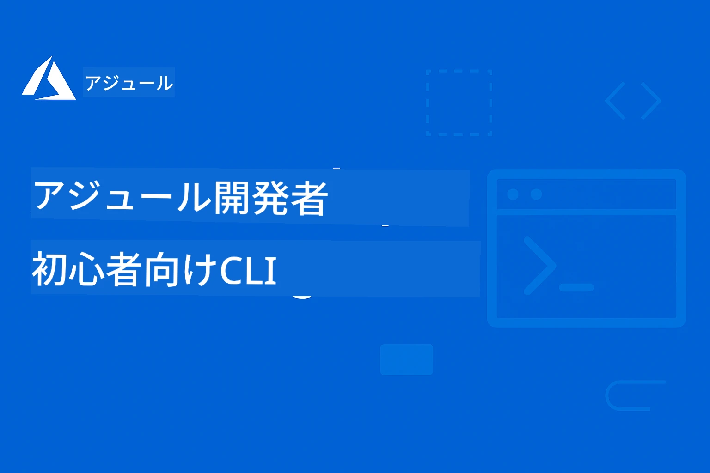

# AZD 入門: 構造化された学習の旅

 

[](https://GitHub.com/microsoft/azd-for-beginners/watchers/)
[](https://GitHub.com/microsoft/azd-for-beginners/network/)
[](https://GitHub.com/microsoft/azd-for-beginners/stargazers/)

[](https://discord.gg/microsoft-azure)
[](https://discord.gg/nTYy5BXMWG)

---

### 自動翻訳（常に最新）

<!-- CO-OP TRANSLATOR LANGUAGES TABLE START -->
[アラビア語](../ar/README.md) | [ベンガル語](../bn/README.md) | [ブルガリア語](../bg/README.md) | [ミャンマー語 (ビルマ語)](../my/README.md) | [中国語（簡体字）](../zh-CN/README.md) | [中国語（繁体字、香港）](../zh-HK/README.md) | [中国語（繁体字、マカオ）](../zh-MO/README.md) | [中国語（繁体字、台湾）](../zh-TW/README.md) | [クロアチア語](../hr/README.md) | [チェコ語](../cs/README.md) | [デンマーク語](../da/README.md) | [オランダ語](../nl/README.md) | [エストニア語](../et/README.md) | [フィンランド語](../fi/README.md) | [フランス語](../fr/README.md) | [ドイツ語](../de/README.md) | [ギリシャ語](../el/README.md) | [ヘブライ語](../he/README.md) | [ヒンディー語](../hi/README.md) | [ハンガリー語](../hu/README.md) | [インドネシア語](../id/README.md) | [イタリア語](../it/README.md) | [日本語](./README.md) | [カンナダ語](../kn/README.md) | [韓国語](../ko/README.md) | [リトアニア語](../lt/README.md) | [マレー語](../ms/README.md) | [マラヤーラム語](../ml/README.md) | [マラーティー語](../mr/README.md) | [ネパール語](../ne/README.md) | [ナイジェリア・ピジン語](../pcm/README.md) | [ノルウェー語](../no/README.md) | [ペルシャ語（ファールシ）](../fa/README.md) | [ポーランド語](../pl/README.md) | [ポルトガル語（ブラジル）](../pt-BR/README.md) | [ポルトガル語（ポルトガル）](../pt-PT/README.md) | [パンジャブ語（グルムキー）](../pa/README.md) | [ルーマニア語](../ro/README.md) | [ロシア語](../ru/README.md) | [セルビア語（キリル文字）](../sr/README.md) | [スロバキア語](../sk/README.md) | [スロベニア語](../sl/README.md) | [スペイン語](../es/README.md) | [スワヒリ語](../sw/README.md) | [スウェーデン語](../sv/README.md) | [タガログ語（フィリピン）](../tl/README.md) | [タミル語](../ta/README.md) | [テルグ語](../te/README.md) | [タイ語](../th/README.md) | [トルコ語](../tr/README.md) | [ウクライナ語](../uk/README.md) | [ウルドゥー語](../ur/README.md) | [ベトナム語](../vi/README.md)

> **ローカルにクローンする方が良いですか？**
>
> このリポジトリには50以上の言語翻訳が含まれており、ダウンロードサイズが大幅に増加します。翻訳を含めずにクローンするには、スパースチェックアウトを使用してください:
>
> **Bash / macOS / Linux:**
> ```bash
> git clone --filter=blob:none --sparse https://github.com/microsoft/AZD-for-beginners.git
> cd AZD-for-beginners
> git sparse-checkout set --no-cone '/*' '!translations' '!translated_images'
> ```
>
> **CMD (Windows):**
> ```cmd
> git clone --filter=blob:none --sparse https://github.com/microsoft/AZD-for-beginners.git
> cd AZD-for-beginners
> git sparse-checkout set --no-cone "/*" "!translations" "!translated_images"
> ```
>
> これにより、コースを完了するために必要なすべてが、より高速なダウンロードで手に入ります。
<!-- CO-OP TRANSLATOR LANGUAGES TABLE END -->

## 🚀 Azure Developer CLI (azd) とは？

**Azure Developer CLI (azd)** は、開発者に優しいコマンドラインツールで、アプリケーションを Azure に展開する作業を簡素化します。多数の Azure リソースを手動で作成・接続する代わりに、単一のコマンドでアプリ全体をデプロイできます。

### `azd up` の魔法

```bash
# この一つのコマンドですべてを実行します：
# ✅ すべてのAzureリソースを作成します
# ✅ ネットワークとセキュリティを構成します
# ✅ アプリケーションコードをビルドします
# ✅ Azureにデプロイします
# ✅ 動作するURLを提供します
azd up
```

**それだけです！** Azure Portal をクリックする必要はなく、複雑な ARM テンプレートを最初に学ぶ必要もなく、手動設定も不要です — Azure 上で動作するアプリがすぐに利用できます。

---

## ❓ Azure Developer CLI と Azure CLI の違いは？

これは初心者が最もよく尋ねる質問です。簡単な答えは次のとおりです:

| 機能 | **Azure CLI (`az`)** | **Azure Developer CLI (`azd`)** |
|---------|---------------------|--------------------------------|
| **目的** | 個々の Azure リソースを管理する | 完全なアプリケーションをデプロイする |
| **考え方** | インフラ重視 | アプリケーション重視 |
| **例** | `az webapp create --name myapp...` | `azd up` |
| **学習曲線** | Azure サービスの知識が必要 | アプリの知識だけで良い |
| **推奨対象** | DevOps、インフラ | 開発者、プロトタイピング |

### わかりやすい例え

- **Azure CLI** は、家を建てるためのすべての道具（ハンマー、ノコギリ、釘）を持っているようなものです。何でも作れますが、建築の知識が必要です。
- **Azure Developer CLI** は、請負業者を雇うようなものです — 欲しいものを説明すれば、彼らが建築を担当してくれます。

### 使い分けのタイミング

| シナリオ | 使うべきもの |
|----------|----------|
| 「ウェブアプリを素早くデプロイしたい」 | `azd up` |
| 「ストレージアカウントだけ作成したい」 | `az storage account create` |
| 「フルの AI アプリケーションを構築している」 | `azd init --template azure-search-openai-demo` |
| 「特定の Azure リソースをデバッグしたい」 | `az resource show` |
| 「数分で本番対応のデプロイを行いたい」 | `azd up --environment production` |

### 両方を併用できます！

AZD は内部で Azure CLI を使用しています。両方を併用できます:
```bash
# AZD でアプリをデプロイします
azd up

# その後、Azure CLI で特定のリソースを微調整します
az webapp config set --name myapp --always-on true
```

---

## 🌟 Awesome AZD でテンプレートを見つけよう

ゼロから始めないでください！**Awesome AZD** はワンクリックでデプロイ可能なテンプレートのコミュニティコレクションです：

| リソース | 説明 |
|----------|-------------|
| 🔗 [**Awesome AZD ギャラリー**](https://azure.github.io/awesome-azd/) | ワンクリックでデプロイできる200以上のテンプレートを閲覧 |
| 🔗 [**テンプレートを投稿する**](https://github.com/Azure/awesome-azd/issues) | コミュニティに自分のテンプレートを貢献する |
| 🔗 [**GitHub リポジトリ**](https://github.com/Azure/awesome-azd) | ソースにスターを付けて探索する |

### Awesome AZD の人気 AI テンプレート

```bash
# Azure OpenAI + AIサーチによるRAGチャット
azd init --template azure-search-openai-demo

# クイックAIチャットアプリケーション
azd init --template openai-chat-app-quickstart

# Foundry Agentsを使ったAIエージェント
azd init --template get-started-with-ai-agents
```

---

## 🎯 3 ステップで始める

### ステップ 1: AZD をインストール (2 分)

**Windows:**
```powershell
winget install microsoft.azd
```

**macOS:**
```bash
brew tap azure/azd && brew install azd
```

**Linux:**
```bash
curl -fsSL https://aka.ms/install-azd.sh | bash
```

### ステップ 2: Azure にログイン

```bash
azd auth login
```

### ステップ 3: 最初のアプリをデプロイ

```bash
# テンプレートから初期化する
azd init --template todo-nodejs-mongo

# Azureにデプロイする（すべてを作成します！）
azd up
```

**🎉 これで完了です！** あなたのアプリは Azure 上で公開されています。

### クリーンアップ（お忘れなく！）

```bash
# Remove all resources when done experimenting
azd down --force --purge
```

---

## 📚 このコースの使い方

このコースは「段階的学習」を想定して設計されています — 自分が快適な場所から始め、徐々にステップアップしてください:

| あなたの経験 | ここから始める |
|-----------------|------------|
| **Azure がまったく初めて** | [第1章：基礎](../..) |
| **Azure は知っているが AZD は初めて** | [第1章：基礎](../..) |
| **AI アプリをデプロイしたい** | [第2章：AI 開発](../..) |
| **ハンズオンで練習したい** | [🎓 インタラクティブ ワークショップ](workshop/README.md) - 3～4 時間のガイド付きラボ |
| **本番運用パターンが必要** | [第8章：本番 & エンタープライズ](../..) |

### クイックセットアップ

1. **このリポジトリをフォークする**: [](https://GitHub.com/microsoft/azd-for-beginners/fork)
2. **クローンする**: `git clone https://github.com/YOUR-USERNAME/azd-for-beginners.git`
3. **サポートを受ける**: [Azure Discord コミュニティ](https://discord.com/invite/ByRwuEEgH4)

> **ローカルにクローンする方が良いですか？**

> このリポジトリには50以上の言語翻訳が含まれており、ダウンロードサイズが大幅に増加します。翻訳を含めずにクローンするには、スパースチェックアウトを使用してください:
> ```bash
> git clone --filter=blob:none --sparse https://github.com/microsoft/AZD-for-beginners.git
> cd AZD-for-beginners
> git sparse-checkout set --no-cone '/*' '!translations' '!translated_images'
> ```
> これにより、コースを完了するために必要なすべてが、より高速なダウンロードで手に入ります。


## コース概要

Azure Developer CLI (azd) を、段階的に学べる章構成で習得します。**Microsoft Foundry 統合による AI アプリケーション展開に特化した内容**を含みます。

### なぜこのコースが現代の開発者に必須なのか

Microsoft Foundry Discord コミュニティのインサイトに基づくと、**開発者の 45% が AI ワークロードに AZD を使いたいと考えています** が、次のような課題に直面しています:
- 複雑なマルチサービスの AI アーキテクチャ
- 本番環境向けの AI 展開ベストプラクティス  
- Azure AI サービスの統合と構成
- AI ワークロードのコスト最適化
- AI 特有のデプロイ問題のトラブルシューティング

### 学習目標

この構造化されたコースを修了することで、あなたは次のことができるようになります:
- **AZD の基本を習得**: コアコンセプト、インストール、設定
- **AI アプリをデプロイ**: Microsoft Foundry サービスを使用した展開
- **Infrastructure as Code を実装**: Bicep テンプレートで Azure リソースを管理
- **デプロイのトラブルシューティング**: よくある問題の解決とデバッグ
- **本番最適化**: セキュリティ、スケーリング、監視、コスト管理
- **マルチエージェントソリューションを構築**: 複雑な AI アーキテクチャのデプロイ

## 🗺️ コースマップ: 章別クイックナビゲーション

各章には学習目標、クイックスタート、演習を含む専用の README があります:

| 章 | トピック | レッスン | 所要時間 | 難易度 |
|---------|-------|---------|----------|------------|
| **[第1章：基礎](docs/chapter-01-foundation/README.md)** | はじめに | [AZD の基本](docs/chapter-01-foundation/azd-basics.md) &#124; [インストール](docs/chapter-01-foundation/installation.md) &#124; [最初のプロジェクト](docs/chapter-01-foundation/first-project.md) | 30〜45分 | ⭐ |
| **[第2章：AI 開発](docs/chapter-02-ai-development/README.md)** | AI ファーストアプリ | [Foundry 統合](docs/chapter-02-ai-development/microsoft-foundry-integration.md) &#124; [AI エージェント](docs/chapter-02-ai-development/agents.md) &#124; [モデルのデプロイ](docs/chapter-02-ai-development/ai-model-deployment.md) &#124; [ワークショップ](docs/chapter-02-ai-development/ai-workshop-lab.md) | 1〜2時間 | ⭐⭐ |
| **[第3章：構成](docs/chapter-03-configuration/README.md)** | 認証とセキュリティ | [構成](docs/chapter-03-configuration/configuration.md) &#124; [認証とセキュリティ](docs/chapter-03-configuration/authsecurity.md) | 45〜60分 | ⭐⭐ |
| **[Ch 4: Infrastructure](docs/chapter-04-infrastructure/README.md)** | IaC & デプロイ | [Deployment Guide](docs/chapter-04-infrastructure/deployment-guide.md) &#124; [Provisioning](docs/chapter-04-infrastructure/provisioning.md) | 1-1.5 時間 | ⭐⭐⭐ |
| **[Ch 5: Multi-Agent](docs/chapter-05-multi-agent/README.md)** | AIエージェントソリューション | [Retail Scenario](examples/retail-scenario.md) &#124; [Coordination Patterns](docs/chapter-06-pre-deployment/coordination-patterns.md) | 2-3 時間 | ⭐⭐⭐⭐ |
| **[Ch 6: Pre-Deployment](docs/chapter-06-pre-deployment/README.md)** | 計画と検証 | [Preflight Checks](docs/chapter-06-pre-deployment/preflight-checks.md) &#124; [Capacity Planning](docs/chapter-06-pre-deployment/capacity-planning.md) &#124; [SKU Selection](docs/chapter-06-pre-deployment/sku-selection.md) &#124; [App Insights](docs/chapter-06-pre-deployment/application-insights.md) | 1 時間 | ⭐⭐ |
| **[Ch 7: Troubleshooting](docs/chapter-07-troubleshooting/README.md)** | デバッグと修正 | [Common Issues](docs/chapter-07-troubleshooting/common-issues.md) &#124; [Debugging](docs/chapter-07-troubleshooting/debugging.md) &#124; [AI Issues](docs/chapter-07-troubleshooting/ai-troubleshooting.md) | 1-1.5 時間 | ⭐⭐ |
| **[Ch 8: Production](docs/chapter-08-production/README.md)** | エンタープライズパターン | [Production Practices](docs/chapter-08-production/production-ai-practices.md) | 2-3 時間 | ⭐⭐⭐⭐ |
| **[🎓 Workshop](workshop/README.md)** | ハンズオンラボ | [Introduction](workshop/docs/instructions/0-Introduction.md) &#124; [Selection](workshop/docs/instructions/1-Select-AI-Template.md) &#124; [Validation](workshop/docs/instructions/2-Validate-AI-Template.md) &#124; [Deconstruction](workshop/docs/instructions/3-Deconstruct-AI-Template.md) &#124; [Configuration](workshop/docs/instructions/4-Configure-AI-Template.md) &#124; [Customization](workshop/docs/instructions/5-Customize-AI-Template.md) &#124; [Teardown](workshop/docs/instructions/6-Teardown-Infrastructure.md) &#124; [Wrap-up](workshop/docs/instructions/7-Wrap-up.md) | 3-4 時間 | ⭐⭐ |

**合計コース時間:** 約10〜14時間 | **スキルの進捗:** 初心者 → 本番対応

---

## 📚 学習チャプター

*経験レベルと目標に基づいて学習ルートを選択してください*

### 🚀 第1章：基礎とクイックスタート
**前提条件**: Azure サブスクリプション、基本的なコマンドラインの知識  
**所要時間**: 30〜45分  
**難易度**: ⭐

#### この章で学ぶこと
- Azure Developer CLI の基本の理解
- お使いのプラットフォームに AZD をインストールする
- 最初のデプロイの成功

#### 学習リソース
- **🎯 Start Here**: [Azure Developer CLI とは？](../..)
- **📖 Theory**: [AZD Basics](docs/chapter-01-foundation/azd-basics.md) - コア概念と用語
- **⚙️ Setup**: [Installation & Setup](docs/chapter-01-foundation/installation.md) - プラットフォーム固有のガイド
- **🛠️ Hands-On**: [Your First Project](docs/chapter-01-foundation/first-project.md) - ステップバイステップのチュートリアル
- **📋 Quick Reference**: [Command Cheat Sheet](resources/cheat-sheet.md)

#### 実践演習
```bash
# インストールの簡易チェック
azd version

# 最初のアプリケーションをデプロイする
azd init --template todo-nodejs-mongo
azd up
```

**💡 この章の成果**: AZD を使用して簡単な Web アプリケーションを Azure にデプロイできる

**✅ 成功の検証:**
```bash
# 第1章を終えると、次のことができるようになります：
azd version              # インストール済みのバージョンを表示する
azd init --template todo-nodejs-mongo  # プロジェクトを初期化する
azd up                  # Azure にデプロイする
azd show                # 実行中のアプリの URL を表示する
# アプリケーションがブラウザで開き、動作する
azd down --force --purge  # リソースをクリーンアップする
```

**📊 所要時間:** 30〜45分  
**📈 習得後のスキルレベル:** 基本的なアプリケーションを独立してデプロイできる

**✅ 成功の検証:**
```bash
# 第1章を終えたら、次のことができるようになります:
azd version              # インストールされているバージョンを表示します
azd init --template todo-nodejs-mongo  # プロジェクトを初期化します
azd up                  # Azure にデプロイします
azd show                # 実行中のアプリのURLを表示します
# アプリケーションがブラウザで開き、動作します
azd down --force --purge  # リソースをクリーンアップします
```

**📊 所要時間:** 30〜45分  
**📈 習得後のスキルレベル:** 基本的なアプリケーションを独立してデプロイできる

---

### 🤖 第2章：AIファースト開発（AI 開発者向け推奨）
**前提条件**: 第1章を完了していること  
**所要時間**: 1〜2時間  
**難易度**: ⭐⭐

#### この章で学ぶこと
- AZD と Microsoft Foundry の統合
- AI 搭載アプリケーションのデプロイ
- AI サービス設定の理解

#### 学習リソース
- **🎯 Start Here**: [Microsoft Foundry Integration](docs/chapter-02-ai-development/microsoft-foundry-integration.md)
- **🤖 AI Agents**: [AI Agents Guide](docs/chapter-02-ai-development/agents.md) - AZD でインテリジェントエージェントをデプロイする
- **📖 Patterns**: [AI Model Deployment](docs/chapter-02-ai-development/ai-model-deployment.md) - AI モデルのデプロイと管理
- **🛠️ Workshop**: [AI Workshop Lab](docs/chapter-02-ai-development/ai-workshop-lab.md) - AI ソリューションを AZD 対応にする
- **🎥 Interactive Guide**: [Workshop Materials](workshop/README.md) - MkDocs * DevContainer 環境によるブラウザベースの学習
- **📋 Templates**: [Microsoft Foundry Templates](../..)
- **📝 Examples**: [AZD Deployment Examples](examples/README.md)

#### 実践演習
```bash
# 最初の AI アプリケーションをデプロイする
azd init --template azure-search-openai-demo
azd up

# 追加の AI テンプレートを試す
azd init --template openai-chat-app-quickstart
azd init --template agent-openai-python-prompty
```

**💡 この章の成果**: RAG 機能を備えた AI チャットアプリケーションをデプロイおよび構成する

**✅ 成功の検証:**
```bash
# 第2章の後には次のことができるはずです:
azd init --template azure-search-openai-demo
azd up
# AIチャットインターフェースをテストする
# 質問をして、出典付きのAIによる応答を得る
# 検索統合が機能することを確認する
azd monitor  # Application Insights にテレメトリが表示されていることを確認する
azd down --force --purge
```

**📊 所要時間:** 1〜2時間  
**📈 習得後のスキルレベル:** 本番対応の AI アプリケーションをデプロイおよび構成できる  
**💰 コスト認識:** 開発環境で月額 $80-150、運用で月額 $300-3500 の費用目安を理解する

#### 💰 AI デプロイのためのコスト考慮

**開発環境（推定 $80-150/月）:**
- Azure OpenAI（従量課金制）: $0-50/月（トークン使用量に基づく）
- AI Search（Basic プラン）: $75/月
- Container Apps（Consumption）: $0-20/月
- Storage（Standard）: $1-5/月

**本番環境（推定 $300-3,500+/月）:**
- Azure OpenAI（PTU による安定パフォーマンス）: $3,000+/月 または 高トラフィック時の従量課金
- AI Search（Standard プラン）: $250/月
- Container Apps（専用）: $50-100/月
- Application Insights: $5-50/月
- Storage（Premium）: $10-50/月

**💡 コスト最適化のヒント:**
- 学習には Azure OpenAI のフリーティアを利用（50,000 トークン/月を含む）
- 開発していないときは `azd down` を実行してリソースの割り当てを解除する
- まずは消費ベースの課金から始め、本番のみ PTU にアップグレードする
- デプロイ前に `azd provision --preview` を使ってコストを見積もる
- オートスケーリングを有効にする：実際の使用量に対してのみ支払う

**コスト監視:**
```bash
# 推定月額コストを確認する
azd provision --preview

# Azure ポータルで実際のコストを監視する
az consumption budget list --resource-group <your-rg>
```

---

### ⚙️ 第3章：構成と認証
**前提条件**: 第1章を完了していること  
**所要時間**: 45〜60分  
**難易度**: ⭐⭐

#### この章で学ぶこと
- 環境の構成と管理
- 認証とセキュリティのベストプラクティス
- リソースの命名と整理

#### 学習リソース
- **📖 Configuration**: [Configuration Guide](docs/chapter-03-configuration/configuration.md) - 環境設定
- **🔐 Security**: [Authentication patterns and managed identity](docs/chapter-03-configuration/authsecurity.md) - 認証パターン
- **📝 Examples**: [Database App Example](examples/database-app/README.md) - AZD データベースの例

#### 実践演習
- 複数の環境を構成する（dev、staging、prod）
- マネージド ID 認証を設定する
- 環境固有の構成を実装する

**💡 この章の成果**: 適切な認証とセキュリティで複数の環境を管理できる

---

### 🏗️ 第4章：Infrastructure as Code とデプロイ
**前提条件**: 第1〜3章を完了していること  
**所要時間**: 1-1.5 時間  
**難易度**: ⭐⭐⭐

#### この章で学ぶこと
- 高度なデプロイパターン
- Bicep を使った Infrastructure as Code
- リソースプロビジョニング戦略

#### 学習リソース
- **📖 Deployment**: [Deployment Guide](docs/chapter-04-infrastructure/deployment-guide.md) - 完全なワークフロー
- **🏗️ Provisioning**: [Provisioning Resources](docs/chapter-04-infrastructure/provisioning.md) - Azure リソース管理
- **📝 Examples**: [Container App Example](../../examples/container-app) - コンテナ化されたデプロイ

#### 実践演習
- カスタム Bicep テンプレートを作成する
- マルチサービスアプリケーションをデプロイする
- ブルーグリーンデプロイなどの戦略を実装する

**💡 この章の成果**: カスタムインフラテンプレートを使用して複雑なマルチサービスアプリケーションをデプロイできる

---

### 🎯 第5章：マルチエージェント AI ソリューション（上級）
**前提条件**: 第1〜2章を完了していること  
**所要時間**: 2-3 時間  
**難易度**: ⭐⭐⭐⭐

#### この章で学ぶこと
- マルチエージェントのアーキテクチャパターン
- エージェントのオーケストレーションと調整
- 本番対応の AI デプロイ

#### 学習リソース
- **🤖 Featured Project**: [Retail Multi-Agent Solution](examples/retail-scenario.md) - 完全な実装
- **🛠️ ARM Templates**: [ARM Template Package](../../examples/retail-multiagent-arm-template) - ワンクリックデプロイ
- **📖 Architecture**: [Multi-agent coordination patterns](docs/chapter-06-pre-deployment/coordination-patterns.md) - 調整パターン

#### 実践演習
```bash
# 小売向けの完全なマルチエージェントソリューションを展開する
cd examples/retail-multiagent-arm-template
./deploy.sh

# エージェント構成を探索する
az deployment group show --resource-group <rg-name> --name <deployment-name>
```

**💡 この章の成果**: Customer と Inventory エージェントを備えた本番対応のマルチエージェント AI ソリューションをデプロイおよび管理できる

---

### 🔍 第6章：プレデプロイ検証と計画
**前提条件**: 第4章を完了していること  
**所要時間**: 1 時間  
**難易度**: ⭐⭐

#### この章で学ぶこと
- キャパシティプランニングとリソース検証
- SKU 選定戦略
- 事前チェックと自動化

#### 学習リソース
- **📊 Planning**: [Capacity Planning](docs/chapter-06-pre-deployment/capacity-planning.md) - リソース検証
- **💰 Selection**: [SKU Selection](docs/chapter-06-pre-deployment/sku-selection.md) - コスト効率の良い選択
- **✅ Validation**: [Pre-flight Checks](docs/chapter-06-pre-deployment/preflight-checks.md) - 自動スクリプト

#### 実践演習
- キャパシティ検証スクリプトを実行する
- コストに応じて SKU 選定を最適化する
- 自動化された事前デプロイチェックを実装する

**💡 この章の成果**: 実行前にデプロイを検証し最適化できる

---

### 🚨 第7章：トラブルシューティングとデバッグ
**前提条件**: いずれかのデプロイ章を完了していること  
**所要時間**: 1-1.5 時間  
**難易度**: ⭐⭐

#### この章で学ぶこと
- 系統的なデバッグ手法
- よくある問題と解決策
- AI 特有のトラブルシューティング

#### 学習リソース
- **🔧 Common Issues**: [Common Issues](docs/chapter-07-troubleshooting/common-issues.md) - FAQ と解決策
- **🕵️ Debugging**: [Debugging Guide](docs/chapter-07-troubleshooting/debugging.md) - ステップバイステップの手法
- **🤖 AI Issues**: [AI-Specific Troubleshooting](docs/chapter-07-troubleshooting/ai-troubleshooting.md) - AI サービスの問題

#### 実践演習
- デプロイ失敗の診断を行う
- 認証問題を解決する
- AI サービスの接続問題をデバッグする

**💡 この章の成果**: 一般的なデプロイ問題を独立して診断および解決できる

---

### 🏢 第8章：本番とエンタープライズパターン
**前提条件**: 第1〜4章を完了していること  
**所要時間**: 2-3 時間  
**難易度**: ⭐⭐⭐⭐

#### この章で学ぶこと
- 本番デプロイ戦略
- エンタープライズ向けセキュリティパターン
- 監視とコスト最適化

#### 学習リソース
- **🏭 Production**: [Production AI Best Practices](docs/chapter-08-production/production-ai-practices.md) - エンタープライズパターン
- **📝 Examples**: [Microservices Example](../../examples/microservices) - 複雑なアーキテクチャ
- **📊 Monitoring**: [Application Insights integration](docs/chapter-06-pre-deployment/application-insights.md) - 監視

#### 実践演習
- エンタープライズ向けのセキュリティパターンを実装する
- 包括的な監視を設定する
- 適切なガバナンスで本番にデプロイする

**💡 この章の成果**: フルプロダクション対応の機能を備えたエンタープライズアプリケーションをデプロイできる

---

## 🎓 ワークショップ概要：ハンズオン学習体験

> **⚠️ ワークショップ状況: 開発中**
> ワークショップ資料は現在開発および改善中です。コアモジュールは機能していますが、一部の高度なセクションは未完成です。すべてのコンテンツを完成させるために積極的に作業しています。 [進捗を確認 →](workshop/README.md)

### インタラクティブワークショップ資料
**ブラウザベースのツールとガイド付き演習による包括的なハンズオン学習**

当ワークショップ資料は、上記の章ベースのカリキュラムを補完する、構造化されたインタラクティブな学習体験を提供します。ワークショップは自己学習とインストラクター主導のセッションの両方を想定して設計されています。

#### 🛠️ ワークショップの特徴
- **ブラウザベースのインターフェイス**: 検索、コピー、テーマ機能を備えたMkDocs駆動のワークショップ
- **GitHub Codespaces 統合**: ワンクリックで開発環境をセットアップ
- **構造化された学習パス**: 8モジュールのガイド付き演習（合計3〜4時間）
- **段階的手法**: 導入 → 選択 → 検証 → 分解 → 設定 → カスタマイズ → クリーンアップ → まとめ
- **対話式DevContainer環境**: 事前構成されたツールと依存関係

#### 📚 ワークショップモジュール構成
ワークショップは、発見からデプロイの習熟まで導く、**8モジュールの段階的手法**に従います：

| モジュール | トピック | 実施内容 | 所要時間 |
|--------|-------|----------------|----------|
| **0. 導入** | ワークショップ概要 | 学習目標、前提条件、およびワークショップ構成を理解する | 15分 |
| **1. 選択** | テンプレートの探索 | AZDテンプレートを調査し、シナリオに適したAIテンプレートを選択する | 20分 |
| **2. 検証** | デプロイと検証 | `azd up` でテンプレートをデプロイし、インフラが動作することを検証する | 30分 |
| **3. 分解** | 構造の理解 | GitHub Copilot を使ってテンプレートのアーキテクチャ、Bicep ファイル、コードの構成を探索する | 30分 |
| **4. 設定** | azure.yaml の詳細 | `azure.yaml` の設定、ライフサイクルフック、および環境変数を習得する | 30分 |
| **5. カスタマイズ** | 自分用に調整 | AI Search、トレーシング、評価を有効にし、シナリオに合わせてカスタマイズする | 45分 |
| **6. クリーンアップ** | 後片付け | `azd down --purge` で安全にリソースを除去する | 15分 |
| **7. まとめ** | 次のステップ | 達成事項、主要概念を振り返り、学習を継続する方法を確認する | 15分 |

**ワークショップの流れ:**
```
Introduction → Selection → Validation → Deconstruction → Configuration → Customization → Teardown → Wrap-up
     ↓            ↓           ↓              ↓               ↓              ↓            ↓           ↓
  Overview    Find the     Deploy &      Explore        Master         Customize     Clean up    Review &
             right        verify        code &        azure.yaml      for your      resources   next steps
             template                   structure                     scenario
```

#### 🚀 ワークショップの始め方
```bash
# オプション 1: GitHub Codespaces（推奨）
# リポジトリ内で「Code」→「Create codespace on main」をクリックします

# オプション 2: ローカル開発
git clone https://github.com/microsoft/azd-for-beginners.git
cd azd-for-beginners/workshop
# workshop/README.md に記載されたセットアップ手順に従ってください
```

#### 🎯 ワークショップの学習成果
ワークショップを完了することで、参加者は以下を達成できます：
- **本番向けAIアプリケーションをデプロイする**: Microsoft FoundryサービスとAZDを使用する
- **マルチエージェントアーキテクチャを習得する**: 協調したAIエージェントソリューションを実装する
- **セキュリティのベストプラクティスを実装する**: 認証とアクセス制御を設定する
- **スケーラビリティを最適化する**: コスト効率と高性能を両立するデプロイを設計する
- **デプロイのトラブルシューティング**: 一般的な問題を自力で解決する

#### 📖 ワークショップリソース
- **🎥 インタラクティブガイド**: [ワークショップ資料](workshop/README.md) - ブラウザベースの学習環境
- **📋 モジュール別手順**:
  - [0. 導入](workshop/docs/instructions/0-Introduction.md) - ワークショップの概要と目的
  - [1. 選択](workshop/docs/instructions/1-Select-AI-Template.md) - AIテンプレートの検索と選択
  - [2. 検証](workshop/docs/instructions/2-Validate-AI-Template.md) - テンプレートのデプロイと検証
  - [3. 分解](workshop/docs/instructions/3-Deconstruct-AI-Template.md) - テンプレートのアーキテクチャを探索
  - [4. 設定](workshop/docs/instructions/4-Configure-AI-Template.md) - azure.yaml を習得
  - [5. カスタマイズ](workshop/docs/instructions/5-Customize-AI-Template.md) - シナリオに合わせてカスタマイズ
  - [6. クリーンアップ](workshop/docs/instructions/6-Teardown-Infrastructure.md) - リソースの後片付け
  - [7. まとめ](workshop/docs/instructions/7-Wrap-up.md) - 振り返りと次のステップ
- **🛠️ AI ワークショップラボ**: [AI Workshop Lab](docs/chapter-02-ai-development/ai-workshop-lab.md) - AIに焦点を当てた演習
- **💡 クイックスタート**: [ワークショップセットアップガイド](workshop/README.md#quick-start) - 環境設定

**最適な対象**: 企業研修、大学の授業、自己学習、開発者ブートキャンプ。

---

## 📖 詳細：AZDの機能

基本を超えて、AZDは本番デプロイのための強力な機能を提供します：

- **テンプレートベースのデプロイ** - 一般的なアプリケーションパターン向けの既成テンプレートを使用
- **Infrastructure as Code** - Bicep または Terraform を使用して Azure リソースを管理  
- **統合ワークフロー** - アプリケーションをシームレスにプロビジョニング、デプロイ、監視
- **開発者に優しい** - 開発者の生産性と体験に最適化されている

### **AZD + Microsoft Foundry：AIデプロイに最適**

**なぜAIソリューションにAZDなのか？** AZDはAI開発者が直面する主要な課題に対応します：

- **AI対応テンプレート** - Azure OpenAI、Cognitive Services、MLワークロード向けに事前構成されたテンプレート
- **安全なAIデプロイ** - AIサービス、APIキー、モデルエンドポイント向けの組み込みセキュリティパターン  
- **本番向けAIパターン** - スケーラブルで費用対効果の高いAIアプリケーションデプロイのベストプラクティス
- **エンドツーエンドのAIワークフロー** - モデル開発から本番デプロイまで、適切な監視を含めて対応
- **コスト最適化** - AIワークロード向けのスマートなリソース割り当てとスケーリング戦略
- **Microsoft Foundry 統合** - Microsoft Foundry のモデルカタログとエンドポイントへのシームレスな接続

---

## 🎯 テンプレートとサンプルライブラリ

### 注目：Microsoft Foundry テンプレート
**AIアプリケーションをデプロイするならここから始めてください！**

> **注意：** これらのテンプレートはさまざまなAIパターンを示しています。一部は外部のAzure Samplesで、他はローカル実装です。

| テンプレート | チャプター | 複雑さ | サービス | タイプ |
|----------|---------|------------|----------|------|
| [**AIチャット入門**](https://github.com/Azure-Samples/get-started-with-ai-chat) | 第2章 | ⭐⭐ | AzureOpenAI + Azure AI Model Inference API + Azure AI Search + Azure Container Apps + Application Insights | 外部 |
| [**AIエージェント入門**](https://github.com/Azure-Samples/get-started-with-ai-agents) | 第2章 | ⭐⭐ | Foundry Agents + AzureOpenAI + Azure AI Search + Azure Container Apps + Application Insights| 外部 |
| [**Azure Search + OpenAI デモ**](https://github.com/Azure-Samples/azure-search-openai-demo) | 第2章 | ⭐⭐ | AzureOpenAI + Azure AI Search + App Service + Storage | 外部 |
| [**OpenAI Chat App クイックスタート**](https://github.com/Azure-Samples/openai-chat-app-quickstart) | 第2章 | ⭐ | AzureOpenAI + Container Apps + Application Insights | 外部 |
| [**Agent OpenAI Python Prompty**](https://github.com/Azure-Samples/agent-openai-python-prompty) | 第5章 | ⭐⭐⭐ | AzureOpenAI + Azure Functions + Prompty | 外部 |
| [**Contoso Chat RAG**](https://github.com/Azure-Samples/contoso-chat) | 第8章 | ⭐⭐⭐⭐ | AzureOpenAI + AI Search + Cosmos DB + Container Apps | 外部 |
| [**小売向けマルチエージェントソリューション**](examples/retail-scenario.md) | 第5章 | ⭐⭐⭐⭐ | AzureOpenAI + AI Search + Storage + Container Apps + Cosmos DB | **ローカル** |

### 注目：完全な学習シナリオ
**学習章に対応した本番対応アプリケーションテンプレート**

| テンプレート | 学習章 | 複雑さ | 主要な学び |
|----------|------------------|------------|--------------|
| [**openai-chat-app-quickstart**](https://github.com/Azure-Samples/openai-chat-app-quickstart) | 第2章 | ⭐ | 基本的なAIデプロイパターン |
| [**azure-search-openai-demo**](https://github.com/Azure-Samples/azure-search-openai-demo) | 第2章 | ⭐⭐ | Azure AI Search を用いたRAGの実装 |
| [**ai-document-processing**](https://github.com/Azure-Samples/ai-document-processing) | 第4章 | ⭐⭐ | Document Intelligence の統合 |
| [**agent-openai-python-prompty**](https://github.com/Azure-Samples/agent-openai-python-prompty) | 第5章 | ⭐⭐⭐ | エージェントフレームワークと関数呼び出し |
| [**contoso-chat**](https://github.com/Azure-Samples/contoso-chat) | 第8章 | ⭐⭐⭐ | エンタープライズ向けAIオーケストレーション |
| [**retail-multi-agent-solution**](examples/retail-scenario.md) | 第5章 | ⭐⭐⭐⭐ | カスタマーと在庫エージェントによるマルチエージェントアーキテクチャ |

### 例による学習タイプ

> **📌 ローカルと外部の例：**  
> **ローカルの例**（このリポジトリ内）＝ 即使い始め可能  
> **外部の例**（Azure Samples）＝ リンク先のリポジトリをクローンする

#### ローカルの例（すぐに使用可能）
- [**小売向けマルチエージェントソリューション**](examples/retail-scenario.md) - ARM テンプレートを使用した本番対応の完全実装
  - マルチエージェントアーキテクチャ（カスタマー + 在庫エージェント）
  - 包括的なモニタリングと評価
  - ARM テンプレートによるワンクリックデプロイ

#### ローカルの例 - コンテナアプリケーション（第2〜5章）
**このリポジトリにある包括的なコンテナデプロイ例：**
- [**コンテナアプリ例**](examples/container-app/README.md) - コンテナ化デプロイの完全ガイド
  - [Simple Flask API](../../examples/container-app/simple-flask-api) - scale-to-zero に対応した基本的な REST API
  - [Microservices Architecture](../../examples/container-app/microservices) - 本番対応のマルチサービスデプロイ
  - クイックスタート、プロダクション、上級デプロイパターン
  - モニタリング、セキュリティ、およびコスト最適化のガイダンス

#### 外部の例 - シンプルアプリケーション（第1〜2章）
**開始するにはこれらの Azure Samples リポジトリをクローンしてください：**
- [Simple Web App - Node.js + MongoDB](https://github.com/Azure-Samples/todo-nodejs-mongo) - 基本的なデプロイパターン
- [Static Website - React SPA](https://github.com/Azure-Samples/todo-csharp-sql-swa-func) - 静的コンテンツのデプロイ
- [Container App - Python Flask](https://github.com/Azure-Samples/container-apps-store-api-microservice) - REST API のデプロイ

#### 外部の例 - データベース統合（第3〜4章）  
- [Database App - C# + SQL](https://github.com/Azure-Samples/todo-csharp-sql) - データベース接続パターン
- [Functions + Cosmos DB](https://github.com/Azure-Samples/todo-python-mongo-swa-func) - サーバーレスデータワークフロー

#### 外部の例 - 上級パターン（第4〜8章）
- [Java Microservices](https://github.com/Azure-Samples/java-microservices-aca-lab) - マルチサービスアーキテクチャ
- [Container Apps Jobs](https://github.com/Azure-Samples/container-apps-jobs) - バックグラウンド処理  
- [Enterprise ML Pipeline](https://github.com/Azure-Samples/mlops-v2) - 本番対応のMLパターン

### 外部テンプレートコレクション
- [**公式AZDテンプレートギャラリー**](https://azure.github.io/awesome-azd/) - 公式およびコミュニティテンプレートのキュレーションコレクション
- [**Azure Developer CLI Templates**](https://learn.microsoft.com/en-us/azure/developer/azure-developer-cli/azd-templates) - Microsoft Learn のテンプレートドキュメント
- [**Examples Directory**](examples/README.md) - 詳細な説明付きのローカル学習例

---

## 📚 学習リソースと参考資料

### クイックリファレンス
- [**コマンドチートシート**](resources/cheat-sheet.md) - 章別に整理された必須 azd コマンド
- [**用語集**](resources/glossary.md) - Azure と azd の用語集  
- [**FAQ**](resources/faq.md) - 学習章別に整理されたよくある質問
- [**学習ガイド**](resources/study-guide.md) - 包括的な練習問題

### 実践ワークショップ
- [**AI ワークショップラボ**](docs/chapter-02-ai-development/ai-workshop-lab.md) - AI ソリューションを AZD でデプロイ可能にする（2〜3時間）
- [**インタラクティブワークショップ**](workshop/README.md) - MkDocs と GitHub Codespaces を使った8モジュールのガイド演習
  - フロー：導入 → 選択 → 検証 → 分解 → 設定 → カスタマイズ → クリーンアップ → まとめ

### 外部学習リソース
- [Azure Developer CLI Documentation](https://learn.microsoft.com/en-us/azure/developer/azure-developer-cli/)
- [Azure Architecture Center](https://learn.microsoft.com/en-us/azure/architecture/)
- [Azure Pricing Calculator](https://azure.microsoft.com/pricing/calculator/)
- [Azure Status](https://status.azure.com/)

---

## 🔧 クイックトラブルシューティングガイド

**初心者が直面する一般的な問題と即時の解決策：**

<details>
<summary><strong>❌ "azd: コマンドが見つかりません"</strong></summary>

```bash
# まず AZD をインストールしてください
# Windows（PowerShell）:
winget install microsoft.azd

# macOS:
brew tap azure/azd && brew install azd

# Linux:
curl -fsSL https://aka.ms/install-azd.sh | bash

# インストールを確認してください
azd version
```
</details>

<details>
<summary><strong>❌ "サブスクリプションが見つかりません" または "サブスクリプションが設定されていません"</strong></summary>

```bash
# 利用可能なサブスクリプションを一覧表示
az account list --output table

# 既定のサブスクリプションを設定
az account set --subscription "<subscription-id-or-name>"

# AZD 環境用に設定
azd env set AZURE_SUBSCRIPTION_ID "<subscription-id>"

# 検証
az account show
```
</details>
<details>
<summary><strong>❌ "InsufficientQuota" または "Quota exceeded"</strong></summary>

```bash
# 別の Azure リージョンを試してみてください
azd env set AZURE_LOCATION "westus2"
azd up

# または開発環境ではより小さい SKU を使用してください
# infra/main.parameters.json を編集してください:
{
  "sku": "B1"  // Instead of "P1V2"
}
```
</details>

<details>
<summary><strong>❌ "azd up" が途中で失敗する</strong></summary>

```bash
# オプション 1: クリーンして再試行する
azd down --force --purge
azd up

# オプション 2: インフラのみ修正する
azd provision

# オプション 3: 詳細なステータスを確認する
azd show

# オプション 4: Azure Monitor のログを確認する
azd monitor --logs
```
</details>

<details>
<summary><strong>❌ "Authentication failed" または "Token expired"</strong></summary>

```bash
# 再認証する
az logout
az login

azd auth logout
azd auth login

# 認証を検証する
az account show
```
</details>

<details>
<summary><strong>❌ "Resource already exists" または 命名の競合</strong></summary>

```bash
# AZD は一意の名前を生成しますが、競合が発生した場合：
azd down --force --purge

# その場合は新しい環境で再試行します
azd env new dev-v2
azd up
```
</details>

<details>
<summary><strong>❌ テンプレートのデプロイに時間がかかりすぎている</strong></summary>

**通常の待機時間:**
- シンプルな Web アプリ: 5〜10 分
- データベースを使用するアプリ: 10〜15 分
- AI アプリケーション: 15〜25 分（OpenAI のプロビジョニングは遅い）

```bash
# 進捗を確認する
azd show

# 30分以上進まない場合は、Azure ポータルを確認してください：
azd monitor
# 失敗したデプロイを探す
```
</details>

<details>
<summary><strong>❌ "Permission denied" または "Forbidden"</strong></summary>

```bash
# Azure のロールを確認してください
az role assignment list --assignee $(az account show --query user.name -o tsv)

# 最低でも「Contributor」ロールが必要です
# Azure 管理者に次を付与するよう依頼してください:
# - Contributor (リソース用)
# - User Access Administrator (ロール割り当て用)
```
</details>

<details>
<summary><strong>❌ デプロイしたアプリケーションの URL が見つからない</strong></summary>

```bash
# すべてのサービスエンドポイントを表示する
azd show

# または Azure ポータルを開く
azd monitor

# 特定のサービスを確認する
azd env get-values
# *_URL 変数を探す
```
</details>

### 📚 トラブルシューティングの完全なリソース

- **よくある問題ガイド:** [詳細な解決策](docs/chapter-07-troubleshooting/common-issues.md)
- **AI 固有の問題:** [AI トラブルシューティング](docs/chapter-07-troubleshooting/ai-troubleshooting.md)
- **デバッグガイド:** [ステップバイステップのデバッグ](docs/chapter-07-troubleshooting/debugging.md)
- **ヘルプを得る:** [Azure Discord](https://discord.gg/microsoft-azure) #azure-developer-cli

---

## 🎓 コース修了と認定

### 進捗トラッキング
各章の学習進捗を追跡します:

- [ ] **Chapter 1**: 基礎とクイックスタート ✅
- [ ] **Chapter 2**: AI ファースト開発 ✅  
- [ ] **Chapter 3**: 構成と認証 ✅
- [ ] **Chapter 4**: Infrastructure as Code（IaC）とデプロイ ✅
- [ ] **Chapter 5**: マルチエージェント AI ソリューション ✅
- [ ] **Chapter 6**: デプロイ前の検証と計画 ✅
- [ ] **Chapter 7**: トラブルシューティングとデバッグ ✅
- [ ] **Chapter 8**: プロダクションとエンタープライズのパターン ✅

### 学習の検証
各章を修了したら、以下で知識を確認してください:
1. **実践演習**: 章のハンズオンデプロイを完了する
2. **知識チェック**: 各章の FAQ セクションを確認する
3. **コミュニティでの議論**: Azure Discord で体験を共有する
4. **次の章**: 次の難易度に進む

### コース修了時のメリット
すべての章を修了すると、次のことが得られます:
- **本番環境での経験**: 実際の AI アプリを Azure にデプロイ
- **プロフェッショナルスキル**: エンタープライズ対応のデプロイ能力  
- **コミュニティでの認知**: Azure 開発者コミュニティのアクティブメンバー
- **キャリアの向上**: 需要の高い AZD と AI デプロイの専門知識

---

## 🤝 コミュニティとサポート

### ヘルプとサポートを得る
- **技術的な問題:** [バグ報告と機能リクエスト](https://github.com/microsoft/azd-for-beginners/issues)
- **学習に関する質問:** [Microsoft Azure Discord コミュニティ](https://discord.gg/microsoft-azure) および [](https://discord.gg/nTYy5BXMWG)
- **AI 固有のヘルプ:** Join the [](https://discord.gg/nTYy5BXMWG)
- **ドキュメント:** [公式 Azure Developer CLI ドキュメント](https://learn.microsoft.com/en-us/azure/developer/azure-developer-cli/)

### Microsoft Foundry Discord からのコミュニティインサイト

**最近の #Azure チャンネルの投票結果:**
- **45%** の開発者が AI ワークロードに AZD を使用したいと考えています
- **主な課題**: マルチサービスのデプロイ、資格情報管理、本番稼働準備  
- **最も要望されているもの**: AI 固有のテンプレート、トラブルシューティングガイド、ベストプラクティス

**コミュニティに参加して:**
- AZD + AI の体験を共有して支援を受ける
- 新しい AI テンプレートの早期プレビューにアクセスする
- AI デプロイのベストプラクティスに貢献する
- 将来の AI + AZD 機能開発に影響を与える

### コースへの貢献
貢献を歓迎します！詳細は [貢献ガイド](CONTRIBUTING.md) をお読みください:
- **コンテンツの改善**: 既存の章や例を拡張する
- **新しい例**: 実際のシナリオやテンプレートを追加する  
- **翻訳**: 多言語サポートの維持を手伝う
- **バグ報告**: 正確性と明瞭性を向上させる
- **コミュニティ基準**: 包摂的なコミュニティガイドラインに従う

---

## 📄 コース情報

### ライセンス
このプロジェクトは MIT ライセンスの下でライセンスされています。詳細は [LICENSE](../../LICENSE) ファイルを参照してください。

### 関連する Microsoft の学習リソース

Our team produces other comprehensive learning courses:

<!-- CO-OP TRANSLATOR OTHER COURSES START -->
### LangChain
[](https://aka.ms/langchain4j-for-beginners)
[](https://aka.ms/langchainjs-for-beginners?WT.mc_id=m365-94501-dwahlin)
[](https://github.com/microsoft/langchain-for-beginners?WT.mc_id=m365-94501-dwahlin)
---

### Azure / Edge / MCP / エージェント
[](https://github.com/microsoft/AZD-for-beginners?WT.mc_id=academic-105485-koreyst)
[](https://github.com/microsoft/edgeai-for-beginners?WT.mc_id=academic-105485-koreyst)
[](https://github.com/microsoft/mcp-for-beginners?WT.mc_id=academic-105485-koreyst)
[](https://github.com/microsoft/ai-agents-for-beginners?WT.mc_id=academic-105485-koreyst)

---
 
### 生成AIシリーズ
[](https://github.com/microsoft/generative-ai-for-beginners?WT.mc_id=academic-105485-koreyst)
[-9333EA?style=for-the-badge&labelColor=E5E7EB&color=9333EA)](https://github.com/microsoft/Generative-AI-for-beginners-dotnet?WT.mc_id=academic-105485-koreyst)
[-C084FC?style=for-the-badge&labelColor=E5E7EB&color=C084FC)](https://github.com/microsoft/generative-ai-for-beginners-java?WT.mc_id=academic-105485-koreyst)
[-E879F9?style=for-the-badge&labelColor=E5E7EB&color=E879F9)](https://github.com/microsoft/generative-ai-with-javascript?WT.mc_id=academic-105485-koreyst)

---
 
### コア学習
[](https://aka.ms/ml-beginners?WT.mc_id=academic-105485-koreyst)
[](https://aka.ms/datascience-beginners?WT.mc_id=academic-105485-koreyst)
[](https://aka.ms/ai-beginners?WT.mc_id=academic-105485-koreyst)
[](https://github.com/microsoft/Security-101?WT.mc_id=academic-96948-sayoung)
[](https://aka.ms/webdev-beginners?WT.mc_id=academic-105485-koreyst)
[](https://aka.ms/iot-beginners?WT.mc_id=academic-105485-koreyst)
[](https://github.com/microsoft/xr-development-for-beginners?WT.mc_id=academic-105485-koreyst)

---
 
### Copilot シリーズ
[](https://aka.ms/GitHubCopilotAI?WT.mc_id=academic-105485-koreyst)
[](https://github.com/microsoft/mastering-github-copilot-for-dotnet-csharp-developers?WT.mc_id=academic-105485-koreyst)
[](https://github.com/microsoft/CopilotAdventures?WT.mc_id=academic-105485-koreyst)
<!-- CO-OP TRANSLATOR OTHER COURSES END -->

---

## 🗺️ コースのナビゲーション

**🚀 学習を始める準備はできましたか？**

**初心者**: まずは [第1章: 基礎 & クイックスタート](../..)  
**AI開発者**: [第2章: AIファースト開発](../..) に進んでください  
**経験豊富な開発者**: まずは [第3章: 設定と認証](../..)  

**次のステップ**: [第1章を開始 - AZDの基本](docs/chapter-01-foundation/azd-basics.md) →

---

<!-- CO-OP TRANSLATOR DISCLAIMER START -->
免責事項：
本書は AI 翻訳サービス「Co‑op Translator」（https://github.com/Azure/co-op-translator）を用いて翻訳されました。正確性には努めておりますが、自動翻訳には誤りや不正確な箇所が含まれる可能性があります。原文（原言語版）を正式な出典としてご確認ください。重要な情報については、専門の翻訳者による人間翻訳を推奨します。本翻訳の利用により生じたいかなる誤解や誤訳についても、当方は責任を負いかねます。
<!-- CO-OP TRANSLATOR DISCLAIMER END -->