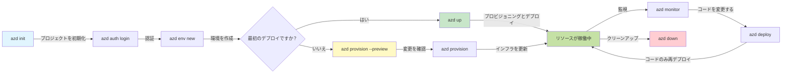
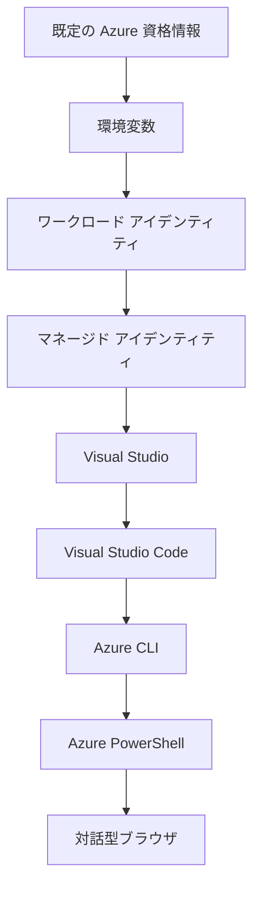

# AZD Basics - Azure Developer CLIの理解

# AZD Basics - コア概念と基礎

**章のナビゲーション:**
- **📚 Course Home**: [AZD For Beginners](../../README.md)
- **📖 Current Chapter**: 第1章 - 基礎とクイックスタート
- **⬅️ Previous**: [Course Overview](../../README.md#-chapter-1-foundation--quick-start)
- **➡️ Next**: [Installation & Setup](installation.md)
- **🚀 Next Chapter**: [第2章: AIファースト開発](../chapter-02-ai-development/microsoft-foundry-integration.md)

## はじめに

このレッスンでは、ローカル開発から Azure へのデプロイまでのプロセスを加速する強力なコマンドラインツール、Azure Developer CLI (azd) を紹介します。基本概念、主要機能を学び、azd がクラウドネイティブアプリケーションのデプロイをどのように簡素化するかを理解します。

## 学習目標

このレッスンの終了時には、あなたは以下を達成できます:
- Azure Developer CLI が何であり、その主な目的を理解する
- テンプレート、環境、サービスのコア概念を学ぶ
- テンプレート駆動開発やInfrastructure as Codeを含む主要機能を探索する
- azd プロジェクト構造とワークフローを理解する
- 開発環境用に azd をインストールして設定する準備ができる

## 学習成果

このレッスンを完了した後、あなたは次のことができるようになります:
- 現代のクラウド開発ワークフローにおける azd の役割を説明する
- azd プロジェクト構造の構成要素を識別する
- テンプレート、環境、サービスがどのように連携するかを説明する
- azd を使った Infrastructure as Code の利点を理解する
- さまざまな azd コマンドとその目的を認識する

## Azure Developer CLI (azd) とは？

Azure Developer CLI (azd) は、ローカル開発から Azure へのデプロイまでの旅を加速するために設計されたコマンドラインツールです。Azure 上でクラウドネイティブアプリケーションを構築、デプロイ、管理するプロセスを簡素化します。

### azd で何をデプロイできますか？

azd は幅広いワークロードをサポートしており、そのリストは増え続けています。現在、azd を使ってデプロイできるのは次のようなものです:

| Workload Type | Examples | Same Workflow? |
|---------------|----------|----------------|
| **Traditional applications** | Web apps, REST APIs, static sites | ✅ `azd up` |
| **Services and microservices** | Container Apps, Function Apps, multi-service backends | ✅ `azd up` |
| **AI-powered applications** | Chat apps with Microsoft Foundry Models, RAG solutions with AI Search | ✅ `azd up` |
| **Intelligent agents** | Foundry-hosted agents, multi-agent orchestrations | ✅ `azd up` |

重要な洞察は、<strong>何をデプロイするかに関係なく azd のライフサイクルは同じ</strong>だということです。プロジェクトを初期化し、インフラをプロビジョニングし、コードをデプロイし、アプリを監視し、クリーンアップします — 単純なウェブサイトでも高度な AI エージェントでも同様です。

この継続性は設計上の意図です。azd は AI 機能をアプリケーションが利用できる別種のサービスとして扱い、本質的に異なるものとは見なしません。Microsoft Foundry Models によってバックエンドされるチャットエンドポイントも、azd の観点では、構成してデプロイする別のサービスに過ぎません。

### 🎯 なぜ AZD を使うのか？ 実例比較

単純なウェブアプリとデータベースをデプロイする場合を比較してみましょう:

#### ❌ AZDなし: 手動での Azure デプロイ（30分以上）

```bash
# ステップ 1: リソースグループを作成する
az group create --name myapp-rg --location eastus

# ステップ 2: App Service プランを作成する
az appservice plan create --name myapp-plan \
  --resource-group myapp-rg \
  --sku B1 --is-linux

# ステップ 3: Web アプリを作成する
az webapp create --name myapp-web-unique123 \
  --resource-group myapp-rg \
  --plan myapp-plan \
  --runtime "NODE:18-lts"

# ステップ 4: Cosmos DB アカウントを作成する（10〜15分）
az cosmosdb create --name myapp-cosmos-unique123 \
  --resource-group myapp-rg \
  --kind MongoDB

# ステップ 5: データベースを作成する
az cosmosdb mongodb database create \
  --account-name myapp-cosmos-unique123 \
  --resource-group myapp-rg \
  --name tododb

# ステップ 6: コレクションを作成する
az cosmosdb mongodb collection create \
  --account-name myapp-cosmos-unique123 \
  --resource-group myapp-rg \
  --database-name tododb \
  --name todos

# ステップ 7: 接続文字列を取得する
CONN_STR=$(az cosmosdb keys list \
  --name myapp-cosmos-unique123 \
  --resource-group myapp-rg \
  --type connection-strings \
  --query "connectionStrings[0].connectionString" -o tsv)

# ステップ 8: アプリの設定を構成する
az webapp config appsettings set \
  --name myapp-web-unique123 \
  --resource-group myapp-rg \
  --settings MONGODB_URI="$CONN_STR"

# ステップ 9: ロギングを有効にする
az webapp log config --name myapp-web-unique123 \
  --resource-group myapp-rg \
  --application-logging filesystem \
  --detailed-error-messages true

# ステップ 10: Application Insights を設定する
az monitor app-insights component create \
  --app myapp-insights \
  --location eastus \
  --resource-group myapp-rg

# ステップ 11: Application Insights を Web アプリにリンクする
INSTRUMENTATION_KEY=$(az monitor app-insights component show \
  --app myapp-insights \
  --resource-group myapp-rg \
  --query "instrumentationKey" -o tsv)

az webapp config appsettings set \
  --name myapp-web-unique123 \
  --resource-group myapp-rg \
  --settings APPINSIGHTS_INSTRUMENTATIONKEY="$INSTRUMENTATION_KEY"

# ステップ 12: ローカルでアプリケーションをビルドする
npm install
npm run build

# ステップ 13: デプロイ用パッケージを作成する
zip -r app.zip . -x "*.git*" "node_modules/*"

# ステップ 14: アプリケーションをデプロイする
az webapp deployment source config-zip \
  --resource-group myapp-rg \
  --name myapp-web-unique123 \
  --src app.zip

# ステップ 15: 待って、うまくいくことを祈る 🙏
# （自動検証なし、手動テストが必要）
```

**問題点:**
- ❌ 覚えて順に実行するコマンドが15以上
- ❌ 30〜45分の手作業
- ❌ ミスをしやすい（タイプミス、間違ったパラメーター）
- ❌ ターミナル履歴に接続文字列が露出する
- ❌ 失敗した場合の自動ロールバックがない
- ❌ チームメンバー向けに再現しにくい
- ❌ 毎回違う（再現不可）

#### ✅ AZDあり: 自動化されたデプロイ（5コマンド、10〜15分）

```bash
# ステップ 1: テンプレートから初期化
azd init --template todo-nodejs-mongo

# ステップ 2: 認証
azd auth login

# ステップ 3: 環境を作成
azd env new dev

# ステップ 4: 変更をプレビュー（任意だが推奨）
azd provision --preview

# ステップ 5: すべてをデプロイ
azd up

# ✨ 完了！すべてがデプロイされ、構成され、監視されています
```

**利点:**
- ✅ **5コマンド** 対して手動ステップ15以上
- ✅ **合計10〜15分**（主に Azure の待ち時間）
- ✅ <strong>手作業のミスが減る</strong> - 一貫したテンプレート駆動ワークフロー
- ✅ <strong>安全なシークレット処理</strong> - 多くのテンプレートが Azure 管理のシークレットストレージを使用
- ✅ <strong>再現可能なデプロイ</strong> - 毎回同じワークフロー
- ✅ <strong>完全に再現可能</strong> - 毎回同じ結果
- ✅ <strong>チーム準備済み</strong> - 誰でも同じコマンドでデプロイ可能
- ✅ **Infrastructure as Code** - バージョン管理された Bicep テンプレート
- ✅ <strong>組み込み監視</strong> - Application Insights が自動構成される

### 📊 時間とエラーの削減

| Metric | Manual Deployment | AZD Deployment | Improvement |
|:-------|:------------------|:---------------|:------------|
| **Commands** | 15+ | 5 | 67% fewer |
| **Time** | 30-45 min | 10-15 min | 60% faster |
| **Error Rate** | ~40% | <5% | 88% reduction |
| **Consistency** | Low (manual) | 100% (automated) | Perfect |
| **Team Onboarding** | 2-4 hours | 30 minutes | 75% faster |
| **Rollback Time** | 30+ min (manual) | 2 min (automated) | 93% faster |

## コア概念

### テンプレート
テンプレートは azd の基盤です。テンプレートには以下が含まれます:
- <strong>アプリケーションコード</strong> - ソースコードと依存関係
- <strong>インフラ定義</strong> - Bicep または Terraform で定義された Azure リソース
- <strong>設定ファイル</strong> - 設定と環境変数
- <strong>デプロイスクリプト</strong> - 自動デプロイワークフロー

### 環境
環境は異なるデプロイ先を表します:
- **Development** - テストと開発用
- **Staging** - 本番前環境
- **Production** - 本番環境

各環境は以下を個別に管理します:
- Azure リソースグループ
- 設定
- デプロイ状態

### サービス
サービスはアプリケーションの構成要素です:
- **Frontend** - Web アプリケーション、SPA
- **Backend** - API、マイクロサービス
- **Database** - データストレージソリューション
- **Storage** - ファイルおよび BLOB ストレージ

## 主要機能

### 1. テンプレート駆動開発
```bash
# 利用可能なテンプレートを閲覧する
azd template list

# テンプレートから初期化する
azd init --template <template-name>
```

### 2. Infrastructure as Code
- **Bicep** - Azure のドメイン固有言語
- **Terraform** - マルチクラウド向けインフラツール
- **ARM Templates** - Azure Resource Manager テンプレート

### 3. 統合ワークフロー
```bash
# 完全なデプロイワークフロー
azd up            # プロビジョニング＋デプロイ：初回セットアップは手動不要

# 🧪 新機能：デプロイ前にインフラの変更をプレビューする（安全）
azd provision --preview    # 変更を加えずにインフラのデプロイをシミュレートする

azd provision     # インフラを更新する際に Azure リソースを作成するにはこれを使用
azd deploy        # アプリケーションコードをデプロイする、または更新後に再デプロイする
azd down          # リソースのクリーンアップ
```

#### 🛡️ プレビューによる安全なインフラ計画
`azd provision --preview` コマンドは安全なデプロイのためのゲームチェンジャーです:
- <strong>ドライラン解析</strong> - 作成、変更、削除される内容を表示
- <strong>リスクゼロ</strong> - Azure 環境に実際の変更は加えられない
- <strong>チームでの共有</strong> - デプロイ前にプレビュー結果を共有可能
- <strong>コスト見積もり</strong> - コミット前にリソースコストを把握

```bash
# プレビューのサンプルワークフロー
azd provision --preview           # 何が変更されるかを確認する
# 出力を確認し、チームと話し合う
azd provision                     # 自信を持って変更を適用する
```

### 📊 ビジュアル: AZD 開発ワークフロー



**ワークフローの説明:**
1. **Init** - テンプレートまたは新規プロジェクトで開始
2. **Auth** - Azure に認証
3. **Environment** - 分離されたデプロイ環境を作成
4. **Preview** - 🆕 まず常にインフラ変更をプレビューする（安全な習慣）
5. **Provision** - Azure リソースを作成/更新
6. **Deploy** - アプリケーションコードをプッシュ
7. **Monitor** - アプリケーションのパフォーマンスを観察
8. **Iterate** - 変更を加え、コードを再デプロイ
9. **Cleanup** - 終了時にリソースを削除

### 4. 環境管理
```bash
# 環境を作成および管理する
azd env new <environment-name>
azd env select <environment-name>
azd env list
```

### 5. 拡張機能と AI コマンド

azd はコア CLI を超えた機能を追加するための拡張システムを使用します。これは特に AI ワークロードに有用です:

```bash
# 利用可能な拡張機能を一覧表示
azd extension list

# Foundry agents 拡張機能をインストールする
azd extension install azure.ai.agents

# マニフェストからAIエージェントのプロジェクトを初期化する
azd ai agent init -m agent-manifest.yaml

# デプロイ済みエージェントをテストする（レイテンシと最初のバイト到着時間を表示）
azd ai agent invoke

# AI支援開発のためのMCPサーバーを起動する（アルファ）
azd mcp start
```

**エージェントのライフサイクル（エンドツーエンド）。** `azure.ai.agents` をインストールすると、アイデアから稼働中で監視されたエージェントまでを単一のワークフローで進められます。これらをすべて最初から使う必要はありません — 存在することを知っておいてください:

| Stage | Command | What it does |
|-------|---------|--------------|
| **Scaffold** | `azd ai agent init -m <manifest>` | マニフェストからエージェントプロジェクトを生成 |
| **Test** | `azd ai agent invoke` | エージェントを呼び出し、応答時間を確認 |
| **Measure** | `azd ai agent eval generate` | エージェント用の評価データセットを作成 |
| **Improve** | `azd ai agent optimize` | データに対してエージェント指示を最適化 |
| **Inspect** | `azd ai agent endpoint show` | ライブエンドポイントの構成を表示 |
| **Clean up** | `azd ai agent delete` | ホストされたエージェントとすべてのバージョンを削除 |

> 拡張機能は [第2章: AIファースト開発](../chapter-02-ai-development/agents.md) および [AZD AI CLI コマンド](../chapter-08-production/production-ai-practices.md#azd-ai-cli-commands-and-extensions) のリファレンスで詳しく扱われます。

## 📁 プロジェクト構造

典型的な azd プロジェクト構造:
```
my-app/
├── .azd/                    # azd configuration
│   └── config.json
├── .azure/                  # Azure deployment artifacts
├── .devcontainer/          # Development container config
├── .github/workflows/      # GitHub Actions
├── .vscode/               # VS Code settings
├── infra/                 # Infrastructure code
│   ├── main.bicep        # Main infrastructure template
│   ├── main.parameters.json
│   └── modules/          # Reusable modules
├── src/                  # Application source code
│   ├── api/             # Backend services
│   └── web/             # Frontend application
├── azure.yaml           # azd project configuration
└── README.md
```

## 🔧 設定ファイル

### azure.yaml
メインのプロジェクト設定ファイル:
```yaml
name: my-awesome-app
metadata:
  template: my-template@1.0.0

services:
  web:
    project: ./src/web
    language: js
    host: appservice
  api:
    project: ./src/api
    language: js
    host: appservice

hooks:
  preprovision:
    shell: pwsh
    run: echo "Preparing to provision..."
```

### .azure/config.json
環境固有の設定:
```json
{
  "version": 1,
  "defaultEnvironment": "dev",
  "environments": {
    "dev": {
      "subscriptionId": "your-subscription-id",
      "location": "eastus"
    }
  }
}
```

## 🎪 ハンズオン演習を含む一般的なワークフロー

> **💡 学習のヒント:** これらの演習は順番に従って、AZD スキルを段階的に構築してください。

### 🎯 演習 1: 最初のプロジェクトを初期化する

**目標:** AZD プロジェクトを作成し、その構造を調べる

**手順:**
```bash
# 実績のあるテンプレートを使用する
azd init --template todo-nodejs-mongo

# 生成されたファイルを調べる
ls -la  # 隠しファイルを含むすべてのファイルを表示する

# 作成された主要ファイル:
# - azure.yaml (メインの設定)
# - infra/ (インフラのコード)
# - src/ (アプリケーションコード)
```

**✅ 成功:** azure.yaml、infra/、src/ ディレクトリがある

---

### 🎯 演習 2: Azure へのデプロイ

**目標:** エンドツーエンドのデプロイを完了する

**手順:**
```bash
# 1. 認証する
az login && azd auth login

# 2. 環境を作成する
azd env new dev
azd env set AZURE_LOCATION eastus

# 3. 変更をプレビューする（推奨）
azd provision --preview

# 4. すべてをデプロイする
azd up

# 5. デプロイを検証する
azd show    # アプリのURLを表示する
```

**想定時間:** 10〜15分  
**✅ 成功:** ブラウザでアプリケーションの URL が開く

---

### 🎯 演習 3: 複数環境

**目標:** dev と staging にデプロイする

**手順:**
```bash
# すでに dev があるので、staging を作成する
azd env new staging
azd env set AZURE_LOCATION westus2
azd up

# それらを切り替える
azd env list
azd env select dev
```

**✅ 成功:** Azure ポータルに 2 つの別々のリソースグループがある

---

### 🛡️ クリーンスレート: `azd down --force --purge`

完全にリセットする必要があるとき:

```bash
azd down --force --purge
```

**何をするか:**
- `--force`: 確認プロンプトなし
- `--purge`: すべてのローカル状態と Azure リソースを削除

**使用する場合:**
- デプロイが途中で失敗したとき
- プロジェクトを切り替えるとき
- 新規スタートが必要なとき

---

## 🎪 元のワークフローレファレンス

### 新しいプロジェクトの開始
```bash
# 方法1: 既存のテンプレートを使用する
azd init --template todo-nodejs-mongo

# 方法2: 一から始める
azd init

# 方法3: 現在のディレクトリを使用する
azd init .
```

### 開発サイクル
```bash
# 開発環境を設定する
azd auth login
azd env new dev
azd env select dev

# すべてをデプロイする
azd up

# 変更を加えて再デプロイする
azd deploy

# 作業が終わったらクリーンアップする
azd down --force --purge # Azure Developer CLI のコマンドは環境を**ハードリセット**するもので、特にデプロイ失敗のトラブルシューティング、孤立したリソースのクリーンアップ、または新しい再デプロイの準備をする際に役立ちます。
```

## `azd down --force --purge` の理解
`azd down --force --purge` コマンドは、azd 環境と関連リソースを完全に解体する強力な方法です。各フラグが何をするかの内訳は次のとおりです:
```
--force
```
- 確認プロンプトをスキップします。
- 自動化やスクリプトで手動入力が不可能な場合に有用です。
- CLI が不整合を検出しても中断せずに解体を進めます。

```
--purge
```
削除される <strong>すべての関連メタデータ</strong> には以下が含まれます:
Environment state
Local `.azure` folder
Cached deployment info
Prevents azd from "remembering" previous deployments, which can cause issues like mismatched resource groups or stale registry references.


### なぜ両方を使うのか？
`azd up` が残存状態や部分デプロイによって動かなくなったとき、この組み合わせは <strong>クリーンスレート</strong> を保証します。

これは特に、Azure ポータルで手動でリソースを削除した後や、テンプレート、環境、またはリソースグループの命名規則を切り替えるときに役立ちます。


### 複数環境の管理
```bash
# ステージング環境を作成
azd env new staging
azd env select staging
azd up

# 開発環境に戻す
azd env select dev

# 環境を比較する
azd env list
```

## 🔐 認証と資格情報

認証の理解は azd デプロイの成功に不可欠です。Azure は複数の認証方法を使用し、azd は他の Azure ツールが使用するのと同じ資格情報チェーンを活用します。

### Azure CLI 認証（`az login`）

azd を使用する前に、Azure に認証する必要があります。最も一般的な方法は Azure CLI を使った認証です:

```bash
# 対話式ログイン（ブラウザを開く）
az login

# 特定のテナントでログインする
az login --tenant <tenant-id>

# サービスプリンシパルでログインする
az login --service-principal -u <app-id> -p <password> --tenant <tenant-id>

# 現在のログイン状態を確認する
az account show

# 利用可能なサブスクリプションを一覧表示する
az account list --output table

# 既定のサブスクリプションを設定する
az account set --subscription <subscription-id>
```

### 認証フロー
1. <strong>対話的ログイン</strong>: デフォルトのブラウザを開いて認証
2. <strong>デバイスコードフロー</strong>: ブラウザアクセスがない環境向け
3. <strong>サービスプリンシパル</strong>: 自動化や CI/CD シナリオ向け
4. **マネージドID**: Azure 上でホストされるアプリケーション向け

### DefaultAzureCredential チェーン

`DefaultAzureCredential` は、特定の順序で複数の資格情報ソースを自動的に試すことで、簡素化された認証体験を提供する資格情報タイプです:

#### 資格情報チェーンの順序


#### 1. 環境変数
```bash
# サービスプリンシパル用の環境変数を設定する
export AZURE_CLIENT_ID="<app-id>"
export AZURE_CLIENT_SECRET="<password>"
export AZURE_TENANT_ID="<tenant-id>"
```

#### 2. Workload Identity (Kubernetes/GitHub Actions)
自動的に使用される例:
- Workload Identity を使用する Azure Kubernetes Service (AKS)
- OIDC フェデレーションを使った GitHub Actions
- その他のフェデレーション ID シナリオ

#### 3. マネージド ID
次のような Azure リソース向け:
- Virtual Machines
- App Service
- Azure Functions
- Container Instances

```bash
# Azure リソース上でマネージドIDを使用して実行されているかを確認する
az account show --query "user.type" --output tsv
# 戻り値: マネージドIDを使用している場合は "servicePrincipal" を返す
```

#### 4. 開発者ツールとの統合
- **Visual Studio**: サインインしたアカウントを自動的に使用
- **VS Code**: Azure Account 拡張機能の資格情報を使用
- **Azure CLI**: `az login` の資格情報を使用（ローカル開発で最も一般的）

### AZD 認証のセットアップ

```bash
# 方法 1: Azure CLI を使用（開発向け推奨）
az login
azd auth login  # 既存の Azure CLI 資格情報を使用します

# 方法 2: azd による直接認証
azd auth login --use-device-code  # ヘッドレス環境向け

# 方法 3: 認証状況を確認する
azd auth login --check-status

# 方法 4: ログアウトして再認証する
azd auth logout
azd auth login
```

### 認証のベストプラクティス

#### ローカル開発向け
```bash
# 1. Azure CLIでログインする
az login

# 2. 正しいサブスクリプションを確認する
az account show
az account set --subscription "Your Subscription Name"

# 3. 既存の資格情報で azd を使用する
azd auth login
```

#### For CI/CD Pipelines
```yaml
# GitHub Actions example
- name: Azure Login
  uses: azure/login@v1
  with:
    creds: ${{ secrets.AZURE_CREDENTIALS }}

- name: Deploy with azd
  run: |
    azd auth login --client-id ${{ secrets.AZURE_CLIENT_ID }} \
                    --client-secret ${{ secrets.AZURE_CLIENT_SECRET }} \
                    --tenant-id ${{ secrets.AZURE_TENANT_ID }}
    azd up --no-prompt
```

#### For Production Environments
- Azure リソース上で実行する場合は **Managed Identity** を使用する
- 自動化シナリオには **Service Principal** を使用する
- コードや設定ファイルに資格情報を保存しない
- 機密設定には **Azure Key Vault** を使用する

### Common Authentication Issues and Solutions

#### Issue: "No subscription found"
```bash
# 解決策: 既定のサブスクリプションを設定する
az account list --output table
az account set --subscription "<subscription-id>"
azd env set AZURE_SUBSCRIPTION_ID "<subscription-id>"
```

#### Issue: "Insufficient permissions"
```bash
# 解決策：必要なロールを確認して割り当てる
az role assignment list --assignee $(az account show --query user.name --output tsv)

# 共通の必要ロール：
# - コントリビューター（リソース管理用）
# - ユーザーアクセス管理者（ロール割り当て用）
```

#### Issue: "Token expired"
```bash
# 解決策: 再認証
az logout
az login
azd auth logout
azd auth login
```

### Authentication in Different Scenarios

#### Local Development
```bash
# 自己啓発用アカウント
az login
azd auth login
```

#### Team Development
```bash
# 組織には特定のテナントを使用する
az login --tenant contoso.onmicrosoft.com
azd auth login
```

#### Multi-tenant Scenarios
```bash
# テナント間を切り替える
az login --tenant tenant1.onmicrosoft.com
# テナント1にデプロイする
azd up

az login --tenant tenant2.onmicrosoft.com  
# テナント2にデプロイする
azd up
```

### Security Considerations

1. **Credential Storage**: ソースコードに資格情報を保存しないこと
2. **Scope Limitation**: サービスプリンシパルには最小権限の原則を適用すること
3. **Token Rotation**: サービスプリンシパルのシークレットは定期的にローテーションすること
4. **Audit Trail**: 認証およびデプロイのアクティビティを監視すること
5. **Network Security**: 可能な場合はプライベートエンドポイントを使用すること

### Troubleshooting Authentication

```bash
# 認証の問題をデバッグする
azd auth login --check-status
az account show
az account get-access-token

# 一般的な診断コマンド
whoami                          # 現在のユーザーコンテキスト
az ad signed-in-user show      # Microsoft Entra ID のユーザー詳細
az group list                  # リソースアクセスをテストする
```

## Understanding `azd down --force --purge`

### Discovery
```bash
azd template list              # テンプレートを参照
azd template show <template>   # テンプレートの詳細
azd init --help               # 初期化オプション
```

### Project Management
```bash
azd show                     # プロジェクトの概要
azd env list                # 利用可能な環境と選択されたデフォルト
azd config show            # 構成設定
```

### Monitoring
```bash
azd monitor                  # Azure ポータルの監視を開く
azd monitor --logs           # アプリケーションのログを表示する
azd monitor --live           # リアルタイムのメトリクスを表示する
azd pipeline config          # CI/CD を設定する
```

## Best Practices

### 1. Use Meaningful Names
```bash
# 良い
azd env new production-east
azd init --template web-app-secure

# 避ける
azd env new env1
azd init --template template1
```

### 2. Leverage Templates
- 既存のテンプレートから開始する
- 必要に応じてカスタマイズする
- 組織向けに再利用可能なテンプレートを作成する

### 3. Environment Isolation
- dev/staging/prod 用に別々の環境を使用する
- ローカルマシンから直接本番にデプロイしない
- 本番デプロイには CI/CD パイプラインを使用する

### 4. Configuration Management
- 機密データには環境変数を使用する
- 設定はバージョン管理に保存する
- 環境固有の設定をドキュメント化する

## Learning Progression

### Beginner (Week 1-2)
1. azd をインストールして認証する
2. シンプルなテンプレートをデプロイする
3. プロジェクト構成を理解する
4. 基本コマンド（up, down, deploy）を学ぶ

### Intermediate (Week 3-4)
1. テンプレートをカスタマイズする
2. 複数の環境を管理する
3. インフラコードを理解する
4. CI/CD パイプラインを設定する

### Advanced (Week 5+)
1. カスタムテンプレートを作成する
2. 高度なインフラパターン
3. マルチリージョン展開
4. エンタープライズ向け構成

## Next Steps

**📖 Continue Chapter 1 Learning:**
- [Installation & Setup](installation.md) - azd をインストールして設定する
- [Your First Project](first-project.md) - ハンズオンチュートリアルを完了する
- [Configuration Guide](configuration.md) - 高度な構成オプション

**🎯 Ready for Next Chapter?**
- [Chapter 2: AI-First Development](../chapter-02-ai-development/microsoft-foundry-integration.md) - AI アプリケーションの構築を開始する

## Additional Resources

- [Azure Developer CLI Overview](https://learn.microsoft.com/en-us/azure/developer/azure-developer-cli/)
- [Template Gallery](https://azure.github.io/awesome-azd/)
- [Community Samples](https://github.com/Azure-Samples)

---

## 🙋 Frequently Asked Questions

### General Questions

**Q: What's the difference between AZD and Azure CLI?**

A: Azure CLI (`az`) は個々の Azure リソースを管理するためのツールです。AZD (`azd`) はアプリケーション全体を管理するためのツールです：

```bash
# Azure CLI - 低レベルのリソース管理
az webapp create --name myapp --resource-group rg
az sql server create --name myserver --resource-group rg
# ...さらに多くのコマンドが必要

# AZD - アプリケーションレベルの管理
azd up  # アプリ全体をすべてのリソースと共にデプロイする
```

**Think of it this way:**
- `az` = 個々のレゴのブロックを操作すること
- `azd` = 完成したレゴセットで作業すること

---

**Q: Do I need to know Bicep or Terraform to use AZD?**

A: いいえ！まずはテンプレートから始めてください：
```bash
# 既存のテンプレートを使用 - IaC の知識は不要
azd init --template todo-nodejs-mongo
azd up
```

後でインフラをカスタマイズするために Bicep を学ぶことができます。テンプレートは学習用の実例を提供します。

---

**Q: How much does it cost to run AZD templates?**

A: コストはテンプレートによって異なります。ほとんどの開発テンプレートは月額 $50–150 程度です：

```bash
# デプロイ前にコストを確認する
azd provision --preview

# 使用していないときは必ずクリーンアップする
azd down --force --purge  # すべてのリソースを削除する
```

**Pro tip:** 利用可能な無料枠を活用すること：
- App Service: F1 (Free) ティア
- Microsoft Foundry Models: Azure OpenAI 50,000 tokens/月の無料枠
- Cosmos DB: 1000 RU/s の無料枠

---

**Q: Can I use AZD with existing Azure resources?**

A: はい、可能ですが新規で始める方が簡単です。AZD はフルライフサイクルを管理する場合に最も効果的です。既存リソースについては：

```bash
# オプション 1: 既存のリソースをインポートする（上級者向け）
azd init
# その後、infra/ を変更して既存のリソースを参照するようにします

# オプション 2: 最初からやり直す（推奨）
azd init --template matching-your-stack
azd up  # 新しい環境を作成します
```

---

**Q: How do I share my project with teammates?**

A: AZD プロジェクトを Git にコミットしてください（ただし .azure フォルダーはコミットしない）：

```bash
# 既にデフォルトで .gitignore に含まれています
.azure/        # 機密情報や環境データを含む
*.env          # 環境変数

# その後のチームメンバー:
git clone <your-repo>
azd auth login
azd env new <their-name>-dev
azd up
```

全員が同じテンプレートから同一のインフラを得られます。

---

### Troubleshooting Questions

**Q: "azd up" failed halfway. What do I do?**

A: エラーを確認して修正し、再試行してください：

```bash
# 詳細なログを表示
azd show

# よくある対処法:

# 1. クォータを超過した場合:
azd env set AZURE_LOCATION "westus2"  # 別のリージョンを試す

# 2. リソース名が競合している場合:
azd down --force --purge  # 状態をリセットする
azd up  # 再試行する

# 3. 認証が期限切れの場合:
az login
azd auth login
azd up
```

**Most common issue:** 選択された Azure サブスクリプションが間違っている
```bash
az account list --output table
az account set --subscription "<correct-subscription>"
```

---

**Q: How do I deploy just code changes without reprovisioning?**

A: `azd deploy` を `azd up` の代わりに使用してください：

```bash
azd up          # 初回: プロビジョニング + デプロイ (遅い)

# コードを変更...

azd deploy      # 以降: デプロイのみ (速い)
```

スピード比較:
- `azd up`: 10–15 分（インフラをプロビジョニング）
- `azd deploy`: 2–5 分（コードのみ）

---

**Q: Can I customize the infrastructure templates?**

A: はい！`infra/` の Bicep ファイルを編集してください：

```bash
# azd init の後
cd infra/
code main.bicep  # VS Code で編集

# 変更をプレビュー
azd provision --preview

# 変更を適用
azd provision
```

**Tip:** 小さく始める — まずは SKU を変更すること：
```bicep
// infra/main.bicep
sku: {
  name: 'B1'  // Change to 'P1V2' for production
}
```

---

**Q: How do I delete everything AZD created?**

A: 1 つのコマンドで全リソースを削除できます：

```bash
azd down --force --purge

# これにより次のものが削除されます:
# - すべての Azure リソース
# - リソース グループ
# - ローカル環境の状態
# - キャッシュされたデプロイメントデータ
```

**Always run this when:**
- テンプレートのテストを終えたとき
- 別のプロジェクトに切り替えるとき
- 新しくやり直したいとき

**Cost savings:** 未使用リソースを削除すると料金は $0 になります

---

**Q: What if I accidentally deleted resources in Azure Portal?**

A: AZD の状態が同期しなくなることがあります。クリーンな状態に戻す方法：

```bash
# 1. ローカルの状態を削除する
azd down --force --purge

# 2. 最初からやり直す
azd up

# Alternative: AZD に検出と修正を任せる
azd provision  # 不足しているリソースを作成します
```

---

### Advanced Questions

**Q: Can I use AZD in CI/CD pipelines?**

A: はい！GitHub Actions の例：

```yaml
# .github/workflows/deploy.yml
name: Deploy with AZD

on:
  push:
    branches: [main]

jobs:
  deploy:
    runs-on: ubuntu-latest
    steps:
      - uses: actions/checkout@v2
      
      - name: Install azd
        run: curl -fsSL https://aka.ms/install-azd.sh | bash
      
      - name: Azure Login
        run: |
          azd auth login \
            --client-id ${{ secrets.AZURE_CLIENT_ID }} \
            --client-secret ${{ secrets.AZURE_CLIENT_SECRET }} \
            --tenant-id ${{ secrets.AZURE_TENANT_ID }}
      
      - name: Deploy
        run: azd up --no-prompt
```

---

**Q: How do I handle secrets and sensitive data?**

A: AZD は Azure Key Vault と自動統合されます：

```bash
# 機密情報はコード内ではなく Key Vault に保存されます
azd env set DATABASE_PASSWORD "$(openssl rand -base64 32)"

# AZD は自動的に:
# 1. Key Vault を作成します
# 2. シークレットを保存します
# 3. マネージド ID を介してアプリにアクセス権を付与します
# 4. 実行時に注入します
```

**絶対にコミットしないでください:**
- `.azure/` フォルダー（環境データを含む）
- `.env` ファイル（ローカルシークレット）
- 接続文字列

---

**Q: Can I deploy to multiple regions?**

A: はい、リージョンごとに環境を作成してください：

```bash
# 米国東部の環境
azd env new prod-eastus
azd env set AZURE_LOCATION eastus
azd up

# 西ヨーロッパの環境
azd env new prod-westeurope
azd env set AZURE_LOCATION westeurope
azd up

# 各環境は独立しています
azd env list
```

真のマルチリージョンアプリの場合は、Bicep テンプレートをカスタマイズして複数リージョンへ同時デプロイできるようにします。

---

**Q: Where can I get help if I'm stuck?**

1. **AZD Documentation:** https://learn.microsoft.com/azure/developer/azure-developer-cli/
2. **GitHub Issues:** https://github.com/Azure/azure-dev/issues
3. **Discord:** [Azure Discord](https://discord.gg/microsoft-azure) - #azure-developer-cli チャンネル
4. **Stack Overflow:** タグ `azure-developer-cli`
5. **This Course:** [Troubleshooting Guide](../chapter-07-troubleshooting/common-issues.md)

**Pro tip:** 問い合わせ前に次を実行してください：
```bash
azd show       # 現在の状態を表示します
azd version    # あなたのバージョンを表示します
```
この情報を質問に含めると、より早く助けを得られます。

---

## 🎓 What's Next?

You now understand AZD fundamentals. Choose your path:

### 🎯 For Beginners:
1. **Next:** [Installation & Setup](installation.md) - マシンに AZD をインストールする
2. **Then:** [Your First Project](first-project.md) - 最初のアプリをデプロイする
3. **Practice:** このレッスンの全 3 問の演習を完了する

### 🚀 For AI Developers:
1. **Skip to:** [Chapter 2: AI-First Development](../chapter-02-ai-development/microsoft-foundry-integration.md)
2. **Deploy:** `azd init --template get-started-with-ai-chat` で開始する
3. **Learn:** デプロイしながら構築する

### 🏗️ For Experienced Developers:
1. **Review:** [Configuration Guide](configuration.md) - 高度な設定
2. **Explore:** [Infrastructure as Code](../chapter-04-infrastructure/provisioning.md) - Bicep の詳細
3. **Build:** スタック向けのカスタムテンプレートを作成する

---

**Chapter Navigation:**
- **📚 Course Home**: [AZD 入門](../../README.md)
- **📖 Current Chapter**: Chapter 1 - 基礎とクイックスタート  
- **⬅️ Previous**: [Course Overview](../../README.md#-chapter-1-foundation--quick-start)
- **➡️ Next**: [Installation & Setup](installation.md)
- **🚀 Next Chapter**: [Chapter 2: AI-First Development](../chapter-02-ai-development/microsoft-foundry-integration.md)

---

<!-- CO-OP TRANSLATOR DISCLAIMER START -->
**免責事項**：
本書類は AI 翻訳サービス [Co-op Translator](https://github.com/Azure/co-op-translator) を使用して翻訳されています。正確性を期していますが、自動翻訳には誤りや不正確な部分が含まれる可能性があることをご承知おきください。原文の原語版が正式な情報源とみなされるべきです。重要な情報については、専門の人間による翻訳を推奨します。本翻訳の利用により生じたいかなる誤解や解釈違いについても、当方は責任を負いかねます。
<!-- CO-OP TRANSLATOR DISCLAIMER END -->