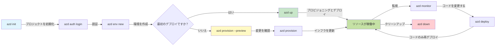
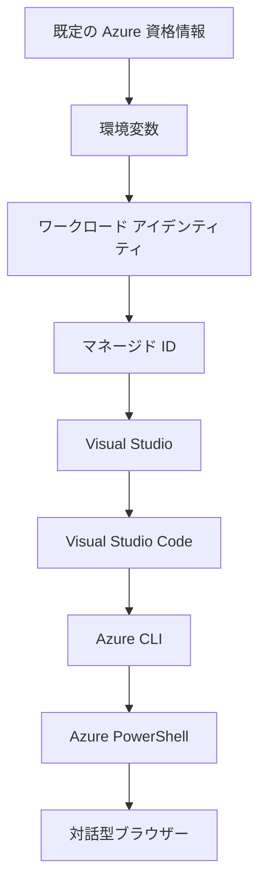

# AZD 基礎 - Azure Developer CLI の理解

# AZD 基礎 - コア概念と基本事項

**章のナビゲーション:**
- **📚 コースホーム**: [AZD 入門](../../README.md)
- **📖 現在の章**: 第1章 - 基礎とクイックスタート
- **⬅️ 前へ**: [コース概要](../../README.md#-chapter-1-foundation--quick-start)
- **➡️ 次へ**: [インストールとセットアップ](installation.md)
- **🚀 次の章**: [第2章: AIファースト開発](../chapter-02-ai-development/microsoft-foundry-integration.md)

## イントロダクション

このレッスンでは、Azure Developer CLI (azd) を紹介します。azd はローカル開発から Azure へのデプロイまでのプロセスを加速する強力なコマンドラインツールです。ここでは基本的な概念、主要な機能、および azd がクラウドネイティブアプリケーションのデプロイをどのように簡素化するかを学びます。

## 学習目標

このレッスンの終わりまでに、あなたは次のことができるようになります:
- Azure Developer CLI が何であり、その主な目的を理解する
- テンプレート、環境、およびサービスのコア概念を学ぶ
- テンプレート主導の開発やInfrastructure as Code を含む主要機能を探る
- azd プロジェクトの構造とワークフローを理解する
- 開発環境に azd をインストールして構成する準備をする

## 学習到達目標

このレッスンを修了した後、あなたは以下ができるようになります:
- モダンなクラウド開発ワークフローにおける azd の役割を説明する
- azd プロジェクト構造の構成要素を識別する
- テンプレート、環境、およびサービスがどのように連携するかを説明する
- azd による Infrastructure as Code の利点を理解する
- さまざまな azd コマンドとその目的を認識する

## Azure Developer CLI (azd) とは何か?

Azure Developer CLI (azd) は、ローカル開発から Azure へのデプロイまでのプロセスを加速することを目的としたコマンドラインツールです。Azure 上でクラウドネイティブアプリケーションを構築、デプロイ、および管理するプロセスを簡素化します。

### 🎯 なぜ AZD を使うのか？ 実例比較

簡単な Web アプリとデータベースをデプロイする場合を比較しましょう:

#### ❌ AZD を使わない場合: 手動による Azure デプロイ (30 分以上)

```bash
# ステップ 1: リソース グループを作成する
az group create --name myapp-rg --location eastus

# ステップ 2: App Service プランを作成する
az appservice plan create --name myapp-plan \
  --resource-group myapp-rg \
  --sku B1 --is-linux

# ステップ 3: Web アプリを作成する
az webapp create --name myapp-web-unique123 \
  --resource-group myapp-rg \
  --plan myapp-plan \
  --runtime "NODE:18-lts"

# ステップ 4: Cosmos DB アカウントを作成する（10～15分）
az cosmosdb create --name myapp-cosmos-unique123 \
  --resource-group myapp-rg \
  --kind MongoDB

# ステップ 5: データベースを作成する
az cosmosdb mongodb database create \
  --account-name myapp-cosmos-unique123 \
  --resource-group myapp-rg \
  --name tododb

# ステップ 6: コレクションを作成する
az cosmosdb mongodb collection create \
  --account-name myapp-cosmos-unique123 \
  --resource-group myapp-rg \
  --database-name tododb \
  --name todos

# ステップ 7: 接続文字列を取得する
CONN_STR=$(az cosmosdb keys list \
  --name myapp-cosmos-unique123 \
  --resource-group myapp-rg \
  --type connection-strings \
  --query "connectionStrings[0].connectionString" -o tsv)

# ステップ 8: アプリの設定を構成する
az webapp config appsettings set \
  --name myapp-web-unique123 \
  --resource-group myapp-rg \
  --settings MONGODB_URI="$CONN_STR"

# ステップ 9: ロギングを有効にする
az webapp log config --name myapp-web-unique123 \
  --resource-group myapp-rg \
  --application-logging filesystem \
  --detailed-error-messages true

# ステップ 10: Application Insights を設定する
az monitor app-insights component create \
  --app myapp-insights \
  --location eastus \
  --resource-group myapp-rg

# ステップ 11: Application Insights を Web アプリにリンクする
INSTRUMENTATION_KEY=$(az monitor app-insights component show \
  --app myapp-insights \
  --resource-group myapp-rg \
  --query "instrumentationKey" -o tsv)

az webapp config appsettings set \
  --name myapp-web-unique123 \
  --resource-group myapp-rg \
  --settings APPINSIGHTS_INSTRUMENTATIONKEY="$INSTRUMENTATION_KEY"

# ステップ 12: ローカルでアプリケーションをビルドする
npm install
npm run build

# ステップ 13: デプロイ用パッケージを作成する
zip -r app.zip . -x "*.git*" "node_modules/*"

# ステップ 14: アプリケーションをデプロイする
az webapp deployment source config-zip \
  --resource-group myapp-rg \
  --name myapp-web-unique123 \
  --src app.zip

# ステップ 15: 待って、うまくいくことを祈る 🙏
# (自動検証なし、手動でのテストが必要)
```

**問題点:**
- ❌ 記憶して順に実行するべきコマンドが15以上
- ❌ 30〜45分の手作業
- ❌ 誤字やパラメーターの間違いなどミスが起きやすい
- ❌ 接続文字列がターミナル履歴に残る可能性
- ❌ 何か失敗しても自動ロールバックがない
- ❌ チームメンバーにとって再現が難しい
- ❌ 毎回異なる（再現性がない）

#### ✅ AZD を使う場合: 自動化されたデプロイ (5 コマンド、10〜15 分)

```bash
# ステップ1: テンプレートから初期化する
azd init --template todo-nodejs-mongo

# ステップ2: 認証を行う
azd auth login

# ステップ3: 環境を作成する
azd env new dev

# ステップ4: 変更をプレビュー（任意だが推奨）
azd provision --preview

# ステップ5: すべてをデプロイする
azd up

# ✨ 完了！すべてがデプロイされ、設定され、監視されています
```

**利点:**
- ✅ **5 コマンド** vs. 15+ の手動ステップ
- ✅ 合計 **10〜15 分**（主に Azure の待ち時間）
- ✅ **エラーをゼロに近づける** - 自動化されテスト済み
- ✅ **シークレットが安全に管理**される（Key Vault 経由）
- ✅ **失敗時の自動ロールバック**
- ✅ **完全に再現可能** - 毎回同じ結果
- ✅ **チーム対応** - 誰でも同じコマンドでデプロイ可能
- ✅ **Infrastructure as Code** - バージョン管理された Bicep テンプレート
- ✅ **組み込みの監視** - Application Insights が自動構成される

### 📊 時間とエラーの削減

| Metric | Manual Deployment | AZD Deployment | Improvement |
|:-------|:------------------|:---------------|:------------|
| **コマンド数** | 15+ | 5 | 67% 減少 |
| **時間** | 30-45 分 | 10-15 分 | 60% 速い |
| **エラー率** | 約40% | <5% | 88% 減少 |
| **一貫性** | 低（手動） | 100%（自動化） | 完璧 |
| **チームのオンボーディング** | 2-4 時間 | 30 分 | 75% 速い |
| **ロールバック時間** | 30+ 分（手動） | 2 分（自動化） | 93% 速い |

## コア概念

### テンプレート
テンプレートは azd の基盤です。テンプレートには以下が含まれます:
- **アプリケーションコード** - ソースコードと依存関係
- **インフラ定義** - Bicep や Terraform で定義された Azure リソース
- **設定ファイル** - 設定と環境変数
- **デプロイスクリプト** - 自動化されたデプロイワークフロー

### 環境
環境は異なるデプロイ先を表します:
- **Development** - テストおよび開発用
- **Staging** - 本番前環境
- **Production** - 本番環境

各環境はそれぞれ以下を維持します:
- Azure リソースグループ
- 設定
- デプロイ状態

### サービス
サービスはアプリケーションの構成要素です:
- **Frontend** - Web アプリケーション、SPA
- **Backend** - API、マイクロサービス
- **Database** - データストレージソリューション
- **Storage** - ファイルおよび BLOB ストレージ

## 主要機能

### 1. テンプレート主導の開発
```bash
# 利用可能なテンプレートを閲覧
azd template list

# テンプレートから初期化
azd init --template <template-name>
```

### 2. Infrastructure as Code
- **Bicep** - Azure のドメイン固有言語
- **Terraform** - マルチクラウド向けインフラツール
- **ARM Templates** - Azure Resource Manager テンプレート

### 3. 統合ワークフロー
```bash
# 完全なデプロイワークフロー
azd up            # プロビジョン + デプロイ — 初回セットアップは手動不要

# 🧪 新機能: 展開前にインフラの変更をプレビュー（安全）
azd provision --preview    # 変更を加えずにインフラのデプロイをシミュレートする

azd provision     # インフラを更新する場合に Azure リソースを作成するにはこれを使用する
azd deploy        # アプリケーションコードをデプロイする、または更新後に再デプロイする
azd down          # リソースをクリーンアップする
```

#### 🛡️ プレビューによる安全なインフラ計画
`azd provision --preview` コマンドは、安全なデプロイのためのゲームチェンジャーです:
- **ドライラン分析** - 何が作成、変更、削除されるかを表示
- **リスクゼロ** - 実際の Azure 環境への変更は行われない
- **チームでの共同作業** - デプロイ前にプレビュー結果を共有可能
- **コスト見積り** - コミット前にリソースコストを把握

```bash
# プレビュー用のワークフローの例
azd provision --preview           # 何が変わるかを確認する
# 出力を確認して、チームと議論する
azd provision                     # 自信を持って変更を適用する
```

### 📊 図: AZD 開発ワークフロー


**ワークフローの説明:**
1. **Init** - テンプレートまたは新規プロジェクトから開始
2. **Auth** - Azure に認証
3. **Environment** - 分離されたデプロイ環境を作成
4. **Preview** - 🆕 まずは常にインフラ変更をプレビュー（安全な手順）
5. **Provision** - Azure リソースの作成/更新
6. **Deploy** - アプリケーションコードをプッシュ
7. **Monitor** - アプリケーションのパフォーマンスを監視
8. **Iterate** - 変更を行い再デプロイ
9. **Cleanup** - 終了時にリソースを削除

### 4. 環境管理
```bash
# 環境を作成および管理する
azd env new <environment-name>
azd env select <environment-name>
azd env list
```

## 📁 プロジェクト構成

典型的な azd プロジェクト構成:
```
my-app/
├── .azd/                    # azd configuration
│   └── config.json
├── .azure/                  # Azure deployment artifacts
├── .devcontainer/          # Development container config
├── .github/workflows/      # GitHub Actions
├── .vscode/               # VS Code settings
├── infra/                 # Infrastructure code
│   ├── main.bicep        # Main infrastructure template
│   ├── main.parameters.json
│   └── modules/          # Reusable modules
├── src/                  # Application source code
│   ├── api/             # Backend services
│   └── web/             # Frontend application
├── azure.yaml           # azd project configuration
└── README.md
```

## 🔧 設定ファイル

### azure.yaml
主要なプロジェクト設定ファイル:
```yaml
name: my-awesome-app
metadata:
  template: my-template@1.0.0

services:
  web:
    project: ./src/web
    language: js
    host: appservice
  api:
    project: ./src/api
    language: js
    host: appservice

hooks:
  preprovision:
    shell: pwsh
    run: echo "Preparing to provision..."
```

### .azure/config.json
環境固有の設定:
```json
{
  "version": 1,
  "defaultEnvironment": "dev",
  "environments": {
    "dev": {
      "subscriptionId": "your-subscription-id",
      "location": "eastus"
    }
  }
}
```

## 🎪 ハンズオン演習でよく使うワークフロー

> **💡 学習のヒント:** これらの演習は順番に実行して、AZD スキルを段階的に構築してください。

### 🎯 演習 1: 初めてのプロジェクトを初期化

**目標:** AZD プロジェクトを作成し、その構造を確認する

**手順:**
```bash
# 実績のあるテンプレートを使用する
azd init --template todo-nodejs-mongo

# 生成されたファイルを確認する
ls -la  # 隠しファイルを含むすべてのファイルを表示する

# 作成された主要なファイル:
# - azure.yaml (メイン設定)
# - infra/ (インフラのコード)
# - src/ (アプリケーションのコード)
```

**✅ 成功:** azure.yaml、infra/、および src/ ディレクトリがある

---

### 🎯 演習 2: Azure へのデプロイ

**目標:** エンドツーエンドのデプロイを完了する

**手順:**
```bash
# 1. 認証する
az login && azd auth login

# 2. 環境を作成する
azd env new dev
azd env set AZURE_LOCATION eastus

# 3. 変更をプレビューする（推奨）
azd provision --preview

# 4. すべてをデプロイする
azd up

# 5. デプロイを検証する
azd show    # アプリのURLを表示する
```

**想定時間:** 10〜15 分  
**✅ 成功:** ブラウザでアプリケーション URL が開く

---

### 🎯 演習 3: 複数環境

**目標:** dev と staging にデプロイする

**手順:**
```bash
# devは既にあるので、stagingを作成する
azd env new staging
azd env set AZURE_LOCATION westus2
azd up

# それらの間を切り替える
azd env list
azd env select dev
```

**✅ 成功:** Azure ポータルに 2 つの別個のリソースグループが表示される

---

### 🛡️ クリーンスタート: `azd down --force --purge`

完全にリセットする必要がある場合:

```bash
azd down --force --purge
```

**実行内容:**
- `--force`: 確認プロンプトを表示しない
- `--purge`: ローカルのすべての状態と Azure リソースを削除

**使用するタイミング:**
- デプロイが途中で失敗した場合
- プロジェクトを切り替える場合
- 新たにやり直したい場合

---

## 🎪 元のワークフロー参照

### 新しいプロジェクトの開始
```bash
# 方法1: 既存のテンプレートを使用する
azd init --template todo-nodejs-mongo

# 方法2: 一から始める
azd init

# 方法3: 現在のディレクトリを使用する
azd init .
```

### 開発サイクル
```bash
# 開発環境を設定する
azd auth login
azd env new dev
azd env select dev

# すべてをデプロイする
azd up

# 変更を加えて再デプロイする
azd deploy

# 終了時にクリーンアップする
azd down --force --purge # Azure Developer CLI のコマンドはあなたの環境に対する**ハードリセット**であり—特に失敗したデプロイのトラブルシューティング、孤立したリソースのクリーンアップ、または新たに再デプロイする準備をする際に便利です。
```

## `azd down --force --purge` の理解
`azd down --force --purge` コマンドは、azd 環境と関連するすべてのリソースを完全に削除する強力な方法です。以下は各フラグの説明です:
```
--force
```
- 確認プロンプトをスキップします。
- 自動化やスクリプトで手動入力が難しい場合に便利です。
- CLI が不整合を検出しても、途中で停止せずに削除を続行します。

```
--purge
```
**すべての関連メタデータ**を削除します、以下を含む:
ローカルの環境状態
ローカルの `.azure` フォルダ
キャッシュされたデプロイ情報
azd が以前のデプロイを「記憶」しないようにし、リソースグループの不一致や古いレジストリ参照などの問題を防ぎます。


### なぜ両方を使うのか?
`azd up` が残存状態や部分的なデプロイのために壁にぶつかった場合、この組み合わせは**クリーンな状態**を確実にします。

Azure ポータルで手動でリソースを削除した後や、テンプレート、環境、またはリソースグループの命名規則を切り替える場合に特に役立ちます。


### 複数環境の管理
```bash
# ステージング環境を作成する
azd env new staging
azd env select staging
azd up

# devに切り替える
azd env select dev

# 環境を比較する
azd env list
```

## 🔐 認証と資格情報

認証を理解することは、azd を使ったデプロイ成功のために重要です。Azure は複数の認証方法を使用しており、azd は他の Azure ツールと同じ資格情報チェーンを利用します。

### Azure CLI 認証（`az login`）

azd を使用する前に、Azure へ認証する必要があります。最も一般的な方法は Azure CLI を使用することです:

```bash
# 対話型ログイン（ブラウザを開く）
az login

# 特定のテナントでログイン
az login --tenant <tenant-id>

# サービスプリンシパルでログイン
az login --service-principal -u <app-id> -p <password> --tenant <tenant-id>

# 現在のログイン状態を確認
az account show

# 利用可能なサブスクリプションを一覧表示
az account list --output table

# デフォルトのサブスクリプションを設定
az account set --subscription <subscription-id>
```

### 認証フロー
1. **インタラクティブログイン**: デフォルトのブラウザを開いて認証
2. **デバイスコードフロー**: ブラウザアクセスのない環境用
3. **サービスプリンシパル**: 自動化や CI/CD シナリオ用
4. **マネージドID**: Azure ホストのアプリケーション用

### DefaultAzureCredential チェーン

`DefaultAzureCredential` は、特定の順序で複数の資格情報ソースを自動的に試すことで、認証を簡素化する資格情報タイプです:

#### 資格情報チェーンの順序

#### 1. 環境変数
```bash
# サービスプリンシパル用の環境変数を設定する
export AZURE_CLIENT_ID="<app-id>"
export AZURE_CLIENT_SECRET="<password>"
export AZURE_TENANT_ID="<tenant-id>"
```

#### 2. ワークロードアイデンティティ（Kubernetes/GitHub Actions）
自動的に使用されるケース:
- Workload Identity を使用した Azure Kubernetes Service (AKS)
- OIDC フェデレーションを用いる GitHub Actions
- その他のフェデレーションされた ID シナリオ

#### 3. マネージドアイデンティティ
次のような Azure リソース向け:
- 仮想マシン
- App Service
- Azure Functions
- コンテナインスタンス

```bash
# マネージドIDを持つAzureリソース上で実行されているか確認する
az account show --query "user.type" --output tsv
# 戻り値: マネージドIDを使用している場合は "servicePrincipal" を返す
```

#### 4. 開発者ツール統合
- **Visual Studio**: サインイン済みアカウントを自動的に使用
- **VS Code**: Azure Account 拡張機能の資格情報を使用
- **Azure CLI**: `az login` の資格情報を使用（ローカル開発で最も一般的）

### AZD の認証設定

```bash
# 方法 1: Azure CLI を使用する（開発時に推奨）
az login
azd auth login  # 既存の Azure CLI の資格情報を使用します

# 方法 2: azd による直接認証
azd auth login --use-device-code  # ヘッドレス環境向け

# 方法 3: 認証状態を確認する
azd auth login --check-status

# 方法 4: ログアウトして再認証する
azd auth logout
azd auth login
```

### 認証のベストプラクティス

#### ローカル開発の場合
```bash
# 1. Azure CLIでログイン
az login

# 2. 正しいサブスクリプションを確認する
az account show
az account set --subscription "Your Subscription Name"

# 3. 既存の資格情報で azd を使用する
azd auth login
```

#### CI/CD パイプラインの場合
```yaml
# GitHub Actions example
- name: Azure Login
  uses: azure/login@v1
  with:
    creds: ${{ secrets.AZURE_CREDENTIALS }}

- name: Deploy with azd
  run: |
    azd auth login --client-id ${{ secrets.AZURE_CLIENT_ID }} \
                    --client-secret ${{ secrets.AZURE_CLIENT_SECRET }} \
                    --tenant-id ${{ secrets.AZURE_TENANT_ID }}
    azd up --no-prompt
```

#### 本番環境の場合
- Azure リソース上で実行する場合は **Managed Identity** を使用する
- 自動化シナリオでは **Service Principal** を使用する
- 資格情報をコードや設定ファイルに保存しない
- 機密設定には **Azure Key Vault** を使用する

### 一般的な認証の問題と解決策

#### 問題: "No subscription found"
```bash
# 解決策: 既定のサブスクリプションを設定する
az account list --output table
az account set --subscription "<subscription-id>"
azd env set AZURE_SUBSCRIPTION_ID "<subscription-id>"
```

#### 問題: "Insufficient permissions"
```bash
# 解決策: 必要なロールを確認して割り当てる
az role assignment list --assignee $(az account show --query user.name --output tsv)

# 一般的に必要なロール:
# - Contributor (リソース管理のため)
# - User Access Administrator (ロール割り当てのため)
```

#### 問題: "Token expired"
```bash
# 解決策: 再認証する
az logout
az login
azd auth logout
azd auth login
```

### 様々なシナリオでの認証

#### ローカル開発
```bash
# 自己啓発アカウント
az login
azd auth login
```

#### チーム開発
```bash
# 組織のために特定のテナントを使用する
az login --tenant contoso.onmicrosoft.com
azd auth login
```

#### マルチテナントのシナリオ
```bash
# テナント間を切り替える
az login --tenant tenant1.onmicrosoft.com
# テナント1にデプロイする
azd up

az login --tenant tenant2.onmicrosoft.com  
# テナント2にデプロイする
azd up
```

### セキュリティに関する考慮事項

1. **資格情報の保存**: 資格情報をソースコードに保存しないこと
2. **スコープ制限**: サービスプリンシパルには最小権限の原則を適用すること
3. **トークンローテーション**: サービスプリンシパルのシークレットを定期的にローテーションすること
4. **監査ログ**: 認証やデプロイのアクティビティを監視すること
5. **ネットワークセキュリティ**: 可能な場合はプライベートエンドポイントを使用すること

### 認証トラブルシューティング

```bash
# 認証の問題をデバッグする
azd auth login --check-status
az account show
az account get-access-token

# 一般的な診断コマンド
whoami                          # 現在のユーザーコンテキスト
az ad signed-in-user show      # Azure AD ユーザーの詳細
az group list                  # リソースへのアクセスをテストする
```

## `azd down --force --purge` の理解

### 検出
```bash
azd template list              # テンプレートを参照
azd template show <template>   # テンプレートの詳細
azd init --help               # 初期化オプション
```

### プロジェクト管理
```bash
azd show                     # プロジェクト概要
azd env show                 # 現在の環境
azd config list             # 構成設定
```

### 監視
```bash
azd monitor                  # Azure ポータルの監視を開く
azd monitor --logs           # アプリケーションログを表示する
azd monitor --live           # ライブメトリクスを表示する
azd pipeline config          # CI/CD を設定する
```

## ベストプラクティス

### 1. 意味のある名前を使う
```bash
# 良い
azd env new production-east
azd init --template web-app-secure

# 避ける
azd env new env1
azd init --template template1
```

### 2. テンプレートを活用する
- 既存のテンプレートから開始する
- 自分のニーズに合わせてカスタマイズする
- 組織向けに再利用可能なテンプレートを作成する

### 3. 環境の分離
- dev/staging/prod 各環境を分離して使う
- ローカルマシンから直接本番にデプロイしない
- 本番デプロイには CI/CD パイプラインを使用する

### 4. 設定管理
- 機密データには環境変数を使用する
- 設定はバージョン管理に入れる
- 環境固有の設定を文書化する

## 学習の進め方

### 初級（1〜2週目）
1. azd をインストールして認証する
2. シンプルなテンプレートをデプロイする
3. プロジェクト構造を理解する
4. 基本コマンド（up, down, deploy）を学ぶ

### 中級（3〜4週目）
1. テンプレートをカスタマイズする
2. 複数の環境を管理する
3. インフラコードを理解する
4. CI/CD パイプラインを設定する

### 上級（5週目以降）
1. カスタムテンプレートを作成する
2. 高度なインフラパターン
3. 複数リージョン展開
4. エンタープライズ向け構成

## 次のステップ

**📖 Chapter 1 の学習を続ける:**
- [Installation & Setup](installation.md) - azd をインストールして設定する
- [Your First Project](first-project.md) - 実践的なハンズオンチュートリアル
- [Configuration Guide](configuration.md) - 高度な構成オプション

**🎯 Ready for Next Chapter?**
- [Chapter 2: AI-First Development](../chapter-02-ai-development/microsoft-foundry-integration.md) - AI アプリケーションの構築を開始する

## Additional Resources

- [Azure Developer CLI Overview](https://learn.microsoft.com/en-us/azure/developer/azure-developer-cli/)
- [Template Gallery](https://azure.github.io/awesome-azd/)
- [Community Samples](https://github.com/Azure-Samples)

---

## 🙋 Frequently Asked Questions

### General Questions

**Q: What's the difference between AZD and Azure CLI?**

A: Azure CLI (`az`) is for managing individual Azure resources. AZD (`azd`) is for managing entire applications:

```bash
# Azure CLI - 低レベルのリソース管理
az webapp create --name myapp --resource-group rg
az sql server create --name myserver --resource-group rg
# ...さらに多くのコマンドが必要です

# AZD - アプリケーションレベルの管理
azd up  # すべてのリソースを含むアプリ全体をデプロイする
```

**Think of it this way:**
- `az` = 個々のレゴブロックを操作する
- `azd` = 完成したレゴセットで作業する

---

**Q: Do I need to know Bicep or Terraform to use AZD?**

A: No! Start with templates:
```bash
# 既存のテンプレートを使用 - IaC の知識は不要
azd init --template todo-nodejs-mongo
azd up
```

You can learn Bicep later to customize infrastructure. Templates provide working examples to learn from.

---

**Q: How much does it cost to run AZD templates?**

A: Costs vary by template. Most development templates cost $50-150/month:

```bash
# デプロイする前にコストを確認する
azd provision --preview

# 使用していないときは常にクリーンアップする
azd down --force --purge  # すべてのリソースを削除する
```

**Pro tip:** Use free tiers where available:
- App Service: F1 (Free) tier
- Azure OpenAI: 50,000 tokens/month free
- Cosmos DB: 1000 RU/s free tier

---

**Q: Can I use AZD with existing Azure resources?**

A: Yes, but it's easier to start fresh. AZD works best when it manages the full lifecycle. For existing resources:

```bash
# オプション1: 既存のリソースをインポートする（上級者向け）
azd init
# 次に infra/ を修正して既存のリソースを参照する

# オプション2: 新規に開始する（推奨）
azd init --template matching-your-stack
azd up  # 新しい環境を作成する
```

---

**Q: How do I share my project with teammates?**

A: Commit the AZD project to Git (but NOT the .azure folder):

```bash
# デフォルトで .gitignore に既に含まれています
.azure/        # 機密情報や環境データを含みます
*.env          # 環境変数

# 当時のチームメンバー:
git clone <your-repo>
azd auth login
azd env new <their-name>-dev
azd up
```

Everyone gets identical infrastructure from the same templates.

---

### Troubleshooting Questions

**Q: "azd up" failed halfway. What do I do?**

A: Check the error, fix it, then retry:

```bash
# 詳細なログを表示
azd show

# よくある対処:

# 1. クォータを超えた場合:
azd env set AZURE_LOCATION "westus2"  # 別のリージョンを試す

# 2. リソース名が競合する場合:
azd down --force --purge  # クリーンな状態にする
azd up  # 再試行する

# 3. 認証が期限切れの場合:
az login
azd auth login
azd up
```

**Most common issue:** Wrong Azure subscription selected
```bash
az account list --output table
az account set --subscription "<correct-subscription>"
```

---

**Q: How do I deploy just code changes without reprovisioning?**

A: Use `azd deploy` instead of `azd up`:

```bash
azd up          # 初回：プロビジョニング + デプロイ（遅い）

# コードを変更する...

azd deploy      # 以降：デプロイのみ（高速）
```

Speed comparison:
- `azd up`: 10-15 minutes (provisions infrastructure)
- `azd deploy`: 2-5 minutes (code only)

---

**Q: Can I customize the infrastructure templates?**

A: Yes! Edit the Bicep files in `infra/`:

```bash
# azd init の後
cd infra/
code main.bicep  # VS Codeで編集

# 変更をプレビュー
azd provision --preview

# 変更を適用
azd provision
```

**Tip:** Start small - change SKUs first:
```bicep
// infra/main.bicep
sku: {
  name: 'B1'  // Change to 'P1V2' for production
}
```

---

**Q: How do I delete everything AZD created?**

A: One command removes all resources:

```bash
azd down --force --purge

# 以下を削除します:
# - すべての Azure リソース
# - リソース グループ
# - ローカル環境の状態
# - キャッシュされたデプロイデータ
```

**Always run this when:**
- Finished testing a template
- Switching to different project
- Want to start fresh

**Cost savings:** Deleting unused resources = $0 charges

---

**Q: What if I accidentally deleted resources in Azure Portal?**

A: AZD state can get out of sync. Clean slate approach:

```bash
# 1. ローカル状態を削除する
azd down --force --purge

# 2. 最初からやり直す
azd up

# 代替案: AZD に検出と修正を任せる
azd provision  # 不足しているリソースを作成する
```

---

### Advanced Questions

**Q: Can I use AZD in CI/CD pipelines?**

A: Yes! GitHub Actions example:

```yaml
# .github/workflows/deploy.yml
name: Deploy with AZD

on:
  push:
    branches: [main]

jobs:
  deploy:
    runs-on: ubuntu-latest
    steps:
      - uses: actions/checkout@v2
      
      - name: Install azd
        run: curl -fsSL https://aka.ms/install-azd.sh | bash
      
      - name: Azure Login
        run: |
          azd auth login \
            --client-id ${{ secrets.AZURE_CLIENT_ID }} \
            --client-secret ${{ secrets.AZURE_CLIENT_SECRET }} \
            --tenant-id ${{ secrets.AZURE_TENANT_ID }}
      
      - name: Deploy
        run: azd up --no-prompt
```

---

**Q: How do I handle secrets and sensitive data?**

A: AZD integrates with Azure Key Vault automatically:

```bash
# シークレットはコードではなく Key Vault に格納されます
azd env set DATABASE_PASSWORD "$(openssl rand -base64 32)"

# AZD は自動的に:
# 1. Key Vault を作成します
# 2. シークレットを保存します
# 3. マネージドID 経由でアプリにアクセス権を付与します
# 4. 実行時に注入します
```

**Never commit:**
- `.azure/` folder (contains environment data)
- `.env` files (local secrets)
- Connection strings

---

**Q: Can I deploy to multiple regions?**

A: Yes, create environment per region:

```bash
# 米国東部の環境
azd env new prod-eastus
azd env set AZURE_LOCATION eastus
azd up

# 西ヨーロッパの環境
azd env new prod-westeurope
azd env set AZURE_LOCATION westeurope
azd up

# 各環境は独立しています
azd env list
```

For true multi-region apps, customize Bicep templates to deploy to multiple regions simultaneously.

---

**Q: Where can I get help if I'm stuck?**

1. **AZD Documentation:** https://learn.microsoft.com/azure/developer/azure-developer-cli/
2. **GitHub Issues:** https://github.com/Azure/azure-dev/issues
3. **Discord:** [Azure Discord](https://discord.gg/microsoft-azure) - #azure-developer-cli channel
4. **Stack Overflow:** Tag `azure-developer-cli`
5. **This Course:** [Troubleshooting Guide](../chapter-07-troubleshooting/common-issues.md)

**Pro tip:** Before asking, run:
```bash
azd show       # 現在の状態を表示します
azd version    # あなたのバージョンを表示します
```
Include this info in your question for faster help.

---

## 🎓 What's Next?

You now understand AZD fundamentals. Choose your path:

### 🎯 For Beginners:
1. **Next:** [Installation & Setup](installation.md) - Install AZD on your machine
2. **Then:** [Your First Project](first-project.md) - Deploy your first app
3. **Practice:** Complete all 3 exercises in this lesson

### 🚀 For AI Developers:
1. **Skip to:** [Chapter 2: AI-First Development](../chapter-02-ai-development/microsoft-foundry-integration.md)
2. **Deploy:** Start with `azd init --template get-started-with-ai-chat`
3. **Learn:** Build while you deploy

### 🏗️ For Experienced Developers:
1. **Review:** [Configuration Guide](configuration.md) - Advanced settings
2. **Explore:** [Infrastructure as Code](../chapter-04-infrastructure/provisioning.md) - Bicep deep dive
3. **Build:** Create custom templates for your stack

---

**Chapter Navigation:**
- **📚 Course Home**: [AZD For Beginners](../../README.md)
- **📖 Current Chapter**: Chapter 1 - Foundation & Quick Start  
- **⬅️ Previous**: [Course Overview](../../README.md#-chapter-1-foundation--quick-start)
- **➡️ Next**: [Installation & Setup](installation.md)
- **🚀 Next Chapter**: [Chapter 2: AI-First Development](../chapter-02-ai-development/microsoft-foundry-integration.md)

---

<!-- CO-OP TRANSLATOR DISCLAIMER START -->
免責事項：
本書は AI 翻訳サービス「Co‑op Translator」(https://github.com/Azure/co-op-translator) を用いて翻訳されました。正確性の確保に努めていますが、自動翻訳には誤りや不正確な表現が含まれる可能性があることをご承知おきください。原文（原語版）が正本であり、権威ある情報源と見なされるべきです。重要な情報については、専門の人間による翻訳を推奨します。本翻訳の利用により生じたいかなる誤解や解釈の相違についても、当方は責任を負いません。
<!-- CO-OP TRANSLATOR DISCLAIMER END -->