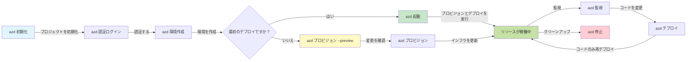
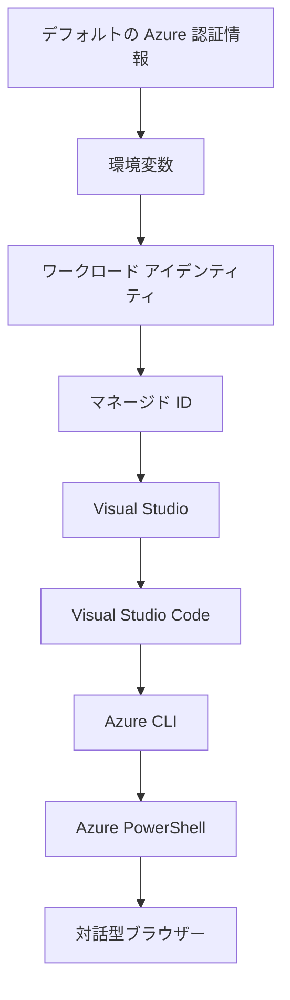

# AZD Basics - Azure Developer CLI の理解

# AZD Basics - コアコンセプトと基礎

**章のナビゲーション:**
- **📚 コースホーム**: [初心者向け AZD](../../README.md)
- **📖 現在の章**: 第1章 - 基礎とクイックスタート
- **⬅️ 前へ**: [コース概要](../../README.md#-chapter-1-foundation--quick-start)
- **➡️ 次へ**: [インストールとセットアップ](installation.md)
- **🚀 次の章**: [第2章: AIファースト開発](../chapter-02-ai-development/microsoft-foundry-integration.md)

## はじめに

このレッスンでは、Azure Developer CLI (azd) を紹介します。azd はローカル開発から Azure へのデプロイまでのプロセスを加速する強力なコマンドラインツールです。基本概念、コア機能を学び、azd がクラウドネイティブアプリケーションのデプロイをどのように簡素化するかを理解します。

## 学習目標

このレッスンの終了時には、次のことができるようになります:
- Azure Developer CLI が何であり、その主要な目的を理解する
- テンプレート、環境、サービスのコア概念を学ぶ
- テンプレート駆動開発や Infrastructure as Code（IaC）を含む主要機能を探る
- azd プロジェクト構造とワークフローを理解する
- 開発環境向けに azd をインストールおよび構成する準備をする

## 学習成果

このレッスンを修了すると、次のことができるようになります:
- 現代のクラウド開発ワークフローにおける azd の役割を説明する
- azd プロジェクト構造の構成要素を特定する
- テンプレート、環境、サービスがどのように連携するかを説明する
- azd を用いた Infrastructure as Code の利点を理解する
- さまざまな azd コマンドとその目的を認識する

## Azure Developer CLI (azd) とは？

Azure Developer CLI (azd) は、ローカル開発から Azure へのデプロイまでの旅を加速するために設計されたコマンドラインツールです。Azure 上でクラウドネイティブアプリケーションを構築、デプロイ、管理するプロセスを簡素化します。

### azd で何をデプロイできますか？

azd は幅広いワークロードをサポートしており、その範囲は拡大し続けています。今日、azd を使ってデプロイできるものは次のとおりです:

| ワークロードの種類 | 例 | 同じワークフロー？ |
|---------------|----------|----------------|
| <strong>従来型アプリケーション</strong> | Webアプリ、REST API、静的サイト | ✅ `azd up` |
| <strong>サービスとマイクロサービス</strong> | Container Apps、Function Apps、マルチサービスバックエンド | ✅ `azd up` |
| **AI対応アプリケーション** | Microsoft Foundry モデルを使ったチャットアプリ、AI Search を使った RAG ソリューション | ✅ `azd up` |
| <strong>インテリジェントエージェント</strong> | Foundry ホストのエージェント、マルチエージェントオーケストレーション | ✅ `azd up` |

重要なポイントは、<strong>何をデプロイするかにかかわらず azd のライフサイクルは同じままである</strong>ということです。プロジェクトを初期化し、インフラをプロビジョニングし、コードをデプロイし、アプリを監視し、クリーンアップします。単純なウェブサイトでも高度な AI エージェントでも同様です。

この継続性は設計によるものです。azd は AI 機能をアプリケーションが利用できる別種のサービスとして扱い、本質的に異なるものとは見なしていません。Microsoft Foundry モデルでバックエンドを持つチャットエンドポイントも、azd の観点では設定してデプロイする別のサービスに過ぎません。

### 🎯 なぜAZDを使うのか？実例で比較

データベース付きの簡単な Web アプリをデプロイする例で比較しましょう:

#### ❌ AZDなし：手動のAzureデプロイ（30分以上）

```bash
# ステップ 1: リソース グループを作成
az group create --name myapp-rg --location eastus

# ステップ 2: App Service プランを作成
az appservice plan create --name myapp-plan \
  --resource-group myapp-rg \
  --sku B1 --is-linux

# ステップ 3: Web アプリを作成
az webapp create --name myapp-web-unique123 \
  --resource-group myapp-rg \
  --plan myapp-plan \
  --runtime "NODE:18-lts"

# ステップ 4: Cosmos DB アカウントを作成 (10〜15分)
az cosmosdb create --name myapp-cosmos-unique123 \
  --resource-group myapp-rg \
  --kind MongoDB

# ステップ 5: データベースを作成
az cosmosdb mongodb database create \
  --account-name myapp-cosmos-unique123 \
  --resource-group myapp-rg \
  --name tododb

# ステップ 6: コレクションを作成
az cosmosdb mongodb collection create \
  --account-name myapp-cosmos-unique123 \
  --resource-group myapp-rg \
  --database-name tododb \
  --name todos

# ステップ 7: 接続文字列を取得
CONN_STR=$(az cosmosdb keys list \
  --name myapp-cosmos-unique123 \
  --resource-group myapp-rg \
  --type connection-strings \
  --query "connectionStrings[0].connectionString" -o tsv)

# ステップ 8: アプリ設定を構成
az webapp config appsettings set \
  --name myapp-web-unique123 \
  --resource-group myapp-rg \
  --settings MONGODB_URI="$CONN_STR"

# ステップ 9: ロギングを有効にする
az webapp log config --name myapp-web-unique123 \
  --resource-group myapp-rg \
  --application-logging filesystem \
  --detailed-error-messages true

# ステップ 10: Application Insights を設定
az monitor app-insights component create \
  --app myapp-insights \
  --location eastus \
  --resource-group myapp-rg

# ステップ 11: App Insights を Web アプリにリンクする
INSTRUMENTATION_KEY=$(az monitor app-insights component show \
  --app myapp-insights \
  --resource-group myapp-rg \
  --query "instrumentationKey" -o tsv)

az webapp config appsettings set \
  --name myapp-web-unique123 \
  --resource-group myapp-rg \
  --settings APPINSIGHTS_INSTRUMENTATIONKEY="$INSTRUMENTATION_KEY"

# ステップ 12: ローカルでアプリケーションをビルドする
npm install
npm run build

# ステップ 13: デプロイ用パッケージを作成する
zip -r app.zip . -x "*.git*" "node_modules/*"

# ステップ 14: アプリケーションをデプロイする
az webapp deployment source config-zip \
  --resource-group myapp-rg \
  --name myapp-web-unique123 \
  --src app.zip

# ステップ 15: 待って、うまくいくことを祈る 🙏
# (自動検証なし、手動テストが必要)
```

**問題点：**
- ❌ 覚えて順番に実行するコマンドが15以上ある
- ❌ 30〜45分の手作業
- ❌ ミスをしやすい（タイプミス、パラメーターの間違い）
- ❌ 接続文字列がターミナルの履歴に残る
- ❌ 障害発生時の自動ロールバックがない
- ❌ チームメンバーが再現しづらい
- ❌ 毎回異なる（再現性がない）

#### ✅ AZDあり：自動化されたデプロイ（5コマンド、10-15分）

```bash
# ステップ1: テンプレートから初期化
azd init --template todo-nodejs-mongo

# ステップ2: 認証
azd auth login

# ステップ3: 環境を作成
azd env new dev

# ステップ4: 変更をプレビュー（任意だが推奨）
azd provision --preview

# ステップ5: すべてをデプロイ
azd up

# ✨ 完了！すべてがデプロイされ、構成され、監視されています
```

**利点：**
- ✅ **5 コマンド** vs. 15以上の手動ステップ
- ✅ **10-15 分** の合計時間（主に Azure の待ち時間）
- ✅ <strong>エラーなし</strong> - 自動化され検証済み
- ✅ <strong>シークレットは安全に管理</strong> - Key Vault 経由
- ✅ <strong>障害時の自動ロールバック</strong>
- ✅ <strong>完全に再現可能</strong> - 毎回同じ結果
- ✅ <strong>チーム対応</strong> - 誰でも同じコマンドでデプロイ可能
- ✅ **Infrastructure as Code** - バージョン管理された Bicep テンプレート
- ✅ <strong>組み込みの監視</strong> - Application Insights が自動で設定される

### 📊 時間とエラーの削減

| 指標 | 手動デプロイ | AZD デプロイ | 改善 |
|:-------|:------------------|:---------------|:------------|
| <strong>コマンド数</strong> | 15+ | 5 | 67% 減少 |
| <strong>時間</strong> | 30-45 分 | 10-15 分 | 60% 短縮 |
| <strong>エラー率</strong> | 約40% | <5% | 88% 減少 |
| <strong>一貫性</strong> | 低い（手動） | 100%（自動） | 完璧 |
| <strong>チームの導入時間</strong> | 2-4 時間 | 30 分 | 75% 速い |
| <strong>ロールバック時間</strong> | 30分以上（手動） | 2 分（自動） | 93% 速い |

## コアコンセプト

### テンプレート
テンプレートは azd の基盤です。テンプレートには次が含まれます:
- <strong>アプリケーションコード</strong> - あなたのソースコードと依存関係
- <strong>インフラ定義</strong> - Bicep や Terraform で定義された Azure リソース
- <strong>構成ファイル</strong> - 設定と環境変数
- <strong>デプロイスクリプト</strong> - 自動化されたデプロイワークフロー

### 環境
環境は異なるデプロイ先を表します:
- **Development** - テストと開発用
- **Staging** - 本番前の環境
- **Production** - 本番環境

各環境は次を個別に保持します:
- Azure リソースグループ
- 構成設定
- デプロイ状態

### サービス
サービスはアプリケーションの構成要素です:
- **Frontend** - Web アプリケーション、SPA
- **Backend** - API、マイクロサービス
- **Database** - データストレージソリューション
- **Storage** - ファイルや Blob ストレージ

## 主な機能

### 1. テンプレート駆動開発
```bash
# 利用可能なテンプレートを参照する
azd template list

# テンプレートから初期化する
azd init --template <template-name>
```

### 2. インフラをコードとして管理
- **Bicep** - Azure のドメイン固有言語
- **Terraform** - マルチクラウドのインフラツール
- **ARM Templates** - Azure Resource Manager のテンプレート

### 3. 統合ワークフロー
```bash
# 完全なデプロイワークフロー
azd up            # プロビジョニング + デプロイ：初回セットアップは手動不要

# 🧪 新機能: デプロイ前にインフラの変更をプレビューする（安全）
azd provision --preview    # 変更を加えずにインフラのデプロイをシミュレートする

azd provision     # インフラを更新する際に Azure リソースを作成するにはこれを使用
azd deploy        # アプリケーションコードをデプロイする、または更新後に再デプロイする
azd down          # リソースをクリーンアップする
```

#### 🛡️ プレビューによる安全なインフラ計画
`azd provision --preview` コマンドは安全なデプロイのためのゲームチェンジャーです:
- <strong>ドライラン分析</strong> - 何が作成、変更、削除されるかを表示
- <strong>リスクゼロ</strong> - Azure 環境に実際の変更は行われない
- <strong>チーム協力</strong> - デプロイ前にプレビュー結果を共有
- <strong>コスト見積もり</strong> - コミット前にリソースコストを把握

```bash
# プレビューのサンプルワークフロー
azd provision --preview           # 何が変わるか確認する
# 出力を確認し、チームと議論する
azd provision                     # 自信を持って変更を適用する
```

### 📊 ビジュアル：AZD 開発ワークフロー


**ワークフローの説明：**
1. **Init** - テンプレートか新規プロジェクトで開始
2. **Auth** - Azure に認証する
3. **Environment** - 分離されたデプロイ環境を作成
4. **Preview** - 🆕 まずは常にインフラ変更をプレビュー（安全な手順）
5. **Provision** - Azure リソースを作成/更新
6. **Deploy** - アプリケーションコードをプッシュ
7. **Monitor** - アプリケーションのパフォーマンスを監視
8. **Iterate** - 変更を加えてコードを再デプロイ
9. **Cleanup** - 終了時にリソースを削除

### 4. 環境管理
```bash
# 環境を作成および管理する
azd env new <environment-name>
azd env select <environment-name>
azd env list
```

### 5. 拡張機能とAIコマンド

azd はコア CLI を超える機能を追加するために拡張機能システムを使用します。これは特に AI ワークロードで有用です:

```bash
# 利用可能な拡張機能を一覧表示
azd extension list

# Foundry Agents 拡張機能をインストールする
azd extension install azure.ai.agents

# マニフェストからAIエージェントのプロジェクトを初期化する
azd ai agent init -m agent-manifest.yaml

# AI支援開発のためのMCPサーバーを起動する (アルファ)
azd mcp start
```

> 拡張機能は [第2章: AIファースト開発](../chapter-02-ai-development/agents.md) と [AZD AI CLI コマンド](../chapter-08-production/production-ai-practices.md#azd-ai-cli-commands-and-extensions) のリファレンスで詳しく説明されています。

## 📁 プロジェクト構造

一般的な azd プロジェクト構造:
```
my-app/
├── .azd/                    # azd configuration
│   └── config.json
├── .azure/                  # Azure deployment artifacts
├── .devcontainer/          # Development container config
├── .github/workflows/      # GitHub Actions
├── .vscode/               # VS Code settings
├── infra/                 # Infrastructure code
│   ├── main.bicep        # Main infrastructure template
│   ├── main.parameters.json
│   └── modules/          # Reusable modules
├── src/                  # Application source code
│   ├── api/             # Backend services
│   └── web/             # Frontend application
├── azure.yaml           # azd project configuration
└── README.md
```

## 🔧 設定ファイル

### azure.yaml
メインのプロジェクト設定ファイル:
```yaml
name: my-awesome-app
metadata:
  template: my-template@1.0.0

services:
  web:
    project: ./src/web
    language: js
    host: appservice
  api:
    project: ./src/api
    language: js
    host: appservice

hooks:
  preprovision:
    shell: pwsh
    run: echo "Preparing to provision..."
```

### .azure/config.json
環境別の設定:
```json
{
  "version": 1,
  "defaultEnvironment": "dev",
  "environments": {
    "dev": {
      "subscriptionId": "your-subscription-id",
      "location": "eastus"
    }
  }
}
```

## 🎪 ハンズオン演習を伴う一般的なワークフロー

> **💡 学習のコツ:** これらの演習を順番に実行して AZD スキルを段階的に構築しましょう。

### 🎯 演習1：初めてのプロジェクトを初期化する

**ゴール:** AZD プロジェクトを作成し、その構造を調べる

**手順:**
```bash
# 実績のあるテンプレートを使用する
azd init --template todo-nodejs-mongo

# 生成されたファイルを確認する
ls -la  # 隠しファイルを含むすべてのファイルを表示する

# 作成される主なファイル:
# - azure.yaml (メイン設定)
# - infra/ (インフラストラクチャのコード)
# - src/ (アプリケーションのコード)
```

**✅ 成功:** azure.yaml、infra/、および src/ ディレクトリがある

---

### 🎯 演習2：Azureへデプロイする

**ゴール:** エンドツーエンドのデプロイを完了する

**手順:**
```bash
# 1. 認証する
az login && azd auth login

# 2. 環境を作成する
azd env new dev
azd env set AZURE_LOCATION eastus

# 3. 変更をプレビューする（推奨）
azd provision --preview

# 4. すべてをデプロイする
azd up

# 5. デプロイを検証する
azd show    # アプリのURLを表示する
```

**想定時間:** 10-15 分  
**✅ 成功:** ブラウザでアプリケーションのURLが開く

---

### 🎯 演習3：複数環境

**ゴール:** dev と staging にデプロイする

**手順:**
```bash
# devは既にあるので、stagingを作成する
azd env new staging
azd env set AZURE_LOCATION westus2
azd up

# それらの間を切り替える
azd env list
azd env select dev
```

**✅ 成功:** Azure ポータルに2つの別々のリソースグループがある

---

### 🛡️ クリーンスレート: `azd down --force --purge`

完全にリセットする必要があるとき:

```bash
azd down --force --purge
```

**実行内容：**
- `--force`: 確認プロンプトを表示しない
- `--purge`: ローカル状態と Azure リソースをすべて削除する

**使用する場合：**
- デプロイが途中で失敗したとき
- プロジェクトを切り替えるとき
- 新たに開始する必要があるとき

---

## 🎪 元のワークフロー参照

### 新しいプロジェクトの開始
```bash
# 方法1: 既存のテンプレートを使用する
azd init --template todo-nodejs-mongo

# 方法2: 一から始める
azd init

# 方法3: 現在のディレクトリを使用する
azd init .
```

### 開発サイクル
```bash
# 開発環境をセットアップする
azd auth login
azd env new dev
azd env select dev

# すべてをデプロイする
azd up

# 変更を加えて再デプロイする
azd deploy

# 終了時にクリーンアップする
azd down --force --purge # Azure Developer CLI のコマンドは、あなたの環境に対する**完全なリセット**です—特にデプロイに失敗した際のトラブルシューティング、孤立したリソースのクリーンアップ、あるいは再デプロイの準備をしているときに役立ちます。
```

## `azd down --force --purge` の理解
`azd down --force --purge` コマンドは、azd 環境と関連するすべてのリソースを完全に破棄する強力な方法です。各フラグが何をするかの内訳は次のとおりです:
```
--force
```
- 確認プロンプトをスキップします。
- 自動化やスクリプトで手動入力が現実的でない場合に有用です。
- CLI が不整合を検出しても、停止せずにテアダウンを続行することを保証します。

```
--purge
```
<strong>すべての関連メタデータ</strong>を削除します、以下を含む:
環境の状態
ローカルの `.azure` フォルダー
キャッシュされたデプロイ情報
azd が以前のデプロイを "remembering" しないようにし、これによりリソースグループの不一致や古いレジストリ参照のような問題を回避します。


### なぜ両方を使うのか？
`azd up` が残留状態や部分的なデプロイのために失敗する場合、この組み合わせは <strong>クリーンスレート</strong> を確保します。

これは、Azure ポータルで手動でリソースを削除した後や、テンプレート、環境、リソースグループ命名規則を変更したときに特に役立ちます。


### 複数環境の管理
```bash
# ステージング環境を作成する
azd env new staging
azd env select staging
azd up

# 開発環境に戻す
azd env select dev

# 環境を比較する
azd env list
```

## 🔐 認証と資格情報

認証の理解は azd のデプロイにおいて非常に重要です。Azure は複数の認証方法を使用しており、azd は他の Azure ツールと同じ資格情報チェーンを活用します。

### Azure CLI 認証 (`az login`)

azd を使用する前に Azure に認証する必要があります。最も一般的な方法は Azure CLI を使用することです:

```bash
# 対話型ログイン（ブラウザを開く）
az login

# 特定のテナントでログイン
az login --tenant <tenant-id>

# サービスプリンシパルでログイン
az login --service-principal -u <app-id> -p <password> --tenant <tenant-id>

# 現在のログイン状態を確認
az account show

# 利用可能なサブスクリプションを一覧表示
az account list --output table

# デフォルトのサブスクリプションを設定
az account set --subscription <subscription-id>
```

### 認証フロー
1. <strong>インタラクティブログイン</strong>: 認証のために既定のブラウザを開く
2. <strong>デバイスコードフロー</strong>: ブラウザアクセスがない環境向け
3. <strong>サービスプリンシパル</strong>: 自動化や CI/CD シナリオ向け
4. **マネージドID**: Azure ホストのアプリケーション向け

### DefaultAzureCredential チェーン

`DefaultAzureCredential` は、特定の順序で自動的に複数の資格情報ソースを試行することで簡素化された認証体験を提供する資格情報タイプです:

#### 資格情報チェーンの順序

#### 1. 環境変数
```bash
# サービスプリンシパルの環境変数を設定する
export AZURE_CLIENT_ID="<app-id>"
export AZURE_CLIENT_SECRET="<password>"
export AZURE_TENANT_ID="<tenant-id>"
```

#### 2. ワークロードアイデンティティ (Kubernetes/GitHub Actions)
自動的に使用されるケース:
- Workload Identity を使用した Azure Kubernetes Service (AKS)
- OIDC フェデレーションを使用した GitHub Actions
- その他のフェデレーションされたアイデンティティシナリオ

#### 3. マネージドID
次のような Azure リソース向け:
- Virtual Machines
- App Service
- Azure Functions
- Container Instances

```bash
# マネージド ID を使用している Azure リソース上で実行しているかを確認する
az account show --query "user.type" --output tsv
# 戻り値: マネージド ID を使用している場合は "servicePrincipal" を返す
```

#### 4. 開発者ツールとの統合
- **Visual Studio**: サインインされたアカウントを自動的に使用します
- **VS Code**: Azure Account 拡張機能の資格情報を使用します
- **Azure CLI**: `az login` の資格情報を使用します（ローカル開発で最も一般的）

### AZD 認証設定

```bash
# 方法1: Azure CLI を使用する（開発時に推奨）
az login
azd auth login  # 既存の Azure CLI 資格情報を使用します

# 方法2: azd による直接認証
azd auth login --use-device-code  # ヘッドレス環境向け

# 方法3: 認証状態を確認
azd auth login --check-status

# 方法4: ログアウトして再認証
azd auth logout
azd auth login
```

### 認証のベストプラクティス

#### ローカル開発向け
```bash
# 1. Azure CLIでログイン
az login

# 2. 正しいサブスクリプションを確認する
az account show
az account set --subscription "Your Subscription Name"

# 3. 既存の資格情報で azd を使用する
azd auth login
```

#### CI/CD パイプライン向け
```yaml
# GitHub Actions example
- name: Azure Login
  uses: azure/login@v1
  with:
    creds: ${{ secrets.AZURE_CREDENTIALS }}

- name: Deploy with azd
  run: |
    azd auth login --client-id ${{ secrets.AZURE_CLIENT_ID }} \
                    --client-secret ${{ secrets.AZURE_CLIENT_SECRET }} \
                    --tenant-id ${{ secrets.AZURE_TENANT_ID }}
    azd up --no-prompt
```

#### 本番環境向け
- Azure リソース上で実行する場合は **Managed Identity** を使用する
- 自動化シナリオでは **Service Principal** を使用する
- 資格情報をコードや構成ファイルに保存しない
- 機密設定には **Azure Key Vault** を使用する

### よくある認証問題と解決策

#### 問題: "サブスクリプションが見つかりません"
```bash
# 解決策: 既定のサブスクリプションを設定する
az account list --output table
az account set --subscription "<subscription-id>"
azd env set AZURE_SUBSCRIPTION_ID "<subscription-id>"
```

#### 問題: "権限が不十分"
```bash
# 解決策: 必要なロールを確認して割り当てる
az role assignment list --assignee $(az account show --query user.name --output tsv)

# 一般的に必要なロール:
# - Contributor（リソース管理用）
# - User Access Administrator（ロールの割り当て用）
```

#### 問題: "トークンの有効期限が切れています"
```bash
# 解決策: 再認証
az logout
az login
azd auth logout
azd auth login
```

### 異なるシナリオでの認証

#### ローカル開発
```bash
# 個人用開発アカウント
az login
azd auth login
```

#### チーム開発
```bash
# 組織のために特定のテナントを使用する
az login --tenant contoso.onmicrosoft.com
azd auth login
```

#### マルチテナントのシナリオ
```bash
# テナントを切り替える
az login --tenant tenant1.onmicrosoft.com
# テナント1にデプロイする
azd up

az login --tenant tenant2.onmicrosoft.com  
# テナント2にデプロイする
azd up
```

### セキュリティに関する考慮事項
1. **Credential Storage**: 認証情報をソースコードに絶対に保存しないこと
2. **Scope Limitation**: サービスプリンシパルには最小権限の原則を適用する
3. **Token Rotation**: サービスプリンシパルのシークレットを定期的にローテーションする
4. **Audit Trail**: 認証とデプロイの活動を監査・監視する
5. **Network Security**: 可能な場合はプライベートエンドポイントを使用する

### 認証のトラブルシューティング

```bash
# 認証の問題をデバッグする
azd auth login --check-status
az account show
az account get-access-token

# 一般的な診断コマンド
whoami                          # 現在のユーザーコンテキスト
az ad signed-in-user show      # Azure AD ユーザーの詳細
az group list                  # リソースへのアクセスをテストする
```

## `azd down --force --purge` の理解

### 検出
```bash
azd template list              # テンプレートを閲覧
azd template show <template>   # テンプレートの詳細
azd init --help               # 初期化オプション
```

### プロジェクト管理
```bash
azd show                     # プロジェクトの概要
azd env show                 # 現在の環境
azd config list             # 構成設定
```

### 監視
```bash
azd monitor                  # Azure ポータルのモニタリングを開く
azd monitor --logs           # アプリケーションのログを表示する
azd monitor --live           # ライブ メトリクスを表示する
azd pipeline config          # CI/CD を設定する
```

## ベストプラクティス

### 1. 意味のある名前を使う
```bash
# 良い
azd env new production-east
azd init --template web-app-secure

# 避ける
azd env new env1
azd init --template template1
```

### 2. テンプレートを活用する
- 既存のテンプレートから始める
- 要件に合わせてカスタマイズする
- 組織で再利用可能なテンプレートを作成する

### 3. 環境の分離
- dev/staging/prod のために環境を分ける
- ローカルマシンから直接本番にデプロイしない
- 本番デプロイには CI/CD パイプラインを使用する

### 4. 設定管理
- 機密データには環境変数を使用する
- 設定をバージョン管理する
- 環境固有の設定を文書化する

## 学習の進行

### 初心者（1〜2週目）
1. azd をインストールして認証する
2. シンプルなテンプレートをデプロイする
3. プロジェクト構成を理解する
4. 基本コマンドを学ぶ (up, down, deploy)

### 中級（3〜4週目）
1. テンプレートをカスタマイズする
2. 複数環境を管理する
3. インフラストラクチャコードを理解する
4. CI/CD パイプラインを設定する

### 上級（5週目以降）
1. カスタムテンプレートを作成する
2. 高度なインフラパターン
3. マルチリージョン展開
4. エンタープライズ向け構成

## 次のステップ

**📖 第1章の学習を続ける:**
- [インストールとセットアップ](installation.md) - azd をインストールして設定する
- [あなたの最初のプロジェクト](first-project.md) - ハンズオンチュートリアルを完了する
- [設定ガイド](configuration.md) - 詳細な設定オプション

**🎯 次の章の準備はできましたか？**
- [第2章: AI優先の開発](../chapter-02-ai-development/microsoft-foundry-integration.md) - AIアプリケーションの構築を開始する

## 追加リソース

- [Azure Developer CLI の概要](https://learn.microsoft.com/en-us/azure/developer/azure-developer-cli/)
- [テンプレートギャラリー](https://azure.github.io/awesome-azd/)
- [コミュニティサンプル](https://github.com/Azure-Samples)

---

## 🙋 よくある質問

### 一般的な質問

**Q: AZD と Azure CLI の違いは何ですか？**

A: Azure CLI (`az`) は個々の Azure リソースの管理用です。AZD (`azd`) はアプリケーション全体を管理するためのものです：

```bash
# Azure CLI - 低レベルのリソース管理
az webapp create --name myapp --resource-group rg
az sql server create --name myserver --resource-group rg
# ...さらに多くのコマンドが必要

# AZD - アプリケーションレベルの管理
azd up  # すべてのリソースを含むアプリ全体をデプロイする
```

**このように考えてください:**
- `az` = 個々のレゴブロックを操作するイメージ
- `azd` = 完成したレゴセットを使って作業するイメージ

---

**Q: AZD を使うために Bicep や Terraform を知っている必要がありますか？**

A: いいえ！ テンプレートから始めてください：
```bash
# 既存のテンプレートを使用 - IaC の知識は不要
azd init --template todo-nodejs-mongo
azd up
```

インフラをカスタマイズするために後で Bicep を学ぶことができます。テンプレートは学習用の動作する例を提供します。

---

**Q: AZD テンプレートを実行するのにどれくらい費用がかかりますか？**

A: コストはテンプレートによって異なります。ほとんどの開発用テンプレートは月額 $50-150 です：

```bash
# デプロイ前に概算費用を確認する
azd provision --preview

# 使用していないときは必ずクリーンアップする
azd down --force --purge  # すべてのリソースを削除する
```

**プロのヒント:** 利用可能な場合は無料枠を利用してください:
- App Service: F1 (Free) tier
- Microsoft Foundry Models: Azure OpenAI 50,000 tokens/month free
- Cosmos DB: 1000 RU/s free tier

---

**Q: 既存の Azure リソースと一緒に AZD を使えますか？**

A: はい、可能ですが、ゼロから始める方が簡単です。AZD はライフサイクル全体を管理する場合に最適に機能します。既存のリソースの場合：
```bash
# オプション 1: 既存のリソースをインポートする（上級者向け）
azd init
# その後、infra/ を修正して既存のリソースを参照する

# オプション 2: 新規に開始する（推奨）
azd init --template matching-your-stack
azd up  # 新しい環境を作成します
```

---

**Q: プロジェクトをチームメンバーと共有するにはどうすればよいですか？**

A: AZD プロジェクトを Git にコミットします（.azure フォルダはコミットしないでください）：
```bash
# デフォルトで既に .gitignore に含まれています
.azure/        # 機密情報と環境データを含みます
*.env          # 環境変数

# 当時のチームメンバー:
git clone <your-repo>
azd auth login
azd env new <their-name>-dev
azd up
```

同じテンプレートから全員が同一のインフラを得られます。

---

### トラブルシューティングの質問

**Q: 「azd up」が途中で失敗しました。どうすればいいですか？**

A: エラーを確認し、修正してから再試行してください：
```bash
# 詳細なログを表示
azd show

# 一般的な対処法:

# 1. クォータ超過の場合:
azd env set AZURE_LOCATION "westus2"  # 別のリージョンを試す

# 2. リソース名が競合している場合:
azd down --force --purge  # クリーンな状態にする
azd up  # 再試行

# 3. 認証が期限切れの場合:
az login
azd auth login
azd up
```

**最も一般的な問題:** 間違った Azure サブスクリプションが選択されている
```bash
az account list --output table
az account set --subscription "<correct-subscription>"
```

---

**Q: 再プロビジョニングせずにコード変更だけをデプロイするには？**

A: `azd up` の代わりに `azd deploy` を使用してください：
```bash
azd up          # 初回: プロビジョニング + デプロイ（遅い）

# コードを変更する...

azd deploy      # 以降: デプロイのみ（高速）
```

速度比較:
- `azd up`: 10-15 分 (インフラをプロビジョニング)
- `azd deploy`: 2-5 分 (コードのみ)

---

**Q: インフラテンプレートをカスタマイズできますか？**

A: はい！ `infra/` 内の Bicep ファイルを編集してください：
```bash
# azd init の後
cd infra/
code main.bicep  # VS Code で編集

# 変更をプレビュー
azd provision --preview

# 変更を適用
azd provision
```

**ヒント:** 小さく始めましょう - まずは SKUs を変更する:
```bicep
// infra/main.bicep
sku: {
  name: 'B1'  // Change to 'P1V2' for production
}
```

---

**Q: AZD が作成したすべてを削除するにはどうすればよいですか？**

A: 1 つのコマンドですべてのリソースを削除できます：
```bash
azd down --force --purge

# これにより次のものが削除されます:
# - すべての Azure リソース
# - リソース グループ
# - ローカル環境の状態
# - キャッシュされたデプロイメントデータ
```

**次の場合は必ず実行してください:**
- テンプレートのテストが完了したとき
- 別のプロジェクトに切り替えるとき
- 新たにやり直したいとき

**コスト削減:** 未使用のリソースを削除 = $0 の課金

---

**Q: Azure ポータルで誤ってリソースを削除した場合は？**

A: AZD の状態が同期しなくなることがあります。クリーンスタートのアプローチ：
```bash
# 1. ローカル状態を削除する
azd down --force --purge

# 2. 最初からやり直す
azd up

# 代替: AZDに検出して修正させる
azd provision  # 不足しているリソースを作成します
```

---

### 上級の質問

**Q: AZD を CI/CD パイプラインで使えますか？**

A: はい！ GitHub Actions の例：
```yaml
# .github/workflows/deploy.yml
name: Deploy with AZD

on:
  push:
    branches: [main]

jobs:
  deploy:
    runs-on: ubuntu-latest
    steps:
      - uses: actions/checkout@v2
      
      - name: Install azd
        run: curl -fsSL https://aka.ms/install-azd.sh | bash
      
      - name: Azure Login
        run: |
          azd auth login \
            --client-id ${{ secrets.AZURE_CLIENT_ID }} \
            --client-secret ${{ secrets.AZURE_CLIENT_SECRET }} \
            --tenant-id ${{ secrets.AZURE_TENANT_ID }}
      
      - name: Deploy
        run: azd up --no-prompt
```

---

**Q: シークレットや機密データはどう扱えばよいですか？**

A: AZD は自動的に Azure Key Vault と連携します：
```bash
# シークレットはコードではなく Key Vault に保存されます
azd env set DATABASE_PASSWORD "$(openssl rand -base64 32)"

# AZD は自動的に:
# 1. Key Vault を作成します
# 2. シークレットを保存します
# 3. マネージド ID を介してアプリにアクセス権を付与します
# 4. 実行時に注入します
```

**絶対にコミットしないでください:**
- `.azure/` フォルダ（環境データを含む）
- `.env` ファイル（ローカルシークレット）
- 接続文字列

---

**Q: 複数リージョンにデプロイできますか？**

A: はい、リージョンごとに環境を作成してください：
```bash
# 米国東部の環境
azd env new prod-eastus
azd env set AZURE_LOCATION eastus
azd up

# 西ヨーロッパの環境
azd env new prod-westeurope
azd env set AZURE_LOCATION westeurope
azd up

# 各環境は独立しています
azd env list
```

真のマルチリージョンアプリの場合は、Bicep テンプレートをカスタマイズして複数リージョンに同時デプロイしてください。

---

**Q: 行き詰まったときはどこで助けを得られますか？**

1. **AZD ドキュメント:** https://learn.microsoft.com/azure/developer/azure-developer-cli/
2. **GitHub Issues:** https://github.com/Azure/azure-dev/issues
3. **Discord:** [Azure Discord](https://discord.gg/microsoft-azure) - #azure-developer-cli チャンネル
4. **Stack Overflow:** タグ `azure-developer-cli`
5. **このコース:** [トラブルシューティングガイド](../chapter-07-troubleshooting/common-issues.md)

**プロのヒント:** 質問する前に、次を実行してください:
```bash
azd show       # 現在の状態を表示します
azd version    # あなたのバージョンを表示します
```
質問にこの情報を含めると、より速く助けが得られます。

---

## 🎓 次に進むべきこと

これで AZD の基本が理解できました。進む道を選んでください:

### 🎯 初心者向け:
1. **次:** [インストールとセットアップ](installation.md) - マシンに AZD をインストールする
2. **次に:** [あなたの最初のプロジェクト](first-project.md) - 最初のアプリをデプロイする
3. **練習:** このレッスンのすべての 3 つの演習を完了する

### 🚀 AI 開発者向け:
1. **スキップ:** [第2章: AI優先の開発](../chapter-02-ai-development/microsoft-foundry-integration.md)
2. **デプロイ:** `azd init --template get-started-with-ai-chat` で開始する
3. **学ぶ:** デプロイしながら構築する

### 🏗️ 経験豊富な開発者向け:
1. **レビュー:** [設定ガイド](configuration.md) - 詳細設定
2. **探索:** [Infrastructure as Code](../chapter-04-infrastructure/provisioning.md) - Bicep の詳細
3. **構築:** 自分のスタック用にカスタムテンプレートを作成する

---

**章のナビゲーション:**
- **📚 コースホーム**: [AZD 初心者向け](../../README.md)
- **📖 Current Chapter**: 第1章 - 基礎とクイックスタート  
- **⬅️ Previous**: [コース概要](../../README.md#-chapter-1-foundation--quick-start)
- **➡️ Next**: [インストールとセットアップ](installation.md)
- **🚀 Next Chapter**: [第2章: AI優先の開発](../chapter-02-ai-development/microsoft-foundry-integration.md)

---

<!-- CO-OP TRANSLATOR DISCLAIMER START -->
**免責事項**:
本書類は AI 翻訳サービス [Co-op Translator](https://github.com/Azure/co-op-translator) を使用して翻訳されています。正確性の確保に努めていますが、自動翻訳には誤りや不正確な表現が含まれる可能性があることをご承知おきください。重要な情報については、専門の人間による翻訳を推奨します。原文（原言語版）を正式な出典とみなしてください。本翻訳の使用に起因するいかなる誤解や誤訳についても、当社は責任を負いません。
<!-- CO-OP TRANSLATOR DISCLAIMER END -->