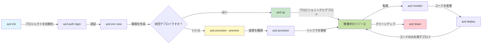
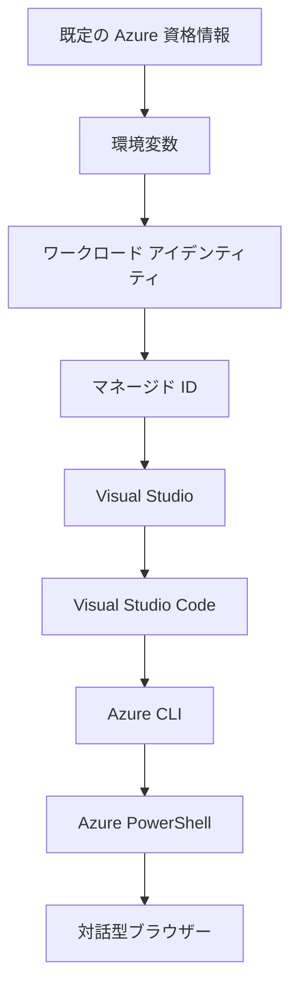

# AZD Basics - Azure Developer CLIの理解

# AZD Basics - コアコンセプトと基本事項

**章のナビゲーション:**
- **📚 コースホーム**: [AZD For Beginners](../../README.md)
- **📖 現在の章**: 第1章 - 基礎とクイックスタート
- **⬅️ 前へ**: [コース概要](../../README.md#-chapter-1-foundation--quick-start)
- **➡️ 次へ**: [インストールとセットアップ](installation.md)
- **🚀 次の章**: [第2章: AIファースト開発](../chapter-02-ai-development/microsoft-foundry-integration.md)

## はじめに

このレッスンでは、Azure Developer CLI（azd）を紹介します。これは、ローカル開発からAzureへの展開までの過程を加速させる強力なコマンドラインツールです。基本的な概念や主要な機能を学び、azdがクラウドネイティブなアプリケーションの展開をどのように簡素化するか理解します。

## 学習目標

このレッスンを終えると、あなたは以下ができるようになります：
- Azure Developer CLIとは何か、その主な目的を理解する
- テンプレート、環境、サービスの基本概念を学ぶ
- テンプレート駆動開発やInfrastructure as Codeなどの主要機能を探る
- azdプロジェクトの構造とワークフローを理解する
- 開発環境でazdをインストールし設定する準備をする

## 学習成果

このレッスンを修了後、以下を説明・実行できるようになります：
- 現代のクラウド開発ワークフローにおけるazdの役割を説明する
- azdプロジェクトの構成要素を識別する
- テンプレート、環境、サービスがどのように連携するかを説明する
- azdを使ったInfrastructure as Codeの利点を理解する
- 異なるazdコマンドとその目的を認識する

## Azure Developer CLI（azd）とは？

Azure Developer CLI（azd）は、ローカル開発からAzure配備までの過程を加速させるために設計されたコマンドラインツールです。Azure上でクラウドネイティブなアプリケーションを構築、展開、管理するプロセスを簡素化します。

### azdで何を展開できるか？

azdは幅広いワークロードをサポートしており、対応範囲は増え続けています。現在、azdを使用して展開可能な例：

| ワークロードタイプ | 例 | 同じワークフロー？ |
|---------------|----------|----------------|
| <strong>従来のアプリケーション</strong> | ウェブアプリ、REST API、静的サイト | ✅ `azd up` |
| <strong>サービスとマイクロサービス</strong> | コンテナアプリ、ファンクションアプリ、多サービスバックエンド | ✅ `azd up` |
| **AIを活用したアプリケーション** | Microsoft Foundryモデルを使ったチャットアプリ、AI検索を用いたRAGソリューション | ✅ `azd up` |
| <strong>インテリジェントエージェント</strong> | Foundryホスト型エージェント、マルチエージェントオーケストレーション | ✅ `azd up` |

重要なポイントは、<strong>展開するものにかかわらずazdのライフサイクルは同じ</strong>ということです。プロジェクトを初期化し、インフラをプロビジョニングし、コードを展開し、アプリを監視し、クリーンアップします。単純なウェブサイトでも高度なAIエージェントでも同じです。

この連続性は設計によるものです。azdはAI機能を、アプリケーションが使う他のサービスの一種として扱い、本質的に異なるものとはみなしていません。Microsoft Foundryモデルで支えられたチャットエンドポイントも、azdの観点では単なる他のサービスの一つです。

### 🎯 なぜAZDを使うのか？　実例比較

単純なウェブアプリとデータベースの展開を比較してみましょう：

#### ❌ AZDなし：手動Azure展開（30分以上）

```bash
# ステップ 1: リソース グループを作成
az group create --name myapp-rg --location eastus

# ステップ 2: App Service プランを作成
az appservice plan create --name myapp-plan \
  --resource-group myapp-rg \
  --sku B1 --is-linux

# ステップ 3: Web アプリを作成
az webapp create --name myapp-web-unique123 \
  --resource-group myapp-rg \
  --plan myapp-plan \
  --runtime "NODE:18-lts"

# ステップ 4: Cosmos DB アカウントを作成（10〜15分）
az cosmosdb create --name myapp-cosmos-unique123 \
  --resource-group myapp-rg \
  --kind MongoDB

# ステップ 5: データベースを作成
az cosmosdb mongodb database create \
  --account-name myapp-cosmos-unique123 \
  --resource-group myapp-rg \
  --name tododb

# ステップ 6: コレクションを作成
az cosmosdb mongodb collection create \
  --account-name myapp-cosmos-unique123 \
  --resource-group myapp-rg \
  --database-name tododb \
  --name todos

# ステップ 7: 接続文字列を取得
CONN_STR=$(az cosmosdb keys list \
  --name myapp-cosmos-unique123 \
  --resource-group myapp-rg \
  --type connection-strings \
  --query "connectionStrings[0].connectionString" -o tsv)

# ステップ 8: アプリの設定を構成
az webapp config appsettings set \
  --name myapp-web-unique123 \
  --resource-group myapp-rg \
  --settings MONGODB_URI="$CONN_STR"

# ステップ 9: ログを有効にする
az webapp log config --name myapp-web-unique123 \
  --resource-group myapp-rg \
  --application-logging filesystem \
  --detailed-error-messages true

# ステップ 10: Application Insights をセットアップする
az monitor app-insights component create \
  --app myapp-insights \
  --location eastus \
  --resource-group myapp-rg

# ステップ 11: App Insights を Web アプリにリンクする
INSTRUMENTATION_KEY=$(az monitor app-insights component show \
  --app myapp-insights \
  --resource-group myapp-rg \
  --query "instrumentationKey" -o tsv)

az webapp config appsettings set \
  --name myapp-web-unique123 \
  --resource-group myapp-rg \
  --settings APPINSIGHTS_INSTRUMENTATIONKEY="$INSTRUMENTATION_KEY"

# ステップ 12: ローカルでアプリケーションをビルドする
npm install
npm run build

# ステップ 13: デプロイ パッケージを作成する
zip -r app.zip . -x "*.git*" "node_modules/*"

# ステップ 14: アプリケーションをデプロイする
az webapp deployment source config-zip \
  --resource-group myapp-rg \
  --name myapp-web-unique123 \
  --src app.zip

# ステップ 15: 待って、うまくいくよう祈る 🙏
# (自動検証なし、手動テストが必要)
```

**問題点:**
- ❌ 15以上のコマンドを覚えて順番に実行する必要がある
- ❌ 30〜45分の手動作業が必要
- ❌ ミスが起きやすい（タイプミス、パラメーター誤り）
- ❌ ターミナル履歴に接続文字列が露出
- ❌ 失敗時の自動ロールバックがない
- ❌ チームメンバーには再現が難しい
- ❌ 毎回異なる（再現性なし）

#### ✅ AZDを使用：自動展開（5コマンド、10〜15分）

```bash
# ステップ1: テンプレートから初期化
azd init --template todo-nodejs-mongo

# ステップ2: 認証する
azd auth login

# ステップ3: 環境を作成する
azd env new dev

# ステップ4: 変更をプレビューする（任意だが推奨）
azd provision --preview

# ステップ5: すべてをデプロイする
azd up

# ✨ 完了！すべてがデプロイされ、設定され、監視されています
```

**利点:**
- ✅ 手動の15以上と比べて<strong>5コマンド</strong>
- ✅ 合計時間は<strong>10〜15分</strong>（主にAzureの待機時間）
- ✅ <strong>手動ミスが少なく</strong>、一貫したテンプレート駆動ワークフロー
- ✅ <strong>安全なシークレット管理</strong> - 多くのテンプレートがAzure管理の秘密情報ストレージを使用
- ✅ <strong>繰り返し可能な展開</strong> - 毎回同じワークフロー
- ✅ <strong>完全再現可能</strong> - 毎回同じ結果
- ✅ <strong>チーム対応済み</strong> - 誰でも同じコマンドで展開可能
- ✅ **Infrastructure as Code** - バージョン管理されたBicepテンプレート
- ✅ <strong>組み込みモニタリング</strong> - Application Insightsが自動設定

### 📊 時間とエラーの削減

| 指標 | 手動展開 | AZD展開 | 改善度 |
|:-------|:------------------|:---------------|:------------|
| <strong>コマンド数</strong> | 15以上 | 5 | 67%削減 |
| <strong>時間</strong> | 30〜45分 | 10〜15分 | 60%高速化 |
| <strong>エラー率</strong> | 約40% | 5%未満 | 88%減少 |
| <strong>一貫性</strong> | 低い（手動） | 100%（自動） | 完璧 |
| <strong>チームオンボーディング</strong> | 2〜4時間 | 30分 | 75%高速化 |
| <strong>ロールバック時間</strong> | 30分以上（手動） | 2分（自動） | 93%高速化 |

## コアコンセプト

### テンプレート
テンプレートはazdの基礎です。以下を含みます：
- <strong>アプリケーションコード</strong> - ソースコードと依存関係
- <strong>インフラ定義</strong> - BicepやTerraformで定義したAzureリソース
- <strong>設定ファイル</strong> - 設定や環境変数
- <strong>展開スクリプト</strong> - 自動展開ワークフロー

### 環境
環境は異なる展開先を表します：
- <strong>開発</strong> - テストと開発用
- <strong>ステージング</strong> - 本番前環境
- <strong>本番</strong> - ライブ本番環境

各環境はそれぞれの：
- Azureリソースグループ
- 設定
- 展開状態

を保持します。

### サービス
サービスはアプリケーションの構成要素です：
- <strong>フロントエンド</strong> - ウェブアプリ、SPA
- <strong>バックエンド</strong> - API、マイクロサービス
- <strong>データベース</strong> - データストレージ
- <strong>ストレージ</strong> - ファイルやBLOBストレージ

## 主要機能

### 1. テンプレート駆動開発
```bash
# 利用可能なテンプレートを参照
azd template list

# テンプレートから初期化する
azd init --template <template-name>
```

### 2. Infrastructure as Code
- **Bicep** - Azureのドメイン固有言語
- **Terraform** - マルチクラウド対応のインフラツール
- **ARMテンプレート** - Azure Resource Managerテンプレート

### 3. 統合ワークフロー
```bash
# 完全なデプロイワークフロー
azd up            # プロビジョニング＋デプロイ：初回セットアップは自動で行えます

# 🧪 新機能: デプロイ前にインフラの変更をプレビュー（安全）
azd provision --preview    # 変更を加えずにインフラのデプロイをシミュレートする

azd provision     # インフラを更新する場合は、Azureリソースを作成するためにこれを使用する
azd deploy        # アプリケーションコードをデプロイ、または更新後に再デプロイする
azd down          # リソースをクリーンアップする
```

#### 🛡️ プレビューによる安全なインフラ計画
`azd provision --preview`コマンドは安全な展開のための革新的な機能です：
- <strong>ドライラン分析</strong> - 作成、変更、削除されるものを表示
- <strong>リスクゼロ</strong> - 実際のAzure環境には変更なし
- <strong>チーム協力</strong> - 展開前にプレビュー結果を共有可能
- <strong>コスト見積もり</strong> - コストを把握してからコミット可能

```bash
# プレビュー用のサンプルワークフロー
azd provision --preview           # 何が変更されるかを確認する
# 出力を確認し、チームと議論する
azd provision                     # 自信を持って変更を適用する
```

### 📊 ビジュアル：AZD開発ワークフロー


**ワークフローの説明:**
1. **Init** - テンプレートや新規プロジェクトで開始
2. **Auth** - Azure認証
3. **Environment** - 独立した展開環境を作成
4. **Preview** - 🆕 最初に常にインフラ変更をプレビュー（安全策）
5. **Provision** - Azureリソースを作成/更新
6. **Deploy** - アプリケーションコードをプッシュ
7. **Monitor** - アプリのパフォーマンス監視
8. **Iterate** - 変更を加えて再展開
9. **Cleanup** - 作業終了後リソース削除

### 4. 環境管理
```bash
# 環境を作成および管理する
azd env new <environment-name>
azd env select <environment-name>
azd env list
```

### 5. 拡張機能とAIコマンド

azdはコアCLIを超えた機能追加のために拡張機能システムを利用しています。これは特にAIワークロードで便利です：

```bash
# 利用可能な拡張機能を一覧表示する
azd extension list

# Foundry agents 拡張機能をインストールする
azd extension install azure.ai.agents

# マニフェストからAIエージェントプロジェクトを初期化する
azd ai agent init -m agent-manifest.yaml

# AI支援開発のためのMCPサーバーを起動する（アルファ）
azd mcp start
```

> 拡張機能は[第2章: AIファースト開発](../chapter-02-ai-development/agents.md)および[AZD AI CLIコマンド](../chapter-08-production/production-ai-practices.md#azd-ai-cli-commands-and-extensions)リファレンスで詳述されています。

## 📁 プロジェクト構造

典型的なazdプロジェクト構造：
```
my-app/
├── .azd/                    # azd configuration
│   └── config.json
├── .azure/                  # Azure deployment artifacts
├── .devcontainer/          # Development container config
├── .github/workflows/      # GitHub Actions
├── .vscode/               # VS Code settings
├── infra/                 # Infrastructure code
│   ├── main.bicep        # Main infrastructure template
│   ├── main.parameters.json
│   └── modules/          # Reusable modules
├── src/                  # Application source code
│   ├── api/             # Backend services
│   └── web/             # Frontend application
├── azure.yaml           # azd project configuration
└── README.md
```

## 🔧 設定ファイル

### azure.yaml
主要なプロジェクト設定ファイル：
```yaml
name: my-awesome-app
metadata:
  template: my-template@1.0.0

services:
  web:
    project: ./src/web
    language: js
    host: appservice
  api:
    project: ./src/api
    language: js
    host: appservice

hooks:
  preprovision:
    shell: pwsh
    run: echo "Preparing to provision..."
```

### .azure/config.json
環境固有の設定：
```json
{
  "version": 1,
  "defaultEnvironment": "dev",
  "environments": {
    "dev": {
      "subscriptionId": "your-subscription-id",
      "location": "eastus"
    }
  }
}
```

## 🎪 よく使うワークフローとハンズオン演習

> **💡 学習のコツ:** 以下の演習を順番に行うことでAZDスキルを段階的に伸ばせます。

### 🎯 演習1: 最初のプロジェクトを初期化する

**目標:** AZDプロジェクトを作成し構造を探る

**手順:**
```bash
# 実績のあるテンプレートを使用する
azd init --template todo-nodejs-mongo

# 生成されたファイルを確認する
ls -la  # 隠しファイルを含むすべてのファイルを表示する

# 作成された主要なファイル:
# - azure.yaml（メイン設定）
# - infra/（インフラストラクチャのコード）
# - src/（アプリケーションコード）
```

**✅ 成功:** azure.yaml、infra/、src/ディレクトリができている

---

### 🎯 演習2: Azureに展開する

**目標:** エンドツーエンドの展開を完了する

**手順:**
```bash
# 1. 認証
az login && azd auth login

# 2. 環境を作成
azd env new dev
azd env set AZURE_LOCATION eastus

# 3. 変更をプレビュー（推奨）
azd provision --preview

# 4. すべてをデプロイ
azd up

# 5. デプロイを検証
azd show    # アプリのURLを表示
```

**目安時間:** 10〜15分  
**✅ 成功:** ブラウザでアプリケーションURLが開く

---

### 🎯 演習3: 複数環境への展開

**目標:** devとstaging環境に展開する

**手順:**
```bash
# 既に dev があるので、staging を作成する
azd env new staging
azd env set AZURE_LOCATION westus2
azd up

# それらの間を切り替える
azd env list
azd env select dev
```

**✅ 成功:** Azureポータルに2つの別々のリソースグループがある

---

### 🛡️ クリーンスレート: `azd down --force --purge`

完全にリセットしたい場合：

```bash
azd down --force --purge
```

**動作内容:**
- `--force`: 確認プロンプトなし
- `--purge`: すべてのローカル状態とAzureリソースを削除

**使用タイミング:**
- 展開途中で失敗した場合
- プロジェクトを切り替えるとき
- 新規開始が必要なとき

---

## 🎪 元々のワークフロー参照

### 新規プロジェクトの開始
```bash
# 方法 1: 既存のテンプレートを使用する
azd init --template todo-nodejs-mongo

# 方法 2: 一から始める
azd init

# 方法 3: 現在のディレクトリを使用する
azd init .
```

### 開発サイクル
```bash
# 開発環境を設定する
azd auth login
azd env new dev
azd env select dev

# すべてをデプロイする
azd up

# 変更を加えて再デプロイする
azd deploy

# 作業が終わったらクリーンアップする
azd down --force --purge # Azure Developer CLI のコマンドは、環境を完全にリセットするもので、特にデプロイ失敗のトラブルシューティング、孤立したリソースのクリーンアップ、または再デプロイの準備をする際に便利です。
```

## `azd down --force --purge`の理解
`azd down --force --purge`コマンドはazd環境および関連リソースを完全に破棄する強力な手段です。フラグごとの説明：

```
--force
```
- 確認プロンプトをスキップ。
- 手動入力が不可能な自動化やスクリプトに便利。
- CLIが不整合を検知しても中断なく解除処理を実行。

```
--purge
```
は関連する全てのメタデータを削除します：
環境状態
ローカルの `.azure` フォルダ
キャッシュされた展開情報
これによりazdが過去展開を「覚えている」ことで起きるリソースグループ不整合や古いレジストリ参照の問題を防ぎます。

### なぜ両方使うのか？
`azd up`で状態が残留したり、部分展開で行き詰まった場合に、この組み合わせで<strong>完全なクリーンスレート</strong>を実現します。

Azureポータルでの手動リソース削除やテンプレート、環境、リソースグループ名称の変更後に特に役立ちます。

### 複数環境の管理
```bash
# ステージング環境を作成する
azd env new staging
azd env select staging
azd up

# dev に戻す
azd env select dev

# 環境を比較する
azd env list
```

## 🔐 認証と資格情報

認証の理解はazd展開成功の鍵です。Azureは複数の認証方法を持ち、azdは他Azureツールと同様の認証チェーンを活用します。

### Azure CLI認証（`az login`）

azd使用前にAzure認証が必要です。最も一般的な方法はAzure CLIを使うことです：

```bash
# 対話型ログイン（ブラウザを開きます）
az login

# 特定のテナントでログイン
az login --tenant <tenant-id>

# サービスプリンシパルでログイン
az login --service-principal -u <app-id> -p <password> --tenant <tenant-id>

# 現在のログイン状態を確認
az account show

# 利用可能なサブスクリプションを一覧表示
az account list --output table

# デフォルトのサブスクリプションを設定
az account set --subscription <subscription-id>
```

### 認証フロー
1. <strong>インタラクティブログイン</strong>: デフォルトブラウザを開く
2. <strong>デバイスコードフロー</strong>: ブラウザアクセス不可環境用
3. <strong>サービスプリンシパル</strong>: 自動化・CI/CD用
4. <strong>マネージドアイデンティティ</strong>: Azureホストアプリ用

### DefaultAzureCredential チェーン

`DefaultAzureCredential`は、特定の順で複数の資格情報ソースを自動的に試す単純化された認証方式です：

#### 認証チェーンの順序

#### 1. 環境変数
```bash
# サービスプリンシパル用の環境変数を設定する
export AZURE_CLIENT_ID="<app-id>"
export AZURE_CLIENT_SECRET="<password>"
export AZURE_TENANT_ID="<tenant-id>"
```

#### 2. ワークロードアイデンティティ（Kubernetes/GitHub Actions）
自動利用されるケース：
- Azure Kubernetes Service (AKS) のWorkload Identity
- GitHub ActionsのOIDCフェデレーション
- その他フェデレーションIDシナリオ

#### 3. マネージドアイデンティティ
Azureリソース向け：
- 仮想マシン
- App Service
- Azure Functions
- コンテナインスタンス

```bash
# マネージド ID を持つ Azure リソース上で実行されているか確認する
az account show --query "user.type" --output tsv
# 戻り値: マネージド ID を使用している場合は "servicePrincipal"
```

#### 4. 開発者ツール統合
- **Visual Studio**: サインイン済みアカウントを自動使用
- **VS Code**: Azure Account拡張の資格情報を利用
- **Azure CLI**: `az login`資格情報を使用（ローカル開発で一般的）

### AZD認証設定

```bash
# 方法1: Azure CLI を使用する（開発向けに推奨）
az login
azd auth login  # 既存の Azure CLI 資格情報を使用する

# 方法2: azd による直接認証
azd auth login --use-device-code  # ヘッドレス環境向け

# 方法3: 認証ステータスを確認する
azd auth login --check-status

# 方法4: ログアウトして再認証する
azd auth logout
azd auth login
```

### 認証のベストプラクティス

#### ローカル開発の場合
```bash
# 1. Azure CLIでログイン
az login

# 2. 正しいサブスクリプションを確認する
az account show
az account set --subscription "Your Subscription Name"

# 3. 既存の資格情報で azd を使用する
azd auth login
```

#### CI/CDパイプラインの場合
```yaml
# GitHub Actions example
- name: Azure Login
  uses: azure/login@v1
  with:
    creds: ${{ secrets.AZURE_CREDENTIALS }}

- name: Deploy with azd
  run: |
    azd auth login --client-id ${{ secrets.AZURE_CLIENT_ID }} \
                    --client-secret ${{ secrets.AZURE_CLIENT_SECRET }} \
                    --tenant-id ${{ secrets.AZURE_TENANT_ID }}
    azd up --no-prompt
```

#### 本番環境の場合
- Azureリソースでの実行時は<strong>マネージドアイデンティティ</strong>を使う
- 自動化には<strong>サービスプリンシパル</strong>を使用
- コードや設定ファイルに資格情報を保存しない
- 機密設定は<strong>Azure Key Vault</strong>で管理

### よくある認証の問題と解決策

#### 問題: "サブスクリプションが見つからない"
```bash
# 解決策: デフォルトのサブスクリプションを設定する
az account list --output table
az account set --subscription "<subscription-id>"
azd env set AZURE_SUBSCRIPTION_ID "<subscription-id>"
```

#### 問題: "権限不足"
```bash
# 解決策: 必要な役割を確認して割り当てる
az role assignment list --assignee $(az account show --query user.name --output tsv)

# 一般的に必要な役割:
# - Contributor（リソース管理用）
# - User Access Administrator（役割の割り当て用）
```

#### 問題: "トークン期限切れ"
```bash
# 解決策: 再認証する
az logout
az login
azd auth logout
azd auth login
```

### 様々なシナリオの認証

#### ローカル開発
```bash
# 自己啓発アカウント
az login
azd auth login
```

#### チーム開発
```bash
# 組織に対して特定のテナントを使用する
az login --tenant contoso.onmicrosoft.com
azd auth login
```

#### マルチテナントシナリオ
```bash
# テナント間を切り替える
az login --tenant tenant1.onmicrosoft.com
# テナント1にデプロイする
azd up

az login --tenant tenant2.onmicrosoft.com  
# テナント2にデプロイする
azd up
```

### セキュリティ考慮事項
1. <strong>資格情報の保存</strong>: 資格情報をソースコードに保存しないこと  
2. <strong>スコープの制限</strong>: サービスプリンシパルには最小権限の原則を適用すること  
3. <strong>トークンのローテーション</strong>: サービスプリンシパルのシークレットは定期的にローテーションすること  
4. <strong>監査証跡</strong>: 認証およびデプロイ活動の監視を行うこと  
5. <strong>ネットワークセキュリティ</strong>: 可能な限りプライベートエンドポイントを使用すること  

### 認証のトラブルシューティング

```bash
# 認証の問題をデバッグする
azd auth login --check-status
az account show
az account get-access-token

# 一般的な診断コマンド
whoami                          # 現在のユーザーコンテキスト
az ad signed-in-user show      # Azure AD ユーザーの詳細
az group list                  # リソースへのアクセスをテストする
```

## `azd down --force --purge` の理解

### 発見
```bash
azd template list              # テンプレートを閲覧
azd template show <template>   # テンプレートの詳細
azd init --help               # 初期化オプション
```

### プロジェクト管理
```bash
azd show                     # プロジェクトの概要
azd env list                # 利用可能な環境と選択されたデフォルト
azd config show            # 構成設定
```

### 監視
```bash
azd monitor                  # Azure ポータルの監視を開く
azd monitor --logs           # アプリケーションのログを表示する
azd monitor --live           # ライブメトリクスを表示する
azd pipeline config          # CI/CD を設定する
```

## ベストプラクティス

### 1. 意味のある名前を使う
```bash
# 良い
azd env new production-east
azd init --template web-app-secure

# 避ける
azd env new env1
azd init --template template1
```

### 2. テンプレートを活用する
- 既存のテンプレートから始める
- 自分のニーズに合わせてカスタマイズする
- 組織のために再利用可能なテンプレートを作成する

### 3. 環境の分離
- 開発/ステージング/本番で別々の環境を使う
- ローカルマシンから直接本番にデプロイしない
- 本番デプロイはCI/CDパイプラインを使う

### 4. 構成管理
- 機密情報は環境変数で管理する
- 構成はバージョン管理する
- 環境ごとの設定をドキュメント化する

## 学習の進め方

### 初級者（1〜2週目）
1. azdをインストールして認証する  
2. シンプルなテンプレートをデプロイする  
3. プロジェクト構造を理解する  
4. 基本コマンド（up, down, deploy）を学ぶ  

### 中級者（3〜4週目）
1. テンプレートをカスタマイズする  
2. 複数環境を管理する  
3. インフラコードの理解を深める  
4. CI/CDパイプラインをセットアップする  

### 上級者（5週目以降）
1. カスタムテンプレートを作成する  
2. 高度なインフラパターンを扱う  
3. マルチリージョンデプロイを行う  
4. エンタープライズグレードの設定を実装する  

## 次のステップ

**📖 1章の学習を続ける:**
- [インストールとセットアップ](installation.md) - azdをインストールして設定する  
- [はじめてのプロジェクト](first-project.md) - ハンズオンチュートリアルを完了する  
- [構成ガイド](configuration.md) - 高度な構成オプション  

**🎯 次の章に進む準備はできましたか？**
- [第2章: AIファースト開発](../chapter-02-ai-development/microsoft-foundry-integration.md) - AIアプリケーションを構築する  

## 追加リソース

- [Azure Developer CLI 概要](https://learn.microsoft.com/en-us/azure/developer/azure-developer-cli/)  
- [テンプレートギャラリー](https://azure.github.io/awesome-azd/)  
- [コミュニティサンプル](https://github.com/Azure-Samples)  

---

## 🙋 よくある質問

### 一般的な質問

**Q: AZD と Azure CLI の違いは何ですか？**

A: Azure CLI (`az`) は個々のAzureリソース管理用。AZD (`azd`) はアプリケーション全体の管理用です:

```bash
# Azure CLI - 低レベルのリソース管理
az webapp create --name myapp --resource-group rg
az sql server create --name myserver --resource-group rg
# ...さらに多くのコマンドが必要

# AZD - アプリケーションレベルの管理
azd up  # アプリ全体をすべてのリソースとともにデプロイする
```
  
**こう考えてください:**  
- `az` = レゴのブロック単体を操作する感じ  
- `azd` = 完成したレゴセット全体を扱う感じ  

---

**Q: AZDを使うのにBicepやTerraformの知識は必要ですか？**

A: いいえ！まずはテンプレートから始めてください:  
```bash
# 既存のテンプレートを使用 - IaCの知識は不要
azd init --template todo-nodejs-mongo
azd up
```
  
後からBicepを学んでインフラをカスタマイズできます。テンプレートは動く例を提供してくれます。  

---

**Q: AZDテンプレートの実行コストはどのくらいですか？**

A: テンプレートによって異なりますが、多くの開発用テンプレートは月額50〜150ドル程度です:  

```bash
# デプロイ前にコストを確認する
azd provision --preview

# 使用していないときは必ずクリーンアップする
azd down --force --purge  # すべてのリソースを削除する
```
  
**プロのヒント:** 利用可能な無料枠を活用しましょう：  
- App Service: F1（無料）プラン  
- Microsoft Foundryモデル: Azure OpenAI 月50,000トークン無料  
- Cosmos DB: 1000 RU/s 無料プラン  

---

**Q: 既存のAzureリソースとAZDは併用できますか？**

A: はい、可能ですが最初は新規作成から始めるほうが簡単です。AZDはライフサイクル全体を管理することで最適に機能します。既存リソースの場合は:  

```bash
# オプション 1: 既存のリソースをインポートする（上級者向け）
azd init
# その後 infra/ を修正して既存のリソースを参照する

# オプション 2: 新規に始める（推奨）
azd init --template matching-your-stack
azd up  # 新しい環境を作成する
```
  
---

**Q: プロジェクトをチームメイトと共有するには？**

A: AZDプロジェクトをGitにコミットします（ただし `.azure` フォルダは除く）:  

```bash
# 既定で既に .gitignore に含まれています
.azure/        # 機密情報や環境データを含む
*.env          # 環境変数

# 当時のチームメンバー:
git clone <your-repo>
azd auth login
azd env new <their-name>-dev
azd up
```
  
同じテンプレートから誰でも同じインフラを得られます。  

---

### トラブルシューティングの質問

**Q: "azd up" が途中で失敗しました。どうすれば？**

A: エラーを確認して修正し、再試行してください:  

```bash
# 詳細なログを表示
azd show

# 一般的な修正:

# 1. 割り当てを超えた場合:
azd env set AZURE_LOCATION "westus2"  # 別のリージョンを試す

# 2. リソース名が競合している場合:
azd down --force --purge  # 状態をリセットする
azd up  # 再試行する

# 3. 認証が期限切れの場合:
az login
azd auth login
azd up
```
  
**最もよくある問題:** 間違ったAzureサブスクリプションを選択している  
```bash
az account list --output table
az account set --subscription "<correct-subscription>"
```
  
---

**Q: 再プロビジョニングせずにコードだけデプロイするには？**

A: `azd deploy` を使います:  

```bash
azd up          # 初回: プロビジョニング + デプロイ（遅い）

# コードを変更する...

azd deploy      # 以降: デプロイのみ（高速）
```
  
速度比較:  
- `azd up`: 10〜15分（インフラをプロビジョニング）  
- `azd deploy`: 2〜5分（コードのみ）  

---

**Q: インフラテンプレートをカスタマイズできますか？**

A: できます！`infra/` フォルダ内のBicepファイルを編集してください:  

```bash
# azd init の後
cd infra/
code main.bicep  # VS Code で編集

# 変更をプレビュー
azd provision --preview

# 変更を適用
azd provision
```
  
**ヒント:** まずは小さく始め、SKUを変えてみましょう:  
```bicep
// infra/main.bicep
sku: {
  name: 'B1'  // Change to 'P1V2' for production
}
```
  
---

**Q: AZDで作成したものを全部削除するには？**

A: コマンドひとつで全リソースを削除できます:  

```bash
azd down --force --purge

# これにより次の項目が削除されます:
# - すべての Azure リソース
# - リソース グループ
# - ローカル環境の状態
# - キャッシュされたデプロイメント データ
```
  
**必ず実行すべきタイミング:**  
- テンプレートのテストが終わったとき  
- 別プロジェクトに切り替えるとき  
- 再度ゼロから始めたいとき  

**コスト削減:** 未使用リソース削除は料金ゼロに  

---

**Q: Azureポータルで誤ってリソースを削除した場合は？**

A: AZDの状態が同期しなくなることがあります。その場合はクリーンスレートで:  

```bash
# 1. ローカル状態を削除する
azd down --force --purge

# 2. 新しく始める
azd up

# 代替案: AZD に検出と修正を任せる
azd provision  # 不足しているリソースを作成します
```
  
---

### 高度な質問

**Q: CI/CDパイプラインでAZDを使えますか？**

A: はい！GitHub Actionsの例はこちら:  

```yaml
# .github/workflows/deploy.yml
name: Deploy with AZD

on:
  push:
    branches: [main]

jobs:
  deploy:
    runs-on: ubuntu-latest
    steps:
      - uses: actions/checkout@v2
      
      - name: Install azd
        run: curl -fsSL https://aka.ms/install-azd.sh | bash
      
      - name: Azure Login
        run: |
          azd auth login \
            --client-id ${{ secrets.AZURE_CLIENT_ID }} \
            --client-secret ${{ secrets.AZURE_CLIENT_SECRET }} \
            --tenant-id ${{ secrets.AZURE_TENANT_ID }}
      
      - name: Deploy
        run: azd up --no-prompt
```
  
---

**Q: シークレットや機密情報はどう扱えば？**

A: AZDは自動でAzure Key Vaultと統合します:  

```bash
# シークレットはコードではなく Key Vault に格納されます
azd env set DATABASE_PASSWORD "$(openssl rand -base64 32)"

# AZD は自動的に:
# 1. Key Vault を作成します
# 2. シークレットを格納します
# 3. マネージド ID 経由でアプリにアクセス権を付与します
# 4. 実行時に注入します
```
  
**絶対にコミットしないもの:**  
- `.azure/` フォルダ（環境の状態データ）  
- `.env` ファイル（ローカルシークレット）  
- 接続文字列  

---

**Q: 複数リージョンにデプロイできますか？**

A: できます。リージョンごとに環境を作成します:  

```bash
# 米国東部の環境
azd env new prod-eastus
azd env set AZURE_LOCATION eastus
azd up

# 西ヨーロッパの環境
azd env new prod-westeurope
azd env set AZURE_LOCATION westeurope
azd up

# 各環境は独立しています
azd env list
```
  
真のマルチリージョン対応アプリは、Bicepテンプレートをカスタマイズして複数リージョン同時にデプロイ可能にします。  

---

**Q: 問題が起きたときどこで助けを得られますか？**

1. **AZDドキュメント:** https://learn.microsoft.com/azure/developer/azure-developer-cli/  
2. **GitHub Issues:** https://github.com/Azure/azure-dev/issues  
3. **Discord:** [Azure Discord](https://discord.gg/microsoft-azure) - #azure-developer-cli チャンネル  
4. **Stack Overflow:** タグ `azure-developer-cli`  
5. **本コース:** [トラブルシューティングガイド](../chapter-07-troubleshooting/common-issues.md)  

**プロのヒント:** 質問前にこれを実行:  
```bash
azd show       # 現在の状態を表示します
azd version    # 現在のバージョンを表示します
```
  
質問にこの情報を含めると、より速く回答が得られます。  

---

## 🎓 次は？

AZDの基礎は理解できました。次の道を選びましょう：

### 🎯 初心者向け：
1. **次に:** [インストールとセットアップ](installation.md) - AZDをマシンにインストール  
2. **その後:** [はじめてのプロジェクト](first-project.md) - 最初のアプリをデプロイ  
3. **練習:** このレッスンの3つの演習を全て完了  

### 🚀 AI開発者向け：
1. **スキップして:** [第2章: AIファースト開発](../chapter-02-ai-development/microsoft-foundry-integration.md)  
2. **デプロイ:** `azd init --template get-started-with-ai-chat` から開始  
3. **学習:** デプロイしながら構築  

### 🏗️ 経験豊富な開発者向け：
1. **見直し:** [構成ガイド](configuration.md) - 高度な設定  
2. **探求:** [インフラコード](../chapter-04-infrastructure/provisioning.md) - Bicepの深掘り  
3. **構築:** スタック用のカスタムテンプレートを作成  

---

**章ナビゲーション:**  
- **📚 コースホーム**: [AZD入門](../../README.md)  
- **📖 現在の章**: 第1章 - 基礎とクイックスタート  
- **⬅️ 前へ**: [コース概要](../../README.md#-chapter-1-foundation--quick-start)  
- **➡️ 次へ**: [インストールとセットアップ](installation.md)  
- **🚀 次の章**: [第2章: AIファースト開発](../chapter-02-ai-development/microsoft-foundry-integration.md)

---

<!-- CO-OP TRANSLATOR DISCLAIMER START -->
**免責事項**:  
本書類は AI 翻訳サービス [Co-op Translator](https://github.com/Azure/co-op-translator) を使用して翻訳されています。正確性を期しておりますが、自動翻訳には誤りや不正確な部分が含まれる可能性があることをご理解ください。原文はその言語における権威ある資料とみなされるべきです。重要な情報については、専門の人間による翻訳を推奨します。本翻訳の利用により生じたいかなる誤解や誤訳についても、当方は責任を負いかねます。
<!-- CO-OP TRANSLATOR DISCLAIMER END -->