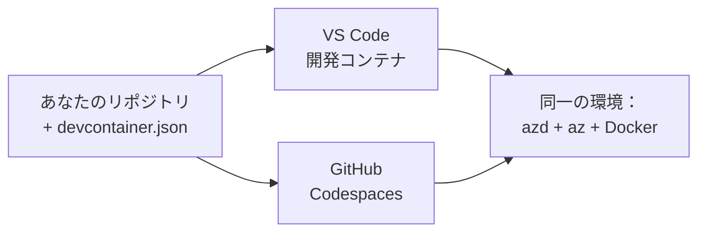

# azd 向け Dev Containers と GitHub Codespaces

**Chapter Navigation:**
- **📚 Course Home**: [AZD 入門](../../README.md)
- **📖 Current Chapter**: 第1章 - 基礎とクイックスタート
- **⬅️ Previous**: [自分のアプリを持ち込む](bring-your-own-app.md)
- **🚀 Next Chapter**: [第2章: AIファースト開発](../chapter-02-ai-development/README.md)

> 2026年6月に `azd 1.25.6` で検証済み。

## はじめに

azd、適切な言語ランタイム、Docker、および Azure CLI を各マシンにインストールするのは手間であり、チュートリアルが「自分の環境では動く」のに他人の環境で動かない一番の理由です。**dev container** はツールチェーン全体をファイルで記述することでこれを解決します。プロジェクトを VS Code や GitHub Codespaces で開く誰もが、azd が既にインストールされた全く同じ環境を得られます。このレッスンでは、その追加方法を示します。

## 学習目標

このレッスンの終了時までに、あなたは以下を行えるようになります:
- dev container が何であり、azd にどう役立つかを理解する
- プロジェクトに最小限の `.devcontainer/devcontainer.json` を追加する
- Dev Container *features* を使って azd、Azure CLI、Docker を含める
- プロジェクトを GitHub Codespaces または VS Code で開く

## 学習成果

このレッスンを完了すると、次のことができるようになります:
- azd プロジェクト用の `devcontainer.json` を作成する
- 手動インストールなしで azd と Azure ツール群を追加する
- コンテナ内または Codespace 内から `azd up` を実行する

---

## Dev コンテナとは何か?

Dev コンテナは、リポジトリ内の `.devcontainer/devcontainer.json` ファイルで定義される Docker ベースの開発環境です。プロジェクトを開くと:

- **VS Code**（Dev Containers 拡張機能を使用）はコンテナをビルドしてアタッチします。
- **GitHub Codespaces** はクラウドで同じコンテナをビルドし、ブラウザベースのエディタを提供します。

どちらの場合でも、すべての貢献者が同一のツールを得られるため、「azd をインストールしましたか？」のようなトラブルシューティングは不要になります。



---

## ステップ1: devcontainer ファイルを作成する

プロジェクトのルートに `.devcontainer/devcontainer.json` を作成します:

```json
{
  "name": "azd-project",
  "image": "mcr.microsoft.com/devcontainers/base:bookworm",
  "features": {
    "ghcr.io/devcontainers/features/azure-cli:1": {},
    "ghcr.io/azure/azure-dev/azd:latest": {},
    "ghcr.io/devcontainers/features/docker-in-docker:2": {},
    "ghcr.io/devcontainers/features/node:1": {}
  },
  "customizations": {
    "vscode": {
      "extensions": [
        "ms-azuretools.azure-dev",
        "ms-azuretools.vscode-bicep"
      ]
    }
  },
  "forwardPorts": [3000],
  "postCreateCommand": "azd version"
}
```

What each part does:

| キー | 目的 |
|-----|---------|
| `image` | コンテナのベース OS |
| `features` | 事前構築されたインストーラ—ここでは Azure CLI、**azd**、Docker、および Node.js |
| `customizations.vscode.extensions` | azd と Bicep の VS Code 拡張機能を自動インストールします |
| `forwardPorts` | アプリのポートをブラウザに公開します |
| `postCreateCommand` | コンテナ作成後に一度実行されます（ここでは動作確認） |

> `ghcr.io/azure/azure-dev/azd:latest` 機能はコンテナ内で azd を入手する公式の方法です。再現性が必要な場合は特定のバージョン（例：`azd:1.25.6`）を固定してください。

---

## ステップ2: アプリの言語に機能を合わせる

`node` の機能をアプリが使用するものに置き換えてください:

```jsonc
// Python project
"ghcr.io/devcontainers/features/python:1": {},

// .NET project
"ghcr.io/devcontainers/features/dotnet:2": {},

// Java project
"ghcr.io/devcontainers/features/java:1": {},

// Go project
"ghcr.io/devcontainers/features/go:1": {}
```

`host` が `containerapp`、`aks`、またはコンテナイメージをビルドする何かであれば、`docker-in-docker` を保持してください—azd はイメージのビルドとプッシュに Docker を必要とします。

---

## ステップ3: 開く

**VS Code で:**
1. **Dev Containers** 拡張機能をインストールします。
2. プロジェクトフォルダを開きます。
3. プロンプトが表示されたら **Reopen in Container** をクリックします（または *Dev Containers: Reopen in Container* を実行）。

**GitHub Codespaces で:**
1. リポジトリを GitHub にプッシュします。
2. **Code → Codespaces → Create codespace on main** をクリックします。
3. コンテナのビルドが完了するまで待ちます—ターミナルで azd が利用可能になります。

---

## ステップ4: コンテナ内からデプロイする

コンテナには azd が事前インストールされているため、通常のワークフローがそのまま動作します:

```bash
azd auth login --use-device-code   # Codespaces内ではデバイスコードが便利です
azd up
```

> **なぜ `--use-device-code` を使うのか？** リモートコンテナや Codespace にはリダイレクトできるローカルブラウザがないため、device-code ログインが確実な方法です。サインインを完了するために、ブラウザのタブにコードを貼り付けます。

---

## よくある落とし穴

| 問題 | 対処 |
|---------|-----|
| `azd up` がイメージをビルドできない | `docker-in-docker` 機能を追加する |
| Codespaces でブラウザログインがハングする | `azd auth login --use-device-code` を使用する |
| チームメンバー間でツールが異なる | 機能のバージョンを固定する（例：`azd:1.25.6`） |
| アプリにブラウザからアクセスできない | `forwardPorts` にポートを追加する |

---

## まとめ

- dev コンテナは azd のツールチェーンを誰でも再現可能にします。
- Dev Container の *features* を通じて azd、Azure CLI、Docker を追加します。
- 言語に対応する機能をアプリに合わせ、コンテナホストの場合は `docker-in-docker` を維持してください。
- Codespaces 内で実行する際は device-code ログインを使用してください。

---

## 🔗 ナビゲーション

| 方向 | リソース |
|-----------|----------|
| <strong>前の章</strong> | [自分のアプリを持ち込む](bring-your-own-app.md) |
| <strong>章のホーム</strong> | [第1章 - 基礎とクイックスタート](README.md) |
| <strong>次の章</strong> | [第2章: AIファースト開発](../chapter-02-ai-development/README.md) |

## 📖 関連リソース

- [インストールとセットアップ](installation.md)
- [コマンド チートシート](../../resources/cheat-sheet.md)
- [公式 Dev Containers 仕様](https://containers.dev/)
- [azd の Dev Container 機能](https://github.com/Azure/azure-dev/tree/main/ext/devcontainer)

---

<!-- CO-OP TRANSLATOR DISCLAIMER START -->
**免責事項**：
本書類は AI 翻訳サービス [Co-op Translator](https://github.com/Azure/co-op-translator) を使用して翻訳されています。正確性を期していますが、自動翻訳には誤りや不正確な部分が含まれる可能性があることをご承知おきください。原文の原語版が正式な情報源とみなされるべきです。重要な情報については、専門の人間による翻訳を推奨します。本翻訳の利用により生じたいかなる誤解や解釈違いについても、当方は責任を負いかねます。
<!-- CO-OP TRANSLATOR DISCLAIMER END -->