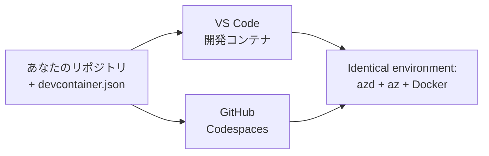

# azd の Dev Containers と GitHub Codespaces

**章のナビゲーション：**
- **📚 コースホーム**: [AZD For Beginners](../../README.md)
- **📖 現在の章**: 第1章 - 基礎とクイックスタート
- **⬅️ 前へ**: [Bring Your Own App](bring-your-own-app.md)
- **🚀 次の章**: [第2章：AIファースト開発](../chapter-02-ai-development/README.md)

> 2026年7月、`azd 1.27.1`で検証済み。

## はじめに

azd、適切な言語ランタイム、Docker、Azure CLI をすべてのマシンにインストールするのは手間であり、「自分のマシンでは動くのに他の人で動かない」というチュートリアルが失敗する最大の理由です。**dev container** は、この問題をリポジトリ内のファイルでツールチェーン全体を定義することで解決します。VS CodeやGitHub Codespacesでプロジェクトを開く人は誰でも、azdがすでにインストールされた全く同じ環境を得られます。このレッスンでは、それを追加する方法をお見せします。

## 学習目標

このレッスンの終わりには、
- dev containerとは何か、azdのためにどのように役立つか理解する
- プロジェクトに最小限の `.devcontainer/devcontainer.json` を追加する
- Dev Container *features* を使って azd、Azure CLI、Docker を含める
- GitHub CodespacesやVS Codeでプロジェクトを開く

## 学習到達点

レッスン修了後には、
- azd プロジェクト用の `devcontainer.json` を作成できる
- 手動でインストールせずに azd と Azure ツールを追加できる
- コンテナやCodespace内から `azd up` を実行できる

---

## Dev Containerとは？

Dev containerとは、リポジトリの `.devcontainer/devcontainer.json` ファイルで定義する Docker ベースの開発環境のことです。プロジェクトを開くと：

- **VS Code**（Dev Containers拡張機能あり）がコンテナをビルドしてアタッチします。
- **GitHub Codespaces** が同じコンテナをクラウド上でビルドし、ブラウザベースのエディターを提供します。

どちらの場合も、全参加者がまったく同じツールを使い、"azdをインストールした？" といったトラブルシューティングが不要になります。



---

## ステップ1: devcontainer ファイルを作成する

プロジェクトのルートに `.devcontainer/devcontainer.json` を作成します：

```json
{
  "name": "azd-project",
  "image": "mcr.microsoft.com/devcontainers/base:bookworm",
  "features": {
    "ghcr.io/devcontainers/features/azure-cli:1": {},
    "ghcr.io/azure/azure-dev/azd:latest": {},
    "ghcr.io/devcontainers/features/docker-in-docker:2": {},
    "ghcr.io/devcontainers/features/node:1": {}
  },
  "customizations": {
    "vscode": {
      "extensions": [
        "ms-azuretools.azure-dev",
        "ms-azuretools.vscode-bicep"
      ]
    }
  },
  "forwardPorts": [3000],
  "postCreateCommand": "azd version"
}
```

各部分の役割：

| キー | 役割 |
|-----|---------|
| `image` | コンテナのベースOS |
| `features` | 事前構築済みインストーラー—ここではAzure CLI、**azd**、Docker、Node.js |
| `customizations.vscode.extensions` | azd と Bicep の VS Code 拡張機能自動インストール |
| `forwardPorts` | アプリのポートをブラウザに公開 |
| `postCreateCommand` | コンテナがビルドされた後に一度だけ実行されるコマンド（ここでは簡単な動作確認） |

> `ghcr.io/azure/azure-dev/azd:latest` featureはコンテナ内でazdを入手する公式な方法です。再現性が必要な場合は特定のバージョン（例：`azd:1.27.1`）で固定してください。

---

## ステップ2: アプリの言語に合わせてFeatureを変更

アプリの言語に合わせて `node` feature を置き換えます：

```jsonc
// Python project
"ghcr.io/devcontainers/features/python:1": {},

// .NET project
"ghcr.io/devcontainers/features/dotnet:2": {},

// Java project
"ghcr.io/devcontainers/features/java:1": {},

// Go project
"ghcr.io/devcontainers/features/go:1": {}
```

`host` が `containerapp`、`aks`、あるいはコンテナイメージをビルドするものの場合は `docker-in-docker` を残します—azdはイメージのビルド・プッシュにDockerが必要です。

---

## ステップ3: 開く

**VS Codeで：**
1. **Dev Containers** 拡張機能をインストールします。
2. プロジェクトフォルダーを開きます。
3. プロンプトが出たら **Reopen in Container** をクリックするか、 *Dev Containers: Reopen in Container* を実行します。

**GitHub Codespacesで：**
1. リポジトリをGitHubにプッシュします。
2. **Code → Codespaces → Create codespace on main** をクリックします。
3. コンテナのビルドが完了するまで待ちます — ターミナルにazdが準備されています。

---

## ステップ4: コンテナ内からデプロイする

このコンテナにはazdがプリインストールされているため、通常のワークフローがそのまま使えます：

```bash
azd auth login --use-device-code   # Codespaces内でデバイスコードは便利です
azd up
```

> **なぜ `--use-device-code`？** リモートコンテナやCodespaceではローカルブラウザがなくリダイレクトできないため、device-codeログインが確実な方法です。ブラウザのタブにコードを貼り付けてサインインを完了します。

---

## よくある落とし穴

| 落とし穴 | 解決策 |
|---------|-----|
| `azd up` がイメージをビルドできない | `docker-in-docker` feature を追加する |
| Codespacesでブラウザログインが固まる | `azd auth login --use-device-code` を使う |
| チームメンバー間でツールが異なる | featureのバージョンを固定する（例：`azd:1.27.1`） |
| ブラウザでアプリにアクセスできない | 使用するポートを `forwardPorts` に追加する |

---

## まとめ

- dev containerはあなたのazdツールチェーンを誰にとっても再現可能にします。
- Dev Container *features* を使って azd、Azure CLI、Docker を追加します。
- アプリの言語featureに合わせ、コンテナホストの場合は `docker-in-docker` を維持します。
- Codespaces内で動かすときは device-code ログインを使います。

---

## 🔗 ナビゲーション

| 方向 | リソース |
|-----------|----------|
| <strong>前へ</strong> | [Bring Your Own App](bring-your-own-app.md) |
| <strong>章ホーム</strong> | [第1章: 基礎とクイックスタート](README.md) |
| <strong>次章</strong> | [第2章：AIファースト開発](../chapter-02-ai-development/README.md) |

## 📖 関連資料

- [インストールとセットアップ](installation.md)
- [コマンドチートシート](../../resources/cheat-sheet.md)
- [公式 Dev Containers 仕様](https://containers.dev/)
- [azd Dev Container feature](https://github.com/Azure/azure-dev/tree/main/ext/devcontainer)

---

<!-- CO-OP TRANSLATOR DISCLAIMER START -->
**免責事項**：
本書類は AI 翻訳サービス [Co-op Translator](https://github.com/Azure/co-op-translator) を使用して翻訳されています。正確性を期していますが、自動翻訳には誤りや不正確な部分が含まれる可能性があることをご承知おきください。原文の原語版が正式な情報源とみなされるべきです。重要な情報については、専門の人間による翻訳を推奨します。本翻訳の利用により生じたいかなる誤解や解釈違いについても、当方は責任を負いかねます。
<!-- CO-OP TRANSLATOR DISCLAIMER END -->