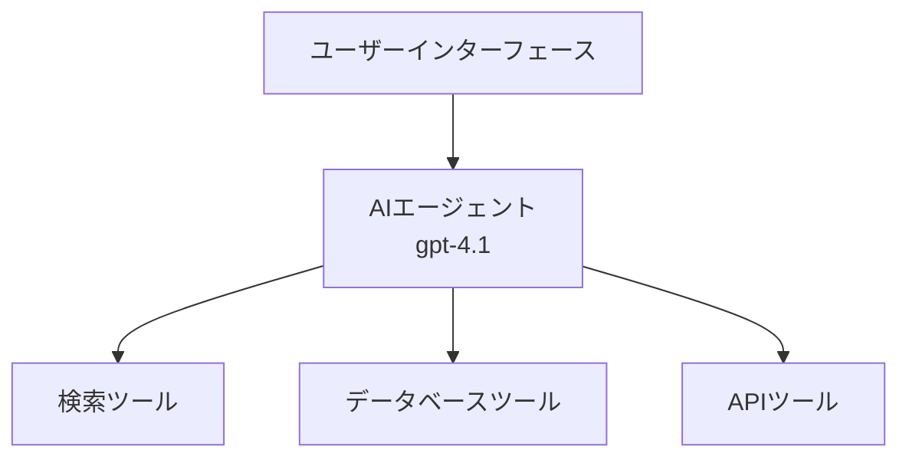
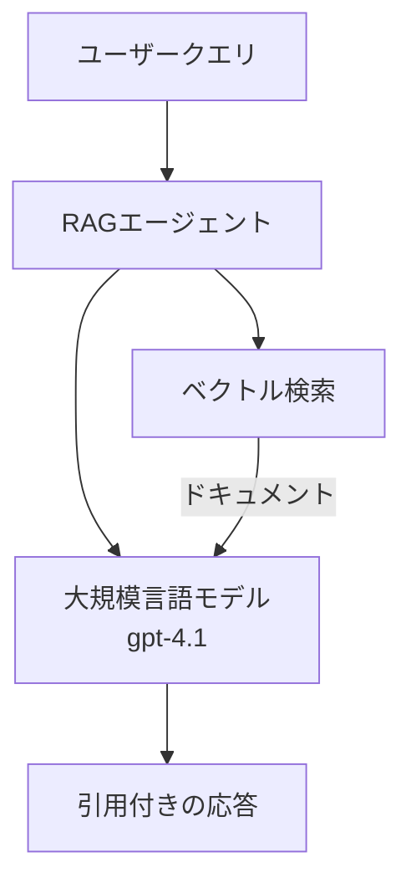
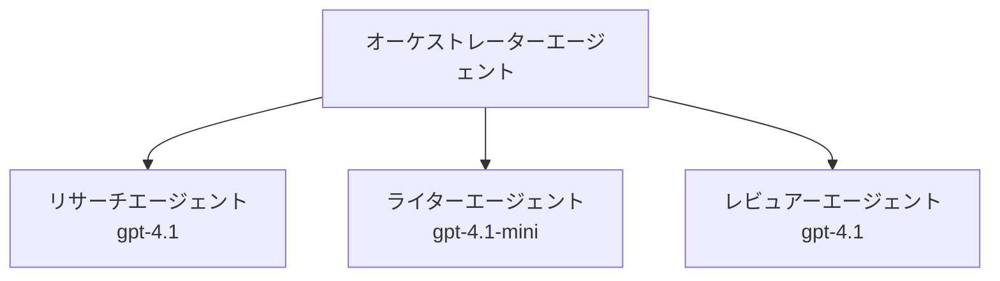

# Azure Developer CLI を使った AI エージェント

**章のナビゲーション:**
- **📚 コースホーム**: [AZD 入門](../../README.md)
- **📖 現在の章**: 第2章 - AIファースト開発
- **⬅️ 前へ**: [Microsoft Foundry 統合](microsoft-foundry-integration.md)
- **➡️ 次へ**: [AI モデルのデプロイ](ai-model-deployment.md)
- **🚀 上級**: [マルチエージェント ソリューション](../../examples/retail-scenario.md)

---

## はじめに

AI エージェントは、自分の環境を認識し、意思決定を行い、特定の目標を達成するために行動を起こせる自律的なプログラムです。プロンプトに応答するだけのシンプルなチャットボットとは異なり、エージェントは以下のことができます:

- **Use tools** - API を呼び出す、データベースを検索する、コードを実行する
- **Plan and reason** - 複雑なタスクをステップに分解する
- **Learn from context** - コンテキストから学び、記憶を保持して挙動を適応する
- **Collaborate** - 他のエージェントと協力する（マルチエージェントシステム）

このガイドでは、Azure Developer CLI (azd) を使用して AI エージェントを Azure にデプロイする方法を示します。

> **Validation note (2026-03-25):** このガイドは `azd` `1.23.12` と `azure.ai.agents` `0.1.18-preview` に対してレビューされました。`azd ai` の体験はまだプレビュー主導のため、インストールされているフラグが異なる場合は拡張機能のヘルプを確認してください。

## 学習目標

このガイドを完了すると、次のことができるようになります：
- AI エージェントとは何か、チャットボットとどのように異なるかを理解する
- AZD を使って事前構築済みの AI エージェント テンプレートをデプロイする
- カスタムエージェント用に Foundry Agents を構成する
- 基本的なエージェントパターン（ツール利用、RAG、マルチエージェント）を実装する
- デプロイされたエージェントを監視およびデバッグする

## 学習成果

完了後、次のことができるようになります：
- 単一コマンドで AI エージェントアプリケーションを Azure にデプロイする
- エージェントのツールと能力を構成する
- エージェントでの検索強化生成（RAG）を実装する
- 複雑なワークフロー向けにマルチエージェントアーキテクチャを設計する
- 一般的なエージェントデプロイの問題をトラブルシューティングする

---

## 🤖 エージェントはチャットボットと何が違うのか？

| 特徴 | チャットボット | AI エージェント |
|---------|---------|----------|
| <strong>動作</strong> | プロンプトに応答する | 自律的な行動をとる |
| <strong>ツール</strong> | なし | API 呼び出し、検索、コード実行が可能 |
| **記憶（メモリ）** | セッションベースのみ | セッションを超えて持続する記憶 |
| <strong>計画</strong> | 単一の応答 | マルチステップ推論 |
| <strong>協力</strong> | 単一エンティティ | 他のエージェントと協力可能 |

### シンプルな例え

- "**Chatbot**" = 案内デスクで質問に答える親切な人
- "**AI Agent**" = 電話をかけたり、予約を行ったり、タスクを代行するパーソナルアシスタント

---

## 🚀 クイックスタート: 最初のエージェントをデプロイする

### オプション 1: Foundry Agents テンプレート（推奨）

```bash
# AIエージェントのテンプレートを初期化する
azd init --template get-started-with-ai-agents

# Azureにデプロイする
azd up
```

**デプロイされるもの:**
- ✅ Foundry Agents
- ✅ Microsoft Foundry Models (gpt-4.1)
- ✅ Azure AI Search (RAG 用)
- ✅ Azure Container Apps (web interface)
- ✅ Application Insights (monitoring)

**時間:** ~15-20分
**コスト:** 約$100-150/月（開発環境）

### オプション 2: Prompty を使った OpenAI エージェント

```bash
# Promptyベースのエージェントテンプレートを初期化する
azd init --template agent-openai-python-prompty

# Azure にデプロイする
azd up
```

**デプロイされるもの:**
- ✅ Azure Functions（サーバーレスでのエージェント実行）
- ✅ Microsoft Foundry Models
- ✅ Prompty の構成ファイル
- ✅ サンプルのエージェント実装

**時間:** ~10-15分
**コスト:** 約$50-100/月（開発環境）

### オプション 3: RAG チャットエージェント

```bash
# RAGチャットテンプレートを初期化する
azd init --template azure-search-openai-demo

# Azureにデプロイする
azd up
```

**デプロイされるもの:**
- ✅ Microsoft Foundry Models
- ✅ Azure AI Search with sample data
- ✅ ドキュメント処理パイプライン
- ✅ 引用付きチャットインターフェイス

**時間:** ~15-25分
**コスト:** 約$80-150/月（開発環境）

### オプション 4: AZD AI Agent Init（マニフェストまたはテンプレートベースのプレビュー）

エージェントのマニフェストファイルがある場合、`azd ai` コマンドを使用して Foundry Agent Service プロジェクトを直接スキャフォールドできます。最近のプレビュ―リリースではテンプレートベースの初期化サポートも追加されているため、インストールされている拡張機能のバージョンに応じて正確なプロンプトのフローが若干異なる場合があります。

```bash
# AI エージェント拡張機能をインストールする
azd extension install azure.ai.agents

# 任意: インストールされたプレビュー版を確認する
azd extension show azure.ai.agents

# エージェント マニフェストから初期化する
azd ai agent init -m agent-manifest.yaml

# Azure にデプロイする
azd up
```

**`azd ai agent init` と `azd init --template` を使い分けるとき:**

| アプローチ | 用途 | 動作方法 |
|----------|----------|------|
| `azd init --template` | 動作するサンプルアプリから開始する場合 | コードとインフラを含む完全なテンプレートリポジトリをクローンする |
| `azd ai agent init -m` | 自分のエージェントマニフェストから構築する場合 | エージェント定義からプロジェクト構造をスキャフォールドする |

> **Tip:** 学習時は `azd init --template` を使用してください（上記オプション 1-3）。独自のマニフェストで本番エージェントを構築する場合は `azd ai agent init` を使用してください。完全な参照は [AZD AI CLI コマンド](../chapter-08-production/production-ai-practices.md#azd-ai-cli-commands-and-extensions) を参照してください。

---

## 🏗️ エージェントアーキテクチャのパターン

### パターン 1: ツールを使う単一エージェント

最も単純なエージェントパターン - 複数のツールを使用できる単一のエージェント。


**最適用途:**
- カスタマーサポートボット
- リサーチアシスタント
- データ分析エージェント

**AZD テンプレート:** `azure-search-openai-demo`

### パターン 2: RAG エージェント（Retrieval-Augmented Generation）

応答を生成する前に関連文書を検索するエージェント。


**最適用途:**
- エンタープライズのナレッジベース
- ドキュメント Q&A システム
- コンプライアンスや法務調査

**AZD テンプレート:** `azure-search-openai-demo`

### パターン 3: マルチエージェントシステム

複雑なタスクで協力する複数の専門化されたエージェント。


**最適用途:**
- 複雑なコンテンツ生成
- マルチステップのワークフロー
- 異なる専門知識を必要とするタスク

**詳細:** [マルチエージェントの協調パターン](../chapter-06-pre-deployment/coordination-patterns.md)

---

## ⚙️ エージェントツールの設定

エージェントはツールを利用できると強力になります。一般的なツールの設定方法は次のとおりです:

### Foundry Agents でのツール設定

```python
# agent_config.py
from azure.ai.projects import AIProjectClient
from azure.ai.projects.models import FunctionTool, CodeInterpreterTool

# カスタムツールを定義する
search_tool = FunctionTool(
    name="search_knowledge_base",
    description="Search the company knowledge base for relevant documents",
    parameters={
        "type": "object",
        "properties": {
            "query": {
                "type": "string",
                "description": "The search query"
            }
        },
        "required": ["query"]
    }
)

# ツールを使用してエージェントを作成する
agent = project_client.agents.create_agent(
    model="gpt-4.1",
    name="Support Agent",
    instructions="You are a helpful support agent. Use the search tool to find relevant information.",
    tools=[search_tool, CodeInterpreterTool()]
)
```

### 環境設定

```bash
# エージェント固有の環境変数を設定する
azd env set AZURE_OPENAI_MODEL "gpt-4.1"
azd env set AGENT_INSTRUCTIONS "You are a helpful assistant..."
azd env set ENABLE_CODE_INTERPRETER "true"
azd env set ENABLE_FILE_SEARCH "true"

# 更新された設定でデプロイする
azd deploy
```

---

## 📊 エージェントの監視

### Application Insights 統合

すべての AZD エージェントテンプレートは監視用に Application Insights を含みます:

```bash
# 監視ダッシュボードを開く
azd monitor --overview

# ライブログを表示
azd monitor --logs

# ライブメトリクスを表示
azd monitor --live
```

### 追跡すべき主要メトリクス

| メトリクス | 説明 | 目標 |
|--------|-------------|--------|
| レスポンス遅延 | 応答生成にかかる時間 | < 5 秒 |
| トークン使用量 | リクエストごとのトークン | コスト監視 |
| ツール呼び出し成功率 | ツール実行の成功割合 | > 95% |
| エラー率 | 失敗したエージェントリクエスト | < 1% |
| ユーザー満足度 | フィードバックスコア | > 4.0/5.0 |

### エージェントのカスタムログ

```python
import os
from azure.monitor.opentelemetry import configure_azure_monitor
from opentelemetry import trace

# OpenTelemetry を使用して Azure Monitor を構成する
configure_azure_monitor(
    connection_string=os.environ["APPLICATIONINSIGHTS_CONNECTION_STRING"]
)

tracer = trace.get_tracer(__name__)

def log_agent_interaction(user_query, agent_response, tools_used, latency_ms):
    with tracer.start_as_current_span("agent_interaction") as span:
        span.set_attributes({
            "user_query": user_query,
            "response_length": len(agent_response),
            "tools_used": tools_used,
            "latency_ms": latency_ms
        })
```

> **Note:** 必要なパッケージをインストールしてください: `pip install azure-monitor-opentelemetry opentelemetry`

---

## 💰 コストに関する考慮事項

### パターン別の推定月額コスト

| パターン | 開発環境 | 本番 |
|---------|-----------------|------------|
| 単一エージェント | $50-100 | $200-500 |
| RAG エージェント | $80-150 | $300-800 |
| マルチエージェント（2-3 エージェント） | $150-300 | $500-1,500 |
| エンタープライズ向けマルチエージェント | $300-500 | $1,500-5,000+ |

### コスト最適化のヒント

1. **簡単なタスクには gpt-4.1-mini を使用する**
   ```bash
   azd env set AZURE_OPENAI_MODEL "gpt-4.1-mini"
   ```

2. <strong>繰り返しのクエリにはキャッシュを実装する</strong>
   ```python
   from functools import lru_cache
   
   @lru_cache(maxsize=1000)
   def get_cached_response(query_hash):
       return agent.run(query_hash)
   ```

3. <strong>実行ごとにトークン制限を設定する</strong>
   ```python
   # 作成時ではなく、エージェント実行時に max_completion_tokens を設定する
   run = project_client.agents.create_run(
       thread_id=thread.id,
       agent_id=agent.id,
       max_completion_tokens=1000  # 応答の長さを制限する
   )
   ```

4. <strong>使用していないときはゼロまでスケールダウンする</strong>
   ```bash
   # Container Apps は自動的にゼロまでスケールします
   azd env set MIN_REPLICAS "0"
   ```

---

## 🔧 エージェントのトラブルシューティング

### よくある問題と解決策

<details>
<summary><strong>❌ ツール呼び出しに応答しないエージェント</strong></summary>

```bash
# ツールが正しく登録されているか確認する
azd show

# OpenAI のデプロイを確認する
az cognitiveservices account deployment list \
  --name $AZURE_OPENAI_NAME \
  --resource-group $RG_NAME

# エージェントのログを確認する
azd monitor --logs
```

**よくある原因:**
- ツール関数のシグネチャ不一致
- 必要な権限が不足している
- API エンドポイントにアクセスできない
</details>

<details>
<summary><strong>❌ エージェント応答の遅延が大きい</strong></summary>

```bash
# Application Insightsでボトルネックを確認する
azd monitor --live

# より高速なモデルの使用を検討する
azd env set AZURE_OPENAI_MODEL "gpt-4.1-mini"
azd deploy
```

**最適化のヒント:**
- ストリーミング応答を使用する
- 応答キャッシュを実装する
- コンテキストウィンドウのサイズを減らす
</details>

<details>
<summary><strong>❌ エージェントが不正確または幻覚的な情報を返す</strong></summary>

```python
# より良いシステムプロンプトで改善する
instructions = """
You are a helpful assistant. IMPORTANT:
- Only answer based on provided context
- If you don't know, say "I don't know"
- Always cite your sources
- Never make up information
"""

# グラウンディングのための情報検索を追加する
agent = project_client.agents.create_agent(
    model="gpt-4.1",
    instructions=instructions,
    tools=[FileSearchTool()]  # 応答を文書に根拠付ける
)
```
</details>

<details>
<summary><strong>❌ トークン制限超過エラー</strong></summary>

```python
# コンテキストウィンドウの管理を実装する
def truncate_context(messages, max_tokens=8000, model="gpt-4.1"):
    """Keep only recent messages within token limit."""
    import tiktoken
    encoding = tiktoken.encoding_for_model(model)
    total_tokens = 0
    truncated = []
    
    for msg in reversed(messages):
        msg_tokens = len(encoding.encode(msg.content))
        if total_tokens + msg_tokens > max_tokens:
            break
        truncated.insert(0, msg)
        total_tokens += msg_tokens
    
    return truncated
```
</details>

---

## 🎓 ハンズオン演習

### 演習 1: 基本的なエージェントをデプロイする（20分）

**目標:** AZD を使って最初の AI エージェントをデプロイする

```bash
# ステップ1: テンプレートを初期化する
azd init --template get-started-with-ai-agents

# ステップ2: Azure にログインする
azd auth login
# 複数のテナントで作業する場合は、--tenant-id <tenant-id> を追加してください

# ステップ3: デプロイする
azd up

# ステップ4: エージェントをテストする
# デプロイ後の予想出力:
#   デプロイ完了!
#   エンドポイント: https://<app-name>.<region>.azurecontainerapps.io
# 出力に表示された URL を開いて、質問をしてみてください

# ステップ5: 監視を表示する
azd monitor --overview

# ステップ6: クリーンアップする
azd down --force --purge
```

**成功基準:**
- [ ] エージェントが質問に応答する
- [ ] `azd monitor` で監視ダッシュボードにアクセスできる
- [ ] リソースが正常にクリーンアップされる

### 演習 2: カスタムツールを追加する（30分）

**目標:** カスタムツールでエージェントを拡張する

1. エージェントテンプレートをデプロイする:
   ```bash
   azd init --template get-started-with-ai-agents
   azd up
   ```
2. エージェントコードに新しいツール関数を作成する:
   ```python
   def get_weather(location: str) -> str:
       """Get current weather for a location."""
       # 天気サービスへのAPI呼び出し
       return f"Weather in {location}: Sunny, 72°F"
   ```
3. エージェントにツールを登録する:
   ```python
   from azure.ai.projects.models import FunctionTool

   weather_tool = FunctionTool(
       name="get_weather",
       description="Get current weather for a location",
       parameters={
           "type": "object",
           "properties": {
               "location": {"type": "string", "description": "City name"}
           },
           "required": ["location"]
       }
   )

   agent = project_client.agents.create_agent(
       model="gpt-4.1",
       name="Weather Agent",
       tools=[weather_tool]
   )
   ```
4. 再デプロイしてテストする:
   ```bash
   azd deploy
   # 質問: "シアトルの天気はどうですか？"
   # 期待される動作: エージェントが get_weather("Seattle") を呼び出し、天気情報を返す
   ```

**成功基準:**
- [ ] エージェントが天気関連のクエリを認識する
- [ ] ツールが正しく呼び出される
- [ ] 応答に天気情報が含まれる

### 演習 3: RAG エージェントを構築する（45分）

**目標:** ドキュメントからの質問に回答するエージェントを作成する

```bash
# ステップ1: RAGテンプレートをデプロイ
azd init --template azure-search-openai-demo
azd up

# ステップ2: ドキュメントをアップロードする
# PDF/TXTファイルをdata/ディレクトリに置き、次に以下を実行してください:
python scripts/prepdocs.py

# ステップ3: ドメイン固有の質問でテストする
# azd up の出力に表示されるウェブアプリのURLを開く
# アップロードしたドキュメントについて質問する
# 応答には [doc.pdf] のような引用参照を含める必要があります
```

**成功基準:**
- [ ] アップロードしたドキュメントからエージェントが回答する
- [ ] 応答に引用が含まれる
- [ ] 範囲外の質問で幻覚が発生しない

---

## 📚 次のステップ

AI エージェントを理解したので、これらの高度なトピックを探求してください:

| トピック | 説明 | リンク |
|-------|-------------|------|
| <strong>マルチエージェントシステム</strong> | 複数の協力するエージェントでシステムを構築する | [小売向けマルチエージェント例](../../examples/retail-scenario.md) |
| <strong>協調パターン</strong> | オーケストレーションと通信パターンを学ぶ | [協調パターン](../chapter-06-pre-deployment/coordination-patterns.md) |
| **本番 AI プラクティス** | エンタープライズ対応のエージェント展開 | [Production AI Practices](../chapter-08-production/production-ai-practices.md) |
| <strong>エージェント評価</strong> | エージェントのパフォーマンスをテストおよび評価する | [AI Troubleshooting](../chapter-07-troubleshooting/ai-troubleshooting.md) |
| **AI ワークショップラボ** | ハンズオン: あなたの AI ソリューションを AZD 対応にする | [AI Workshop Lab](ai-workshop-lab.md) |

---

## 📖 追加リソース

### 公式ドキュメント
- [Azure AI Agent Service](https://learn.microsoft.com/azure/ai-services/agents/)
- [Azure AI Foundry Agent Service Quickstart](https://learn.microsoft.com/azure/ai-services/agents/quickstart)
- [Semantic Kernel Agent Framework](https://learn.microsoft.com/semantic-kernel/)

### エージェント用 AZD テンプレート
- [AI エージェント入門](https://github.com/Azure-Samples/get-started-with-ai-agents)
- [Agent OpenAI Python Prompty](https://github.com/Azure-Samples/agent-openai-python-prompty)
- [Azure Search OpenAI デモ](https://github.com/Azure-Samples/azure-search-openai-demo)

### コミュニティリソース
- [Awesome AZD - エージェントテンプレート](https://azure.github.io/awesome-azd/?tags=ai-agents)
- [Azure AI Discord](https://discord.gg/microsoft-azure)
- [Microsoft Foundry Discord](https://discord.gg/nTYy5BXMWG)

### エディタ用エージェントスキル
- [**Microsoft Azure エージェントスキル**](https://skills.sh/microsoft/github-copilot-for-azure) - GitHub Copilot、Cursor、またはサポートされている任意のエージェントで Azure 開発向けの再利用可能な AI エージェントスキルをインストールします。以下のスキルが含まれます: [Azure AI](https://skills.sh/microsoft/github-copilot-for-azure/azure-ai), [Microsoft Foundry](https://skills.sh/microsoft/github-copilot-for-azure/microsoft-foundry), [デプロイ](https://skills.sh/microsoft/github-copilot-for-azure/azure-deploy), および [診断](https://skills.sh/microsoft/github-copilot-for-azure/azure-diagnostics):
  ```bash
  npx skills add microsoft/github-copilot-for-azure
  ```

---

<strong>ナビゲーション</strong>
- <strong>前のレッスン</strong>: [Microsoft Foundry 統合](microsoft-foundry-integration.md)
- <strong>次のレッスン</strong>: [AI モデルのデプロイ](ai-model-deployment.md)

---

<!-- CO-OP TRANSLATOR DISCLAIMER START -->
**免責事項**: この文書は AI 翻訳サービス [Co-op Translator](https://github.com/Azure/co-op-translator) を使用して翻訳されました。正確性には努めていますが、自動翻訳は誤りや不正確さを含む場合があることにご注意ください。原文（原語の文書）が正式な情報源とみなされるべきです。重要な情報については、専門の人間による翻訳を推奨します。当社は、本翻訳の利用により生じた誤解や誤訳について責任を負いません。
<!-- CO-OP TRANSLATOR DISCLAIMER END -->