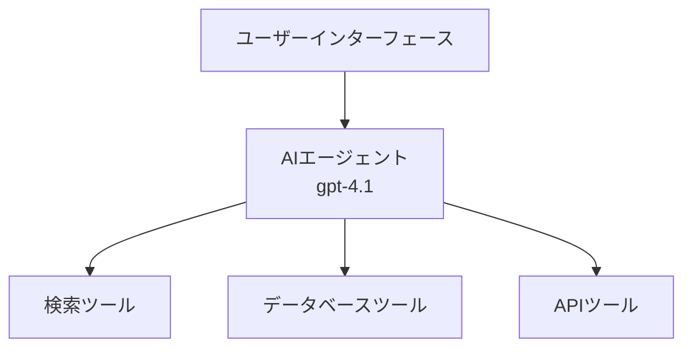
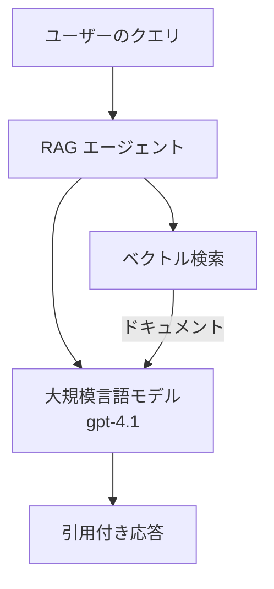
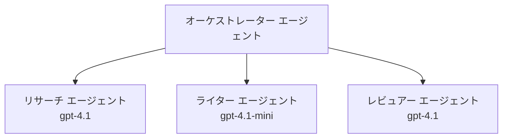

# AI Agents with Azure Developer CLI

**Chapter Navigation:**
- **📚 Course Home**: [AZD 入門](../../README.md)
- **📖 Current Chapter**: Chapter 2 - AI-First Development
- **⬅️ Previous**: [Microsoft Foundry Integration](microsoft-foundry-integration.md)
- **➡️ Next**: [AI Model Deployment](ai-model-deployment.md)
- **🚀 Advanced**: [Multi-Agent Solutions](../../examples/retail-scenario.md)

---

## Introduction

AI エージェントは、自分の環境を認識し、意思決定を行い、特定の目標を達成するために行動を取る自律的なプログラムです。プロンプトに応答するだけの単純なチャットボットとは異なり、エージェントは次のことができます:

- <strong>ツールを使用する</strong> - API を呼び出したり、データベースを検索したり、コードを実行したりする
- <strong>計画と推論を行う</strong> - 複雑なタスクをステップに分解する
- <strong>コンテキストから学習する</strong> - メモリを保持して行動を適応させる
- <strong>協力する</strong> - 他のエージェントと協力する（マルチエージェントシステム）

このガイドでは、Azure Developer CLI (azd) を使用して AI エージェントを Azure にデプロイする方法を示します。

## Learning Goals

このガイドを完了すると、次のことができるようになります:
- エージェントとは何か、チャットボットとどう違うかを理解する
- AZD を使って事前構築された AI エージェント テンプレートをデプロイする
- カスタム エージェント向けに Foundry Agents を構成する
- 基本的なエージェントパターン（ツール使用、RAG、マルチエージェント）を実装する
- デプロイされたエージェントを監視およびデバッグする

## Learning Outcomes

完了後、次のことができるようになります:
- 単一コマンドで AI エージェント アプリケーションを Azure にデプロイする
- エージェントのツールと機能を構成する
- エージェントで検索強化生成（RAG）を実装する
- 複雑なワークフローのためのマルチエージェントアーキテクチャを設計する
- 一般的なエージェントデプロイの問題をトラブルシュートする

---

## 🤖 What Makes an Agent Different from a Chatbot?

| Feature | Chatbot | AI Agent |
|---------|---------|----------|
| **Behavior** | Responds to prompts | Takes autonomous actions |
| **Tools** | None | Can call APIs, search, execute code |
| **Memory** | Session-based only | Persistent memory across sessions |
| **Planning** | Single response | Multi-step reasoning |
| **Collaboration** | Single entity | Can work with other agents |

### Simple Analogy

- **Chatbot** = 案内デスクで質問に答える親切な人
- **AI Agent** = 電話をかけたり、予約をしたり、タスクを完了してくれる個人アシスタント

---

## 🚀 Quick Start: Deploy Your First Agent

### Option 1: Foundry Agents Template (Recommended)

```bash
# AIエージェントのテンプレートを初期化する
azd init --template get-started-with-ai-agents

# Azureにデプロイする
azd up
```

**What gets deployed:**
- ✅ Foundry Agents
- ✅ Microsoft Foundry Models (gpt-4.1)
- ✅ Azure AI Search (for RAG)
- ✅ Azure Container Apps (web interface)
- ✅ Application Insights (monitoring)

**Time:** ~15-20 minutes
**Cost:** ~$100-150/month (development)

### Option 2: OpenAI Agent with Prompty

```bash
# Prompty ベースのエージェントテンプレートを初期化する
azd init --template agent-openai-python-prompty

# Azure にデプロイする
azd up
```

**What gets deployed:**
- ✅ Azure Functions (serverless agent execution)
- ✅ Microsoft Foundry Models
- ✅ Prompty configuration files
- ✅ Sample agent implementation

**Time:** ~10-15 minutes
**Cost:** ~$50-100/month (development)

### Option 3: RAG Chat Agent

```bash
# RAGチャットテンプレートを初期化する
azd init --template azure-search-openai-demo

# Azureにデプロイする
azd up
```

**What gets deployed:**
- ✅ Microsoft Foundry Models
- ✅ Azure AI Search with sample data
- ✅ Document processing pipeline
- ✅ Chat interface with citations

**Time:** ~15-25 minutes
**Cost:** ~$80-150/month (development)

### Option 4: AZD AI Agent Init (Manifest-Based)

If you have an agent manifest file, you can use the `azd ai` command to scaffold a Foundry Agent Service project directly:

```bash
# AIエージェント拡張機能をインストールする
azd extension install azure.ai.agents

# エージェントマニフェストから初期化する
azd ai agent init -m agent-manifest.yaml

# Azure にデプロイする
azd up
```

**When to use `azd ai agent init` vs `azd init --template`:**

| Approach | Best For | How It Works |
|----------|----------|------|
| `azd init --template` | Starting from a working sample app | Clones a full template repo with code + infra |
| `azd ai agent init -m` | Building from your own agent manifest | Scaffolds project structure from your agent definition |

> **Tip:** Use `azd init --template` when learning (Options 1-3 above). Use `azd ai agent init` when building production agents with your own manifests. See [AZD AI CLI Commands](../chapter-08-production/production-ai-practices.md#azd-ai-cli-commands-and-extensions) for full reference.

---

## 🏗️ Agent Architecture Patterns

### Pattern 1: Single Agent with Tools

The simplest agent pattern - one agent that can use multiple tools.


**Best for:**
- カスタマーサポートボット
- リサーチアシスタント
- データ分析エージェント

**AZD Template:** `azure-search-openai-demo`

### Pattern 2: RAG Agent (Retrieval-Augmented Generation)

An agent that retrieves relevant documents before generating responses.


**Best for:**
- 企業のナレッジベース
- ドキュメント Q&A システム
- コンプライアンスや法務調査

**AZD Template:** `azure-search-openai-demo`

### Pattern 3: Multi-Agent System

Multiple specialized agents working together on complex tasks.


**Best for:**
- 複雑なコンテンツ生成
- マルチステップワークフロー
- 異なる専門知識を必要とするタスク

**Learn More:** [Multi-Agent Coordination Patterns](../chapter-06-pre-deployment/coordination-patterns.md)

---

## ⚙️ Configuring Agent Tools

Agents become powerful when they can use tools. Here's how to configure common tools:

### Tool Configuration in Foundry Agents

```python
# agent_config.py
from azure.ai.projects import AIProjectClient
from azure.ai.projects.models import FunctionTool, CodeInterpreterTool

# カスタムツールを定義する
search_tool = FunctionTool(
    name="search_knowledge_base",
    description="Search the company knowledge base for relevant documents",
    parameters={
        "type": "object",
        "properties": {
            "query": {
                "type": "string",
                "description": "The search query"
            }
        },
        "required": ["query"]
    }
)

# ツールを使用してエージェントを作成する
agent = project_client.agents.create_agent(
    model="gpt-4.1",
    name="Support Agent",
    instructions="You are a helpful support agent. Use the search tool to find relevant information.",
    tools=[search_tool, CodeInterpreterTool()]
)
```

### Environment Configuration

```bash
# エージェント固有の環境変数を設定する
azd env set AZURE_OPENAI_MODEL "gpt-4.1"
azd env set AGENT_INSTRUCTIONS "You are a helpful assistant..."
azd env set ENABLE_CODE_INTERPRETER "true"
azd env set ENABLE_FILE_SEARCH "true"

# 更新された構成でデプロイする
azd deploy
```

---

## 📊 Monitoring Agents

### Application Insights Integration

All AZD agent templates include Application Insights for monitoring:

```bash
# 監視ダッシュボードを開く
azd monitor --overview

# ライブログを表示する
azd monitor --logs

# ライブメトリクスを表示する
azd monitor --live
```

### Key Metrics to Track

| Metric | Description | Target |
|--------|-------------|--------|
| Response Latency | Time to generate response | < 5 seconds |
| Token Usage | Tokens per request | Monitor for cost |
| Tool Call Success Rate | % of successful tool executions | > 95% |
| Error Rate | Failed agent requests | < 1% |
| User Satisfaction | Feedback scores | > 4.0/5.0 |

### Custom Logging for Agents

```python
import os
from azure.monitor.opentelemetry import configure_azure_monitor
from opentelemetry import trace

# OpenTelemetry を使用して Azure Monitor を構成する
configure_azure_monitor(
    connection_string=os.environ["APPLICATIONINSIGHTS_CONNECTION_STRING"]
)

tracer = trace.get_tracer(__name__)

def log_agent_interaction(user_query, agent_response, tools_used, latency_ms):
    with tracer.start_as_current_span("agent_interaction") as span:
        span.set_attributes({
            "user_query": user_query,
            "response_length": len(agent_response),
            "tools_used": tools_used,
            "latency_ms": latency_ms
        })
```

> **Note:** Install the required packages: `pip install azure-monitor-opentelemetry opentelemetry`

---

## 💰 Cost Considerations

### Estimated Monthly Costs by Pattern

| Pattern | Dev Environment | Production |
|---------|-----------------|------------|
| Single Agent | $50-100 | $200-500 |
| RAG Agent | $80-150 | $300-800 |
| Multi-Agent (2-3 agents) | $150-300 | $500-1,500 |
| Enterprise Multi-Agent | $300-500 | $1,500-5,000+ |

### Cost Optimization Tips

1. **Use gpt-4.1-mini for simple tasks**
   ```bash
   azd env set AZURE_OPENAI_MODEL "gpt-4.1-mini"
   ```

2. **Implement caching for repeated queries**
   ```python
   from functools import lru_cache
   
   @lru_cache(maxsize=1000)
   def get_cached_response(query_hash):
       return agent.run(query_hash)
   ```

3. **Set token limits per run**
   ```python
   # エージェントを作成する時ではなく、実行時にmax_completion_tokensを設定する
   run = project_client.agents.create_run(
       thread_id=thread.id,
       agent_id=agent.id,
       max_completion_tokens=1000  # 応答の長さを制限する
   )
   ```

4. **Scale to zero when not in use**
   ```bash
   # Container Apps は自動的にゼロまでスケールします
   azd env set MIN_REPLICAS "0"
   ```

---

## 🔧 Troubleshooting Agents

### Common Issues and Solutions

<details>
<summary><strong>❌ エージェントがツール呼び出しに応答しない</strong></summary>

```bash
# ツールが適切に登録されているか確認する
azd show

# OpenAI のデプロイを確認する
az cognitiveservices account deployment list \
  --name $AZURE_OPENAI_NAME \
  --resource-group $RG_NAME

# エージェントのログを確認する
azd monitor --logs
```

**Common causes:**
- Tool function signature mismatch
- Missing required permissions
- API endpoint not accessible
</details>

<details>
<summary><strong>❌ エージェント応答のレイテンシーが高い</strong></summary>

```bash
# Application Insights でボトルネックを確認してください
azd monitor --live

# より高速なモデルの使用を検討してください
azd env set AZURE_OPENAI_MODEL "gpt-4.1-mini"
azd deploy
```

**Optimization tips:**
- Use streaming responses
- Implement response caching
- Reduce context window size
</details>

<details>
<summary><strong>❌ エージェントが不正確または幻覚的な情報を返す</strong></summary>

```python
# より良いシステムプロンプトで改善する
instructions = """
You are a helpful assistant. IMPORTANT:
- Only answer based on provided context
- If you don't know, say "I don't know"
- Always cite your sources
- Never make up information
"""

# 根拠付けのための検索機能を追加する
agent = project_client.agents.create_agent(
    model="gpt-4.1",
    instructions=instructions,
    tools=[FileSearchTool()]  # 応答を文書に基づいて行う
)
```
</details>

<details>
<summary><strong>❌ トークン制限超過エラー</strong></summary>

```python
# コンテキストウィンドウの管理を実装する
def truncate_context(messages, max_tokens=8000, model="gpt-4.1"):
    """Keep only recent messages within token limit."""
    import tiktoken
    encoding = tiktoken.encoding_for_model(model)
    total_tokens = 0
    truncated = []
    
    for msg in reversed(messages):
        msg_tokens = len(encoding.encode(msg.content))
        if total_tokens + msg_tokens > max_tokens:
            break
        truncated.insert(0, msg)
        total_tokens += msg_tokens
    
    return truncated
```
</details>

---

## 🎓 Hands-On Exercises

### Exercise 1: Deploy a Basic Agent (20 minutes)

**Goal:** Deploy your first AI agent using AZD

```bash
# ステップ1: テンプレートを初期化
azd init --template get-started-with-ai-agents

# ステップ2: Azureにログイン
azd auth login

# ステップ3: デプロイ
azd up

# ステップ4: エージェントをテスト
# デプロイ後の期待される出力:
#   デプロイが完了しました!
#   エンドポイント: https://<app-name>.<region>.azurecontainerapps.io
# 出力に表示されているURLを開き、質問してみてください

# ステップ5: モニタリングを表示
azd monitor --overview

# ステップ6: クリーンアップ
azd down --force --purge
```

**Success Criteria:**
- [ ] エージェントが質問に応答する
- [ ] `azd monitor` で監視ダッシュボードにアクセスできる
- [ ] リソースが正常にクリーンアップされる

### Exercise 2: Add a Custom Tool (30 minutes)

**Goal:** Extend an agent with a custom tool

1. Deploy the agent template:
   ```bash
   azd init --template get-started-with-ai-agents
   azd up
   ```
2. Create a new tool function in your agent code:
   ```python
   def get_weather(location: str) -> str:
       """Get current weather for a location."""
       # 天気サービスへのAPI呼び出し
       return f"Weather in {location}: Sunny, 72°F"
   ```
3. Register the tool with the agent:
   ```python
   from azure.ai.projects.models import FunctionTool

   weather_tool = FunctionTool(
       name="get_weather",
       description="Get current weather for a location",
       parameters={
           "type": "object",
           "properties": {
               "location": {"type": "string", "description": "City name"}
           },
           "required": ["location"]
       }
   )

   agent = project_client.agents.create_agent(
       model="gpt-4.1",
       name="Weather Agent",
       tools=[weather_tool]
   )
   ```
4. Redeploy and test:
   ```bash
   azd deploy
   # 質問: "シアトルの天気はどうですか？"
   # 期待される動作: エージェントが get_weather("Seattle") を呼び出し、天気情報を返す
   ```

**Success Criteria:**
- [ ] エージェントが天気に関するクエリを認識する
- [ ] ツールが正しく呼び出される
- [ ] 応答に天気情報が含まれる

### Exercise 3: Build a RAG Agent (45 minutes)

**Goal:** Create an agent that answers questions from your documents

```bash
# ステップ1: RAGテンプレートをデプロイする
azd init --template azure-search-openai-demo
azd up

# ステップ2: ドキュメントをアップロードする
# PDF/TXTファイルをdata/ディレクトリに配置し、次に以下を実行します:
python scripts/prepdocs.py

# ステップ3: ドメイン固有の質問でテストする
# azd upの出力に表示されたWebアプリのURLを開く
# アップロードしたドキュメントについて質問する
# 応答には[doc.pdf]のような引用参照を含めるべきです
```

**Success Criteria:**
- [ ] アップロードしたドキュメントからエージェントが回答する
- [ ] 応答に引用が含まれる
- [ ] 範囲外の質問で幻覚が発生しない

---

## 📚 Next Steps

Now that you understand AI agents, explore these advanced topics:

| Topic | Description | Link |
|-------|-------------|------|
| **Multi-Agent Systems** | Build systems with multiple collaborating agents | [Retail Multi-Agent Example](../../examples/retail-scenario.md) |
| **Coordination Patterns** | Learn orchestration and communication patterns | [Coordination Patterns](../chapter-06-pre-deployment/coordination-patterns.md) |
| **Production Deployment** | Enterprise-ready agent deployment | [Production AI Practices](../chapter-08-production/production-ai-practices.md) |
| **Agent Evaluation** | Test and evaluate agent performance | [AI Troubleshooting](../chapter-07-troubleshooting/ai-troubleshooting.md) |
| **AI Workshop Lab** | Hands-on: Make your AI solution AZD-ready | [AI Workshop Lab](ai-workshop-lab.md) |

---

## 📖 Additional Resources

### Official Documentation
- [Azure AI Agent Service](https://learn.microsoft.com/azure/ai-services/agents/)
- [Azure AI Foundry Agent Service Quickstart](https://learn.microsoft.com/azure/ai-services/agents/quickstart)
- [Semantic Kernel Agent Framework](https://learn.microsoft.com/semantic-kernel/)

### AZD Templates for Agents
- [Get Started with AI Agents](https://github.com/Azure-Samples/get-started-with-ai-agents)
- [Agent OpenAI Python Prompty](https://github.com/Azure-Samples/agent-openai-python-prompty)
- [Azure Search OpenAI Demo](https://github.com/Azure-Samples/azure-search-openai-demo)

### Community Resources
- [Awesome AZD - Agent Templates](https://azure.github.io/awesome-azd/?tags=ai-agents)
- [Azure AI Discord](https://discord.gg/microsoft-azure)
- [Microsoft Foundry Discord](https://discord.gg/nTYy5BXMWG)

### Agent Skills for Your Editor
- [**Microsoft Azure Agent Skills**](https://skills.sh/microsoft/github-copilot-for-azure) - Install reusable AI agent skills for Azure development in GitHub Copilot, Cursor, or any supported agent. Includes skills for [Azure AI](https://skills.sh/microsoft/github-copilot-for-azure/azure-ai), [Microsoft Foundry](https://skills.sh/microsoft/github-copilot-for-azure/microsoft-foundry), [deployment](https://skills.sh/microsoft/github-copilot-for-azure/azure-deploy), and [diagnostics](https://skills.sh/microsoft/github-copilot-for-azure/azure-diagnostics):
  ```bash
  npx skills add microsoft/github-copilot-for-azure
  ```

---

**Navigation**
- **Previous Lesson**: [Microsoft Foundry Integration](microsoft-foundry-integration.md)
- **Next Lesson**: [AI Model Deployment](ai-model-deployment.md)

---

<!-- CO-OP TRANSLATOR DISCLAIMER START -->
**免責事項**:
この文書は AI 翻訳サービス [Co-op翻訳](https://github.com/Azure/co-op-translator) を使用して翻訳されました。正確性には努めていますが、自動翻訳には誤りや不正確さが含まれる可能性があることにご注意ください。原文（原言語）の文書が信頼できる情報源と見なされるべきです。重要な情報については、専門の人間による翻訳を推奨します。本翻訳の利用によって生じるいかなる誤解や解釈違いについても、当社は責任を負いません。
<!-- CO-OP TRANSLATOR DISCLAIMER END -->