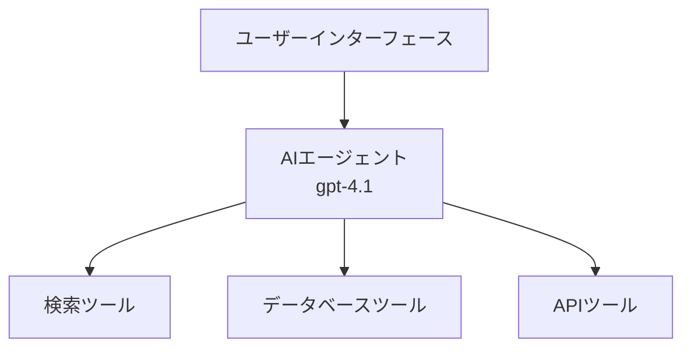
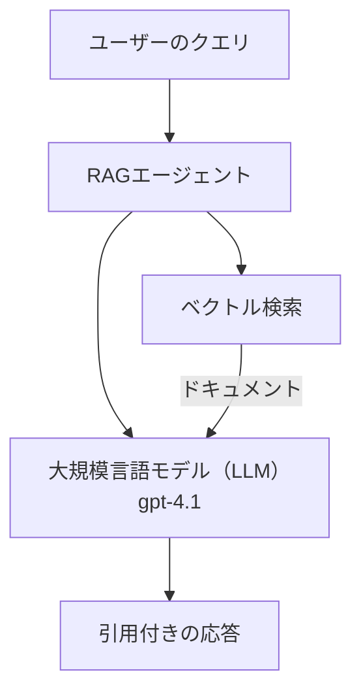
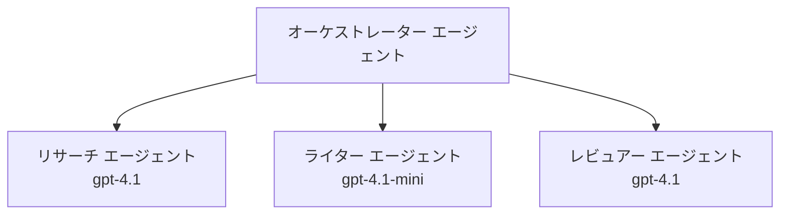

# AI Agents with Azure Developer CLI

**Chapter Navigation:**
- **📚 コースホーム**: [AZD For Beginners](../../README.md)
- **📖 現在の章**: Chapter 2 - AI-First Development
- **⬅️ 前へ**: [Microsoft Foundry Integration](microsoft-foundry-integration.md)
- **➡️ 次へ**: [AI Model Deployment](ai-model-deployment.md)
- **🚀 上級**: [Multi-Agent Solutions](../../examples/retail-scenario.md)

---

## Introduction

AI エージェントは、自分の環境を認識し、意思決定を行い、特定の目標を達成するために行動を起こせる自律プログラムです。プロンプトに応答するだけの単純なチャットボットとは異なり、エージェントは以下を行えます:

- <strong>ツールを使用する</strong> - API 呼び出し、データベース検索、コード実行
- <strong>計画と推論</strong> - 複雑なタスクをステップに分解
- <strong>コンテキストから学習する</strong> - メモリを維持し振る舞いを適応
- <strong>協働する</strong> - 他のエージェントと協力（マルチエージェントシステム）

このガイドでは、Azure Developer CLI (azd) を使用して AI エージェントを Azure にデプロイする方法を説明します。

> **Validation note (2026-03-25):** このガイドは `azd` `1.23.12` と `azure.ai.agents` `0.1.18-preview` に対してレビューされました。`azd ai` 体験はまだプレビュー中心のため、インストール済みの拡張機能のフラグが異なる場合は拡張機能のヘルプを確認してください。

## Learning Goals

このガイドを完了すると、以下ができるようになります:
- エージェントとは何か、チャットボットとどう違うかを理解する
- AZD を使って事前構築されたエージェントテンプレートをデプロイする
- カスタムエージェント向けに Foundry Agents を構成する
- 基本的なエージェントパターン（ツール使用、RAG、マルチエージェント）を実装する
- デプロイしたエージェントを監視しデバッグする

## Learning Outcomes

完了後、あなたは以下を行えるようになります:
- 単一コマンドで AI エージェントアプリケーションを Azure にデプロイする
- エージェントのツールや機能を構成する
- エージェントでの retrieval-augmented generation (RAG) を実装する
- 複雑なワークフロー向けのマルチエージェントアーキテクチャを設計する
- 一般的なエージェントデプロイの問題をトラブルシュートする

---

## 🤖 What Makes an Agent Different from a Chatbot?

| Feature | Chatbot | AI Agent |
|---------|---------|----------|
| **Behavior** | Responds to prompts | Takes autonomous actions |
| **Tools** | None | Can call APIs, search, execute code |
| **Memory** | Session-based only | Persistent memory across sessions |
| **Planning** | Single response | Multi-step reasoning |
| **Collaboration** | Single entity | Can work with other agents |

### Simple Analogy

- **Chatbot** = 情報窓口で質問に答える親切な人
- **AI Agent** = 電話をかけたり、予約を取ったり、タスクを代行できるパーソナルアシスタント

---

## 🚀 Quick Start: Deploy Your First Agent

### Option 1: Foundry Agents Template (Recommended)

```bash
# AIエージェントのテンプレートを初期化する
azd init --template get-started-with-ai-agents

# Azure にデプロイする
azd up
```

**デプロイされるもの:**
- ✅ Foundry Agents
- ✅ Microsoft Foundry Models (gpt-4.1)
- ✅ Azure AI Search (RAG 用)
- ✅ Azure Container Apps (ウェブインターフェイス)
- ✅ Application Insights (監視)

**所要時間:** 約15〜20分
**コスト:** 約 $100-150/月（開発環境）

### Option 2: OpenAI Agent with Prompty

```bash
# Prompty ベースのエージェントテンプレートを初期化する
azd init --template agent-openai-python-prompty

# Azure にデプロイする
azd up
```

**デプロイされるもの:**
- ✅ Azure Functions（サーバーレスでのエージェント実行）
- ✅ Microsoft Foundry Models
- ✅ Prompty 設定ファイル
- ✅ サンプルエージェント実装

**所要時間:** 約10〜15分
**コスト:** 約 $50-100/月（開発環境）

### Option 3: RAG Chat Agent

```bash
# RAGチャットテンプレートを初期化する
azd init --template azure-search-openai-demo

# Azure にデプロイする
azd up
```

**デプロイされるもの:**
- ✅ Microsoft Foundry Models
- ✅ サンプルデータ付き Azure AI Search
- ✅ ドキュメント処理パイプライン
- ✅ 引用付きチャットインターフェイス

**所要時間:** 約15〜25分
**コスト:** 約 $80-150/月（開発環境）

### Option 4: AZD AI Agent Init (Manifest- or Template-Based Preview)

エージェントのマニフェストファイルを持っている場合、`azd ai` コマンドを使用して Foundry Agent Service プロジェクトを直接スキャフォールドできます。最近のプレビューリリースではテンプレートベースの初期化サポートも追加されているため、プロンプトのフローはインストールされている拡張機能のバージョンによって若干異なる場合があります。

```bash
# AI エージェント拡張機能をインストールする
azd extension install azure.ai.agents

# 任意: インストールされたプレビュー版を確認する
azd extension show azure.ai.agents

# エージェント マニフェストから初期化する
azd ai agent init -m agent-manifest.yaml

# Azure にデプロイする
azd up

# デプロイされたエージェントをテストする（レイテンシと最初のバイトまでの時間を表示）
azd ai agent invoke
```

**`azd ai agent init` と `azd init --template` を使い分ける場合:**

| Approach | Best For | How It Works |
|----------|----------|------|
| `azd init --template` | 動作するサンプルアプリから始める場合 | コードとインフラを含むフルテンプレートリポジトリをクローン |
| `azd ai agent init -m` | 自分のエージェントマニフェストから構築する場合 | エージェント定義からプロジェクト構造をスキャフォールド |

> **Tip:** 学習時は `azd init --template` を使用してください（上のオプション 1〜3）。独自のマニフェストで本番エージェントを構築する場合は `azd ai agent init` を使用します。

`azd up` の後、同じ拡張機能がエージェントライフサイクルの残りを案内します: テストには `azd ai agent invoke`、品質測定と改善には `azd ai agent eval generate` と `azd ai agent optimize`、クリーンアップには `azd ai agent delete` を使用します。完全なリファレンスは [AZD AI CLI Commands](../chapter-08-production/production-ai-practices.md#azd-ai-cli-commands-and-extensions) を参照してください。

---

## 🏗️ Agent Architecture Patterns

### Pattern 1: Single Agent with Tools

最もシンプルなエージェントパターン - 複数のツールを使用できる単一エージェント。



**最適用途:**
- カスタマーサポートボット
- リサーチアシスタント
- データ分析エージェント

**AZD テンプレート:** `azure-search-openai-demo`

### Pattern 2: RAG Agent (Retrieval-Augmented Generation)

応答を生成する前に関連ドキュメントを検索するエージェント。



**最適用途:**
- 企業ナレッジベース
- ドキュメント Q&A システム
- コンプライアンスや法務調査

**AZD テンプレート:** `azure-search-openai-demo`

### Pattern 3: Multi-Agent System

複雑なタスクに対して協働する複数の専門エージェント。



**最適用途:**
- 複雑なコンテンツ生成
- マルチステップのワークフロー
- 異なる専門知識を必要とするタスク

**詳細:** [Multi-Agent Coordination Patterns](../chapter-06-pre-deployment/coordination-patterns.md)

---

## ⚙️ Configuring Agent Tools

エージェントはツールを使用できると強力になります。ここでは一般的なツールの構成方法を示します:

### Tool Configuration in Foundry Agents

```python
# agent_config.py
from azure.ai.projects import AIProjectClient
from azure.ai.projects.models import FunctionTool, CodeInterpreterTool

# カスタムツールを定義する
search_tool = FunctionTool(
    name="search_knowledge_base",
    description="Search the company knowledge base for relevant documents",
    parameters={
        "type": "object",
        "properties": {
            "query": {
                "type": "string",
                "description": "The search query"
            }
        },
        "required": ["query"]
    }
)

# ツールを使ってエージェントを作成する
agent = project_client.agents.create_agent(
    model="gpt-4.1",
    name="Support Agent",
    instructions="You are a helpful support agent. Use the search tool to find relevant information.",
    tools=[search_tool, CodeInterpreterTool()]
)
```

### Environment Configuration

```bash
# エージェント固有の環境変数を設定する
azd env set AZURE_OPENAI_MODEL "gpt-4.1"
azd env set AGENT_INSTRUCTIONS "You are a helpful assistant..."
azd env set ENABLE_CODE_INTERPRETER "true"
azd env set ENABLE_FILE_SEARCH "true"

# 更新された構成でデプロイする
azd deploy
```

---

## 📊 Monitoring Agents

### Application Insights Integration

すべての AZD エージェントテンプレートには監視のために Application Insights が含まれています:

```bash
# 監視ダッシュボードを開く
azd monitor --overview

# ライブログを表示
azd monitor --logs

# ライブメトリクスを表示
azd monitor --live
```

### 追跡すべき主要指標

| Metric | Description | Target |
|--------|-------------|--------|
| Response Latency | 応答生成にかかる時間 | < 5 秒 |
| Token Usage | リクエストあたりのトークン数 | コスト監視 |
| Tool Call Success Rate | ツール実行の成功率 (%) | > 95% |
| Error Rate | 失敗したエージェントリクエスト | < 1% |
| User Satisfaction | フィードバックスコア | > 4.0/5.0 |

### エージェントのカスタムロギング

```python
import os
from azure.monitor.opentelemetry import configure_azure_monitor
from opentelemetry import trace

# OpenTelemetry を使用して Azure Monitor を構成する
configure_azure_monitor(
    connection_string=os.environ["APPLICATIONINSIGHTS_CONNECTION_STRING"]
)

tracer = trace.get_tracer(__name__)

def log_agent_interaction(user_query, agent_response, tools_used, latency_ms):
    with tracer.start_as_current_span("agent_interaction") as span:
        span.set_attributes({
            "user_query": user_query,
            "response_length": len(agent_response),
            "tools_used": tools_used,
            "latency_ms": latency_ms
        })
```

> **Note:** 必要なパッケージをインストールしてください: `pip install azure-monitor-opentelemetry opentelemetry`

---

## 💰 Cost Considerations

### パターン別見積り月額コスト

| Pattern | Dev Environment | Production |
|---------|-----------------|------------|
| Single Agent | $50-100 | $200-500 |
| RAG Agent | $80-150 | $300-800 |
| Multi-Agent (2-3 agents) | $150-300 | $500-1,500 |
| Enterprise Multi-Agent | $300-500 | $1,500-5,000+ |

### コスト最適化のヒント

1. **単純なタスクには gpt-4.1-mini を使う**
   ```bash
   azd env set AZURE_OPENAI_MODEL "gpt-4.1-mini"
   ```

2. <strong>繰り返しクエリにはキャッシュを実装する</strong>
   ```python
   from functools import lru_cache
   
   @lru_cache(maxsize=1000)
   def get_cached_response(query_hash):
       return agent.run(query_hash)
   ```

3. <strong>ランごとのトークン上限を設定する</strong>
   ```python
   # エージェントを実行するときに max_completion_tokens を設定し、作成時には設定しない
   run = project_client.agents.create_run(
       thread_id=thread.id,
       agent_id=agent.id,
       max_completion_tokens=1000  # 応答の長さを制限する
   )
   ```

4. <strong>使用していないときはスケール・トゥ・ゼロする</strong>
   ```bash
   # Container Apps は自動的にゼロまでスケールします
   azd env set MIN_REPLICAS "0"
   ```

---

## 🔧 Troubleshooting Agents

### Common Issues and Solutions

<details>
<summary><strong>❌ エージェントがツール呼び出しに応答しない</strong></summary>

```bash
# ツールが正しく登録されているか確認する
azd show

# OpenAI のデプロイを検証する
az cognitiveservices account deployment list \
  --name $AZURE_OPENAI_NAME \
  --resource-group $RG_NAME

# エージェントのログを確認する
azd monitor --logs
```

**一般的な原因:**
- ツール関数のシグネチャ不一致
- 必要な権限が欠如している
- API エンドポイントにアクセスできない
</details>

<details>
<summary><strong>❌ エージェント応答のレイテンシが高い</strong></summary>

```bash
# ボトルネックがないか Application Insights を確認してください
azd monitor --live

# より高速なモデルの使用を検討してください
azd env set AZURE_OPENAI_MODEL "gpt-4.1-mini"
azd deploy
```

**最適化のヒント:**
- ストリーミング応答を使用する
- 応答キャッシュを実装する
- コンテキストウィンドウサイズを縮小する
</details>

<details>
<summary><strong>❌ エージェントが誤った情報や幻覚を返す</strong></summary>

```python
# より良いシステムプロンプトで改善する
instructions = """
You are a helpful assistant. IMPORTANT:
- Only answer based on provided context
- If you don't know, say "I don't know"
- Always cite your sources
- Never make up information
"""

# グラウンディングのための検索機能を追加する
agent = project_client.agents.create_agent(
    model="gpt-4.1",
    instructions=instructions,
    tools=[FileSearchTool()]  # 応答を文書に基づいて行う
)
```
</details>

<details>
<summary><strong>❌ トークン上限超過エラー</strong></summary>

```python
# コンテキストウィンドウの管理を実装する
def truncate_context(messages, max_tokens=8000, model="gpt-4.1"):
    """Keep only recent messages within token limit."""
    import tiktoken
    encoding = tiktoken.encoding_for_model(model)
    total_tokens = 0
    truncated = []
    
    for msg in reversed(messages):
        msg_tokens = len(encoding.encode(msg.content))
        if total_tokens + msg_tokens > max_tokens:
            break
        truncated.insert(0, msg)
        total_tokens += msg_tokens
    
    return truncated
```
</details>

---

## 🎓 Hands-On Exercises

### Exercise 1: Deploy a Basic Agent (20 minutes)

**Goal:** AZD を使用して最初の AI エージェントをデプロイする

```bash
# ステップ 1: テンプレートを初期化する
azd init --template get-started-with-ai-agents

# ステップ 2: Azure にログインする
azd auth login
# 複数のテナントで作業する場合は、--tenant-id <tenant-id> を追加してください

# ステップ 3: デプロイする
azd up

# ステップ 4: エージェントをテストする
# デプロイ後の期待される出力:
#   デプロイが完了しました！
#   エンドポイント: https://<app-name>.<region>.azurecontainerapps.io
# 出力に表示された URL を開き、質問をしてみてください

# ステップ 5: モニタリングを表示する
azd monitor --overview

# ステップ 6: クリーンアップを行う
azd down --force --purge
```

**成功基準:**
- [ ] エージェントが質問に応答する
- [ ] `azd monitor` で監視ダッシュボードにアクセスできる
- [ ] リソースが正常にクリーンアップされる

### Exercise 2: Add a Custom Tool (30 minutes)

**Goal:** カスタムツールでエージェントを拡張する

1. エージェントテンプレートをデプロイする:
   ```bash
   azd init --template get-started-with-ai-agents
   azd up
   ```
2. エージェントコードに新しいツール関数を作成する:
   ```python
   def get_weather(location: str) -> str:
       """Get current weather for a location."""
       # 天気サービスへのAPI呼び出し
       return f"Weather in {location}: Sunny, 72°F"
   ```
3. ツールをエージェントに登録する:
   ```python
   from azure.ai.projects.models import FunctionTool

   weather_tool = FunctionTool(
       name="get_weather",
       description="Get current weather for a location",
       parameters={
           "type": "object",
           "properties": {
               "location": {"type": "string", "description": "City name"}
           },
           "required": ["location"]
       }
   )

   agent = project_client.agents.create_agent(
       model="gpt-4.1",
       name="Weather Agent",
       tools=[weather_tool]
   )
   ```
4. 再デプロイしてテストする:
   ```bash
   azd deploy
   # 尋ねる: "シアトルの天気はどうですか？"
   # 期待: エージェントが get_weather("Seattle") を呼び出し、天気情報を返す
   ```

**成功基準:**
- [ ] エージェントが天気に関するクエリを認識する
- [ ] ツールが正しく呼び出される
- [ ] 応答に天気情報が含まれる

### Exercise 3: Build a RAG Agent (45 minutes)

**Goal:** ドキュメントから質問に答えるエージェントを作成する

```bash
# ステップ1: RAGテンプレートをデプロイする
azd init --template azure-search-openai-demo
azd up

# ステップ2: ドキュメントをアップロードする
# PDF/TXTファイルをdata/ディレクトリに置き、次に以下を実行する:
python scripts/prepdocs.py

# ステップ3: ドメイン固有の質問でテストする
# azd upの出力に表示されたWebアプリのURLを開く
# アップロードしたドキュメントについて質問する
# 応答には[doc.pdf]のような引用参照を含めるべきです
```

**成功基準:**
- [ ] アップロードしたドキュメントからエージェントが回答する
- [ ] 応答に引用が含まれる
- [ ] 範囲外の質問で幻覚が発生しない

---

## 📚 Next Steps

AI エージェントについて理解したら、次の上級トピックを探求してください:

| Topic | Description | Link |
|-------|-------------|------|
| **Multi-Agent Systems** | 複数の協働エージェントでシステムを構築する | [Retail Multi-Agent Example](../../examples/retail-scenario.md) |
| **Coordination Patterns** | オーケストレーションと通信パターンを学ぶ | [Coordination Patterns](../chapter-06-pre-deployment/coordination-patterns.md) |
| **Production Deployment** | エンタープライズ向けのエージェントデプロイ | [Production AI Practices](../chapter-08-production/production-ai-practices.md) |
| **Agent Evaluation** | エージェントの性能をテストおよび評価する | [AI Troubleshooting](../chapter-07-troubleshooting/ai-troubleshooting.md) |
| **AI Workshop Lab** | ハンズオン: AI ソリューションを AZD 対応にする | [AI Workshop Lab](ai-workshop-lab.md) |

---

## 📖 Additional Resources

### Official Documentation
- [Microsoft Foundry Agent Service](https://learn.microsoft.com/azure/ai-services/agents/)
- [Microsoft Foundry Agent Service Quickstart](https://learn.microsoft.com/azure/ai-services/agents/quickstart)
- [Semantic Kernel Agent Framework](https://learn.microsoft.com/semantic-kernel/)

### AZD Templates for Agents
- [Get Started with AI Agents](https://github.com/Azure-Samples/get-started-with-ai-agents)
- [Agent OpenAI Python Prompty](https://github.com/Azure-Samples/agent-openai-python-prompty)
- [Azure Search OpenAI Demo](https://github.com/Azure-Samples/azure-search-openai-demo)

### Community Resources
- [Awesome AZD - Agent Templates](https://azure.github.io/awesome-azd/?tags=ai-agents)
- [Azure AI Discord](https://discord.gg/microsoft-azure)
- [Microsoft Foundry Discord](https://discord.gg/nTYy5BXMWG)

### Agent Skills for Your Editor
- [**Microsoft Azure Agent Skills**](https://skills.sh/microsoft/github-copilot-for-azure) - GitHub Copilot、Cursor、またはサポートされている任意のエージェントに Azure 開発用の再利用可能な AI エージェントスキルをインストールします。以下のスキルを含みます: [Azure AI](https://skills.sh/microsoft/github-copilot-for-azure/azure-ai), [Microsoft Foundry](https://skills.sh/microsoft/github-copilot-for-azure/microsoft-foundry), [deployment](https://skills.sh/microsoft/github-copilot-for-azure/azure-deploy), および [diagnostics](https://skills.sh/microsoft/github-copilot-for-azure/azure-diagnostics):
  ```bash
  npx skills add microsoft/github-copilot-for-azure
  ```

---

**Navigation**
- **Previous Lesson**: [Microsoft Foundry Integration](microsoft-foundry-integration.md)
- **Next Lesson**: [AI Model Deployment](ai-model-deployment.md)

---

<!-- CO-OP TRANSLATOR DISCLAIMER START -->
**免責事項**：
本書類は AI 翻訳サービス [Co-op Translator](https://github.com/Azure/co-op-translator) を使用して翻訳されています。正確性を期していますが、自動翻訳には誤りや不正確な部分が含まれる可能性があることをご承知おきください。原文の原語版が正式な情報源とみなされるべきです。重要な情報については、専門の人間による翻訳を推奨します。本翻訳の利用により生じたいかなる誤解や解釈違いについても、当方は責任を負いかねます。
<!-- CO-OP TRANSLATOR DISCLAIMER END -->