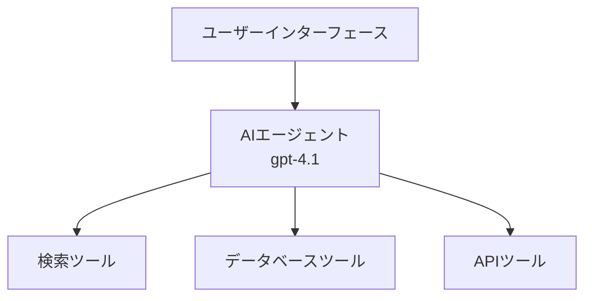
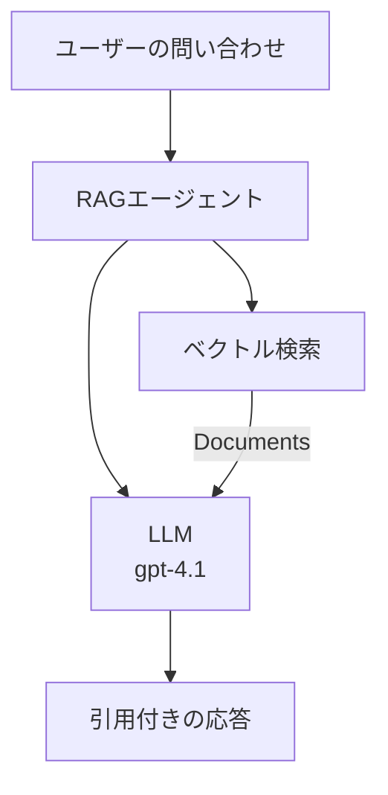
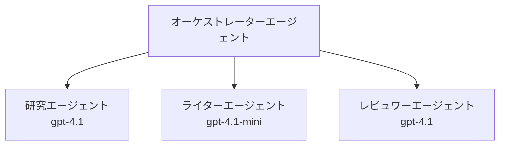

# Azure Developer CLIによるAIエージェント

**章のナビゲーション:**
- **📚 コースホーム**: [AZD For Beginners](../../README.md)
- **📖 現在の章**: 第2章 - AIファースト開発
- **⬅️ 前へ**: [Microsoft Foundry Integration](microsoft-foundry-integration.md)
- **➡️ 次へ**: [AI Model Deployment](ai-model-deployment.md)
- **🚀 上級**: [マルチエージェントソリューション](../../examples/retail-scenario.md)

---

## はじめに

AIエージェントは、自律的に環境を感知し、意思決定を行い、特定の目標を達成するために行動を起こすプログラムです。単純なチャットボットのようにプロンプトに応答するだけでなく、エージェントは以下のことができます：

- <strong>ツールの使用</strong> - APIを呼び出し、データベースを検索し、コードを実行する
- <strong>計画と推論</strong> - 複雑なタスクをステップに分解する
- <strong>コンテキストから学習</strong> - メモリを維持し、行動を適応させる
- <strong>協力</strong> - 他のエージェントと協働（マルチエージェントシステム）

本ガイドでは、Azure Developer CLI（azd）を使用してAIエージェントをAzureにデプロイする方法を紹介します。

> **検証メモ（2026-07-13）:** このガイドは `azd` `1.27.1` と `azure.ai.agents` `1.0.0-beta.5` を基にレビューされました。`azd ai` の体験はまだプレビュー段階のため、インストールされているフラグが異なる場合は拡張機能のヘルプを参照してください。

## 学習目標

本ガイドを完遂すると、以下が達成できます：
- AIエージェントとは何か、チャットボットとの違いを理解する
- AZDを使った事前構築AIエージェントテンプレートのデプロイ
- Foundryエージェントのカスタムエージェントへの設定
- 基本的なエージェントパターンの実装（ツール使用、RAG、マルチエージェント）
- デプロイ済みエージェントの監視とデバッグ

## 学習成果

完了後、以下ができるようになります：
- ワンコマンドでAzureにAIエージェントアプリケーションをデプロイ
- エージェントのツールと機能を設定
- エージェントでリトリーバル強化生成（RAG）を実装
- 複雑なワークフロー向けにマルチエージェントアーキテクチャを設計
- 一般的なエージェントデプロイ問題のトラブルシューティング

---

## 🤖 エージェントとチャットボットの違いとは？

| 特徴 | チャットボット | AIエージェント |
|---------|---------|----------|
| <strong>動作</strong> | プロンプトに応答する | 自律的に行動する |
| <strong>ツール</strong> | なし | API呼び出し、検索、コード実行が可能 |
| <strong>メモリ</strong> | セッションベースのみ | セッション間で持続するメモリあり |
| <strong>計画</strong> | 単一の応答 | 複数ステップの推論 |
| <strong>協力</strong> | 単一の主体 | 他のエージェントと協働可能 |

### 簡単なたとえ

- <strong>チャットボット</strong> = 案内カウンターで質問に答える親切な人
- **AIエージェント** = 電話をかけ、予約を取り、タスクをこなすパーソナルアシスタント

---

## 🚀 クイックスタート：最初のエージェントをデプロイ

### オプション1: Foundry Agents テンプレート（推奨）

```bash
# AIエージェントのテンプレートを初期化する
azd init --template get-started-with-ai-agents

# Azureにデプロイする
azd up
```

**デプロイされる内容:**
- ✅ Foundry Agents
- ✅ Microsoft Foundry Models (gpt-4.1)
- ✅ Azure AI Search（RAG用）
- ✅ Azure Container Apps（ウェブインターフェース）
- ✅ Application Insights（監視）

**所要時間:** 約15〜20分
**費用:** 約100〜150ドル/月（開発環境）

### オプション2: Promptyを使ったOpenAIエージェント

```bash
# Promptyベースのエージェントテンプレートを初期化します
azd init --template agent-openai-python-prompty

# Azureにデプロイします
azd up
```

**デプロイされる内容:**
- ✅ Azure Functions（サーバーレスエージェント実行）
- ✅ Microsoft Foundry Models
- ✅ Prompty設定ファイル
- ✅ サンプルエージェント実装

**所要時間:** 約10〜15分
**費用:** 約50〜100ドル/月（開発環境）

### オプション3: RAGチャットエージェント

```bash
# RAGチャットテンプレートを初期化する
azd init --template azure-search-openai-demo

# Azureにデプロイする
azd up
```

**デプロイされる内容:**
- ✅ Microsoft Foundry Models
- ✅ サンプルデータ付きAzure AI Search
- ✅ ドキュメント処理パイプライン
- ✅ 引用付きチャットインターフェース

**所要時間:** 約15〜25分
**費用:** 約80〜150ドル/月（開発環境）

### オプション4: AZD AI Agent Init（マニフェストまたはテンプレートベースのプレビュー）

エージェントマニフェストファイルがあれば、`azd ai`コマンドを使い直接Foundry Agent Serviceプロジェクトをスキャフォールディングできます。最近のプレビューリリースではテンプレートベースの初期化もサポートされており、インストールした拡張のバージョンによってプロンプトフローが若干異なる場合があります。

```bash
# AIエージェント拡張機能をインストールする
azd extension install azure.ai.agents

# 任意: インストールされたプレビュー版を確認する
azd extension show azure.ai.agents

# エージェントマニフェストから初期化する
azd ai agent init -m agent-manifest.yaml

# Azureにデプロイする
azd up

# デプロイしたエージェントをテストする（レイテンシーと最初のバイト到達時間を表示）
azd ai agent invoke
```

**`azd ai agent init` と `azd init --template` の使い分け:**

| 方法 | 適した状況 | 動作概要 |
|----------|----------|------|
| `azd init --template` | 動作するサンプルアプリから開始 | コードとインフラを含む完全なテンプレートリポジトリをクローン |
| `azd ai agent init -m` | 独自のエージェントマニフェストから構築 | エージェント定義からプロジェクト構造を作成 |

> **ヒント:** 学習時は（上記のオプション1-3のように）`azd init --template`を使います。実際のマニフェストで本番エージェントを作る場合は、`azd ai agent init`を使いましょう。

`azd up`の後は、同じ拡張機能がエージェントのライフサイクルをサポートします：テストには `azd ai agent invoke`、品質の測定と改善には `azd ai agent eval generate` や `azd ai agent optimize`、そしてクリーンアップには `azd ai agent delete` を使用します。詳細は [AZD AI CLIコマンド](../chapter-08-production/production-ai-practices.md#azd-ai-cli-commands-and-extensions) をご覧ください。

---

## 🏗️ エージェントアーキテクチャパターン

### パターン1: ツールを持つ単一エージェント

最もシンプルなエージェントパターンで、複数のツールを利用できる一つのエージェント。



**推奨用途:**
- カスタマーサポートボット
- 研究支援
- データ分析エージェント

**AZDテンプレート:** `azure-search-openai-demo`

### パターン2: RAGエージェント（リトリーバル強化生成）

応答生成前に関連ドキュメントを検索するエージェント。



**推奨用途:**
- 企業知識ベース
- ドキュメントQ&Aシステム
- コンプライアンスや法務調査

**AZDテンプレート:** `azure-search-openai-demo`

### パターン3: マルチエージェントシステム

複数の専門化したエージェントが複雑なタスクを協働で処理。



**推奨用途:**
- 複雑なコンテンツ生成
- 複数ステップのワークフロー
- 複数の専門知識が必要なタスク

**詳細:** [マルチエージェントの調整パターン](../chapter-06-pre-deployment/coordination-patterns.md)

---

## ⚙️ エージェントツールの設定

エージェントはツールを使うことで強力になります。よく使われるツールの設定方法は以下の通りです：

### Foundry Agentsにおけるツール設定

```python
# agent_config.py
from azure.ai.projects import AIProjectClient
from azure.ai.projects.models import FunctionTool, CodeInterpreterTool

# カスタムツールを定義する
search_tool = FunctionTool(
    name="search_knowledge_base",
    description="Search the company knowledge base for relevant documents",
    parameters={
        "type": "object",
        "properties": {
            "query": {
                "type": "string",
                "description": "The search query"
            }
        },
        "required": ["query"]
    }
)

# ツールを使ってエージェントを作成する
agent = project_client.agents.create_agent(
    model="gpt-4.1",
    name="Support Agent",
    instructions="You are a helpful support agent. Use the search tool to find relevant information.",
    tools=[search_tool, CodeInterpreterTool()]
)
```

### 環境設定

```bash
# エージェント固有の環境変数を設定する
azd env set AZURE_OPENAI_MODEL "gpt-4.1"
azd env set AGENT_INSTRUCTIONS "You are a helpful assistant..."
azd env set ENABLE_CODE_INTERPRETER "true"
azd env set ENABLE_FILE_SEARCH "true"

# 更新された構成でデプロイする
azd deploy
```

---

## 📊 エージェントの監視

### Application Insights統合

すべてのAZDエージェントテンプレートには、監視用にApplication Insightsが含まれています：

```bash
# オープンモニタリングダッシュボード
azd monitor --overview

# ライブログを見る
azd monitor --logs

# ライブメトリクスを見る
azd monitor --live
```

### 追跡すべき主要指標

| 指標 | 説明 | 目標 |
|--------|-------------|--------|
| 応答遅延 | 応答生成にかかる時間 | 5秒未満 |
| トークン使用量 | リクエストごとのトークン数 | コスト監視 |
| ツール呼び出し成功率 | 成功したツール実行の割合 | 95%以上 |
| エラー率 | エージェントリクエストの失敗率 | 1%未満 |
| ユーザー満足度 | フィードバックスコア | 4.0/5.0以上 |

### エージェントのカスタムログ

```python
import os
from azure.monitor.opentelemetry import configure_azure_monitor
from opentelemetry import trace

# OpenTelemetry を使用して Azure Monitor を構成する
configure_azure_monitor(
    connection_string=os.environ["APPLICATIONINSIGHTS_CONNECTION_STRING"]
)

tracer = trace.get_tracer(__name__)

def log_agent_interaction(user_query, agent_response, tools_used, latency_ms):
    with tracer.start_as_current_span("agent_interaction") as span:
        span.set_attributes({
            "user_query": user_query,
            "response_length": len(agent_response),
            "tools_used": tools_used,
            "latency_ms": latency_ms
        })
```

> **注意:** 必要なパッケージをインストールしてください：`pip install azure-monitor-opentelemetry opentelemetry`

---

## 💰 コストに関する考慮事項

### パターン別の概算月額コスト

| パターン | 開発環境 | 本番環境 |
|---------|-----------------|------------|
| 単一エージェント | 50〜100ドル | 200〜500ドル |
| RAGエージェント | 80〜150ドル | 300〜800ドル |
| マルチエージェント（2〜3体） | 150〜300ドル | 500〜1500ドル |
| 企業向けマルチエージェント | 300〜500ドル | 1500ドル〜5000ドル以上 |

### コスト最適化のヒント

1. **単純なタスクには gpt-4.1-mini を使う**
   ```bash
   azd env set AZURE_OPENAI_MODEL "gpt-4.1-mini"
   ```

2. <strong>繰り返しクエリにはキャッシュを実装する</strong>
   ```python
   from functools import lru_cache
   
   @lru_cache(maxsize=1000)
   def get_cached_response(query_hash):
       return agent.run(query_hash)
   ```

3. **1回の実行あたりのトークン制限設定**
   ```python
   # エージェントを実行するときにmax_completion_tokensを設定し、作成時には設定しない
   run = project_client.agents.create_run(
       thread_id=thread.id,
       agent_id=agent.id,
       max_completion_tokens=1000  # 応答の長さを制限する
   )
   ```

4. <strong>使用していない時はスケールダウンする</strong>
   ```bash
   # コンテナアプリは自動的にゼロまでスケールします
   azd env set MIN_REPLICAS "0"
   ```

---

## 🔧 エージェントのトラブルシューティング

### よくある問題と解決策

<details>
<summary><strong>❌ エージェントがツール呼び出しに応答しない</strong></summary>

```bash
# ツールが正しく登録されているか確認する
azd show

# OpenAIのデプロイを確認する
az cognitiveservices account deployment list \
  --name $AZURE_OPENAI_NAME \
  --resource-group $RG_NAME

# エージェントのログを確認する
azd monitor --logs
```

**よくある原因:**
- ツール関数のシグネチャ不一致
- 必要な権限が不足している
- APIエンドポイントにアクセスできない
</details>

<details>
<summary><strong>❌ エージェント応答の高遅延</strong></summary>

```bash
# アプリケーションインサイトでボトルネックを確認してください
azd monitor --live

# より高速なモデルの使用を検討してください
azd env set AZURE_OPENAI_MODEL "gpt-4.1-mini"
azd deploy
```

**最適化のヒント:**
- ストリーミング応答を使う
- 応答キャッシュを実装する
- コンテキストウィンドウサイズを減らす
</details>

<details>
<summary><strong>❌ エージェントが誤情報や幻覚を返す</strong></summary>

```python
# より良いシステムプロンプトで改善する
instructions = """
You are a helpful assistant. IMPORTANT:
- Only answer based on provided context
- If you don't know, say "I don't know"
- Always cite your sources
- Never make up information
"""

# グラウンディングのための検索を追加する
agent = project_client.agents.create_agent(
    model="gpt-4.1",
    instructions=instructions,
    tools=[FileSearchTool()]  # 文書に基づいて応答をグラウンドする
)
```
</details>

<details>
<summary><strong>❌ トークン制限超過エラー</strong></summary>

```python
# コンテキストウィンドウ管理を実装する
def truncate_context(messages, max_tokens=8000, model="gpt-4.1"):
    """Keep only recent messages within token limit."""
    import tiktoken
    encoding = tiktoken.encoding_for_model(model)
    total_tokens = 0
    truncated = []
    
    for msg in reversed(messages):
        msg_tokens = len(encoding.encode(msg.content))
        if total_tokens + msg_tokens > max_tokens:
            break
        truncated.insert(0, msg)
        total_tokens += msg_tokens
    
    return truncated
```
</details>

---

## 🎓 ハンズオン演習

### 演習1: 基本的なエージェントのデプロイ（20分）

**目標:** AZDを使って最初のAIエージェントをデプロイ

```bash
# ステップ1: テンプレートの初期化
azd init --template get-started-with-ai-agents

# ステップ2: Azureにログイン
azd auth login
# テナントをまたいで作業する場合は、--tenant-id <tenant-id> を追加してください

# ステップ3: デプロイ
azd up

# ステップ4: エージェントをテスト
# デプロイ後の期待される出力：
#   デプロイ完了！
#   エンドポイント: https://<app-name>.<region>.azurecontainerapps.io
# 出力に表示されたURLを開いて質問を試してください

# ステップ5: モニタリングの表示
azd monitor --overview

# ステップ6: クリーンアップ
azd down --force --purge
```

**成功基準:**
- [ ] エージェントが質問に応答する
- [ ] `azd monitor`で監視ダッシュボードにアクセスできる
- [ ] リソースが正常にクリーンアップされる

### 演習2: カスタムツールの追加（30分）

**目標:** エージェントにカスタムツールを拡張

1. エージェントテンプレートをデプロイ:
   ```bash
   azd init --template get-started-with-ai-agents
   azd up
   ```
2. エージェントコードに新しいツール関数を作成:
   ```python
   def get_weather(location: str) -> str:
       """Get current weather for a location."""
       # 天気サービスへのAPIコール
       return f"Weather in {location}: Sunny, 72°F"
   ```
3. エージェントにツールを登録:
   ```python
   from azure.ai.projects.models import FunctionTool

   weather_tool = FunctionTool(
       name="get_weather",
       description="Get current weather for a location",
       parameters={
           "type": "object",
           "properties": {
               "location": {"type": "string", "description": "City name"}
           },
           "required": ["location"]
       }
   )

   agent = project_client.agents.create_agent(
       model="gpt-4.1",
       name="Weather Agent",
       tools=[weather_tool]
   )
   ```
4. 再デプロイしてテスト:
   ```bash
   azd deploy
   # 質問: 「シアトルの天気はどうですか？」
   # 期待される動作: エージェントは get_weather("Seattle") を呼び出し、天気情報を返します
   ```

**成功基準:**
- [ ] エージェントが天気に関する問い合わせを認識する
- [ ] 正しくツールが呼び出される
- [ ] 応答に天気情報を含む

### 演習3: RAGエージェントの構築（45分）

**目標:** ドキュメントから質問に答えるエージェントを作成

```bash
# ステップ1：RAGテンプレートをデプロイする
azd init --template azure-search-openai-demo
azd up

# ステップ2：ドキュメントをアップロードする
# PDF/TXTファイルをdata/ディレクトリに置き、次のコマンドを実行してください：
python scripts/prepdocs.py

# ステップ3：ドメイン固有の質問でテストする
# azd upの出力からWebアプリのURLを開く
# アップロードしたドキュメントに関する質問をする
# 回答には[doc.pdf]のような引用参照を含める必要があります
```

**成功基準:**
- [ ] アップロードしたドキュメントから答える
- [ ] 応答に引用を含む
- [ ] スコープ外の質問に幻覚なし

---

## 📚 次のステップ

AIエージェントを理解した今、以下の上級トピックを探求しましょう：

| トピック | 説明 | リンク |
|-------|-------------|------|
| <strong>マルチエージェントシステム</strong> | 複数の協働エージェントでシステム構築 | [小売マルチエージェント例](../../examples/retail-scenario.md) |
| <strong>調整パターン</strong> | オーケストレーションと通信パターンを学ぶ | [調整パターン](../chapter-06-pre-deployment/coordination-patterns.md) |
| <strong>本番デプロイメント</strong> | エンタープライズ対応のエージェントデプロイ | [本番AIプラクティス](../chapter-08-production/production-ai-practices.md) |
| <strong>エージェント評価</strong> | エージェントの性能をテスト・評価 | [AIトラブルシューティング](../chapter-07-troubleshooting/ai-troubleshooting.md) |
| **AIワークショップラボ** | 実践：AZD準備されたAIソリューション作成 | [AIワークショップラボ](ai-workshop-lab.md) |

---

## 📖 追加リソース

### 公式ドキュメント
- [Microsoft Foundry Agent Service](https://learn.microsoft.com/azure/ai-services/agents/)
- [Microsoft Foundry Agent Service クイックスタート](https://learn.microsoft.com/azure/ai-services/agents/quickstart)
- [Semantic Kernel Agent Framework](https://learn.microsoft.com/semantic-kernel/)

### AIエージェント向けAZDテンプレート
- [AIエージェントのはじめかた](https://github.com/Azure-Samples/get-started-with-ai-agents)
- [Agent OpenAI Python Prompty](https://github.com/Azure-Samples/agent-openai-python-prompty)
- [Azure Search OpenAI デモ](https://github.com/Azure-Samples/azure-search-openai-demo)

### コミュニティリソース
- [Awesome AZD - エージェントテンプレート](https://azure.github.io/awesome-azd/?tags=ai-agents)
- [Azure AI Discord](https://discord.gg/microsoft-azure)
- [Microsoft Foundry Discord](https://discord.gg/nTYy5BXMWG)

### エージェントスキル（エディター用）
- [**Microsoft Azure Agent Skills**](https://skills.sh/microsoft/github-copilot-for-azure) - GitHub Copilot、Cursorなど対応するエージェントにAzure開発の再利用可能なAIエージェントスキルをインストール。 [Azure AI](https://skills.sh/microsoft/github-copilot-for-azure/azure-ai)、[Microsoft Foundry](https://skills.sh/microsoft/github-copilot-for-azure/microsoft-foundry)、[デプロイ](https://skills.sh/microsoft/github-copilot-for-azure/azure-deploy)、[診断](https://skills.sh/microsoft/github-copilot-for-azure/azure-diagnostics)のスキルを含む：
  ```bash
  npx skills add microsoft/github-copilot-for-azure
  ```

---

<strong>ナビゲーション</strong>
- <strong>前のレッスン</strong>: [Microsoft Foundry Integration](microsoft-foundry-integration.md)
- <strong>次のレッスン</strong>: [AI Model Deployment](ai-model-deployment.md)

---

<!-- CO-OP TRANSLATOR DISCLAIMER START -->
**免責事項**：
本書類は AI 翻訳サービス [Co-op Translator](https://github.com/Azure/co-op-translator) を使用して翻訳されています。正確性を期していますが、自動翻訳には誤りや不正確な部分が含まれる可能性があることをご承知おきください。原文の原語版が正式な情報源とみなされるべきです。重要な情報については、専門の人間による翻訳を推奨します。本翻訳の利用により生じたいかなる誤解や解釈違いについても、当方は責任を負いかねます。
<!-- CO-OP TRANSLATOR DISCLAIMER END -->