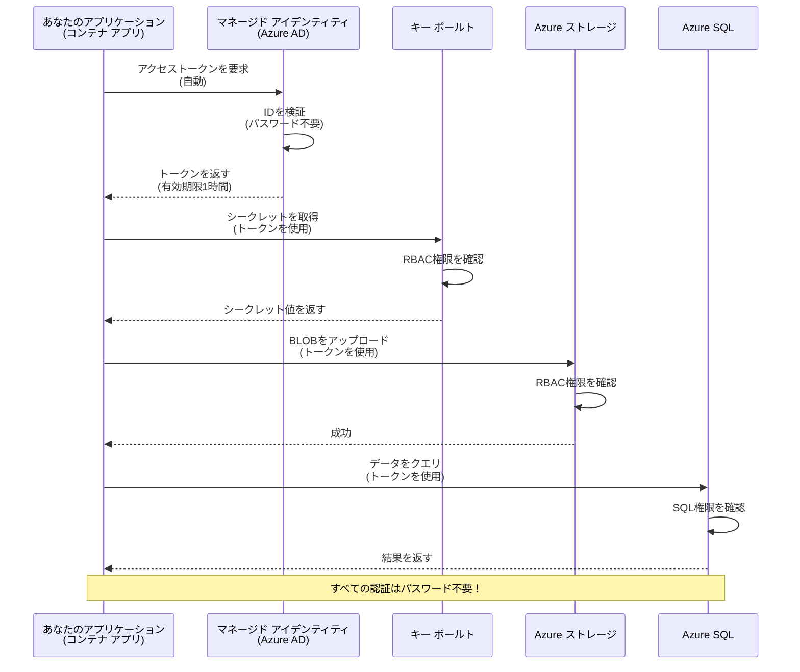
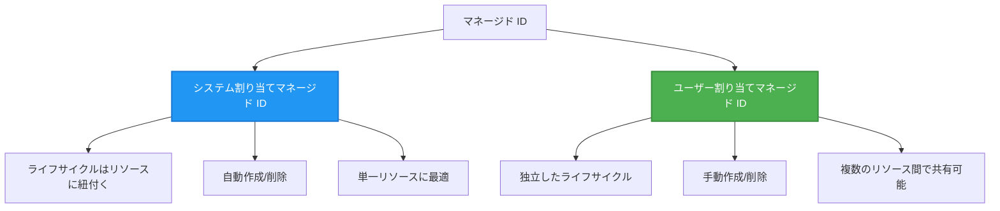

# Authentication Patterns and Managed Identity

⏱️ **推定時間**: 45-60 分 | 💰 **コスト影響**: 無料（追加料金なし） | ⭐ **複雑さ**: 中級

**📚 学習経路:**
- ← 前へ: [構成管理](configuration.md) - 環境変数とシークレットの管理
- 🎯 **現在地**: 認証とセキュリティ（Managed Identity、Key Vault、セキュアなパターン）
- → 次へ: [最初のプロジェクト](first-project.md) - 最初の AZD アプリを構築する
- 🏠 [コースホーム](../../README.md)

---

## このレッスンで学ぶこと

このレッスンを完了すると、以下ができるようになります:
- Azure の認証パターン（キー、接続文字列、Managed Identity）を理解する
- パスワード不要の認証のために **Managed Identity** を実装する
- **Azure Key Vault** 統合でシークレットを保護する
- AZD デプロイのために **ロール ベースのアクセス制御 (RBAC)** を構成する
- Container Apps や Azure サービスでセキュリティのベストプラクティスを適用する
- キー ベースの認証から ID ベースの認証へ移行する

## なぜ Managed Identity が重要か

### 問題点: 伝統的な認証

**Managed Identity 導入前:**
```javascript
// ❌ セキュリティリスク: コード内にハードコーディングされた機密情報
const connectionString = "Server=mydb.database.windows.net;User=admin;Password=P@ssw0rd123";
const storageKey = "xK7mN9pQ2wR5tY8uI0oP3aS6dF1gH4jK...";
const cosmosKey = "C2x7B9n4M1p8Q5w3E6r0T2y5U8i1O4p7...";
```

**問題点:**
- 🔴 **コードや設定ファイル、環境変数にシークレットが露出**
- 🔴 **資格情報のローテーションにコード変更と再デプロイが必要**
- 🔴 **監査が困難** - 誰がいつ何にアクセスしたか？
- 🔴 **スプロール** - シークレットが複数のシステムに散在
- 🔴 **コンプライアンスリスク** - セキュリティ監査に失敗する可能性

### 解決策: Managed Identity

**Managed Identity 導入後:**
```javascript
// ✅ セキュア: コード内に秘密情報はありません
const credential = new DefaultAzureCredential();
const client = new BlobServiceClient(
  "https://mystorageaccount.blob.core.windows.net",
  credential  // Azure は認証を自動的に処理します
);
```

**利点:**
- ✅ **コードや設定にシークレットがゼロ**
- ✅ **自動ローテーション** - Azure が管理
- ✅ **Azure AD ログで完全な監査トレイル**
- ✅ **集中管理されたセキュリティ** - Azure ポータルで管理
- ✅ **コンプライアンス対応** - セキュリティ基準を満たす

**例え**: 伝統的な認証は複数の物理鍵を持ち歩くようなものです。Managed Identity は、誰であるかに基づいて自動的にアクセスを付与するセキュリティバッジのようなものです—失くしたり複製したり回転させる鍵が不要になります。

---

## アーキテクチャの概要

### Managed Identity を使った認証フロー


### Managed Identity の種類


| 機能 | System-Assigned | User-Assigned |
|---------|----------------|---------------|
| **ライフサイクル** | リソースに紐付く | 独立している |
| **作成** | リソース作成時に自動 | 手動で作成 |
| **削除** | リソース削除時に削除される | リソース削除後も存続 |
| **共有** | 単一リソースのみ | 複数のリソースで共有可能 |
| **ユースケース** | 単純なシナリオ | 複数リソースにまたがる複雑なシナリオ |
| **AZD デフォルト** | ✅ 推奨 | 任意 |

---

## 前提条件

### 必要なツール

前のレッスンですでにインストールしていることを想定しています:

```bash
# Azure Developer CLI を確認
azd version
# ✅ 期待される: azd バージョン 1.0.0 以上

# Azure CLI を確認
az --version
# ✅ 期待される: azure-cli 2.50.0 以上
```

### Azure の要件

- 有効な Azure サブスクリプション
- 以下の権限:
  - Managed Identity の作成
  - RBAC ロールの割り当て
  - Key Vault リソースの作成
  - Container Apps のデプロイ

### 知識の前提

以下を完了していることが望ましい:
- [Installation Guide](installation.md) - AZD セットアップ
- [AZD Basics](azd-basics.md) - コア概念
- [Configuration Management](configuration.md) - 環境変数

---

## レッスン 1: 認証パターンの理解

### パターン 1: 接続文字列（レガシー - 回避推奨）

**仕組み:**
```bash
# 接続文字列に認証情報が含まれています
STORAGE_CONNECTION_STRING="DefaultEndpointsProtocol=https;AccountName=myaccount;AccountKey=xK7mN9pQ2wR5..."
COSMOS_CONNECTION_STRING="AccountEndpoint=https://myaccount.documents.azure.com:443/;AccountKey=C2x7..."
SQL_CONNECTION_STRING="Server=myserver.database.windows.net;User=admin;Password=P@ssw0rd..."
```

**問題点:**
- ❌ 環境変数にシークレットが見える
- ❌ デプロイシステムにログとして残る
- ❌ ローテーションが困難
- ❌ アクセスの監査トレイルがない

**使用タイミング:** ローカル開発時のみ、決して本番では使用しない。

---

### パターン 2: Key Vault リファレンス（改善）

**仕組み:**
```bicep
// Store secret in Key Vault
resource keyVault 'Microsoft.KeyVault/vaults@2023-02-01' = {
  name: 'mykv'
  properties: {
    enableRbacAuthorization: true
  }
}

// Reference in Container App
env: [
  {
    name: 'STORAGE_KEY'
    secretRef: 'storage-key'  // References Key Vault
  }
]
```

**利点:**
- ✅ シークレットが Key Vault に安全に保存される
- ✅ シークレットの一元管理
- ✅ コード変更なしでローテーション可能

**制限事項:**
- ⚠️ 依然としてキー/パスワードを使用している
- ⚠️ Key Vault へのアクセス管理が必要

**使用タイミング:** 接続文字列から Managed Identity へ移行するための移行ステップ。

---

### パターン 3: Managed Identity（ベストプラクティス）

**仕組み:**
```bicep
// Enable managed identity
resource containerApp 'Microsoft.App/containerApps@2023-05-01' = {
  name: 'myapp'
  identity: {
    type: 'SystemAssigned'  // Automatically creates identity
  }
}

// Grant permissions
resource roleAssignment 'Microsoft.Authorization/roleAssignments@2022-04-01' = {
  scope: storageAccount
  properties: {
    roleDefinitionId: storageBlobDataContributorRole
    principalId: containerApp.identity.principalId
  }
}
```

**アプリケーションコード:**
```javascript
// 秘密は必要ありません！
const { DefaultAzureCredential } = require('@azure/identity');
const { BlobServiceClient } = require('@azure/storage-blob');

const credential = new DefaultAzureCredential();
const blobServiceClient = new BlobServiceClient(
  'https://mystorageaccount.blob.core.windows.net',
  credential
);
```

**利点:**
- ✅ コード/設定にシークレットがゼロ
- ✅ 資格情報の自動ローテーション
- ✅ 完全な監査トレイル
- ✅ RBAC ベースの権限管理
- ✅ コンプライアンス対応

**使用タイミング:** 本番アプリケーションでは常に使用する。

---

## レッスン 2: AZD での Managed Identity 実装

### ステップバイステップの実装

Managed Identity を使用して Azure Storage と Key Vault にアクセスするセキュアな Container App を構築します。

### プロジェクト構成

```
secure-app/
├── azure.yaml                 # AZD configuration
├── infra/
│   ├── main.bicep            # Main infrastructure
│   ├── core/
│   │   ├── identity.bicep    # Managed identity setup
│   │   ├── keyvault.bicep    # Key Vault configuration
│   │   └── storage.bicep     # Storage with RBAC
│   └── app/
│       └── container-app.bicep
└── src/
    ├── app.js                # Application code
    ├── package.json
    └── Dockerfile
```

### 1. AZD の構成 (azure.yaml)

```yaml
name: secure-app
metadata:
  template: secure-app@1.0.0

services:
  api:
    project: ./src
    language: js
    host: containerapp

# Enable managed identity (AZD handles this automatically)
```

### 2. インフラ: Managed Identity を有効化

**File: `infra/main.bicep`**

```bicep
targetScope = 'subscription'

param environmentName string
param location string = 'eastus'

var tags = { 'azd-env-name': environmentName }

// Resource group
resource rg 'Microsoft.Resources/resourceGroups@2021-04-01' = {
  name: 'rg-${environmentName}'
  location: location
  tags: tags
}

// Storage Account
module storage './core/storage.bicep' = {
  name: 'storage'
  scope: rg
  params: {
    name: 'st${uniqueString(rg.id)}'
    location: location
    tags: tags
  }
}

// Key Vault
module keyVault './core/keyvault.bicep' = {
  name: 'keyvault'
  scope: rg
  params: {
    name: 'kv-${uniqueString(rg.id)}'
    location: location
    tags: tags
  }
}

// Container App with Managed Identity
module containerApp './app/container-app.bicep' = {
  name: 'container-app'
  scope: rg
  params: {
    name: 'ca-${environmentName}'
    location: location
    tags: tags
    storageAccountName: storage.outputs.name
    keyVaultName: keyVault.outputs.name
  }
}

// Grant Container App access to Storage
module storageRoleAssignment './core/role-assignment.bicep' = {
  name: 'storage-role'
  scope: rg
  params: {
    principalId: containerApp.outputs.identityPrincipalId
    roleDefinitionId: 'ba92f5b4-2d11-453d-a403-e96b0029c9fe'  // Storage Blob Data Contributor
    targetResourceId: storage.outputs.id
  }
}

// Grant Container App access to Key Vault
module kvRoleAssignment './core/role-assignment.bicep' = {
  name: 'kv-role'
  scope: rg
  params: {
    principalId: containerApp.outputs.identityPrincipalId
    roleDefinitionId: '4633458b-17de-408a-b874-0445c86b69e6'  // Key Vault Secrets User
    targetResourceId: keyVault.outputs.id
  }
}

// Outputs
output AZURE_STORAGE_ACCOUNT_NAME string = storage.outputs.name
output AZURE_KEY_VAULT_NAME string = keyVault.outputs.name
output APP_URL string = containerApp.outputs.url
```

### 3. System-Assigned Identity を持つ Container App

**File: `infra/app/container-app.bicep`**

```bicep
param name string
param location string
param tags object = {}
param storageAccountName string
param keyVaultName string

resource containerApp 'Microsoft.App/containerApps@2023-05-01' = {
  name: name
  location: location
  tags: tags
  identity: {
    type: 'SystemAssigned'  // 🔑 Enable managed identity
  }
  properties: {
    configuration: {
      ingress: {
        external: true
        targetPort: 3000
      }
    }
    template: {
      containers: [
        {
          name: 'api'
          image: 'myregistry.azurecr.io/api:latest'
          resources: {
            cpu: json('0.5')
            memory: '1Gi'
          }
          env: [
            {
              name: 'AZURE_STORAGE_ACCOUNT_NAME'
              value: storageAccountName
            }
            {
              name: 'AZURE_KEY_VAULT_NAME'
              value: keyVaultName
            }
            // 🔑 No secrets - managed identity handles authentication!
          ]
        }
      ]
    }
  }
}

// Output the identity for RBAC assignments
output identityPrincipalId string = containerApp.identity.principalId
output id string = containerApp.id
output url string = 'https://${containerApp.properties.configuration.ingress.fqdn}'
```

### 4. RBAC ロール割り当てモジュール

**File: `infra/core/role-assignment.bicep`**

```bicep
param principalId string
param roleDefinitionId string  // Azure built-in role ID
param targetResourceId string

resource roleAssignment 'Microsoft.Authorization/roleAssignments@2022-04-01' = {
  name: guid(principalId, roleDefinitionId, targetResourceId)
  scope: resourceId('Microsoft.Resources/resourceGroups', resourceGroup().name)
  properties: {
    roleDefinitionId: subscriptionResourceId('Microsoft.Authorization/roleDefinitions', roleDefinitionId)
    principalId: principalId
    principalType: 'ServicePrincipal'
  }
}

output id string = roleAssignment.id
```

### 5. Managed Identity を使用するアプリケーションコード

**File: `src/app.js`**

```javascript
const express = require('express');
const { DefaultAzureCredential } = require('@azure/identity');
const { BlobServiceClient } = require('@azure/storage-blob');
const { SecretClient } = require('@azure/keyvault-secrets');

const app = express();
const PORT = process.env.PORT || 3000;

// 🔑 資格情報を初期化（マネージド ID で自動的に動作）
const credential = new DefaultAzureCredential();

// Azure Storage の設定
const storageAccountName = process.env.AZURE_STORAGE_ACCOUNT_NAME;
const blobServiceClient = new BlobServiceClient(
  `https://${storageAccountName}.blob.core.windows.net`,
  credential  // キーは不要です！
);

// Key Vault の設定
const keyVaultName = process.env.AZURE_KEY_VAULT_NAME;
const secretClient = new SecretClient(
  `https://${keyVaultName}.vault.azure.net`,
  credential  // キーは不要です！
);

// ヘルスチェック
app.get('/health', (req, res) => {
  res.json({ status: 'healthy', authentication: 'managed-identity' });
});

// ファイルを Blob ストレージにアップロード
app.post('/upload', async (req, res) => {
  try {
    const containerClient = blobServiceClient.getContainerClient('uploads');
    await containerClient.createIfNotExists();
    
    const blobName = `file-${Date.now()}.txt`;
    const blockBlobClient = containerClient.getBlockBlobClient(blobName);
    
    await blockBlobClient.upload('Hello from managed identity!', 30);
    
    res.json({
      success: true,
      blobName: blobName,
      message: 'File uploaded using managed identity!'
    });
  } catch (error) {
    console.error('Upload error:', error);
    res.status(500).json({ error: error.message });
  }
});

// Key Vault からシークレットを取得
app.get('/secret/:name', async (req, res) => {
  try {
    const secretName = req.params.name;
    const secret = await secretClient.getSecret(secretName);
    
    res.json({
      name: secretName,
      value: secret.value,
      message: 'Secret retrieved using managed identity!'
    });
  } catch (error) {
    console.error('Secret error:', error);
    res.status(500).json({ error: error.message });
  }
});

// Blob コンテナーを一覧表示（読み取りアクセスを示す）
app.get('/containers', async (req, res) => {
  try {
    const containers = [];
    for await (const container of blobServiceClient.listContainers()) {
      containers.push(container.name);
    }
    
    res.json({
      containers: containers,
      count: containers.length,
      message: 'Containers listed using managed identity!'
    });
  } catch (error) {
    console.error('List error:', error);
    res.status(500).json({ error: error.message });
  }
});

app.listen(PORT, () => {
  console.log(`Secure API listening on port ${PORT}`);
  console.log('Authentication: Managed Identity (passwordless)');
});
```

**File: `src/package.json`**

```json
{
  "name": "secure-app",
  "version": "1.0.0",
  "dependencies": {
    "express": "^4.18.2",
    "@azure/identity": "^4.0.0",
    "@azure/storage-blob": "^12.17.0",
    "@azure/keyvault-secrets": "^4.7.0"
  },
  "scripts": {
    "start": "node app.js"
  }
}
```

### 6. デプロイとテスト

```bash
# AZD 環境を初期化する
azd init

# インフラとアプリケーションをデプロイする
azd up

# アプリのURLを取得する
APP_URL=$(azd env get-values | grep APP_URL | cut -d '=' -f2 | tr -d '"')

# ヘルスチェックをテストする
curl $APP_URL/health
```

**✅ 期待される出力:**
```json
{
  "status": "healthy",
  "authentication": "managed-identity"
}
```

**Blob アップロードのテスト:**
```bash
curl -X POST $APP_URL/upload
```

**✅ 期待される出力:**
```json
{
  "success": true,
  "blobName": "file-1700404800000.txt",
  "message": "File uploaded using managed identity!"
}
```

**コンテナー一覧のテスト:**
```bash
curl $APP_URL/containers
```

**✅ 期待される出力:**
```json
{
  "containers": ["uploads"],
  "count": 1,
  "message": "Containers listed using managed identity!"
}
```

---

## 一般的な Azure RBAC ロール

### Managed Identity 用の組み込みロール ID

| Service | Role Name | Role ID | Permissions |
|---------|-----------|---------|-------------|
| **Storage** | Storage Blob Data Reader | `2a2b9908-6b94-4a3d-8e5a-a7d8f8cc8a12` | ブロブとコンテナーの読み取り |
| **Storage** | Storage Blob Data Contributor | `ba92f5b4-2d11-453d-a403-e96b0029c9fe` | ブロブの読み取り、書き込み、削除 |
| **Storage** | Storage Queue Data Contributor | `974c5e8b-45b9-4653-ba55-5f855dd0fb88` | キューメッセージの読み取り、書き込み、削除 |
| **Key Vault** | Key Vault Secrets User | `4633458b-17de-408a-b874-0445c86b69e6` | シークレットの読み取り |
| **Key Vault** | Key Vault Secrets Officer | `b86a8fe4-44ce-4948-aee5-eccb2c155cd7` | シークレットの読み取り、書き込み、削除 |
| **Cosmos DB** | Cosmos DB Built-in Data Reader | `00000000-0000-0000-0000-000000000001` | Cosmos DB データの読み取り |
| **Cosmos DB** | Cosmos DB Built-in Data Contributor | `00000000-0000-0000-0000-000000000002` | Cosmos DB データの読み取り、書き込み |
| **SQL Database** | SQL DB Contributor | `9b7fa17d-e63e-47b0-bb0a-15c516ac86ec` | SQL データベースの管理 |
| **Service Bus** | Azure Service Bus Data Owner | `090c5cfd-751d-490a-894a-3ce6f1109419` | メッセージの送受信および管理 |

### ロール ID の確認方法

```bash
# 組み込みロールをすべて列挙する
az role definition list --query "[].{Name:roleName, ID:name}" --output table

# 特定のロールを検索する
az role definition list --query "[?contains(roleName, 'Storage Blob')].{Name:roleName, ID:name}" --output table

# ロールの詳細を取得する
az role definition list --name "Storage Blob Data Contributor"
```

---

## 実践演習

### 演習 1: 既存アプリに Managed Identity を有効化 ⭐⭐（中級）

**目標**: 既存の Container App デプロイに Managed Identity を追加する

**シナリオ**: 接続文字列を使っている Container App を Managed Identity に変換する

**開始点**: 次の構成を持つ Container App:

```bicep
// ❌ Current: Using connection string
env: [
  {
    name: 'STORAGE_CONNECTION_STRING'
    secretRef: 'storage-connection'
  }
]
```

**手順**:

1. **Bicep で Managed Identity を有効化:**

```bicep
resource containerApp 'Microsoft.App/containerApps@2023-05-01' = {
  name: 'myapp'
  identity: {
    type: 'SystemAssigned'  // Add this
  }
  // ... rest of configuration
}
```

2. **Storage へのアクセスを付与:**

```bicep
// Get storage account reference
resource storageAccount 'Microsoft.Storage/storageAccounts@2023-01-01' existing = {
  name: storageAccountName
}

// Assign role
resource roleAssignment 'Microsoft.Authorization/roleAssignments@2022-04-01' = {
  name: guid(containerApp.id, 'ba92f5b4-2d11-453d-a403-e96b0029c9fe', storageAccount.id)
  scope: storageAccount
  properties: {
    roleDefinitionId: subscriptionResourceId('Microsoft.Authorization/roleDefinitions', 'ba92f5b4-2d11-453d-a403-e96b0029c9fe')
    principalId: containerApp.identity.principalId
    principalType: 'ServicePrincipal'
  }
}
```

3. **アプリケーションコードを更新:**

**変更前（接続文字列）:**
```javascript
const { BlobServiceClient } = require('@azure/storage-blob');

const blobServiceClient = BlobServiceClient.fromConnectionString(
  process.env.STORAGE_CONNECTION_STRING
);
```

**変更後（Managed Identity）:**
```javascript
const { DefaultAzureCredential } = require('@azure/identity');
const { BlobServiceClient } = require('@azure/storage-blob');

const credential = new DefaultAzureCredential();
const blobServiceClient = new BlobServiceClient(
  `https://${process.env.STORAGE_ACCOUNT_NAME}.blob.core.windows.net`,
  credential
);
```

4. **環境変数を更新:**

```bicep
env: [
  {
    name: 'STORAGE_ACCOUNT_NAME'
    value: storageAccountName  // Just the name, no secrets!
  }
  // Remove STORAGE_CONNECTION_STRING
]
```

5. **デプロイしてテスト:**

```bash
# 再デプロイ
azd up

# まだ正しく動作することを確認する
curl https://myapp.azurecontainerapps.io/upload
```

**✅ 成功基準:**
- ✅ アプリがエラーなくデプロイされる
- ✅ ストレージ操作が機能する（アップロード、一覧表示、ダウンロード）
- ✅ 環境変数に接続文字列が存在しない
- ✅ Azure ポータルの「Identity」ブレードで ID が表示される

**検証:**

```bash
# マネージド ID が有効になっているか確認する
az containerapp show \
  --name myapp \
  --resource-group rg-myapp \
  --query "identity.type"
# ✅ 期待値: "SystemAssigned"

# ロールの割り当てを確認する
az role assignment list \
  --assignee $(az containerapp show --name myapp --resource-group rg-myapp --query "identity.principalId" -o tsv) \
  --scope /subscriptions/{sub-id}/resourceGroups/rg-myapp/providers/Microsoft.Storage/storageAccounts/mystorageaccount
# ✅ 期待値: "Storage Blob Data Contributor" ロールが表示される
```

**所要時間**: 20-30 分

---

### 演習 2: ユーザー割り当て ID でのマルチサービスアクセス ⭐⭐⭐（上級）

**目標**: 複数の Container App で共有する user-assigned identity を作成する

**シナリオ**: 同じ Storage アカウントと Key Vault にアクセスする必要がある 3 つのマイクロサービスがある

**手順**:

1. **user-assigned identity を作成:**

**File: `infra/core/identity.bicep`**

```bicep
param name string
param location string
param tags object = {}

resource userAssignedIdentity 'Microsoft.ManagedIdentity/userAssignedIdentities@2023-01-31' = {
  name: name
  location: location
  tags: tags
}

output id string = userAssignedIdentity.id
output principalId string = userAssignedIdentity.properties.principalId
output clientId string = userAssignedIdentity.properties.clientId
```

2. **user-assigned identity にロールを割り当てる:**

```bicep
// In main.bicep
module userIdentity './core/identity.bicep' = {
  name: 'user-identity'
  scope: rg
  params: {
    name: 'id-${environmentName}'
    location: location
    tags: tags
  }
}

// Grant Storage access
resource storageRoleAssignment 'Microsoft.Authorization/roleAssignments@2022-04-01' = {
  name: guid(userIdentity.outputs.principalId, 'storage-contributor')
  scope: storageAccount
  properties: {
    roleDefinitionId: subscriptionResourceId('Microsoft.Authorization/roleDefinitions', 'ba92f5b4-2d11-453d-a403-e96b0029c9fe')
    principalId: userIdentity.outputs.principalId
    principalType: 'ServicePrincipal'
  }
}

// Grant Key Vault access
resource kvRoleAssignment 'Microsoft.Authorization/roleAssignments@2022-04-01' = {
  name: guid(userIdentity.outputs.principalId, 'kv-secrets-user')
  scope: keyVault
  properties: {
    roleDefinitionId: subscriptionResourceId('Microsoft.Authorization/roleDefinitions', '4633458b-17de-408a-b874-0445c86b69e6')
    principalId: userIdentity.outputs.principalId
    principalType: 'ServicePrincipal'
  }
}
```

3. **複数の Container App に ID を割り当てる:**

```bicep
resource apiGateway 'Microsoft.App/containerApps@2023-05-01' = {
  name: 'api-gateway'
  identity: {
    type: 'UserAssigned'
    userAssignedIdentities: {
      '${userIdentity.outputs.id}': {}
    }
  }
  // ... rest of config
}

resource productService 'Microsoft.App/containerApps@2023-05-01' = {
  name: 'product-service'
  identity: {
    type: 'UserAssigned'
    userAssignedIdentities: {
      '${userIdentity.outputs.id}': {}
    }
  }
  // ... rest of config
}

resource orderService 'Microsoft.App/containerApps@2023-05-01' = {
  name: 'order-service'
  identity: {
    type: 'UserAssigned'
    userAssignedIdentities: {
      '${userIdentity.outputs.id}': {}
    }
  }
  // ... rest of config
}
```

4. **アプリケーションコード（すべてのサービスが同じパターンを使用）:**

```javascript
const { DefaultAzureCredential, ManagedIdentityCredential } = require('@azure/identity');

// ユーザー割り当ての ID を使用する場合は、クライアント ID を指定してください
const credential = new ManagedIdentityCredential(
  process.env.AZURE_CLIENT_ID  // ユーザー割り当てアイデンティティのクライアント ID
);

// または DefaultAzureCredential を使用してください（自動検出）
const credential = new DefaultAzureCredential();

const blobServiceClient = new BlobServiceClient(
  `https://${process.env.STORAGE_ACCOUNT_NAME}.blob.core.windows.net`,
  credential
);
```

5. **デプロイして検証:**

```bash
azd up

# すべてのサービスがストレージにアクセスできるかテストする
curl https://api-gateway.azurecontainerapps.io/upload
curl https://product-service.azurecontainerapps.io/upload
curl https://order-service.azurecontainerapps.io/upload
```

**✅ 成功基準:**
- ✅ 3 つのサービスで 1 つの ID を共有している
- ✅ すべてのサービスが Storage と Key Vault にアクセスできる
- ✅ サービスを 1 つ削除しても ID は存続する
- ✅ 権限を集中管理できる

**User-Assigned Identity の利点:**
- 管理すべき ID が一つ
- サービス間で一貫した権限
- サービス削除時も存続
- 複雑なアーキテクチャに適している

**所要時間**: 30-40 分

---

### 演習 3: Key Vault シークレットのローテーション実装 ⭐⭐⭐（上級）

**目標**: サードパーティ API キーを Key Vault に保存し、Managed Identity を使ってアクセスする

**シナリオ**: アプリが外部 API（OpenAI、Stripe、SendGrid など）を呼び出す必要があり、API キーが必要

**手順**:

1. **RBAC を使った Key Vault を作成:**

**File: `infra/core/keyvault.bicep`**

```bicep
param name string
param location string
param tags object = {}

resource keyVault 'Microsoft.KeyVault/vaults@2023-02-01' = {
  name: name
  location: location
  tags: tags
  properties: {
    enableRbacAuthorization: true  // Use RBAC instead of access policies
    sku: {
      family: 'A'
      name: 'standard'
    }
    tenantId: subscription().tenantId
    enableSoftDelete: true
    softDeleteRetentionInDays: 90
  }
}

// Allow Container App to read secrets
output id string = keyVault.id
output name string = keyVault.name
output uri string = keyVault.properties.vaultUri
```

2. **Key Vault にシークレットを保存:**

```bash
# Key Vault の名前を取得する
KV_NAME=$(azd env get-values | grep AZURE_KEY_VAULT_NAME | cut -d '=' -f2 | tr -d '"')

# サードパーティの API キーを保存する
az keyvault secret set \
  --vault-name $KV_NAME \
  --name "OpenAI-ApiKey" \
  --value "sk-proj-xxxxxxxxxxxxx"

az keyvault secret set \
  --vault-name $KV_NAME \
  --name "Stripe-ApiKey" \
  --value "sk_live_xxxxxxxxxxxxx"

az keyvault secret set \
  --vault-name $KV_NAME \
  --name "SendGrid-ApiKey" \
  --value "SG.xxxxxxxxxxxxx"
```

3. **シークレットを取得するアプリケーションコード:**

**File: `src/config.js`**

```javascript
const { DefaultAzureCredential } = require('@azure/identity');
const { SecretClient } = require('@azure/keyvault-secrets');

class Config {
  constructor() {
    this.credential = new DefaultAzureCredential();
    this.secretClient = new SecretClient(
      `https://${process.env.AZURE_KEY_VAULT_NAME}.vault.azure.net`,
      this.credential
    );
    this.cache = {};
  }

  async getSecret(secretName) {
    // まずキャッシュを確認する
    if (this.cache[secretName]) {
      return this.cache[secretName];
    }

    try {
      const secret = await this.secretClient.getSecret(secretName);
      this.cache[secretName] = secret.value;
      console.log(`✅ Retrieved secret: ${secretName}`);
      return secret.value;
    } catch (error) {
      console.error(`❌ Failed to get secret ${secretName}:`, error.message);
      throw error;
    }
  }

  async getOpenAIKey() {
    return this.getSecret('OpenAI-ApiKey');
  }

  async getStripeKey() {
    return this.getSecret('Stripe-ApiKey');
  }

  async getSendGridKey() {
    return this.getSecret('SendGrid-ApiKey');
  }
}

module.exports = new Config();
```

4. **アプリケーションでシークレットを使用:**

**File: `src/app.js`**

```javascript
const express = require('express');
const config = require('./config');
const { OpenAI } = require('openai');

const app = express();

// Key Vault から取得したキーで OpenAI を初期化する
let openaiClient;

async function initializeServices() {
  const openaiKey = await config.getOpenAIKey();
  openaiClient = new OpenAI({ apiKey: openaiKey });
  console.log('✅ Services initialized with secrets from Key Vault');
}

// 起動時に呼び出す
initializeServices().catch(console.error);

app.post('/chat', async (req, res) => {
  try {
    const completion = await openaiClient.chat.completions.create({
      model: 'gpt-4',
      messages: [{ role: 'user', content: 'Hello!' }]
    });
    
    res.json({
      response: completion.choices[0].message.content,
      authentication: 'Key from Key Vault via Managed Identity'
    });
  } catch (error) {
    res.status(500).json({ error: error.message });
  }
});

app.listen(3000, () => {
  console.log('Secure API with Key Vault integration running');
});
```

5. **デプロイしてテスト:**

```bash
azd up

# APIキーが正しく機能するかテストする
curl -X POST https://myapp.azurecontainerapps.io/chat \
  -H "Content-Type: application/json" \
  -d '{"message":"Hello AI"}'
```

**✅ 成功基準:**
- ✅ コードや環境変数に API キーが存在しない
- ✅ アプリが Key Vault からキーを取得する
- ✅ サードパーティ API が正しく動作する
- ✅ コード変更なしでキーをローテーションできる

**シークレットをローテーションする:**

```bash
# Key Vault のシークレットを更新する
az keyvault secret set \
  --vault-name $KV_NAME \
  --name "OpenAI-ApiKey" \
  --value "sk-proj-NEW_KEY_HERE"

# 新しいキーを反映するためにアプリを再起動する
az containerapp revision restart \
  --name myapp \
  --resource-group rg-myapp
```

**所要時間**: 25-35 分

---

## 知識チェックポイント

### 1. 認証パターン ✓

理解度をテスト:

- [ ] **Q1**: 主要な認証パターンは何ですか？ 
  - **A**: 接続文字列（レガシー）、Key Vault リファレンス（移行）、Managed Identity（ベスト）

- [ ] **Q2**: なぜ Managed Identity は接続文字列より優れているのか？
  - **A**: コードにシークレットがない、自動ローテーション、完全な監査トレイル、RBAC ベースの権限

- [ ] **Q3**: システム割り当て ID の代わりにユーザー割り当て ID を使うのはどんな場合？
  - **A**: 複数のリソースで ID を共有する場合や、ID のライフサイクルをリソースと独立させたい場合

**ハンズオン検証:**
```bash
# アプリが使用しているアイデンティティの種類を確認する
az containerapp show \
  --name myapp \
  --resource-group rg-myapp \
  --query "identity.type"

# そのアイデンティティのすべてのロール割り当てを一覧表示する
az role assignment list \
  --assignee $(az containerapp show --name myapp --resource-group rg-myapp --query "identity.principalId" -o tsv)
```

---

### 2. RBAC と権限 ✓

理解度をテスト:

- [ ] **Q1**: "Storage Blob Data Contributor" のロール ID は？
  - **A**: `ba92f5b4-2d11-453d-a403-e96b0029c9fe`

- [ ] **Q2**: "Key Vault Secrets User" はどのような権限を与えるか？
  - **A**: シークレットの読み取り専用（作成、更新、削除は不可）

- [ ] **Q3**: Container App に Azure SQL へのアクセスを付与するにはどうするか？
  - **A**: "SQL DB Contributor" ロールを割り当てるか、SQL の Azure AD 認証を構成する

**ハンズオン検証:**
```bash
# 特定のロールを見つける
az role definition list --name "Storage Blob Data Contributor"

# 自分のIDに割り当てられているロールを確認する
PRINCIPAL_ID=$(az containerapp show --name myapp --resource-group rg-myapp --query "identity.principalId" -o tsv)
az role assignment list --assignee $PRINCIPAL_ID --output table
```

---

### 3. Key Vault 統合 ✓
- [ ] **Q1**: Key Vaultでアクセスポリシーの代わりにRBACを有効にするにはどうすればよいですか?
  - **A**: Bicepで`enableRbacAuthorization: true`を設定します

- [ ] **Q2**: 管理対象 ID の認証を扱う Azure SDK ライブラリはどれですか?
  - **A**: `@azure/identity` と `DefaultAzureCredential` クラス

- [ ] **Q3**: Key Vault のシークレットはキャッシュにどのくらいの期間保持されますか?
  - **A**: アプリケーション依存です。独自のキャッシュ戦略を実装してください

**ハンズオン検証:**
```bash
# Key Vault へのアクセスをテスト
az keyvault secret show \
  --vault-name $KV_NAME \
  --name "OpenAI-ApiKey" \
  --query "value"

# RBAC が有効になっているか確認
az keyvault show \
  --name $KV_NAME \
  --query "properties.enableRbacAuthorization"
# ✅ 期待値: true
```

---

## セキュリティ ベストプラクティス

### ✅ 実行すること:

1. **常に本番ではマネージド ID を使用する**
   ```bicep
   identity: {
     type: 'SystemAssigned'
   }
   ```

2. **最小権限の RBAC ロールを使用する**
   - 可能な場合は "Reader" ロールを使用する
   - 必要でない限り "Owner" や "Contributor" を避ける

3. **サードパーティのキーを Key Vault に保管する**
   ```javascript
   const apiKey = await secretClient.getSecret('ThirdPartyApiKey');
   ```

4. **監査ログを有効にする**
   ```bicep
   diagnosticSettings: {
     logs: [{ category: 'AuditEvent', enabled: true }]
   }
   ```

5. **開発/ステージング/本番で異なる ID を使用する**
   ```bash
   azd env new dev
   azd env new staging
   azd env new prod
   ```

6. **シークレットを定期的にローテーションする**
   - Key Vault のシークレットに有効期限を設定する
   - Azure Functions でローテーションを自動化する

### ❌ 実行しないこと:

1. **シークレットを決してハードコードしない**
   ```javascript
   // ❌ 悪い
   const apiKey = "sk-proj-xxxxxxxxxxxxx";
   ```

2. **本番環境で接続文字列を使用しない**
   ```javascript
   // ❌ 悪い
   BlobServiceClient.fromConnectionString(process.env.STORAGE_CONNECTION_STRING)
   ```

3. **過剰な権限を付与しない**
   ```bicep
   // ❌ BAD - too much access
   roleDefinitionId: 'Owner'
   
   // ✅ GOOD - least privilege
   roleDefinitionId: 'Storage Blob Data Reader'
   ```

4. **シークレットをログ出力しない**
   ```javascript
   // ❌ 悪い
   console.log('API Key:', apiKey);
   
   // ✅ 良い
   console.log('API Key retrieved successfully');
   ```

5. **本番の ID を環境間で共有しない**
   ```bicep
   // ❌ BAD - same identity for dev and prod
   // ✅ GOOD - separate identities per environment
   ```

---

## トラブルシューティング ガイド

### 問題: Azure Storage にアクセスすると "Unauthorized" になる

**症状:**
```
Error: Unauthorized (403)
AuthorizationPermissionMismatch: This request is not authorized to perform this operation
```

**診断:**

```bash
# マネージド ID が有効か確認する
az containerapp show \
  --name myapp \
  --resource-group rg-myapp \
  --query "identity.type"
# ✅ 期待値: "SystemAssigned" または "UserAssigned"

# ロール割り当てを確認する
PRINCIPAL_ID=$(az containerapp show --name myapp --resource-group rg-myapp --query "identity.principalId" -o tsv)
az role assignment list --assignee $PRINCIPAL_ID

# 期待値: "Storage Blob Data Contributor" のようなロールが表示されるはず
```

**解決策:**

1. **正しい RBAC ロールを付与する:**
```bash
STORAGE_ID=$(az storage account show --name mystorageaccount --resource-group rg-myapp --query "id" -o tsv)
az role assignment create \
  --assignee $PRINCIPAL_ID \
  --role "Storage Blob Data Contributor" \
  --scope $STORAGE_ID
```

2. **伝播を待つ（5〜10分かかることがあります）:**
```bash
# ロール割り当ての状態を確認する
az role assignment list --assignee $PRINCIPAL_ID --scope $STORAGE_ID
```

3. **アプリケーションコードが正しい資格情報を使用していることを確認する:**
```javascript
// DefaultAzureCredential を使用していることを確認してください
const credential = new DefaultAzureCredential();
```

---

### 問題: Key Vault へのアクセスが拒否される

**症状:**
```
Error: Forbidden (403)
The user, group or application does not have secrets get permission
```

**診断:**

```bash
# Key Vault の RBAC が有効か確認する
az keyvault show \
  --name $KV_NAME \
  --query "properties.enableRbacAuthorization"
# ✅ 期待値: true

# ロール割り当てを確認する
az role assignment list \
  --assignee $PRINCIPAL_ID \
  --scope /subscriptions/{sub-id}/resourceGroups/rg-myapp/providers/Microsoft.KeyVault/vaults/$KV_NAME
```

**解決策:**

1. **Key VaultでRBACを有効にする:**
```bash
az keyvault update \
  --name $KV_NAME \
  --enable-rbac-authorization true
```

2. **Key Vault Secrets User ロールを付与する:**
```bash
KV_ID=$(az keyvault show --name $KV_NAME --query "id" -o tsv)
az role assignment create \
  --assignee $PRINCIPAL_ID \
  --role "Key Vault Secrets User" \
  --scope $KV_ID
```

---

### 問題: DefaultAzureCredential がローカルで失敗する

**症状:**
```
Error: DefaultAzureCredential failed to retrieve a token
CredentialUnavailableError: No credential available
```

**診断:**

```bash
# ログインしているか確認する
az account show

# Azure CLI の認証を確認する
az ad signed-in-user show
```

**解決策:**

1. **Azure CLI にログインする:**
```bash
az login
```

2. **Azure サブスクリプションを設定する:**
```bash
az account set --subscription "Your Subscription Name"
```

3. **ローカル開発では環境変数を使用する:**
```bash
export AZURE_TENANT_ID="your-tenant-id"
export AZURE_CLIENT_ID="your-client-id"
export AZURE_CLIENT_SECRET="your-client-secret"
```

4. **またはローカルで別の資格情報を使用する:**
```javascript
const { DefaultAzureCredential, AzureCliCredential } = require('@azure/identity');

// ローカル開発では AzureCliCredential を使用してください
const credential = process.env.NODE_ENV === 'production' 
  ? new DefaultAzureCredential()
  : new AzureCliCredential();
```

---

### 問題: ロールの割り当ての伝播に時間がかかる

**症状:**
- ロールは正常に割り当てられている
- それでも 403 エラーが発生する
- アクセスが断続的（時々動作し、時々動作しない）

**説明:**
Azure RBAC の変更はグローバルに反映されるまで 5〜10 分かかることがあります。

**解決策:**

```bash
# 待ってから再試行してください
echo "Waiting for RBAC propagation..."
sleep 300  # 5分待ってください

# アクセスをテストしてください
curl https://myapp.azurecontainerapps.io/upload

# それでも失敗する場合は、アプリを再起動してください
az containerapp revision restart \
  --name myapp \
  --resource-group rg-myapp
```

---

## コストに関する考慮事項

### マネージド ID のコスト

| リソース | コスト |
|----------|------|
| **Managed Identity** | 🆓 **無料** - 料金なし |
| **RBAC Role Assignments** | 🆓 **無料** - 料金なし |
| **Azure AD Token Requests** | 🆓 **無料** - 含まれる |
| **Key Vault Operations** | $0.03（10,000 操作ごと） |
| **Key Vault Storage** | $0.024 /シークレット/月 |

**マネージド ID がコストを削減する理由:**
- ✅ サービス間認証のための Key Vault 操作を排除する
- ✅ セキュリティインシデントを減少させる（資格情報漏えいがない）
- ✅ 運用負荷を低減する（手動ローテーションが不要）

**コスト比較の例（毎月）:**

| シナリオ | 接続文字列 | マネージド ID | 節約額 |
|----------|-------------------|-----------------|---------|
| 小規模アプリ（100万リクエスト） | ~$50（Key Vault + 操作） | ~$0 | $50/月 |
| 中規模アプリ（1000万リクエスト） | ~$200 | ~$0 | $200/月 |
| 大規模アプリ（1億リクエスト） | ~$1,500 | ~$0 | $1,500/月 |

---

## 詳しく学ぶ

### 公式ドキュメント
- [Azure マネージド ID](https://learn.microsoft.com/entra/identity/managed-identities-azure-resources/overview)
- [Azure RBAC](https://learn.microsoft.com/azure/role-based-access-control/overview)
- [Azure Key Vault](https://learn.microsoft.com/azure/key-vault/general/overview)
- [DefaultAzureCredential](https://learn.microsoft.com/dotnet/api/azure.identity.defaultazurecredential)

### SDK ドキュメント
- [@azure/identity (Node.js)](https://www.npmjs.com/package/@azure/identity)
- [Azure.Identity (C#)](https://www.nuget.org/packages/Azure.Identity/)
- [azure-identity (Python)](https://pypi.org/project/azure-identity/)

### このコースの次のステップ
- ← 前へ: [構成管理](configuration.md)
- → 次へ: [最初のプロジェクト](first-project.md)
- 🏠 [コースホーム](../../README.md)

### 関連する例
- [Azure OpenAI チャットの例](../../../../examples/azure-openai-chat) - Azure OpenAI に対してマネージド ID を使用
- [マイクロサービスの例](../../../../examples/microservices) - マルチサービス認証パターン

---

## まとめ

**学んだこと:**
- ✅ 3つの認証パターン（接続文字列、Key Vault、マネージド ID）
- ✅ AZD でマネージド ID を有効化および設定する方法
- ✅ Azure サービス向けの RBAC ロール割り当て
- ✅ サードパーティのシークレットのための Key Vault 統合
- ✅ ユーザー割り当て ID とシステム割り当て ID の違い
- ✅ セキュリティのベストプラクティスとトラブルシューティング

**重要なポイント:**
1. **常に本番ではマネージド ID を使用する** - シークレットが不要、自動ローテーション
2. **最小権限の RBAC ロールを使用する** - 必要な権限のみ付与する
3. **サードパーティのキーを Key Vault に保管する** - シークレットを集中管理する
4. **環境ごとに ID を分離する** - 開発、ステージング、本番の分離
5. **監査ログを有効にする** - 誰が何にアクセスしたかを追跡する

**次のステップ:**
1. 上記の実践演習を完了する
2. 既存アプリを接続文字列からマネージド ID に移行する
3. セキュリティを最初から組み込んだ最初の AZD プロジェクトを構築する: [First Project](first-project.md)

---

<!-- CO-OP TRANSLATOR DISCLAIMER START -->
免責事項:
本書はAI翻訳サービス「Co-op Translator」(https://github.com/Azure/co-op-translator)を用いて翻訳されました。正確さには努めておりますが、自動翻訳には誤りや不正確な箇所が含まれる可能性があることをご承知おきください。原文（原語版）が正式な基準となります。重要な情報については、専門の人間による翻訳を推奨します。本翻訳の利用により生じた誤解や解釈の相違について、当社は責任を負いません。
<!-- CO-OP TRANSLATOR DISCLAIMER END -->