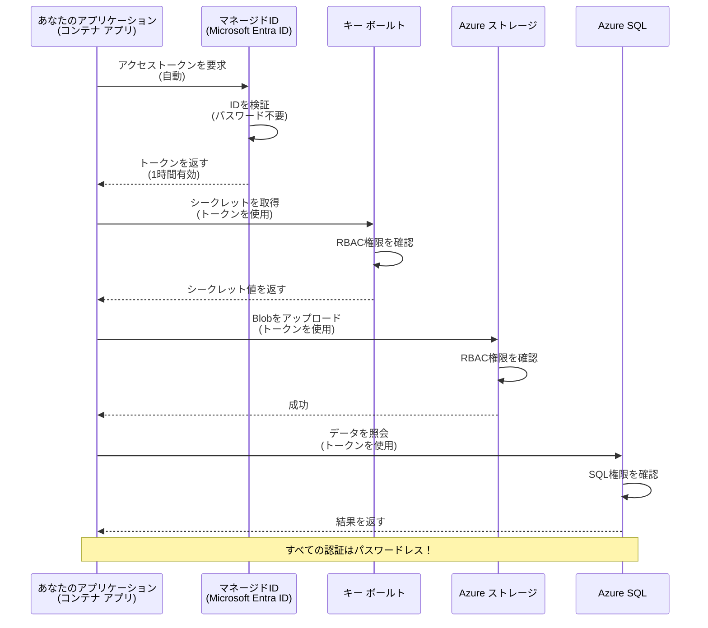
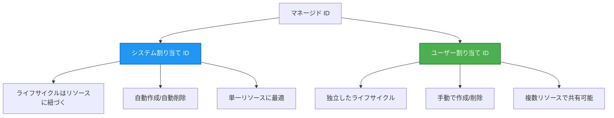

# 認証パターンとマネージドID

⏱️ <strong>推定時間</strong>: 45-60 分 | 💰 <strong>コスト影響</strong>: 無料（追加料金なし） | ⭐ <strong>複雑さ</strong>: 中級

**📚 学習パス:**
- ← 前: [構成管理](configuration.md) - 環境変数とシークレットの管理
- 🎯 <strong>あなたはここ</strong>: 認証とセキュリティ（マネージドID、Key Vault、セキュアなパターン）
- → 次: [最初のプロジェクト](first-project.md) - 最初の AZD アプリケーションを構築
- 🏠 [コースホーム](../../README.md)

---

## このレッスンで学ぶこと

このレッスンを完了すると、以下が学べます：
- Azure の認証パターン（キー、接続文字列、マネージドID）を理解する
- パスワードレス認証のために **マネージドID** を実装する
- **Azure Key Vault** 統合でシークレットを保護する
- AZD デプロイのための **ロールベースアクセス制御（RBAC）** を構成する
- Container Apps と Azure サービスでセキュリティのベストプラクティスを適用する
- キー基盤の認証から ID 基盤の認証へ移行する

## マネージドID が重要な理由

### 問題点: 従来の認証

**マネージドID導入前:**
```javascript
// ❌ セキュリティリスク: コード内にハードコードされた機密情報
const connectionString = "Server=mydb.database.windows.net;User=admin;Password=P@ssw0rd123";
const storageKey = "xK7mN9pQ2wR5tY8uI0oP3aS6dF1gH4jK...";
const cosmosKey = "C2x7B9n4M1p8Q5w3E6r0T2y5U8i1O4p7...";
```

**問題点:**
- 🔴 **コード、設定ファイル、環境変数に露出したシークレット**
- 🔴 <strong>認証情報のローテーション</strong> - コード変更と再デプロイが必要
- 🔴 <strong>監査が大変</strong> - 誰がいつ何にアクセスしたか？
- 🔴 <strong>スプロール</strong> - シークレットが複数のシステムに散在
- 🔴 <strong>コンプライアンスリスク</strong> - セキュリティ監査に不合格

### 解決策: マネージドID

**マネージドID導入後:**
```javascript
// ✅ 安全: コードに機密情報は含まれていません
const credential = new DefaultAzureCredential();
const client = new BlobServiceClient(
  "https://mystorageaccount.blob.core.windows.net",
  credential  // Azure は認証を自動的に処理します
);
```

**利点:**
- ✅ <strong>コードや設定にシークレットが存在しない</strong>
- ✅ <strong>自動ローテーション</strong> - Azure が管理
- ✅ **Microsoft Entra ID ログの完全な監査トレイル**
- ✅ <strong>集中管理されたセキュリティ</strong> - Azure ポータルで管理
- ✅ <strong>コンプライアンス対応</strong> - セキュリティ基準を満たす

<strong>例え</strong>：従来の認証は複数の鍵をそれぞれの扉に持ち歩くようなものです。マネージドIDは、あなたが誰であるかに基づいて自動的にアクセスを許可する社員バッジのようなもので、紛失・複製・ローテーションする鍵は不要です。

---

## アーキテクチャ概要

### マネージドIDを使った認証フロー



### マネージドIDの種類



| 機能 | システム割り当て | ユーザー割り当て |
|---------|----------------|---------------|
| <strong>ライフサイクル</strong> | リソースに紐づく | 独立している |
| <strong>作成</strong> | リソース作成時に自動 | 手動で作成 |
| <strong>削除</strong> | リソース削除で削除される | リソース削除後も存続 |
| <strong>共有</strong> | 1 リソースのみ | 複数のリソースで共有可能 |
| <strong>ユースケース</strong> | 単純なシナリオ | 複数リソースの複雑なシナリオ |
| **AZD デフォルト** | ✅ 推奨 | オプション |

---

## 前提条件

### 必要なツール

前のレッスンで既にインストール済みであるべきもの：

```bash
# Azure Developer CLI を検証する
azd version
# ✅ 期待される: azd バージョン 1.0.0 以上

# Azure CLI を検証する
az --version
# ✅ 期待される: azure-cli 2.50.0 以上
```

### Azure の要件

- アクティブな Azure サブスクリプション
- 権限：
  - マネージドIDを作成する権限
  - RBAC ロールを割り当てる権限
  - Key Vault リソースを作成する権限
  - Container Apps をデプロイする権限

### 知識の前提

次を完了していること：
- [インストールガイド](installation.md) - AZD のセットアップ
- [AZD の基本](azd-basics.md) - 基本概念
- [構成管理](configuration.md) - 環境変数

---

## レッスン 1: 認証パターンの理解

### パターン 1: 接続文字列（レガシー - 回避）

**仕組み:**
```bash
# 接続文字列に認証情報が含まれています
STORAGE_CONNECTION_STRING="DefaultEndpointsProtocol=https;AccountName=myaccount;AccountKey=xK7mN9pQ2wR5..."
COSMOS_CONNECTION_STRING="AccountEndpoint=https://myaccount.documents.azure.com:443/;AccountKey=C2x7..."
SQL_CONNECTION_STRING="Server=myserver.database.windows.net;User=admin;Password=P@ssw0rd..."
```

**問題点:**
- ❌ シークレットが環境変数に露出する
- ❌ デプロイメントシステムにログとして残る
- ❌ ローテーションが難しい
- ❌ アクセスの監査トレイルがない

**使用時:** ローカル開発のみ。決して本番で使わない。

---

### パターン 2: Key Vault リファレンス（より良い）

**仕組み:**
```bicep
// Store secret in Key Vault
resource keyVault 'Microsoft.KeyVault/vaults@2023-02-01' = {
  name: 'mykv'
  properties: {
    enableRbacAuthorization: true
  }
}

// Reference in Container App
env: [
  {
    name: 'STORAGE_KEY'
    secretRef: 'storage-key'  // References Key Vault
  }
]
```

**利点:**
- ✅ シークレットが Key Vault に安全に保存される
- ✅ シークレットの集中管理
- ✅ コード変更なしでのローテーション

**制約:**
- ⚠️ 依然としてキー／パスワードを使用している
- ⚠️ Key Vault へのアクセス管理が必要

**使用時:** 接続文字列からマネージドIDへの移行ステップとして

---

### パターン 3: マネージドID（ベストプラクティス）

**仕組み:**
```bicep
// Enable managed identity
resource containerApp 'Microsoft.App/containerApps@2023-05-01' = {
  name: 'myapp'
  identity: {
    type: 'SystemAssigned'  // Automatically creates identity
  }
}

// Grant permissions
resource roleAssignment 'Microsoft.Authorization/roleAssignments@2022-04-01' = {
  scope: storageAccount
  properties: {
    roleDefinitionId: storageBlobDataContributorRole
    principalId: containerApp.identity.principalId
  }
}
```

**アプリケーションコード:**
```javascript
// 秘密は必要ありません！
const { DefaultAzureCredential } = require('@azure/identity');
const { BlobServiceClient } = require('@azure/storage-blob');

const credential = new DefaultAzureCredential();
const blobServiceClient = new BlobServiceClient(
  'https://mystorageaccount.blob.core.windows.net',
  credential
);
```

**利点:**
- ✅ コードや設定にシークレットが存在しない
- ✅ 自動認証情報ローテーション
- ✅ 完全な監査トレイル
- ✅ RBAC ベースの権限
- ✅ コンプライアンス対応

**使用時:** 常に。本番アプリケーションで使用する。

---

### パターン 4: サービスプリンシパル（CI/CD と自動化）

マネージドID は *Azure 内で実行されるリソース向け* のゴールドスタンダードです。ですが、CI/CD パイプラインのように **Azure の外** で実行されるもの — ビルドエージェント上やインタラクティブログインが使えないラップトップのスクリプトなど — はどうするでしょうか？そこで登場するのが <strong>サービスプリンシパル</strong> です：自分の認証情報を持つ非人間のアイデンティティで、自動化プロセスがその資格情報でサインインできます。

**仕組み:**

最小権限でリソースグループにスコープされたサービスプリンシパルを作成：

```bash
az ad sp create-for-rbac \
  --name "myapp-cicd" \
  --role contributor \
  --scopes /subscriptions/<sub-id>/resourceGroups/<rg-name>
```

これによりクライアント ID、クライアント シークレット、テナント ID が表示されます。azd はそれらで非対話的にサインインできます：

```bash
azd auth login \
  --client-id "<appId>" \
  --client-secret "<password>" \
  --tenant-id "<tenant>"
```

**シークレットよりフェデレーテッド認証情報（OIDC）を推奨します。** 長期有効なクライアントシークレットの代わりに、パイプラインが短期のトークンを交換するフェデレーテッド認証情報を構成してください—漏洩やローテーションするシークレットが不要になります：

```bash
azd auth login \
  --client-id "<appId>" \
  --federated-credential-provider "github" \
  --tenant-id "<tenant>"
```

> `azd pipeline config` はこれを自動で設定します。[第8章](../chapter-08-production/production-ai-practices.md) の CI/CD のウォークスルーを参照してください。

**利点:**
- ✅ Azure の外でも動作（ビルドエージェント、オンプレミス、他のクラウド）
- ✅ 単一のリソースグループに 1 つのロールでスコープ可能
- ✅ フェデレーテッド（OIDC）バリアントは保存されたシークレットを使わない

**トレードオフ:**
- ⚠️ シークレットベースのバリアントは慎重な保管とローテーションが必要
- ⚠️ シークレットが漏れると SP が持つ権限すべてが付与される — スコープは狭く保つ

**使用時:** マネージドID を使えない CI/CD パイプラインや自動化。クライアントシークレットより常に **フェデレーテッド/OIDC** バリアントを優先し、ワークロードが Azure 内で動作する場合はマネージドID を選択してください。

**認証情報の安全な保存方法:**
- シークレットをコミットしないこと—パイプラインのシークレットストアを使う（GitHub Actions の secrets、Azure DevOps の variable groups / Key Vault）。
- SP のスコープは必要最小限のロールとリソースグループにすること。
- 有効期限を設定してローテーションするか、OIDC によりシークレットを完全に排除する。

---

## レッスン 2: AZD でのマネージドIDの実装

### ステップバイステップの実装

マネージドID を使って Azure Storage と Key Vault にアクセスするセキュアな Container App を構築しましょう。

### プロジェクト構成

```
secure-app/
├── azure.yaml                 # AZD configuration
├── infra/
│   ├── main.bicep            # Main infrastructure
│   ├── core/
│   │   ├── identity.bicep    # Managed identity setup
│   │   ├── keyvault.bicep    # Key Vault configuration
│   │   └── storage.bicep     # Storage with RBAC
│   └── app/
│       └── container-app.bicep
└── src/
    ├── app.js                # Application code
    ├── package.json
    └── Dockerfile
```

### 1. AZD の構成 (azure.yaml)

```yaml
name: secure-app
metadata:
  template: secure-app@1.0.0

services:
  api:
    project: ./src
    language: js
    host: containerapp

# Enable managed identity (AZD handles this automatically)
```

### 2. インフラ: マネージドID を有効化

**ファイル: `infra/main.bicep`**

```bicep
targetScope = 'subscription'

param environmentName string
param location string = 'eastus'

var tags = { 'azd-env-name': environmentName }

// Resource group
resource rg 'Microsoft.Resources/resourceGroups@2021-04-01' = {
  name: 'rg-${environmentName}'
  location: location
  tags: tags
}

// Storage Account
module storage './core/storage.bicep' = {
  name: 'storage'
  scope: rg
  params: {
    name: 'st${uniqueString(rg.id)}'
    location: location
    tags: tags
  }
}

// Key Vault
module keyVault './core/keyvault.bicep' = {
  name: 'keyvault'
  scope: rg
  params: {
    name: 'kv-${uniqueString(rg.id)}'
    location: location
    tags: tags
  }
}

// Container App with Managed Identity
module containerApp './app/container-app.bicep' = {
  name: 'container-app'
  scope: rg
  params: {
    name: 'ca-${environmentName}'
    location: location
    tags: tags
    storageAccountName: storage.outputs.name
    keyVaultName: keyVault.outputs.name
  }
}

// Grant Container App access to Storage
module storageRoleAssignment './core/role-assignment.bicep' = {
  name: 'storage-role'
  scope: rg
  params: {
    principalId: containerApp.outputs.identityPrincipalId
    roleDefinitionId: 'ba92f5b4-2d11-453d-a403-e96b0029c9fe'  // Storage Blob Data Contributor
    targetResourceId: storage.outputs.id
  }
}

// Grant Container App access to Key Vault
module kvRoleAssignment './core/role-assignment.bicep' = {
  name: 'kv-role'
  scope: rg
  params: {
    principalId: containerApp.outputs.identityPrincipalId
    roleDefinitionId: '4633458b-17de-408a-b874-0445c86b69e6'  // Key Vault Secrets User
    targetResourceId: keyVault.outputs.id
  }
}

// Outputs
output AZURE_STORAGE_ACCOUNT_NAME string = storage.outputs.name
output AZURE_KEY_VAULT_NAME string = keyVault.outputs.name
output APP_URL string = containerApp.outputs.url
```

### 3. システム割り当てアイデンティティを持つ Container App

**ファイル: `infra/app/container-app.bicep`**

```bicep
param name string
param location string
param tags object = {}
param storageAccountName string
param keyVaultName string

resource containerApp 'Microsoft.App/containerApps@2023-05-01' = {
  name: name
  location: location
  tags: tags
  identity: {
    type: 'SystemAssigned'  // 🔑 Enable managed identity
  }
  properties: {
    configuration: {
      ingress: {
        external: true
        targetPort: 3000
      }
    }
    template: {
      containers: [
        {
          name: 'api'
          image: 'myregistry.azurecr.io/api:latest'
          resources: {
            cpu: json('0.5')
            memory: '1Gi'
          }
          env: [
            {
              name: 'AZURE_STORAGE_ACCOUNT_NAME'
              value: storageAccountName
            }
            {
              name: 'AZURE_KEY_VAULT_NAME'
              value: keyVaultName
            }
            // 🔑 No secrets - managed identity handles authentication!
          ]
        }
      ]
    }
  }
}

// Output the identity for RBAC assignments
output identityPrincipalId string = containerApp.identity.principalId
output id string = containerApp.id
output url string = 'https://${containerApp.properties.configuration.ingress.fqdn}'
```

### 4. RBAC ロール割り当てモジュール

**ファイル: `infra/core/role-assignment.bicep`**

```bicep
param principalId string
param roleDefinitionId string  // Azure built-in role ID
param targetResourceId string

resource roleAssignment 'Microsoft.Authorization/roleAssignments@2022-04-01' = {
  name: guid(principalId, roleDefinitionId, targetResourceId)
  scope: resourceId('Microsoft.Resources/resourceGroups', resourceGroup().name)
  properties: {
    roleDefinitionId: subscriptionResourceId('Microsoft.Authorization/roleDefinitions', roleDefinitionId)
    principalId: principalId
    principalType: 'ServicePrincipal'
  }
}

output id string = roleAssignment.id
```

### 5. マネージドID を使用するアプリケーションコード

**ファイル: `src/app.js`**

```javascript
const express = require('express');
const { DefaultAzureCredential } = require('@azure/identity');
const { BlobServiceClient } = require('@azure/storage-blob');
const { SecretClient } = require('@azure/keyvault-secrets');

const app = express();
const PORT = process.env.PORT || 3000;

// 🔑 認証情報を初期化（マネージド ID で自動的に動作）
const credential = new DefaultAzureCredential();

// Azure Storage のセットアップ
const storageAccountName = process.env.AZURE_STORAGE_ACCOUNT_NAME;
const blobServiceClient = new BlobServiceClient(
  `https://${storageAccountName}.blob.core.windows.net`,
  credential  // キーは不要です！
);

// Key Vault のセットアップ
const keyVaultName = process.env.AZURE_KEY_VAULT_NAME;
const secretClient = new SecretClient(
  `https://${keyVaultName}.vault.azure.net`,
  credential  // キーは不要です！
);

// ヘルスチェック
app.get('/health', (req, res) => {
  res.json({ status: 'healthy', authentication: 'managed-identity' });
});

// ファイルを Blob ストレージにアップロード
app.post('/upload', async (req, res) => {
  try {
    const containerClient = blobServiceClient.getContainerClient('uploads');
    await containerClient.createIfNotExists();
    
    const blobName = `file-${Date.now()}.txt`;
    const blockBlobClient = containerClient.getBlockBlobClient(blobName);
    
    await blockBlobClient.upload('Hello from managed identity!', 30);
    
    res.json({
      success: true,
      blobName: blobName,
      message: 'File uploaded using managed identity!'
    });
  } catch (error) {
    console.error('Upload error:', error);
    res.status(500).json({ error: error.message });
  }
});

// Key Vault からシークレットを取得
app.get('/secret/:name', async (req, res) => {
  try {
    const secretName = req.params.name;
    const secret = await secretClient.getSecret(secretName);
    
    res.json({
      name: secretName,
      value: secret.value,
      message: 'Secret retrieved using managed identity!'
    });
  } catch (error) {
    console.error('Secret error:', error);
    res.status(500).json({ error: error.message });
  }
});

// Blob コンテナーを一覧表示（読み取りアクセスを示す）
app.get('/containers', async (req, res) => {
  try {
    const containers = [];
    for await (const container of blobServiceClient.listContainers()) {
      containers.push(container.name);
    }
    
    res.json({
      containers: containers,
      count: containers.length,
      message: 'Containers listed using managed identity!'
    });
  } catch (error) {
    console.error('List error:', error);
    res.status(500).json({ error: error.message });
  }
});

app.listen(PORT, () => {
  console.log(`Secure API listening on port ${PORT}`);
  console.log('Authentication: Managed Identity (passwordless)');
});
```

**ファイル: `src/package.json`**

```json
{
  "name": "secure-app",
  "version": "1.0.0",
  "dependencies": {
    "express": "^4.18.2",
    "@azure/identity": "^4.0.0",
    "@azure/storage-blob": "^12.17.0",
    "@azure/keyvault-secrets": "^4.7.0"
  },
  "scripts": {
    "start": "node app.js"
  }
}
```

### 6. デプロイとテスト

```bash
# AZD 環境を初期化する
azd init

# インフラとアプリケーションをデプロイする
azd up

# アプリの URL を取得する
APP_URL=$(azd env get-values | grep APP_URL | cut -d '=' -f2 | tr -d '"')

# ヘルスチェックをテストする
curl $APP_URL/health
```

**✅ 期待される出力:**
```json
{
  "status": "healthy",
  "authentication": "managed-identity"
}
```

**Blob アップロードのテスト:**
```bash
curl -X POST $APP_URL/upload
```

**✅ 期待される出力:**
```json
{
  "success": true,
  "blobName": "file-1700404800000.txt",
  "message": "File uploaded using managed identity!"
}
```

**コンテナ一覧のテスト:**
```bash
curl $APP_URL/containers
```

**✅ 期待される出力:**
```json
{
  "containers": ["uploads"],
  "count": 1,
  "message": "Containers listed using managed identity!"
}
```

---

## よく使う Azure RBAC ロール

### マネージドID用の組み込みロール ID

| サービス | ロール名 | ロール ID | 権限 |
|---------|-----------|---------|-------------|
| **Storage** | Storage Blob Data Reader | `2a2b9908-6b94-4a3d-8e5a-a7d8f8cc8a12` | Blob とコンテナの読み取り |
| **Storage** | Storage Blob Data Contributor | `ba92f5b4-2d11-453d-a403-e96b0029c9fe` | Blob の読み取り、書き込み、削除 |
| **Storage** | Storage Queue Data Contributor | `974c5e8b-45b9-4653-ba55-5f855dd0fb88` | キュー メッセージの読み取り、書き込み、削除 |
| **Key Vault** | Key Vault Secrets User | `4633458b-17de-408a-b874-0445c86b69e6` | シークレットの読み取り |
| **Key Vault** | Key Vault Secrets Officer | `b86a8fe4-44ce-4948-aee5-eccb2c155cd7` | シークレットの読み取り、書き込み、削除 |
| **Cosmos DB** | Cosmos DB Built-in Data Reader | `00000000-0000-0000-0000-000000000001` | Cosmos DB データの読み取り |
| **Cosmos DB** | Cosmos DB Built-in Data Contributor | `00000000-0000-0000-0000-000000000002` | Cosmos DB データの読み取り、書き込み |
| **SQL Database** | SQL DB Contributor | `9b7fa17d-e63e-47b0-bb0a-15c516ac86ec` | SQL データベースの管理 |
| **Service Bus** | Azure Service Bus Data Owner | `090c5cfd-751d-490a-894a-3ce6f1109419` | メッセージの送受信および管理 |

### ロール ID の見つけ方

```bash
# 組み込みのロールをすべて一覧表示する
az role definition list --query "[].{Name:roleName, ID:name}" --output table

# 特定のロールを検索する
az role definition list --query "[?contains(roleName, 'Storage Blob')].{Name:roleName, ID:name}" --output table

# ロールの詳細を取得する
az role definition list --name "Storage Blob Data Contributor"
```

---

## 実践演習

### 演習 1: 既存アプリのマネージドID有効化 ⭐⭐（中級）

<strong>目標</strong>: 既存の Container App デプロイにマネージドIDを追加する

<strong>シナリオ</strong>: 接続文字列を使っている Container App がある。これをマネージドID に変換する。

<strong>開始点</strong>: 次の構成を持つ Container App：

```bicep
// ❌ Current: Using connection string
env: [
  {
    name: 'STORAGE_CONNECTION_STRING'
    secretRef: 'storage-connection'
  }
]
```

<strong>手順</strong>:

1. **Bicep でマネージドID を有効化:**

```bicep
resource containerApp 'Microsoft.App/containerApps@2023-05-01' = {
  name: 'myapp'
  identity: {
    type: 'SystemAssigned'  // Add this
  }
  // ... rest of configuration
}
```

2. **Storage へのアクセスを付与:**

```bicep
// Get storage account reference
resource storageAccount 'Microsoft.Storage/storageAccounts@2023-01-01' existing = {
  name: storageAccountName
}

// Assign role
resource roleAssignment 'Microsoft.Authorization/roleAssignments@2022-04-01' = {
  name: guid(containerApp.id, 'ba92f5b4-2d11-453d-a403-e96b0029c9fe', storageAccount.id)
  scope: storageAccount
  properties: {
    roleDefinitionId: subscriptionResourceId('Microsoft.Authorization/roleDefinitions', 'ba92f5b4-2d11-453d-a403-e96b0029c9fe')
    principalId: containerApp.identity.principalId
    principalType: 'ServicePrincipal'
  }
}
```

3. **アプリケーションコードを更新:**

**以前（接続文字列）:**
```javascript
const { BlobServiceClient } = require('@azure/storage-blob');

const blobServiceClient = BlobServiceClient.fromConnectionString(
  process.env.STORAGE_CONNECTION_STRING
);
```

**変更後（マネージドID）:**
```javascript
const { DefaultAzureCredential } = require('@azure/identity');
const { BlobServiceClient } = require('@azure/storage-blob');

const credential = new DefaultAzureCredential();
const blobServiceClient = new BlobServiceClient(
  `https://${process.env.STORAGE_ACCOUNT_NAME}.blob.core.windows.net`,
  credential
);
```

4. **環境変数を更新:**

```bicep
env: [
  {
    name: 'STORAGE_ACCOUNT_NAME'
    value: storageAccountName  // Just the name, no secrets!
  }
  // Remove STORAGE_CONNECTION_STRING
]
```

5. **デプロイしてテスト:**

```bash
# 再デプロイ
azd up

# 引き続き動作するかテストする
curl https://myapp.azurecontainerapps.io/upload
```

**✅ 成功基準:**
- ✅ アプリケーションがエラーなくデプロイされる
- ✅ Storage 操作が動作する（アップロード、一覧、ダウンロード）
- ✅ 環境変数に接続文字列が存在しない
- ✅ Azure ポータルの "Identity" ブレードでアイデンティティが表示される

**検証:**

```bash
# マネージドIDが有効になっていることを確認
az containerapp show \
  --name myapp \
  --resource-group rg-myapp \
  --query "identity.type"
# ✅ 期待値: "SystemAssigned"

# ロールの割り当てを確認
az role assignment list \
  --assignee $(az containerapp show --name myapp --resource-group rg-myapp --query "identity.principalId" -o tsv) \
  --scope /subscriptions/{sub-id}/resourceGroups/rg-myapp/providers/Microsoft.Storage/storageAccounts/mystorageaccount
# ✅ 期待値: "Storage Blob Data Contributor" ロールが表示される
```

<strong>所要時間</strong>: 20-30 分

---

### 演習 2: ユーザー割り当て ID を使ったマルチサービスアクセス ⭐⭐⭐（上級）

<strong>目標</strong>: 複数の Container App 間で共有されるユーザー割り当て ID を作成する

<strong>シナリオ</strong>: 3 つのマイクロサービスが同じ Storage アカウントと Key Vault へのアクセスを必要としている。

<strong>手順</strong>:

1. **ユーザー割り当て ID を作成:**

**ファイル: `infra/core/identity.bicep`**

```bicep
param name string
param location string
param tags object = {}

resource userAssignedIdentity 'Microsoft.ManagedIdentity/userAssignedIdentities@2023-01-31' = {
  name: name
  location: location
  tags: tags
}

output id string = userAssignedIdentity.id
output principalId string = userAssignedIdentity.properties.principalId
output clientId string = userAssignedIdentity.properties.clientId
```

2. **ユーザー割り当て ID にロールを割り当て:**

```bicep
// In main.bicep
module userIdentity './core/identity.bicep' = {
  name: 'user-identity'
  scope: rg
  params: {
    name: 'id-${environmentName}'
    location: location
    tags: tags
  }
}

// Grant Storage access
resource storageRoleAssignment 'Microsoft.Authorization/roleAssignments@2022-04-01' = {
  name: guid(userIdentity.outputs.principalId, 'storage-contributor')
  scope: storageAccount
  properties: {
    roleDefinitionId: subscriptionResourceId('Microsoft.Authorization/roleDefinitions', 'ba92f5b4-2d11-453d-a403-e96b0029c9fe')
    principalId: userIdentity.outputs.principalId
    principalType: 'ServicePrincipal'
  }
}

// Grant Key Vault access
resource kvRoleAssignment 'Microsoft.Authorization/roleAssignments@2022-04-01' = {
  name: guid(userIdentity.outputs.principalId, 'kv-secrets-user')
  scope: keyVault
  properties: {
    roleDefinitionId: subscriptionResourceId('Microsoft.Authorization/roleDefinitions', '4633458b-17de-408a-b874-0445c86b69e6')
    principalId: userIdentity.outputs.principalId
    principalType: 'ServicePrincipal'
  }
}
```

3. **複数の Container App にアイデンティティを割り当て:**

```bicep
resource apiGateway 'Microsoft.App/containerApps@2023-05-01' = {
  name: 'api-gateway'
  identity: {
    type: 'UserAssigned'
    userAssignedIdentities: {
      '${userIdentity.outputs.id}': {}
    }
  }
  // ... rest of config
}

resource productService 'Microsoft.App/containerApps@2023-05-01' = {
  name: 'product-service'
  identity: {
    type: 'UserAssigned'
    userAssignedIdentities: {
      '${userIdentity.outputs.id}': {}
    }
  }
  // ... rest of config
}

resource orderService 'Microsoft.App/containerApps@2023-05-01' = {
  name: 'order-service'
  identity: {
    type: 'UserAssigned'
    userAssignedIdentities: {
      '${userIdentity.outputs.id}': {}
    }
  }
  // ... rest of config
}
```

4. **アプリケーションコード（すべてのサービスが同じパターンを使用）:**

```javascript
const { DefaultAzureCredential, ManagedIdentityCredential } = require('@azure/identity');

// ユーザー割り当ての ID を使用する場合は、クライアント ID を指定してください
const credential = new ManagedIdentityCredential(
  process.env.AZURE_CLIENT_ID  // ユーザー割り当て ID のクライアント ID
);

// または DefaultAzureCredential を使用します（自動検出）
const credential = new DefaultAzureCredential();

const blobServiceClient = new BlobServiceClient(
  `https://${process.env.STORAGE_ACCOUNT_NAME}.blob.core.windows.net`,
  credential
);
```

5. **デプロイして検証:**

```bash
azd up

# すべてのサービスがストレージにアクセスできることをテストする
curl https://api-gateway.azurecontainerapps.io/upload
curl https://product-service.azurecontainerapps.io/upload
curl https://order-service.azurecontainerapps.io/upload
```

**✅ 成功基準:**
- ✅ 1 つの ID が 3 つのサービスで共有されている
- ✅ すべてのサービスが Storage と Key Vault にアクセスできる
- ✅ 1 つのサービスを削除しても ID が存続する
- ✅ 権限の集中管理

**ユーザー割り当て ID の利点:**
- 管理する ID が一つになる
- サービス間で一貫した権限
- サービス削除後も存続
- 複雑なアーキテクチャに適している

<strong>所要時間</strong>: 30-40 分

---

### 演習 3: Key Vault シークレットのローテーションを実装 ⭐⭐⭐（上級）

<strong>目標</strong>: サードパーティの API キーを Key Vault に保存し、マネージドID でアクセスする

<strong>シナリオ</strong>: アプリが API キーを必要とする外部 API（OpenAI、Stripe、SendGrid）を呼び出す必要がある。

<strong>手順</strong>:

1. **RBAC で Key Vault を作成:**

**ファイル: `infra/core/keyvault.bicep`**

```bicep
param name string
param location string
param tags object = {}

resource keyVault 'Microsoft.KeyVault/vaults@2023-02-01' = {
  name: name
  location: location
  tags: tags
  properties: {
    enableRbacAuthorization: true  // Use RBAC instead of access policies
    sku: {
      family: 'A'
      name: 'standard'
    }
    tenantId: subscription().tenantId
    enableSoftDelete: true
    softDeleteRetentionInDays: 90
  }
}

// Allow Container App to read secrets
output id string = keyVault.id
output name string = keyVault.name
output uri string = keyVault.properties.vaultUri
```

2. **Key Vault にシークレットを格納:**

```bash
# Key Vault の名前を取得する
KV_NAME=$(azd env get-values | grep AZURE_KEY_VAULT_NAME | cut -d '=' -f2 | tr -d '"')

# サードパーティのAPIキーを保存する
az keyvault secret set \
  --vault-name $KV_NAME \
  --name "OpenAI-ApiKey" \
  --value "sk-proj-xxxxxxxxxxxxx"

az keyvault secret set \
  --vault-name $KV_NAME \
  --name "Stripe-ApiKey" \
  --value "sk_live_xxxxxxxxxxxxx"

az keyvault secret set \
  --vault-name $KV_NAME \
  --name "SendGrid-ApiKey" \
  --value "SG.xxxxxxxxxxxxx"
```

3. **シークレットを取得するアプリケーションコード:**

**ファイル: `src/config.js`**

```javascript
const { DefaultAzureCredential } = require('@azure/identity');
const { SecretClient } = require('@azure/keyvault-secrets');

class Config {
  constructor() {
    this.credential = new DefaultAzureCredential();
    this.secretClient = new SecretClient(
      `https://${process.env.AZURE_KEY_VAULT_NAME}.vault.azure.net`,
      this.credential
    );
    this.cache = {};
  }

  async getSecret(secretName) {
    // まずキャッシュを確認してください
    if (this.cache[secretName]) {
      return this.cache[secretName];
    }

    try {
      const secret = await this.secretClient.getSecret(secretName);
      this.cache[secretName] = secret.value;
      console.log(`✅ Retrieved secret: ${secretName}`);
      return secret.value;
    } catch (error) {
      console.error(`❌ Failed to get secret ${secretName}:`, error.message);
      throw error;
    }
  }

  async getOpenAIKey() {
    return this.getSecret('OpenAI-ApiKey');
  }

  async getStripeKey() {
    return this.getSecret('Stripe-ApiKey');
  }

  async getSendGridKey() {
    return this.getSecret('SendGrid-ApiKey');
  }
}

module.exports = new Config();
```

4. **アプリケーションでシークレットを使用:**

**ファイル: `src/app.js`**

```javascript
const express = require('express');
const config = require('./config');
const { OpenAI } = require('openai');

const app = express();

// Key Vaultから取得したキーでOpenAIを初期化する
let openaiClient;

async function initializeServices() {
  const openaiKey = await config.getOpenAIKey();
  openaiClient = new OpenAI({ apiKey: openaiKey });
  console.log('✅ Services initialized with secrets from Key Vault');
}

// 起動時に呼び出す
initializeServices().catch(console.error);

app.post('/chat', async (req, res) => {
  try {
    const completion = await openaiClient.chat.completions.create({
      model: 'gpt-4.1',
      messages: [{ role: 'user', content: 'Hello!' }]
    });
    
    res.json({
      response: completion.choices[0].message.content,
      authentication: 'Key from Key Vault via Managed Identity'
    });
  } catch (error) {
    res.status(500).json({ error: error.message });
  }
});

app.listen(3000, () => {
  console.log('Secure API with Key Vault integration running');
});
```

5. **デプロイしてテスト:**

```bash
azd up

# APIキーが正しく動作することをテストする
curl -X POST https://myapp.azurecontainerapps.io/chat \
  -H "Content-Type: application/json" \
  -d '{"message":"Hello AI"}'
```

**✅ 成功基準:**
- ✅ コードや環境変数にAPIキーを含めない
- ✅ アプリケーションは Key Vault からキーを取得する
- ✅ サードパーティのAPIが正しく動作する
- ✅ コード変更なしでキーをローテーションできる

**シークレットをローテーションする:**

```bash
# Key Vault のシークレットを更新する
az keyvault secret set \
  --vault-name $KV_NAME \
  --name "OpenAI-ApiKey" \
  --value "sk-proj-NEW_KEY_HERE"

# 新しいキーを反映するためにアプリを再起動する
az containerapp revision restart \
  --name myapp \
  --resource-group rg-myapp
```

<strong>所要時間</strong>: 25-35分

---

## 知識チェックポイント

### 1. 認証パターン ✓

理解を確認しましょう:

- [ ] **Q1**: 主要な認証パターンは何ですか？ 
  - **A**: コネクション文字列（レガシー）、Key Vault 参照（移行）、マネージドID（推奨）

- [ ] **Q2**: なぜマネージドIDはコネクション文字列より優れているのですか？
  - **A**: コードにシークレットを置かない、自動ローテーション、完全な監査記録、RBAC 権限

- [ ] **Q3**: いつユーザー割り当てIDをシステム割り当てIDの代わりに使用しますか？
  - **A**: 複数のリソース間でIDを共有する場合、またはIDのライフサイクルがリソースのライフサイクルと独立している場合

ハンズオン検証:
```bash
# アプリが使用しているアイデンティティの種類を確認する
az containerapp show \
  --name myapp \
  --resource-group rg-myapp \
  --query "identity.type"

# アイデンティティに対するすべてのロール割り当てを一覧表示する
az role assignment list \
  --assignee $(az containerapp show --name myapp --resource-group rg-myapp --query "identity.principalId" -o tsv)
```

---

### 2. RBAC と権限 ✓

理解を確認しましょう:

- [ ] **Q1**: "Storage Blob Data Contributor" のロール ID は何ですか？
  - **A**: `ba92f5b4-2d11-453d-a403-e96b0029c9fe`

- [ ] **Q2**: "Key Vault Secrets User" はどのような権限を提供しますか？
  - **A**: シークレットへの読み取り専用アクセス（作成、更新、削除はできない）

- [ ] **Q3**: Container App に Azure SQL へのアクセス権を付与するにはどうしますか？
  - **A**: "SQL DB Contributor" ロールを割り当てるか、SQL の Microsoft Entra ID 認証を構成する

ハンズオン検証:
```bash
# 特定のロールを見つける
az role definition list --name "Storage Blob Data Contributor"

# 自分のアイデンティティに割り当てられているロールを確認する
PRINCIPAL_ID=$(az containerapp show --name myapp --resource-group rg-myapp --query "identity.principalId" -o tsv)
az role assignment list --assignee $PRINCIPAL_ID --output table
```

---

### 3. Key Vault 統合 ✓

理解を確認しましょう:

- [ ] **Q1**: アクセスポリシーの代わりに Key Vault の RBAC を有効にするにはどうしますか？
  - **A**: Bicep で `enableRbacAuthorization: true` を設定する

- [ ] **Q2**: どの Azure SDK ライブラリがマネージドID認証を扱いますか？
  - **A**: `@azure/identity` の `DefaultAzureCredential` クラス

- [ ] **Q3**: Key Vault のシークレットはキャッシュにどれくらい残りますか？
  - **A**: アプリケーション依存; 独自のキャッシュ戦略を実装する

ハンズオン検証:
```bash
# Key Vault へのアクセスをテスト
az keyvault secret show \
  --vault-name $KV_NAME \
  --name "OpenAI-ApiKey" \
  --query "value"

# RBAC が有効になっていることを確認
az keyvault show \
  --name $KV_NAME \
  --query "properties.enableRbacAuthorization"
# ✅ 期待値: true
```

---

## セキュリティのベストプラクティス

### ✅ やるべきこと:

1. **本番環境では常にマネージドIDを使用する**
   ```bicep
   identity: {
     type: 'SystemAssigned'
   }
   ```

2. **最小権限の RBAC ロールを使用する**
   - 可能な場合は "Reader" ロールを使用する
   - 必要でない限り "Owner" や "Contributor" を避ける

3. **サードパーティのキーは Key Vault に保存する**
   ```javascript
   const apiKey = await secretClient.getSecret('ThirdPartyApiKey');
   ```

4. <strong>監査ログを有効にする</strong>
   ```bicep
   diagnosticSettings: {
     logs: [{ category: 'AuditEvent', enabled: true }]
   }
   ```

5. **開発/ステージング/本番で異なるIDを使用する**
   ```bash
   azd env new dev
   azd env new staging
   azd env new prod
   ```

6. <strong>定期的にシークレットをローテーションする</strong>
   - Key Vault のシークレットに有効期限を設定する
   - Azure Functions でローテーションを自動化する

### ❌ やってはいけないこと:

1. <strong>シークレットをハードコーディングしない</strong>
   ```javascript
   // ❌ 悪い
   const apiKey = "sk-proj-xxxxxxxxxxxxx";
   ```

2. <strong>本番環境でコネクション文字列を使用しない</strong>
   ```javascript
   // ❌ ダメ
   BlobServiceClient.fromConnectionString(process.env.STORAGE_CONNECTION_STRING)
   ```

3. <strong>過剰な権限を付与しない</strong>
   ```bicep
   // ❌ BAD - too much access
   roleDefinitionId: 'Owner'
   
   // ✅ GOOD - least privilege
   roleDefinitionId: 'Storage Blob Data Reader'
   ```

4. <strong>シークレットをログに出力しない</strong>
   ```javascript
   // ❌ 悪い
   console.log('API Key:', apiKey);
   
   // ✅ 良い
   console.log('API Key retrieved successfully');
   ```

5. **本番の ID を複数の環境で共有しない**
   ```bicep
   // ❌ BAD - same identity for dev and prod
   // ✅ GOOD - separate identities per environment
   ```

---

## トラブルシューティングガイド

### 問題: Azure Storage にアクセスすると "Unauthorized" が発生する

**症状:**
```
Error: Unauthorized (403)
AuthorizationPermissionMismatch: This request is not authorized to perform this operation
```

**診断:**

```bash
# マネージドIDが有効か確認する
az containerapp show \
  --name myapp \
  --resource-group rg-myapp \
  --query "identity.type"
# ✅ 期待値: "SystemAssigned" または "UserAssigned"

# ロール割り当てを確認する
PRINCIPAL_ID=$(az containerapp show --name myapp --resource-group rg-myapp --query "identity.principalId" -o tsv)
az role assignment list --assignee $PRINCIPAL_ID

# 期待値: "Storage Blob Data Contributor" または同等のロールが表示されるはず
```

**解決策:**

1. **正しい RBAC ロールを付与する:**
```bash
STORAGE_ID=$(az storage account show --name mystorageaccount --resource-group rg-myapp --query "id" -o tsv)
az role assignment create \
  --assignee $PRINCIPAL_ID \
  --role "Storage Blob Data Contributor" \
  --scope $STORAGE_ID
```

2. **伝播を待つ（5〜10分かかることがある）:**
```bash
# ロール割り当ての状態を確認する
az role assignment list --assignee $PRINCIPAL_ID --scope $STORAGE_ID
```

3. **アプリケーションコードが正しい資格情報を使用していることを確認する:**
```javascript
// DefaultAzureCredential を使用していることを確認してください
const credential = new DefaultAzureCredential();
```

---

### 問題: Key Vault へのアクセスが拒否される

**症状:**
```
Error: Forbidden (403)
The user, group or application does not have secrets get permission
```

**診断:**

```bash
# Key Vault の RBAC が有効になっていることを確認
az keyvault show \
  --name $KV_NAME \
  --query "properties.enableRbacAuthorization"
# ✅ 期待値: true

# ロール割り当てを確認
az role assignment list \
  --assignee $PRINCIPAL_ID \
  --scope /subscriptions/{sub-id}/resourceGroups/rg-myapp/providers/Microsoft.KeyVault/vaults/$KV_NAME
```

**解決策:**

1. **Key Vault で RBAC を有効にする:**
```bash
az keyvault update \
  --name $KV_NAME \
  --enable-rbac-authorization true
```

2. **Key Vault Secrets User ロールを付与する:**
```bash
KV_ID=$(az keyvault show --name $KV_NAME --query "id" -o tsv)
az role assignment create \
  --assignee $PRINCIPAL_ID \
  --role "Key Vault Secrets User" \
  --scope $KV_ID
```

---

### 問題: DefaultAzureCredential がローカルで失敗する

**症状:**
```
Error: DefaultAzureCredential failed to retrieve a token
CredentialUnavailableError: No credential available
```

**診断:**

```bash
# ログインしているか確認する
az account show

# Azure CLI の認証を確認する
az ad signed-in-user show
```

**解決策:**

1. **Azure CLI にログインする:**
```bash
az login
```

2. **Azure サブスクリプションを設定する:**
```bash
az account set --subscription "Your Subscription Name"
```

3. **ローカル開発では環境変数を使用する:**
```bash
export AZURE_TENANT_ID="your-tenant-id"
export AZURE_CLIENT_ID="your-client-id"
export AZURE_CLIENT_SECRET="your-client-secret"
```

4. **またはローカルで別の認証情報を使用する:**
```javascript
const { DefaultAzureCredential, AzureCliCredential } = require('@azure/identity');

// ローカル開発では AzureCliCredential を使用する
const credential = process.env.NODE_ENV === 'production' 
  ? new DefaultAzureCredential()
  : new AzureCliCredential();
```

---

### 問題: ロール割り当ての伝播に時間がかかる

**症状:**
- ロールは正常に割り当てられた
- それでも 403 エラーが発生する
- アクセスが断続的（時々動作し、時々動作しない）

**説明:**
Azure RBAC の変更はグローバルに伝播するのに 5〜10 分かかることがある。

**解決策:**

```bash
# 待ってから再試行してください
echo "Waiting for RBAC propagation..."
sleep 300  # 5分待ってください

# アクセスをテストしてください
curl https://myapp.azurecontainerapps.io/upload

# それでも失敗する場合は、アプリを再起動してください
az containerapp revision restart \
  --name myapp \
  --resource-group rg-myapp
```

---

## コストに関する考慮事項

### マネージド ID のコスト

| リソース | コスト |
|----------|------|
| **Managed Identity** | 🆓 <strong>無料</strong> - 料金なし |
| **RBAC Role Assignments** | 🆓 <strong>無料</strong> - 料金なし |
| **Microsoft Entra ID Token Requests** | 🆓 <strong>無料</strong> - 含まれる |
| **Key Vault Operations** | $0.03（10,000 件の操作ごと） |
| **Key Vault Storage** | $0.024（シークレットあたり月額） |

**マネージドIDは以下の点でコストを削減する:**
- ✅ サービス間認証のための Key Vault 操作を削減する
- ✅ セキュリティ事故を減らす（資格情報漏洩がない）
- ✅ 運用負荷を低減する（手動ローテーションが不要）

**コスト比較例（毎月）:**

| シナリオ | コネクション文字列 | マネージド ID | 節約額 |
|----------|-------------------|-----------------|---------|
| 小規模アプリ（1M リクエスト） | 約$50（Key Vault + 操作） | 約$0 | $50/月 |
| 中規模アプリ（10M リクエスト） | 約$200 | 約$0 | $200/月 |
| 大規模アプリ（100M リクエスト） | 約$1,500 | 約$0 | $1,500/月 |

---

## 詳しく学ぶ

### 公式ドキュメント
- [Azure マネージド ID](https://learn.microsoft.com/entra/identity/managed-identities-azure-resources/overview)
- [Azure RBAC](https://learn.microsoft.com/azure/role-based-access-control/overview)
- [Azure Key Vault](https://learn.microsoft.com/azure/key-vault/general/overview)
- [DefaultAzureCredential](https://learn.microsoft.com/dotnet/api/azure.identity.defaultazurecredential)

### SDK ドキュメント
- [@azure/identity (Node.js)](https://www.npmjs.com/package/@azure/identity)
- [Azure.Identity (C#)](https://www.nuget.org/packages/Azure.Identity/)
- [azure-identity (Python)](https://pypi.org/project/azure-identity/)

### このコースの次のステップ
- ← 前: [構成管理](configuration.md)
- → 次: [最初のプロジェクト](first-project.md)
- 🏠 [コースホーム](../../README.md)

### 関連する例
- [Microsoft Foundry Models Chat Example](../../../../examples/azure-openai-chat) - Microsoft Foundry Models 用にマネージドIDを使用
- [Microservices Example](../../../../examples/microservices) - マルチサービス認証パターン

---

## まとめ

**学んだこと:**
- ✅ 3つの認証パターン（コネクション文字列、Key Vault、マネージドID）
- ✅ AZD でマネージドIDを有効化および構成する方法
- ✅ Azure サービス向けの RBAC ロール割り当て
- ✅ サードパーティのシークレットのための Key Vault 統合
- ✅ ユーザー割り当てIDとシステム割り当てIDの違い
- ✅ セキュリティのベストプラクティスとトラブルシューティング

**重要なポイント:**
1. **本番環境では常にマネージドIDを使用する** - シークレットゼロ、自動ローテーション
2. **最小権限の RBAC ロールを使用する** - 必要な権限のみ付与する
3. **サードパーティのキーは Key Vault に保存する** - シークレットの集中管理
4. **環境ごとに ID を分離する** - 開発・ステージング・本番の隔離
5. <strong>監査ログを有効にする</strong> - 誰が何にアクセスしたかを追跡する

**次のステップ:**
1. 上記の実習を完了する
2. 既存アプリをコネクション文字列からマネージドIDへ移行する
3. 初日からセキュリティを組み込んだ最初の AZD プロジェクトを構築する: [最初のプロジェクト](first-project.md)

---

<!-- CO-OP TRANSLATOR DISCLAIMER START -->
**免責事項**：
本書類は AI 翻訳サービス [Co-op Translator](https://github.com/Azure/co-op-translator) を使用して翻訳されています。正確性を期していますが、自動翻訳には誤りや不正確な部分が含まれる可能性があることをご承知おきください。原文の原語版が正式な情報源とみなされるべきです。重要な情報については、専門の人間による翻訳を推奨します。本翻訳の利用により生じたいかなる誤解や解釈違いについても、当方は責任を負いかねます。
<!-- CO-OP TRANSLATOR DISCLAIMER END -->