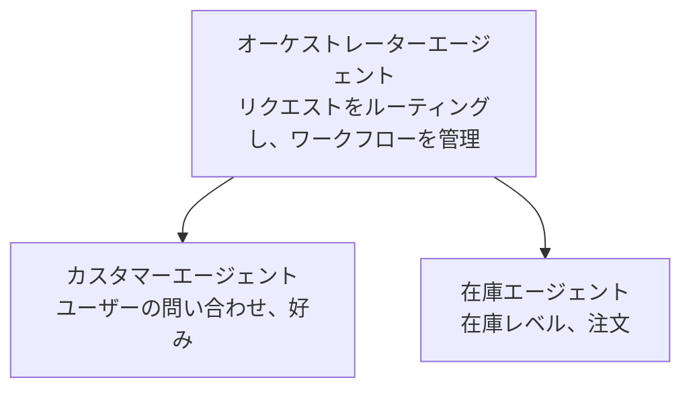

# 第5章: マルチエージェントAIソリューション

**📚 コース**: [AZD 入門](../../README.md) | **⏱️ 所要時間**: 2-3時間 | **⭐ 複雑度**: 上級

---

## 概要

この章では、高度なマルチエージェントのアーキテクチャパターン、エージェントのオーケストレーション、および複雑なシナリオ向けの本番対応AIデプロイについて扱います。

> 2026年6月に `azd 1.25.6` で検証済み。

## 学習目標

この章を修了すると、次のことができるようになります:
- マルチエージェントのアーキテクチャパターンを理解する
- 連携したAIエージェントシステムをデプロイする
- エージェント間通信を実装する
- 本番運用可能なマルチエージェントソリューションを構築する

---

## 📚 Lessons

| # | Lesson | Description | Time |
|---|--------|-------------|------|
| 1 | [マルチエージェント基礎](multi-agent-basics.md) | ハンズオン: `azd up` で動作するマルチエージェントアプリをデプロイする | 45分 |
| 2 | [調整パターン](../chapter-06-pre-deployment/coordination-patterns.md) | エージェントオーケストレーション戦略（第6章で続く） | 30分 |
| 3 | [ARM テンプレートデプロイ](../../examples/retail-multiagent-arm-template/README.md) | ワンクリックデプロイの例 | 30分 |

> **まずはレッスン1から始めてください。** この章で唯一フルにハンズオンでデプロイ可能なレッスンです。レッスン2は第6章にあり（事前デプロイ計画と共有されています）、[リテール マルチエージェント ソリューション](../../examples/retail-scenario.md)はアーキテクチャの設計図であり、ワンコマンドテンプレートではありません。

---

## 🚀 クイックスタート

```bash
# オプション 1: テンプレートからデプロイ
azd init --template agent-openai-python-prompty
azd up

# オプション 2: エージェントマニフェストからデプロイ（azure.ai.agents 拡張機能が必要）
azd extension install azure.ai.agents
azd ai agent init -m agent-manifest.yaml
azd up
```

> **どのアプローチ？** `azd init --template` を使って動作するサンプルから開始してください。エージェントマニフェストを自分で持っている場合は `azd ai agent init` を使用してください。詳細は [AZD AI CLI リファレンス](../chapter-08-production/production-ai-practices.md#azd-ai-cli-commands-and-extensions) を参照してください。

---

## 🤖 マルチエージェントアーキテクチャ



---

## 🎯 注目のソリューション: リテール マルチエージェント

The [リテール マルチエージェント ソリューション](../../examples/retail-scenario.md) が示す:

- **Customer Agent**: ユーザーとのやり取りと嗜好を扱う
- **Inventory Agent**: 在庫と注文処理を管理する
- **Orchestrator**: エージェント間の調整を行う
- **Shared Memory**: エージェント間のコンテキスト管理

### 利用されているサービス

| Service | Purpose |
|---------|---------|
| Microsoft Foundry Models | 言語理解 |
| Azure AI Search | 製品カタログ |
| Cosmos DB | エージェントの状態とメモリ |
| Container Apps | エージェントのホスティング |
| Application Insights | 監視 |

---

## 🔗 ナビゲーション

| Direction | Chapter |
|-----------|---------|
| <strong>前へ</strong> | [第4章: インフラストラクチャ](../chapter-04-infrastructure/README.md) |
| <strong>次へ</strong> | [第6章: 事前展開](../chapter-06-pre-deployment/README.md) |

---

## 📖 関連リソース

- [AIエージェントガイド](../chapter-02-ai-development/agents.md)
- [本番向けAIプラクティス](../chapter-08-production/production-ai-practices.md)
- [AIトラブルシューティング](../chapter-07-troubleshooting/ai-troubleshooting.md)

---

<!-- CO-OP TRANSLATOR DISCLAIMER START -->
**免責事項**：
本書類は AI 翻訳サービス [Co-op Translator](https://github.com/Azure/co-op-translator) を使用して翻訳されています。正確性を期していますが、自動翻訳には誤りや不正確な部分が含まれる可能性があることをご承知おきください。原文の原語版が正式な情報源とみなされるべきです。重要な情報については、専門の人間による翻訳を推奨します。本翻訳の利用により生じたいかなる誤解や解釈違いについても、当方は責任を負いかねます。
<!-- CO-OP TRANSLATOR DISCLAIMER END -->