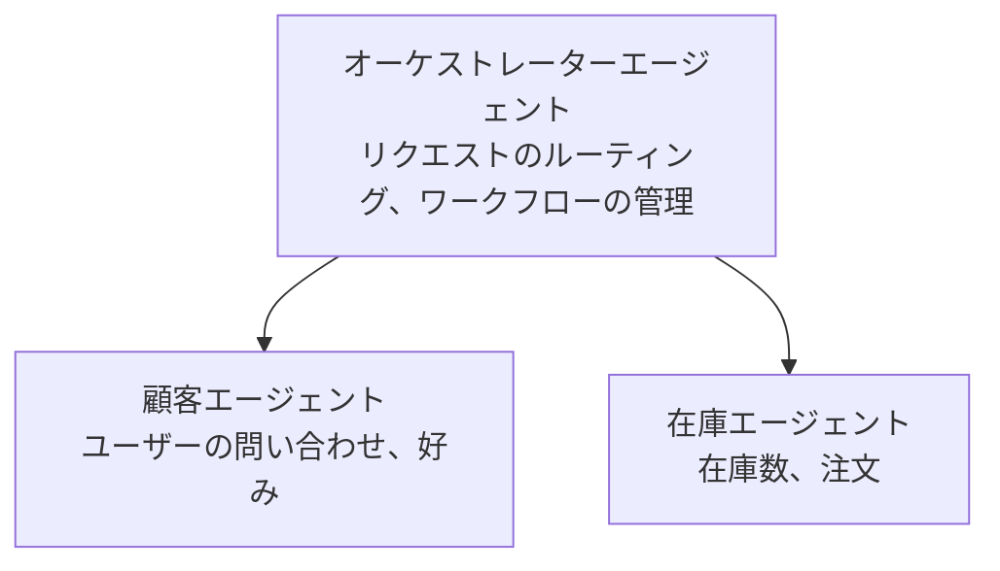

# 第5章: マルチエージェントAIソリューション

**📚 コース**: [AZD 入門](../../README.md) | **⏱️ 所要時間**: 2-3時間 | **⭐ 難易度**: 上級

---

## 概要

この章は、高度なマルチエージェントアーキテクチャパターン、エージェントオーケストレーション、および複雑なシナリオ向けの本番対応AIデプロイについて扱います。

## 学習目標

この章を修了すると、以下を習得します：
- マルチエージェントのアーキテクチャパターンを理解する
- 協調するAIエージェントシステムをデプロイする
- エージェント間コミュニケーションを実装する
- 本番対応のマルチエージェントソリューションを構築する

---

## 📚 レッスン

| # | レッスン | 説明 | 時間 |
|---|--------|-------------|------|
| 1 | [小売向けマルチエージェントソリューション](../../examples/retail-scenario.md) | 実装の完全なウォークスルー | 90分 |
| 2 | [コーディネーションパターン](../chapter-06-pre-deployment/coordination-patterns.md) | エージェントオーケストレーション戦略 | 30分 |
| 3 | [ARM テンプレートのデプロイ](../../examples/retail-multiagent-arm-template/README.md) | ワンクリックデプロイ | 30分 |

---

## 🚀 クイックスタート

```bash
# オプション 1: テンプレートからデプロイ
azd init --template agent-openai-python-prompty
azd up

# オプション 2: エージェントマニフェストからデプロイ（azure.ai.agents 拡張機能が必要）
azd extension install azure.ai.agents
azd ai agent init -m agent-manifest.yaml
azd up
```

> **どのアプローチ？** `azd init --template` を使用して動作するサンプルから開始します。独自のエージェントマニフェストがある場合は `azd ai agent init` を使用してください。詳細は [AZD AI CLI リファレンス](../chapter-08-production/production-ai-practices.md#azd-ai-cli-commands-and-extensions) を参照してください。

---

## 🤖 マルチエージェントアーキテクチャ


---

## 🎯 注目ソリューション: 小売向けマルチエージェント

この [小売向けマルチエージェントソリューション](../../examples/retail-scenario.md) は以下を示します：

- <strong>顧客エージェント</strong>: ユーザーとの対話と嗜好を処理
- <strong>在庫エージェント</strong>: 在庫と注文処理を管理
- <strong>オーケストレーター</strong>: エージェント間の調整を行う
- <strong>共有メモリ</strong>: エージェント間のコンテキスト管理

### 使用サービス

| Service | Purpose |
|---------|---------|
| Microsoft Foundry Models | 言語理解 |
| Azure AI Search | 製品カタログ |
| Cosmos DB | エージェントの状態とメモリ |
| Container Apps | エージェントホスティング |
| Application Insights | 監視 |

---

## 🔗 ナビゲーション

| 方向 | 章 |
|-----------|---------|
| <strong>前へ</strong> | [第4章: インフラストラクチャ](../chapter-04-infrastructure/README.md) |
| <strong>次へ</strong> | [第6章: 事前デプロイ](../chapter-06-pre-deployment/README.md) |

---

## 📖 関連リソース

- [AIエージェントガイド](../chapter-02-ai-development/agents.md)
- [本番環境向けAIプラクティス](../chapter-08-production/production-ai-practices.md)
- [AIトラブルシューティング](../chapter-07-troubleshooting/ai-troubleshooting.md)

---

<!-- CO-OP TRANSLATOR DISCLAIMER START -->
**免責事項**:
本書類は AI 翻訳サービス [Co-op翻訳ツール](https://github.com/Azure/co-op-translator) を使用して翻訳されました。正確性には努めていますが、機械翻訳には誤りや不正確な箇所が含まれている可能性があることをご承知おきください。原文（原言語の文書）を正式な出典とみなしてください。重要な情報については、専門の人間による翻訳を推奨します。この翻訳の利用によって生じた誤解や解釈の相違について、当社は責任を負いません。
<!-- CO-OP TRANSLATOR DISCLAIMER END -->