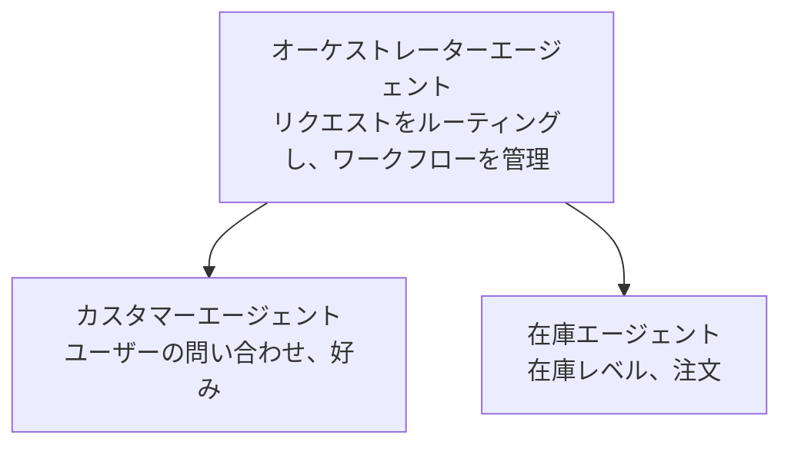

# 第5章：マルチエージェントAIソリューション

**📚 コース**: [AZD For Beginners](../../README.md) | **⏱️ 所要時間**: 2～3時間 | **⭐ 難易度**: 上級

---

## 概要

この章では、高度なマルチエージェントアーキテクチャパターン、エージェントのオーケストレーション、複雑なシナリオにおけるプロダクション準備済みのAI展開について扱います。

> 2026年7月に `azd 1.27.1` で検証済み。

## 学習目標

この章を修了することで、以下を習得できます：
- マルチエージェントアーキテクチャパターンの理解
- 連携したAIエージェントシステムのデプロイ
- エージェント間通信の実装
- プロダクション準備済みマルチエージェントソリューションの構築

---

## 📚 レッスン

| # | レッスン | 説明 | 時間 |
|---|--------|-------------|------|
| 1 | [マルチエージェント基礎](multi-agent-basics.md) | 実践： `azd up` で動作するマルチエージェントアプリを展開 | 45分 |
| 2 | [コーディネーションパターン](../chapter-06-pre-deployment/coordination-patterns.md) | エージェントのオーケストレーション戦略（第6章で継続） | 30分 |
| 3 | [ARMテンプレートデプロイメント](../../examples/retail-multiagent-arm-template/README.md) | ワンクリック展開例 | 30分 |

> **まずレッスン1から始めましょう。** この章で唯一完全にハンズオンの展開可能なレッスンです。レッスン2は第6章にあり（プレデプロイメント計画と共有）、[Retail Multi-Agent Solution](../../examples/retail-scenario.md) はアーキテクチャの設計図であり、コマンド1つのテンプレートではありません。

---

## 🚀 クイックスタート

```bash
# オプション1: テンプレートからデプロイ
azd init --template agent-openai-python-prompty
azd up

# オプション2: エージェントマニフェストからデプロイ（azure.ai.agents拡張機能が必要）
azd extension install azure.ai.agents
azd ai agent init -m agent-manifest.yaml
azd up
```

> **どのアプローチを使う？** 動作するサンプルから始める場合は `azd init --template` を使います。自分のエージェントマニフェストがある場合は `azd ai agent init` を使用してください。詳細は [AZD AI CLIリファレンス](../chapter-08-production/production-ai-practices.md#azd-ai-cli-commands-and-extensions) を参照してください。

---

## 🤖 マルチエージェントアーキテクチャ



---

## 🎯 注目ソリューション：Retail Multi-Agent

[Retail Multi-Agent Solution](../../examples/retail-scenario.md) は以下を示しています：

- <strong>カスタマーエージェント</strong>：ユーザーとの対話と好みを管理
- <strong>インベントリエージェント</strong>：在庫と注文処理を管理
- <strong>オーケストレーター</strong>：エージェント間の調整
- <strong>共有メモリ</strong>：エージェント間のコンテキスト管理

### 使用サービス

| サービス | 目的 |
|---------|---------|
| Microsoft Foundry Models | 言語理解 |
| Azure AI Search | 製品カタログ |
| Cosmos DB | エージェントの状態とメモリ |
| Container Apps | エージェントホスティング |
| Application Insights | モニタリング |

---

## 🔗 ナビゲーション

| 方向 | 章 |
|-----------|---------|
| <strong>前へ</strong> | [第4章：インフラストラクチャ](../chapter-04-infrastructure/README.md) |
| <strong>次へ</strong> | [第6章：プレデプロイメント](../chapter-06-pre-deployment/README.md) |

---

## 📖 関連リソース

- [AIエージェントガイド](../chapter-02-ai-development/agents.md)
- [プロダクションAIプラクティス](../chapter-08-production/production-ai-practices.md)
- [AIトラブルシューティング](../chapter-07-troubleshooting/ai-troubleshooting.md)

---

<!-- CO-OP TRANSLATOR DISCLAIMER START -->
**免責事項**：
本書類は AI 翻訳サービス [Co-op Translator](https://github.com/Azure/co-op-translator) を使用して翻訳されています。正確性を期していますが、自動翻訳には誤りや不正確な部分が含まれる可能性があることをご承知おきください。原文の原語版が正式な情報源とみなされるべきです。重要な情報については、専門の人間による翻訳を推奨します。本翻訳の利用により生じたいかなる誤解や解釈違いについても、当方は責任を負いかねます。
<!-- CO-OP TRANSLATOR DISCLAIMER END -->