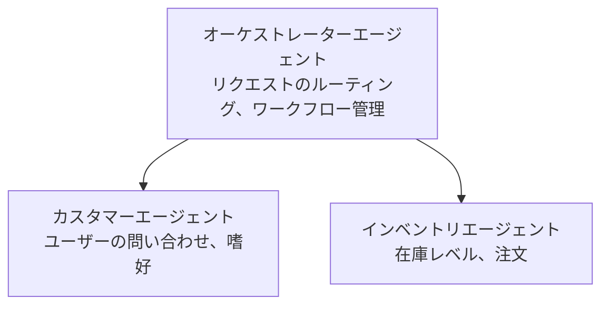

# 第5章：マルチエージェントAIソリューション

**📚 コース**: [AZD For Beginners](../../README.md) | **⏱️ 所要時間**: 2-3時間 | **⭐ 難易度**: 上級

---

## 概要

この章では、高度なマルチエージェントアーキテクチャパターン、エージェントのオーケストレーション、および複雑なシナリオに対応した本番環境向けAI展開について説明します。

> `azd 1.23.12` に対して2026年3月に検証済み。

## 学習目標

この章を修了することで、以下を習得できます：
- マルチエージェントアーキテクチャパターンの理解
- 協調型AIエージェントシステムの展開
- エージェント間通信の実装
- 本番環境向けマルチエージェントソリューションの構築

---

## 📚 レッスン

| # | レッスン | 説明 | 時間 |
|---|--------|-------------|------|
| 1 | [小売マルチエージェントソリューション](../../examples/retail-scenario.md) | 完全な実装ウォークスルー | 90分 |
| 2 | [コーディネーションパターン](../chapter-06-pre-deployment/coordination-patterns.md) | エージェントオーケストレーション戦略 | 30分 |
| 3 | [ARMテンプレート展開](../../examples/retail-multiagent-arm-template/README.md) | ワンクリック展開 | 30分 |

---

## 🚀 クイックスタート

```bash
# オプション1: テンプレートからデプロイする
azd init --template agent-openai-python-prompty
azd up

# オプション2: エージェントマニフェストからデプロイする（azure.ai.agents拡張機能が必要）
azd extension install azure.ai.agents
azd ai agent init -m agent-manifest.yaml
azd up
```

> **どのアプローチを選ぶ？** `azd init --template` を使って動作するサンプルから始めます。独自のエージェントマニフェストがある場合は `azd ai agent init` を使用してください。詳細は [AZD AI CLI リファレンス](../chapter-08-production/production-ai-practices.md#azd-ai-cli-commands-and-extensions) を参照してください。

---

## 🤖 マルチエージェントアーキテクチャ


---

## 🎯 特集ソリューション：小売マルチエージェント

[小売マルチエージェントソリューション](../../examples/retail-scenario.md)は以下を示します：

- <strong>カスタマーエージェント</strong>：ユーザーとの対話と好みの管理
- <strong>インベントリエージェント</strong>：在庫および注文処理の管理
- <strong>オーケストレーター</strong>：エージェント間の調整
- <strong>共有メモリ</strong>：エージェント間のコンテキスト管理

### 利用サービス

| サービス | 目的 |
|---------|---------|
| Microsoft Foundry Models | 言語理解 |
| Azure AI Search | 商品カタログ |
| Cosmos DB | エージェントの状態とメモリ |
| Container Apps | エージェントのホスティング |
| Application Insights | 監視 |

---

## 🔗 ナビゲーション

| 方向 | 章 |
|-----------|---------|
| <strong>前へ</strong> | [第4章：インフラストラクチャ](../chapter-04-infrastructure/README.md) |
| <strong>次へ</strong> | [第6章：プレデプロイメント](../chapter-06-pre-deployment/README.md) |

---

## 📖 関連リソース

- [AIエージェントガイド](../chapter-02-ai-development/agents.md)
- [本番環境向けAIプラクティス](../chapter-08-production/production-ai-practices.md)
- [AIトラブルシューティング](../chapter-07-troubleshooting/ai-troubleshooting.md)

---

<!-- CO-OP TRANSLATOR DISCLAIMER START -->
**免責事項**:  
本書類は AI 翻訳サービス [Co-op Translator](https://github.com/Azure/co-op-translator) を使用して翻訳されています。正確性を期していますが、自動翻訳には誤りや不正確な部分が含まれる可能性があります。原文のネイティブ言語版が正式な情報源とみなされるべきです。重要な情報については、専門の人間による翻訳を推奨します。本翻訳の利用により生じた誤解や解釈の相違について、当方は一切の責任を負いかねます。
<!-- CO-OP TRANSLATOR DISCLAIMER END -->