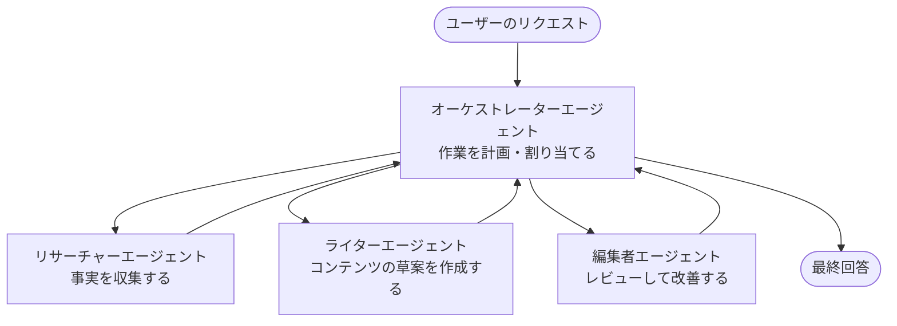

# マルチエージェントの基本 - 最初の協調AIシステムをデプロイする

**章ナビゲーション:**
- **📚 コースホーム**: [AZD 入門](../../README.md)
- **📖 現在の章**: 第5章 - マルチエージェントAIソリューション
- **⬅️ 前へ**: [第4章: インフラストラクチャ](../chapter-04-infrastructure/README.md)
- **➡️ 次へ**: [調整パターン](../chapter-06-pre-deployment/coordination-patterns.md)

> 2026年6月に `azd 1.25.6` で検証済み。

## はじめに

前の章では単一のアプリケーションをデプロイしました—第2章では単一のAIエージェントをデプロイしました。本レッスンは次のステップを踏みます：複数の専門エージェントが協力して、単一のエージェントではうまく対応できない問題を解決する <strong>マルチエージェントシステム</strong> をデプロイします。

初心者に朗報です：**新しいコマンドは不要です。** マルチエージェントソリューションも azd プロジェクトです。`azd init`、`azd up`、テスト、そして `azd down` を行います—すでに知っているワークフローと全く同じです。変わるのはアプリ内部の<em>形</em>だけです。

## 学習目標

このレッスンの終わりまでに、あなたは以下を達成できるようになります:
- 「マルチエージェント」が何を意味するか、および追加の複雑さに値するのはどんな場合かを理解する
- マルチエージェントシステムにおける一般的な役割（オーケストレーター + 専門家）を認識する
- 実際に動作するマルチエージェントテンプレートを `azd up` でデプロイする
- マルチエージェントアプリを支える Azure リソースを理解する
- ソリューションを安全に検証、カスタマイズ、そして解体する方法を知る

## 学習成果

このレッスンを修了した後、あなたは以下ができるようになります:
- 単一エージェントとマルチエージェントシステムの違いを説明する
- ツールを持つ単一エージェントと真のマルチエージェント設計のどちらを選ぶか判断する
- azd でマルチエージェントテンプレートをエンドツーエンドでデプロイしてテストする
- 各エージェントがどこで実行され、どのように通信するかを識別する
- 継続的な請求を避けるためにすべてのリソースをクリーンアップする

---

## マルチエージェントシステムとは何か？

単一のAIエージェントは、1つのモデルに一連の指示と（オプションで）いくつかのツールが付属したものです。これはフォーカスされたタスクにはうまく機能します。しかしタスクが拡大し、リサーチ、執筆、編集、ファクトチェックと段階が増えると、すべてを1つのプロンプトに詰め込むとエージェントは遅く、信頼性が低く、デバッグが困難になります。

<strong>マルチエージェントシステム</strong> は作業をそれぞれ1つの仕事を得意とする専門家に分割し、オーケストレーターが調整します：



### 常に見られる2つの役割

| 役割 | 仕事 | 例 |
|------|-----|---------|
| <strong>オーケストレーター</strong> | <em>次に何が起こるか</em>を決定し、エージェント間で作業を振り分ける | "まずリサーチ、次に執筆、最後に編集" |
| <strong>スペシャリスト</strong> | 1つの特化した仕事を行い、結果を返す | 事実のみを収集する "リサーチャー" |

### 本当に複数のエージェントが必要ですか？

まずはシンプルに始めましょう。以下のいずれかに当てはまる場合にのみ、マルチエージェントを選択してください：

- ✅ タスクに異なる指示が役立つ<strong>明確な段階</strong>（リサーチ、執筆、レビュー）がある
- ✅ 時間短縮のために専門家を<strong>並列に</strong>実行したい
- ✅ 異なるステップで<strong>異なるツールやデータソース</strong>が必要になる
- ✅ 各ステップを<strong>個別にテスト・デバッグ可能</strong>にする必要がある

タスクが単一の問いと回答や単純なツール呼び出しである場合は、<strong>ツールを持つ単一のエージェント</strong>（第2章）の方がシンプルで、安価で、運用しやすいです。

> **初心者向けのヒント:** 「より多くのエージェント」は「より良い」ではありません。各エージェントはレイテンシ、コスト、監視対象を追加します。問題が明確に分割される場合にのみエージェントを追加してください。

---

## Azure上でマルチエージェントを構築する2つの方法

| アプローチ | 内容 | 最適用途 |
|----------|-----------|----------|
| **単一エージェント + ツール** | 関数/ツールを呼び出す1つのFoundryエージェント | シンプルなワークフロー、入門 |
| <strong>複数の協調エージェント</strong> | オーケストレーターを含む複数のエージェント | 明確な段階、並列処理、専門化 |

このレッスンは2つ目のアプローチに焦点を当て、<strong>すぐ使えるテンプレート</strong>を使用します。これにより自分で構築する前に実際のマルチエージェントシステムが動作する様子を確認できます。

---

## 実践：動作するマルチエージェントアプリをデプロイする

ここでは公式の Azure サンプルである **Contoso Creative Writer** をデプロイします。リサーチャー、ライター、エディターといった複数のエージェントが協調して記事を生成する仕組みで、役割が理解しやすく最初のマルチエージェントアプリとして最適です。

### ステップ 1: テンプレートを初期化する

```bash
# 作業用フォルダを作成する
mkdir creative-writer && cd creative-writer

# 公式のマルチエージェントテンプレートから初期化する
azd init --template contoso-creative-writer
```

> いつでも [Awesome AZD AI ギャラリー](https://azure.github.io/awesome-azd/?tags=ai) で他のマルチエージェントテンプレートを参照できます。初心者向けの他のオプションには `get-started-with-ai-agents` や `azure-ai-travel-agents` があります。

### ステップ 2: 認証する

```bash
# azd ワークフローに必要です
azd auth login
```

### ステップ 3: 環境を作成する

```bash
azd env new dev
```

### ステップ 4: プレビューしてからデプロイする

```bash
# 費用をかける前に何が作成されるかを確認してください（推奨）
azd provision --preview

# インフラをプロビジョニングし、すべてのエージェントを一度にデプロイする
azd up
```

`azd up` はサブスクリプションとリージョンを尋ね、Azure リソースをプロビジョニングしてアプリケーションをデプロイします。AI のデプロイは単純なウェブアプリより時間がかかる場合があります—より大きなモデルをデプロイする場合は、デプロイのタイムアウトを延長できます：

```bash
azd deploy --timeout 1800
```

> **コストとキャパシティに関する注意:** マルチエージェントアプリはクォータを消費しコストを発生させるAIモデルをデプロイします。`azd up` がモデルのクォータで失敗する場合は、リージョンとクォータの修正については [AI トラブルシューティング](../chapter-07-troubleshooting/ai-troubleshooting.md) を参照し、第6章の [キャパシティプランニング](../chapter-06-pre-deployment/capacity-planning.md) を確認してください。

---

## デプロイしたものの理解

このような典型的なマルチエージェントアプリは、上の図の責任範囲に直接対応する一連の Azure リソースをプロビジョニングします：

| リソース | 存在理由 |
|----------|----------------|
| **Microsoft Foundry / Models** | 各エージェントが使用する言語モデルをホストする |
| **Azure AI Search** | リサーチャーエージェントに検索可能な根拠データを提供する |
| **Container Apps** (または App Service) | オーケストレーターとエージェントのコードをホストする |
| **Cosmos DB**（一部のサンプル） | エージェント間で共有される状態/メモリを保存する |
| **Application Insights** | リクエストを<em>エージェント間で</em>トレースし、フローのデバッグを可能にする |

### エージェント同士の通信方法

ほとんどの azd マルチエージェントサンプルでは、<strong>オーケストレーターはアプリケーションコード内で動作します</strong>（たとえば Semantic Kernel や Microsoft Agent Framework のようなフレームワークを使用）。オーケストレーターは順番に各スペシャリストエージェントを呼び出し、結果を渡し、最終的な回答を組み立てます。エージェントは次の方法でコンテキストを共有します：

- **関数/ツール呼び出し** — オーケストレーターはスペシャリストを呼び出し、結果を受け取る
- <strong>共有メモリ</strong> — データベース（多くの場合 Cosmos DB）が両方のエージェントが読み取れる状態を保持する
- **メッセージ/イベント** — 緩やかな結合のために、エージェントはキューや Service Bus 経由で通信する

> **デバッグで重要な理由:** 各ステップが分離されているため、Application Insights はどのエージェントが遅かったか、または失敗したかを示します。これは作業をエージェント間で分割する主な理由の一つです。

---

## デプロイの検証

先に進む前にシステムが実際に動作していることを確認します：

```bash
# デプロイ済みのエンドポイントを表示する
azd show

# アプリの監視ダッシュボードを開く
azd monitor

# 何かおかしければログを追う
azd monitor --logs
```

次に `azd show` でアプリの URL を開き、すべてのエージェントを動かすリクエストを試してみてください（Creative Writer では、トピックについて短い記事を書くよう依頼します）。Application Insights の <strong>トランザクション検索</strong> で、リクエストがリサーチャー、ライター、エディターの各ステップに展開されているのが確認できるはずです。

**成功基準：**
- ✅ `azd show` が到達可能なエンドポイントを表示する
- ✅ リクエストが複数の段階を経て生成されたことが明確にわかる結果を返す
- ✅ Application Insights が複数のエージェントステップのトレースを表示する

---

## カスタマイズ：エージェントを追加または調整する

各エージェントは指示とツールの組み合わせに過ぎないため、カスタマイズは取り組みやすいです：

1. <strong>テンプレート内のエージェント定義を探す</strong>（多くは `prompts/`、`agents/`、または `*.prompty` のファイル群）。
2. <strong>エージェントの指示を調整する</strong> — 例えば、エディターエージェントに特定のトーンや語数制限を適用するよう指示する。
3. <strong>コードだけを再デプロイする</strong>（インフラは変更しない）：

   ```bash
   azd deploy
   ```

さらに進んで<em>独自の</em>マニフェストからエージェントを構築する場合は、エージェント拡張とそのライフサイクルを使用してください：

```bash
azd extension install azure.ai.agents
azd ai agent init -m agent-manifest.yaml
azd up
azd ai agent invoke      # テスト、応答タイミング付き
```

完全なエージェントのライフサイクルについては [第2章: エージェント](../chapter-02-ai-development/agents.md) と [AZD AI CLI リファレンス](../chapter-08-production/production-ai-practices.md#azd-ai-cli-commands-and-extensions) を参照してください（`invoke`, `eval generate`, `optimize`, `delete`）。

---

## クリーンアップ

マルチエージェントアプリは複数の課金対象サービスを実行します。作業が終わったらすべてを削除してください：

```bash
azd down --force --purge
```

`--purge` フラグは、Foundry/Azure AI Services アカウントのようなソフト削除された AI リソースも削除するため、将来の再デプロイをブロックしたりコストを継続して発生させたりしません。

---

## 本番向けマルチエージェントシステムに関する注意

このリポジトリの [小売マルチエージェント ソリューション](../../examples/retail-scenario.md) は <strong>アーキテクチャ設計図</strong> であり、ワンコマンドテンプレートではありません—本番の小売システムをどのように構築するかを文書化しており（完全な構築は相当の労力が必要であると明示しています）、ここで動作するサンプルをデプロイした後の設計リファレンスとして利用してください。本番の懸案事項（耐障害性、コスト、監視、ガバナンス）については、第8章の [本番AIプラクティス](../chapter-08-production/production-ai-practices.md) を参照してください。

---

## まとめ

- マルチエージェントシステムは、オーケストレーターが調整する専門家に作業を分担させます。
- タスクに明確な段階、並列処理、またはステップごとに異なるツールが必要な場合にのみ使用し、そうでなければ単一エージェントを推奨します。
- azd のワークフローは変わりません：`azd init` → `azd up` → テスト → `azd down`。
- `contoso-creative-writer` のような実際のテンプレートを使えば、今日でも動作するマルチエージェントアプリを確認してカスタマイズできます。
- エージェント間の Application Insights トレースは、マルチエージェント設計の実用上の大きな利点の一つです。

---

## 🔗 ナビゲーション

| 方向 | レッスン |
|-----------|--------|
| <strong>前へ</strong> | [第4章: インフラストラクチャ](../chapter-04-infrastructure/README.md) |
| <strong>次へ</strong> | [調整パターン](../chapter-06-pre-deployment/coordination-patterns.md) |

## 📖 関連リソース

- [AI エージェントガイド](../chapter-02-ai-development/agents.md)
- [調整パターン](../chapter-06-pre-deployment/coordination-patterns.md)
- [本番AIプラクティス](../chapter-08-production/production-ai-practices.md)
- [AI トラブルシューティング](../chapter-07-troubleshooting/ai-troubleshooting.md)

---

<!-- CO-OP TRANSLATOR DISCLAIMER START -->
**免責事項**：
本書類は AI 翻訳サービス [Co-op Translator](https://github.com/Azure/co-op-translator) を使用して翻訳されています。正確性を期していますが、自動翻訳には誤りや不正確な部分が含まれる可能性があることをご承知おきください。原文の原語版が正式な情報源とみなされるべきです。重要な情報については、専門の人間による翻訳を推奨します。本翻訳の利用により生じたいかなる誤解や解釈違いについても、当方は責任を負いかねます。
<!-- CO-OP TRANSLATOR DISCLAIMER END -->