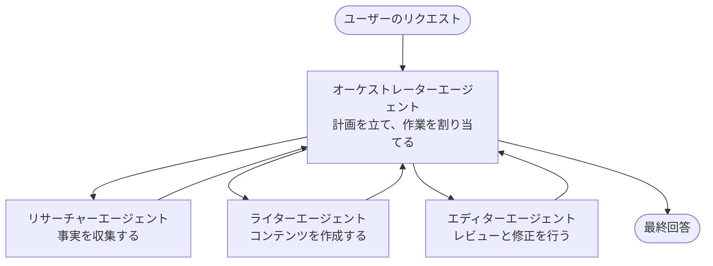

# マルチエージェントの基本 - 最初の調整されたAIシステムを展開する

**章のナビゲーション：**
- **📚 コースホーム**：[AZD入門](../../README.md)
- **📖 現在の章**：第5章 - マルチエージェントAIソリューション
- **⬅️ 前へ**：[第4章：インフラストラクチャ](../chapter-04-infrastructure/README.md)
- **➡️ 次へ**：[調整パターン](../chapter-06-pre-deployment/coordination-patterns.md)

> 2026年7月、`azd 1.27.1`で検証済み。

## はじめに

これまでの章では単一のアプリケーションを展開し、第2章では単一のAIエージェントを展開しました。このレッスンでは次のステップとして、複数の専門エージェントが協力して1つのエージェントでは処理できない問題を解決する<strong>マルチエージェントシステム</strong>の展開を行います。

初心者に朗報です：**新しいコマンドは必要ありません。** マルチエージェントのソリューションもazdプロジェクトです。`azd init`、`azd up`、テスト、`azd down`を実行するワークフローは変わりません。変わるのはアプリ内部の<em>構成</em>だけです。

## 学習目標

このレッスンを終えるまでに、あなたは以下を理解できるようになります：
- 「マルチエージェント」とは何か、またどのような場合に追加の複雑さが価値があるか理解する
- マルチエージェントシステムの一般的な役割（オーケストレーター＋スペシャリスト）を認識する
- `azd up`で実際に動作するマルチエージェントテンプレートを展開する
- マルチエージェントアプリの裏付けとなるAzureリソースを理解する
- ソリューションの検証、カスタマイズ、安全な破棄の方法を知る

## 学習成果

このレッスンを修了した後、あなたは以下を説明できるようになります：
- 単一エージェントとマルチエージェントシステムの違いを説明できる
- 単一エージェント＋ツールと真のマルチエージェント設計を選択できる
- azdを使ってマルチエージェントテンプレートをエンドツーエンドで展開・テストできる
- 各エージェントがどこで動作し、どう通信しているか識別できる
- すべてのリソースをクリーンアップして、継続費用を防げる

---

## マルチエージェントシステムとは？

単一のAIエージェントは、1つのモデルに一連の指示と（オプションで）ツールを組み合わせたものです。これは特定のタスクには有効です。しかし、研究、執筆、編集、ファクトチェックといった複雑なタスクになると、すべてを1つのプロンプトに詰め込むのはエージェントを遅くし、信頼性を下げ、デバッグを困難にします。

<strong>マルチエージェントシステム</strong>は仕事を複数の専門家に分け、それぞれが得意な1つの作業を担当し、オーケストレーターが調整します：



### 常に見られる2つの役割

| 役割 | 仕事 | 例 |
|------|-----|---------|
| <strong>オーケストレーター</strong> | <em>次に何をするか</em>を決めてエージェント間の作業を振り分ける | 「まず調査、次に執筆、その後編集」 |
| <strong>スペシャリスト</strong> | 1つの専門作業を行い結果を返す | 事実を収集する「研究者」 |

### 本当に複数のエージェントが必要？

シンプルに始めてください。以下のどれかが当てはまる場合にのみマルチエージェントを選択します：

- ✅ タスクに異なる指示が有効な<strong>異なる段階</strong>がある（調査vs執筆vsレビュー）
- ✅ 時間短縮のためにスペシャリストを<strong>並列で</strong>動かしたい
- ✅ 各段階で<strong>異なるツールやデータソース</strong>が必要
- ✅ 各段階が<strong>独立してテストとデバッグ可能</strong>である必要がある

タスクが単純な質疑応答や単純なツール呼び出しであれば、<strong>ツール付き単一エージェント</strong>（第2章）の方がシンプルで安価かつ運用しやすいです。

> **初心者向けのヒント：** 「エージェントが多い＝良い」とは限りません。エージェントが増えるとレイテンシーとコストが増え、監視対象も増えます。問題が明確に分割できる場合にだけエージェントを増やしましょう。

---

## Azureでマルチエージェントを構築する2つの方法

| アプローチ | 内容 | 最適な用途 |
|----------|-----------|----------|
| **単一エージェント＋ツール** | 1つのFoundryエージェントが関数やツールを呼び出す | シンプルなワークフロー、入門に最適 |
| <strong>複数調整エージェント</strong> | 複数のエージェントとオーケストレーター | 異なる段階、並列作業、専門化 |

このレッスンは2番目のアプローチに焦点をあて、<strong>用意されたテンプレート</strong>を使用しているため、自分で作る前に実際に動くマルチエージェントシステムを見ることができます。

---

## 実践：動作するマルチエージェントアプリを展開する

複数のエージェント（研究者、作家、編集者）が連携して記事を制作する公式Azureサンプルの<strong>Contoso Creative Writer</strong>を展開します。役割がわかりやすいため、最初のマルチエージェントアプリに最適です。

### ステップ 1：テンプレートの初期化

```bash
# 作業フォルダーを作成する
mkdir creative-writer && cd creative-writer

# 公式のマルチエージェントテンプレートから初期化する
azd init --template contoso-creative-writer
```

> いつでも[Awesome AZD AIギャラリー](https://azure.github.io/awesome-azd/?tags=ai)で他のマルチエージェントテンプレートを参照できます。初心者向けには`get-started-with-ai-agents`や`azure-ai-travel-agents`もあります。

### ステップ 2：認証する

```bash
# azdワークフローに必要です
azd auth login
```

### ステップ 3：環境を作成する

```bash
azd env new dev
```

### ステップ 4：プレビューし、そして展開する

```bash
# 何かを支払う前に作成されるものを確認する（推奨）
azd provision --preview

# インフラストラクチャをプロビジョニングし、すべてのエージェントを一度にデプロイする
azd up
```

`azd up`はサブスクリプションとリージョンを問い合わせ、その後Azureリソースをプロビジョニングしてアプリを展開します。AIの展開は単純なWebアプリより時間がかかることがあります。大きいモデルを展開する場合はデプロイのタイムアウトを延長できます：

```bash
azd deploy --timeout 1800
```

> **コストと容量の注意事項：** マルチエージェントアプリはクォータを消費し、コストがかかるAIモデルを展開します。`azd up`でモデルクォータが原因の失敗が起きたら、[AIトラブルシューティング](../chapter-07-troubleshooting/ai-troubleshooting.md)のリージョンとクォータ修正を参照し、第6章の[容量計画](../chapter-06-pre-deployment/capacity-planning.md)もご覧ください。

---

## 展開したものを理解する

典型的なこのようなマルチエージェントアプリは、上記の責任範囲に直結するAzureリソース群をプロビジョニングします：

| リソース | その理由 |
|----------|----------------|
| **Microsoft Foundry / Models** | 各エージェントが使用する言語モデルをホスト |
| **Azure AI Search** | 研究者エージェントに基盤データ検索を提供 |
| **Container Apps**（またはApp Service） | オーケストレーターとエージェントコードのホスティング |
| **Cosmos DB**（一部のサンプル） | エージェント間で共有される状態/メモリの保存 |
| **Application Insights** | エージェント間のリクエストをトレースし、フローのデバッグ支援 |

### エージェント間の通信

多くのazdのマルチエージェントサンプルでは、<strong>オーケストレーターはアプリコード内で動作</strong>します（例えばSemantic KernelやMicrosoft Agent Frameworkなどのフレームワークを使用）。オーケストレーターが順に各スペシャリストを呼び出し、結果を渡し、最終回答を組み立てます。エージェント間は以下でコンテキストを共有します：

- **関数/ツール呼び出し** — オーケストレーターがスペシャリストを呼び出し結果を受け取る
- <strong>共有メモリ</strong> — データベース（多くはCosmos DB）が両者が読み取る状態を保持
- **メッセージ/イベント** — ゆるい結合のためにエージェント間はキューやService Busで通信

> **デバッグに重要な理由：** 各ステップが分離されているため、Application Insightsは<em>どの</em>エージェントが遅れたか失敗したかを示します。これがエージェント間で仕事を分割する最大の利点の一つです。

---

## 展開を検証する

実際に動作しているか確認してから次に進みましょう：

```bash
# 展開されたエンドポイントを表示する
azd show

# アプリの監視ダッシュボードを開く
azd monitor

# 問題がある場合はログを追跡する
azd monitor --logs
```

その後、`azd show`のURLを開き、すべてのエージェントが動作するリクエストを試します（Creative Writerでは、あるトピックの短い記事を書いてみるなど）。Application Insightsの<strong>トランザクション検索</strong>では、リクエストが研究者、作家、編集者のステップに広がるのが見えるはずです。

**成功条件：**
- ✅ `azd show`で到達可能なエンドポイントがリストされる
- ✅ リクエストが複数段階を明確に通過した結果を出す
- ✅ Application Insightsに複数のエージェントステップのトレースが表示される

---

## カスタマイズ：エージェントを追加・調整する

各エージェントは指示とツールの組み合わせなので、カスタマイズは容易です：

1. テンプレート内のエージェント定義を見つけます（多くは`prompts/`、`agents/`、または`*.prompty`ファイル群）。
2. エージェントの指示を調整します — 例えば、編集者エージェントに特定のトーンや文字数を守らせるなど。
3. コードのみを再展開します（インフラは変更なし）：

   ```bash
   azd deploy
   ```

さらに進んで独自のマニフェストからエージェントを作成するには、エージェント拡張機能とその完全なライフサイクルを使います：

```bash
azd extension install azure.ai.agents
azd ai agent init -m agent-manifest.yaml
azd up
azd ai agent invoke      # 応答時間を測定するテスト
```

完全なエージェントライフサイクル（`invoke`、`eval generate`、`optimize`、`delete`）については、[第2章：エージェント](../chapter-02-ai-development/agents.md)と[AZD AI CLIリファレンス](../chapter-08-production/production-ai-practices.md#azd-ai-cli-commands-and-extensions)を参照してください。

---

## クリーンアップ

マルチエージェントアプリは課金対象サービスが複数稼働します。使い終わったらすべてを破棄してください：

```bash
azd down --force --purge
```

`--purge`フラグは、FoundryやAzure AI Servicesアカウントのようなソフト削除されたAIリソースも削除するため、将来の再展開を妨げたり継続的にコストがかかることを防ぎます。

---

## 本番環境のマルチエージェントシステムに関する注記

このリポジトリの[小売業向けマルチエージェントソリューション](../../examples/retail-scenario.md)は<strong>アーキテクチャ設計図</strong>であり、1コマンドテンプレートではありません。これは本番環境の小売システムの構築方法を文書化したもので（完全実装は大規模な作業と明示）、まず本章で動作するサンプルを展開してから設計参照として使用してください。本番環境の耐障害性、コスト、監視、ガバナンスなどの懸念は、第8章[本番AIプラクティス](../chapter-08-production/production-ai-practices.md)で扱います。

---

## まとめ

- マルチエージェントシステムはオーケストレーターが調整する専門家に仕事を分割します。
- 異なる段階、並列作業、ステップごとの異なるツールがある場合にのみ使い、そうでなければ単一エージェントを推奨します。
- azdのワークフローは不変：`azd init` → `azd up` → テスト → `azd down`。
- `contoso-creative-writer`のような実際のテンプレートで、現実に動くマルチエージェントアプリを見てカスタマイズできます。
- Application Insightsによるエージェント間のトレースはマルチエージェント設計の最大の実用的利点のひとつです。

---

## 🔗 ナビゲーション

| 方向 | レッスン |
|-----------|--------|
| <strong>前へ</strong> | [第4章：インフラストラクチャ](../chapter-04-infrastructure/README.md) |
| <strong>次へ</strong> | [調整パターン](../chapter-06-pre-deployment/coordination-patterns.md) |

## 📖 関連資料

- [AIエージェントガイド](../chapter-02-ai-development/agents.md)
- [調整パターン](../chapter-06-pre-deployment/coordination-patterns.md)
- [本番AIプラクティス](../chapter-08-production/production-ai-practices.md)
- [AIトラブルシューティング](../chapter-07-troubleshooting/ai-troubleshooting.md)

---

<!-- CO-OP TRANSLATOR DISCLAIMER START -->
**免責事項**：
本書類は AI 翻訳サービス [Co-op Translator](https://github.com/Azure/co-op-translator) を使用して翻訳されています。正確性を期していますが、自動翻訳には誤りや不正確な部分が含まれる可能性があることをご承知おきください。原文の原語版が正式な情報源とみなされるべきです。重要な情報については、専門の人間による翻訳を推奨します。本翻訳の利用により生じたいかなる誤解や解釈違いについても、当方は責任を負いかねます。
<!-- CO-OP TRANSLATOR DISCLAIMER END -->