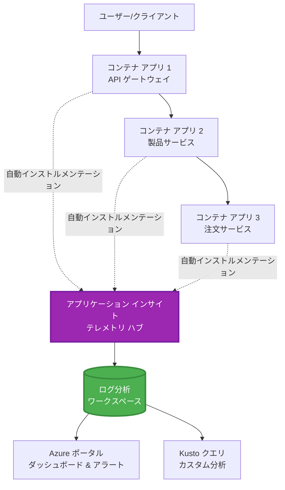
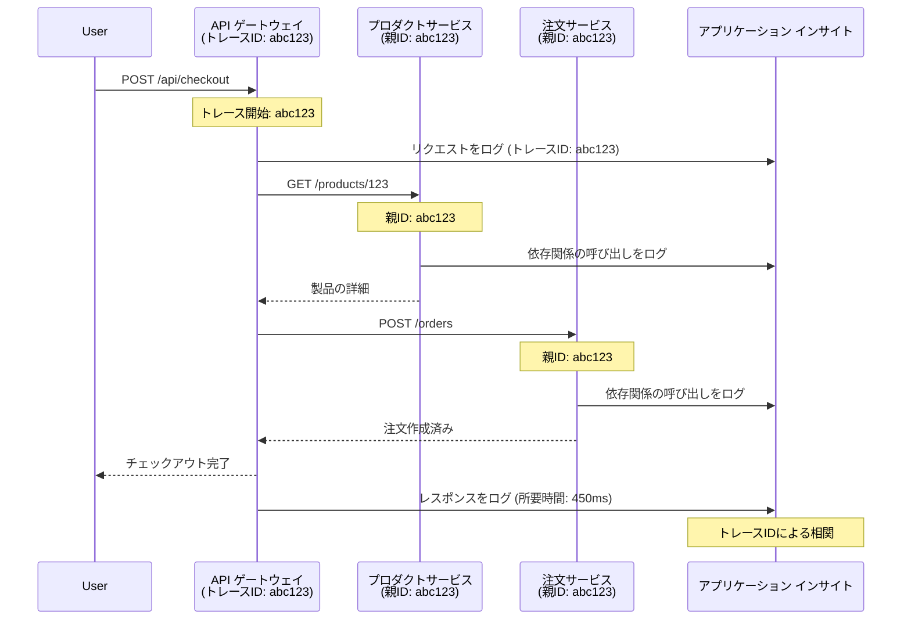

# Application Insights と AZD の統合

⏱️ <strong>所要時間の目安</strong>: 40-50 分 | 💰 <strong>コスト影響</strong>: 約 $5-15/月 | ⭐ <strong>難易度</strong>: 中級

**📚 学習の流れ:**
- ← 前へ: [事前チェック](preflight-checks.md) - デプロイ前の検証
- 🎯 <strong>現在地</strong>: Application Insights 統合（監視、テレメトリ、デバッグ）
- → 次へ: [デプロイガイド](../chapter-04-infrastructure/deployment-guide.md) - Azure へのデプロイ
- 🏠 [コースホーム](../../README.md)

---

## このレッスンで学ぶこと

このレッスンを修了すると、以下ができるようになります:
- AZD プロジェクトに **Application Insights** を自動的に統合する
- マイクロサービス向けの <strong>分散トレーシング</strong> を設定する
- <strong>カスタムテレメトリ</strong>（メトリック、イベント、依存関係）を実装する
- リアルタイム監視のための <strong>ライブメトリクス</strong> を設定する
- AZD デプロイから <strong>アラートとダッシュボード</strong> を作成する
- **テレメトリ クエリ** で本番の問題をデバッグする
- <strong>コストとサンプリング</strong> 戦略を最適化する
- **AI/LLM アプリケーション**（トークン、レイテンシ、コスト）を監視する

## なぜ AZD と Application Insights が重要か

### 課題: 本番での可観測性

**Application Insights がない場合:**
```
❌ No visibility into production behavior
❌ Manual log aggregation across services
❌ Reactive debugging (wait for customer complaints)
❌ No performance metrics
❌ Cannot trace requests across services
❌ Unknown failure rates and bottlenecks
```

**Application Insights + AZD を使う場合:**
```
✅ Automatic telemetry collection
✅ Centralized logs from all services
✅ Proactive issue detection
✅ End-to-end request tracing
✅ Performance metrics and insights
✅ Real-time dashboards
✅ AZD provisions everything automatically
```

<strong>例え</strong>: Application Insights はアプリケーション用の「ブラックボックス」フライトレコーダーとコックピットのダッシュボードを同時に持つようなものです。リアルタイムで起きていることをすべて確認でき、あらゆるインシデントを再生できます。

---

## アーキテクチャ概要

### AZD アーキテクチャにおける Application Insights


### 自動的に監視されるもの

| テレメトリ種別 | 取得内容 | 用途 |
|----------------|------------------|----------|
| <strong>リクエスト</strong> | HTTPリクエスト、ステータスコード、所要時間 | API のパフォーマンス監視 |
| <strong>依存関係</strong> | 外部呼び出し（DB、API、ストレージ） | ボトルネックの特定 |
| <strong>例外</strong> | スタックトレースを含む未処理のエラー | 障害のデバッグ |
| <strong>カスタムイベント</strong> | ビジネスイベント（サインアップ、購入） | 分析やファネル |
| <strong>メトリック</strong> | パフォーマンスカウンタ、カスタムメトリック | 容量計画 |
| <strong>トレース</strong> | 重大度付きのログメッセージ | デバッグと監査 |
| <strong>可用性</strong> | 稼働時間と応答時間のテスト | SLA の監視 |

---

## 前提条件

### 必要なツール

```bash
# Azure Developer CLI の確認
azd version
# ✅ 期待される: azd バージョン 1.0.0 以上

# Azure CLI の確認
az --version
# ✅ 期待される: azure-cli バージョン 2.50.0 以上
```

### Azure の要件

- 有効な Azure サブスクリプション
- 作成権限:
  - Application Insights リソース
  - Log Analytics ワークスペース
  - Container Apps
  - リソースグループ

### 知識の前提

以下を完了していることが望ましい:
- [AZD Basics](../chapter-01-foundation/azd-basics.md) - AZD の基本概念
- [Configuration](../chapter-03-configuration/configuration.md) - 環境設定
- [First Project](../chapter-01-foundation/first-project.md) - 基本的なデプロイ

---

## レッスン 1: AZD による自動的な Application Insights

### AZD が Application Insights をプロビジョニングする方法

AZD はデプロイ時に自動的に Application Insights を作成して設定します。仕組みを見てみましょう。

### プロジェクト構成

```
monitored-app/
├── azure.yaml                     # AZD configuration
├── infra/
│   ├── main.bicep                # Main infrastructure
│   ├── core/
│   │   └── monitoring.bicep      # Application Insights + Log Analytics
│   └── app/
│       └── api.bicep             # Container App with monitoring
└── src/
    ├── app.py                    # Application with telemetry
    ├── requirements.txt
    └── Dockerfile
```

---

### ステップ 1: AZD の設定（azure.yaml）

**ファイル: `azure.yaml`**

```yaml
name: monitored-app
metadata:
  template: monitored-app@1.0.0

services:
  api:
    project: ./src
    language: python
    host: containerapp

# AZD automatically provisions monitoring!
```

**以上です！** 基本的な監視のために、AZD はデフォルトで Application Insights を作成します。追加設定は不要です。

---

### ステップ 2: 監視インフラ（Bicep）

**ファイル: `infra/core/monitoring.bicep`**

```bicep
param logAnalyticsName string
param applicationInsightsName string
param location string = resourceGroup().location
param tags object = {}

// Log Analytics Workspace (required for Application Insights)
resource logAnalytics 'Microsoft.OperationalInsights/workspaces@2022-10-01' = {
  name: logAnalyticsName
  location: location
  tags: tags
  properties: {
    sku: {
      name: 'PerGB2018'  // Pay-as-you-go pricing
    }
    retentionInDays: 30  // Keep logs for 30 days
    features: {
      enableLogAccessUsingOnlyResourcePermissions: true
    }
  }
}

// Application Insights
resource applicationInsights 'Microsoft.Insights/components@2020-02-02' = {
  name: applicationInsightsName
  location: location
  tags: tags
  kind: 'web'
  properties: {
    Application_Type: 'web'
    WorkspaceResourceId: logAnalytics.id
    IngestionMode: 'LogAnalytics'
    publicNetworkAccessForIngestion: 'Enabled'
    publicNetworkAccessForQuery: 'Enabled'
  }
}

// Outputs for Container Apps
output logAnalyticsWorkspaceId string = logAnalytics.id
output logAnalyticsWorkspaceName string = logAnalytics.name
output applicationInsightsConnectionString string = applicationInsights.properties.ConnectionString
output applicationInsightsInstrumentationKey string = applicationInsights.properties.InstrumentationKey
output applicationInsightsName string = applicationInsights.name
```

---

### ステップ 3: コンテナアプリを Application Insights に接続

**ファイル: `infra/app/api.bicep`**

```bicep
param name string
param location string
param tags object = {}
param containerAppsEnvironmentName string
param applicationInsightsConnectionString string

resource containerApp 'Microsoft.App/containerApps@2023-05-01' = {
  name: name
  location: location
  tags: tags
  properties: {
    configuration: {
      ingress: {
        external: true
        targetPort: 8000
      }
      secrets: [
        {
          name: 'appinsights-connection-string'
          value: applicationInsightsConnectionString
        }
      ]
    }
    template: {
      containers: [
        {
          name: 'api'
          image: 'myregistry.azurecr.io/api:latest'
          resources: {
            cpu: json('0.5')
            memory: '1Gi'
          }
          env: [
            {
              name: 'APPLICATIONINSIGHTS_CONNECTION_STRING'
              secretRef: 'appinsights-connection-string'
            }
            {
              name: 'APPLICATIONINSIGHTS_ENABLED'
              value: 'true'
            }
          ]
        }
      ]
    }
  }
}

output uri string = 'https://${containerApp.properties.configuration.ingress.fqdn}'
```

---

### ステップ 4: テレメトリを使ったアプリケーションコード

**ファイル: `src/app.py`**

```python
from flask import Flask, request, jsonify
from opencensus.ext.azure.log_exporter import AzureLogHandler
from opencensus.ext.azure.trace_exporter import AzureExporter
from opencensus.ext.flask.flask_middleware import FlaskMiddleware
from opencensus.trace.samplers import ProbabilitySampler
import logging
import os

app = Flask(__name__)

# Application Insights の接続文字列を取得する
connection_string = os.environ.get('APPLICATIONINSIGHTS_CONNECTION_STRING')

if connection_string:
    # 分散トレーシングを構成する
    middleware = FlaskMiddleware(
        app,
        exporter=AzureExporter(connection_string=connection_string),
        sampler=ProbabilitySampler(rate=1.0)  # 開発環境では100%サンプリング
    )
    
    # ロギングを構成する
    logger = logging.getLogger(__name__)
    logger.addHandler(AzureLogHandler(connection_string=connection_string))
    logger.setLevel(logging.INFO)
    
    print("✅ Application Insights enabled")
else:
    logger = logging.getLogger(__name__)
    logger.setLevel(logging.INFO)
    print("⚠️ Application Insights not configured")

@app.route('/health')
def health():
    logger.info('Health check endpoint called')
    return jsonify({'status': 'healthy', 'monitoring': 'enabled'})

@app.route('/api/products')
def get_products():
    logger.info('Fetching products')
    
    # データベース呼び出しをシミュレートする（依存関係として自動的に追跡される）
    products = [
        {'id': 1, 'name': 'Laptop', 'price': 999.99},
        {'id': 2, 'name': 'Mouse', 'price': 29.99},
        {'id': 3, 'name': 'Keyboard', 'price': 79.99}
    ]
    
    logger.info(f'Returned {len(products)} products')
    return jsonify(products)

@app.route('/api/error-test')
def error_test():
    """Test error tracking"""
    logger.error('Testing error tracking')
    try:
        raise ValueError('This is a test exception')
    except Exception as e:
        logger.exception('Exception occurred in error-test endpoint')
        return jsonify({'error': str(e)}), 500

@app.route('/api/slow')
def slow_endpoint():
    """Test performance tracking"""
    import time
    logger.info('Slow endpoint called')
    time.sleep(3)  # 遅い処理をシミュレートする
    logger.warning('Endpoint took 3 seconds to respond')
    return jsonify({'message': 'Slow operation completed'})

if __name__ == '__main__':
    app.run(host='0.0.0.0', port=8000)
```

**ファイル: `src/requirements.txt`**

```txt
Flask==3.0.0
opencensus-ext-azure==1.1.13
opencensus-ext-flask==0.8.1
gunicorn==21.2.0
```

---

### ステップ 5: デプロイと検証

```bash
# AZD を初期化する
azd init

# デプロイ（Application Insights を自動的にプロビジョニングします）
azd up

# アプリの URL を取得
APP_URL=$(azd env get-values | grep API_URL | cut -d '=' -f2 | tr -d '"')

# テレメトリを生成
curl $APP_URL/health
curl $APP_URL/api/products
curl $APP_URL/api/error-test
curl $APP_URL/api/slow
```

**✅ 期待される出力:**
```json
{
  "status": "healthy",
  "monitoring": "enabled"
}
```

---

### ステップ 6: Azure ポータルでテレメトリを表示

```bash
# Application Insights の詳細を取得する
azd env get-values | grep APPLICATIONINSIGHTS

# Azure ポータルで開く
az monitor app-insights component show \
  --app $(azd env get-values | grep APPLICATIONINSIGHTS_NAME | cut -d '=' -f2 | tr -d '"') \
  --resource-group $(azd env get-values | grep AZURE_RESOURCE_GROUP | cut -d '=' -f2 | tr -d '"') \
  --query "appId" -o tsv
```

**Azure ポータル → Application Insights → Transaction Search に移動**

以下が確認できるはずです:
- ✅ ステータスコード付きの HTTP リクエスト
- ✅ `/api/slow` のリクエスト所要時間（3秒以上）
- ✅ `/api/error-test` からの例外詳細
- ✅ カスタムログメッセージ

---

## レッスン 2: カスタムテレメトリとイベント

### ビジネスイベントの追跡

ビジネス上重要なイベントのためにカスタムテレメトリを追加しましょう。

**ファイル: `src/telemetry.py`**

```python
from opencensus.ext.azure import metrics_exporter
from opencensus.stats import aggregation as aggregation_module
from opencensus.stats import measure as measure_module
from opencensus.stats import stats as stats_module
from opencensus.stats import view as view_module
from opencensus.tags import tag_map as tag_map_module
from opencensus.ext.azure.log_exporter import AzureLogHandler
from opencensus.ext.azure.trace_exporter import AzureExporter
from opencensus.trace import tracer as tracer_module
import logging
import os

class TelemetryClient:
    """Custom telemetry client for Application Insights"""
    
    def __init__(self, connection_string=None):
        self.connection_string = connection_string or os.environ.get('APPLICATIONINSIGHTS_CONNECTION_STRING')
        
        if not self.connection_string:
            print("⚠️ Application Insights connection string not found")
            return
        
        # ロガーの設定
        self.logger = logging.getLogger(__name__)
        self.logger.addHandler(AzureLogHandler(connection_string=self.connection_string))
        self.logger.setLevel(logging.INFO)
        
        # メトリクスエクスポーターの設定
        self.stats = stats_module.stats
        self.view_manager = self.stats.view_manager
        self.stats_recorder = self.stats.stats_recorder
        
        exporter = metrics_exporter.new_metrics_exporter(
            connection_string=self.connection_string
        )
        self.view_manager.register_exporter(exporter)
        
        # トレーサーの設定
        self.tracer = tracer_module.Tracer(
            exporter=AzureExporter(connection_string=self.connection_string)
        )
        
        print("✅ Custom telemetry client initialized")
    
    def track_event(self, event_name: str, properties: dict = None):
        """Track custom business event"""
        properties = properties or {}
        self.logger.info(
            f"CustomEvent: {event_name}",
            extra={
                'custom_dimensions': {
                    'event_name': event_name,
                    **properties
                }
            }
        )
    
    def track_metric(self, metric_name: str, value: float, properties: dict = None):
        """Track custom metric"""
        properties = properties or {}
        self.logger.info(
            f"CustomMetric: {metric_name} = {value}",
            extra={
                'custom_dimensions': {
                    'metric_name': metric_name,
                    'value': value,
                    **properties
                }
            }
        )
    
    def track_dependency(self, name: str, dependency_type: str, duration: float, success: bool):
        """Track external dependency call"""
        with self.tracer.span(name=name) as span:
            span.add_attribute('dependency.type', dependency_type)
            span.add_attribute('duration', duration)
            span.add_attribute('success', success)

# グローバルなテレメトリクライアント
telemetry = TelemetryClient()
```

### カスタムイベントでアプリを更新

**ファイル: `src/app.py`（拡張版）**

```python
from flask import Flask, request, jsonify
from telemetry import telemetry
import time
import random

app = Flask(__name__)

@app.route('/api/purchase', methods=['POST'])
def purchase():
    """Track purchase event with custom telemetry"""
    data = request.json
    product_id = data.get('product_id')
    quantity = data.get('quantity', 1)
    price = data.get('price', 0)
    
    # ビジネスイベントを追跡する
    telemetry.track_event('Purchase', {
        'product_id': product_id,
        'quantity': quantity,
        'total_amount': price * quantity,
        'user_id': request.headers.get('X-User-Id', 'anonymous')
    })
    
    # 収益指標を追跡する
    telemetry.track_metric('Revenue', price * quantity, {
        'product_id': product_id,
        'currency': 'USD'
    })
    
    return jsonify({
        'order_id': f'ORD-{random.randint(1000, 9999)}',
        'status': 'confirmed',
        'total': price * quantity
    })

@app.route('/api/search')
def search():
    """Track search queries"""
    query = request.args.get('q', '')
    
    start_time = time.time()
    
    # 検索をシミュレートする（実際はデータベースクエリになる）
    results = [{'id': 1, 'name': f'Result for {query}'}]
    
    duration = (time.time() - start_time) * 1000  # ミリ秒に変換する
    
    # 検索イベントを追跡する
    telemetry.track_event('Search', {
        'query': query,
        'results_count': len(results),
        'duration_ms': duration
    })
    
    # 検索パフォーマンス指標を追跡する
    telemetry.track_metric('SearchDuration', duration, {
        'query_length': len(query)
    })
    
    return jsonify({'results': results, 'count': len(results)})

@app.route('/api/external-call')
def external_call():
    """Track external API dependency"""
    import requests
    
    start_time = time.time()
    success = True
    
    try:
        # 外部API呼び出しをシミュレートする
        response = requests.get('https://api.example.com/data', timeout=5)
        result = response.json()
    except Exception as e:
        success = False
        result = {'error': str(e)}
    
    duration = (time.time() - start_time) * 1000
    
    # 依存関係を追跡する
    telemetry.track_dependency(
        name='ExternalAPI',
        dependency_type='HTTP',
        duration=duration,
        success=success
    )
    
    return jsonify(result)

if __name__ == '__main__':
    app.run(host='0.0.0.0', port=8000)
```

### カスタムテレメトリのテスト

```bash
# 購入イベントを追跡する
curl -X POST $APP_URL/api/purchase \
  -H "Content-Type: application/json" \
  -H "X-User-Id: user123" \
  -d '{"product_id": 1, "quantity": 2, "price": 29.99}'

# 検索イベントを追跡する
curl "$APP_URL/api/search?q=laptop"

# 外部依存関係を追跡する
curl $APP_URL/api/external-call
```

**Azure ポータルで表示:**

Application Insights → Logs に移動し、次を実行:

```kusto
// View purchase events
traces
| where customDimensions.event_name == "Purchase"
| project 
    timestamp,
    product_id = tostring(customDimensions.product_id),
    total_amount = todouble(customDimensions.total_amount),
    user_id = tostring(customDimensions.user_id)
| order by timestamp desc

// View revenue metrics
traces
| where customDimensions.metric_name == "Revenue"
| summarize TotalRevenue = sum(todouble(customDimensions.value)) by bin(timestamp, 1h)
| render timechart

// View search performance
traces
| where customDimensions.event_name == "Search"
| summarize 
    AvgDuration = avg(todouble(customDimensions.duration_ms)),
    SearchCount = count()
  by bin(timestamp, 5m)
| render timechart
```

---

## レッスン 3: マイクロサービスの分散トレーシング

### クロスサービストレーシングを有効にする

マイクロサービス向けに、Application Insights はサービス間のリクエストを自動的に相関付けします。

**ファイル: `infra/main.bicep`**

```bicep
targetScope = 'subscription'

param environmentName string
param location string = 'eastus'

var tags = { 'azd-env-name': environmentName }

resource rg 'Microsoft.Resources/resourceGroups@2021-04-01' = {
  name: 'rg-${environmentName}'
  location: location
  tags: tags
}

// Monitoring (shared by all services)
module monitoring './core/monitoring.bicep' = {
  name: 'monitoring'
  scope: rg
  params: {
    logAnalyticsName: 'log-${environmentName}'
    applicationInsightsName: 'appi-${environmentName}'
    location: location
    tags: tags
  }
}

// API Gateway
module apiGateway './app/api-gateway.bicep' = {
  name: 'api-gateway'
  scope: rg
  params: {
    name: 'ca-gateway-${environmentName}'
    location: location
    tags: union(tags, { 'azd-service-name': 'gateway' })
    applicationInsightsConnectionString: monitoring.outputs.applicationInsightsConnectionString
  }
}

// Product Service
module productService './app/product-service.bicep' = {
  name: 'product-service'
  scope: rg
  params: {
    name: 'ca-products-${environmentName}'
    location: location
    tags: union(tags, { 'azd-service-name': 'products' })
    applicationInsightsConnectionString: monitoring.outputs.applicationInsightsConnectionString
  }
}

// Order Service
module orderService './app/order-service.bicep' = {
  name: 'order-service'
  scope: rg
  params: {
    name: 'ca-orders-${environmentName}'
    location: location
    tags: union(tags, { 'azd-service-name': 'orders' })
    applicationInsightsConnectionString: monitoring.outputs.applicationInsightsConnectionString
  }
}

output APPLICATIONINSIGHTS_CONNECTION_STRING string = monitoring.outputs.applicationInsightsConnectionString
output GATEWAY_URL string = apiGateway.outputs.uri
```

### エンドツーエンドのトランザクションを表示


**エンドツーエンドのトレースをクエリ:**

```kusto
// Find complete request flow
let traceId = "abc123...";  // Get from response header
dependencies
| union requests
| where operation_Id == traceId
| project 
    timestamp,
    type = itemType,
    name,
    duration,
    success,
    cloud_RoleName
| order by timestamp asc
```

---

## レッスン 4: ライブメトリクスとリアルタイム監視

### ライブメトリクスストリームを有効にする

ライブメトリクスは <1 秒のレイテンシでリアルタイムのテレメトリを提供します。

**ライブメトリクスへのアクセス:**

```bash
# Application Insights リソースを取得する
APPI_NAME=$(azd env get-values | grep APPLICATIONINSIGHTS_NAME | cut -d '=' -f2 | tr -d '"')

# リソース グループを取得する
RG_NAME=$(azd env get-values | grep AZURE_RESOURCE_GROUP | cut -d '=' -f2 | tr -d '"')

echo "Navigate to: Azure Portal → Resource Groups → $RG_NAME → $APPI_NAME → Live Metrics"
```

**リアルタイムで見えるもの:**
- ✅ 受信リクエストレート（リクエスト/秒）
- ✅ 送信依存呼び出し
- ✅ 例外数
- ✅ CPU とメモリ使用率
- ✅ アクティブなサーバー数
- ✅ サンプルテレメトリ

### テスト用の負荷を生成する

```bash
# ライブ メトリックを確認するために負荷を発生させる
for i in {1..100}; do
  curl $APP_URL/api/products &
  curl $APP_URL/api/search?q=test$i &
done

# Azure ポータルでライブ メトリックを監視する
# リクエスト レートのスパイクが見られるはずです
```

---

## 実践演習

### 演習 1: アラートの設定 ⭐⭐ (中)

<strong>目的</strong>: エラー率と遅い応答に対するアラートを作成する。

**手順:**

1. **エラー率のアラートを作成:**

```bash
# Application Insights のリソース ID を取得する
APPI_ID=$(az monitor app-insights component show \
  --app $APPI_NAME \
  --resource-group $RG_NAME \
  --query "id" -o tsv)

# 失敗したリクエストのメトリックアラートを作成する
az monitor metrics alert create \
  --name "High-Error-Rate" \
  --resource-group $RG_NAME \
  --scopes $APPI_ID \
  --condition "count requests/failed > 10" \
  --window-size 5m \
  --evaluation-frequency 1m \
  --description "Alert when error rate exceeds 10 per 5 minutes"
```

2. **遅い応答のアラートを作成:**

```bash
az monitor metrics alert create \
  --name "Slow-Responses" \
  --resource-group $RG_NAME \
  --scopes $APPI_ID \
  --condition "avg requests/duration > 3000" \
  --window-size 5m \
  --evaluation-frequency 1m \
  --description "Alert when average response time exceeds 3 seconds"
```

3. **Bicep を使ってアラートを作成（AZD 推奨）:**

**ファイル: `infra/core/alerts.bicep`**

```bicep
param applicationInsightsId string
param actionGroupId string = ''
param location string = resourceGroup().location

// High error rate alert
resource errorRateAlert 'Microsoft.Insights/metricAlerts@2018-03-01' = {
  name: 'high-error-rate'
  location: 'global'
  properties: {
    description: 'Alert when error rate exceeds threshold'
    severity: 2
    enabled: true
    scopes: [
      applicationInsightsId
    ]
    evaluationFrequency: 'PT1M'
    windowSize: 'PT5M'
    criteria: {
      'odata.type': 'Microsoft.Azure.Monitor.SingleResourceMultipleMetricCriteria'
      allOf: [
        {
          name: 'Error rate'
          metricName: 'requests/failed'
          operator: 'GreaterThan'
          threshold: 10
          timeAggregation: 'Count'
        }
      ]
    }
    actions: actionGroupId != '' ? [
      {
        actionGroupId: actionGroupId
      }
    ] : []
  }
}

// Slow response alert
resource slowResponseAlert 'Microsoft.Insights/metricAlerts@2018-03-01' = {
  name: 'slow-responses'
  location: 'global'
  properties: {
    description: 'Alert when response time is too high'
    severity: 3
    enabled: true
    scopes: [
      applicationInsightsId
    ]
    evaluationFrequency: 'PT1M'
    windowSize: 'PT5M'
    criteria: {
      'odata.type': 'Microsoft.Azure.Monitor.SingleResourceMultipleMetricCriteria'
      allOf: [
        {
          name: 'Response duration'
          metricName: 'requests/duration'
          operator: 'GreaterThan'
          threshold: 3000
          timeAggregation: 'Average'
        }
      ]
    }
  }
}

output errorAlertId string = errorRateAlert.id
output slowResponseAlertId string = slowResponseAlert.id
```

4. **アラートをテスト:**

```bash
# エラーを発生させる
for i in {1..20}; do
  curl $APP_URL/api/error-test
done

# 遅い応答を生成する
for i in {1..10}; do
  curl $APP_URL/api/slow
done

# アラートの状態を確認する（5～10分待つ）
az monitor metrics alert list \
  --resource-group $RG_NAME \
  --query "[].{Name:name, Enabled:enabled, State:properties.enabled}" \
  --output table
```

**✅ 成功条件:**
- ✅ アラートが正常に作成されている
- ✅ 閾値超過時にアラートが発火する
- ✅ Azure ポータルでアラート履歴が確認できる
- ✅ AZD デプロイに統合されている

<strong>所要時間</strong>: 20-25 分

---

### 演習 2: カスタムダッシュボードの作成 ⭐⭐ (中)

<strong>目的</strong>: 主要なアプリケーションメトリクスを表示するダッシュボードを構築する。

**手順:**

1. **Azure ポータルでダッシュボードを作成:**

Azure ポータル → Dashboards → New Dashboard に移動

2. **主要メトリクス用のタイルを追加:**

- リクエスト数（過去24時間）
- 平均応答時間
- エラー率
- 上位5つの最遅操作
- ユーザーの地域分布

3. **Bicep でダッシュボードを作成:**

**ファイル: `infra/core/dashboard.bicep`**

```bicep
param dashboardName string
param applicationInsightsId string
param location string = resourceGroup().location

resource dashboard 'Microsoft.Portal/dashboards@2020-09-01-preview' = {
  name: dashboardName
  location: location
  properties: {
    lenses: [
      {
        order: 0
        parts: [
          // Request count
          {
            position: { x: 0, y: 0, rowSpan: 4, colSpan: 6 }
            metadata: {
              type: 'Extension/Microsoft_OperationsManagementSuite_Workspace/PartType/LogsDashboardPart'
              inputs: [
                {
                  name: 'resourceId'
                  value: applicationInsightsId
                }
                {
                  name: 'query'
                  value: '''
                    requests
                    | summarize RequestCount = count() by bin(timestamp, 1h)
                    | render timechart
                  '''
                }
              ]
            }
          }
          // Error rate
          {
            position: { x: 6, y: 0, rowSpan: 4, colSpan: 6 }
            metadata: {
              type: 'Extension/Microsoft_OperationsManagementSuite_Workspace/PartType/LogsDashboardPart'
              inputs: [
                {
                  name: 'resourceId'
                  value: applicationInsightsId
                }
                {
                  name: 'query'
                  value: '''
                    requests
                    | summarize 
                        Total = count(),
                        Failed = countif(success == false)
                    | extend ErrorRate = (Failed * 100.0) / Total
                    | project ErrorRate
                  '''
                }
              ]
            }
          }
        ]
      }
    ]
  }
}

output dashboardId string = dashboard.id
```

4. **ダッシュボードをデプロイ:**

```bash
# main.bicep に追加
module dashboard './core/dashboard.bicep' = {
  name: 'dashboard'
  scope: rg
  params: {
    dashboardName: 'dashboard-${environmentName}'
    applicationInsightsId: monitoring.outputs.applicationInsightsId
    location: location
  }
}

# デプロイ
azd up
```

**✅ 成功条件:**
- ✅ ダッシュボードに主要メトリクスが表示される
- ✅ Azure ポータルのホームにピン留めできる
- ✅ リアルタイムで更新される
- ✅ AZD 経由でデプロイ可能

<strong>所要時間</strong>: 25-30 分

---

### 演習 3: AI/LLM アプリケーションの監視 ⭐⭐⭐ (上級)

<strong>目的</strong>: Microsoft Foundry Models の使用状況（トークン、コスト、レイテンシ）を追跡する。

**手順:**

1. **AI 監視ラッパーを作成:**

**ファイル: `src/ai_telemetry.py`**

```python
from telemetry import telemetry
from openai import AzureOpenAI
import time

class MonitoredAzureOpenAI:
    """Microsoft Foundry Models client with automatic telemetry"""
    
    def __init__(self, api_key, endpoint, api_version="2024-02-01"):
        self.client = AzureOpenAI(
            api_key=api_key,
            api_version=api_version,
            azure_endpoint=endpoint
        )
    
    def chat_completion(self, model: str, messages: list, **kwargs):
        """Track chat completion with telemetry"""
        start_time = time.time()
        
        try:
            # Microsoft Foundry モデルを呼び出す
            response = self.client.chat.completions.create(
                model=model,
                messages=messages,
                **kwargs
            )
            
            duration = (time.time() - start_time) * 1000  # ms
            
            # 使用量を抽出する
            usage = response.usage
            prompt_tokens = usage.prompt_tokens
            completion_tokens = usage.completion_tokens
            total_tokens = usage.total_tokens
            
            # コストを計算する（gpt-4.1の価格）
            prompt_cost = (prompt_tokens / 1000) * 0.03  # $0.03（1Kトークンあたり）
            completion_cost = (completion_tokens / 1000) * 0.06  # $0.06（1Kトークンあたり）
            total_cost = prompt_cost + completion_cost
            
            # カスタムイベントを追跡する
            telemetry.track_event('OpenAI_Request', {
                'model': model,
                'prompt_tokens': prompt_tokens,
                'completion_tokens': completion_tokens,
                'total_tokens': total_tokens,
                'duration_ms': duration,
                'cost_usd': total_cost,
                'success': True
            })
            
            # メトリクスを追跡する
            telemetry.track_metric('OpenAI_Tokens', total_tokens, {
                'model': model,
                'type': 'total'
            })
            
            telemetry.track_metric('OpenAI_Cost', total_cost, {
                'model': model,
                'currency': 'USD'
            })
            
            telemetry.track_metric('OpenAI_Duration', duration, {
                'model': model
            })
            
            return response
            
        except Exception as e:
            duration = (time.time() - start_time) * 1000
            
            telemetry.track_event('OpenAI_Request', {
                'model': model,
                'duration_ms': duration,
                'success': False,
                'error': str(e)
            })
            
            raise
```

2. **監視付きクライアントを使用:**

```python
from flask import Flask, request, jsonify
from ai_telemetry import MonitoredAzureOpenAI
import os

app = Flask(__name__)

# 監視付きの OpenAI クライアントを初期化する
openai_client = MonitoredAzureOpenAI(
    api_key=os.environ['AZURE_OPENAI_API_KEY'],
    endpoint=os.environ['AZURE_OPENAI_ENDPOINT']
)

@app.route('/api/chat', methods=['POST'])
def chat():
    data = request.json
    user_message = data.get('message')
    
    # 自動監視で呼び出す
    response = openai_client.chat_completion(
        model='gpt-4.1',
        messages=[
            {'role': 'user', 'content': user_message}
        ]
    )
    
    return jsonify({
        'response': response.choices[0].message.content,
        'tokens': response.usage.total_tokens
    })
```

3. **AI メトリクスをクエリ:**

```kusto
// Total AI spend over time
traces
| where customDimensions.event_name == "OpenAI_Request"
| where customDimensions.success == "True"
| summarize TotalCost = sum(todouble(customDimensions.cost_usd)) by bin(timestamp, 1h)
| render timechart

// Token usage by model
traces
| where customDimensions.event_name == "OpenAI_Request"
| summarize 
    TotalTokens = sum(toint(customDimensions.total_tokens)),
    RequestCount = count()
  by Model = tostring(customDimensions.model)

// Average latency
traces
| where customDimensions.event_name == "OpenAI_Request"
| summarize AvgDuration = avg(todouble(customDimensions.duration_ms))
| project AvgDurationSeconds = AvgDuration / 1000

// Cost per request
traces
| where customDimensions.event_name == "OpenAI_Request"
| extend Cost = todouble(customDimensions.cost_usd)
| summarize 
    TotalCost = sum(Cost),
    RequestCount = count(),
    AvgCostPerRequest = avg(Cost)
```

**✅ 成功条件:**
- ✅ すべての OpenAI 呼び出しが自動的にトラッキングされる
- ✅ トークン使用量とコストが可視化される
- ✅ レイテンシが監視される
- ✅ 予算アラートが設定できる

<strong>所要時間</strong>: 35-45 分

---

## コスト最適化

### サンプリング戦略

テレメトリをサンプリングしてコストを制御します:

```python
from opencensus.trace.samplers import ProbabilitySampler

# 開発環境: 100% サンプリング
sampler = ProbabilitySampler(rate=1.0)

# 本番環境: 10% サンプリング (コストを90%削減)
sampler = ProbabilitySampler(rate=0.1)

# 適応サンプリング (自動で調整)
from opencensus.trace.samplers import AdaptiveSampler
sampler = AdaptiveSampler()
```

**Bicep では:**

```bicep
resource applicationInsights 'Microsoft.Insights/components@2020-02-02' = {
  name: applicationInsightsName
  properties: {
    SamplingPercentage: 10  // 10% sampling
  }
}
```

### データ保持

```bicep
resource logAnalytics 'Microsoft.OperationalInsights/workspaces@2022-10-01' = {
  name: logAnalyticsName
  properties: {
    retentionInDays: 30  // Minimum (cheapest)
    // Options: 30, 31, 60, 90, 120, 180, 270, 365, 550, 730
  }
}
```

### 月次コスト見積もり

| データ量 | 保持期間 | 月額コスト |
|-------------|-----------|--------------|
| 1 GB/月 | 30日 | 約 $2-5 |
| 5 GB/月 | 30日 | 約 $10-15 |
| 10 GB/月 | 90日 | 約 $25-40 |
| 50 GB/月 | 90日 | 約 $100-150 |

<strong>無料枠</strong>: 5 GB/月 が含まれます

---

## 知識チェックポイント

### 1. 基本的な統合 ✓

理解度をテスト:

- [ ] **Q1**: AZD はどうやって Application Insights をプロビジョニングしますか？
  - **A**: `infra/core/monitoring.bicep` の Bicep テンプレートを通じて自動的に行われます

- [ ] **Q2**: Application Insights を有効にする環境変数は何ですか？
  - **A**: `APPLICATIONINSIGHTS_CONNECTION_STRING`

- [ ] **Q3**: 主要なテレメトリの種類は何ですか？
  - **A**: リクエスト（HTTP 呼び出し）、依存関係（外部呼び出し）、例外（エラー）

**ハンズオン検証:**
```bash
# Application Insights が構成されているか確認する
azd env get-values | grep APPLICATIONINSIGHTS

# テレメトリが送信されていることを確認する
az monitor app-insights metrics show \
  --app $APPI_NAME \
  --resource-group $RG_NAME \
  --metric "requests/count"
```

---

### 2. カスタムテレメトリ ✓

理解度をテスト:

- [ ] **Q1**: カスタムビジネスイベントはどう追跡しますか？
  - **A**: `custom_dimensions` を使ったロガーや `TelemetryClient.track_event()` を使用する

- [ ] **Q2**: イベントとメトリックの違いは何ですか？
  - **A**: イベントは離散的な発生事象、メトリックは数値的な測定値

- [ ] **Q3**: サービス間でテレメトリを相関させるには？
  - **A**: Application Insights は自動的に `operation_Id` を使って相関します

**ハンズオン検証:**
```kusto
// Verify custom events
traces
| where customDimensions.event_name != ""
| summarize count() by tostring(customDimensions.event_name)
```

---

### 3. 本番監視 ✓

理解度をテスト:

- [ ] **Q1**: サンプリングとは何で、なぜ使いますか？
  - **A**: サンプリングはテレメトリ量（とコスト）を削減するために、一定割合のデータのみをキャプチャすることです

- [ ] **Q2**: アラートはどう設定しますか？
  - **A**: Application Insights のメトリックに基づき、Bicep または Azure ポータルでメトリックアラートを使います

- [ ] **Q3**: Log Analytics と Application Insights の違いは何ですか？
  - **A**: Application Insights は Log Analytics ワークスペースにデータを格納し、アプリケーション固有のビューを提供します

**ハンズオン検証:**
```bash
# サンプリング設定を確認する
az monitor app-insights component show \
  --app $APPI_NAME \
  --resource-group $RG_NAME \
  --query "properties.SamplingPercentage"
```

---

## ベストプラクティス

### ✅ 実施すべきこと:

1. **相関 ID を使用する**
   ```python
   logger.info('Processing order', extra={
       'custom_dimensions': {
           'order_id': order_id,
           'user_id': user_id
       }
   })
   ```

2. <strong>重要なメトリクスに対するアラートを設定する</strong>
   ```bicep
   // Error rate, slow responses, availability
   ```

3. <strong>構造化ログを使用する</strong>
   ```python
   # ✅ 良い: 構造化されている
   logger.info('User signup', extra={'custom_dimensions': {'user_id': 123}})
   
   # ❌ 悪い: 構造化されていない
   logger.info(f'User 123 signed up')
   ```

4. <strong>依存関係を監視する</strong>
   ```python
   # データベース呼び出し、HTTPリクエストなどを自動的に追跡します。
   ```

5. **デプロイ中は Live Metrics を使用する**

### ❌ やってはいけないこと:

1. <strong>機密データをログに記録しない</strong>
   ```python
   # ❌ 悪い
   logger.info(f'Login: {username}:{password}')
   
   # ✅ 良い
   logger.info('Login attempt', extra={'custom_dimensions': {'username': username}})
   ```

2. **本番で 100% サンプリングを使わない**
   ```python
   # ❌ 高価
   sampler = ProbabilitySampler(rate=1.0)
   
   # ✅ 費用対効果が高い
   sampler = ProbabilitySampler(rate=0.1)
   ```

3. <strong>デッドレターキューを無視しない</strong>

4. <strong>データ保持期間の上限設定を忘れない</strong>

---

## トラブルシューティング

### 問題: テレメトリが表示されない

**診断:**
```bash
# 接続文字列が設定されていることを確認してください
azd env get-values | grep APPLICATIONINSIGHTS

# Azure Monitor でアプリケーションのログを確認してください
azd monitor --logs

# または Container Apps 用の Azure CLI を使用する:
az containerapp logs show --name $APP_NAME --resource-group $RG_NAME --tail 50
```

**解決策:**
```bash
# コンテナ アプリの接続文字列を確認してください
az containerapp show \
  --name $APP_NAME \
  --resource-group $RG_NAME \
  --query "properties.template.containers[0].env" \
  | grep -i applicationinsights
```

---

### 問題: コストが高い

**診断:**
```bash
# データの取り込みを確認する
az monitor app-insights metrics show \
  --app $APPI_NAME \
  --resource-group $RG_NAME \
  --metric "availabilityResults/count"
```

**解決策:**
- サンプリング率を下げる
- 保持期間を短くする
- 冗長なログ出力を削除する

---

## もっと学ぶ

### 公式ドキュメント
- [Application Insights Overview](https://learn.microsoft.com/azure/azure-monitor/app/app-insights-overview)
- [Application Insights for Python](https://learn.microsoft.com/azure/azure-monitor/app/opencensus-python)
- [Kusto Query Language](https://learn.microsoft.com/azure/data-explorer/kusto/query/)
- [AZD Monitoring](https://learn.microsoft.com/azure/developer/azure-developer-cli/monitor-your-app)

### このコースの次のステップ
- ← 前へ: [事前チェック](preflight-checks.md)
- → 次へ: [デプロイガイド](../chapter-04-infrastructure/deployment-guide.md)
- 🏠 [コースホーム](../../README.md)

### 関連する例
- [Microsoft Foundry Models Example](../../../../examples/azure-openai-chat) - AI テレメトリ
- [Microservices Example](../../../../examples/microservices) - 分散トレーシング

---

## まとめ

**学んだこと:**
- ✅ AZD による自動的な Application Insights のプロビジョニング
- ✅ カスタムテレメトリ（イベント、メトリック、依存関係）
- ✅ マイクロサービス間の分散トレーシング
- ✅ ライブメトリクスとリアルタイム監視
- ✅ アラートとダッシュボード
- ✅ AI/LLM アプリケーションの監視
- ✅ コスト最適化戦略

**重要なポイント:**

1. **AZD は監視を自動的にプロビジョニングします** - 手動のセットアップ不要
2. <strong>構造化ログを使用する</strong> - クエリが簡単になる
3. <strong>ビジネスイベントを追跡する</strong> - 技術的なメトリクスだけでなく
4. **AI コストを監視する** - トークンと支出を追跡する
5. <strong>アラートを設定する</strong> - 受動的ではなく能動的に
6. <strong>コストを最適化する</strong> - サンプリングと保持制限を使用する

**次のステップ:**
1. 実践演習を完了する
2. AZD プロジェクトに Application Insights を追加する
3. チーム向けのカスタムダッシュボードを作成する
4. 学ぶ [デプロイ ガイド](../chapter-04-infrastructure/deployment-guide.md)

---

<!-- CO-OP TRANSLATOR DISCLAIMER START -->
**免責事項**:
本書類は AI 翻訳サービス [Co-op トランスレーター](https://github.com/Azure/co-op-translator) を使用して翻訳されました。正確性を期して努力していますが、自動翻訳には誤りや不正確な点が含まれる可能性があることにご注意ください。原文（元の言語での文書）が権威ある情報源とみなされるべきです。重要な情報については、専門の人間による翻訳を推奨します。本翻訳の利用により生じたいかなる誤解や誤訳についても、当方は責任を負いません。
<!-- CO-OP TRANSLATOR DISCLAIMER END -->