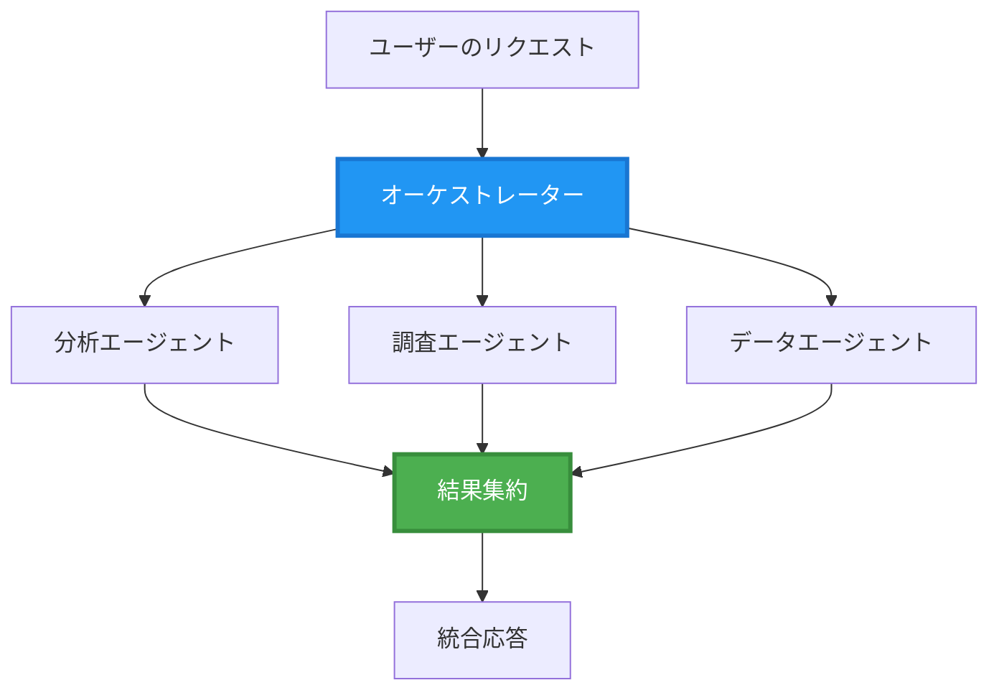
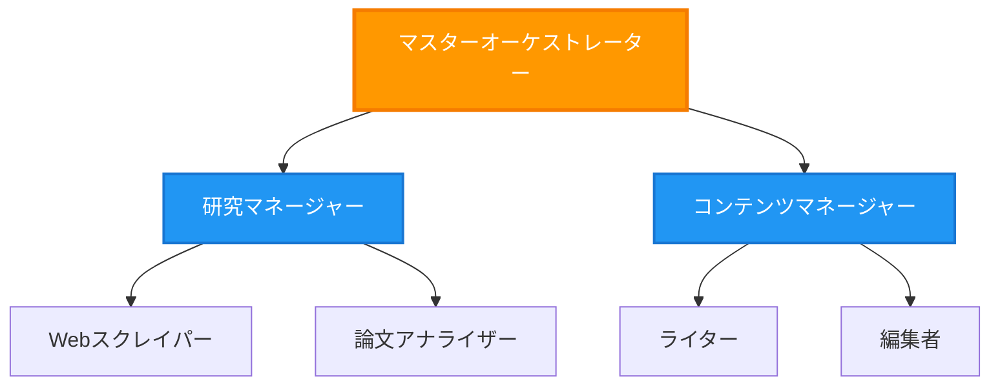
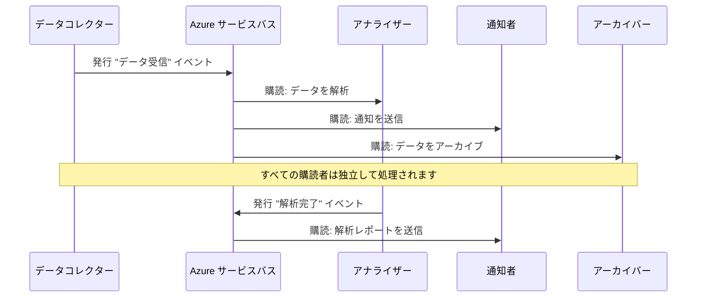
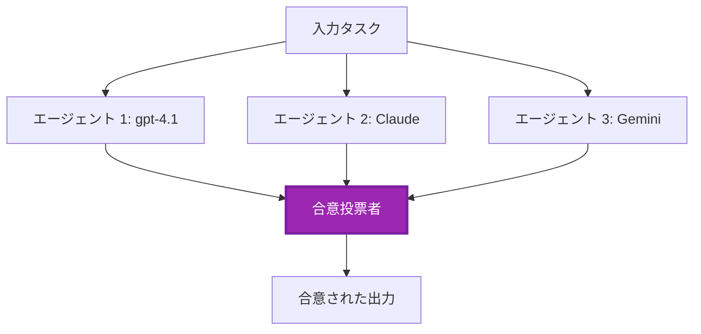
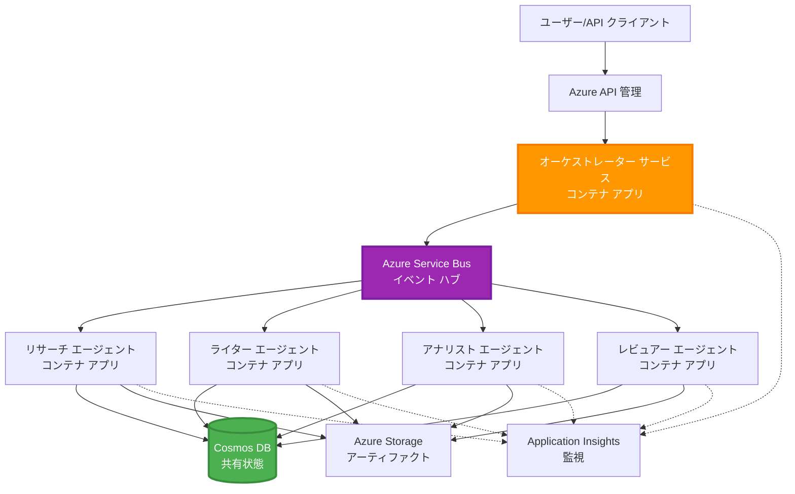

# マルチエージェント調整パターン

⏱️ <strong>推定所要時間</strong>: 60〜75 分 | 💰 <strong>推定コスト</strong>: 約$100-300/月 | ⭐ <strong>複雑さ</strong>: 上級

**📚 学習パス:**
- ← 前へ: [Capacity Planning](capacity-planning.md) - リソースのサイズ見積もりとスケーリング戦略
- 🎯 <strong>現在位置</strong>: マルチエージェント調整パターン（オーケストレーション、通信、状態管理）
- → 次へ: [SKU Selection](sku-selection.md) - 適切な Azure サービスの選択
- 🏠 [Course Home](../../README.md)

---

## このレッスンで学ぶこと

このレッスンを完了すると、以下ができるようになります:
- マルチエージェントアーキテクチャのパターンと適用時期を理解する
- オーケストレーションパターン（集中型、分散型、階層型）を実装する
- エージェント間の通信戦略（同期、非同期、イベント駆動）を設計する
- 分散エージェント間で共有状態を管理する
- AZD を使って Azure 上にマルチエージェントシステムをデプロイする
- 実世界の AI シナリオに調整パターンを適用する
- 分散エージェントシステムを監視およびデバッグする

## なぜマルチエージェントの調整が重要か

### 進化：シングルエージェントからマルチエージェントへ

**シングルエージェント（単純）:**
```
User → Agent → Response
```
- ✅ 理解と実装が容易
- ✅ 単純なタスクでは高速
- ❌ 単一モデルの能力に制約される
- ❌ 複雑なタスクを並列化できない
- ❌ 専門化がない

**マルチエージェントシステム（高度）:**
```mermaid
graph TD
    Orchestrator[オーケストレーター] --> Agent1[エージェント1<br/>計画]
    Orchestrator --> Agent2[エージェント2<br/>コード]
    Orchestrator --> Agent3[エージェント3<br/>レビュー]
```- ✅ 特定のタスクに特化したエージェント
- ✅ スピードのための並列実行
- ✅ モジュール化され保守しやすい
- ✅ 複雑なワークフローに強い
- ⚠️ 調整ロジックが必要

<strong>例え</strong>: シングルエージェントは一人の人がすべての作業を行うようなものです。マルチエージェントは研究者、コーダー、レビュアー、ライターなど各メンバーが専門技能を持ち協力するチームのようなものです。

---

## コア調整パターン

### パターン 1: 逐次調整（責任の連鎖）

<strong>使用場面</strong>: タスクは特定の順序で完了する必要があり、各エージェントは前の出力に基づく。

```mermaid
sequenceDiagram
    participant User
    participant Orchestrator
    participant Agent1 as リサーチエージェント
    participant Agent2 as ライターエージェント
    participant Agent3 as 編集エージェント
    
    User->>Orchestrator: "AIについての記事を書いて"
    Orchestrator->>Agent1: トピックを調査する
    Agent1-->>Orchestrator: 調査結果
    Orchestrator->>Agent2: 下書きを作成（調査を使用）
    Agent2-->>Orchestrator: 記事の草稿
    Orchestrator->>Agent3: 編集して改善する
    Agent3-->>Orchestrator: 最終版の記事
    Orchestrator-->>User: 校正済みの記事
    
    Note over User,Agent3: 逐次実行: 各ステップは前のステップを待つ
```
**利点:**
- ✅ データフローが明確
- ✅ デバッグが容易
- ✅ 実行順序が予測可能

**制限:**
- ❌ 遅い（並列化なし）
- ❌ 1つの失敗がチェーン全体を停止させる
- ❌ 相互依存タスクには不向き

**利用例:**
- コンテンツ作成パイプライン（調査 → 執筆 → 編集 → 公開）
- コード生成（計画 → 実装 → テスト → デプロイ）
- レポート生成（データ収集 → 分析 → 可視化 → 要約）

---

### パターン 2: 並列調整（ファンアウト/ファンイン）

<strong>使用場面</strong>: 独立したタスクは同時に実行でき、結果を最後に結合する。


**利点:**
- ✅ 高速（並列実行）
- ✅ フォールトトレラント（部分的な結果を許容）
- ✅ 水平方向にスケール可能

**制限:**
- ⚠️ 結果が順不同で到着する可能性がある
- ⚠️ 集約ロジックが必要
- ⚠️ 状態管理が複雑

**利用例:**
- 複数ソースからのデータ収集（API + データベース + ウェブスクレイピング）
- 競合分析（複数モデルが解を生成し、最良を選択）
- 翻訳サービス（複数言語への同時翻訳）

---

### パターン 3: 階層型調整（マネージャー-ワーカー）

<strong>使用場面</strong>: サブタスクを含む複雑なワークフローで、委任が必要な場合。


**利点:**
- ✅ 複雑なワークフローを処理できる
- ✅ モジュール化され保守しやすい
- ✅ 責任範囲が明確

**制限:**
- ⚠️ アーキテクチャがより複雑
- ⚠️ レイテンシが高くなりがち（複数の調整レイヤー）
- ⚠️ 洗練されたオーケストレーションが必要

**利用例:**
- 企業向け文書処理（分類 → ルーティング → 処理 → アーカイブ）
- 多段階データパイプライン（取り込み → クレンジング → 変換 → 分析 → レポート）
- 複雑な自動化ワークフロー（計画 → リソース配分 → 実行 → 監視）

---

### パターン 4: イベント駆動型調整（パブリッシュ-サブスクライブ）

<strong>使用場面</strong>: エージェントがイベントに反応する必要があり、疎結合が望ましい場合。


**利点:**
- ✅ エージェント間の疎結合
- ✅ 新しいエージェントの追加が容易（サブスクライブするだけ）
- ✅ 非同期処理が容易
- ✅ レジリエント（メッセージ永続化）

**制限:**
- ⚠️ 最終的整合性
- ⚠️ デバッグが複雑
- ⚠️ メッセージの順序問題

**利用例:**
- リアルタイム監視システム（アラート、ダッシュボード、ログ）
- マルチチャネル通知（メール、SMS、プッシュ、Slack）
- データ処理パイプライン（同じデータを複数のコンシューマが消費）

---

### パターン 5: コンセンサスベースの調整（投票/定足数）

<strong>使用場面</strong>: 進行前に複数のエージェントから合意が必要な場合。


**利点:**
- ✅ 精度が向上（複数の意見）
- ✅ フォールトトレラント（少数の故障を許容）
- ✅ 品質保証が組み込まれている

**制限:**
- ❌ コストが高い（複数のモデル呼び出し）
- ❌ 遅い（全エージェントの応答を待つ）
- ⚠️ 競合解決が必要

**利用例:**
- コンテンツモデレーション（複数モデルによるレビュー）
- コードレビュー（複数のリンター/アナライザー）
- 医療診断（複数の AI モデル、専門家の検証）

---

## アーキテクチャ概要

### Azure 上の完全なマルチエージェントシステム


**主要コンポーネント:**

| Component | Purpose | Azure Service |
|-----------|---------|---------------|
| **API Gateway** | エントリーポイント、レート制限、認証 | API Management |
| **Orchestrator** | エージェントワークフローを調整 | Container Apps |
| **Message Queue** | 非同期通信 | Service Bus / Event Hubs |
| **Agents** | 専門の AI ワーカー | Container Apps / Functions |
| **State Store** | 共有状態、タスク追跡 | Cosmos DB |
| **Artifact Storage** | ドキュメント、結果、ログ | Blob Storage |
| **Monitoring** | 分散トレーシング、ログ | Application Insights |

---

## 前提条件

### 必要なツール

```bash
# Azure Developer CLI を確認してください
azd version
# ✅ 期待されるバージョン: azd 1.0.0 以上

# Azure CLI を確認してください
az --version
# ✅ 期待されるバージョン: azure-cli 2.50.0 以上

# Docker（ローカルテスト用）を確認してください
docker --version
# ✅ 期待されるバージョン: Docker のバージョン 20.10 以上
```

### Azure の要件

- 有効な Azure サブスクリプション
- 次の作成権限:
  - Container Apps
  - Service Bus namespaces
  - Cosmos DB accounts
  - Storage accounts
  - Application Insights

### 知識の前提条件

以下を完了していること:
- [Configuration Management](../chapter-03-configuration/configuration.md)
- [Authentication & Security](../chapter-03-configuration/authsecurity.md)
- [Microservices Example](../../../../examples/microservices)

---

## 実装ガイド

### プロジェクト構成

```
multi-agent-system/
├── azure.yaml                    # AZD configuration
├── infra/
│   ├── main.bicep               # Main infrastructure
│   ├── core/
│   │   ├── servicebus.bicep     # Message queue
│   │   ├── cosmos.bicep         # State store
│   │   ├── storage.bicep        # Artifact storage
│   │   └── monitoring.bicep     # Application Insights
│   └── app/
│       ├── orchestrator.bicep   # Orchestrator service
│       └── agent.bicep          # Agent template
└── src/
    ├── orchestrator/            # Orchestration logic
    │   ├── app.py
    │   ├── workflows.py
    │   └── Dockerfile
    ├── agents/
    │   ├── research/            # Research agent
    │   ├── writer/              # Writer agent
    │   ├── analyst/             # Analyst agent
    │   └── reviewer/            # Reviewer agent
    └── shared/
        ├── state_manager.py     # Shared state logic
        └── message_handler.py   # Message handling
```

---

## レッスン 1: 逐次調整パターン

### 実装: コンテンツ作成パイプライン

逐次パイプラインを構築します: 調査 → 執筆 → 編集 → 公開

### 1. AZD 設定

**ファイル: `azure.yaml`**

```yaml
name: content-pipeline
metadata:
  template: multi-agent-sequential@1.0.0

services:
  orchestrator:
    project: ./src/orchestrator
    language: python
    host: containerapp
  
  research-agent:
    project: ./src/agents/research
    language: python
    host: containerapp
  
  writer-agent:
    project: ./src/agents/writer
    language: python
    host: containerapp
  
  editor-agent:
    project: ./src/agents/editor
    language: python
    host: containerapp
```

### 2. インフラ: 調整用の Service Bus

**ファイル: `infra/core/servicebus.bicep`**

```bicep
param name string
param location string
param tags object = {}

resource serviceBusNamespace 'Microsoft.ServiceBus/namespaces@2022-10-01-preview' = {
  name: name
  location: location
  tags: tags
  sku: {
    name: 'Standard'
    tier: 'Standard'
  }
  properties: {
    minimumTlsVersion: '1.2'
  }
}

// Queue for orchestrator → research agent
resource researchQueue 'Microsoft.ServiceBus/namespaces/queues@2022-10-01-preview' = {
  parent: serviceBusNamespace
  name: 'research-tasks'
  properties: {
    maxDeliveryCount: 3
    lockDuration: 'PT5M'
    deadLetteringOnMessageExpiration: true
  }
}

// Queue for research agent → writer agent
resource writerQueue 'Microsoft.ServiceBus/namespaces/queues@2022-10-01-preview' = {
  parent: serviceBusNamespace
  name: 'writer-tasks'
  properties: {
    maxDeliveryCount: 3
    lockDuration: 'PT5M'
  }
}

// Queue for writer agent → editor agent
resource editorQueue 'Microsoft.ServiceBus/namespaces/queues@2022-10-01-preview' = {
  parent: serviceBusNamespace
  name: 'editor-tasks'
  properties: {
    maxDeliveryCount: 3
    lockDuration: 'PT5M'
  }
}

output namespace string = serviceBusNamespace.name
output connectionString string = listKeys('${serviceBusNamespace.id}/AuthorizationRules/RootManageSharedAccessKey', serviceBusNamespace.apiVersion).primaryConnectionString
```

### 3. 共有状態マネージャー

**ファイル: `src/shared/state_manager.py`**

```python
from azure.cosmos import CosmosClient, PartitionKey
from datetime import datetime
import os

class StateManager:
    """Manages shared state across agents using Cosmos DB"""
    
    def __init__(self):
        endpoint = os.environ['COSMOS_ENDPOINT']
        key = os.environ['COSMOS_KEY']
        
        self.client = CosmosClient(endpoint, key)
        self.database = self.client.get_database_client('agent-state')
        self.container = self.database.get_container_client('tasks')
    
    def create_task(self, task_id: str, task_type: str, input_data: dict):
        """Create a new task"""
        task = {
            'id': task_id,
            'type': task_type,
            'status': 'pending',
            'input': input_data,
            'created_at': datetime.utcnow().isoformat(),
            'steps': []
        }
        self.container.create_item(task)
        return task
    
    def update_task_step(self, task_id: str, step_name: str, result: dict):
        """Update task with completed step"""
        task = self.container.read_item(task_id, partition_key=task_id)
        
        task['steps'].append({
            'name': step_name,
            'completed_at': datetime.utcnow().isoformat(),
            'result': result
        })
        
        self.container.replace_item(task_id, task)
        return task
    
    def complete_task(self, task_id: str, final_result: dict):
        """Mark task as complete"""
        task = self.container.read_item(task_id, partition_key=task_id)
        task['status'] = 'completed'
        task['result'] = final_result
        task['completed_at'] = datetime.utcnow().isoformat()
        self.container.replace_item(task_id, task)
        return task
    
    def get_task(self, task_id: str):
        """Retrieve task state"""
        return self.container.read_item(task_id, partition_key=task_id)
```

### 4. オーケストレーターサービス

**ファイル: `src/orchestrator/app.py`**

```python
from flask import Flask, request, jsonify
from azure.servicebus import ServiceBusClient, ServiceBusMessage
import json
import uuid
import os
from shared.state_manager import StateManager

app = Flask(__name__)
state_manager = StateManager()

# Service Bus への接続
servicebus_connection_str = os.environ['SERVICEBUS_CONNECTION_STRING']
servicebus_client = ServiceBusClient.from_connection_string(servicebus_connection_str)

@app.route('/health', methods=['GET'])
def health():
    return jsonify({'status': 'healthy', 'service': 'orchestrator'})

@app.route('/create-content', methods=['POST'])
def create_content():
    """
    Sequential workflow: Research → Write → Edit → Publish
    """
    data = request.json
    topic = data.get('topic')
    
    if not topic:
        return jsonify({'error': 'Topic required'}), 400
    
    # ステートストアにタスクを作成する
    task_id = str(uuid.uuid4())
    task = state_manager.create_task(
        task_id=task_id,
        task_type='content_creation',
        input_data={'topic': topic}
    )
    
    # リサーチエージェントにメッセージを送信する（最初のステップ）
    sender = servicebus_client.get_queue_sender('research-tasks')
    message = ServiceBusMessage(
        body=json.dumps({
            'task_id': task_id,
            'topic': topic,
            'next_queue': 'writer-tasks'  # 結果の送信先
        }),
        content_type='application/json'
    )
    
    with sender:
        sender.send_messages(message)
    
    return jsonify({
        'task_id': task_id,
        'status': 'started',
        'workflow': 'sequential',
        'steps': ['research', 'write', 'edit', 'publish'],
        'message': 'Content creation pipeline initiated'
    }), 202

@app.route('/task/<task_id>', methods=['GET'])
def get_task_status(task_id):
    """Check task status"""
    try:
        task = state_manager.get_task(task_id)
        return jsonify(task)
    except Exception as e:
        return jsonify({'error': str(e)}), 404

if __name__ == '__main__':
    app.run(host='0.0.0.0', port=8080)
```

### 5. リサーチエージェント

**ファイル: `src/agents/research/app.py`**

```python
from azure.servicebus import ServiceBusClient, ServiceBusMessage
from openai import AzureOpenAI
import json
import os
import time
from shared.state_manager import StateManager

# クライアントを初期化する
state_manager = StateManager()
servicebus_client = ServiceBusClient.from_connection_string(
    os.environ['SERVICEBUS_CONNECTION_STRING']
)

openai_client = AzureOpenAI(
    api_key=os.environ['AZURE_OPENAI_API_KEY'],
    api_version="2024-02-01",
    azure_endpoint=os.environ['AZURE_OPENAI_ENDPOINT']
)

def process_research_task(message_data):
    """Process research request and pass to writer"""
    task_id = message_data['task_id']
    topic = message_data['topic']
    next_queue = message_data['next_queue']
    
    print(f"🔬 Researching: {topic}")
    
    # 研究のために Microsoft Foundry モデルを呼び出す
    response = openai_client.chat.completions.create(
        model="gpt-4.1",
        messages=[
            {"role": "system", "content": "You are a research assistant. Provide comprehensive research on the given topic."},
            {"role": "user", "content": f"Research this topic thoroughly: {topic}"}
        ],
        max_tokens=1500
    )
    
    research_results = response.choices[0].message.content
    
    # 状態を更新する
    state_manager.update_task_step(
        task_id=task_id,
        step_name='research',
        result={'research': research_results}
    )
    
    # 次のエージェント (ライター) に送る
    sender = servicebus_client.get_queue_sender(next_queue)
    message = ServiceBusMessage(
        body=json.dumps({
            'task_id': task_id,
            'topic': topic,
            'research': research_results,
            'next_queue': 'editor-tasks'
        }),
        content_type='application/json'
    )
    
    with sender:
        sender.send_messages(message)
    
    print(f"✅ Research complete for task {task_id}")

def main():
    """Listen to research queue"""
    receiver = servicebus_client.get_queue_receiver('research-tasks')
    
    print("🔬 Research Agent started, listening for tasks...")
    
    with receiver:
        while True:
            messages = receiver.receive_messages(max_wait_time=5)
            for message in messages:
                try:
                    message_data = json.loads(str(message))
                    process_research_task(message_data)
                    receiver.complete_message(message)
                except Exception as e:
                    print(f"❌ Error processing message: {e}")
                    receiver.abandon_message(message)

if __name__ == '__main__':
    main()
```

### 6. ライターエージェント

**ファイル: `src/agents/writer/app.py`**

```python
from azure.servicebus import ServiceBusClient, ServiceBusMessage
from openai import AzureOpenAI
import json
import os
from shared.state_manager import StateManager

state_manager = StateManager()
servicebus_client = ServiceBusClient.from_connection_string(
    os.environ['SERVICEBUS_CONNECTION_STRING']
)

openai_client = AzureOpenAI(
    api_key=os.environ['AZURE_OPENAI_API_KEY'],
    api_version="2024-02-01",
    azure_endpoint=os.environ['AZURE_OPENAI_ENDPOINT']
)

def process_writing_task(message_data):
    """Write article based on research"""
    task_id = message_data['task_id']
    topic = message_data['topic']
    research = message_data['research']
    next_queue = message_data['next_queue']
    
    print(f"✍️ Writing article: {topic}")
    
    # Microsoft Foundry Models を呼び出して記事を書く
    response = openai_client.chat.completions.create(
        model="gpt-4.1",
        messages=[
            {"role": "system", "content": "You are a professional writer. Write engaging, well-structured articles."},
            {"role": "user", "content": f"Based on this research:\n\n{research}\n\nWrite a comprehensive article about: {topic}"}
        ],
        max_tokens=2000
    )
    
    article_draft = response.choices[0].message.content
    
    # 状態を更新する
    state_manager.update_task_step(
        task_id=task_id,
        step_name='writing',
        result={'draft': article_draft}
    )
    
    # 編集者に送る
    sender = servicebus_client.get_queue_sender(next_queue)
    message = ServiceBusMessage(
        body=json.dumps({
            'task_id': task_id,
            'topic': topic,
            'draft': article_draft
        }),
        content_type='application/json'
    )
    
    with sender:
        sender.send_messages(message)
    
    print(f"✅ Article draft complete for task {task_id}")

def main():
    """Listen to writer queue"""
    receiver = servicebus_client.get_queue_receiver('writer-tasks')
    
    print("✍️ Writer Agent started, listening for tasks...")
    
    with receiver:
        while True:
            messages = receiver.receive_messages(max_wait_time=5)
            for message in messages:
                try:
                    message_data = json.loads(str(message))
                    process_writing_task(message_data)
                    receiver.complete_message(message)
                except Exception as e:
                    print(f"❌ Error: {e}")
                    receiver.abandon_message(message)

if __name__ == '__main__':
    main()
```

### 7. エディターエージェント

**ファイル: `src/agents/editor/app.py`**

```python
from azure.servicebus import ServiceBusClient
from openai import AzureOpenAI
import json
import os
from shared.state_manager import StateManager

state_manager = StateManager()
servicebus_client = ServiceBusClient.from_connection_string(
    os.environ['SERVICEBUS_CONNECTION_STRING']
)

openai_client = AzureOpenAI(
    api_key=os.environ['AZURE_OPENAI_API_KEY'],
    api_version="2024-02-01",
    azure_endpoint=os.environ['AZURE_OPENAI_ENDPOINT']
)

def process_editing_task(message_data):
    """Edit and finalize article"""
    task_id = message_data['task_id']
    topic = message_data['topic']
    draft = message_data['draft']
    
    print(f"📝 Editing article: {topic}")
    
    # 編集するために Microsoft Foundry Models を呼び出す
    response = openai_client.chat.completions.create(
        model="gpt-4.1",
        messages=[
            {"role": "system", "content": "You are an expert editor. Improve grammar, clarity, and structure."},
            {"role": "user", "content": f"Edit and improve this article:\n\n{draft}"}
        ],
        max_tokens=2000
    )
    
    final_article = response.choices[0].message.content
    
    # タスクを完了としてマークする
    state_manager.complete_task(
        task_id=task_id,
        final_result={
            'topic': topic,
            'final_article': final_article,
            'word_count': len(final_article.split())
        }
    )
    
    print(f"✅ Article finalized for task {task_id}")

def main():
    """Listen to editor queue"""
    receiver = servicebus_client.get_queue_receiver('editor-tasks')
    
    print("📝 Editor Agent started, listening for tasks...")
    
    with receiver:
        while True:
            messages = receiver.receive_messages(max_wait_time=5)
            for message in messages:
                try:
                    message_data = json.loads(str(message))
                    process_editing_task(message_data)
                    receiver.complete_message(message)
                except Exception as e:
                    print(f"❌ Error: {e}")
                    receiver.abandon_message(message)

if __name__ == '__main__':
    main()
```

### 8. デプロイとテスト

```bash
# オプションA: テンプレートベースのデプロイ
azd init
azd up

# オプションB: エージェントマニフェストによるデプロイ (拡張が必要)
azd extension install azure.ai.agents
azd ai agent init -m agent-manifest.yaml
azd up
```

> すべての `azd ai` フラグとオプションについては [AZD AI CLI Commands](../chapter-08-production/production-ai-practices.md#azd-ai-cli-commands-and-extensions) を参照してください。

```bash
# オーケストレーターのURLを取得する
ORCHESTRATOR_URL=$(azd env get-values | grep ORCHESTRATOR_URL | cut -d '=' -f2 | tr -d '"')

# コンテンツを作成する
curl -X POST $ORCHESTRATOR_URL/create-content \
  -H "Content-Type: application/json" \
  -d '{"topic": "The Future of AI in Healthcare"}'
```

**✅ 期待される出力:**
```json
{
  "task_id": "a1b2c3d4-e5f6-7890-abcd-ef1234567890",
  "status": "started",
  "workflow": "sequential",
  "steps": ["research", "write", "edit", "publish"],
  "message": "Content creation pipeline initiated"
}
```

**タスク進捗を確認:**
```bash
TASK_ID="a1b2c3d4-e5f6-7890-abcd-ef1234567890"
curl $ORCHESTRATOR_URL/task/$TASK_ID
```

**✅ 期待される出力（完了）:**
```json
{
  "id": "a1b2c3d4-e5f6-7890-abcd-ef1234567890",
  "type": "content_creation",
  "status": "completed",
  "steps": [
    {
      "name": "research",
      "completed_at": "2025-11-19T10:30:00Z",
      "result": {"research": "..."}
    },
    {
      "name": "writing",
      "completed_at": "2025-11-19T10:32:00Z",
      "result": {"draft": "..."}
    }
  ],
  "result": {
    "topic": "The Future of AI in Healthcare",
    "final_article": "...",
    "word_count": 1500
  }
}
```

---

## レッスン 2: 並列調整パターン

### 実装: マルチソース調査アグリゲーター

複数のソースから同時に情報を収集する並列システムを構築します。

### 並列オーケストレーター

**ファイル: `src/orchestrator/parallel_workflow.py`**

```python
from flask import Flask, request, jsonify
from azure.servicebus import ServiceBusClient, ServiceBusMessage
import json
import uuid
import os
from shared.state_manager import StateManager

app = Flask(__name__)
state_manager = StateManager()

servicebus_client = ServiceBusClient.from_connection_string(
    os.environ['SERVICEBUS_CONNECTION_STRING']
)

@app.route('/research-parallel', methods=['POST'])
def research_parallel():
    """
    Parallel workflow: Multiple agents work simultaneously
    """
    data = request.json
    query = data.get('query')
    
    task_id = str(uuid.uuid4())
    task = state_manager.create_task(
        task_id=task_id,
        task_type='parallel_research',
        input_data={
            'query': query,
            'agents': ['web', 'academic', 'news', 'social']
        }
    )
    
    # ファンアウト: すべてのエージェントに同時に送信
    agents = [
        ('web-research-queue', 'web'),
        ('academic-research-queue', 'academic'),
        ('news-research-queue', 'news'),
        ('social-research-queue', 'social')
    ]
    
    for queue_name, agent_type in agents:
        sender = servicebus_client.get_queue_sender(queue_name)
        message = ServiceBusMessage(
            body=json.dumps({
                'task_id': task_id,
                'query': query,
                'agent_type': agent_type,
                'result_queue': 'aggregation-queue'
            }),
            content_type='application/json'
        )
        
        with sender:
            sender.send_messages(message)
    
    return jsonify({
        'task_id': task_id,
        'status': 'started',
        'workflow': 'parallel',
        'agents_dispatched': 4,
        'message': 'Parallel research initiated'
    }), 202

if __name__ == '__main__':
    app.run(host='0.0.0.0', port=8080)
```

### 集約ロジック

**ファイル: `src/agents/aggregator/app.py`**

```python
from azure.servicebus import ServiceBusClient
import json
import os
from collections import defaultdict
from shared.state_manager import StateManager

state_manager = StateManager()
servicebus_client = ServiceBusClient.from_connection_string(
    os.environ['SERVICEBUS_CONNECTION_STRING']
)

# タスクごとの結果を追跡する
task_results = defaultdict(list)
expected_agents = 4  # ウェブ、学術、ニュース、ソーシャル

def process_result(message_data):
    """Aggregate results from parallel agents"""
    task_id = message_data['task_id']
    agent_type = message_data['agent_type']
    result = message_data['result']
    
    # 結果を保存する
    task_results[task_id].append({
        'agent': agent_type,
        'data': result
    })
    
    print(f"📊 Received result from {agent_type} agent ({len(task_results[task_id])}/{expected_agents})")
    
    # すべてのエージェントが完了したか確認する（ファンイン）
    if len(task_results[task_id]) == expected_agents:
        print(f"✅ All agents completed for task {task_id}. Aggregating...")
        
        # 結果を結合する
        aggregated = {
            'query': message_data['query'],
            'sources': task_results[task_id],
            'summary': generate_summary(task_results[task_id])
        }
        
        # 完了としてマークする
        state_manager.complete_task(task_id, aggregated)
        
        # クリーンアップする
        del task_results[task_id]
        
        print(f"✅ Aggregation complete for task {task_id}")

def generate_summary(results):
    """Generate summary from all sources"""
    summaries = [r['data'].get('summary', '') for r in results]
    return '\n\n'.join(summaries)

def main():
    """Listen to aggregation queue"""
    receiver = servicebus_client.get_queue_receiver('aggregation-queue')
    
    print("📊 Aggregator started, listening for results...")
    
    with receiver:
        while True:
            messages = receiver.receive_messages(max_wait_time=5)
            for message in messages:
                try:
                    message_data = json.loads(str(message))
                    process_result(message_data)
                    receiver.complete_message(message)
                except Exception as e:
                    print(f"❌ Error: {e}")
                    receiver.abandon_message(message)

if __name__ == '__main__':
    main()
```

**並列パターンの利点:**
- ⚡ **4x 高速**（エージェントが同時に実行）
- 🔄 <strong>フォールトトレラント</strong>（部分的な結果を許容）
- 📈 <strong>スケーラブル</strong>（エージェントを簡単に追加）

---

## 実践演習

### 演習 1: タイムアウト処理を追加 ⭐⭐（中級）

<strong>目的</strong>: 集約器が遅いエージェントを永遠に待たないようにタイムアウトロジックを実装する。

<strong>手順</strong>:

1. **集約器にタイムアウト追跡を追加:**

```python
from datetime import datetime, timedelta

task_timeouts = {}  # task_id を expiration_time に対応付ける

def process_result(message_data):
    task_id = message_data['task_id']
    
    # 最初の結果にタイムアウトを設定する
    if task_id not in task_timeouts:
        task_timeouts[task_id] = datetime.utcnow() + timedelta(seconds=30)
    
    task_results[task_id].append({
        'agent': message_data['agent_type'],
        'data': message_data['result']
    })
    
    # 完了しているか、またはタイムアウトしたかを確認する
    if len(task_results[task_id]) == expected_agents or \
       datetime.utcnow() > task_timeouts[task_id]:
        
        print(f"📊 Aggregating with {len(task_results[task_id])}/{expected_agents} results")
        
        aggregated = {
            'query': message_data['query'],
            'sources': task_results[task_id],
            'completed_agents': len(task_results[task_id]),
            'timed_out': len(task_results[task_id]) < expected_agents
        }
        
        state_manager.complete_task(task_id, aggregated)
        
        # クリーンアップ
        del task_results[task_id]
        del task_timeouts[task_id]
```

2. **人工的な遅延でテスト:**

```python
# あるエージェントに遅延を追加して、処理が遅いことをシミュレートする
import time
time.sleep(35)  # 30秒のタイムアウトを超える
```

3. **デプロイして検証:**

```bash
azd deploy aggregator

# タスクを送信
curl -X POST $ORCHESTRATOR_URL/research-parallel \
  -H "Content-Type: application/json" \
  -d '{"query": "AI safety research"}'

# 30秒後に結果を確認する
curl $ORCHESTRATOR_URL/task/$TASK_ID
```

**✅ 成功基準:**
- ✅ エージェントが未完でも30秒後にタスクが完了する
- ✅ レスポンスに部分的な結果を示す（"timed_out": true）
- ✅ 利用可能な結果が返される（4つ中3つのエージェント）

<strong>所要時間</strong>: 20-25 分

---

### 演習 2: リトライロジックの実装 ⭐⭐⭐（上級）

<strong>目的</strong>: 失敗したエージェントタスクを自動的にリトライしてから諦める。

<strong>手順</strong>:

1. **オーケストレーターにリトライ追跡を追加:**

```python
from dataclasses import dataclass
from typing import Dict

@dataclass
class RetryConfig:
    max_retries: int = 3
    backoff_seconds: int = 5

retry_counts: Dict[str, int] = {}  # message_id は retry_count に対応する

def send_with_retry(queue_name: str, message_data: dict, retry_config: RetryConfig):
    """Send message with retry metadata"""
    message_id = message_data.get('message_id', str(uuid.uuid4()))
    message_data['message_id'] = message_id
    message_data['retry_count'] = retry_counts.get(message_id, 0)
    message_data['max_retries'] = retry_config.max_retries
    
    sender = servicebus_client.get_queue_sender(queue_name)
    message = ServiceBusMessage(
        body=json.dumps(message_data),
        content_type='application/json',
        message_id=message_id
    )
    
    with sender:
        sender.send_messages(message)
```

2. **エージェントにリトライハンドラを追加:**

```python
def process_with_retry(message, receiver, process_func):
    """Process message with automatic retry on failure"""
    try:
        message_data = json.loads(str(message))
        
        # メッセージを処理する
        process_func(message_data)
        
        # 成功 - 完了
        receiver.complete_message(message)
        
    except Exception as e:
        message_id = message.message_id
        retry_count = message_data.get('retry_count', 0)
        max_retries = message_data.get('max_retries', 3)
        
        if retry_count < max_retries:
            # 再試行: 放棄してカウントを増やし、再キューに入れる
            print(f"⚠️ Retry {retry_count + 1}/{max_retries} for message {message_id}")
            
            message_data['retry_count'] = retry_count + 1
            
            # 遅延付きで同じキューに戻す
            time.sleep(5 * (retry_count + 1))  # 指数的バックオフ
            send_with_retry(queue_name, message_data, RetryConfig())
            
            receiver.complete_message(message)  # 元のメッセージを削除する
        else:
            # 最大再試行回数を超過 - デッドレターキューに移動
            print(f"❌ Max retries exceeded for message {message_id}")
            receiver.dead_letter_message(
                message,
                reason="MaxRetriesExceeded",
                error_description=str(e)
            )
```

3. **デッドレターキューを監視:**

```python
def monitor_dead_letters():
    """Check dead letter queue for failed messages"""
    receiver = servicebus_client.get_queue_receiver(
        'research-queue',
        sub_queue='deadletter'
    )
    
    with receiver:
        messages = receiver.receive_messages(max_wait_time=5)
        for message in messages:
            print(f"☠️ Dead letter: {message.message_id}")
            print(f"Reason: {message.dead_letter_reason}")
            print(f"Description: {message.dead_letter_error_description}")
```

**✅ 成功基準:**
- ✅ 失敗タスクが自動的にリトライされる（最大3回）
- ✅ リトライ間に指数バックオフ（5s、10s、15s）
- ✅ 最大リトライ後、メッセージはデッドレターキューへ移る
- ✅ デッドレターキューを監視してリプレイできる

<strong>所要時間</strong>: 30-40 分

---

### 演習 3: サーキットブレーカーを実装 ⭐⭐⭐（上級）

<strong>目的</strong>: 故障が連鎖しないよう、故障中のエージェントへのリクエストを停止する。

<strong>手順</strong>:

1. **サーキットブレーカークラスを作成:**

```python
from enum import Enum
from datetime import datetime, timedelta

class CircuitState(Enum):
    CLOSED = "closed"      # 通常動作
    OPEN = "open"          # 失敗中、リクエストを拒否する
    HALF_OPEN = "half_open"  # 回復しているかをテスト中

class CircuitBreaker:
    def __init__(self, failure_threshold=5, timeout_seconds=60):
        self.failure_threshold = failure_threshold
        self.timeout_seconds = timeout_seconds
        self.failure_count = 0
        self.last_failure_time = None
        self.state = CircuitState.CLOSED
    
    def call(self, func):
        """Execute function with circuit breaker protection"""
        if self.state == CircuitState.OPEN:
            # タイムアウトが経過したか確認する
            if datetime.utcnow() - self.last_failure_time > timedelta(seconds=self.timeout_seconds):
                self.state = CircuitState.HALF_OPEN
                print("🔄 Circuit breaker: HALF_OPEN (testing)")
            else:
                raise Exception(f"Circuit breaker OPEN for agent. Try again in {self.timeout_seconds}s")
        
        try:
            result = func()
            
            # 成功
            if self.state == CircuitState.HALF_OPEN:
                self.state = CircuitState.CLOSED
                self.failure_count = 0
                print("✅ Circuit breaker: CLOSED (recovered)")
            
            return result
            
        except Exception as e:
            self.failure_count += 1
            self.last_failure_time = datetime.utcnow()
            
            if self.failure_count >= self.failure_threshold:
                self.state = CircuitState.OPEN
                print(f"🔴 Circuit breaker: OPEN (too many failures)")
            
            raise e
```

2. **エージェント呼び出しに適用:**

```python
# オーケストレーター内で
agent_circuits = {
    'web': CircuitBreaker(failure_threshold=5, timeout_seconds=60),
    'academic': CircuitBreaker(failure_threshold=5, timeout_seconds=60),
    'news': CircuitBreaker(failure_threshold=5, timeout_seconds=60),
    'social': CircuitBreaker(failure_threshold=5, timeout_seconds=60)
}

def send_to_agent(agent_type, message_data):
    """Send with circuit breaker protection"""
    circuit = agent_circuits[agent_type]
    
    try:
        circuit.call(lambda: send_message(agent_type, message_data))
    except Exception as e:
        print(f"⚠️ Skipping {agent_type} agent: {e}")
        # 他のエージェントで続行する
```

3. **サーキットブレーカーをテスト:**

```bash
# 繰り返しの失敗をシミュレートする（1つのエージェントを停止する）
az containerapp stop --name web-research-agent --resource-group rg-agents

# 複数のリクエストを送信する
for i in {1..10}; do
  curl -X POST $ORCHESTRATOR_URL/research-parallel \
    -H "Content-Type: application/json" \
    -d '{"query": "test query '$i'"}'
  sleep 2
done

# ログを確認する - 5回の失敗後にサーキットブレーカーがオープンになるのが確認できるはず
# コンテナアプリのログには Azure CLI を使用する:
az containerapp logs show --name orchestrator --resource-group $RG_NAME --tail 50
```

**✅ 成功基準:**
- ✅ 5回の失敗後、サーキットがオープン（リクエストを拒否）
- ✅ 60秒後、サーキットはハーフオープン（回復をテスト）
- ✅ 他のエージェントは通常通り動作し続ける
- ✅ エージェントが回復すると自動的にサーキットがクローズする

<strong>所要時間</strong>: 40-50 分

---

## 監視とデバッグ

### Application Insights を使った分散トレーシング

**ファイル: `src/shared/tracing.py`**

```python
from opencensus.ext.azure.log_exporter import AzureLogHandler
from opencensus.ext.azure.trace_exporter import AzureExporter
from opencensus.trace import config_integration
from opencensus.trace.tracer import Tracer
from opencensus.trace.samplers import AlwaysOnSampler
import logging
import os

# トレーシングを構成する
config_integration.trace_integrations(['requests', 'logging'])

connection_string = os.environ.get('APPLICATIONINSIGHTS_CONNECTION_STRING')

# トレーサーを作成する
tracer = Tracer(
    exporter=AzureExporter(connection_string=connection_string),
    sampler=AlwaysOnSampler()
)

# ロギングを構成する
logger = logging.getLogger(__name__)
logger.addHandler(AzureLogHandler(connection_string=connection_string))
logger.setLevel(logging.INFO)

def trace_agent_call(agent_name, task_id, operation):
    """Trace agent operations"""
    with tracer.span(name=f'{agent_name}.{operation}') as span:
        span.add_attribute('agent', agent_name)
        span.add_attribute('task_id', task_id)
        span.add_attribute('operation', operation)
        
        try:
            result = operation()
            span.add_attribute('status', 'success')
            return result
        except Exception as e:
            span.add_attribute('status', 'error')
            span.add_attribute('error', str(e))
            raise
```

### Application Insights クエリ

**マルチエージェントワークフローを追跡:**

```kusto
// Trace complete workflow for a task
traces
| where customDimensions.task_id == "a1b2c3d4-..."
| project timestamp, message, customDimensions.agent, customDimensions.operation
| order by timestamp asc
```

**エージェントのパフォーマンス比較:**

```kusto
// Compare agent execution times
dependencies
| where name contains "agent"
| summarize 
    avg_duration = avg(duration),
    p95_duration = percentile(duration, 95),
    count = count()
  by agent = tostring(customDimensions.agent)
| order by avg_duration desc
```

**障害分析:**

```kusto
// Find which agents fail most
exceptions
| where customDimensions.agent != ""
| summarize 
    failure_count = count(),
    unique_errors = dcount(outerMessage)
  by agent = tostring(customDimensions.agent)
| order by failure_count desc
```

---

## コスト分析

### マルチエージェントシステムのコスト（推定・月額）

| Component | Configuration | Cost |
|-----------|--------------|------|
| **Orchestrator** | 1 Container App (1 vCPU, 2GB) | $30-50 |
| **4 Agents** | 4 Container Apps (0.5 vCPU, 1GB each) | $60-120 |
| **Service Bus** | Standard tier, 10M messages | $10-20 |
| **Cosmos DB** | Serverless, 5GB storage, 1M RUs | $25-50 |
| **Blob Storage** | 10GB storage, 100K operations | $5-10 |
| **Application Insights** | 5GB ingestion | $10-15 |
| **Microsoft Foundry Models** | gpt-4.1, 10M tokens | $100-300 |
| **Total** | | **$240-565/month** |

### コスト最適化戦略

1. **可能な限りサーバーレスを使用する:**
   ```bicep
   // Cosmos DB serverless (no minimum cost)
   properties: {
     databaseAccountOfferType: 'Standard'
     capabilities: [{ name: 'EnableServerless' }]
   }
   ```

2. **アイドル時にエージェントをゼロスケールにする:**
   ```bicep
   scale: {
     minReplicas: 0  // Scale to zero when no messages
     maxReplicas: 10
   }
   ```

3. **Service Bus のバッチ処理を活用する:**
   ```python
   # メッセージをバッチで送信する（安くなる）
   sender.send_messages([message1, message2, message3])
   ```

4. **頻繁に使用する結果をキャッシュする:**
   ```python
   # Azure Cache for Redis を使用する
   if cache.exists(query_hash):
       return cache.get(query_hash)
   ```

---

## ベストプラクティス

### ✅ 実施すべきこと:

1. <strong>冪等性のある操作を使用する</strong>
   ```python
   # エージェントは同じメッセージを複数回安全に処理できます
   def process_task(task_id):
       if state_manager.task_exists(task_id):
           print(f"Task {task_id} already processed, skipping")
           return
       # タスクを処理中...
   ```

2. <strong>包括的なログ記録を実装する</strong>
   ```python
   logger.info(f"Agent: {agent_name}, Task: {task_id}, Action: {action}")
   ```

3. **相関 ID を使用する**
   ```python
   # task_id をワークフロー全体に渡す
   message_data = {
       'task_id': task_id,  # 相関ID
       'timestamp': datetime.utcnow().isoformat()
   }
   ```

4. **メッセージの TTL（time-to-live）を設定する**
   ```bicep
   properties: {
     defaultMessageTimeToLive: 'PT1H'  // 1 hour max
   }
   ```

5. <strong>デッドレターキューを監視する</strong>
   ```python
   # 失敗したメッセージの定期的な監視
   monitor_dead_letters()
   ```

### ❌ 実施してはいけないこと:

1. <strong>循環依存を作成しない</strong>
   ```python
   # ❌ 悪い: エージェントA → エージェントB → エージェントA（無限ループ）
   # ✅ 良い: 明確な有向非巡回グラフ（DAG）を定義する
   ```

2. <strong>エージェントスレッドをブロックしない</strong>
   ```python
   # ❌ 悪い: 同期的な待機
   while not task_complete:
       time.sleep(1)
   
   # ✅ 良い: メッセージキューのコールバックを使用する
   ```

3. <strong>部分的な失敗を無視しない</strong>
   ```python
   # ❌ 悪い: 1つのエージェントが失敗したらワークフロー全体を失敗させる
   # ✅ 良い: エラーを示す指標を付けて部分的な結果を返す
   ```

4. <strong>無限リトライを使用しない</strong>
   ```python
   # ❌ 悪い: 無限に再試行する
   # ✅ 良い: max_retries = 3、その後デッドレターに送る
   ```

---

## トラブルシューティングガイド

### Problem: メッセージがキューに滞留している

**症状:**
- メッセージがキューに溜まる
- エージェントが処理していない
- タスクのステータスが "pending" のまま

**診断:**
```bash
# キューの深さを確認する
az servicebus queue show \
  --namespace-name mybus \
  --name research-tasks \
  --query "countDetails"

# Azure CLI を使用してエージェントのログを確認する
az containerapp logs show --name research-agent --resource-group $RG_NAME --tail 50
```

**解決策:**

1. **エージェントのレプリカ数を増やす:**
   ```bash
   az containerapp update \
     --name research-agent \
     --min-replicas 3 \
     --max-replicas 10
   ```

2. **デッドレターキューを確認する:**
   ```bash
   az servicebus queue show \
     --namespace-name mybus \
     --name research-tasks \
     --query "countDetails.deadLetterMessageCount"
   ```

---

### Problem: タスクがタイムアウトする/完了しない

**症状:**
- タスクのステータスが "in_progress" のまま
- 一部のエージェントは完了するが、他は完了しない
- エラーメッセージがない

**診断:**
```bash
# タスクの状態を確認する
curl $ORCHESTRATOR_URL/task/$TASK_ID

# Application Insights を確認する
# クエリを実行: traces | where customDimensions.task_id == "..."
```

**解決策:**

1. **アグリゲーターでタイムアウトを実装する (演習 1)**

2. **Azure Monitor を使用してエージェントの障害を確認する:**
   ```bash
   # azd monitor を使ってログを表示する
   azd monitor --logs
   
   # または Azure CLI を使って特定のコンテナー アプリのログを確認する
   az containerapp logs show --name <agent-name> --resource-group $RG_NAME --follow | grep "ERROR\|FAIL"
   ```

3. **すべてのエージェントが稼働していることを確認する:**
   ```bash
   az containerapp list \
     --resource-group rg-agents \
     --query "[].{name:name, status:properties.runningStatus}"
   ```

---

## 詳細

### 公式ドキュメント
- [Azure Service Bus](https://learn.microsoft.com/azure/service-bus-messaging/service-bus-messaging-overview)
- [Cosmos DB](https://learn.microsoft.com/azure/cosmos-db/introduction)
- [Container Apps DAPR](https://learn.microsoft.com/azure/container-apps/dapr-overview)
- [マルチエージェント設計パターン](https://learn.microsoft.com/azure/architecture/guide/ai/multi-agent-systems)

### このコースの次のステップ
- ← 前へ: [容量計画](capacity-planning.md)
- → 次へ: [SKU 選択](sku-selection.md)
- 🏠 [コースホーム](../../README.md)

### 関連する例
- [マイクロサービスの例](../../../../examples/microservices) - サービス間通信パターン
- [Microsoft Foundry Models の例](../../../../examples/azure-openai-chat) - AI 統合

---

## まとめ

**学んだこと:**
- ✅ 5つのコーディネーションパターン（順次、並列、階層型、イベント駆動、コンセンサス）
- ✅ Azure上のマルチエージェントアーキテクチャ（Service Bus、Cosmos DB、Container Apps）
- ✅ 分散エージェント間の状態管理
- ✅ タイムアウト処理、リトライ、およびサーキットブレーカー
- ✅ 分散システムの監視とデバッグ
- ✅ コスト最適化戦略

**重要なポイント:**
1. <strong>適切なパターンを選ぶ</strong> - 順序が重要なワークフローには順次、速度が求められる場合は並列、柔軟性が必要な場合はイベント駆動
2. <strong>状態を慎重に管理する</strong> - 共有状態には Cosmos DB などを使用する
3. <strong>障害を適切に処理する</strong> - タイムアウト、リトライ、サーキットブレーカー、デッドレターキュー
4. <strong>すべてを監視する</strong> - 分散トレーシングはデバッグに不可欠
5. <strong>コストを最適化する</strong> - ゼロへのスケール、サーバーレスの活用、キャッシュの実装

**次のステップ:**
1. 実践演習を完了する
2. 自分のユースケース向けにマルチエージェントシステムを構築する
3. パフォーマンスとコストを最適化するために [SKU 選択](sku-selection.md) を学ぶ

---

<!-- CO-OP TRANSLATOR DISCLAIMER START -->
**免責事項**:
本書類はAI翻訳サービス [Co-op Translator](https://github.com/Azure/co-op-translator) を使用して翻訳されました。正確性を期しておりますが、自動翻訳には誤りや不正確さが含まれる可能性があることにご注意ください。原文（原言語の文書）を権威ある出典として参照してください。重要な情報については、専門の人間による翻訳を推奨します。本翻訳の利用に起因するいかなる誤解や誤訳についても、当社は責任を負いません。
<!-- CO-OP TRANSLATOR DISCLAIMER END -->