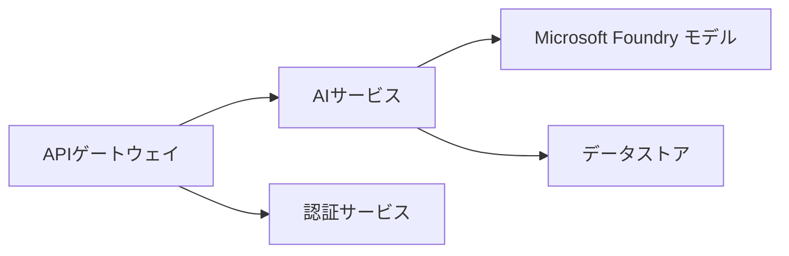
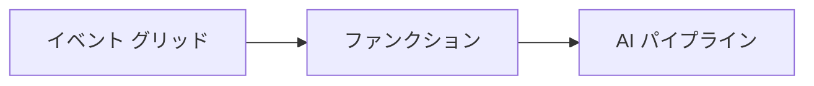

# 第8章：本番およびエンタープライズのパターン

**📚 コース**: [AZD For Beginners](../../README.md) | **⏱️ 所要時間**: 2-3 hours | **⭐ 難易度**: 上級

---

## 概要

この章では、エンタープライズ対応のデプロイパターン、セキュリティ強化、監視、および本番AIワークロードのコスト最適化について説明します。

> 2026年3月に `azd 1.23.12` で検証済み。

## 学習目標

この章を修了すると、以下ができるようになります:
- マルチリージョンで耐障害性のあるアプリケーションをデプロイする
- エンタープライズ向けのセキュリティパターンを実装する
- 包括的な監視を構成する
- 大規模なコスト最適化を行う
- AZDでCI/CDパイプラインを設定する

---

## 📚 レッスン

| # | レッスン | 説明 | 時間 |
|---|--------|-------------|------|
| 1 | [本番AIの実践](production-ai-practices.md) | エンタープライズ向けの展開パターン | 90分 |

---

## 🚀 本番チェックリスト

- [ ] 耐障害性のためのマルチリージョン展開
- [ ] 認証のためのマネージドアイデンティティ（キー不要）
- [ ] 監視のためのApplication Insights
- [ ] コスト予算とアラートを構成
- [ ] セキュリティスキャンを有効化
- [ ] CI/CD パイプラインの統合
- [ ] 災害復旧計画

---

## 🏗️ アーキテクチャパターン

### パターン1：マイクロサービスAI


### パターン2：イベント駆動AI


---

## 🔐 セキュリティのベストプラクティス

```bicep
// Use managed identity
identity: {
  type: 'SystemAssigned'
}

// Private endpoints for AI services
properties: {
  publicNetworkAccess: 'Disabled'
  networkAcls: {
    defaultAction: 'Deny'
  }
}
```

---

## 💰 コスト最適化

| 戦略 | 削減率 |
|----------|---------|
| ゼロスケール（Container Apps） | 60-80% |
| 開発で消費ベースのプランを利用 | 50-70% |
| スケジュールによるスケーリング | 30-50% |
| 予約容量 | 20-40% |

```bash
# 予算アラートを設定する
az consumption budget create \
  --budget-name "AI-Budget" \
  --amount 500 \
  --category Cost \
  --time-grain Monthly
```

---

## 📊 監視の設定

```bash
# ログをストリーミングする
azd monitor --logs

# Application Insights を確認する
azd monitor --overview

# メトリクスを表示する
az monitor metrics list --resource <resource-id>
```

---

## 🔗 ナビゲーション

| 方向 | 章 |
|-----------|---------|
| <strong>前の章</strong> | [第7章：トラブルシューティング](../chapter-07-troubleshooting/README.md) |
| <strong>コース完了</strong> | [コースホーム](../../README.md) |

---

## 📖 関連リソース

- [AIエージェントガイド](../chapter-02-ai-development/agents.md)
- [Application Insights](../chapter-06-pre-deployment/application-insights.md)
- [マルチエージェントソリューション](../chapter-05-multi-agent/README.md)
- [マイクロサービスの例](../../examples/microservices/README.md)

---

<!-- CO-OP TRANSLATOR DISCLAIMER START -->
**免責事項**:
本書類は AI 翻訳サービス [Co-op Translator](https://github.com/Azure/co-op-translator) を使用して翻訳されました。正確性の確保に努めておりますが、自動翻訳には誤りや不正確な箇所が含まれている可能性があることにご注意ください。原文（原語）が正本として扱われるべきです。重要な情報については、専門の人間による翻訳を推奨します。本翻訳の利用に起因する誤解や誤訳について、当方は一切責任を負いません。
<!-- CO-OP TRANSLATOR DISCLAIMER END -->