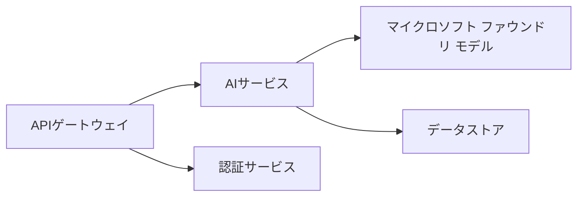
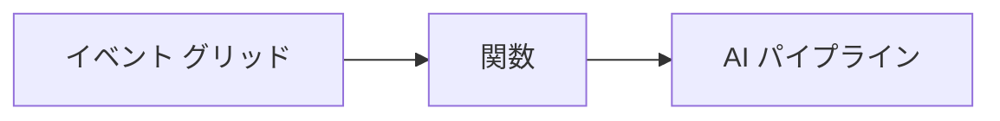

# Chapter 8: 本番およびエンタープライズパターン

**📚 Course**: [AZD 入門](../../README.md) | **⏱️ Duration**: 2-3 hours | **⭐ Complexity**: 上級

---

## Overview

この章では、本番向けAIワークロードのエンタープライズ対応デプロイパターン、セキュリティ強化、監視、およびコスト最適化を扱います。

> Validated against `azd 1.25.6` in June 2026.

## Learning Objectives

この章を修了すると、次のことができるようになります:
- マルチリージョンでの耐障害性のあるアプリケーションをデプロイする
- エンタープライズ向けセキュリティパターンを実装する
- 包括的な監視を構成する
- 大規模でコストを最適化する
- AZD を使用した CI/CD パイプラインを設定する

---

## 📚 レッスン

| # | Lesson | Description | Time |
|---|--------|-------------|------|
| 1 | [本番AIのプラクティス](production-ai-practices.md) | エンタープライズ向けデプロイパターン | 90分 |

---

## 🚀 本番チェックリスト

- [ ] 耐障害性のためのマルチリージョンデプロイ
- [ ] 認証のためのマネージドID（キー不要）
- [ ] 監視のための Application Insights
- [ ] コスト予算とアラートを設定
- [ ] セキュリティスキャンを有効化
- [ ] CI/CD パイプラインの統合
- [ ] 災害復旧計画

---

## 🏗️ アーキテクチャパターン

### Pattern 1: マイクロサービスAI



### Pattern 2: Event-Driven AI



---

## 🔐 セキュリティのベストプラクティス

```bicep
// Use managed identity
identity: {
  type: 'SystemAssigned'
}

// Private endpoints for AI services
properties: {
  publicNetworkAccess: 'Disabled'
  networkAcls: {
    defaultAction: 'Deny'
  }
}
```

---

## 💰 コスト最適化

| Strategy | Savings |
|----------|---------|
| Scale to zero (Container Apps) | 60-80% |
| Use consumption tiers for dev | 50-70% |
| Scheduled scaling | 30-50% |
| Reserved capacity | 20-40% |

```bash
# 予算アラートを設定する
az consumption budget create \
  --budget-name "AI-Budget" \
  --amount 500 \
  --category Cost \
  --time-grain Monthly
```

---

## 📊 モニタリング設定

```bash
# ログのストリーミング
azd monitor --logs

# Application Insights を確認
azd monitor --overview

# メトリクスを表示
az monitor metrics list --resource <resource-id>
```

---

## 🔗 ナビゲーション

| Direction | Chapter |
|-----------|---------|
| **Previous** | [第7章: トラブルシューティング](../chapter-07-troubleshooting/README.md) |
| **Course Complete** | [コースホーム](../../README.md) |

---

## 📖 関連リソース

- [AIエージェントガイド](../chapter-02-ai-development/agents.md)
- [Application Insights](../chapter-06-pre-deployment/application-insights.md)
- [マルチエージェントソリューション](../chapter-05-multi-agent/README.md)
- [マイクロサービスの例](../../examples/microservices/README.md)

---

<!-- CO-OP TRANSLATOR DISCLAIMER START -->
**免責事項**：
本書類は AI 翻訳サービス [Co-op Translator](https://github.com/Azure/co-op-translator) を使用して翻訳されています。正確性を期していますが、自動翻訳には誤りや不正確な部分が含まれる可能性があることをご承知おきください。原文の原語版が正式な情報源とみなされるべきです。重要な情報については、専門の人間による翻訳を推奨します。本翻訳の利用により生じたいかなる誤解や解釈違いについても、当方は責任を負いかねます。
<!-- CO-OP TRANSLATOR DISCLAIMER END -->