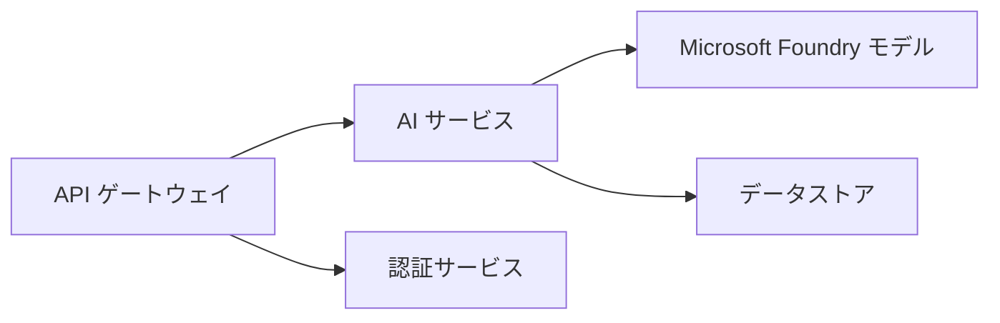
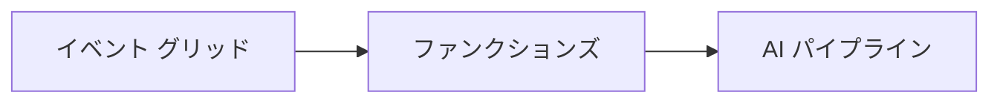

# 第8章: 本番および企業向けパターン

**📚 コース**: [AZD 初心者向け](../../README.md) | **⏱️ 所要時間**: 2-3時間 | **⭐ 難易度**: 上級

---

## 概要

この章では、エンタープライズ対応のデプロイメントパターン、セキュリティ強化、監視、および本番AIワークロードのコスト最適化について説明します。

## 学習目標

本章を修了すると、以下を行えるようになります:
- マルチリージョンでの高可用性アプリケーションのデプロイ
- エンタープライズ向けセキュリティパターンの実装
- 包括的な監視の構成
- 大規模でのコスト最適化
- AZD を用いた CI/CD パイプラインの設定

---

## 📚 レッスン

| # | レッスン | 説明 | 時間 |
|---|--------|-------------|------|
| 1 | [本番AIの実践](production-ai-practices.md) | エンタープライズ向けのデプロイパターン | 90分 |

---

## 🚀 本番チェックリスト

- [ ] マルチリージョンデプロイによるレジリエンス
- [ ] 認証のためのマネージドID（キー不要）
- [ ] Application Insightsによる監視
- [ ] コスト予算とアラートを設定
- [ ] セキュリティスキャンを有効化
- [ ] CI/CD パイプラインの統合
- [ ] 災害復旧計画

---

## 🏗️ アーキテクチャパターン

### パターン 1: マイクロサービスAI


### パターン 2: イベント駆動型AI


---

## 🔐 セキュリティのベストプラクティス

```bicep
// Use managed identity
identity: {
  type: 'SystemAssigned'
}

// Private endpoints for AI services
properties: {
  publicNetworkAccess: 'Disabled'
  networkAcls: {
    defaultAction: 'Deny'
  }
}
```

---

## 💰 コスト最適化

| 戦略 | 節約 |
|----------|---------|
| ゼロスケール（Container Apps） | 60-80% |
| 開発で消費プランを利用 | 50-70% |
| スケジュールスケーリング | 30-50% |
| 予約容量 | 20-40% |

```bash
# 予算アラートを設定する
az consumption budget create \
  --budget-name "AI-Budget" \
  --amount 500 \
  --category Cost \
  --time-grain Monthly
```

---

## 📊 監視の設定

```bash
# ログのストリーミング
azd monitor --logs

# Application Insights を確認する
azd monitor

# メトリックを表示
az monitor metrics list --resource <resource-id>
```

---

## 🔗 ナビゲーション

| 方向 | 章 |
|-----------|---------|
| <strong>前へ</strong> | [第7章: トラブルシューティング](../chapter-07-troubleshooting/README.md) |
| <strong>コース完了</strong> | [コースホーム](../../README.md) |

---

## 📖 関連資料

- [AI エージェントガイド](../chapter-02-ai-development/agents.md)
- [Application Insights](../chapter-06-pre-deployment/application-insights.md)
- [マルチエージェントソリューション](../chapter-05-multi-agent/README.md)
- [マイクロサービスの例](../../examples/microservices/README.md)

---

<!-- CO-OP TRANSLATOR DISCLAIMER START -->
**免責事項**:
この文書は AI 翻訳サービス [Co-op Translator](https://github.com/Azure/co-op-translator) を使用して翻訳されました。正確さには努めておりますが、自動翻訳には誤りや不正確さが含まれる場合があることをご承知おきください。原文（原言語での文書）を権威ある情報源とみなしてください。重要な情報については、専門の人による翻訳を推奨します。この翻訳の使用に起因する誤解や誤訳について、当社は責任を負いません。
<!-- CO-OP TRANSLATOR DISCLAIMER END -->