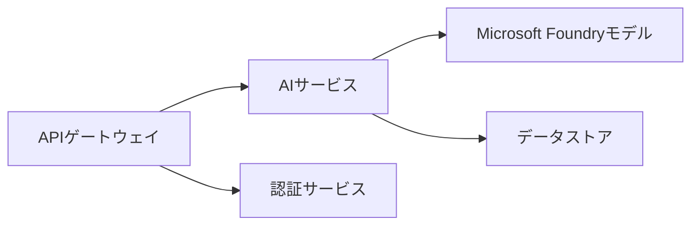

# 第8章: 本番およびエンタープライズパターン

**📚 コース**: [AZD For Beginners](../../README.md) | **⏱️ 所要時間**: 2-3時間 | **⭐ 難易度**: 上級

---

## 概要

この章では、エンタープライズ対応のデプロイメントパターン、セキュリティ強化、監視、および本番AIワークロードのコスト最適化について解説します。

> 2026年7月に `azd 1.27.1` で検証済みです。

## 学習目標

この章を修了すると、以下ができるようになります:
- マルチリージョンの冗長アプリケーションをデプロイする
- エンタープライズセキュリティパターンを実装する
- 包括的な監視を構成する
- 大規模なコスト最適化を行う
- AZDを使ったCI/CDパイプラインを設定する

---

## 📚 レッスン

| # | レッスン | 説明 | 時間 |
|---|--------|-------------|------|
| 1 | [Production AI Practices](production-ai-practices.md) | エンタープライズデプロイメントパターン | 90 分 |

---

## 🚀 本番チェックリスト

- [ ] 冗長性のためのマルチリージョンデプロイ
- [ ] 認証用のマネージドID（キー不要）
- [ ] 監視用のApplication Insights
- [ ] コスト予算とアラートの設定
- [ ] セキュリティスキャンの有効化
- [ ] CI/CDパイプラインの統合
- [ ] 災害復旧計画

---

## 🏗️ アーキテクチャパターン

### パターン1: マイクロサービスAI


```mermaid
graph LR
    Gateway[APIゲートウェイ] --> AI[AIサービス] --> Models[Microsoft Foundryモデル]
    Gateway --> Auth[認証サービス]
    AI --> Data[データストア]
```

### パターン2: イベント駆動型AI


```mermaid
graph LR
    EventGrid[イベント グリッド] --> Functions[ファンクションズ] --> Pipeline[AI パイプライン]
```

---

## 🔐 セキュリティのベストプラクティス

```bicep
// Use managed identity
identity: {
  type: 'SystemAssigned'
}

// Private endpoints for AI services
properties: {
  publicNetworkAccess: 'Disabled'
  networkAcls: {
    defaultAction: 'Deny'
  }
}
```

---

## 💰 コスト最適化

| 戦略 | 削減率 |
|----------|---------|
| ゼロスケール（Container Apps） | 60-80% |
| 開発用の消費プラン利用 | 50-70% |
| スケジュールスケーリング | 30-50% |
| 予約容量 | 20-40% |

```bash
# 予算アラートを設定する
az consumption budget create \
  --budget-name "AI-Budget" \
  --amount 500 \
  --category Cost \
  --time-grain Monthly
```

---

## 📊 監視設定

```bash
# ストリームログ
azd monitor --logs

# アプリケーション インサイトを確認する
azd monitor --overview

# メトリクスを表示する
az monitor metrics list --resource <resource-id>
```

---

## 🔗 ナビゲーション

| 方向 | チャプター |
|-----------|---------|
| <strong>前へ</strong> | [第7章: トラブルシューティング](../chapter-07-troubleshooting/README.md) |
| <strong>コース完了</strong> | [コースホーム](../../README.md) |

---

## 📖 関連リソース

- [AI Agents Guide](../chapter-02-ai-development/agents.md)
- [Application Insights](../chapter-06-pre-deployment/application-insights.md)
- [Multi-Agent Solutions](../chapter-05-multi-agent/README.md)
- [Microservices Example](../../examples/microservices/README.md)

---

<!-- CO-OP TRANSLATOR DISCLAIMER START -->
**免責事項**：
本書類は AI 翻訳サービス [Co-op Translator](https://github.com/Azure/co-op-translator) を使用して翻訳されています。正確性を期していますが、自動翻訳には誤りや不正確な部分が含まれる可能性があることをご承知おきください。原文の原語版が正式な情報源とみなされるべきです。重要な情報については、専門の人間による翻訳を推奨します。本翻訳の利用により生じたいかなる誤解や解釈違いについても、当方は責任を負いかねます。
<!-- CO-OP TRANSLATOR DISCLAIMER END -->