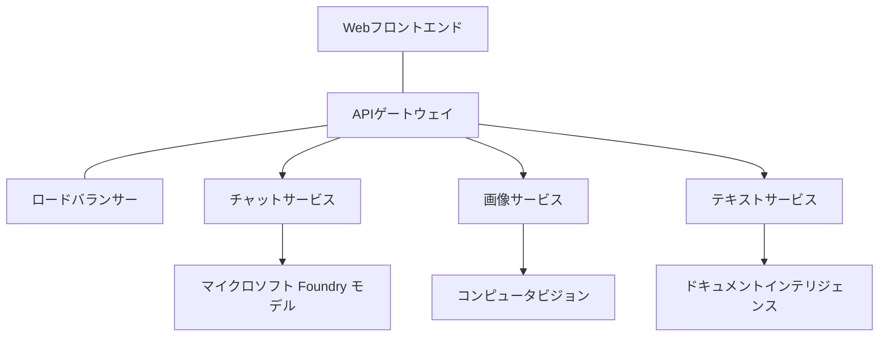

# AZD を用いたプロダクション AI ワークロードのベストプラクティス

**章ナビゲーション:**
- **📚 Course Home**: [AZD 入門](../../README.md)
- **📖 Current Chapter**: 第8章 - プロダクション＆エンタープライズパターン
- **⬅️ Previous Chapter**: [第7章: トラブルシューティング](../chapter-07-troubleshooting/debugging.md)
- **⬅️ Also Related**: [AI ワークショップラボ](ai-workshop-lab.md)
- **🎯 Course Complete**: [AZD 入門](../../README.md)

## 概要

本ガイドは Azure Developer CLI (AZD) を使用したプロダクション対応の AI ワークロードをデプロイするための包括的なベストプラクティスを提供します。Microsoft Foundry Discord コミュニティからのフィードバックおよび実際の顧客の導入に基づき、これらのプラクティスはプロダクション AI システムで最も一般的な課題に対応します。

## 対処する主要な課題

コミュニティの投票結果に基づくと、開発者が直面する主要な課題は次の通りです:

- **45%** マルチサービスの AI デプロイに苦労している
- **38%** 資格情報とシークレット管理に問題がある  
- **35%** 本番対応やスケーリングが難しい
- **32%** コスト最適化戦略が不十分
- **29%** 監視とトラブルシューティングの改善が必要

## プロダクション AI のアーキテクチャパターン

### パターン1: マイクロサービス型 AI アーキテクチャ

<strong>使用時</strong>: 複数の機能を持つ複雑な AI アプリケーション


**AZD Implementation**:

```yaml
# azure.yaml
name: enterprise-ai-platform
services:
  web:
    project: ./web
    host: staticwebapp
  api-gateway:
    project: ./api-gateway
    host: containerapp
  chat-service:
    project: ./services/chat
    host: containerapp
  vision-service:
    project: ./services/vision
    host: containerapp
  text-service:
    project: ./services/text
    host: containerapp
```

### パターン2: イベント駆動型 AI 処理

<strong>使用時</strong>: バッチ処理、ドキュメント分析、非同期ワークフロー

```bicep
// Event Hub for AI processing pipeline
resource eventHub 'Microsoft.EventHub/namespaces@2023-01-01-preview' = {
  name: eventHubNamespaceName
  location: location
  sku: {
    name: 'Standard'
    tier: 'Standard'
    capacity: 1
  }
}

// Service Bus for reliable message processing
resource serviceBus 'Microsoft.ServiceBus/namespaces@2022-10-01-preview' = {
  name: serviceBusNamespaceName
  location: location
  sku: {
    name: 'Premium'
    tier: 'Premium'
    capacity: 1
  }
}

// Function App for processing
resource functionApp 'Microsoft.Web/sites@2023-01-01' = {
  name: functionAppName
  location: location
  kind: 'functionapp,linux'
  properties: {
    siteConfig: {
      appSettings: [
        {
          name: 'FUNCTIONS_EXTENSION_VERSION'
          value: '~4'
        }
        {
          name: 'AZURE_OPENAI_ENDPOINT'
          value: '@Microsoft.KeyVault(VaultName=${keyVault.name};SecretName=openai-endpoint)'
        }
      ]
    }
  }
}
```

## AI エージェントの健全性について考える

従来の Web アプリが壊れるとき、症状は馴染み深いものです: ページが読み込まれない、API がエラーを返す、デプロイが失敗する。AI 搭載アプリケーションは同じ方法で壊れることもありますが、明確なエラーメッセージを出さないより微妙な不具合を起こすこともあります。

このセクションでは、AI ワークロードを監視するためのメンタルモデルを構築するのに役立つ情報を提供します。問題があるときにどこを見ればよいかが分かります。

### エージェントの健全性が従来のアプリの健全性と異なる点

従来のアプリは動作するかしないかのどちらかです。AI エージェントは動作しているように見えても、結果が悪い場合があります。エージェントの健全性は二層で考えてください:

| 層 | 監視項目 | 調査先 |
|-------|--------------|---------------|
| <strong>インフラの健全性</strong> | サービスは起動していますか？リソースはプロビジョニングされていますか？エンドポイントに到達できますか？ | `azd monitor`、Azure ポータルのリソース ヘルス、コンテナ/アプリのログ |
| <strong>振る舞いの健全性</strong> | エージェントは正確に応答していますか？応答は適時ですか？モデルが正しく呼び出されていますか？ | Application Insights のトレース、モデル呼び出しのレイテンシ指標、レスポンス品質ログ |

インフラの健全性は馴染みのあるものです—どの azd アプリでも同じです。振る舞いの健全性は、AI ワークロードが導入する新しい層です。

### AI アプリが期待通りに動作しないときに見るべき場所

AI アプリケーションが期待した結果を出していない場合、概念的なチェックリストは次の通りです:

1. **基本から確認する。** アプリは動作していますか？依存先に到達できますか？どのアプリでも行うように `azd monitor` とリソースのヘルスを確認してください。
2. **モデル接続を確認する。** アプリケーションは AI モデルを正常に呼び出していますか？失敗またはタイムアウトしたモデル呼び出しは AI アプリ問題の最も一般的な原因で、アプリケーションログに現れます。
3. **モデルが受け取ったものを確認する。** AI の応答は入力（プロンプトと取得したコンテキスト）に依存します。出力が間違っている場合、入力が間違っていることが多いです。アプリケーションがモデルに正しいデータを送っているか確認してください。
4. **応答のレイテンシを確認する。** AI モデル呼び出しは通常の API 呼び出しより遅いです。アプリが遅く感じる場合、モデル応答時間が増加していないか確認してください—スロットリング、容量制限、リージョンレベルの混雑を示す可能性があります。
5. **コストに関する信号を監視する。** 予期しないトークン使用量や API 呼び出しの急増は、ループ、誤設定されたプロンプト、過剰なリトライを示すことがあります。

すぐに可観測性ツールの専門家になる必要はありません。重要なのは、AI アプリケーションには監視すべき追加の振る舞いの層があり、azd の組み込み監視（`azd monitor`）が両方の層を調査するための出発点を提供することです。

---

## セキュリティのベストプラクティス

### 1. ゼロトラスト セキュリティモデル

<strong>実装戦略</strong>:
- 認証なしのサービス間通信を許可しない
- すべての API 呼び出しにマネージド ID を使用
- プライベートエンドポイントによるネットワーク分離
- 最小権限のアクセス制御

```bicep
// Managed Identity for each service
resource chatServiceIdentity 'Microsoft.ManagedIdentity/userAssignedIdentities@2023-01-31' = {
  name: 'chat-service-identity'
  location: location
}

// Role assignments with minimal permissions
resource openAIUserRole 'Microsoft.Authorization/roleAssignments@2022-04-01' = {
  scope: openAIAccount
  name: guid(openAIAccount.id, chatServiceIdentity.id, openAIUserRoleDefinitionId)
  properties: {
    roleDefinitionId: subscriptionResourceId('Microsoft.Authorization/roleDefinitions', '5e0bd9bd-7b93-4f28-af87-19fc36ad61bd')
    principalId: chatServiceIdentity.properties.principalId
    principalType: 'ServicePrincipal'
  }
}
```

### 2. セキュアなシークレット管理

**Key Vault 統合パターン**:

```bicep
// Key Vault with proper access policies
resource keyVault 'Microsoft.KeyVault/vaults@2023-02-01' = {
  name: keyVaultName
  location: location
  properties: {
    tenantId: tenant().tenantId
    sku: {
      family: 'A'
      name: 'premium'  // Use premium for production
    }
    enableRbacAuthorization: true  // Use RBAC instead of access policies
    enablePurgeProtection: true    // Prevent accidental deletion
    enableSoftDelete: true
    softDeleteRetentionInDays: 90
  }
}

// Store all AI service credentials
resource openAIKeySecret 'Microsoft.KeyVault/vaults/secrets@2023-02-01' = {
  parent: keyVault
  name: 'openai-api-key'
  properties: {
    value: openAIAccount.listKeys().key1
    attributes: {
      enabled: true
    }
  }
}
```

### 3. ネットワークセキュリティ

<strong>プライベートエンドポイント構成</strong>:

```bicep
// Virtual Network for AI services
resource virtualNetwork 'Microsoft.Network/virtualNetworks@2023-04-01' = {
  name: vnetName
  location: location
  properties: {
    addressSpace: {
      addressPrefixes: ['10.0.0.0/16']
    }
    subnets: [
      {
        name: 'ai-services-subnet'
        properties: {
          addressPrefix: '10.0.1.0/24'
          privateEndpointNetworkPolicies: 'Disabled'
        }
      }
      {
        name: 'app-services-subnet'
        properties: {
          addressPrefix: '10.0.2.0/24'
          delegations: [
            {
              name: 'Microsoft.Web/serverFarms'
              properties: {
                serviceName: 'Microsoft.Web/serverFarms'
              }
            }
          ]
        }
      }
    ]
  }
}

// Private endpoints for all AI services
resource openAIPrivateEndpoint 'Microsoft.Network/privateEndpoints@2023-04-01' = {
  name: '${openAIAccountName}-pe'
  location: location
  properties: {
    subnet: {
      id: virtualNetwork.properties.subnets[0].id
    }
    privateLinkServiceConnections: [
      {
        name: 'openai-connection'
        properties: {
          privateLinkServiceId: openAIAccount.id
          groupIds: ['account']
        }
      }
    ]
  }
}
```

## パフォーマンスとスケーリング

### 1. オートスケーリング戦略

**Container Apps のオートスケーリング**:

```bicep
resource containerApp 'Microsoft.App/containerApps@2023-05-01' = {
  name: containerAppName
  location: location
  properties: {
    configuration: {
      ingress: {
        external: true
        targetPort: 8000
        transport: 'http'
      }
    }
    template: {
      scale: {
        minReplicas: 2  // Always have 2 instances minimum
        maxReplicas: 50 // Scale up to 50 for high load
        rules: [
          {
            name: 'http-scaling'
            http: {
              metadata: {
                concurrentRequests: '20'  // Scale when >20 concurrent requests
              }
            }
          }
          {
            name: 'cpu-scaling'
            custom: {
              type: 'cpu'
              metadata: {
                type: 'Utilization'
                value: '70'  // Scale when CPU >70%
              }
            }
          }
        ]
      }
    }
  }
}
```

### 2. キャッシュ戦略

**AI レスポンス向けの Redis キャッシュ**:

```bicep
// Redis Premium for production workloads
resource redisCache 'Microsoft.Cache/redis@2023-04-01' = {
  name: redisCacheName
  location: location
  properties: {
    sku: {
      name: 'Premium'
      family: 'P'
      capacity: 1
    }
    enableNonSslPort: false
    minimumTlsVersion: '1.2'
    redisConfiguration: {
      'maxmemory-policy': 'allkeys-lru'
    }
    // Enable clustering for high availability
    redisVersion: '6.0'
    shardCount: 2
  }
}

// Cache configuration in application
var cacheConnectionString = '${redisCache.properties.hostName}:6380,password=${redisCache.listKeys().primaryKey},ssl=True,abortConnect=False'
```

### 3. 負荷分散とトラフィック管理

**WAF を備えた Application Gateway**:

```bicep
// Application Gateway with Web Application Firewall
resource applicationGateway 'Microsoft.Network/applicationGateways@2023-04-01' = {
  name: appGatewayName
  location: location
  properties: {
    sku: {
      name: 'WAF_v2'
      tier: 'WAF_v2'
      capacity: 2
    }
    webApplicationFirewallConfiguration: {
      enabled: true
      firewallMode: 'Prevention'
      ruleSetType: 'OWASP'
      ruleSetVersion: '3.2'
    }
    // Backend pools for AI services
    backendAddressPools: [
      {
        name: 'ai-services-pool'
        properties: {
          backendAddresses: [
            {
              fqdn: '${containerApp.properties.configuration.ingress.fqdn}'
            }
          ]
        }
      }
    ]
  }
}
```

## 💰 コスト最適化

### 1. リソースの適正化

<strong>環境別設定</strong>:

```bash
# 開発環境
azd env new development
azd env set AZURE_OPENAI_SKU "S0"
azd env set AZURE_OPENAI_CAPACITY 10
azd env set AZURE_SEARCH_SKU "basic"
azd env set CONTAINER_CPU 0.5
azd env set CONTAINER_MEMORY 1.0

# 本番環境
azd env new production
azd env set AZURE_OPENAI_SKU "S0"
azd env set AZURE_OPENAI_CAPACITY 100
azd env set AZURE_SEARCH_SKU "standard"
azd env set CONTAINER_CPU 2.0
azd env set CONTAINER_MEMORY 4.0
```

### 2. コスト監視と予算

```bicep
// Cost management and budgets
resource budget 'Microsoft.Consumption/budgets@2023-05-01' = {
  name: 'ai-workload-budget'
  properties: {
    timePeriod: {
      startDate: '2024-01-01'
      endDate: '2024-12-31'
    }
    timeGrain: 'Monthly'
    amount: 2000  // $2000 monthly budget
    category: 'Cost'
    notifications: {
      warning: {
        enabled: true
        operator: 'GreaterThan'
        threshold: 80
        contactEmails: [
          'finance@company.com'
          'engineering@company.com'
        ]
        contactRoles: [
          'Owner'
          'Contributor'
        ]
      }
      critical: {
        enabled: true
        operator: 'GreaterThan'
        threshold: 95
        contactEmails: [
          'cto@company.com'
        ]
      }
    }
  }
}
```

### 3. トークン使用量の最適化

**OpenAI コスト管理**:

```typescript
// アプリケーションレベルでのトークン最適化
class TokenOptimizer {
  private readonly maxTokens = 4000;
  private readonly reserveTokens = 500;
  
  optimizePrompt(userInput: string, context: string): string {
    const availableTokens = this.maxTokens - this.reserveTokens;
    const estimatedTokens = this.estimateTokens(userInput + context);
    
    if (estimatedTokens > availableTokens) {
      // コンテキストを切り詰め、ユーザー入力は切り詰めない
      context = this.truncateContext(context, availableTokens - this.estimateTokens(userInput));
    }
    
    return `${context}\n\nUser: ${userInput}`;
  }
  
  private estimateTokens(text: string): number {
    // 概算: 1トークン ≈ 4文字
    return Math.ceil(text.length / 4);
  }
}
```

## 監視と可観測性

### 1. 包括的な Application Insights

```bicep
// Application Insights with advanced features
resource applicationInsights 'Microsoft.Insights/components@2020-02-02' = {
  name: applicationInsightsName
  location: location
  kind: 'web'
  properties: {
    Application_Type: 'web'
    WorkspaceResourceId: logAnalyticsWorkspace.id
    SamplingPercentage: 100  // Full sampling for AI apps
    DisableIpMasking: false  // Enable for security
  }
}

// Custom metrics for AI operations
resource aiMetricAlerts 'Microsoft.Insights/metricAlerts@2018-03-01' = {
  name: 'ai-high-error-rate'
  location: 'global'
  properties: {
    description: 'Alert when AI service error rate is high'
    severity: 2
    enabled: true
    scopes: [
      applicationInsights.id
    ]
    evaluationFrequency: 'PT1M'
    windowSize: 'PT5M'
    criteria: {
      'odata.type': 'Microsoft.Azure.Monitor.SingleResourceMultipleMetricCriteria'
      allOf: [
        {
          name: 'high-error-rate'
          metricName: 'requests/failed'
          operator: 'GreaterThan'
          threshold: 10
          timeAggregation: 'Count'
        }
      ]
    }
  }
}
```

### 2. AI 向けの監視

**AI 指標のカスタムダッシュボード**:

```json
// Dashboard configuration for AI workloads
{
  "dashboard": {
    "name": "AI Application Monitoring",
    "tiles": [
      {
        "name": "OpenAI Request Volume",
        "query": "requests | where name contains 'openai' | summarize count() by bin(timestamp, 5m)"
      },
      {
        "name": "AI Response Latency",
        "query": "requests | where name contains 'openai' | summarize avg(duration) by bin(timestamp, 5m)"
      },
      {
        "name": "Token Usage",
        "query": "customMetrics | where name == 'openai_tokens_used' | summarize sum(value) by bin(timestamp, 1h)"
      },
      {
        "name": "Cost per Hour",
        "query": "customMetrics | where name == 'openai_cost' | summarize sum(value) by bin(timestamp, 1h)"
      }
    ]
  }
}
```

### 3. ヘルスチェックと稼働時間監視

```bicep
// Application Insights availability tests
resource availabilityTest 'Microsoft.Insights/webtests@2022-06-15' = {
  name: 'ai-app-availability-test'
  location: location
  tags: {
    'hidden-link:${applicationInsights.id}': 'Resource'
  }
  properties: {
    SyntheticMonitorId: 'ai-app-availability-test'
    Name: 'AI Application Availability Test'
    Description: 'Tests AI application endpoints'
    Enabled: true
    Frequency: 300  // 5 minutes
    Timeout: 120    // 2 minutes
    Kind: 'ping'
    Locations: [
      {
        Id: 'us-east-2-azr'
      }
      {
        Id: 'us-west-2-azr'
      }
    ]
    Configuration: {
      WebTest: '''
        <WebTest Name="AI Health Check" 
                 Id="8d2de8d2-a2b0-4c2e-9a0d-8f9c9a0b8c8d" 
                 Enabled="True" 
                 CssProjectStructure="" 
                 CssIteration="" 
                 Timeout="120" 
                 WorkItemIds="" 
                 xmlns="http://microsoft.com/schemas/VisualStudio/TeamTest/2010" 
                 Description="" 
                 CredentialUserName="" 
                 CredentialPassword="" 
                 PreAuthenticate="True" 
                 Proxy="default" 
                 StopOnError="False" 
                 RecordedResultFile="" 
                 ResultsLocale="">
          <Items>
            <Request Method="GET" 
                     Guid="a5f10126-e4cd-570d-961c-cea43999a200" 
                     Version="1.1" 
                     Url="${webApp.properties.defaultHostName}/health" 
                     ThinkTime="0" 
                     Timeout="120" 
                     ParseDependentRequests="True" 
                     FollowRedirects="True" 
                     RecordResult="True" 
                     Cache="False" 
                     ResponseTimeGoal="0" 
                     Encoding="utf-8" 
                     ExpectedHttpStatusCode="200" 
                     ExpectedResponseUrl="" 
                     ReportingName="" 
                     IgnoreHttpStatusCode="False" />
          </Items>
        </WebTest>
      '''
    }
  }
}
```

## 災害復旧と高可用性

### 1. マルチリージョン展開

```yaml
# azure.yaml - Multi-region configuration
name: ai-app-multiregion
services:
  api-primary:
    project: ./api
    host: containerapp
    env:
      - AZURE_REGION=eastus
  api-secondary:
    project: ./api
    host: containerapp
    env:
      - AZURE_REGION=westus2
```

```bicep
// Traffic Manager for global load balancing
resource trafficManager 'Microsoft.Network/trafficManagerProfiles@2022-04-01' = {
  name: trafficManagerProfileName
  location: 'global'
  properties: {
    profileStatus: 'Enabled'
    trafficRoutingMethod: 'Priority'
    dnsConfig: {
      relativeName: trafficManagerProfileName
      ttl: 30
    }
    monitorConfig: {
      protocol: 'HTTPS'
      port: 443
      path: '/health'
      intervalInSeconds: 30
      toleratedNumberOfFailures: 3
      timeoutInSeconds: 10
    }
    endpoints: [
      {
        name: 'primary-endpoint'
        type: 'Microsoft.Network/trafficManagerProfiles/azureEndpoints'
        properties: {
          targetResourceId: primaryAppService.id
          endpointStatus: 'Enabled'
          priority: 1
        }
      }
      {
        name: 'secondary-endpoint'
        type: 'Microsoft.Network/trafficManagerProfiles/azureEndpoints'
        properties: {
          targetResourceId: secondaryAppService.id
          endpointStatus: 'Enabled'
          priority: 2
        }
      }
    ]
  }
}
```

### 2. データのバックアップとリカバリ

```bicep
// Backup configuration for critical data
resource backupVault 'Microsoft.DataProtection/backupVaults@2023-05-01' = {
  name: backupVaultName
  location: location
  identity: {
    type: 'SystemAssigned'
  }
  properties: {
    storageSettings: [
      {
        datastoreType: 'VaultStore'
        type: 'LocallyRedundant'
      }
    ]
  }
}

// Backup policy for AI models and data
resource backupPolicy 'Microsoft.DataProtection/backupVaults/backupPolicies@2023-05-01' = {
  parent: backupVault
  name: 'ai-data-backup-policy'
  properties: {
    policyRules: [
      {
        backupParameters: {
          backupType: 'Full'
          objectType: 'AzureBackupParams'
        }
        trigger: {
          schedule: {
            repeatingTimeIntervals: [
              'R/2024-01-01T02:00:00+00:00/P1D'  // Daily at 2 AM
            ]
          }
          objectType: 'ScheduleBasedTriggerContext'
        }
        dataStore: {
          datastoreType: 'VaultStore'
          objectType: 'DataStoreInfoBase'
        }
        name: 'BackupDaily'
        objectType: 'AzureBackupRule'
      }
    ]
  }
}
```

## DevOps と CI/CD 統合

### 1. GitHub Actions ワークフロー

```yaml
# .github/workflows/deploy-ai-app.yml
name: Deploy AI Application

on:
  push:
    branches: [main]
  pull_request:
    branches: [main]

jobs:
  test:
    runs-on: ubuntu-latest
    steps:
      - uses: actions/checkout@v4
      
      - name: Setup Python
        uses: actions/setup-python@v4
        with:
          python-version: '3.11'
          
      - name: Install dependencies
        run: |
          pip install -r requirements.txt
          pip install pytest
          
      - name: Run tests
        run: pytest tests/
        
      - name: AI Safety Tests
        run: |
          python scripts/test_ai_safety.py
          python scripts/validate_prompts.py

  deploy-staging:
    needs: test
    if: github.event_name == 'pull_request'
    runs-on: ubuntu-latest
    steps:
      - uses: actions/checkout@v4
      
      - name: Setup AZD
        uses: Azure/setup-azd@v2
        
      - name: Login to Azure
        uses: azure/login@v1
        with:
          creds: ${{ secrets.AZURE_CREDENTIALS }}
          
      - name: Deploy to Staging
        run: |
          azd env select staging
          azd deploy

  deploy-production:
    needs: test
    if: github.ref == 'refs/heads/main'
    runs-on: ubuntu-latest
    steps:
      - uses: actions/checkout@v4
      
      - name: Setup AZD
        uses: Azure/setup-azd@v2
        
      - name: Login to Azure
        uses: azure/login@v1
        with:
          creds: ${{ secrets.AZURE_CREDENTIALS }}
          
      - name: Deploy to Production
        run: |
          azd env select production
          azd deploy
          
      - name: Run Production Health Checks
        run: |
          python scripts/health_check.py --env production
```

### 2. インフラ検証

```bash
# scripts/validate_infrastructure.sh
#!/bin/bash

echo "Validating AI infrastructure deployment..."

# すべての必須サービスが稼働しているか確認する
services=("openai" "search" "storage" "keyvault")
for service in "${services[@]}"; do
    echo "Checking $service..."
    if ! az resource list --resource-type "Microsoft.CognitiveServices/accounts" --query "[?contains(name, '$service')]" -o tsv; then
        echo "ERROR: $service not found"
        exit 1
    fi
done

# OpenAIモデルのデプロイを検証する
echo "Validating OpenAI model deployments..."
models=$(az cognitiveservices account deployment list --name $AZURE_OPENAI_NAME --resource-group $AZURE_RESOURCE_GROUP --query "[].name" -o tsv)
if [[ ! $models == *"gpt-4.1-mini"* ]]; then
  echo "ERROR: Required model gpt-4.1-mini not deployed"
    exit 1
fi

# AIサービスの接続性をテストする
echo "Testing AI service connectivity..."
python scripts/test_connectivity.py

echo "Infrastructure validation completed successfully!"
```

## 本番準備チェックリスト

### セキュリティ ✅
- [ ] すべてのサービスがマネージド ID を使用している
- [ ] シークレットは Key Vault に格納されている
- [ ] プライベートエンドポイントが構成されている
- [ ] ネットワークセキュリティグループが実装されている
- [ ] 最小権限の RBAC が設定されている
- [ ] パブリックエンドポイントに WAF が有効化されている

### パフォーマンス ✅
- [ ] オートスケーリングが構成されている
- [ ] キャッシュが実装されている
- [ ] 負荷分散が設定されている
- [ ] 静的コンテンツ用の CDN がある
- [ ] データベース接続プーリングがある
- [ ] トークン使用量の最適化がなされている

### 監視 ✅
- [ ] Application Insights が構成されている
- [ ] カスタムメトリクスが定義されている
- [ ] アラートルールが設定されている
- [ ] ダッシュボードが作成されている
- [ ] ヘルスチェックが実装されている
- [ ] ログ保持ポリシーがある

### 信頼性 ✅
- [ ] マルチリージョン展開が行われている
- [ ] バックアップとリカバリ計画がある
- [ ] サーキットブレーカーが実装されている
- [ ] リトライポリシーが構成されている
- [ ] グレースフルデグラデーションがある
- [ ] ヘルスチェック用エンドポイントがある

### コスト管理 ✅
- [ ] 予算アラートが設定されている
- [ ] リソースの適正化が行われている
- [ ] 開発/テスト割引が適用されている
- [ ] リザーブドインスタンスが購入されている
- [ ] コスト監視ダッシュボードがある
- [ ] 定期的なコストレビューが行われている

### コンプライアンス ✅
- [ ] データ居住要件が満たされている
- [ ] 監査ログが有効になっている
- [ ] コンプライアンスポリシーが適用されている
- [ ] セキュリティベースラインが実装されている
- [ ] 定期的なセキュリティ評価が行われている
- [ ] インシデント対応計画がある

## パフォーマンスベンチマーク

### 典型的なプロダクション指標

| 指標 | 目標 | 監視方法 |
|--------|--------|------------|
| <strong>応答時間</strong> | < 2 秒 | Application Insights |
| <strong>可用性</strong> | 99.9% | 稼働時間監視 |
| <strong>エラー率</strong> | < 0.1% | アプリケーションログ |
| <strong>トークン使用量</strong> | < $500/月 | コスト管理 |
| <strong>同時ユーザー数</strong> | 1000+ | 負荷テスト |
| <strong>復旧時間</strong> | < 1 時間 | 災害復旧テスト |

### 負荷テスト

```bash
# AIアプリケーションの負荷テスト用スクリプト
python scripts/load_test.py \
  --endpoint https://your-ai-app.azurewebsites.net \
  --concurrent-users 100 \
  --duration 300 \
  --ramp-up 60
```

## 🤝 コミュニティのベストプラクティス

Microsoft Foundry Discord コミュニティのフィードバックに基づく:

### コミュニティからの主な推奨事項:

1. <strong>小さく始めて段階的に拡張する</strong>: 基本的な SKU から始め、実際の使用状況に基づいてスケールアップする
2. <strong>すべてを監視する</strong>: 初日から包括的な監視を設定する
3. <strong>セキュリティを自動化する</strong>: 一貫したセキュリティのためにインフラをコード化する
4. <strong>徹底的にテストする</strong>: パイプラインに AI 特有のテストを含める
5. <strong>コストを見越して計画する</strong>: トークン使用量を監視し、早期に予算アラートを設定する

### 避けるべき一般的な落とし穴:

- ❌ コード内に API キーをハードコーディングする
- ❌ 適切な監視を設定していない
- ❌ コスト最適化を無視する
- ❌ 障害シナリオをテストしていない
- ❌ ヘルスチェックなしでデプロイする

## AZD AI CLI コマンドと拡張機能

AZD にはプロダクション AI ワークフローを効率化する AI 専用のコマンドと拡張機能のセットが拡張されています。これらのツールはローカル開発とプロダクションデプロイのギャップを埋めます。

### AI 向けの AZD 拡張機能

AZD は拡張システムを使用して AI 特有の機能を追加します。次のコマンドで拡張機能をインストールおよび管理します:

```bash
# 利用可能な拡張機能をすべて一覧表示（AIを含む）
azd extension list

# インストール済み拡張機能の詳細を確認
azd extension show azure.ai.agents

# Foundry agents 拡張機能をインストール
azd extension install azure.ai.agents

# ファインチューニング拡張機能をインストール
azd extension install azure.ai.finetune

# カスタムモデル拡張機能をインストール
azd extension install azure.ai.models

# インストール済みのすべての拡張機能をアップグレード
azd extension upgrade --all
```

**利用可能な AI 拡張機能:**

| 拡張 | 目的 | ステータス |
|-----------|---------|--------|
| `azure.ai.agents` | Foundry Agent Service の管理 | プレビュー |
| `azure.ai.finetune` | Foundry モデルのファインチューニング | プレビュー |
| `azure.ai.models` | Foundry カスタムモデル | プレビュー |
| `azure.coding-agent` | コーディングエージェントの設定 | 利用可能 |

### `azd ai agent init` でエージェントプロジェクトを初期化する

`azd ai agent init` コマンドは Microsoft Foundry Agent Service と統合されたプロダクション対応の AI エージェントプロジェクトをスキャフォールドします:

```bash
# エージェントマニフェストから新しいエージェントプロジェクトを初期化する
azd ai agent init -m <manifest-path-or-uri>

# 特定のFoundryプロジェクトを初期化してターゲットにする
azd ai agent init -m agent-manifest.yaml --project-id <foundry-project-id>

# カスタムのソースディレクトリで初期化する
azd ai agent init -m agent-manifest.yaml --src ./agents/my-agent

# Container Apps をホストとしてターゲットにする
azd ai agent init -m agent-manifest.yaml --host containerapp
```

**主なフラグ:**

| フラグ | 説明 |
|------|-------------|
| `-m, --manifest` | プロジェクトに追加するエージェントマニフェストへのパスまたは URI |
| `-p, --project-id` | azd 環境に対する既存の Microsoft Foundry プロジェクト ID |
| `-s, --src` | エージェント定義をダウンロードするディレクトリ（デフォルトは `src/<agent-id>`） |
| `--host` | デフォルトのホストを上書き（例: `containerapp`） |
| `-e, --environment` | 使用する azd 環境 |

<strong>本番向けのヒント</strong>: `--project-id` を使用して既存の Foundry プロジェクトに直接接続し、エージェントコードとクラウドリソースを最初からリンクさせてください。

### Model Context Protocol (MCP) と `azd mcp`

AZD は MCP サーバーサポート（Alpha）を内蔵しており、AI エージェントおよびツールが標準化されたプロトコルを通じて Azure リソースとやり取りできるようにします:

```bash
# プロジェクト用のMCPサーバーを起動する
azd mcp start

# ツール実行に関する現在のCopilot同意ルールを確認する
azd copilot consent list
```

MCP サーバーは azd プロジェクトのコンテキスト—環境、サービス、および Azure リソース—を AI 搭載の開発ツールに公開します。これにより次が可能になります:

- **AI 支援のデプロイ**: コーディングエージェントがプロジェクトの状態を照会し、デプロイをトリガーできるようにする
- <strong>リソースの検出</strong>: AI ツールがプロジェクトで使用されている Azure リソースを発見できる
- <strong>環境管理</strong>: エージェントが開発/ステージング/本番環境を切り替えられる

### `azd infra generate` によるインフラ生成

プロダクション AI ワークロードでは、自動プロビジョニングに依存する代わりに Infrastructure as Code を生成してカスタマイズできます:

```bash
# プロジェクト定義からBicep/Terraformファイルを生成する
azd infra generate
```

これにより IaC をディスクに書き出すので、次のことができます:
- デプロイ前にインフラをレビューおよび監査する
- カスタムのセキュリティポリシー（ネットワークルール、プライベートエンドポイント）を追加する
- 既存の IaC レビュー プロセスに統合する
- アプリケーションコードとは別にインフラの変更をバージョン管理する

### プロダクションライフサイクルフック

AZD のフックを使うと、デプロイメントライフサイクルのあらゆる段階にカスタムロジックを挿入できます—これはプロダクション AI ワークフローにとって重要です:

```yaml
# azure.yaml - Production hooks example
name: ai-production-app
hooks:
  preprovision:
    shell: sh
    run: scripts/validate-quotas.sh    # Check AI model quota before provisioning
  postprovision:
    shell: sh
    run: scripts/configure-networking.sh  # Set up private endpoints
  predeploy:
    shell: sh
    run: scripts/run-ai-safety-tests.sh  # Run prompt safety checks
  postdeploy:
    shell: sh
    run: scripts/smoke-test.sh           # Verify agent responses post-deploy
services:
  agent-api:
    project: ./src/agent
    host: containerapp
    hooks:
      predeploy:
        shell: sh
        run: scripts/validate-model-access.sh  # Per-service hook
```

```bash
# 開発中に特定のフックを手動で実行する
azd hooks run predeploy
```

**AI ワークロード向けの推奨プロダクションフック:**

| フック | 利用ケース |
|------|----------|
| `preprovision` | AI モデル容量に対するサブスクリプションのクォータを検証する |
| `postprovision` | プライベートエンドポイントを構成し、モデルウェイトをデプロイする |
| `predeploy` | AI セーフティテストを実行し、プロンプトテンプレートを検証する |
| `postdeploy` | エージェントの応答をスモークテストし、モデル接続性を検証する |

### CI/CD パイプライン構成

`azd pipeline config` を使用して、セキュアな Azure 認証でプロジェクトを GitHub Actions や Azure Pipelines に接続します:

```bash
# CI/CD パイプラインを設定する（対話式）
azd pipeline config

# 特定のプロバイダーで設定する
azd pipeline config --provider github
```

このコマンドは:
- 最小権限アクセスのサービスプリンシパルを作成する
- フェデレーテッド認証情報を構成する（保存されたシークレットなし）
- パイプライン定義ファイルを生成または更新する
- CI/CD システムに必要な環境変数を設定する

**パイプライン構成による本番ワークフロー:**

```bash
# 1. 本番環境をセットアップする
azd env new production
azd env set AZURE_OPENAI_CAPACITY 100

# 2. パイプラインを構成する
azd pipeline config --provider github

# 3. パイプラインは main へのすべてのプッシュで azd deploy を実行する
```

### `azd add` でコンポーネントを追加

既存プロジェクトに Azure サービスを段階的に追加します:

```bash
# 対話形式で新しいサービスコンポーネントを追加する
azd add
```

これはプロダクション AI アプリケーションを拡張する際に特に有用です—例えば、ベクタ検索サービスの追加、新しいエージェントエンドポイントの追加、既存デプロイへの監視コンポーネントの追加など。

## 追加リソース
- **Azure Well-Architected Framework**: [AI ワークロード ガイダンス](https://learn.microsoft.com/azure/well-architected/ai/)
- **Microsoft Foundry Documentation**: [公式ドキュメント](https://learn.microsoft.com/azure/ai-studio/)
- **Community Templates**: [Azure サンプル](https://github.com/Azure-Samples)
- **Discord Community**: [#Azure チャンネル](https://discord.gg/microsoft-azure)
- **Agent Skills for Azure**: [microsoft/github-copilot-for-azure on skills.sh](https://skills.sh/microsoft/github-copilot-for-azure) - Azure AI、Foundry、デプロイ、コスト最適化、診断向けの 37 件の公開エージェント スキル。エディタにインストールしてください：
  ```bash
  npx skills add microsoft/github-copilot-for-azure
  ```

---

**章のナビゲーション:**
- **📚 Course Home**: [AZD 入門](../../README.md)
- **📖 Current Chapter**: 第8章 - 本番稼働 & エンタープライズのパターン
- **⬅️ Previous Chapter**: [第7章: トラブルシューティング](../chapter-07-troubleshooting/debugging.md)
- **⬅️ Also Related**: [AI ワークショップ ラボ](ai-workshop-lab.md)
- **� Course Complete**: [AZD 入門](../../README.md)

<strong>覚えておいてください</strong>: 本番の AI ワークロードには綿密な計画、監視、および継続的な最適化が必要です。これらのパターンから始めて、特定の要件に合わせて調整してください。

---

<!-- CO-OP TRANSLATOR DISCLAIMER START -->
**免責事項**:
本ドキュメントは AI 翻訳サービス [Co-op 翻訳](https://github.com/Azure/co-op-translator) を使用して翻訳されています。正確性を期していますが、自動翻訳には誤りや不正確な箇所が含まれる可能性があることにご注意ください。原文（元の言語での文書）を権威ある情報源として扱ってください。重要な情報については、専門の人間による翻訳を推奨します。本翻訳の使用に起因するいかなる誤解や誤訳についても、当社は責任を負いません。
<!-- CO-OP TRANSLATOR DISCLAIMER END -->