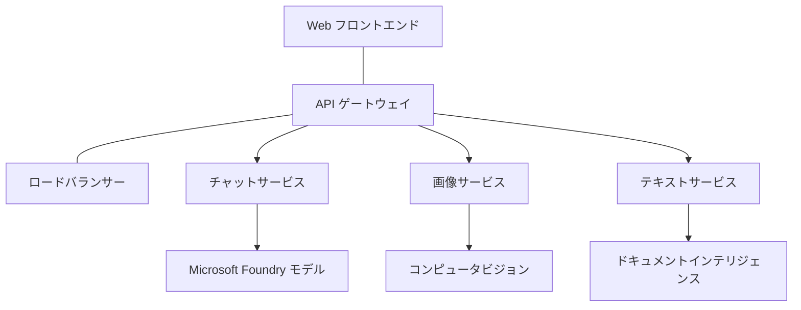

# AZD を使った本番向け AI ワークロードのベストプラクティス

**Chapter Navigation:**
- **📚 Course Home**: [AZD 入門](../../README.md)
- **📖 Current Chapter**: Chapter 8 - Production & Enterprise Patterns
- **⬅️ Previous Chapter**: [第7章: トラブルシューティング](../chapter-07-troubleshooting/debugging.md)
- **⬅️ Also Related**: [AI ワークショップ ラボ](ai-workshop-lab.md)
- **🎯 Course Complete**: [AZD 入門](../../README.md)

## 概要

このガイドは、Azure Developer CLI (AZD) を使って本番対応の AI ワークロードをデプロイするための包括的なベストプラクティスを提供します。Microsoft Foundry Discord コミュニティからのフィードバックと実際の顧客導入に基づき、本番 AI システムで最も一般的な課題に対処しています。

## 対処する主要な課題

コミュニティ投票の結果に基づき、開発者が直面する主な課題は次のとおりです:

- **45%** がマルチサービスの AI デプロイに苦慮している
- **38%** が認証情報とシークレット管理に問題を抱えている  
- **35%** が本番対応とスケーリングを難しいと感じている
- **32%** がコスト最適化戦略を求めている
- **29%** が監視とトラブルシューティングの改善を必要としている

## 本番向け AI のアーキテクチャパターン

### パターン 1: マイクロサービス型 AI アーキテクチャ

<strong>使用タイミング</strong>: 複数の機能を持つ複雑な AI アプリケーション



**AZD 実装**:

```yaml
# azure.yaml
name: enterprise-ai-platform
services:
  web:
    project: ./web
    host: staticwebapp
  api-gateway:
    project: ./api-gateway
    host: containerapp
  chat-service:
    project: ./services/chat
    host: containerapp
  vision-service:
    project: ./services/vision
    host: containerapp
  text-service:
    project: ./services/text
    host: containerapp
```

### パターン 2: イベント駆動型 AI 処理

<strong>使用タイミング</strong>: バッチ処理、ドキュメント解析、非同期ワークフロー

```bicep
// Event Hub for AI processing pipeline
resource eventHub 'Microsoft.EventHub/namespaces@2023-01-01-preview' = {
  name: eventHubNamespaceName
  location: location
  sku: {
    name: 'Standard'
    tier: 'Standard'
    capacity: 1
  }
}

// Service Bus for reliable message processing
resource serviceBus 'Microsoft.ServiceBus/namespaces@2022-10-01-preview' = {
  name: serviceBusNamespaceName
  location: location
  sku: {
    name: 'Premium'
    tier: 'Premium'
    capacity: 1
  }
}

// Function App for processing
resource functionApp 'Microsoft.Web/sites@2023-01-01' = {
  name: functionAppName
  location: location
  kind: 'functionapp,linux'
  properties: {
    siteConfig: {
      appSettings: [
        {
          name: 'FUNCTIONS_EXTENSION_VERSION'
          value: '~4'
        }
        {
          name: 'AZURE_OPENAI_ENDPOINT'
          value: '@Microsoft.KeyVault(VaultName=${keyVault.name};SecretName=openai-endpoint)'
        }
      ]
    }
  }
}
```

## AI エージェントのヘルスについて考える

従来のウェブアプリが壊れたとき、症状は馴染みのあるものです: ページが読み込まれない、API がエラーを返す、デプロイが失敗する。AI 搭載アプリケーションも同じ方法で壊れますが、明確なエラーメッセージを出さない微妙な不具合を起こすこともあります。

このセクションは、AI ワークロードを監視するためのメンタルモデルを構築する手助けをします。問題があるときにどこを見ればよいかがわかるようにします。

### エージェントのヘルスが従来のアプリと異なる点

従来のアプリは動作するかしないかの二択が多いです。AI エージェントは動作しているように見えても結果が悪いことがあります。エージェントのヘルスは二層で考えましょう:

| Layer | What to Watch | Where to Look |
|-------|--------------|---------------|
| <strong>インフラの健全性</strong> | サービスは稼働していますか？リソースはプロビジョニングされていますか？エンドポイントに到達できますか？ | `azd monitor`, Azure Portal のリソースヘルス, コンテナー/アプリのログ |
| <strong>振る舞いの健全性</strong> | エージェントは正確に応答していますか？応答はタイムリーですか？モデルは正しく呼び出されていますか？ | Application Insights のトレース、モデル呼び出しのレイテンシ指標、応答品質ログ |

インフラの健全性は馴染みのあるものです—どの azd アプリでも同じです。振る舞いの健全性は AI ワークロードが導入する新しい層です。

### AI アプリが期待通りに動作しないときに見るべき場所

AI アプリケーションが期待した結果を出さない場合、概念的なチェックリストは次のとおりです:

1. **基本から始める。** アプリは稼働していますか？依存関係に到達できますか？他のアプリと同様に `azd monitor` とリソースヘルスを確認してください。
2. **モデル接続を確認する。** アプリケーションはモデルを正常に呼び出していますか？失敗やタイムアウトしたモデル呼び出しは AI アプリの問題の最も一般的な原因で、アプリケーションログに表示されます。
3. **モデルに渡された内容を確認する。** AI の応答は入力（プロンプトと取得されたコンテキスト）に依存します。出力が間違っている場合、入力が間違っていることが多いです。アプリがモデルに正しいデータを送信しているか確認してください。
4. **応答レイテンシを確認する。** AI モデル呼び出しは典型的な API 呼び出しより遅いです。アプリが遅く感じる場合、モデル応答時間が増加していないか確認してください—これがスロットリング、容量制限、またはリージョンレベルの混雑を示すことがあります。
5. **コストのシグナルに注意する。** トークン使用量や API 呼び出しの予期せぬスパイクは、ループ、誤構成されたプロンプト、過剰なリトライを示す可能性があります。

すぐにすべての可観測性ツールをマスターする必要はありません。重要なポイントは、AI アプリケーションには監視すべき追加の振る舞い層があり、azd の組み込み監視 (`azd monitor`) が両方の層を調査するための出発点を提供することです。

---

## セキュリティのベストプラクティス

### 1. ゼロトラスト セキュリティモデル

<strong>実装戦略</strong>:
- 認証なしのサービス間通信を許可しない
- すべての API 呼び出しにマネージド ID を使用する
- プライベートエンドポイントによるネットワーク分離
- 最小権限アクセス制御

```bicep
// Managed Identity for each service
resource chatServiceIdentity 'Microsoft.ManagedIdentity/userAssignedIdentities@2023-01-31' = {
  name: 'chat-service-identity'
  location: location
}

// Role assignments with minimal permissions
resource openAIUserRole 'Microsoft.Authorization/roleAssignments@2022-04-01' = {
  scope: openAIAccount
  name: guid(openAIAccount.id, chatServiceIdentity.id, openAIUserRoleDefinitionId)
  properties: {
    roleDefinitionId: subscriptionResourceId('Microsoft.Authorization/roleDefinitions', '5e0bd9bd-7b93-4f28-af87-19fc36ad61bd')
    principalId: chatServiceIdentity.properties.principalId
    principalType: 'ServicePrincipal'
  }
}
```

### 2. セキュアなシークレット管理

**Key Vault 統合パターン**:

```bicep
// Key Vault with proper access policies
resource keyVault 'Microsoft.KeyVault/vaults@2023-02-01' = {
  name: keyVaultName
  location: location
  properties: {
    tenantId: tenant().tenantId
    sku: {
      family: 'A'
      name: 'premium'  // Use premium for production
    }
    enableRbacAuthorization: true  // Use RBAC instead of access policies
    enablePurgeProtection: true    // Prevent accidental deletion
    enableSoftDelete: true
    softDeleteRetentionInDays: 90
  }
}

// Store all AI service credentials
resource openAIKeySecret 'Microsoft.KeyVault/vaults/secrets@2023-02-01' = {
  parent: keyVault
  name: 'openai-api-key'
  properties: {
    value: openAIAccount.listKeys().key1
    attributes: {
      enabled: true
    }
  }
}
```

### 3. ネットワークセキュリティ

<strong>プライベートエンドポイントの構成</strong>:

```bicep
// Virtual Network for AI services
resource virtualNetwork 'Microsoft.Network/virtualNetworks@2023-04-01' = {
  name: vnetName
  location: location
  properties: {
    addressSpace: {
      addressPrefixes: ['10.0.0.0/16']
    }
    subnets: [
      {
        name: 'ai-services-subnet'
        properties: {
          addressPrefix: '10.0.1.0/24'
          privateEndpointNetworkPolicies: 'Disabled'
        }
      }
      {
        name: 'app-services-subnet'
        properties: {
          addressPrefix: '10.0.2.0/24'
          delegations: [
            {
              name: 'Microsoft.Web/serverFarms'
              properties: {
                serviceName: 'Microsoft.Web/serverFarms'
              }
            }
          ]
        }
      }
    ]
  }
}

// Private endpoints for all AI services
resource openAIPrivateEndpoint 'Microsoft.Network/privateEndpoints@2023-04-01' = {
  name: '${openAIAccountName}-pe'
  location: location
  properties: {
    subnet: {
      id: virtualNetwork.properties.subnets[0].id
    }
    privateLinkServiceConnections: [
      {
        name: 'openai-connection'
        properties: {
          privateLinkServiceId: openAIAccount.id
          groupIds: ['account']
        }
      }
    ]
  }
}
```

## パフォーマンスとスケーリング

### 1. オートスケーリング戦略

**Container Apps のオートスケーリング**:

```bicep
resource containerApp 'Microsoft.App/containerApps@2023-05-01' = {
  name: containerAppName
  location: location
  properties: {
    configuration: {
      ingress: {
        external: true
        targetPort: 8000
        transport: 'http'
      }
    }
    template: {
      scale: {
        minReplicas: 2  // Always have 2 instances minimum
        maxReplicas: 50 // Scale up to 50 for high load
        rules: [
          {
            name: 'http-scaling'
            http: {
              metadata: {
                concurrentRequests: '20'  // Scale when >20 concurrent requests
              }
            }
          }
          {
            name: 'cpu-scaling'
            custom: {
              type: 'cpu'
              metadata: {
                type: 'Utilization'
                value: '70'  // Scale when CPU >70%
              }
            }
          }
        ]
      }
    }
  }
}
```

### 2. キャッシュ戦略

**AI 応答のための Redis キャッシュ**:

```bicep
// Redis Premium for production workloads
resource redisCache 'Microsoft.Cache/redis@2023-04-01' = {
  name: redisCacheName
  location: location
  properties: {
    sku: {
      name: 'Premium'
      family: 'P'
      capacity: 1
    }
    enableNonSslPort: false
    minimumTlsVersion: '1.2'
    redisConfiguration: {
      'maxmemory-policy': 'allkeys-lru'
    }
    // Enable clustering for high availability
    redisVersion: '6.0'
    shardCount: 2
  }
}

// Cache configuration in application
var cacheConnectionString = '${redisCache.properties.hostName}:6380,password=${redisCache.listKeys().primaryKey},ssl=True,abortConnect=False'
```

### 3. 負荷分散とトラフィック管理

**WAF を備えた Application Gateway**:

```bicep
// Application Gateway with Web Application Firewall
resource applicationGateway 'Microsoft.Network/applicationGateways@2023-04-01' = {
  name: appGatewayName
  location: location
  properties: {
    sku: {
      name: 'WAF_v2'
      tier: 'WAF_v2'
      capacity: 2
    }
    webApplicationFirewallConfiguration: {
      enabled: true
      firewallMode: 'Prevention'
      ruleSetType: 'OWASP'
      ruleSetVersion: '3.2'
    }
    // Backend pools for AI services
    backendAddressPools: [
      {
        name: 'ai-services-pool'
        properties: {
          backendAddresses: [
            {
              fqdn: '${containerApp.properties.configuration.ingress.fqdn}'
            }
          ]
        }
      }
    ]
  }
}
```

## 💰 コスト最適化

### 1. リソースの適正化（Right-Sizing）

<strong>環境固有の構成</strong>:

```bash
# 開発環境
azd env new development
azd env set AZURE_OPENAI_SKU "S0"
azd env set AZURE_OPENAI_CAPACITY 10
azd env set AZURE_SEARCH_SKU "basic"
azd env set CONTAINER_CPU 0.5
azd env set CONTAINER_MEMORY 1.0

# 本番環境
azd env new production
azd env set AZURE_OPENAI_SKU "S0"
azd env set AZURE_OPENAI_CAPACITY 100
azd env set AZURE_SEARCH_SKU "standard"
azd env set CONTAINER_CPU 2.0
azd env set CONTAINER_MEMORY 4.0
```

### 2. コスト監視と予算

```bicep
// Cost management and budgets
resource budget 'Microsoft.Consumption/budgets@2023-05-01' = {
  name: 'ai-workload-budget'
  properties: {
    timePeriod: {
      startDate: '2024-01-01'
      endDate: '2024-12-31'
    }
    timeGrain: 'Monthly'
    amount: 2000  // $2000 monthly budget
    category: 'Cost'
    notifications: {
      warning: {
        enabled: true
        operator: 'GreaterThan'
        threshold: 80
        contactEmails: [
          'finance@company.com'
          'engineering@company.com'
        ]
        contactRoles: [
          'Owner'
          'Contributor'
        ]
      }
      critical: {
        enabled: true
        operator: 'GreaterThan'
        threshold: 95
        contactEmails: [
          'cto@company.com'
        ]
      }
    }
  }
}
```

### 3. トークン使用の最適化

**OpenAI コスト管理**:

```typescript
// アプリケーションレベルでのトークン最適化
class TokenOptimizer {
  private readonly maxTokens = 4000;
  private readonly reserveTokens = 500;
  
  optimizePrompt(userInput: string, context: string): string {
    const availableTokens = this.maxTokens - this.reserveTokens;
    const estimatedTokens = this.estimateTokens(userInput + context);
    
    if (estimatedTokens > availableTokens) {
      // ユーザー入力ではなくコンテキストを切り詰める
      context = this.truncateContext(context, availableTokens - this.estimateTokens(userInput));
    }
    
    return `${context}\n\nUser: ${userInput}`;
  }
  
  private estimateTokens(text: string): number {
    // 概算：1トークン ≈ 4文字
    return Math.ceil(text.length / 4);
  }
}
```

## 監視と可観測性

### 1. 包括的な Application Insights

```bicep
// Application Insights with advanced features
resource applicationInsights 'Microsoft.Insights/components@2020-02-02' = {
  name: applicationInsightsName
  location: location
  kind: 'web'
  properties: {
    Application_Type: 'web'
    WorkspaceResourceId: logAnalyticsWorkspace.id
    SamplingPercentage: 100  // Full sampling for AI apps
    DisableIpMasking: false  // Enable for security
  }
}

// Custom metrics for AI operations
resource aiMetricAlerts 'Microsoft.Insights/metricAlerts@2018-03-01' = {
  name: 'ai-high-error-rate'
  location: 'global'
  properties: {
    description: 'Alert when AI service error rate is high'
    severity: 2
    enabled: true
    scopes: [
      applicationInsights.id
    ]
    evaluationFrequency: 'PT1M'
    windowSize: 'PT5M'
    criteria: {
      'odata.type': 'Microsoft.Azure.Monitor.SingleResourceMultipleMetricCriteria'
      allOf: [
        {
          name: 'high-error-rate'
          metricName: 'requests/failed'
          operator: 'GreaterThan'
          threshold: 10
          timeAggregation: 'Count'
        }
      ]
    }
  }
}
```

### 2. AI 専用の監視

**AI メトリクス用カスタムダッシュボード**:

```json
// Dashboard configuration for AI workloads
{
  "dashboard": {
    "name": "AI Application Monitoring",
    "tiles": [
      {
        "name": "OpenAI Request Volume",
        "query": "requests | where name contains 'openai' | summarize count() by bin(timestamp, 5m)"
      },
      {
        "name": "AI Response Latency",
        "query": "requests | where name contains 'openai' | summarize avg(duration) by bin(timestamp, 5m)"
      },
      {
        "name": "Token Usage",
        "query": "customMetrics | where name == 'openai_tokens_used' | summarize sum(value) by bin(timestamp, 1h)"
      },
      {
        "name": "Cost per Hour",
        "query": "customMetrics | where name == 'openai_cost' | summarize sum(value) by bin(timestamp, 1h)"
      }
    ]
  }
}
```

### 3. ヘルスチェックと稼働率監視

```bicep
// Application Insights availability tests
resource availabilityTest 'Microsoft.Insights/webtests@2022-06-15' = {
  name: 'ai-app-availability-test'
  location: location
  tags: {
    'hidden-link:${applicationInsights.id}': 'Resource'
  }
  properties: {
    SyntheticMonitorId: 'ai-app-availability-test'
    Name: 'AI Application Availability Test'
    Description: 'Tests AI application endpoints'
    Enabled: true
    Frequency: 300  // 5 minutes
    Timeout: 120    // 2 minutes
    Kind: 'ping'
    Locations: [
      {
        Id: 'us-east-2-azr'
      }
      {
        Id: 'us-west-2-azr'
      }
    ]
    Configuration: {
      WebTest: '''
        <WebTest Name="AI Health Check" 
                 Id="8d2de8d2-a2b0-4c2e-9a0d-8f9c9a0b8c8d" 
                 Enabled="True" 
                 CssProjectStructure="" 
                 CssIteration="" 
                 Timeout="120" 
                 WorkItemIds="" 
                 xmlns="http://microsoft.com/schemas/VisualStudio/TeamTest/2010" 
                 Description="" 
                 CredentialUserName="" 
                 CredentialPassword="" 
                 PreAuthenticate="True" 
                 Proxy="default" 
                 StopOnError="False" 
                 RecordedResultFile="" 
                 ResultsLocale="">
          <Items>
            <Request Method="GET" 
                     Guid="a5f10126-e4cd-570d-961c-cea43999a200" 
                     Version="1.1" 
                     Url="${webApp.properties.defaultHostName}/health" 
                     ThinkTime="0" 
                     Timeout="120" 
                     ParseDependentRequests="True" 
                     FollowRedirects="True" 
                     RecordResult="True" 
                     Cache="False" 
                     ResponseTimeGoal="0" 
                     Encoding="utf-8" 
                     ExpectedHttpStatusCode="200" 
                     ExpectedResponseUrl="" 
                     ReportingName="" 
                     IgnoreHttpStatusCode="False" />
          </Items>
        </WebTest>
      '''
    }
  }
}
```

## 災害復旧と高可用性

### 1. マルチリージョン展開

```yaml
# azure.yaml - Multi-region configuration
name: ai-app-multiregion
services:
  api-primary:
    project: ./api
    host: containerapp
    env:
      - AZURE_REGION=eastus
  api-secondary:
    project: ./api
    host: containerapp
    env:
      - AZURE_REGION=westus2
```

```bicep
// Traffic Manager for global load balancing
resource trafficManager 'Microsoft.Network/trafficManagerProfiles@2022-04-01' = {
  name: trafficManagerProfileName
  location: 'global'
  properties: {
    profileStatus: 'Enabled'
    trafficRoutingMethod: 'Priority'
    dnsConfig: {
      relativeName: trafficManagerProfileName
      ttl: 30
    }
    monitorConfig: {
      protocol: 'HTTPS'
      port: 443
      path: '/health'
      intervalInSeconds: 30
      toleratedNumberOfFailures: 3
      timeoutInSeconds: 10
    }
    endpoints: [
      {
        name: 'primary-endpoint'
        type: 'Microsoft.Network/trafficManagerProfiles/azureEndpoints'
        properties: {
          targetResourceId: primaryAppService.id
          endpointStatus: 'Enabled'
          priority: 1
        }
      }
      {
        name: 'secondary-endpoint'
        type: 'Microsoft.Network/trafficManagerProfiles/azureEndpoints'
        properties: {
          targetResourceId: secondaryAppService.id
          endpointStatus: 'Enabled'
          priority: 2
        }
      }
    ]
  }
}
```

### 2. データのバックアップと復旧

```bicep
// Backup configuration for critical data
resource backupVault 'Microsoft.DataProtection/backupVaults@2023-05-01' = {
  name: backupVaultName
  location: location
  identity: {
    type: 'SystemAssigned'
  }
  properties: {
    storageSettings: [
      {
        datastoreType: 'VaultStore'
        type: 'LocallyRedundant'
      }
    ]
  }
}

// Backup policy for AI models and data
resource backupPolicy 'Microsoft.DataProtection/backupVaults/backupPolicies@2023-05-01' = {
  parent: backupVault
  name: 'ai-data-backup-policy'
  properties: {
    policyRules: [
      {
        backupParameters: {
          backupType: 'Full'
          objectType: 'AzureBackupParams'
        }
        trigger: {
          schedule: {
            repeatingTimeIntervals: [
              'R/2024-01-01T02:00:00+00:00/P1D'  // Daily at 2 AM
            ]
          }
          objectType: 'ScheduleBasedTriggerContext'
        }
        dataStore: {
          datastoreType: 'VaultStore'
          objectType: 'DataStoreInfoBase'
        }
        name: 'BackupDaily'
        objectType: 'AzureBackupRule'
      }
    ]
  }
}
```

## DevOps と CI/CD の統合

### 1. GitHub Actions ワークフロー

```yaml
# .github/workflows/deploy-ai-app.yml
name: Deploy AI Application

on:
  push:
    branches: [main]
  pull_request:
    branches: [main]

jobs:
  test:
    runs-on: ubuntu-latest
    steps:
      - uses: actions/checkout@v4
      
      - name: Setup Python
        uses: actions/setup-python@v4
        with:
          python-version: '3.11'
          
      - name: Install dependencies
        run: |
          pip install -r requirements.txt
          pip install pytest
          
      - name: Run tests
        run: pytest tests/
        
      - name: AI Safety Tests
        run: |
          python scripts/test_ai_safety.py
          python scripts/validate_prompts.py

  deploy-staging:
    needs: test
    if: github.event_name == 'pull_request'
    runs-on: ubuntu-latest
    steps:
      - uses: actions/checkout@v4
      
      - name: Setup AZD
        uses: Azure/setup-azd@v2
        
      - name: Login to Azure
        uses: azure/login@v1
        with:
          creds: ${{ secrets.AZURE_CREDENTIALS }}
          
      - name: Deploy to Staging
        run: |
          azd env select staging
          azd deploy

  deploy-production:
    needs: test
    if: github.ref == 'refs/heads/main'
    runs-on: ubuntu-latest
    steps:
      - uses: actions/checkout@v4
      
      - name: Setup AZD
        uses: Azure/setup-azd@v2
        
      - name: Login to Azure
        uses: azure/login@v1
        with:
          creds: ${{ secrets.AZURE_CREDENTIALS }}
          
      - name: Deploy to Production
        run: |
          azd env select production
          azd deploy
          
      - name: Run Production Health Checks
        run: |
          python scripts/health_check.py --env production
```

### 2. インフラ検証

```bash
# scripts/validate_infrastructure.sh
#!/bin/bash

echo "Validating AI infrastructure deployment..."

# すべての必要なサービスが稼働しているか確認する
services=("openai" "search" "storage" "keyvault")
for service in "${services[@]}"; do
    echo "Checking $service..."
    if ! az resource list --resource-type "Microsoft.CognitiveServices/accounts" --query "[?contains(name, '$service')]" -o tsv; then
        echo "ERROR: $service not found"
        exit 1
    fi
done

# OpenAIモデルのデプロイを検証する
echo "Validating OpenAI model deployments..."
models=$(az cognitiveservices account deployment list --name $AZURE_OPENAI_NAME --resource-group $AZURE_RESOURCE_GROUP --query "[].name" -o tsv)
if [[ ! $models == *"gpt-4.1-mini"* ]]; then
  echo "ERROR: Required model gpt-4.1-mini not deployed"
    exit 1
fi

# AIサービスへの接続をテストする
echo "Testing AI service connectivity..."
python scripts/test_connectivity.py

echo "Infrastructure validation completed successfully!"
```

## 本番準備チェックリスト

### セキュリティ ✅
- [ ] すべてのサービスがマネージド ID を使用している
- [ ] シークレットは Key Vault に保存されている
- [ ] プライベートエンドポイントが構成されている
- [ ] ネットワークセキュリティグループが実装されている
- [ ] 最小権限の RBAC が適用されている
- [ ] パブリックエンドポイントに WAF が有効になっている

### パフォーマンス ✅
- [ ] オートスケーリングが設定されている
- [ ] キャッシュが実装されている
- [ ] 負荷分散が設定されている
- [ ] 静的コンテンツ用の CDN
- [ ] データベース接続プーリング
- [ ] トークン使用の最適化

### 監視 ✅
- [ ] Application Insights が構成されている
- [ ] カスタムメトリクスが定義されている
- [ ] アラートルールが設定されている
- [ ] ダッシュボードが作成されている
- [ ] ヘルスチェックが実装されている
- [ ] ログ保持ポリシー

### 信頼性 ✅
- [ ] マルチリージョン展開
- [ ] バックアップと復旧計画
- [ ] サーキットブレーカーが実装されている
- [ ] リトライポリシーが構成されている
- [ ] 優雅な劣化（graceful degradation）
- [ ] ヘルスチェック用エンドポイント

### コスト管理 ✅
- [ ] 予算アラートが設定されている
- [ ] リソースの適正サイズ化
- [ ] 開発/テスト割引が適用されている
- [ ] リザーブドインスタンスを購入済み
- [ ] コスト監視ダッシュボード
- [ ] 定期的なコストレビュー

### コンプライアンス ✅
- [ ] データ居住要件が満たされている
- [ ] 監査ログが有効になっている
- [ ] コンプライアンスポリシーが適用されている
- [ ] セキュリティベースラインが実装されている
- [ ] 定期的なセキュリティ評価
- [ ] インシデント対応計画

## パフォーマンスベンチマーク

### 典型的な本番指標

| Metric | Target | Monitoring |
|--------|--------|------------|
| **Response Time** | < 2 seconds | Application Insights |
| **Availability** | 99.9% | Uptime monitoring |
| **Error Rate** | < 0.1% | Application logs |
| **Token Usage** | < $500/month | Cost management |
| **Concurrent Users** | 1000+ | Load testing |
| **Recovery Time** | < 1 hour | Disaster recovery tests |

### 負荷テスト

```bash
# AIアプリケーション向けの負荷テストスクリプト
python scripts/load_test.py \
  --endpoint https://your-ai-app.azurewebsites.net \
  --concurrent-users 100 \
  --duration 300 \
  --ramp-up 60
```

## 🤝 コミュニティのベストプラクティス

Microsoft Foundry Discord コミュニティのフィードバックに基づく:

### コミュニティからの主な推奨事項:

1. **小さく始め、段階的にスケールする**: 基本的な SKU から始め、実際の使用に基づいてスケールアップする
2. <strong>すべてを監視する</strong>: 初日から包括的な監視をセットアップする
3. <strong>セキュリティを自動化する</strong>: インフラをコードとして管理し、一貫したセキュリティを実現する
4. <strong>徹底的にテストする</strong>: パイプラインに AI 固有のテストを含める
5. <strong>コストを見越して計画する</strong>: トークン使用量を監視し、早期に予算アラートを設定する

### 避けるべき一般的な落とし穴:

- ❌ コード内に API キーをハードコードすること
- ❌ 適切な監視を設定していないこと
- ❌ コスト最適化を無視すること
- ❌ 障害シナリオをテストしていないこと
- ❌ ヘルスチェックなしでデプロイすること

## AZD AI CLI コマンドと拡張機能

AZD には本番の AI ワークフローを効率化する AI 専用コマンドと拡張機能が増えています。これらのツールはローカル開発と本番デプロイのギャップを埋めます。

### AI 用 AZD 拡張

AZD は拡張システムを使って AI 固有の機能を追加します。拡張機能は次のようにインストールおよび管理します:

```bash
# 利用可能なすべての拡張機能を一覧表示する（AIを含む）
azd extension list

# インストール済み拡張機能の詳細を確認する
azd extension show azure.ai.agents

# Foundry Agents 拡張機能をインストールする
azd extension install azure.ai.agents

# ファインチューニング拡張機能をインストールする
azd extension install azure.ai.finetune

# カスタムモデル拡張機能をインストールする
azd extension install azure.ai.models

# インストール済みのすべての拡張機能をアップグレードする
azd extension upgrade --all
```

**利用可能な AI 拡張:**

| Extension | Purpose | Status |
|-----------|---------|--------|
| `azure.ai.agents` | Foundry Agent Service の管理 | Preview |
| `azure.ai.skills` | 再利用可能なエージェントスキル | Preview |
| `azure.ai.connections` | Foundry の接続（データソース、ツール） | Preview |
| `azure.ai.finetune` | Foundry のモデル微調整 | Preview |
| `azure.ai.models` | Foundry のカスタムモデル | Preview |
| `azure.coding-agent` | コーディングエージェントの構成 | Available |

> `azure.ai.agents` 拡張は急速に進化しています。本コースは `0.1.40-preview` に対して検証されています。最新のコマンドセットを取得するには `azd extension upgrade --all` を実行し、インストール済みバージョンを確認するには `azd extension show azure.ai.agents` を実行してください。

**新しい `skills` と `connections` 拡張とは何ですか？**

エージェントツールと共に登場した 2 つのプレビュー拡張があり、初心者でも理解しておく価値があります:

- **`azure.ai.skills`<strong> — </strong>スキル** は再利用可能な機能（パッケージ化されたツールや振る舞い）で、毎回再実装する代わりに一度定義して複数のエージェントにアタッチできます。「ドキュメント検索」や「注文照会」などのスキルを一度定義して、エージェント間で再利用するイメージです。これによりマルチエージェントシステム（第5章）の一貫性が保たれ、コピペを避けられます。
- **`azure.ai.connections`<strong> — </strong>コネクション** は Foundry プロジェクトからエージェントが必要とする外部リソースへの管理されたリンクです—データソース（Azure AI Search のような）、ツールのエンドポイント、または他のサービス。コネクションはエージェントがデータにアクセスする「場所」と「方法」を集中管理するため、資格情報やエンドポイントがコード内に散在するのではなく一元管理されます。

最初のエージェントをデプロイするには必ずしもこれらは必要ありません—学習中は `azure.ai.agents` に集中してください。同じツールを複数のエージェントで複製していることに気づいたら `skills` を利用し、複数のエージェントが同じデータソースを共有する場合は `connections` を検討してください。

### `azd ai agent init` でのエージェントプロジェクト初期化

`azd ai agent init` コマンドは、Microsoft Foundry Agent Service と統合された本番対応の AI エージェントプロジェクトをスキャフォールドします:

```bash
# エージェントマニフェストから新しいエージェントプロジェクトを初期化する
azd ai agent init -m <manifest-path-or-uri>

# 特定のFoundryプロジェクトを初期化してターゲットに設定する
azd ai agent init -m agent-manifest.yaml --project-id <foundry-project-id>

# カスタムのソースディレクトリを指定して初期化する
azd ai agent init -m agent-manifest.yaml --src ./agents/my-agent

# Container Appsをホストとしてターゲットに設定する
azd ai agent init -m agent-manifest.yaml --host containerapp
```

**主要フラグ:**

| Flag | Description |
|------|-------------|
| `-m, --manifest` | プロジェクトに追加するエージェントマニフェストへのパスまたは URI |
| `-p, --project-id` | azd 環境用の既存 Microsoft Foundry Project ID |
| `-s, --src` | エージェント定義をダウンロードするディレクトリ（デフォルトは `src/<agent-id>`） |
| `--host` | デフォルトホストをオーバーライド（例: `containerapp`） |
| `-e, --environment` | 使用する azd 環境 |

<strong>本番運用のヒント</strong>: `--project-id` を使って既存の Foundry プロジェクトに直接接続すると、エージェントコードとクラウドリソースを最初からリンクさせられます。

### エージェントのライフサイクル管理

`init` に加えて、`azure.ai.agents` 拡張はホストされたエージェントのライフサイクル（テスト、評価、最適化、廃止）に関するコマンドを提供します:

```bash
# デプロイ済みエージェントを呼び出し、サーバーの応答タイミングを表示する
# (総レイテンシと最初のバイトまでの時間)
azd ai agent invoke

# 変更前にライブエンドポイントの構成を表示する
azd ai agent endpoint show

# エージェント用の評価データセットを生成する
azd ai agent eval generate --dataset ./eval/dataset.jsonl

# 評価データに基づいてエージェントの指示を最適化する
# (エージェントプロジェクトに optimization_model が必要)
azd ai agent optimize

# コードベースのホスト型エージェントのデプロイ済みのソースをダウンロードする
# (SHA-256 検証付き)
azd ai agent code download

# ホスト型エージェントとそのすべてのバージョンを削除する
# (--force はアクティブなセッションを終了します)
azd ai agent delete --force
```

**ライフサイクル概要:**

| Stage | Command | Production use |
|-------|---------|----------------|
| Test | `azd ai agent invoke` | リリース前に応答を検証しレイテンシを測定する |
| Inspect | `azd ai agent endpoint show` | エンドポイントの認証/構成を確認し、破壊的変更を早期発見する |
| Measure | `azd ai agent eval generate` | 実際のトレースから再現可能な評価セットを構築する |
| Improve | `azd ai agent optimize` | 測定された品質に基づいて指示をチューニングする |
| Recover | `azd ai agent code download` | 監査/ロールバックのために正確なデプロイ済みソースを取得する |
| Retire | `azd ai agent delete --force` | エージェントとそのバージョンをクリーンに削除する |

> これらはプレビューコマンドであり、拡張リリース間で変更される可能性があります。インストール済みバージョンで利用可能な正確なサブコマンドを確認するには `azd ai agent --help` を実行してください。

### `azd mcp` によるモデルコンテキストプロトコル (MCP)
AZD includes built-in MCP server support (Alpha), enabling AI agents and tools to interact with your Azure resources through a standardized protocol:

```bash
# プロジェクト用にMCPサーバーを起動する
azd mcp start

# Copilotのツール実行に関する現在の同意ルールを確認する
azd copilot consent list
```

MCPサーバーは、azdプロジェクトのコンテキスト—環境、サービス、およびAzureリソース—をAI搭載の開発ツールに公開します。これにより以下が可能になります：

- **AI支援によるデプロイ**: コーディングエージェントがプロジェクトの状態を照会してデプロイをトリガーできます
- <strong>リソース検出</strong>: AIツールがプロジェクトで使用されているAzureリソースを検出できます
- **Environment management**: エージェントが dev/staging/production 環境を切り替えられます

### Infrastructure Generation with `azd infra generate`

本番環境のAIワークロードでは、自動プロビジョニングに頼るのではなく、Infrastructure as Code（IaC）を生成してカスタマイズできます：

```bash
# プロジェクト定義から Bicep/Terraform ファイルを生成する
azd infra generate
```

これは IaC をディスクに書き出すので、次のことができます：
- デプロイ前にインフラをレビューおよび監査する
- カスタムのセキュリティポリシーを追加する（ネットワークルール、プライベートエンドポイント）
- 既存のIaCレビュープロセスと統合する
- アプリケーションコードとは別にインフラの変更をバージョン管理する

### Production Lifecycle Hooks

AZDフックを使うと、デプロイライフサイクルの各段階でカスタムロジックを挿入できます—これは本番のAIワークフローで重要です：

```yaml
# azure.yaml - Production hooks example
name: ai-production-app
hooks:
  preprovision:
    shell: sh
    run: scripts/validate-quotas.sh    # Check AI model quota before provisioning
  postprovision:
    shell: sh
    run: scripts/configure-networking.sh  # Set up private endpoints
  predeploy:
    shell: sh
    run: scripts/run-ai-safety-tests.sh  # Run prompt safety checks
  postdeploy:
    shell: sh
    run: scripts/smoke-test.sh           # Verify agent responses post-deploy
services:
  agent-api:
    project: ./src/agent
    host: containerapp
    hooks:
      predeploy:
        shell: sh
        run: scripts/validate-model-access.sh  # Per-service hook
```

```bash
# 開発中に特定のフックを手動で実行する
azd hooks run predeploy
```

**AIワークロード向けの推奨本番フック：**

| フック | ユースケース |
|------|----------|
| `preprovision` | AIモデル容量のサブスクリプションクォータを検証する |
| `postprovision` | プライベートエンドポイントを構成し、モデルの重みをデプロイする |
| `predeploy` | AIの安全性テストを実行し、プロンプトテンプレートを検証する |
| `postdeploy` | エージェントの応答をスモークテストし、モデル接続性を検証する |

### CI/CD Pipeline Configuration

`azd pipeline config` を使用して、プロジェクトをGitHub ActionsまたはAzure Pipelinesに安全なAzure認証で接続します：

```bash
# CI/CD パイプラインを設定する（対話式）
azd pipeline config

# 特定のプロバイダーで設定する
azd pipeline config --provider github
```

このコマンドは：
- 最小権限アクセスのサービスプリンシパルを作成する
- フェデレーテッド資格情報を設定する（シークレットは保存されません）
- パイプライン定義ファイルを生成または更新する
- CI/CDシステムに必要な環境変数を設定する

#### Step-by-step: your first GitHub Actions pipeline

以下は、動作中のazdプロジェクトから、プッシュごとに自動デプロイを行うまでの完全な手順です。

**1. Make sure your project is on GitHub**

```bash
git init
git add .
git commit -m "Initial azd project"
gh repo create my-ai-app --private --source=. --push
```

**2. Run pipeline config**

```bash
azd pipeline config --provider github
```

azd は対話的に以下を行います：
- 対象とする Azure サブスクリプションと環境を尋ねる
- パイプライン用に Entra **アプリ登録 + サービスプリンシパル** を作成する
- **フェデレーテッド資格情報（OIDC）** を設定します—これにより GitHub は短期間有効なトークンで Azure に認証し、<strong>シークレットは一切保存されません</strong>
- 必要な <strong>変数</strong> をあなたの GitHub リポジトリにプッシュします（`AZURE_CLIENT_ID`、`AZURE_TENANT_ID`、`AZURE_SUBSCRIPTION_ID`、`AZURE_ENV_NAME`、`AZURE_LOCATION`）

**3. Understand the generated workflow**

azd は `.github/workflows/azure-dev.yml` を追加します。主要な部分は次のようになります：

```yaml
# .github/workflows/azure-dev.yml
on:
  push:
    branches: [ main ]
  workflow_dispatch:        # lets you run it manually too

permissions:
  id-token: write           # required for OIDC federated login
  contents: read

jobs:
  build:
    runs-on: ubuntu-latest
    env:
      AZURE_CLIENT_ID: ${{ vars.AZURE_CLIENT_ID }}
      AZURE_TENANT_ID: ${{ vars.AZURE_TENANT_ID }}
      AZURE_SUBSCRIPTION_ID: ${{ vars.AZURE_SUBSCRIPTION_ID }}
      AZURE_ENV_NAME: ${{ vars.AZURE_ENV_NAME }}
      AZURE_LOCATION: ${{ vars.AZURE_LOCATION }}
    steps:
      - uses: actions/checkout@v4
      - name: Install azd
        uses: Azure/setup-azd@v2
      - name: Log in with OIDC
        run: azd auth login --client-id "$AZURE_CLIENT_ID" --federated-credential-provider "github" --tenant-id "$AZURE_TENANT_ID"
      - name: Provision infrastructure
        run: azd provision --no-prompt
      - name: Deploy application
        run: azd deploy --no-prompt
```

**4. Verify it works**

```bash
# パイプラインをトリガーするために変更をプッシュする
git commit -am "Trigger pipeline" --allow-empty
git push
```

GitHub リポジトリの **Actions** タブを開き、ワークフローが自動的に `azd provision` と `azd deploy` を実行するのを確認してください。

> **なぜフェデレーテッド資格情報が重要なのか：** 以前のパイプラインはクライアントシークレットをGitHubに保存していました。OIDCフェデレーテッド資格情報はそのシークレットを完全に排除します—GitHubは実行時に短期間有効なトークンを要求し、これによりより安全で回転や漏洩の懸念がありません。これは `azd pipeline config` がデフォルトで設定する内容です。

> **シークレットと変数の違い：** 非機密の識別子（`AZURE_CLIENT_ID`、など）はリポジトリの **variables** に入れます。アプリがビルド時に本当にシークレットを必要とする場合は、GitHub の **secret** として追加し `${{ secrets.NAME }}` で参照してください—しかし実行時は Key Vault + マネージドID を使用することを推奨します（[第3章](../chapter-03-configuration/authsecurity.md) を参照）。

**pipeline config を使った本番ワークフロー：**

```bash
# 1. 本番環境をセットアップする
azd env new production
azd env set AZURE_OPENAI_CAPACITY 100

# 2. パイプラインを構成する
azd pipeline config --provider github

# 3. パイプラインは main ブランチへのすべての push ごとに azd deploy を実行する
```

#### Step-by-step: Azure DevOps Pipelines

GitHub ActionsよりAzure DevOpsを好みますか？ azdは `azdo` プロバイダーをネイティブにサポートしています。フローはほぼ同一で、azdがパイプラインファイルを生成し、サービスコネクションを作成し、認証を設定します。

**1. Make sure you have an Azure DevOps project**

`https://dev.azure.com/<your-org>` に組織とプロジェクトが必要です。**Build (Read & execute)**、**Code (Read & write)**、**Service Connections (Read, query & manage)** スコープを持つ Personal Access Token (PAT) を生成してください—azd がそれを求めます。

**2. Configure the pipeline**

```bash
azd pipeline config --provider azdo
```

azd は以下を行います：
- Azure DevOps の組織とプロジェクトを尋ねる
- サービスプリンシパルを使って Azure への <strong>サービスコネクション</strong> を作成（または再利用）する
- クライアントシークレットが保存されないように **ワークロードアイデンティティフェデレーション（OIDC）** を構成する
- `azure-dev.yml` のパイプライン定義をリポジトリにコミットする

**3. Review the generated `azure-dev.yml`**

azd は `main` へのプッシュごとにプロビジョニングとデプロイを行うパイプラインを書き出します：

```yaml
# azure-dev.yml
trigger:
  - main

pool:
  vmImage: ubuntu-latest

steps:
  - task: setup-azd@1
    displayName: Install azd

  - script: azd provision --no-prompt
    displayName: Provision Infrastructure
    env:
      AZURE_SUBSCRIPTION_ID: $(AZURE_SUBSCRIPTION_ID)
      AZURE_ENV_NAME: $(AZURE_ENV_NAME)
      AZURE_LOCATION: $(AZURE_LOCATION)

  - script: azd deploy --no-prompt
    displayName: Deploy Application
    env:
      AZURE_SUBSCRIPTION_ID: $(AZURE_SUBSCRIPTION_ID)
      AZURE_ENV_NAME: $(AZURE_ENV_NAME)
      AZURE_LOCATION: $(AZURE_LOCATION)
```

**4. Where the variables come from**

azd は環境値（`AZURE_ENV_NAME`、`AZURE_LOCATION`、`AZURE_SUBSCRIPTION_ID`）を Azure DevOps の **variable group** として保存し、パイプラインがそれらを読み取れるようにします。**Pipelines → Library** で表示・編集できます。

> **GitHub と同じ OIDC の利点：** `azdo` プロバイダーもデフォルトでワークロードアイデンティティフェデレーションを構成するため、サービスコネクションにクライアントシークレットは保存されません—Azure DevOps は実行時に短期間有効なトークンを交換します。組織がまだ OIDC を使用できない場合に限り、`--auth-type client-credentials` を渡してください。

**5. Run it**

```bash
git commit -am "Add Azure DevOps pipeline" --allow-empty
git push
```

Azure DevOps の **Pipelines** を開き、`azd provision` と `azd deploy` が実行されるのを確認してください。

### Adding Components with `azd add`

既存のプロジェクトに Azure サービスを段階的に追加します：

```bash
# 対話形式で新しいサービスコンポーネントを追加する
azd add
```

これは本番のAIアプリケーションを拡張する際に特に有用です。例えば、ベクター検索サービスの追加、新しいエージェントエンドポイントの追加、既存のデプロイへのモニタリングコンポーネントの追加などです。

## Additional Resources

- **Azure Well-Architected Framework**: [AI ワークロードガイダンス](https://learn.microsoft.com/azure/well-architected/ai/)
- **Microsoft Foundry Documentation**: [公式ドキュメント](https://learn.microsoft.com/azure/ai-studio/)
- **Community Templates**: [Azure サンプル](https://github.com/Azure-Samples)
- **Discord Community**: [#Azure チャンネル](https://discord.gg/microsoft-azure)
- **Agent Skills for Azure**: [skills.sh 上の microsoft/github-copilot-for-azure](https://skills.sh/microsoft/github-copilot-for-azure) - Azure AI、Foundry、デプロイ、コスト最適化、診断向けの37の公開エージェントスキル。エディタにインストール：
  ```bash
  npx skills add microsoft/github-copilot-for-azure
  ```

---

**章ナビゲーション：**
- **📚 コースホーム**: [AZD 入門](../../README.md)
- **📖 現在の章**: 第8章 - 本番 & エンタープライズのパターン
- **⬅️ 前の章**: [第7章: トラブルシューティング](../chapter-07-troubleshooting/debugging.md)
- **⬅️ 関連**: [AI ワークショップラボ](ai-workshop-lab.md)
- **� コース完了**: [AZD 入門](../../README.md)

<strong>覚えておいてください</strong>：本番のAIワークロードには綿密な計画、監視、継続的な最適化が必要です。これらのパターンから始め、あなたの具体的な要件に合わせて適用してください。

---

<!-- CO-OP TRANSLATOR DISCLAIMER START -->
**免責事項**：
本書類は AI 翻訳サービス [Co-op Translator](https://github.com/Azure/co-op-translator) を使用して翻訳されています。正確性を期していますが、自動翻訳には誤りや不正確な部分が含まれる可能性があることをご承知おきください。原文の原語版が正式な情報源とみなされるべきです。重要な情報については、専門の人間による翻訳を推奨します。本翻訳の利用により生じたいかなる誤解や解釈違いについても、当方は責任を負いかねます。
<!-- CO-OP TRANSLATOR DISCLAIMER END -->