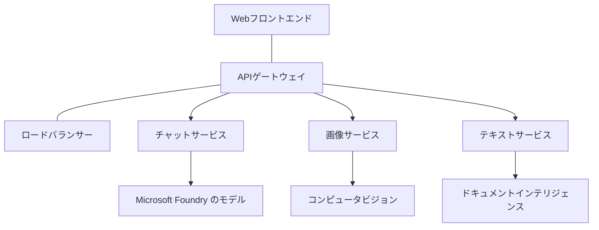

# Production AI Workload Best Practices with AZD

**Chapter Navigation:**
- **📚 Course Home**: [AZD For Beginners](../../README.md)
- **📖 Current Chapter**: 第8章 - 本番環境とエンタープライズパターン
- **⬅️ Previous Chapter**: [Chapter 7: Troubleshooting](../chapter-07-troubleshooting/debugging.md)
- **⬅️ Also Related**: [AI Workshop Lab](ai-workshop-lab.md)
- **🎯 Course Complete**: [AZD For Beginners](../../README.md)

## Overview

このガイドは、Azure Developer CLI (AZD) を使用して本番対応の AI ワークロードをデプロイするための包括的なベストプラクティスを提供します。Microsoft Foundry Discord コミュニティからのフィードバックと実際の顧客導入に基づき、これらのプラクティスは本番 AI システムで最も一般的な課題に対応します。

## Key Challenges Addressed

コミュニティ投票の結果に基づき、開発者が直面する主な課題は次のとおりです:

- **45%** がマルチサービスの AI デプロイに苦労している
- **38%** が資格情報とシークレット管理に問題を抱えている  
- **35%** が本番準備とスケーリングを困難と感じている
- **32%** がコスト最適化戦略をより必要としている
- **29%** が監視とトラブルシューティングの改善を求めている

## Architecture Patterns for Production AI

### Pattern 1: Microservices AI Architecture

**When to use**: 複数の機能を持つ複雑な AI アプリケーション向け


**AZD Implementation**:

```yaml
# azure.yaml
name: enterprise-ai-platform
services:
  web:
    project: ./web
    host: staticwebapp
  api-gateway:
    project: ./api-gateway
    host: containerapp
  chat-service:
    project: ./services/chat
    host: containerapp
  vision-service:
    project: ./services/vision
    host: containerapp
  text-service:
    project: ./services/text
    host: containerapp
```

### Pattern 2: Event-Driven AI Processing

**When to use**: バッチ処理、ドキュメント分析、非同期ワークフロー

```bicep
// Event Hub for AI processing pipeline
resource eventHub 'Microsoft.EventHub/namespaces@2023-01-01-preview' = {
  name: eventHubNamespaceName
  location: location
  sku: {
    name: 'Standard'
    tier: 'Standard'
    capacity: 1
  }
}

// Service Bus for reliable message processing
resource serviceBus 'Microsoft.ServiceBus/namespaces@2022-10-01-preview' = {
  name: serviceBusNamespaceName
  location: location
  sku: {
    name: 'Premium'
    tier: 'Premium'
    capacity: 1
  }
}

// Function App for processing
resource functionApp 'Microsoft.Web/sites@2023-01-01' = {
  name: functionAppName
  location: location
  kind: 'functionapp,linux'
  properties: {
    siteConfig: {
      appSettings: [
        {
          name: 'FUNCTIONS_EXTENSION_VERSION'
          value: '~4'
        }
        {
          name: 'AZURE_OPENAI_ENDPOINT'
          value: '@Microsoft.KeyVault(VaultName=${keyVault.name};SecretName=openai-endpoint)'
        }
      ]
    }
  }
}
```

## Thinking About AI Agent Health

従来のウェブアプリが壊れたとき、症状はおなじみのものです: ページがロードされない、API がエラーを返す、またはデプロイが失敗する。AI 搭載アプリケーションはこれらの同じ方法で壊れる可能性があります—しかし、明確なエラーメッセージを生成しない、より微妙な不具合を起こすこともあります。

このセクションは、AI ワークロードを監視するためのメンタルモデルを構築するのに役立ちます。問題が発生したときにどこを確認すべきかがわかるようになります。

### How Agent Health Differs from Traditional App Health

従来のアプリは動作するかしないかのどちらかです。AI エージェントは動作しているように見えても、結果が悪いことがあります。エージェントのヘルスは二つの層で考えてください:

| Layer | What to Watch | Where to Look |
|-------|--------------|---------------|
| **Infrastructure health** | サービスは稼働しているか？リソースはプロビジョニングされているか？エンドポイントは到達可能か？ | `azd monitor`, Azure Portal resource health, コンテナ/アプリのログ |
| **Behavior health** | エージェントは正確に応答しているか？応答はタイムリーか？モデルは正しく呼び出されているか？ | Application Insights のトレース、モデル呼び出しのレイテンシメトリクス、応答品質ログ |

Infrastructure health は馴染みのあるものです—azd アプリ全般で同じです。Behavior health は AI ワークロードがもたらす新しい層です。

### Where to Look When AI Apps Don't Behave as Expected

AI アプリケーションが期待通りの結果を出さない場合、以下は概念的なチェックリストです:

1. **基本から始める。** アプリは稼働していますか？依存関係に到達できますか？他のアプリと同様に `azd monitor` とリソースヘルスを確認してください。
2. **モデル接続を確認する。** アプリケーションは AI モデルを正常に呼び出していますか？失敗やタイムアウトしたモデル呼び出しは AI アプリの問題の最も一般的な原因であり、アプリケーションログに表示されます。
3. **モデルが受け取ったものを確認する。** AI の応答は入力（プロンプトや取得されたコンテキスト）に依存します。出力が間違っている場合、入力が間違っていることが多いです。アプリがモデルに正しいデータを送っているか確認してください。
4. **応答レイテンシをレビューする。** AI モデル呼び出しは通常の API 呼び出しより遅いです。アプリが重く感じる場合、モデルの応答時間が増加していないか確認してください—スロットリング、キャパシティの限界、またはリージョンレベルの混雑を示すことがあります。
5. **コストのシグナルに注意する。** トークン使用量や API 呼び出しの予期しないスパイクは、ループ、誤設定されたプロンプト、または過剰なリトライを示している可能性があります。

すぐに可観測性ツールを完全に習得する必要はありません。重要なポイントは、AI アプリケーションには監視すべき行動層が追加されることであり、azd の組み込み監視（`azd monitor`）が両方の層を調査するための出発点を提供するということです。

---

## Security Best Practices

### 1. Zero-Trust Security Model

**Implementation Strategy**:
- 認証なしのサービス間通信は行わない
- すべての API 呼び出しにマネージド ID を使用
- プライベートエンドポイントによるネットワーク分離
- 最小権限のアクセス制御

```bicep
// Managed Identity for each service
resource chatServiceIdentity 'Microsoft.ManagedIdentity/userAssignedIdentities@2023-01-31' = {
  name: 'chat-service-identity'
  location: location
}

// Role assignments with minimal permissions
resource openAIUserRole 'Microsoft.Authorization/roleAssignments@2022-04-01' = {
  scope: openAIAccount
  name: guid(openAIAccount.id, chatServiceIdentity.id, openAIUserRoleDefinitionId)
  properties: {
    roleDefinitionId: subscriptionResourceId('Microsoft.Authorization/roleDefinitions', '5e0bd9bd-7b93-4f28-af87-19fc36ad61bd')
    principalId: chatServiceIdentity.properties.principalId
    principalType: 'ServicePrincipal'
  }
}
```

### 2. Secure Secret Management

**Key Vault Integration Pattern**:

```bicep
// Key Vault with proper access policies
resource keyVault 'Microsoft.KeyVault/vaults@2023-02-01' = {
  name: keyVaultName
  location: location
  properties: {
    tenantId: tenant().tenantId
    sku: {
      family: 'A'
      name: 'premium'  // Use premium for production
    }
    enableRbacAuthorization: true  // Use RBAC instead of access policies
    enablePurgeProtection: true    // Prevent accidental deletion
    enableSoftDelete: true
    softDeleteRetentionInDays: 90
  }
}

// Store all AI service credentials
resource openAIKeySecret 'Microsoft.KeyVault/vaults/secrets@2023-02-01' = {
  parent: keyVault
  name: 'openai-api-key'
  properties: {
    value: openAIAccount.listKeys().key1
    attributes: {
      enabled: true
    }
  }
}
```

### 3. Network Security

**Private Endpoint Configuration**:

```bicep
// Virtual Network for AI services
resource virtualNetwork 'Microsoft.Network/virtualNetworks@2023-04-01' = {
  name: vnetName
  location: location
  properties: {
    addressSpace: {
      addressPrefixes: ['10.0.0.0/16']
    }
    subnets: [
      {
        name: 'ai-services-subnet'
        properties: {
          addressPrefix: '10.0.1.0/24'
          privateEndpointNetworkPolicies: 'Disabled'
        }
      }
      {
        name: 'app-services-subnet'
        properties: {
          addressPrefix: '10.0.2.0/24'
          delegations: [
            {
              name: 'Microsoft.Web/serverFarms'
              properties: {
                serviceName: 'Microsoft.Web/serverFarms'
              }
            }
          ]
        }
      }
    ]
  }
}

// Private endpoints for all AI services
resource openAIPrivateEndpoint 'Microsoft.Network/privateEndpoints@2023-04-01' = {
  name: '${openAIAccountName}-pe'
  location: location
  properties: {
    subnet: {
      id: virtualNetwork.properties.subnets[0].id
    }
    privateLinkServiceConnections: [
      {
        name: 'openai-connection'
        properties: {
          privateLinkServiceId: openAIAccount.id
          groupIds: ['account']
        }
      }
    ]
  }
}
```

## Performance and Scaling

### 1. Auto-Scaling Strategies

**Container Apps Auto-scaling**:

```bicep
resource containerApp 'Microsoft.App/containerApps@2023-05-01' = {
  name: containerAppName
  location: location
  properties: {
    configuration: {
      ingress: {
        external: true
        targetPort: 8000
        transport: 'http'
      }
    }
    template: {
      scale: {
        minReplicas: 2  // Always have 2 instances minimum
        maxReplicas: 50 // Scale up to 50 for high load
        rules: [
          {
            name: 'http-scaling'
            http: {
              metadata: {
                concurrentRequests: '20'  // Scale when >20 concurrent requests
              }
            }
          }
          {
            name: 'cpu-scaling'
            custom: {
              type: 'cpu'
              metadata: {
                type: 'Utilization'
                value: '70'  // Scale when CPU >70%
              }
            }
          }
        ]
      }
    }
  }
}
```

### 2. Caching Strategies

**Redis Cache for AI Responses**:

```bicep
// Redis Premium for production workloads
resource redisCache 'Microsoft.Cache/redis@2023-04-01' = {
  name: redisCacheName
  location: location
  properties: {
    sku: {
      name: 'Premium'
      family: 'P'
      capacity: 1
    }
    enableNonSslPort: false
    minimumTlsVersion: '1.2'
    redisConfiguration: {
      'maxmemory-policy': 'allkeys-lru'
    }
    // Enable clustering for high availability
    redisVersion: '6.0'
    shardCount: 2
  }
}

// Cache configuration in application
var cacheConnectionString = '${redisCache.properties.hostName}:6380,password=${redisCache.listKeys().primaryKey},ssl=True,abortConnect=False'
```

### 3. Load Balancing and Traffic Management

**Application Gateway with WAF**:

```bicep
// Application Gateway with Web Application Firewall
resource applicationGateway 'Microsoft.Network/applicationGateways@2023-04-01' = {
  name: appGatewayName
  location: location
  properties: {
    sku: {
      name: 'WAF_v2'
      tier: 'WAF_v2'
      capacity: 2
    }
    webApplicationFirewallConfiguration: {
      enabled: true
      firewallMode: 'Prevention'
      ruleSetType: 'OWASP'
      ruleSetVersion: '3.2'
    }
    // Backend pools for AI services
    backendAddressPools: [
      {
        name: 'ai-services-pool'
        properties: {
          backendAddresses: [
            {
              fqdn: '${containerApp.properties.configuration.ingress.fqdn}'
            }
          ]
        }
      }
    ]
  }
}
```

## 💰 Cost Optimization

### 1. Resource Right-Sizing

**Environment-Specific Configurations**:

```bash
# 開発環境
azd env new development
azd env set AZURE_OPENAI_SKU "S0"
azd env set AZURE_OPENAI_CAPACITY 10
azd env set AZURE_SEARCH_SKU "basic"
azd env set CONTAINER_CPU 0.5
azd env set CONTAINER_MEMORY 1.0

# 本番環境
azd env new production
azd env set AZURE_OPENAI_SKU "S0"
azd env set AZURE_OPENAI_CAPACITY 100
azd env set AZURE_SEARCH_SKU "standard"
azd env set CONTAINER_CPU 2.0
azd env set CONTAINER_MEMORY 4.0
```

### 2. Cost Monitoring and Budgets

```bicep
// Cost management and budgets
resource budget 'Microsoft.Consumption/budgets@2023-05-01' = {
  name: 'ai-workload-budget'
  properties: {
    timePeriod: {
      startDate: '2024-01-01'
      endDate: '2024-12-31'
    }
    timeGrain: 'Monthly'
    amount: 2000  // $2000 monthly budget
    category: 'Cost'
    notifications: {
      warning: {
        enabled: true
        operator: 'GreaterThan'
        threshold: 80
        contactEmails: [
          'finance@company.com'
          'engineering@company.com'
        ]
        contactRoles: [
          'Owner'
          'Contributor'
        ]
      }
      critical: {
        enabled: true
        operator: 'GreaterThan'
        threshold: 95
        contactEmails: [
          'cto@company.com'
        ]
      }
    }
  }
}
```

### 3. Token Usage Optimization

**OpenAI Cost Management**:

```typescript
// アプリケーションレベルのトークン最適化
class TokenOptimizer {
  private readonly maxTokens = 4000;
  private readonly reserveTokens = 500;
  
  optimizePrompt(userInput: string, context: string): string {
    const availableTokens = this.maxTokens - this.reserveTokens;
    const estimatedTokens = this.estimateTokens(userInput + context);
    
    if (estimatedTokens > availableTokens) {
      // コンテキストを切り詰め、ユーザー入力は切り詰めない
      context = this.truncateContext(context, availableTokens - this.estimateTokens(userInput));
    }
    
    return `${context}\n\nUser: ${userInput}`;
  }
  
  private estimateTokens(text: string): number {
    // 概算: 1トークン ≈ 4文字
    return Math.ceil(text.length / 4);
  }
}
```

## Monitoring and Observability

### 1. Comprehensive Application Insights

```bicep
// Application Insights with advanced features
resource applicationInsights 'Microsoft.Insights/components@2020-02-02' = {
  name: applicationInsightsName
  location: location
  kind: 'web'
  properties: {
    Application_Type: 'web'
    WorkspaceResourceId: logAnalyticsWorkspace.id
    SamplingPercentage: 100  // Full sampling for AI apps
    DisableIpMasking: false  // Enable for security
  }
}

// Custom metrics for AI operations
resource aiMetricAlerts 'Microsoft.Insights/metricAlerts@2018-03-01' = {
  name: 'ai-high-error-rate'
  location: 'global'
  properties: {
    description: 'Alert when AI service error rate is high'
    severity: 2
    enabled: true
    scopes: [
      applicationInsights.id
    ]
    evaluationFrequency: 'PT1M'
    windowSize: 'PT5M'
    criteria: {
      'odata.type': 'Microsoft.Azure.Monitor.SingleResourceMultipleMetricCriteria'
      allOf: [
        {
          name: 'high-error-rate'
          metricName: 'requests/failed'
          operator: 'GreaterThan'
          threshold: 10
          timeAggregation: 'Count'
        }
      ]
    }
  }
}
```

### 2. AI-Specific Monitoring

**Custom Dashboards for AI Metrics**:

```json
// Dashboard configuration for AI workloads
{
  "dashboard": {
    "name": "AI Application Monitoring",
    "tiles": [
      {
        "name": "OpenAI Request Volume",
        "query": "requests | where name contains 'openai' | summarize count() by bin(timestamp, 5m)"
      },
      {
        "name": "AI Response Latency",
        "query": "requests | where name contains 'openai' | summarize avg(duration) by bin(timestamp, 5m)"
      },
      {
        "name": "Token Usage",
        "query": "customMetrics | where name == 'openai_tokens_used' | summarize sum(value) by bin(timestamp, 1h)"
      },
      {
        "name": "Cost per Hour",
        "query": "customMetrics | where name == 'openai_cost' | summarize sum(value) by bin(timestamp, 1h)"
      }
    ]
  }
}
```

### 3. Health Checks and Uptime Monitoring

```bicep
// Application Insights availability tests
resource availabilityTest 'Microsoft.Insights/webtests@2022-06-15' = {
  name: 'ai-app-availability-test'
  location: location
  tags: {
    'hidden-link:${applicationInsights.id}': 'Resource'
  }
  properties: {
    SyntheticMonitorId: 'ai-app-availability-test'
    Name: 'AI Application Availability Test'
    Description: 'Tests AI application endpoints'
    Enabled: true
    Frequency: 300  // 5 minutes
    Timeout: 120    // 2 minutes
    Kind: 'ping'
    Locations: [
      {
        Id: 'us-east-2-azr'
      }
      {
        Id: 'us-west-2-azr'
      }
    ]
    Configuration: {
      WebTest: '''
        <WebTest Name="AI Health Check" 
                 Id="8d2de8d2-a2b0-4c2e-9a0d-8f9c9a0b8c8d" 
                 Enabled="True" 
                 CssProjectStructure="" 
                 CssIteration="" 
                 Timeout="120" 
                 WorkItemIds="" 
                 xmlns="http://microsoft.com/schemas/VisualStudio/TeamTest/2010" 
                 Description="" 
                 CredentialUserName="" 
                 CredentialPassword="" 
                 PreAuthenticate="True" 
                 Proxy="default" 
                 StopOnError="False" 
                 RecordedResultFile="" 
                 ResultsLocale="">
          <Items>
            <Request Method="GET" 
                     Guid="a5f10126-e4cd-570d-961c-cea43999a200" 
                     Version="1.1" 
                     Url="${webApp.properties.defaultHostName}/health" 
                     ThinkTime="0" 
                     Timeout="120" 
                     ParseDependentRequests="True" 
                     FollowRedirects="True" 
                     RecordResult="True" 
                     Cache="False" 
                     ResponseTimeGoal="0" 
                     Encoding="utf-8" 
                     ExpectedHttpStatusCode="200" 
                     ExpectedResponseUrl="" 
                     ReportingName="" 
                     IgnoreHttpStatusCode="False" />
          </Items>
        </WebTest>
      '''
    }
  }
}
```

## Disaster Recovery and High Availability

### 1. Multi-Region Deployment

```yaml
# azure.yaml - Multi-region configuration
name: ai-app-multiregion
services:
  api-primary:
    project: ./api
    host: containerapp
    env:
      - AZURE_REGION=eastus
  api-secondary:
    project: ./api
    host: containerapp
    env:
      - AZURE_REGION=westus2
```

```bicep
// Traffic Manager for global load balancing
resource trafficManager 'Microsoft.Network/trafficManagerProfiles@2022-04-01' = {
  name: trafficManagerProfileName
  location: 'global'
  properties: {
    profileStatus: 'Enabled'
    trafficRoutingMethod: 'Priority'
    dnsConfig: {
      relativeName: trafficManagerProfileName
      ttl: 30
    }
    monitorConfig: {
      protocol: 'HTTPS'
      port: 443
      path: '/health'
      intervalInSeconds: 30
      toleratedNumberOfFailures: 3
      timeoutInSeconds: 10
    }
    endpoints: [
      {
        name: 'primary-endpoint'
        type: 'Microsoft.Network/trafficManagerProfiles/azureEndpoints'
        properties: {
          targetResourceId: primaryAppService.id
          endpointStatus: 'Enabled'
          priority: 1
        }
      }
      {
        name: 'secondary-endpoint'
        type: 'Microsoft.Network/trafficManagerProfiles/azureEndpoints'
        properties: {
          targetResourceId: secondaryAppService.id
          endpointStatus: 'Enabled'
          priority: 2
        }
      }
    ]
  }
}
```

### 2. Data Backup and Recovery

```bicep
// Backup configuration for critical data
resource backupVault 'Microsoft.DataProtection/backupVaults@2023-05-01' = {
  name: backupVaultName
  location: location
  identity: {
    type: 'SystemAssigned'
  }
  properties: {
    storageSettings: [
      {
        datastoreType: 'VaultStore'
        type: 'LocallyRedundant'
      }
    ]
  }
}

// Backup policy for AI models and data
resource backupPolicy 'Microsoft.DataProtection/backupVaults/backupPolicies@2023-05-01' = {
  parent: backupVault
  name: 'ai-data-backup-policy'
  properties: {
    policyRules: [
      {
        backupParameters: {
          backupType: 'Full'
          objectType: 'AzureBackupParams'
        }
        trigger: {
          schedule: {
            repeatingTimeIntervals: [
              'R/2024-01-01T02:00:00+00:00/P1D'  // Daily at 2 AM
            ]
          }
          objectType: 'ScheduleBasedTriggerContext'
        }
        dataStore: {
          datastoreType: 'VaultStore'
          objectType: 'DataStoreInfoBase'
        }
        name: 'BackupDaily'
        objectType: 'AzureBackupRule'
      }
    ]
  }
}
```

## DevOps and CI/CD Integration

### 1. GitHub Actions Workflow

```yaml
# .github/workflows/deploy-ai-app.yml
name: Deploy AI Application

on:
  push:
    branches: [main]
  pull_request:
    branches: [main]

jobs:
  test:
    runs-on: ubuntu-latest
    steps:
      - uses: actions/checkout@v4
      
      - name: Setup Python
        uses: actions/setup-python@v4
        with:
          python-version: '3.11'
          
      - name: Install dependencies
        run: |
          pip install -r requirements.txt
          pip install pytest
          
      - name: Run tests
        run: pytest tests/
        
      - name: AI Safety Tests
        run: |
          python scripts/test_ai_safety.py
          python scripts/validate_prompts.py

  deploy-staging:
    needs: test
    if: github.event_name == 'pull_request'
    runs-on: ubuntu-latest
    steps:
      - uses: actions/checkout@v4
      
      - name: Setup AZD
        uses: Azure/setup-azd@v1.0.0
        
      - name: Login to Azure
        uses: azure/login@v1
        with:
          creds: ${{ secrets.AZURE_CREDENTIALS }}
          
      - name: Deploy to Staging
        run: |
          azd env select staging
          azd deploy

  deploy-production:
    needs: test
    if: github.ref == 'refs/heads/main'
    runs-on: ubuntu-latest
    steps:
      - uses: actions/checkout@v4
      
      - name: Setup AZD
        uses: Azure/setup-azd@v1.0.0
        
      - name: Login to Azure
        uses: azure/login@v1
        with:
          creds: ${{ secrets.AZURE_CREDENTIALS }}
          
      - name: Deploy to Production
        run: |
          azd env select production
          azd deploy
          
      - name: Run Production Health Checks
        run: |
          python scripts/health_check.py --env production
```

### 2. Infrastructure Validation

```bash
# scripts/validate_infrastructure.sh
#!/bin/bash

echo "Validating AI infrastructure deployment..."

# 必要なすべてのサービスが稼働しているか確認する
services=("openai" "search" "storage" "keyvault")
for service in "${services[@]}"; do
    echo "Checking $service..."
    if ! az resource list --resource-type "Microsoft.CognitiveServices/accounts" --query "[?contains(name, '$service')]" -o tsv; then
        echo "ERROR: $service not found"
        exit 1
    fi
done

# OpenAIモデルのデプロイを検証する
echo "Validating OpenAI model deployments..."
models=$(az cognitiveservices account deployment list --name $AZURE_OPENAI_NAME --resource-group $AZURE_RESOURCE_GROUP --query "[].name" -o tsv)
if [[ ! $models == *"gpt-35-turbo"* ]]; then
    echo "ERROR: Required model gpt-35-turbo not deployed"
    exit 1
fi

# AIサービスの接続性をテストする
echo "Testing AI service connectivity..."
python scripts/test_connectivity.py

echo "Infrastructure validation completed successfully!"
```

## Production Readiness Checklist

### Security ✅
- [ ] All services use managed identities
- [ ] Secrets stored in Key Vault
- [ ] Private endpoints configured
- [ ] Network security groups implemented
- [ ] RBAC with least privilege
- [ ] WAF enabled on public endpoints

### Performance ✅
- [ ] Auto-scaling configured
- [ ] Caching implemented
- [ ] Load balancing setup
- [ ] CDN for static content
- [ ] Database connection pooling
- [ ] Token usage optimization

### Monitoring ✅
- [ ] Application Insights configured
- [ ] Custom metrics defined
- [ ] Alerting rules setup
- [ ] Dashboard created
- [ ] Health checks implemented
- [ ] Log retention policies

### Reliability ✅
- [ ] Multi-region deployment
- [ ] Backup and recovery plan
- [ ] Circuit breakers implemented
- [ ] Retry policies configured
- [ ] Graceful degradation
- [ ] Health check endpoints

### Cost Management ✅
- [ ] Budget alerts configured
- [ ] Resource right-sizing
- [ ] Dev/test discounts applied
- [ ] Reserved instances purchased
- [ ] Cost monitoring dashboard
- [ ] Regular cost reviews

### Compliance ✅
- [ ] Data residency requirements met
- [ ] Audit logging enabled
- [ ] Compliance policies applied
- [ ] Security baselines implemented
- [ ] Regular security assessments
- [ ] Incident response plan

## Performance Benchmarks

### Typical Production Metrics

| Metric | Target | Monitoring |
|--------|--------|------------|
| **Response Time** | < 2 seconds | Application Insights |
| **Availability** | 99.9% | Uptime monitoring |
| **Error Rate** | < 0.1% | Application logs |
| **Token Usage** | < $500/month | Cost management |
| **Concurrent Users** | 1000+ | Load testing |
| **Recovery Time** | < 1 hour | Disaster recovery tests |

### Load Testing

```bash
# AIアプリケーションの負荷テスト用スクリプト
python scripts/load_test.py \
  --endpoint https://your-ai-app.azurewebsites.net \
  --concurrent-users 100 \
  --duration 300 \
  --ramp-up 60
```

## 🤝 Community Best Practices

Microsoft Foundry Discord コミュニティのフィードバックに基づく:

### Top Recommendations from the Community:

1. **小さく始めて、段階的にスケールする**: 基本的な SKU から開始し、実際の使用状況に基づいてスケールアップする
2. <strong>すべてを監視する</strong>: 初日から包括的な監視を設定する
3. <strong>セキュリティを自動化する</strong>: 一貫したセキュリティのために Infrastructure as Code を使用する
4. <strong>徹底的にテストする</strong>: パイプラインに AI 固有のテストを含める
5. <strong>コストを見越して計画する</strong>: トークン使用量を監視し、早期に予算アラートを設定する

### Common Pitfalls to Avoid:

- ❌ コードに API キーをハードコーディングする
- ❌ 適切な監視を設定していない
- ❌ コスト最適化を無視する
- ❌ 障害シナリオをテストしていない
- ❌ ヘルスチェックなしでデプロイする

## AZD AI CLI Commands and Extensions

AZD には、プロダクション AI ワークフローを簡素化する AI 固有のコマンドと拡張機能が増えています。これらのツールはローカル開発と本番デプロイのギャップを埋めます。

### AZD Extensions for AI

AZD は拡張システムを使用して AI 固有の機能を追加します。拡張機能は次のコマンドでインストールおよび管理します:

```bash
# 利用可能なすべての拡張機能を一覧表示する（AI を含む）
azd extension list

# Foundry Agents 拡張機能をインストールする
azd extension install azure.ai.agents

# ファインチューニング拡張機能をインストールする
azd extension install azure.ai.finetune

# カスタムモデル拡張機能をインストールする
azd extension install azure.ai.models

# インストールされているすべての拡張機能をアップグレードする
azd extension upgrade --all
```

**Available AI extensions:**

| Extension | Purpose | Status |
|-----------|---------|--------|
| `azure.ai.agents` | Foundry Agent Service management | Preview |
| `azure.ai.finetune` | Foundry model fine-tuning | Preview |
| `azure.ai.models` | Foundry custom models | Preview |
| `azure.coding-agent` | Coding agent configuration | Available |

### Initializing Agent Projects with `azd ai agent init`

`azd ai agent init` コマンドは、Microsoft Foundry Agent Service と統合された本番対応の AI エージェントプロジェクトをスキャフォールドします:

```bash
# エージェントマニフェストから新しいエージェントプロジェクトを初期化する
azd ai agent init -m <manifest-path-or-uri>

# 特定のFoundryプロジェクトを初期化し、ターゲットに設定する
azd ai agent init -m agent-manifest.yaml --project-id <foundry-project-id>

# カスタムのソースディレクトリを指定して初期化する
azd ai agent init -m agent-manifest.yaml --src ./agents/my-agent

# Container Appsをホストとしてターゲットにする
azd ai agent init -m agent-manifest.yaml --host containerapp
```

**Key flags:**

| Flag | Description |
|------|-------------|
| `-m, --manifest` | Path or URI to an agent manifest to add to your project |
| `-p, --project-id` | Existing Microsoft Foundry Project ID for your azd environment |
| `-s, --src` | Directory to download the agent definition (defaults to `src/<agent-id>`) |
| `--host` | Override the default host (e.g., `containerapp`) |
| `-e, --environment` | The azd environment to use |

**Production tip**: `--project-id` を使用して既存の Foundry プロジェクトに直接接続すると、エージェントコードとクラウドリソースを最初からリンクしたままにできます。

### Model Context Protocol (MCP) with `azd mcp`

AZD には組み込みの MCP サーバーサポート（Alpha）が含まれており、AI エージェントやツールが標準化されたプロトコルを通じて Azure リソースと対話できるようにします:

```bash
# プロジェクトのMCPサーバーを起動する
azd mcp start

# MCP操作のためのツールの同意を管理する
azd mcp consent
```

MCP サーバーはあなたの azd プロジェクトのコンテキスト—環境、サービス、Azure リソース—を AI 搭載の開発ツールに公開します。これにより次のことが可能になります:

- **AI 支援のデプロイ**: コーディングエージェントがプロジェクトの状態を問い合わせ、デプロイをトリガーできるようにする
- <strong>リソースの発見</strong>: AI ツールがプロジェクトで使用されている Azure リソースを発見できる
- <strong>環境管理</strong>: エージェントが dev/staging/production 環境を切り替えられる

### Infrastructure Generation with `azd infra generate`

本番 AI ワークロード向けに、自動プロビジョニングに頼る代わりにインフラストラクチャをコードとして生成しカスタマイズできます:

```bash
# プロジェクト定義から Bicep/Terraform ファイルを生成する
azd infra generate
```

これにより IaC をディスクに書き出すので、次のことが可能になります:
- デプロイ前にインフラをレビューおよび監査する
- カスタムセキュリティポリシー（ネットワークルール、プライベートエンドポイント）を追加する
- 既存の IaC レビュー プロセスに統合する
- アプリケーションコードとは別にインフラの変更をバージョン管理する

### Production Lifecycle Hooks

AZD のフックを使うと、デプロイライフサイクルの各段階でカスタムロジックを注入できます—これは本番 AI ワークフローにとって重要です:

```yaml
# azure.yaml - Production hooks example
name: ai-production-app
hooks:
  preprovision:
    shell: sh
    run: scripts/validate-quotas.sh    # Check AI model quota before provisioning
  postprovision:
    shell: sh
    run: scripts/configure-networking.sh  # Set up private endpoints
  predeploy:
    shell: sh
    run: scripts/run-ai-safety-tests.sh  # Run prompt safety checks
  postdeploy:
    shell: sh
    run: scripts/smoke-test.sh           # Verify agent responses post-deploy
services:
  agent-api:
    project: ./src/agent
    host: containerapp
    hooks:
      predeploy:
        shell: sh
        run: scripts/validate-model-access.sh  # Per-service hook
```

```bash
# 開発中に特定のフックを手動で実行する
azd hooks run predeploy
```

**Recommended production hooks for AI workloads:**

| Hook | Use Case |
|------|----------|
| `preprovision` | AI モデル容量のサブスクリプションクォータを検証する |
| `postprovision` | プライベートエンドポイントを構成し、モデルの重みをデプロイする |
| `predeploy` | AI セーフティテストを実行し、プロンプトテンプレートを検証する |
| `postdeploy` | エージェントの応答をスモークテストし、モデル接続を確認する |

### CI/CD Pipeline Configuration

`azd pipeline config` を使用して、プロジェクトを GitHub Actions または Azure Pipelines にセキュアな Azure 認証で接続します:

```bash
# CI/CDパイプラインを設定する（対話式）
azd pipeline config

# 特定のプロバイダーで設定する
azd pipeline config --provider github
```

このコマンドは次を行います:
- 最小権限アクセスを持つサービスプリンシパルを作成する
- フェデレーテッド資格情報を構成する（保存されたシークレットは不要）
- パイプライン定義ファイルを生成または更新する
- CI/CD システムに必要な環境変数を設定する

**Production workflow with pipeline config:**

```bash
# 1. 本番環境をセットアップする
azd env new production
azd env set AZURE_OPENAI_CAPACITY 100

# 2. パイプラインを設定する
azd pipeline config --provider github

# 3. パイプラインは main ブランチへの各プッシュで azd deploy を実行する
```

### Adding Components with `azd add`

既存のプロジェクトに Azure サービスを段階的に追加します:

```bash
# 新しいサービスコンポーネントを対話的に追加する
azd add
```

これは本番 AI アプリケーションを拡張する際に特に有用です—例えば、ベクター検索サービス、新しいエージェントエンドポイント、または既存のデプロイに監視コンポーネントを追加するなどです。

## Additional Resources
- **Azure Well-Architected Framework**: [AI ワークロードに関するガイダンス](https://learn.microsoft.com/azure/well-architected/ai/)
- **Microsoft Foundry ドキュメント**: [公式ドキュメント](https://learn.microsoft.com/azure/ai-studio/)
- **コミュニティ テンプレート**: [Azure サンプル](https://github.com/Azure-Samples)
- **Discord コミュニティ**: [#Azure チャンネル](https://discord.gg/microsoft-azure)
- **Azure 向けエージェントスキル**: [skills.sh の microsoft/github-copilot-for-azure](https://skills.sh/microsoft/github-copilot-for-azure) - Azure AI、Foundry、デプロイ、コスト最適化、および診断のための37件のオープンエージェントスキル。エディタにインストールしてください:
  ```bash
  npx skills add microsoft/github-copilot-for-azure
  ```

---

**章のナビゲーション:**
- **📚 コース ホーム**: [初心者向け AZD](../../README.md)
- **📖 現在の章**: 第8章 - 本番およびエンタープライズのパターン
- **⬅️ 前の章**: [第7章: トラブルシューティング](../chapter-07-troubleshooting/debugging.md)
- **⬅️ 関連項目**: [AI ワークショップラボ](ai-workshop-lab.md)
- **� コース完了**: [初心者向け AZD](../../README.md)

<strong>覚えておいてください</strong>: 本番環境のAIワークロードには、慎重な計画、監視、および継続的な最適化が必要です。これらのパターンから始め、特定の要件に合わせて適応してください。

---

<!-- CO-OP TRANSLATOR DISCLAIMER START -->
**免責事項**:
この文書はAI翻訳サービス [Co-opトランスレーター](https://github.com/Azure/co-op-translator) を使用して翻訳されました。正確性には努めていますが、自動翻訳には誤りや不正確さが含まれる可能性があることをご承知おきください。原文（原言語の文書）を信頼できる情報源と見なしてください。重要な情報については、専門の人間による翻訳をお勧めします。本翻訳の使用に起因するいかなる誤解や誤訳についても当方は責任を負いません。
<!-- CO-OP TRANSLATOR DISCLAIMER END -->