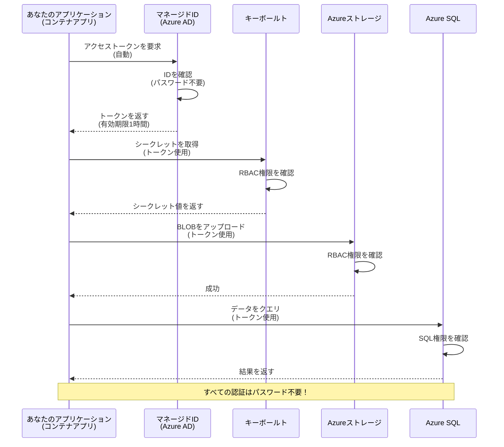
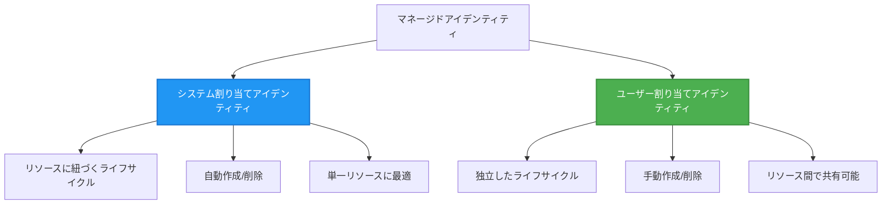

<!--
CO_OP_TRANSLATOR_METADATA:
{
  "original_hash": "e13ff6e1197e0a7462ed0aede7df9f23",
  "translation_date": "2025-11-19T22:08:50+00:00",
  "source_file": "docs/getting-started/authsecurity.md",
  "language_code": "ja"
}
-->
# 認証パターンとマネージドID

⏱️ **所要時間の目安**: 45～60分 | 💰 **コスト影響**: 無料（追加料金なし） | ⭐ **複雑さ**: 中級

**📚 学習パス:**
- ← 前: [構成管理](configuration.md) - 環境変数とシークレットの管理
- 🎯 **現在地**: 認証とセキュリティ（マネージドID、Key Vault、安全なパターン）
- → 次: [最初のプロジェクト](first-project.md) - 最初のAZDアプリケーションを構築
- 🏠 [コースホーム](../../README.md)

---

## 学べること

このレッスンを完了することで以下を学べます:
- Azureの認証パターン（キー、接続文字列、マネージドID）を理解する
- **マネージドID**を使用したパスワードレス認証を実装する
- **Azure Key Vault**統合でシークレットを保護する
- AZDデプロイメントのための**ロールベースアクセス制御（RBAC）**を設定する
- コンテナアプリとAzureサービスにおけるセキュリティのベストプラクティスを適用する
- キーベース認証からIDベース認証への移行を行う

## マネージドIDが重要な理由

### 問題: 従来の認証

**マネージドID導入前:**
```javascript
// ❌ セキュリティリスク: コード内にハードコーディングされた秘密
const connectionString = "Server=mydb.database.windows.net;User=admin;Password=P@ssw0rd123";
const storageKey = "xK7mN9pQ2wR5tY8uI0oP3aS6dF1gH4jK...";
const cosmosKey = "C2x7B9n4M1p8Q5w3E6r0T2y5U8i1O4p7...";
```

**問題点:**
- 🔴 **コードや構成ファイル、環境変数にシークレットが露出**
- 🔴 **資格情報のローテーション**がコード変更と再デプロイを必要とする
- 🔴 **監査の悪夢** - 誰がいつ何にアクセスしたのか不明
- 🔴 **スプロール** - シークレットが複数のシステムに散在
- 🔴 **コンプライアンスリスク** - セキュリティ監査に不合格

### 解決策: マネージドID

**マネージドID導入後:**
```javascript
// ✅ 安全: コードに秘密情報は含まれていません
const credential = new DefaultAzureCredential();
const client = new BlobServiceClient(
  "https://mystorageaccount.blob.core.windows.net",
  credential  // Azureは認証を自動的に処理します
);
```

**利点:**
- ✅ **コードや構成にシークレットが不要**
- ✅ **自動ローテーション** - Azureが管理
- ✅ **Azure ADログで完全な監査証跡**
- ✅ **セキュリティの集中管理** - Azureポータルで管理
- ✅ **コンプライアンス対応** - セキュリティ基準を満たす

**例え**: 従来の認証は、異なるドア用に複数の物理キーを持ち歩くようなものです。マネージドIDは、誰であるかに基づいて自動的にアクセスを許可するセキュリティバッジのようなものです。キーを紛失したり、コピーしたり、ローテーションする必要がありません。

---

## アーキテクチャ概要

### マネージドIDを使用した認証フロー


### マネージドIDの種類


| 特徴 | システム割り当て | ユーザー割り当て |
|------|----------------|----------------|
| **ライフサイクル** | リソースに紐付け | 独立 |
| **作成** | リソースと共に自動作成 | 手動作成 |
| **削除** | リソース削除時に削除 | リソース削除後も存続 |
| **共有** | 単一リソースのみ | 複数リソース |
| **ユースケース** | シンプルなシナリオ | 複雑なマルチリソースシナリオ |
| **AZDデフォルト** | ✅ 推奨 | オプション |

---

## 前提条件

### 必要なツール

前のレッスンでこれらをインストール済みである必要があります:

```bash
# Azure Developer CLI を確認する
azd version
# ✅ 期待値: azd バージョン 1.0.0 以上

# Azure CLI を確認する
az --version
# ✅ 期待値: azure-cli 2.50.0 以上
```

### Azureの要件

- 有効なAzureサブスクリプション
- 以下を行う権限:
  - マネージドIDの作成
  - RBACロールの割り当て
  - Key Vaultリソースの作成
  - コンテナアプリのデプロイ

### 知識の前提条件

以下を完了している必要があります:
- [インストールガイド](installation.md) - AZDセットアップ
- [AZDの基本](azd-basics.md) - 基本概念
- [構成管理](configuration.md) - 環境変数

---

## レッスン1: 認証パターンの理解

### パターン1: 接続文字列（レガシー - 避けるべき）

**仕組み:**
```bash
# 接続文字列には資格情報が含まれています
STORAGE_CONNECTION_STRING="DefaultEndpointsProtocol=https;AccountName=myaccount;AccountKey=xK7mN9pQ2wR5..."
COSMOS_CONNECTION_STRING="AccountEndpoint=https://myaccount.documents.azure.com:443/;AccountKey=C2x7..."
SQL_CONNECTION_STRING="Server=myserver.database.windows.net;User=admin;Password=P@ssw0rd..."
```

**問題点:**
- ❌ 環境変数にシークレットが見える
- ❌ デプロイシステムでログに記録される
- ❌ ローテーションが困難
- ❌ アクセスの監査証跡がない

**使用タイミング:** ローカル開発時のみ。プロダクションでは使用しない。

---

### パターン2: Key Vault参照（より良い）

**仕組み:**
```bicep
// Store secret in Key Vault
resource keyVault 'Microsoft.KeyVault/vaults@2023-02-01' = {
  name: 'mykv'
  properties: {
    enableRbacAuthorization: true
  }
}

// Reference in Container App
env: [
  {
    name: 'STORAGE_KEY'
    secretRef: 'storage-key'  // References Key Vault
  }
]
```

**利点:**
- ✅ シークレットがKey Vaultに安全に保存される
- ✅ シークレット管理が集中化される
- ✅ コード変更なしでローテーション可能

**制限事項:**
- ⚠️ 依然としてキーやパスワードを使用
- ⚠️ Key Vaultアクセスの管理が必要

**使用タイミング:** 接続文字列からマネージドIDへの移行ステップとして。

---

### パターン3: マネージドID（ベストプラクティス）

**仕組み:**
```bicep
// Enable managed identity
resource containerApp 'Microsoft.App/containerApps@2023-05-01' = {
  name: 'myapp'
  identity: {
    type: 'SystemAssigned'  // Automatically creates identity
  }
}

// Grant permissions
resource roleAssignment 'Microsoft.Authorization/roleAssignments@2022-04-01' = {
  scope: storageAccount
  properties: {
    roleDefinitionId: storageBlobDataContributorRole
    principalId: containerApp.identity.principalId
  }
}
```

**アプリケーションコード:**
```javascript
// 秘密は必要ありません！
const { DefaultAzureCredential } = require('@azure/identity');
const { BlobServiceClient } = require('@azure/storage-blob');

const credential = new DefaultAzureCredential();
const blobServiceClient = new BlobServiceClient(
  'https://mystorageaccount.blob.core.windows.net',
  credential
);
```

**利点:**
- ✅ コードや構成にシークレットが不要
- ✅ 資格情報の自動ローテーション
- ✅ 完全な監査証跡
- ✅ RBACベースの権限
- ✅ コンプライアンス対応

**使用タイミング:** 常に、プロダクションアプリケーションで。

---

## レッスン2: AZDでのマネージドIDの実装

### ステップバイステップの実装

Azure StorageとKey VaultにアクセスするためにマネージドIDを使用する安全なコンテナアプリを構築します。

### プロジェクト構造

```
secure-app/
├── azure.yaml                 # AZD configuration
├── infra/
│   ├── main.bicep            # Main infrastructure
│   ├── core/
│   │   ├── identity.bicep    # Managed identity setup
│   │   ├── keyvault.bicep    # Key Vault configuration
│   │   └── storage.bicep     # Storage with RBAC
│   └── app/
│       └── container-app.bicep
└── src/
    ├── app.js                # Application code
    ├── package.json
    └── Dockerfile
```

### 1. AZDの設定（azure.yaml）

```yaml
name: secure-app
metadata:
  template: secure-app@1.0.0

services:
  api:
    project: ./src
    language: js
    host: containerapp

# Enable managed identity (AZD handles this automatically)
```

### 2. インフラ: マネージドIDを有効化

**ファイル: `infra/main.bicep`**

```bicep
targetScope = 'subscription'

param environmentName string
param location string = 'eastus'

var tags = { 'azd-env-name': environmentName }

// Resource group
resource rg 'Microsoft.Resources/resourceGroups@2021-04-01' = {
  name: 'rg-${environmentName}'
  location: location
  tags: tags
}

// Storage Account
module storage './core/storage.bicep' = {
  name: 'storage'
  scope: rg
  params: {
    name: 'st${uniqueString(rg.id)}'
    location: location
    tags: tags
  }
}

// Key Vault
module keyVault './core/keyvault.bicep' = {
  name: 'keyvault'
  scope: rg
  params: {
    name: 'kv-${uniqueString(rg.id)}'
    location: location
    tags: tags
  }
}

// Container App with Managed Identity
module containerApp './app/container-app.bicep' = {
  name: 'container-app'
  scope: rg
  params: {
    name: 'ca-${environmentName}'
    location: location
    tags: tags
    storageAccountName: storage.outputs.name
    keyVaultName: keyVault.outputs.name
  }
}

// Grant Container App access to Storage
module storageRoleAssignment './core/role-assignment.bicep' = {
  name: 'storage-role'
  scope: rg
  params: {
    principalId: containerApp.outputs.identityPrincipalId
    roleDefinitionId: 'ba92f5b4-2d11-453d-a403-e96b0029c9fe'  // Storage Blob Data Contributor
    targetResourceId: storage.outputs.id
  }
}

// Grant Container App access to Key Vault
module kvRoleAssignment './core/role-assignment.bicep' = {
  name: 'kv-role'
  scope: rg
  params: {
    principalId: containerApp.outputs.identityPrincipalId
    roleDefinitionId: '4633458b-17de-408a-b874-0445c86b69e6'  // Key Vault Secrets User
    targetResourceId: keyVault.outputs.id
  }
}

// Outputs
output AZURE_STORAGE_ACCOUNT_NAME string = storage.outputs.name
output AZURE_KEY_VAULT_NAME string = keyVault.outputs.name
output APP_URL string = containerApp.outputs.url
```

### 3. システム割り当てIDを持つコンテナアプリ

**ファイル: `infra/app/container-app.bicep`**

```bicep
param name string
param location string
param tags object = {}
param storageAccountName string
param keyVaultName string

resource containerApp 'Microsoft.App/containerApps@2023-05-01' = {
  name: name
  location: location
  tags: tags
  identity: {
    type: 'SystemAssigned'  // 🔑 Enable managed identity
  }
  properties: {
    configuration: {
      ingress: {
        external: true
        targetPort: 3000
      }
    }
    template: {
      containers: [
        {
          name: 'api'
          image: 'myregistry.azurecr.io/api:latest'
          resources: {
            cpu: json('0.5')
            memory: '1Gi'
          }
          env: [
            {
              name: 'AZURE_STORAGE_ACCOUNT_NAME'
              value: storageAccountName
            }
            {
              name: 'AZURE_KEY_VAULT_NAME'
              value: keyVaultName
            }
            // 🔑 No secrets - managed identity handles authentication!
          ]
        }
      ]
    }
  }
}

// Output the identity for RBAC assignments
output identityPrincipalId string = containerApp.identity.principalId
output id string = containerApp.id
output url string = 'https://${containerApp.properties.configuration.ingress.fqdn}'
```

### 4. RBACロール割り当てモジュール

**ファイル: `infra/core/role-assignment.bicep`**

```bicep
param principalId string
param roleDefinitionId string  // Azure built-in role ID
param targetResourceId string

resource roleAssignment 'Microsoft.Authorization/roleAssignments@2022-04-01' = {
  name: guid(principalId, roleDefinitionId, targetResourceId)
  scope: resourceId('Microsoft.Resources/resourceGroups', resourceGroup().name)
  properties: {
    roleDefinitionId: subscriptionResourceId('Microsoft.Authorization/roleDefinitions', roleDefinitionId)
    principalId: principalId
    principalType: 'ServicePrincipal'
  }
}

output id string = roleAssignment.id
```

### 5. マネージドIDを使用したアプリケーションコード

**ファイル: `src/app.js`**

```javascript
const express = require('express');
const { DefaultAzureCredential } = require('@azure/identity');
const { BlobServiceClient } = require('@azure/storage-blob');
const { SecretClient } = require('@azure/keyvault-secrets');

const app = express();
const PORT = process.env.PORT || 3000;

// 🔑 資格情報を初期化する（マネージドIDで自動的に動作します）
const credential = new DefaultAzureCredential();

// Azure Storage のセットアップ
const storageAccountName = process.env.AZURE_STORAGE_ACCOUNT_NAME;
const blobServiceClient = new BlobServiceClient(
  `https://${storageAccountName}.blob.core.windows.net`,
  credential  // キーは不要です！
);

// Key Vault のセットアップ
const keyVaultName = process.env.AZURE_KEY_VAULT_NAME;
const secretClient = new SecretClient(
  `https://${keyVaultName}.vault.azure.net`,
  credential  // キーは不要です！
);

// ヘルスチェック
app.get('/health', (req, res) => {
  res.json({ status: 'healthy', authentication: 'managed-identity' });
});

// Blob Storage にファイルをアップロードする
app.post('/upload', async (req, res) => {
  try {
    const containerClient = blobServiceClient.getContainerClient('uploads');
    await containerClient.createIfNotExists();
    
    const blobName = `file-${Date.now()}.txt`;
    const blockBlobClient = containerClient.getBlockBlobClient(blobName);
    
    await blockBlobClient.upload('Hello from managed identity!', 30);
    
    res.json({
      success: true,
      blobName: blobName,
      message: 'File uploaded using managed identity!'
    });
  } catch (error) {
    console.error('Upload error:', error);
    res.status(500).json({ error: error.message });
  }
});

// Key Vault からシークレットを取得する
app.get('/secret/:name', async (req, res) => {
  try {
    const secretName = req.params.name;
    const secret = await secretClient.getSecret(secretName);
    
    res.json({
      name: secretName,
      value: secret.value,
      message: 'Secret retrieved using managed identity!'
    });
  } catch (error) {
    console.error('Secret error:', error);
    res.status(500).json({ error: error.message });
  }
});

// Blob コンテナを一覧表示する（読み取りアクセスを示します）
app.get('/containers', async (req, res) => {
  try {
    const containers = [];
    for await (const container of blobServiceClient.listContainers()) {
      containers.push(container.name);
    }
    
    res.json({
      containers: containers,
      count: containers.length,
      message: 'Containers listed using managed identity!'
    });
  } catch (error) {
    console.error('List error:', error);
    res.status(500).json({ error: error.message });
  }
});

app.listen(PORT, () => {
  console.log(`Secure API listening on port ${PORT}`);
  console.log('Authentication: Managed Identity (passwordless)');
});
```

**ファイル: `src/package.json`**

```json
{
  "name": "secure-app",
  "version": "1.0.0",
  "dependencies": {
    "express": "^4.18.2",
    "@azure/identity": "^4.0.0",
    "@azure/storage-blob": "^12.17.0",
    "@azure/keyvault-secrets": "^4.7.0"
  },
  "scripts": {
    "start": "node app.js"
  }
}
```

### 6. デプロイとテスト

```bash
# AZD環境を初期化する
azd init

# インフラとアプリケーションをデプロイする
azd up

# アプリのURLを取得する
APP_URL=$(azd env get-values | grep APP_URL | cut -d '=' -f2 | tr -d '"')

# ヘルスチェックをテストする
curl $APP_URL/health
```

**✅ 期待される出力:**
```json
{
  "status": "healthy",
  "authentication": "managed-identity"
}
```

**Blobアップロードのテスト:**
```bash
curl -X POST $APP_URL/upload
```

**✅ 期待される出力:**
```json
{
  "success": true,
  "blobName": "file-1700404800000.txt",
  "message": "File uploaded using managed identity!"
}
```

**コンテナリストのテスト:**
```bash
curl $APP_URL/containers
```

**✅ 期待される出力:**
```json
{
  "containers": ["uploads"],
  "count": 1,
  "message": "Containers listed using managed identity!"
}
```

---

## 一般的なAzure RBACロール

### マネージドID用の組み込みロールID

| サービス | ロール名 | ロールID | 権限 |
|----------|----------|----------|------|
| **Storage** | Storage Blob Data Reader | `2a2b9908-6b94-4a3d-8e5a-a7d8f8cc8a12` | Blobとコンテナの読み取り |
| **Storage** | Storage Blob Data Contributor | `ba92f5b4-2d11-453d-a403-e96b0029c9fe` | Blobの読み取り、書き込み、削除 |
| **Storage** | Storage Queue Data Contributor | `974c5e8b-45b9-4653-ba55-5f855dd0fb88` | キューのメッセージの読み取り、書き込み、削除 |
| **Key Vault** | Key Vault Secrets User | `4633458b-17de-408a-b874-0445c86b69e6` | シークレットの読み取り |
| **Key Vault** | Key Vault Secrets Officer | `b86a8fe4-44ce-4948-aee5-eccb2c155cd7` | シークレットの読み取り、書き込み、削除 |
| **Cosmos DB** | Cosmos DB Built-in Data Reader | `00000000-0000-0000-0000-000000000001` | Cosmos DBデータの読み取り |
| **Cosmos DB** | Cosmos DB Built-in Data Contributor | `00000000-0000-0000-0000-000000000002` | Cosmos DBデータの読み取り、書き込み |
| **SQL Database** | SQL DB Contributor | `9b7fa17d-e63e-47b0-bb0a-15c516ac86ec` | SQLデータベースの管理 |
| **Service Bus** | Azure Service Bus Data Owner | `090c5cfd-751d-490a-894a-3ce6f1109419` | メッセージの送信、受信、管理 |

### ロールIDの見つけ方

```bash
# すべての組み込みロールを一覧表示する
az role definition list --query "[].{Name:roleName, ID:name}" --output table

# 特定のロールを検索する
az role definition list --query "[?contains(roleName, 'Storage Blob')].{Name:roleName, ID:name}" --output table

# ロールの詳細を取得する
az role definition list --name "Storage Blob Data Contributor"
```

---

## 実践演習

### 演習1: 既存アプリへのマネージドIDの有効化 ⭐⭐（中級）

**目標**: 既存のコンテナアプリデプロイメントにマネージドIDを追加する

**シナリオ**: 接続文字列を使用しているコンテナアプリをマネージドIDに変換する。

**開始点**: 以下の構成を持つコンテナアプリ:

```bicep
// ❌ Current: Using connection string
env: [
  {
    name: 'STORAGE_CONNECTION_STRING'
    secretRef: 'storage-connection'
  }
]
```

**手順**:

1. **BicepでマネージドIDを有効化:**

```bicep
resource containerApp 'Microsoft.App/containerApps@2023-05-01' = {
  name: 'myapp'
  identity: {
    type: 'SystemAssigned'  // Add this
  }
  // ... rest of configuration
}
```

2. **Storageアクセスを付与:**

```bicep
// Get storage account reference
resource storageAccount 'Microsoft.Storage/storageAccounts@2023-01-01' existing = {
  name: storageAccountName
}

// Assign role
resource roleAssignment 'Microsoft.Authorization/roleAssignments@2022-04-01' = {
  name: guid(containerApp.id, 'ba92f5b4-2d11-453d-a403-e96b0029c9fe', storageAccount.id)
  scope: storageAccount
  properties: {
    roleDefinitionId: subscriptionResourceId('Microsoft.Authorization/roleDefinitions', 'ba92f5b4-2d11-453d-a403-e96b0029c9fe')
    principalId: containerApp.identity.principalId
    principalType: 'ServicePrincipal'
  }
}
```

3. **アプリケーションコードを更新:**

**前（接続文字列）:**
```javascript
const { BlobServiceClient } = require('@azure/storage-blob');

const blobServiceClient = BlobServiceClient.fromConnectionString(
  process.env.STORAGE_CONNECTION_STRING
);
```

**後（マネージドID）:**
```javascript
const { DefaultAzureCredential } = require('@azure/identity');
const { BlobServiceClient } = require('@azure/storage-blob');

const credential = new DefaultAzureCredential();
const blobServiceClient = new BlobServiceClient(
  `https://${process.env.STORAGE_ACCOUNT_NAME}.blob.core.windows.net`,
  credential
);
```

4. **環境変数を更新:**

```bicep
env: [
  {
    name: 'STORAGE_ACCOUNT_NAME'
    value: storageAccountName  // Just the name, no secrets!
  }
  // Remove STORAGE_CONNECTION_STRING
]
```

5. **デプロイとテスト:**

```bash
# 再展開
azd up

# まだ動作するかテストする
curl https://myapp.azurecontainerapps.io/upload
```

**✅ 成功基準:**
- ✅ アプリケーションがエラーなくデプロイされる
- ✅ Storage操作が機能する（アップロード、リスト、ダウンロード）
- ✅ 環境変数に接続文字列がない
- ✅ Azureポータルの「Identity」ブレードでIDが確認できる

**検証:**

```bash
# 管理対象IDが有効になっていることを確認する
az containerapp show \
  --name myapp \
  --resource-group rg-myapp \
  --query "identity.type"
# ✅ 期待値: "SystemAssigned"

# ロールの割り当てを確認する
az role assignment list \
  --assignee $(az containerapp show --name myapp --resource-group rg-myapp --query "identity.principalId" -o tsv) \
  --scope /subscriptions/{sub-id}/resourceGroups/rg-myapp/providers/Microsoft.Storage/storageAccounts/mystorageaccount
# ✅ 期待値: "Storage Blob Data Contributor" ロールが表示される
```

**時間**: 20～30分

---

### 演習2: ユーザー割り当てIDを使用したマルチサービスアクセス ⭐⭐⭐（上級）

**目標**: 複数のコンテナアプリで共有されるユーザー割り当てIDを作成する

**シナリオ**: 3つのマイクロサービスが同じStorageアカウントとKey Vaultにアクセスする必要がある。

**手順**:

1. **ユーザー割り当てIDを作成:**

**ファイル: `infra/core/identity.bicep`**

```bicep
param name string
param location string
param tags object = {}

resource userAssignedIdentity 'Microsoft.ManagedIdentity/userAssignedIdentities@2023-01-31' = {
  name: name
  location: location
  tags: tags
}

output id string = userAssignedIdentity.id
output principalId string = userAssignedIdentity.properties.principalId
output clientId string = userAssignedIdentity.properties.clientId
```

2. **ユーザー割り当てIDにロールを割り当て:**

```bicep
// In main.bicep
module userIdentity './core/identity.bicep' = {
  name: 'user-identity'
  scope: rg
  params: {
    name: 'id-${environmentName}'
    location: location
    tags: tags
  }
}

// Grant Storage access
resource storageRoleAssignment 'Microsoft.Authorization/roleAssignments@2022-04-01' = {
  name: guid(userIdentity.outputs.principalId, 'storage-contributor')
  scope: storageAccount
  properties: {
    roleDefinitionId: subscriptionResourceId('Microsoft.Authorization/roleDefinitions', 'ba92f5b4-2d11-453d-a403-e96b0029c9fe')
    principalId: userIdentity.outputs.principalId
    principalType: 'ServicePrincipal'
  }
}

// Grant Key Vault access
resource kvRoleAssignment 'Microsoft.Authorization/roleAssignments@2022-04-01' = {
  name: guid(userIdentity.outputs.principalId, 'kv-secrets-user')
  scope: keyVault
  properties: {
    roleDefinitionId: subscriptionResourceId('Microsoft.Authorization/roleDefinitions', '4633458b-17de-408a-b874-0445c86b69e6')
    principalId: userIdentity.outputs.principalId
    principalType: 'ServicePrincipal'
  }
}
```

3. **複数のコンテナアプリにIDを割り当て:**

```bicep
resource apiGateway 'Microsoft.App/containerApps@2023-05-01' = {
  name: 'api-gateway'
  identity: {
    type: 'UserAssigned'
    userAssignedIdentities: {
      '${userIdentity.outputs.id}': {}
    }
  }
  // ... rest of config
}

resource productService 'Microsoft.App/containerApps@2023-05-01' = {
  name: 'product-service'
  identity: {
    type: 'UserAssigned'
    userAssignedIdentities: {
      '${userIdentity.outputs.id}': {}
    }
  }
  // ... rest of config
}

resource orderService 'Microsoft.App/containerApps@2023-05-01' = {
  name: 'order-service'
  identity: {
    type: 'UserAssigned'
    userAssignedIdentities: {
      '${userIdentity.outputs.id}': {}
    }
  }
  // ... rest of config
}
```

4. **アプリケーションコード（すべてのサービスが同じパターンを使用）:**

```javascript
const { DefaultAzureCredential, ManagedIdentityCredential } = require('@azure/identity');

// ユーザー割り当てのIDの場合、クライアントIDを指定してください
const credential = new ManagedIdentityCredential(
  process.env.AZURE_CLIENT_ID  // ユーザー割り当てのIDクライアントID
);

// またはDefaultAzureCredentialを使用する（自動検出）
const credential = new DefaultAzureCredential();

const blobServiceClient = new BlobServiceClient(
  `https://${process.env.STORAGE_ACCOUNT_NAME}.blob.core.windows.net`,
  credential
);
```

5. **デプロイと検証:**

```bash
azd up

# すべてのサービスがストレージにアクセスできることをテストする
curl https://api-gateway.azurecontainerapps.io/upload
curl https://product-service.azurecontainerapps.io/upload
curl https://order-service.azurecontainerapps.io/upload
```

**✅ 成功基準:**
- ✅ 1つのIDが3つのサービスで共有される
- ✅ すべてのサービスがStorageとKey Vaultにアクセス可能
- ✅ 1つのサービスを削除してもIDが存続
- ✅ 権限管理が集中化される

**ユーザー割り当てIDの利点:**
- 管理するIDが1つ
- サービス間で一貫した権限
- サービス削除後もIDが存続
- 複雑なアーキテクチャに最適

**時間**: 30～40分

---

### 演習3: Key Vaultシークレットのローテーションを実装 ⭐⭐⭐（上級）

**目標**: Key VaultにサードパーティAPIキーを保存し、マネージドIDを使用してアクセスする

**シナリオ**: アプリが外部API（OpenAI、Stripe、SendGridなど）を呼び出す必要があり、APIキーが必要。

**手順**:

1. **RBACを使用してKey Vaultを作成:**

**ファイル: `infra/core/keyvault.bicep`**

```bicep
param name string
param location string
param tags object = {}

resource keyVault 'Microsoft.KeyVault/vaults@2023-02-01' = {
  name: name
  location: location
  tags: tags
  properties: {
    enableRbacAuthorization: true  // Use RBAC instead of access policies
    sku: {
      family: 'A'
      name: 'standard'
    }
    tenantId: subscription().tenantId
    enableSoftDelete: true
    softDeleteRetentionInDays: 90
  }
}

// Allow Container App to read secrets
output id string = keyVault.id
output name string = keyVault.name
output uri string = keyVault.properties.vaultUri
```

2. **Key Vaultにシークレットを保存:**

```bash
# キーボルト名を取得する
KV_NAME=$(azd env get-values | grep AZURE_KEY_VAULT_NAME | cut -d '=' -f2 | tr -d '"')

# サードパーティAPIキーを保存する
az keyvault secret set \
  --vault-name $KV_NAME \
  --name "OpenAI-ApiKey" \
  --value "sk-proj-xxxxxxxxxxxxx"

az keyvault secret set \
  --vault-name $KV_NAME \
  --name "Stripe-ApiKey" \
  --value "sk_live_xxxxxxxxxxxxx"

az keyvault secret set \
  --vault-name $KV_NAME \
  --name "SendGrid-ApiKey" \
  --value "SG.xxxxxxxxxxxxx"
```

3. **シークレットを取得するアプリケーションコード:**

**ファイル: `src/config.js`**

```javascript
const { DefaultAzureCredential } = require('@azure/identity');
const { SecretClient } = require('@azure/keyvault-secrets');

class Config {
  constructor() {
    this.credential = new DefaultAzureCredential();
    this.secretClient = new SecretClient(
      `https://${process.env.AZURE_KEY_VAULT_NAME}.vault.azure.net`,
      this.credential
    );
    this.cache = {};
  }

  async getSecret(secretName) {
    // まずキャッシュを確認する
    if (this.cache[secretName]) {
      return this.cache[secretName];
    }

    try {
      const secret = await this.secretClient.getSecret(secretName);
      this.cache[secretName] = secret.value;
      console.log(`✅ Retrieved secret: ${secretName}`);
      return secret.value;
    } catch (error) {
      console.error(`❌ Failed to get secret ${secretName}:`, error.message);
      throw error;
    }
  }

  async getOpenAIKey() {
    return this.getSecret('OpenAI-ApiKey');
  }

  async getStripeKey() {
    return this.getSecret('Stripe-ApiKey');
  }

  async getSendGridKey() {
    return this.getSecret('SendGrid-ApiKey');
  }
}

module.exports = new Config();
```

4. **アプリケーションでシークレットを使用:**

**ファイル: `src/app.js`**

```javascript
const express = require('express');
const config = require('./config');
const { OpenAI } = require('openai');

const app = express();

// Key VaultからのキーでOpenAIを初期化する
let openaiClient;

async function initializeServices() {
  const openaiKey = await config.getOpenAIKey();
  openaiClient = new OpenAI({ apiKey: openaiKey });
  console.log('✅ Services initialized with secrets from Key Vault');
}

// 起動時に呼び出す
initializeServices().catch(console.error);

app.post('/chat', async (req, res) => {
  try {
    const completion = await openaiClient.chat.completions.create({
      model: 'gpt-4',
      messages: [{ role: 'user', content: 'Hello!' }]
    });
    
    res.json({
      response: completion.choices[0].message.content,
      authentication: 'Key from Key Vault via Managed Identity'
    });
  } catch (error) {
    res.status(500).json({ error: error.message });
  }
});

app.listen(3000, () => {
  console.log('Secure API with Key Vault integration running');
});
```

5. **デプロイとテスト:**

```bash
azd up

# APIキーが機能することをテストする
curl -X POST https://myapp.azurecontainerapps.io/chat \
  -H "Content-Type: application/json" \
  -d '{"message":"Hello AI"}'
```

**✅ 成功基準:**
- ✅ コードや環境変数にAPIキーがない
- ✅ アプリケーションがKey Vaultからキーを取得
- ✅ サードパーティAPIが正常に動作
- ✅ コード変更なしでキーをローテーション可能

**シークレットのローテーション:**

```bash
# Key Vaultでシークレットを更新する
az keyvault secret set \
  --vault-name $KV_NAME \
  --name "OpenAI-ApiKey" \
  --value "sk-proj-NEW_KEY_HERE"

# 新しいキーを反映するためにアプリを再起動する
az containerapp revision restart \
  --name myapp \
  --resource-group rg-myapp
```

**時間**: 25～35分

---

## 知識チェックポイント

### 1. 認証パターン ✓

理解度をテスト:

- [ ] **Q1**: 主な認証パターンは何ですか？ 
  - **A**: 接続文字列（レガシー）、Key Vault参照（移行）、マネージドID（ベスト）

- [ ] **Q2**: マネージドIDが接続文字列より優れている理由は？
  - **A**: コードにシークレットが不要、自動ローテーション、完全な監査証跡、RBAC権限

- [ ] **Q3**: システム割り当てIDではなくユーザー割り当てIDを使用するのはいつですか？
  - **A**: 複数リソース間でIDを共有する場合や、IDのライフサイクルがリソースのライフサイクルと独立している場合

**実践検証:**
```bash
# アプリが使用するアイデンティティの種類を確認する
az containerapp show \
  --name myapp \
  --resource-group rg-myapp \
  --query "identity.type"

# アイデンティティのすべてのロール割り当てを一覧表示する
az role assignment list \
  --assignee $(az containerapp show --name myapp --resource-group rg-myapp --query "identity.principalId" -o tsv)
```

---

### 2. RBACと権限 ✓

理解度をテスト:

- [ ] **Q1**: "Storage Blob Data Contributor"のロールIDは何ですか？
  - **A**: `ba92f5b4-2d11-453d-a403-e96b0029c9fe`

- [ ] **Q2**: "Key Vault Secrets User"が提供する権限は？
  - **A**: シークレットの読み取り専用アクセス（作成、更新、削除は不可）

- [ ] **Q3**: コンテナアプリにAzure SQLへのアクセスを付与する方法は？
  - **A**: "SQL DB Contributor"ロールを割り当てるか、Azure AD認証をSQLに設定する

**実践検証:**
```bash
# 特定の役割を見つける
az role definition list --name "Storage Blob Data Contributor"

# 自分のアイデンティティに割り当てられている役割を確認する
PRINCIPAL_ID=$(az containerapp show --name myapp --resource-group rg-myapp --query "identity.principalId" -o tsv)
az role assignment list --assignee $PRINCIPAL_ID --output table
```

---

### 3. Key Vault統合 ✓

理解度をテスト:
- [ ] **Q1**: Key Vaultでアクセス ポリシーの代わりにRBACを有効にするにはどうすればよいですか？
  - **A**: Bicepで`enableRbacAuthorization: true`を設定します

- [ ] **Q2**: マネージドID認証を処理するAzure SDKライブラリは何ですか？
  - **A**: `@azure/identity`ライブラリの`DefaultAzureCredential`クラス

- [ ] **Q3**: Key Vaultのシークレットはキャッシュにどのくらいの期間保持されますか？
  - **A**: アプリケーション依存です。独自のキャッシュ戦略を実装してください。

**ハンズオン検証:**
```bash
# キーボルトアクセスをテストする
az keyvault secret show \
  --vault-name $KV_NAME \
  --name "OpenAI-ApiKey" \
  --query "value"

# RBACが有効であることを確認する
az keyvault show \
  --name $KV_NAME \
  --query "properties.enableRbacAuthorization"
# ✅ 期待値: true
```

---

## セキュリティのベストプラクティス

### ✅ 実施すべきこと:

1. **本番環境では常にマネージドIDを使用する**
   ```bicep
   identity: {
     type: 'SystemAssigned'
   }
   ```

2. **最小特権のRBACロールを使用する**
   - 可能な限り「Reader」ロールを使用
   - 必要がない限り「Owner」や「Contributor」を避ける

3. **サードパーティのキーをKey Vaultに保存する**
   ```javascript
   const apiKey = await secretClient.getSecret('ThirdPartyApiKey');
   ```

4. **監査ログを有効にする**
   ```bicep
   diagnosticSettings: {
     logs: [{ category: 'AuditEvent', enabled: true }]
   }
   ```

5. **開発/ステージング/本番で異なるIDを使用する**
   ```bash
   azd env new dev
   azd env new staging
   azd env new prod
   ```

6. **定期的にシークレットをローテーションする**
   - Key Vaultのシークレットに有効期限を設定
   - Azure Functionsでローテーションを自動化

### ❌ 避けるべきこと:

1. **シークレットをハードコーディングしない**
   ```javascript
   // ❌ 悪い
   const apiKey = "sk-proj-xxxxxxxxxxxxx";
   ```

2. **本番環境で接続文字列を使用しない**
   ```javascript
   // ❌ 悪い
   BlobServiceClient.fromConnectionString(process.env.STORAGE_CONNECTION_STRING)
   ```

3. **過剰な権限を付与しない**
   ```bicep
   // ❌ BAD - too much access
   roleDefinitionId: 'Owner'
   
   // ✅ GOOD - least privilege
   roleDefinitionId: 'Storage Blob Data Reader'
   ```

4. **シークレットをログに記録しない**
   ```javascript
   // ❌ 悪い
   console.log('API Key:', apiKey);
   
   // ✅ 良い
   console.log('API Key retrieved successfully');
   ```

5. **本番環境のIDを他の環境と共有しない**
   ```bicep
   // ❌ BAD - same identity for dev and prod
   // ✅ GOOD - separate identities per environment
   ```

---

## トラブルシューティングガイド

### 問題: Azure Storageへのアクセスで「Unauthorized」

**症状:**
```
Error: Unauthorized (403)
AuthorizationPermissionMismatch: This request is not authorized to perform this operation
```

**診断:**

```bash
# マネージドIDが有効になっているか確認する
az containerapp show \
  --name myapp \
  --resource-group rg-myapp \
  --query "identity.type"
# ✅ 期待値: "SystemAssigned" または "UserAssigned"

# ロールの割り当てを確認する
PRINCIPAL_ID=$(az containerapp show --name myapp --resource-group rg-myapp --query "identity.principalId" -o tsv)
az role assignment list --assignee $PRINCIPAL_ID

# 期待値: "Storage Blob Data Contributor" または類似のロールが表示されるべき
```

**解決策:**

1. **正しいRBACロールを付与する:**
```bash
STORAGE_ID=$(az storage account show --name mystorageaccount --resource-group rg-myapp --query "id" -o tsv)
az role assignment create \
  --assignee $PRINCIPAL_ID \
  --role "Storage Blob Data Contributor" \
  --scope $STORAGE_ID
```

2. **伝播を待つ（5～10分かかる場合あり）:**
```bash
# ロール割り当てのステータスを確認する
az role assignment list --assignee $PRINCIPAL_ID --scope $STORAGE_ID
```

3. **アプリケーションコードが正しい資格情報を使用していることを確認する:**
```javascript
// DefaultAzureCredentialを使用していることを確認してください
const credential = new DefaultAzureCredential();
```

---

### 問題: Key Vaultへのアクセスが拒否される

**症状:**
```
Error: Forbidden (403)
The user, group or application does not have secrets get permission
```

**診断:**

```bash
# キーボールトのRBACが有効になっているか確認する
az keyvault show \
  --name $KV_NAME \
  --query "properties.enableRbacAuthorization"
# ✅ 期待値: true

# ロールの割り当てを確認する
az role assignment list \
  --assignee $PRINCIPAL_ID \
  --scope /subscriptions/{sub-id}/resourceGroups/rg-myapp/providers/Microsoft.KeyVault/vaults/$KV_NAME
```

**解決策:**

1. **Key VaultでRBACを有効にする:**
```bash
az keyvault update \
  --name $KV_NAME \
  --enable-rbac-authorization true
```

2. **Key Vault Secrets Userロールを付与する:**
```bash
KV_ID=$(az keyvault show --name $KV_NAME --query "id" -o tsv)
az role assignment create \
  --assignee $PRINCIPAL_ID \
  --role "Key Vault Secrets User" \
  --scope $KV_ID
```

---

### 問題: DefaultAzureCredentialがローカルで失敗する

**症状:**
```
Error: DefaultAzureCredential failed to retrieve a token
CredentialUnavailableError: No credential available
```

**診断:**

```bash
# ログインしているか確認する
az account show

# Azure CLI認証を確認する
az ad signed-in-user show
```

**解決策:**

1. **Azure CLIにログインする:**
```bash
az login
```

2. **Azureサブスクリプションを設定する:**
```bash
az account set --subscription "Your Subscription Name"
```

3. **ローカル開発では環境変数を使用する:**
```bash
export AZURE_TENANT_ID="your-tenant-id"
export AZURE_CLIENT_ID="your-client-id"
export AZURE_CLIENT_SECRET="your-client-secret"
```

4. **またはローカルで異なる資格情報を使用する:**
```javascript
const { DefaultAzureCredential, AzureCliCredential } = require('@azure/identity');

// ローカル開発にはAzureCliCredentialを使用します
const credential = process.env.NODE_ENV === 'production' 
  ? new DefaultAzureCredential()
  : new AzureCliCredential();
```

---

### 問題: ロールの割り当てが伝播するのに時間がかかる

**症状:**
- ロールは正常に割り当てられている
- それでも403エラーが発生する
- アクセスが断続的（時々成功、時々失敗）

**説明:**
Azure RBACの変更がグローバルに伝播するのに5～10分かかる場合があります。

**解決策:**

```bash
# 待機して再試行
echo "Waiting for RBAC propagation..."
sleep 300  # 5分待機

# アクセスをテスト
curl https://myapp.azurecontainerapps.io/upload

# それでも失敗する場合は、アプリを再起動
az containerapp revision restart \
  --name myapp \
  --resource-group rg-myapp
```

---

## コストに関する考慮事項

### マネージドIDのコスト

| リソース | コスト |
|----------|------|
| **マネージドID** | 🆓 **無料** - 料金は発生しません |
| **RBACロールの割り当て** | 🆓 **無料** - 料金は発生しません |
| **Azure ADトークンリクエスト** | 🆓 **無料** - 含まれています |
| **Key Vault操作** | $0.03 / 10,000操作 |
| **Key Vaultストレージ** | $0.024 / シークレット / 月 |

**マネージドIDがコストを削減する理由:**
- ✅ サービス間認証でKey Vault操作を排除
- ✅ セキュリティインシデントの削減（資格情報の漏洩なし）
- ✅ 運用負荷の軽減（手動ローテーション不要）

**コスト比較例（月額）:**

| シナリオ | 接続文字列 | マネージドID | 節約額 |
|----------|-------------------|-----------------|---------|
| 小規模アプリ (1Mリクエスト) | ~$50 (Key Vault + 操作) | ~$0 | $50/月 |
| 中規模アプリ (10Mリクエスト) | ~$200 | ~$0 | $200/月 |
| 大規模アプリ (100Mリクエスト) | ~$1,500 | ~$0 | $1,500/月 |

---

## 詳細情報

### 公式ドキュメント
- [Azure Managed Identity](https://learn.microsoft.com/entra/identity/managed-identities-azure-resources/overview)
- [Azure RBAC](https://learn.microsoft.com/azure/role-based-access-control/overview)
- [Azure Key Vault](https://learn.microsoft.com/azure/key-vault/general/overview)
- [DefaultAzureCredential](https://learn.microsoft.com/dotnet/api/azure.identity.defaultazurecredential)

### SDKドキュメント
- [@azure/identity (Node.js)](https://www.npmjs.com/package/@azure/identity)
- [Azure.Identity (C#)](https://www.nuget.org/packages/Azure.Identity/)
- [azure-identity (Python)](https://pypi.org/project/azure-identity/)

### このコースの次のステップ
- ← 前: [構成管理](configuration.md)
- → 次: [最初のプロジェクト](first-project.md)
- 🏠 [コースホーム](../../README.md)

### 関連する例
- [Azure OpenAI チャットの例](../../../../examples/azure-openai-chat) - Azure OpenAI用のマネージドIDを使用
- [マイクロサービスの例](../../../../examples/microservices) - 複数サービスの認証パターン

---

## まとめ

**学んだこと:**
- ✅ 3つの認証パターン（接続文字列、Key Vault、マネージドID）
- ✅ AZDでマネージドIDを有効化および設定する方法
- ✅ AzureサービスのRBACロールの割り当て
- ✅ サードパーティのシークレット用Key Vaultの統合
- ✅ ユーザー割り当てIDとシステム割り当てIDの違い
- ✅ セキュリティのベストプラクティスとトラブルシューティング

**重要なポイント:**
1. **本番環境では常にマネージドIDを使用する** - シークレット不要、自動ローテーション
2. **最小特権のRBACロールを使用する** - 必要な権限のみを付与
3. **サードパーティのキーをKey Vaultに保存する** - シークレット管理を一元化
4. **環境ごとにIDを分離する** - 開発、ステージング、本番の分離
5. **監査ログを有効にする** - 誰が何にアクセスしたかを追跡

**次のステップ:**
1. 上記の実践演習を完了する
2. 既存のアプリを接続文字列からマネージドIDに移行する
3. 最初のAZDプロジェクトをセキュリティを考慮して構築する: [最初のプロジェクト](first-project.md)

---

<!-- CO-OP TRANSLATOR DISCLAIMER START -->
**免責事項**:  
この文書は、AI翻訳サービス[Co-op Translator](https://github.com/Azure/co-op-translator)を使用して翻訳されています。正確性を期すよう努めておりますが、自動翻訳には誤りや不正確さが含まれる可能性があります。元の言語で記載された文書が正式な情報源と見なされるべきです。重要な情報については、専門の人間による翻訳をお勧めします。この翻訳の使用に起因する誤解や誤認について、当方は一切の責任を負いません。
<!-- CO-OP TRANSLATOR DISCLAIMER END -->