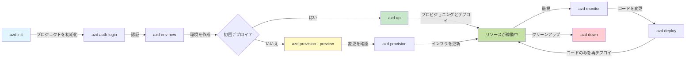
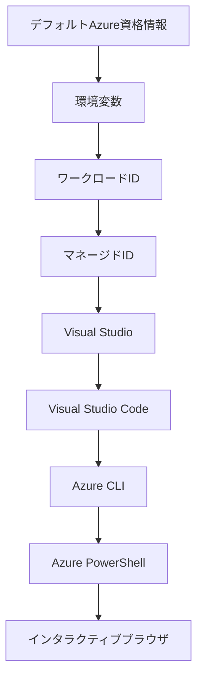

# AZDの基本 - Azure Developer CLIの理解

# AZDの基本 - 核心概念と基礎

**章のナビゲーション:**
- **📚 コースホーム**: [AZD初心者向け](../../README.md)
- **📖 現在の章**: 第1章 - 基礎とクイックスタート
- **⬅️ 前章**: [コース概要](../../README.md#-chapter-1-foundation--quick-start)
- **➡️ 次章**: [インストールとセットアップ](installation.md)
- **🚀 次の章**: [第2章: AIファースト開発](../microsoft-foundry/microsoft-foundry-integration.md)

## はじめに

このレッスンでは、Azure Developer CLI (azd) を紹介します。これは、ローカル開発からAzureへのデプロイを加速する強力なコマンドラインツールです。基本的な概念、主要な機能を学び、azdがクラウドネイティブアプリケーションのデプロイをどのように簡素化するかを理解します。

## 学習目標

このレッスンの終了時には以下を理解できます:
- Azure Developer CLIとは何か、その主な目的
- テンプレート、環境、サービスの基本概念を学ぶ
- テンプレート駆動型開発やInfrastructure as Codeなどの主要機能を探る
- azdプロジェクトの構造とワークフローを理解する
- 開発環境にazdをインストールして設定する準備が整う

## 学習成果

このレッスンを完了すると、以下ができるようになります:
- azdが現代のクラウド開発ワークフローで果たす役割を説明する
- azdプロジェクト構造の構成要素を特定する
- テンプレート、環境、サービスがどのように連携するかを説明する
- azdを使用したInfrastructure as Codeの利点を理解する
- azdコマンドの種類とその目的を認識する

## Azure Developer CLI (azd)とは？

Azure Developer CLI (azd) は、ローカル開発からAzureへのデプロイを加速するために設計されたコマンドラインツールです。クラウドネイティブアプリケーションの構築、デプロイ、管理プロセスを簡素化します。

### 🎯 AZDを使う理由: 実際の比較

簡単なWebアプリとデータベースをデプロイする場合を比較してみましょう:

#### ❌ AZDなし: 手動でAzureにデプロイ (30分以上)

```bash
# ステップ1: リソースグループを作成する
az group create --name myapp-rg --location eastus

# ステップ2: App Serviceプランを作成する
az appservice plan create --name myapp-plan \
  --resource-group myapp-rg \
  --sku B1 --is-linux

# ステップ3: Webアプリを作成する
az webapp create --name myapp-web-unique123 \
  --resource-group myapp-rg \
  --plan myapp-plan \
  --runtime "NODE:18-lts"

# ステップ4: Cosmos DBアカウントを作成する（10～15分）
az cosmosdb create --name myapp-cosmos-unique123 \
  --resource-group myapp-rg \
  --kind MongoDB

# ステップ5: データベースを作成する
az cosmosdb mongodb database create \
  --account-name myapp-cosmos-unique123 \
  --resource-group myapp-rg \
  --name tododb

# ステップ6: コレクションを作成する
az cosmosdb mongodb collection create \
  --account-name myapp-cosmos-unique123 \
  --resource-group myapp-rg \
  --database-name tododb \
  --name todos

# ステップ7: 接続文字列を取得する
CONN_STR=$(az cosmosdb keys list \
  --name myapp-cosmos-unique123 \
  --resource-group myapp-rg \
  --type connection-strings \
  --query "connectionStrings[0].connectionString" -o tsv)

# ステップ8: アプリ設定を構成する
az webapp config appsettings set \
  --name myapp-web-unique123 \
  --resource-group myapp-rg \
  --settings MONGODB_URI="$CONN_STR"

# ステップ9: ログを有効にする
az webapp log config --name myapp-web-unique123 \
  --resource-group myapp-rg \
  --application-logging filesystem \
  --detailed-error-messages true

# ステップ10: Application Insightsを設定する
az monitor app-insights component create \
  --app myapp-insights \
  --location eastus \
  --resource-group myapp-rg

# ステップ11: App InsightsをWebアプリにリンクする
INSTRUMENTATION_KEY=$(az monitor app-insights component show \
  --app myapp-insights \
  --resource-group myapp-rg \
  --query "instrumentationKey" -o tsv)

az webapp config appsettings set \
  --name myapp-web-unique123 \
  --resource-group myapp-rg \
  --settings APPINSIGHTS_INSTRUMENTATIONKEY="$INSTRUMENTATION_KEY"

# ステップ12: アプリケーションをローカルでビルドする
npm install
npm run build

# ステップ13: デプロイメントパッケージを作成する
zip -r app.zip . -x "*.git*" "node_modules/*"

# ステップ14: アプリケーションをデプロイする
az webapp deployment source config-zip \
  --resource-group myapp-rg \
  --name myapp-web-unique123 \
  --src app.zip

# ステップ15: 動作することを祈って待つ 🙏
# （自動検証なし、手動テストが必要）
```

**問題点:**
- ❌ 15以上のコマンドを覚えて実行する必要がある
- ❌ 30～45分の手作業
- ❌ ミスが発生しやすい (タイプミス、間違ったパラメータ)
- ❌ 接続文字列がターミナル履歴に露出する
- ❌ 失敗時の自動ロールバックがない
- ❌ チームメンバーが再現するのが難しい
- ❌ 毎回異なる (再現性がない)

#### ✅ AZDあり: 自動化されたデプロイ (5コマンド、10～15分)

```bash
# ステップ1: テンプレートから初期化
azd init --template todo-nodejs-mongo

# ステップ2: 認証
azd auth login

# ステップ3: 環境を作成
azd env new dev

# ステップ4: 変更をプレビュー (任意だが推奨)
azd provision --preview

# ステップ5: すべてをデプロイ
azd up

# ✨ 完了！すべてがデプロイされ、設定され、監視されています
```

**利点:**
- ✅ **5コマンド** vs. 15以上の手動ステップ
- ✅ **10～15分** (ほとんどAzureの待機時間)
- ✅ **エラーゼロ** - 自動化されテスト済み
- ✅ **秘密情報を安全に管理** - Key Vaultを使用
- ✅ **失敗時の自動ロールバック**
- ✅ **完全再現可能** - 毎回同じ結果
- ✅ **チーム対応** - 誰でも同じコマンドでデプロイ可能
- ✅ **Infrastructure as Code** - バージョン管理されたBicepテンプレート
- ✅ **組み込みモニタリング** - Application Insightsが自動設定

### 📊 時間とエラーの削減

| メトリック | 手動デプロイ | AZDデプロイ | 改善 |
|:-------|:------------------|:---------------|:------------|
| **コマンド数** | 15以上 | 5 | 67%削減 |
| **時間** | 30～45分 | 10～15分 | 60%短縮 |
| **エラー率** | 約40% | <5% | 88%削減 |
| **一貫性** | 低 (手動) | 100% (自動化) | 完璧 |
| **チームオンボーディング** | 2～4時間 | 30分 | 75%短縮 |
| **ロールバック時間** | 30分以上 (手動) | 2分 (自動化) | 93%短縮 |

## 核心概念

### テンプレート
テンプレートはazdの基盤です。以下を含みます:
- **アプリケーションコード** - ソースコードと依存関係
- **インフラ定義** - BicepまたはTerraformで定義されたAzureリソース
- **設定ファイル** - 設定と環境変数
- **デプロイスクリプト** - 自動化されたデプロイワークフロー

### 環境
環境は異なるデプロイターゲットを表します:
- **開発** - テストと開発用
- **ステージング** - 本番前環境
- **本番** - 実際の本番環境

各環境は以下を維持します:
- Azureリソースグループ
- 設定情報
- デプロイ状態

### サービス
サービスはアプリケーションの構成要素です:
- **フロントエンド** - Webアプリケーション、SPA
- **バックエンド** - API、マイクロサービス
- **データベース** - データストレージソリューション
- **ストレージ** - ファイルやBlobストレージ

## 主要機能

### 1. テンプレート駆動型開発
```bash
# 利用可能なテンプレートを閲覧する
azd template list

# テンプレートから初期化する
azd init --template <template-name>
```

### 2. Infrastructure as Code
- **Bicep** - Azureのドメイン固有言語
- **Terraform** - マルチクラウドインフラツール
- **ARMテンプレート** - Azure Resource Managerテンプレート

### 3. 統合ワークフロー
```bash
# 完全なデプロイメントワークフロー
azd up            # プロビジョニング + デプロイ、初回セットアップは手動不要

# 🧪 新機能: デプロイ前にインフラ変更をプレビュー (安全)
azd provision --preview    # インフラデプロイをシミュレートして変更を加えない

azd provision     # インフラを更新する場合はAzureリソースを作成
azd deploy        # アプリケーションコードをデプロイまたは更新後に再デプロイ
azd down          # リソースをクリーンアップ
```

#### 🛡️ 安全なインフラ計画: プレビュー機能
`azd provision --preview` コマンドは安全なデプロイのための画期的な機能です:
- **ドライラン分析** - 作成、変更、削除される内容を表示
- **リスクゼロ** - Azure環境に実際の変更は加えられない
- **チームコラボレーション** - デプロイ前にプレビュー結果を共有
- **コスト見積もり** - コミット前にリソースコストを理解

```bash
# サンプルプレビューのワークフロー
azd provision --preview           # 何が変わるか確認する
# 出力を確認し、チームと議論する
azd provision                     # 自信を持って変更を適用する
```

### 📊 ビジュアル: AZD開発ワークフロー


**ワークフロー説明:**
1. **Init** - テンプレートまたは新しいプロジェクトで開始
2. **Auth** - Azureに認証
3. **Environment** - 分離されたデプロイ環境を作成
4. **Preview** - 🆕 常にインフラ変更をプレビュー (安全な実践)
5. **Provision** - Azureリソースを作成/更新
6. **Deploy** - アプリケーションコードをプッシュ
7. **Monitor** - アプリケーションのパフォーマンスを観察
8. **Iterate** - 変更を加えコードを再デプロイ
9. **Cleanup** - 完了後にリソースを削除

### 4. 環境管理
```bash
# 環境を作成および管理する
azd env new <environment-name>
azd env select <environment-name>
azd env list
```

## 📁 プロジェクト構造

典型的なazdプロジェクト構造:
```
my-app/
├── .azd/                    # azd configuration
│   └── config.json
├── .azure/                  # Azure deployment artifacts
├── .devcontainer/          # Development container config
├── .github/workflows/      # GitHub Actions
├── .vscode/               # VS Code settings
├── infra/                 # Infrastructure code
│   ├── main.bicep        # Main infrastructure template
│   ├── main.parameters.json
│   └── modules/          # Reusable modules
├── src/                  # Application source code
│   ├── api/             # Backend services
│   └── web/             # Frontend application
├── azure.yaml           # azd project configuration
└── README.md
```

## 🔧 設定ファイル

### azure.yaml
メインプロジェクト設定ファイル:
```yaml
name: my-awesome-app
metadata:
  template: my-template@1.0.0

services:
  web:
    project: ./src/web
    language: js
    host: appservice
  api:
    project: ./src/api
    language: js
    host: appservice

hooks:
  preprovision:
    shell: pwsh
    run: echo "Preparing to provision..."
```

### .azure/config.json
環境固有の設定:
```json
{
  "version": 1,
  "defaultEnvironment": "dev",
  "environments": {
    "dev": {
      "subscriptionId": "your-subscription-id",
      "location": "eastus"
    }
  }
}
```

## 🎪 一般的なワークフローと実践演習

> **💡 学習のヒント:** これらの演習を順番に進めることで、AZDスキルを段階的に向上させましょう。

### 🎯 演習1: 初めてのプロジェクトを初期化

**目標:** AZDプロジェクトを作成し、その構造を探る

**手順:**
```bash
# 実績のあるテンプレートを使用する
azd init --template todo-nodejs-mongo

# 生成されたファイルを調べる
ls -la  # 隠しファイルを含むすべてのファイルを表示する

# 作成された主なファイル:
# - azure.yaml (メイン設定)
# - infra/ (インフラコード)
# - src/ (アプリケーションコード)
```

**✅ 成功:** azure.yaml、infra/、src/ディレクトリが作成される

---

### 🎯 演習2: Azureにデプロイ

**目標:** エンドツーエンドのデプロイを完了する

**手順:**
```bash
# 1. 認証する
az login && azd auth login

# 2. 環境を作成する
azd env new dev
azd env set AZURE_LOCATION eastus

# 3. 変更をプレビューする（推奨）
azd provision --preview

# 4. すべてをデプロイする
azd up

# 5. デプロイを確認する
azd show    # アプリのURLを表示する
```

**所要時間:** 10～15分  
**✅ 成功:** アプリケーションURLがブラウザで開く

---

### 🎯 演習3: 複数環境

**目標:** 開発環境とステージング環境にデプロイする

**手順:**
```bash
# すでに開発環境があるので、ステージングを作成する
azd env new staging
azd env set AZURE_LOCATION westus2
azd up

# それらを切り替える
azd env list
azd env select dev
```

**✅ 成功:** Azureポータルに2つの別々のリソースグループが表示される

---

### 🛡️ クリーン状態: `azd down --force --purge`

完全にリセットする必要がある場合:

```bash
azd down --force --purge
```

**実行内容:**
- `--force`: 確認プロンプトなし
- `--purge`: すべてのローカル状態とAzureリソースを削除

**使用する場面:**
- デプロイが途中で失敗した場合
- プロジェクトを切り替える場合
- 新しいスタートが必要な場合

---

## 🎪 オリジナルワークフローの参照

### 新しいプロジェクトの開始
```bash
# 方法1: 既存のテンプレートを使用する
azd init --template todo-nodejs-mongo

# 方法2: ゼロから始める
azd init

# 方法3: 現在のディレクトリを使用する
azd init .
```

### 開発サイクル
```bash
# 開発環境を設定する
azd auth login
azd env new dev
azd env select dev

# すべてをデプロイする
azd up

# 変更を加えて再デプロイする
azd deploy

# 終了時にクリーンアップする
azd down --force --purge # Azure Developer CLI のコマンドは環境の**ハードリセット**です。特に、デプロイの失敗をトラブルシューティングする場合、孤立したリソースをクリーンアップする場合、または新しい再デプロイの準備をする場合に便利です。
```

## `azd down --force --purge` の理解
`azd down --force --purge` コマンドは、azd環境と関連するすべてのリソースを完全に削除する強力な方法です。各フラグの機能を以下に示します:
```
--force
```
- 確認プロンプトをスキップします。
- 手動入力が難しい自動化やスクリプトに便利です。
- CLIが不整合を検出しても中断せずに削除を進めます。

```
--purge
```
**関連するメタデータ**をすべて削除します:
環境状態
ローカル `.azure` フォルダ
キャッシュされたデプロイ情報
以前のデプロイを「記憶」しないようにすることで、リソースグループの不一致や古いレジストリ参照などの問題を防ぎます。

### 両方を使用する理由
`azd up` が残存状態や部分的なデプロイのために壁にぶつかった場合、この組み合わせは**クリーンな状態**を保証します。

特にAzureポータルで手動でリソースを削除した後や、テンプレート、環境、リソースグループの命名規則を切り替える際に役立ちます。

### 複数環境の管理
```bash
# ステージング環境を作成する
azd env new staging
azd env select staging
azd up

# 開発環境に戻る
azd env select dev

# 環境を比較する
azd env list
```

## 🔐 認証と資格情報

認証を理解することは、azdデプロイを成功させるために重要です。Azureは複数の認証方法を使用し、azdは他のAzureツールで使用される同じ資格情報チェーンを活用します。

### Azure CLI認証 (`az login`)

azdを使用する前にAzureに認証する必要があります。最も一般的な方法はAzure CLIを使用することです:

```bash
# インタラクティブログイン（ブラウザを開く）
az login

# 特定のテナントでログイン
az login --tenant <tenant-id>

# サービスプリンシパルでログイン
az login --service-principal -u <app-id> -p <password> --tenant <tenant-id>

# 現在のログイン状態を確認
az account show

# 利用可能なサブスクリプションを一覧表示
az account list --output table

# デフォルトのサブスクリプションを設定
az account set --subscription <subscription-id>
```

### 認証フロー
1. **インタラクティブログイン**: デフォルトのブラウザを開いて認証
2. **デバイスコードフロー**: ブラウザアクセスがない環境向け
3. **サービスプリンシパル**: 自動化やCI/CDシナリオ向け
4. **マネージドID**: Azureホストアプリケーション向け

### DefaultAzureCredentialチェーン

`DefaultAzureCredential` は、特定の順序で複数の資格情報ソースを自動的に試すことで、簡素化された認証体験を提供する資格情報タイプです:

#### 資格情報チェーンの順序

#### 1. 環境変数
```bash
# サービスプリンシパルの環境変数を設定する
export AZURE_CLIENT_ID="<app-id>"
export AZURE_CLIENT_SECRET="<password>"
export AZURE_TENANT_ID="<tenant-id>"
```

#### 2. ワークロードID (Kubernetes/GitHub Actions)
以下で自動的に使用されます:
- Azure Kubernetes Service (AKS) のワークロードID
- GitHub Actions のOIDCフェデレーション
- その他のフェデレーションIDシナリオ

#### 3. マネージドID
Azureリソース向け:
- 仮想マシン
- App Service
- Azure Functions
- コンテナインスタンス

```bash
# AzureリソースでマネージドIDを使用して実行しているか確認する
az account show --query "user.type" --output tsv
# マネージドIDを使用している場合は "servicePrincipal" を返す
```

#### 4. 開発者ツール統合
- **Visual Studio**: サインイン済みアカウントを自動使用
- **VS Code**: Azure Account拡張機能の資格情報を使用
- **Azure CLI**: `az login` 資格情報を使用 (ローカル開発で最も一般的)

### AZD認証設定

```bash
# 方法 1: Azure CLI を使用する (開発に推奨)
az login
azd auth login  # 既存の Azure CLI 資格情報を使用

# 方法 2: 直接 azd 認証
azd auth login --use-device-code  # ヘッドレス環境向け

# 方法 3: 認証ステータスを確認
azd auth login --check-status

# 方法 4: ログアウトして再認証
azd auth logout
azd auth login
```

### 認証のベストプラクティス

#### ローカル開発向け
```bash
# 1. Azure CLIでログイン
az login

# 2. 正しいサブスクリプションを確認
az account show
az account set --subscription "Your Subscription Name"

# 3. 既存の資格情報でazdを使用
azd auth login
```

#### CI/CDパイプライン向け
```yaml
# GitHub Actions example
- name: Azure Login
  uses: azure/login@v1
  with:
    creds: ${{ secrets.AZURE_CREDENTIALS }}

- name: Deploy with azd
  run: |
    azd auth login --client-id ${{ secrets.AZURE_CLIENT_ID }} \
                    --client-secret ${{ secrets.AZURE_CLIENT_SECRET }} \
                    --tenant-id ${{ secrets.AZURE_TENANT_ID }}
    azd up --no-prompt
```

#### 本番環境向け
- Azureリソースで実行する場合は**マネージドID**を使用
- 自動化シナリオでは**サービスプリンシパル**を使用
- コードや設定ファイルに資格情報を保存しない
- **Azure Key Vault** を使用して機密設定を管理

### 一般的な認証問題と解決策

#### 問題: "サブスクリプションが見つかりません"
```bash
# 解決策: デフォルトのサブスクリプションを設定
az account list --output table
az account set --subscription "<subscription-id>"
azd env set AZURE_SUBSCRIPTION_ID "<subscription-id>"
```

#### 問題: "権限が不足しています"
```bash
# 解決策: 必要なロールを確認して割り当てる
az role assignment list --assignee $(az account show --query user.name --output tsv)

# 一般的な必要なロール:
# - 貢献者 (リソース管理用)
# - ユーザーアクセス管理者 (ロール割り当て用)
```

#### 問題: "トークンが期限切れです"
```bash
# 解決策: 再認証
az logout
az login
azd auth logout
azd auth login
```

### シナリオ別認証

#### ローカル開発
```bash
# 個人開発アカウント
az login
azd auth login
```

#### チーム開発
```bash
# 組織のために特定のテナントを使用する
az login --tenant contoso.onmicrosoft.com
azd auth login
```

#### マルチテナントシナリオ
```bash
# テナント間を切り替える
az login --tenant tenant1.onmicrosoft.com
# テナント1にデプロイする
azd up

az login --tenant tenant2.onmicrosoft.com  
# テナント2にデプロイする
azd up
```

### セキュリティの考慮事項

1. **資格情報の保存**: 資格情報をソースコードに保存しない
2. **スコープの制限**: サービスプリンシパルには最小権限の原則を適用
3. **トークンのローテーション**: サービスプリンシパルの秘密情報を定期的にローテーション
4. **監査ログ**: 認証とデプロイ活動を監視
5. **ネットワークセキュリティ**: 可能な場合はプライベートエンドポイントを使用

### 認証のトラブルシューティング

```bash
# 認証の問題をデバッグする
azd auth login --check-status
az account show
az account get-access-token

# 一般的な診断コマンド
whoami                          # 現在のユーザーコンテキスト
az ad signed-in-user show      # Azure AD ユーザーの詳細
az group list                  # リソースアクセスをテストする
```

## `azd down --force --purge` の理解

### 発見
```bash
azd template list              # テンプレートを閲覧する
azd template show <template>   # テンプレートの詳細
azd init --help               # 初期化オプション
```

### プロジェクト管理
```bash
azd show                     # プロジェクト概要
azd env show                 # 現在の環境
azd config list             # 設定構成
```

### モニタリング
```bash
azd monitor                  # Azure ポータルを開く
azd pipeline config          # CI/CD を設定する
azd logs                     # アプリケーションログを表示する
```

## ベストプラクティス

### 1. 意味のある名前を使用
```bash
# 良い
azd env new production-east
azd init --template web-app-secure

# 避ける
azd env new env1
azd init --template template1
```

### 2. テンプレートを活用
- 既存のテンプレートから開始
- ニーズに合わせてカスタマイズ
- 組織向けの再利用可能なテンプレートを作成

### 3. 環境の分離
- 開発/ステージング/本番用に別々の環境を使用
- ローカルマシンから直接本番にデプロイしない
- 本番デプロイにはCI/CDパイプラインを使用

### 4. 設定管理
- 機密データには環境変数を使用
- 設定をバージョン管理に保存
- 環境固有の設定を文書化

## 学習の進行

### 初心者 (1～2週目)
1. azdをインストールして認証
2. シンプルなテンプレートをデプロイ
3. プロジェクト構造を理解
4. 基本コマンド (up, down, deploy) を学ぶ

### 中級者 (3～4週目)
1. テンプレートをカスタマイズ
2. 複数環境を管理
3. インフラコードを理解
4. CI/CDパイプラインを設定

### 上級者 (5週目以降)
1. カスタム
- [インストールとセットアップ](installation.md) - azdのインストールと設定
- [初めてのプロジェクト](first-project.md) - 実践的なチュートリアル
- [設定ガイド](configuration.md) - 高度な設定オプション

**🎯 次の章に進む準備はできましたか？**
- [第2章: AIファースト開発](../microsoft-foundry/microsoft-foundry-integration.md) - AIアプリケーションの構築を開始

## 追加リソース

- [Azure Developer CLI 概要](https://learn.microsoft.com/en-us/azure/developer/azure-developer-cli/)
- [テンプレートギャラリー](https://azure.github.io/awesome-azd/)
- [コミュニティサンプル](https://github.com/Azure-Samples)

---

## 🙋 よくある質問

### 一般的な質問

**Q: AZDとAzure CLIの違いは何ですか？**

A: Azure CLI (`az`)は個々のAzureリソースを管理するためのものです。AZD (`azd`)はアプリケーション全体を管理するためのものです：

```bash
# Azure CLI - 低レベルのリソース管理
az webapp create --name myapp --resource-group rg
az sql server create --name myserver --resource-group rg
# ...さらに多くのコマンドが必要

# AZD - アプリケーションレベルの管理
azd up  # すべてのリソースを含むアプリ全体をデプロイ
```

**こう考えてください:**
- `az` = 個々のレゴブロックを操作する
- `azd` = 完成したレゴセットで作業する

---

**Q: AZDを使うためにBicepやTerraformを知っている必要がありますか？**

A: いいえ！テンプレートから始めましょう：
```bash
# 既存のテンプレートを使用 - IaCの知識は不要
azd init --template todo-nodejs-mongo
azd up
```

インフラをカスタマイズするために後でBicepを学ぶことができます。テンプレートは学ぶための実例を提供します。

---

**Q: AZDテンプレートを実行するのにどれくらいの費用がかかりますか？**

A: テンプレートによって費用は異なります。ほとんどの開発テンプレートは月額50〜150ドルです：

```bash
# デプロイする前にコストをプレビューする
azd provision --preview

# 使用しないときは必ずクリーンアップする
azd down --force --purge  # すべてのリソースを削除する
```

**プロのヒント:** 無料プランを利用できる場合は活用しましょう：
- App Service: F1（無料）プラン
- Azure OpenAI: 月50,000トークン無料
- Cosmos DB: 1000 RU/s無料プラン

---

**Q: 既存のAzureリソースでAZDを使用できますか？**

A: はい、ただし新規で始める方が簡単です。AZDはライフサイクル全体を管理する場合に最適です。既存のリソースを使用する場合：

```bash
# オプション1: 既存のリソースをインポートする（上級者向け）
azd init
# 次に、infra/を変更して既存のリソースを参照する

# オプション2: 新規作成（推奨）
azd init --template matching-your-stack
azd up  # 新しい環境を作成する
```

---

**Q: プロジェクトをチームメイトと共有するにはどうすればいいですか？**

A: AZDプロジェクトをGitにコミットします（ただし、.azureフォルダーは除外してください）：

```bash
# デフォルトで .gitignore に既に含まれています
.azure/        # 秘密情報と環境データを含みます
*.env          # 環境変数

# チームメンバーは次の通り:
git clone <your-repo>
azd auth login
azd env new <their-name>-dev
azd up
```

全員が同じテンプレートから同一のインフラを取得できます。

---

### トラブルシューティングの質問

**Q: "azd up"が途中で失敗しました。どうすればいいですか？**

A: エラーを確認し、修正して再試行してください：

```bash
# 詳細なログを表示
azd show

# 一般的な修正方法:

# 1. クォータが超過した場合:
azd env set AZURE_LOCATION "westus2"  # 別のリージョンを試す

# 2. リソース名の競合がある場合:
azd down --force --purge  # 初期化する
azd up  # 再試行する

# 3. 認証が期限切れの場合:
az login
azd auth login
azd up
```

**最も一般的な問題:** 選択したAzureサブスクリプションが間違っている
```bash
az account list --output table
az account set --subscription "<correct-subscription>"
```

---

**Q: インフラを再プロビジョニングせずにコード変更だけをデプロイするにはどうすればいいですか？**

A: `azd up`ではなく`azd deploy`を使用してください：

```bash
azd up          # 初回: プロビジョニング + デプロイ (遅い)

# コードを変更する...

azd deploy      # 2回目以降: デプロイのみ (速い)
```

速度比較：
- `azd up`: 10〜15分（インフラをプロビジョニング）
- `azd deploy`: 2〜5分（コードのみ）

---

**Q: インフラテンプレートをカスタマイズできますか？**

A: はい！`infra/`内のBicepファイルを編集してください：

```bash
# azd initの後
cd infra/
code main.bicep  # VS Codeで編集

# 変更をプレビュー
azd provision --preview

# 変更を適用
azd provision
```

**ヒント:** 小さな変更から始めましょう - まずSKUを変更：
```bicep
// infra/main.bicep
sku: {
  name: 'B1'  // Change to 'P1V2' for production
}
```

---

**Q: AZDが作成したすべてを削除するにはどうすればいいですか？**

A: 1つのコマンドですべてのリソースを削除できます：

```bash
azd down --force --purge

# これを削除します:
# - すべてのAzureリソース
# - リソースグループ
# - ローカル環境の状態
# - キャッシュされたデプロイメントデータ
```

**以下の場合は必ず実行してください:**
- テンプレートのテストが終了したとき
- 別のプロジェクトに切り替えるとき
- 新規で始めたいとき

**コスト削減:** 未使用のリソースを削除 = $0の請求

---

**Q: Azureポータルでリソースを誤って削除してしまった場合はどうすればいいですか？**

A: AZDの状態が同期されなくなる可能性があります。クリーンスレートアプローチ：

```bash
# 1. ローカル状態を削除する
azd down --force --purge

# 2. 新しく開始する
azd up

# 代替案: AZDに検出と修正を任せる
azd provision  # 欠落しているリソースを作成する
```

---

### 高度な質問

**Q: CI/CDパイプラインでAZDを使用できますか？**

A: はい！GitHub Actionsの例：

```yaml
# .github/workflows/deploy.yml
name: Deploy with AZD

on:
  push:
    branches: [main]

jobs:
  deploy:
    runs-on: ubuntu-latest
    steps:
      - uses: actions/checkout@v2
      
      - name: Install azd
        run: curl -fsSL https://aka.ms/install-azd.sh | bash
      
      - name: Azure Login
        run: |
          azd auth login \
            --client-id ${{ secrets.AZURE_CLIENT_ID }} \
            --client-secret ${{ secrets.AZURE_CLIENT_SECRET }} \
            --tenant-id ${{ secrets.AZURE_TENANT_ID }}
      
      - name: Deploy
        run: azd up --no-prompt
```

---

**Q: 秘密情報や機密データをどのように扱いますか？**

A: AZDはAzure Key Vaultと自動的に統合されます：

```bash
# 秘密はコードではなくKey Vaultに保存されます
azd env set DATABASE_PASSWORD "$(openssl rand -base64 32)"

# AZDは自動的に:
# 1. Key Vaultを作成します
# 2. 秘密を保存します
# 3. マネージドIDを介してアプリにアクセス権を付与します
# 4. 実行時に注入します
```

**絶対にコミットしないでください:**
- `.azure/`フォルダー（環境データを含む）
- `.env`ファイル（ローカルの秘密情報）
- 接続文字列

---

**Q: 複数のリージョンにデプロイできますか？**

A: はい、リージョンごとに環境を作成してください：

```bash
# 東米国環境
azd env new prod-eastus
azd env set AZURE_LOCATION eastus
azd up

# 西ヨーロッパ環境
azd env new prod-westeurope
azd env set AZURE_LOCATION westeurope
azd up

# 各環境は独立している
azd env list
```

真のマルチリージョンアプリの場合、Bicepテンプレートをカスタマイズして複数のリージョンに同時にデプロイします。

---

**Q: 困ったときにどこで助けを得られますか？**

1. **AZDドキュメント:** https://learn.microsoft.com/azure/developer/azure-developer-cli/
2. **GitHub Issues:** https://github.com/Azure/azure-dev/issues
3. **Discord:** [Azure Discord](https://discord.gg/microsoft-azure) - #azure-developer-cli チャンネル
4. **Stack Overflow:** タグ `azure-developer-cli`
5. **このコース:** [トラブルシューティングガイド](../troubleshooting/common-issues.md)

**プロのヒント:** 質問する前に以下を実行してください：
```bash
azd show       # 現在の状態を表示します
azd version    # あなたのバージョンを表示します
```
質問にこの情報を含めると、より迅速に助けを得られます。

---

## 🎓 次は何をする？

AZDの基本を理解しました。次のステップを選びましょう：

### 🎯 初心者向け:
1. **次:** [インストールとセットアップ](installation.md) - AZDをマシンにインストール
2. **その後:** [初めてのプロジェクト](first-project.md) - 初めてのアプリをデプロイ
3. **練習:** このレッスンのすべての演習を完了

### 🚀 AI開発者向け:
1. **スキップ:** [第2章: AIファースト開発](../microsoft-foundry/microsoft-foundry-integration.md)
2. **デプロイ:** `azd init --template get-started-with-ai-chat`から始める
3. **学習:** デプロイしながら構築

### 🏗️ 経験豊富な開発者向け:
1. **レビュー:** [設定ガイド](configuration.md) - 高度な設定
2. **探索:** [コードとしてのインフラ](../deployment/provisioning.md) - Bicepの詳細
3. **構築:** 自分のスタック用のカスタムテンプレートを作成

---

**章のナビゲーション:**
- **📚 コースホーム**: [AZD初心者向け](../../README.md)
- **📖 現在の章**: 第1章 - 基礎とクイックスタート  
- **⬅️ 前へ**: [コース概要](../../README.md#-chapter-1-foundation--quick-start)
- **➡️ 次へ**: [インストールとセットアップ](installation.md)
- **🚀 次の章**: [第2章: AIファースト開発](../microsoft-foundry/microsoft-foundry-integration.md)

---

<!-- CO-OP TRANSLATOR DISCLAIMER START -->
**免責事項**:  
この文書は、AI翻訳サービス[Co-op Translator](https://github.com/Azure/co-op-translator)を使用して翻訳されています。正確性を期すよう努めておりますが、自動翻訳には誤りや不正確さが含まれる可能性があります。原文（元の言語で記載された文書）を公式な情報源としてご参照ください。重要な情報については、専門の人間による翻訳をお勧めします。本翻訳の使用に起因する誤解や誤認について、当方は一切の責任を負いかねます。
<!-- CO-OP TRANSLATOR DISCLAIMER END -->