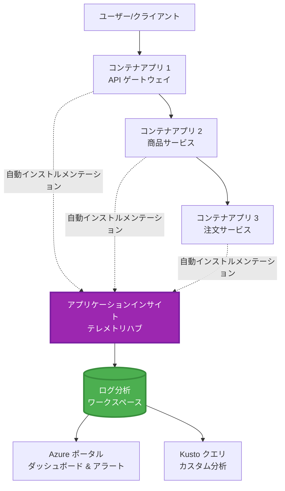
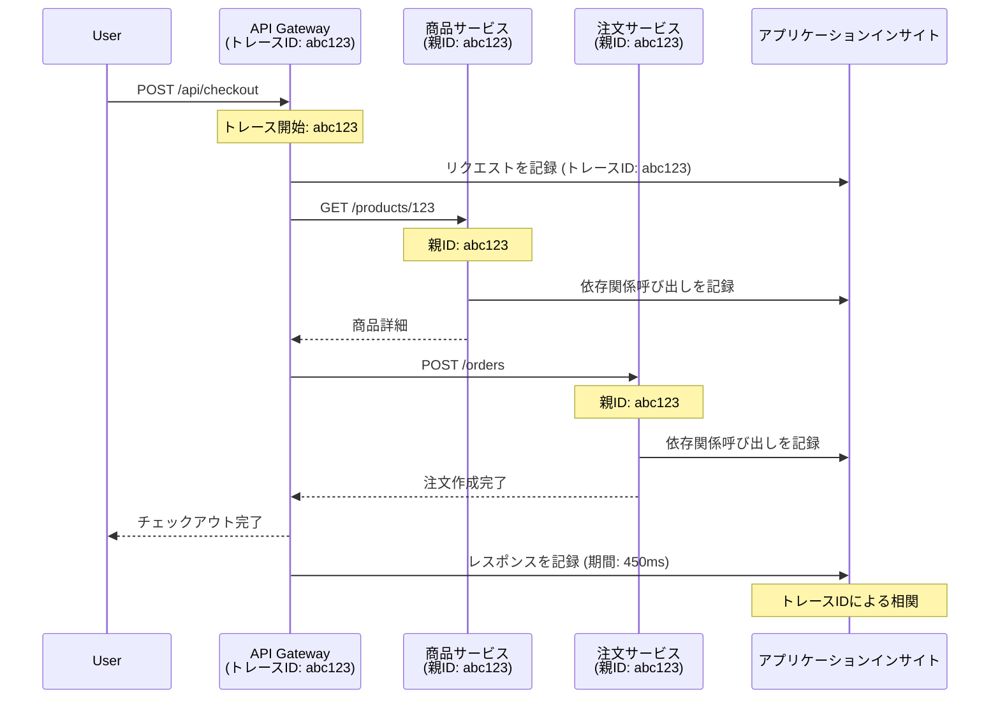

# AZDとのApplication Insights統合

⏱️ **所要時間の目安**: 40～50分 | 💰 **コスト影響**: 約$5～15/月 | ⭐ **難易度**: 中級

**📚 学習パス:**
- ← 前: [事前チェック](preflight-checks.md) - デプロイ前の検証
- 🎯 **現在地**: Application Insights統合 (モニタリング、テレメトリ、デバッグ)
- → 次: [デプロイガイド](../deployment/deployment-guide.md) - Azureへのデプロイ
- 🏠 [コースホーム](../../README.md)

---

## 学べること

このレッスンを完了することで以下を学べます:
- **Application Insights**をAZDプロジェクトに自動統合
- マイクロサービスの**分散トレーシング**を設定
- **カスタムテレメトリ** (メトリクス、イベント、依存関係) を実装
- **ライブメトリクス**を設定してリアルタイムモニタリングを実現
- AZDデプロイから**アラートとダッシュボード**を作成
- **テレメトリクエリ**を使用して本番環境の問題をデバッグ
- **コストとサンプリング**戦略を最適化
- **AI/LLMアプリケーション** (トークン、遅延、コスト) をモニタリング

## AZDでのApplication Insightsの重要性

### 課題: 本番環境の可観測性

**Application Insightsがない場合:**
```
❌ No visibility into production behavior
❌ Manual log aggregation across services
❌ Reactive debugging (wait for customer complaints)
❌ No performance metrics
❌ Cannot trace requests across services
❌ Unknown failure rates and bottlenecks
```

**Application Insights + AZDがある場合:**
```
✅ Automatic telemetry collection
✅ Centralized logs from all services
✅ Proactive issue detection
✅ End-to-end request tracing
✅ Performance metrics and insights
✅ Real-time dashboards
✅ AZD provisions everything automatically
```

**例え**: Application Insightsは、アプリケーションの「ブラックボックスフライトレコーダー」+「コックピットダッシュボード」のようなものです。リアルタイムで何が起きているかを把握し、どんなインシデントも再現できます。

---

## アーキテクチャ概要

### AZDアーキテクチャにおけるApplication Insights


### 自動的にモニタリングされる内容

| テレメトリタイプ | 収集内容 | ユースケース |
|----------------|----------|--------------|
| **リクエスト** | HTTPリクエスト、ステータスコード、処理時間 | APIパフォーマンスモニタリング |
| **依存関係** | 外部呼び出し (DB、API、ストレージ) | ボトルネックの特定 |
| **例外** | スタックトレース付きの未処理エラー | 障害のデバッグ |
| **カスタムイベント** | ビジネスイベント (サインアップ、購入) | 分析とファネル |
| **メトリクス** | パフォーマンスカウンター、カスタムメトリクス | キャパシティプランニング |
| **トレース** | 深刻度付きのログメッセージ | デバッグと監査 |
| **可用性** | 稼働時間と応答時間テスト | SLAモニタリング |

---

## 前提条件

### 必要なツール

```bash
# Azure Developer CLI を確認する
azd version
# ✅ 期待値: azd バージョン 1.0.0 以上

# Azure CLI を確認する
az --version
# ✅ 期待値: azure-cli 2.50.0 以上
```

### Azureの要件

- 有効なAzureサブスクリプション
- 以下を作成する権限:
  - Application Insightsリソース
  - Log Analyticsワークスペース
  - コンテナアプリ
  - リソースグループ

### 知識の前提条件

以下を完了している必要があります:
- [AZDの基本](../getting-started/azd-basics.md) - AZDの基本概念
- [設定](../getting-started/configuration.md) - 環境セットアップ
- [最初のプロジェクト](../getting-started/first-project.md) - 基本的なデプロイ

---

## レッスン1: AZDによるApplication Insightsの自動設定

### AZDがApplication Insightsをプロビジョニングする方法

AZDはデプロイ時にApplication Insightsを自動的に作成・設定します。その仕組みを見てみましょう。

### プロジェクト構造

```
monitored-app/
├── azure.yaml                     # AZD configuration
├── infra/
│   ├── main.bicep                # Main infrastructure
│   ├── core/
│   │   └── monitoring.bicep      # Application Insights + Log Analytics
│   └── app/
│       └── api.bicep             # Container App with monitoring
└── src/
    ├── app.py                    # Application with telemetry
    ├── requirements.txt
    └── Dockerfile
```

---

### ステップ1: AZDの設定 (azure.yaml)

**ファイル: `azure.yaml`**

```yaml
name: monitored-app
metadata:
  template: monitored-app@1.0.0

services:
  api:
    project: ./src
    language: python
    host: containerapp

# AZD automatically provisions monitoring!
```

**これで完了！** AZDはデフォルトでApplication Insightsを作成します。基本的なモニタリングには追加設定は不要です。

---

### ステップ2: モニタリングインフラストラクチャ (Bicep)

**ファイル: `infra/core/monitoring.bicep`**

```bicep
param logAnalyticsName string
param applicationInsightsName string
param location string = resourceGroup().location
param tags object = {}

// Log Analytics Workspace (required for Application Insights)
resource logAnalytics 'Microsoft.OperationalInsights/workspaces@2022-10-01' = {
  name: logAnalyticsName
  location: location
  tags: tags
  properties: {
    sku: {
      name: 'PerGB2018'  // Pay-as-you-go pricing
    }
    retentionInDays: 30  // Keep logs for 30 days
    features: {
      enableLogAccessUsingOnlyResourcePermissions: true
    }
  }
}

// Application Insights
resource applicationInsights 'Microsoft.Insights/components@2020-02-02' = {
  name: applicationInsightsName
  location: location
  tags: tags
  kind: 'web'
  properties: {
    Application_Type: 'web'
    WorkspaceResourceId: logAnalytics.id
    IngestionMode: 'LogAnalytics'
    publicNetworkAccessForIngestion: 'Enabled'
    publicNetworkAccessForQuery: 'Enabled'
  }
}

// Outputs for Container Apps
output logAnalyticsWorkspaceId string = logAnalytics.id
output logAnalyticsWorkspaceName string = logAnalytics.name
output applicationInsightsConnectionString string = applicationInsights.properties.ConnectionString
output applicationInsightsInstrumentationKey string = applicationInsights.properties.InstrumentationKey
output applicationInsightsName string = applicationInsights.name
```

---

### ステップ3: コンテナアプリをApplication Insightsに接続

**ファイル: `infra/app/api.bicep`**

```bicep
param name string
param location string
param tags object = {}
param containerAppsEnvironmentName string
param applicationInsightsConnectionString string

resource containerApp 'Microsoft.App/containerApps@2023-05-01' = {
  name: name
  location: location
  tags: tags
  properties: {
    configuration: {
      ingress: {
        external: true
        targetPort: 8000
      }
      secrets: [
        {
          name: 'appinsights-connection-string'
          value: applicationInsightsConnectionString
        }
      ]
    }
    template: {
      containers: [
        {
          name: 'api'
          image: 'myregistry.azurecr.io/api:latest'
          resources: {
            cpu: json('0.5')
            memory: '1Gi'
          }
          env: [
            {
              name: 'APPLICATIONINSIGHTS_CONNECTION_STRING'
              secretRef: 'appinsights-connection-string'
            }
            {
              name: 'APPLICATIONINSIGHTS_ENABLED'
              value: 'true'
            }
          ]
        }
      ]
    }
  }
}

output uri string = 'https://${containerApp.properties.configuration.ingress.fqdn}'
```

---

### ステップ4: テレメトリを含むアプリケーションコード

**ファイル: `src/app.py`**

```python
from flask import Flask, request, jsonify
from opencensus.ext.azure.log_exporter import AzureLogHandler
from opencensus.ext.azure.trace_exporter import AzureExporter
from opencensus.ext.flask.flask_middleware import FlaskMiddleware
from opencensus.trace.samplers import ProbabilitySampler
import logging
import os

app = Flask(__name__)

# Application Insights の接続文字列を取得する
connection_string = os.environ.get('APPLICATIONINSIGHTS_CONNECTION_STRING')

if connection_string:
    # 分散トレーシングを構成する
    middleware = FlaskMiddleware(
        app,
        exporter=AzureExporter(connection_string=connection_string),
        sampler=ProbabilitySampler(rate=1.0)  # 開発環境では 100% サンプリング
    )
    
    # ロギングを構成する
    logger = logging.getLogger(__name__)
    logger.addHandler(AzureLogHandler(connection_string=connection_string))
    logger.setLevel(logging.INFO)
    
    print("✅ Application Insights enabled")
else:
    logger = logging.getLogger(__name__)
    logger.setLevel(logging.INFO)
    print("⚠️ Application Insights not configured")

@app.route('/health')
def health():
    logger.info('Health check endpoint called')
    return jsonify({'status': 'healthy', 'monitoring': 'enabled'})

@app.route('/api/products')
def get_products():
    logger.info('Fetching products')
    
    # データベース呼び出しをシミュレートする（依存関係として自動的に追跡される）
    products = [
        {'id': 1, 'name': 'Laptop', 'price': 999.99},
        {'id': 2, 'name': 'Mouse', 'price': 29.99},
        {'id': 3, 'name': 'Keyboard', 'price': 79.99}
    ]
    
    logger.info(f'Returned {len(products)} products')
    return jsonify(products)

@app.route('/api/error-test')
def error_test():
    """Test error tracking"""
    logger.error('Testing error tracking')
    try:
        raise ValueError('This is a test exception')
    except Exception as e:
        logger.exception('Exception occurred in error-test endpoint')
        return jsonify({'error': str(e)}), 500

@app.route('/api/slow')
def slow_endpoint():
    """Test performance tracking"""
    import time
    logger.info('Slow endpoint called')
    time.sleep(3)  # 遅い操作をシミュレートする
    logger.warning('Endpoint took 3 seconds to respond')
    return jsonify({'message': 'Slow operation completed'})

if __name__ == '__main__':
    app.run(host='0.0.0.0', port=8000)
```

**ファイル: `src/requirements.txt`**

```txt
Flask==3.0.0
opencensus-ext-azure==1.1.13
opencensus-ext-flask==0.8.1
gunicorn==21.2.0
```

---

### ステップ5: デプロイと検証

```bash
# AZDを初期化する
azd init

# デプロイする（Application Insightsを自動的にプロビジョニング）
azd up

# アプリのURLを取得する
APP_URL=$(azd env get-values | grep API_URL | cut -d '=' -f2 | tr -d '"')

# テレメトリを生成する
curl $APP_URL/health
curl $APP_URL/api/products
curl $APP_URL/api/error-test
curl $APP_URL/api/slow
```

**✅ 期待される出力:**
```json
{
  "status": "healthy",
  "monitoring": "enabled"
}
```

---

### ステップ6: Azureポータルでテレメトリを確認

```bash
# アプリケーションインサイトの詳細を取得する
azd env get-values | grep APPLICATIONINSIGHTS

# Azureポータルで開く
az monitor app-insights component show \
  --app $(azd env get-values | grep APPLICATIONINSIGHTS_NAME | cut -d '=' -f2 | tr -d '"') \
  --resource-group $(azd env get-values | grep AZURE_RESOURCE_GROUP | cut -d '=' -f2 | tr -d '"') \
  --query "appId" -o tsv
```

**Azureポータル → Application Insights → トランザクション検索** に移動

以下が表示されるはずです:
- ✅ ステータスコード付きのHTTPリクエスト
- ✅ リクエストの処理時間 (`/api/slow`で3秒以上)
- ✅ `/api/error-test`からの例外詳細
- ✅ カスタムログメッセージ

---

## レッスン2: カスタムテレメトリとイベント

### ビジネスイベントの追跡

ビジネス上重要なイベントのカスタムテレメトリを追加してみましょう。

**ファイル: `src/telemetry.py`**

```python
from opencensus.ext.azure import metrics_exporter
from opencensus.stats import aggregation as aggregation_module
from opencensus.stats import measure as measure_module
from opencensus.stats import stats as stats_module
from opencensus.stats import view as view_module
from opencensus.tags import tag_map as tag_map_module
from opencensus.ext.azure.log_exporter import AzureLogHandler
from opencensus.ext.azure.trace_exporter import AzureExporter
from opencensus.trace import tracer as tracer_module
import logging
import os

class TelemetryClient:
    """Custom telemetry client for Application Insights"""
    
    def __init__(self, connection_string=None):
        self.connection_string = connection_string or os.environ.get('APPLICATIONINSIGHTS_CONNECTION_STRING')
        
        if not self.connection_string:
            print("⚠️ Application Insights connection string not found")
            return
        
        # ロガーを設定する
        self.logger = logging.getLogger(__name__)
        self.logger.addHandler(AzureLogHandler(connection_string=self.connection_string))
        self.logger.setLevel(logging.INFO)
        
        # メトリクスエクスポーターを設定する
        self.stats = stats_module.stats
        self.view_manager = self.stats.view_manager
        self.stats_recorder = self.stats.stats_recorder
        
        exporter = metrics_exporter.new_metrics_exporter(
            connection_string=self.connection_string
        )
        self.view_manager.register_exporter(exporter)
        
        # トレーサーを設定する
        self.tracer = tracer_module.Tracer(
            exporter=AzureExporter(connection_string=self.connection_string)
        )
        
        print("✅ Custom telemetry client initialized")
    
    def track_event(self, event_name: str, properties: dict = None):
        """Track custom business event"""
        properties = properties or {}
        self.logger.info(
            f"CustomEvent: {event_name}",
            extra={
                'custom_dimensions': {
                    'event_name': event_name,
                    **properties
                }
            }
        )
    
    def track_metric(self, metric_name: str, value: float, properties: dict = None):
        """Track custom metric"""
        properties = properties or {}
        self.logger.info(
            f"CustomMetric: {metric_name} = {value}",
            extra={
                'custom_dimensions': {
                    'metric_name': metric_name,
                    'value': value,
                    **properties
                }
            }
        )
    
    def track_dependency(self, name: str, dependency_type: str, duration: float, success: bool):
        """Track external dependency call"""
        with self.tracer.span(name=name) as span:
            span.add_attribute('dependency.type', dependency_type)
            span.add_attribute('duration', duration)
            span.add_attribute('success', success)

# グローバルテレメトリークライアント
telemetry = TelemetryClient()
```

### カスタムイベントを含むアプリケーションの更新

**ファイル: `src/app.py` (拡張版)**

```python
from flask import Flask, request, jsonify
from telemetry import telemetry
import time
import random

app = Flask(__name__)

@app.route('/api/purchase', methods=['POST'])
def purchase():
    """Track purchase event with custom telemetry"""
    data = request.json
    product_id = data.get('product_id')
    quantity = data.get('quantity', 1)
    price = data.get('price', 0)
    
    # ビジネスイベントを追跡
    telemetry.track_event('Purchase', {
        'product_id': product_id,
        'quantity': quantity,
        'total_amount': price * quantity,
        'user_id': request.headers.get('X-User-Id', 'anonymous')
    })
    
    # 収益指標を追跡
    telemetry.track_metric('Revenue', price * quantity, {
        'product_id': product_id,
        'currency': 'USD'
    })
    
    return jsonify({
        'order_id': f'ORD-{random.randint(1000, 9999)}',
        'status': 'confirmed',
        'total': price * quantity
    })

@app.route('/api/search')
def search():
    """Track search queries"""
    query = request.args.get('q', '')
    
    start_time = time.time()
    
    # 検索をシミュレート（実際のデータベースクエリになる）
    results = [{'id': 1, 'name': f'Result for {query}'}]
    
    duration = (time.time() - start_time) * 1000  # ミリ秒に変換
    
    # 検索イベントを追跡
    telemetry.track_event('Search', {
        'query': query,
        'results_count': len(results),
        'duration_ms': duration
    })
    
    # 検索パフォーマンス指標を追跡
    telemetry.track_metric('SearchDuration', duration, {
        'query_length': len(query)
    })
    
    return jsonify({'results': results, 'count': len(results)})

@app.route('/api/external-call')
def external_call():
    """Track external API dependency"""
    import requests
    
    start_time = time.time()
    success = True
    
    try:
        # 外部API呼び出しをシミュレート
        response = requests.get('https://api.example.com/data', timeout=5)
        result = response.json()
    except Exception as e:
        success = False
        result = {'error': str(e)}
    
    duration = (time.time() - start_time) * 1000
    
    # 依存関係を追跡
    telemetry.track_dependency(
        name='ExternalAPI',
        dependency_type='HTTP',
        duration=duration,
        success=success
    )
    
    return jsonify(result)

if __name__ == '__main__':
    app.run(host='0.0.0.0', port=8000)
```

### カスタムテレメトリのテスト

```bash
# 購入イベントを追跡する
curl -X POST $APP_URL/api/purchase \
  -H "Content-Type: application/json" \
  -H "X-User-Id: user123" \
  -d '{"product_id": 1, "quantity": 2, "price": 29.99}'

# 検索イベントを追跡する
curl "$APP_URL/api/search?q=laptop"

# 外部依存関係を追跡する
curl $APP_URL/api/external-call
```

**Azureポータルで確認:**

Application Insights → ログに移動し、以下を実行:

```kusto
// View purchase events
traces
| where customDimensions.event_name == "Purchase"
| project 
    timestamp,
    product_id = tostring(customDimensions.product_id),
    total_amount = todouble(customDimensions.total_amount),
    user_id = tostring(customDimensions.user_id)
| order by timestamp desc

// View revenue metrics
traces
| where customDimensions.metric_name == "Revenue"
| summarize TotalRevenue = sum(todouble(customDimensions.value)) by bin(timestamp, 1h)
| render timechart

// View search performance
traces
| where customDimensions.event_name == "Search"
| summarize 
    AvgDuration = avg(todouble(customDimensions.duration_ms)),
    SearchCount = count()
  by bin(timestamp, 5m)
| render timechart
```

---

## レッスン3: マイクロサービスの分散トレーシング

### クロスサービストレーシングの有効化

マイクロサービスの場合、Application Insightsはサービス間のリクエストを自動的に関連付けます。

**ファイル: `infra/main.bicep`**

```bicep
targetScope = 'subscription'

param environmentName string
param location string = 'eastus'

var tags = { 'azd-env-name': environmentName }

resource rg 'Microsoft.Resources/resourceGroups@2021-04-01' = {
  name: 'rg-${environmentName}'
  location: location
  tags: tags
}

// Monitoring (shared by all services)
module monitoring './core/monitoring.bicep' = {
  name: 'monitoring'
  scope: rg
  params: {
    logAnalyticsName: 'log-${environmentName}'
    applicationInsightsName: 'appi-${environmentName}'
    location: location
    tags: tags
  }
}

// API Gateway
module apiGateway './app/api-gateway.bicep' = {
  name: 'api-gateway'
  scope: rg
  params: {
    name: 'ca-gateway-${environmentName}'
    location: location
    tags: union(tags, { 'azd-service-name': 'gateway' })
    applicationInsightsConnectionString: monitoring.outputs.applicationInsightsConnectionString
  }
}

// Product Service
module productService './app/product-service.bicep' = {
  name: 'product-service'
  scope: rg
  params: {
    name: 'ca-products-${environmentName}'
    location: location
    tags: union(tags, { 'azd-service-name': 'products' })
    applicationInsightsConnectionString: monitoring.outputs.applicationInsightsConnectionString
  }
}

// Order Service
module orderService './app/order-service.bicep' = {
  name: 'order-service'
  scope: rg
  params: {
    name: 'ca-orders-${environmentName}'
    location: location
    tags: union(tags, { 'azd-service-name': 'orders' })
    applicationInsightsConnectionString: monitoring.outputs.applicationInsightsConnectionString
  }
}

output APPLICATIONINSIGHTS_CONNECTION_STRING string = monitoring.outputs.applicationInsightsConnectionString
output GATEWAY_URL string = apiGateway.outputs.uri
```

### エンドツーエンドトランザクションの確認


**エンドツーエンドトレースのクエリ:**

```kusto
// Find complete request flow
let traceId = "abc123...";  // Get from response header
dependencies
| union requests
| where operation_Id == traceId
| project 
    timestamp,
    type = itemType,
    name,
    duration,
    success,
    cloud_RoleName
| order by timestamp asc
```

---

## レッスン4: ライブメトリクスとリアルタイムモニタリング

### ライブメトリクスストリームの有効化

ライブメトリクスは、1秒未満の遅延でリアルタイムテレメトリを提供します。

**ライブメトリクスへのアクセス:**

```bash
# アプリケーションインサイトリソースを取得する
APPI_NAME=$(azd env get-values | grep APPLICATIONINSIGHTS_NAME | cut -d '=' -f2 | tr -d '"')

# リソースグループを取得する
RG_NAME=$(azd env get-values | grep AZURE_RESOURCE_GROUP | cut -d '=' -f2 | tr -d '"')

echo "Navigate to: Azure Portal → Resource Groups → $RG_NAME → $APPI_NAME → Live Metrics"
```

**リアルタイムで確認できる内容:**
- ✅ リクエスト到着率 (リクエスト/秒)
- ✅ 外部依存関係の呼び出し
- ✅ 例外数
- ✅ CPUとメモリ使用率
- ✅ アクティブサーバー数
- ✅ サンプルテレメトリ

### テスト用の負荷生成

```bash
# ライブメトリクスを確認するために負荷を生成する
for i in {1..100}; do
  curl $APP_URL/api/products &
  curl $APP_URL/api/search?q=test$i &
done

# Azureポータルでライブメトリクスを確認する
# リクエスト率の急上昇が見えるはずです
```

---

## 実践演習

### 演習1: アラートの設定 ⭐⭐ (中級)

**目標**: 高いエラー率や遅い応答に対するアラートを作成

**手順:**

1. **エラー率のアラートを作成:**

```bash
# アプリケーションインサイトのリソースIDを取得する
APPI_ID=$(az monitor app-insights component show \
  --app $APPI_NAME \
  --resource-group $RG_NAME \
  --query "id" -o tsv)

# 失敗したリクエストのメトリックアラートを作成する
az monitor metrics alert create \
  --name "High-Error-Rate" \
  --resource-group $RG_NAME \
  --scopes $APPI_ID \
  --condition "count requests/failed > 10" \
  --window-size 5m \
  --evaluation-frequency 1m \
  --description "Alert when error rate exceeds 10 per 5 minutes"
```

2. **遅い応答のアラートを作成:**

```bash
az monitor metrics alert create \
  --name "Slow-Responses" \
  --resource-group $RG_NAME \
  --scopes $APPI_ID \
  --condition "avg requests/duration > 3000" \
  --window-size 5m \
  --evaluation-frequency 1m \
  --description "Alert when average response time exceeds 3 seconds"
```

3. **Bicepを使用してアラートを作成 (AZD向け推奨):**

**ファイル: `infra/core/alerts.bicep`**

```bicep
param applicationInsightsId string
param actionGroupId string = ''
param location string = resourceGroup().location

// High error rate alert
resource errorRateAlert 'Microsoft.Insights/metricAlerts@2018-03-01' = {
  name: 'high-error-rate'
  location: 'global'
  properties: {
    description: 'Alert when error rate exceeds threshold'
    severity: 2
    enabled: true
    scopes: [
      applicationInsightsId
    ]
    evaluationFrequency: 'PT1M'
    windowSize: 'PT5M'
    criteria: {
      'odata.type': 'Microsoft.Azure.Monitor.SingleResourceMultipleMetricCriteria'
      allOf: [
        {
          name: 'Error rate'
          metricName: 'requests/failed'
          operator: 'GreaterThan'
          threshold: 10
          timeAggregation: 'Count'
        }
      ]
    }
    actions: actionGroupId != '' ? [
      {
        actionGroupId: actionGroupId
      }
    ] : []
  }
}

// Slow response alert
resource slowResponseAlert 'Microsoft.Insights/metricAlerts@2018-03-01' = {
  name: 'slow-responses'
  location: 'global'
  properties: {
    description: 'Alert when response time is too high'
    severity: 3
    enabled: true
    scopes: [
      applicationInsightsId
    ]
    evaluationFrequency: 'PT1M'
    windowSize: 'PT5M'
    criteria: {
      'odata.type': 'Microsoft.Azure.Monitor.SingleResourceMultipleMetricCriteria'
      allOf: [
        {
          name: 'Response duration'
          metricName: 'requests/duration'
          operator: 'GreaterThan'
          threshold: 3000
          timeAggregation: 'Average'
        }
      ]
    }
  }
}

output errorAlertId string = errorRateAlert.id
output slowResponseAlertId string = slowResponseAlert.id
```

4. **アラートをテスト:**

```bash
# エラーを生成する
for i in {1..20}; do
  curl $APP_URL/api/error-test
done

# 遅い応答を生成する
for i in {1..10}; do
  curl $APP_URL/api/slow
done

# アラートのステータスを確認する（5～10分待つ）
az monitor metrics alert list \
  --resource-group $RG_NAME \
  --query "[].{Name:name, Enabled:enabled, State:properties.enabled}" \
  --output table
```

**✅ 成功基準:**
- ✅ アラートが正常に作成される
- ✅ 閾値を超えた際にアラートが発生
- ✅ Azureポータルでアラート履歴を確認可能
- ✅ AZDデプロイと統合

**所要時間**: 20～25分

---

### 演習2: カスタムダッシュボードの作成 ⭐⭐ (中級)

**目標**: 主要なアプリケーションメトリクスを表示するダッシュボードを構築

**手順:**

1. **Azureポータルでダッシュボードを作成:**

Azureポータル → ダッシュボード → 新しいダッシュボード

2. **主要メトリクスのタイルを追加:**

- リクエスト数 (過去24時間)
- 平均応答時間
- エラー率
- 最も遅い操作トップ5
- ユーザーの地理的分布

3. **Bicepを使用してダッシュボードを作成:**

**ファイル: `infra/core/dashboard.bicep`**

```bicep
param dashboardName string
param applicationInsightsId string
param location string = resourceGroup().location

resource dashboard 'Microsoft.Portal/dashboards@2020-09-01-preview' = {
  name: dashboardName
  location: location
  properties: {
    lenses: [
      {
        order: 0
        parts: [
          // Request count
          {
            position: { x: 0, y: 0, rowSpan: 4, colSpan: 6 }
            metadata: {
              type: 'Extension/Microsoft_OperationsManagementSuite_Workspace/PartType/LogsDashboardPart'
              inputs: [
                {
                  name: 'resourceId'
                  value: applicationInsightsId
                }
                {
                  name: 'query'
                  value: '''
                    requests
                    | summarize RequestCount = count() by bin(timestamp, 1h)
                    | render timechart
                  '''
                }
              ]
            }
          }
          // Error rate
          {
            position: { x: 6, y: 0, rowSpan: 4, colSpan: 6 }
            metadata: {
              type: 'Extension/Microsoft_OperationsManagementSuite_Workspace/PartType/LogsDashboardPart'
              inputs: [
                {
                  name: 'resourceId'
                  value: applicationInsightsId
                }
                {
                  name: 'query'
                  value: '''
                    requests
                    | summarize 
                        Total = count(),
                        Failed = countif(success == false)
                    | extend ErrorRate = (Failed * 100.0) / Total
                    | project ErrorRate
                  '''
                }
              ]
            }
          }
        ]
      }
    ]
  }
}

output dashboardId string = dashboard.id
```

4. **ダッシュボードをデプロイ:**

```bash
# main.bicepに追加
module dashboard './core/dashboard.bicep' = {
  name: 'dashboard'
  scope: rg
  params: {
    dashboardName: 'dashboard-${environmentName}'
    applicationInsightsId: monitoring.outputs.applicationInsightsId
    location: location
  }
}

# デプロイ
azd up
```

**✅ 成功基準:**
- ✅ ダッシュボードに主要メトリクスが表示される
- ✅ Azureポータルのホームにピン留め可能
- ✅ リアルタイムで更新
- ✅ AZDでデプロイ可能

**所要時間**: 25～30分

---

### 演習3: AI/LLMアプリケーションのモニタリング ⭐⭐⭐ (上級)

**目標**: Azure OpenAIの使用状況 (トークン、コスト、遅延) を追跡

**手順:**

1. **AIモニタリングラッパーを作成:**

**ファイル: `src/ai_telemetry.py`**

```python
from telemetry import telemetry
from openai import AzureOpenAI
import time

class MonitoredAzureOpenAI:
    """Azure OpenAI client with automatic telemetry"""
    
    def __init__(self, api_key, endpoint, api_version="2024-02-01"):
        self.client = AzureOpenAI(
            api_key=api_key,
            api_version=api_version,
            azure_endpoint=endpoint
        )
    
    def chat_completion(self, model: str, messages: list, **kwargs):
        """Track chat completion with telemetry"""
        start_time = time.time()
        
        try:
            # Azure OpenAIを呼び出す
            response = self.client.chat.completions.create(
                model=model,
                messages=messages,
                **kwargs
            )
            
            duration = (time.time() - start_time) * 1000  # ミリ秒
            
            # 使用量を抽出する
            usage = response.usage
            prompt_tokens = usage.prompt_tokens
            completion_tokens = usage.completion_tokens
            total_tokens = usage.total_tokens
            
            # コストを計算する（GPT-4の価格設定）
            prompt_cost = (prompt_tokens / 1000) * 0.03  # 1Kトークンあたり$0.03
            completion_cost = (completion_tokens / 1000) * 0.06  # 1Kトークンあたり$0.06
            total_cost = prompt_cost + completion_cost
            
            # カスタムイベントを追跡する
            telemetry.track_event('OpenAI_Request', {
                'model': model,
                'prompt_tokens': prompt_tokens,
                'completion_tokens': completion_tokens,
                'total_tokens': total_tokens,
                'duration_ms': duration,
                'cost_usd': total_cost,
                'success': True
            })
            
            # メトリクスを追跡する
            telemetry.track_metric('OpenAI_Tokens', total_tokens, {
                'model': model,
                'type': 'total'
            })
            
            telemetry.track_metric('OpenAI_Cost', total_cost, {
                'model': model,
                'currency': 'USD'
            })
            
            telemetry.track_metric('OpenAI_Duration', duration, {
                'model': model
            })
            
            return response
            
        except Exception as e:
            duration = (time.time() - start_time) * 1000
            
            telemetry.track_event('OpenAI_Request', {
                'model': model,
                'duration_ms': duration,
                'success': False,
                'error': str(e)
            })
            
            raise
```

2. **モニタリングクライアントを使用:**

```python
from flask import Flask, request, jsonify
from ai_telemetry import MonitoredAzureOpenAI
import os

app = Flask(__name__)

# 監視されたOpenAIクライアントを初期化する
openai_client = MonitoredAzureOpenAI(
    api_key=os.environ['AZURE_OPENAI_API_KEY'],
    endpoint=os.environ['AZURE_OPENAI_ENDPOINT']
)

@app.route('/api/chat', methods=['POST'])
def chat():
    data = request.json
    user_message = data.get('message')
    
    # 自動監視で呼び出す
    response = openai_client.chat_completion(
        model='gpt-4',
        messages=[
            {'role': 'user', 'content': user_message}
        ]
    )
    
    return jsonify({
        'response': response.choices[0].message.content,
        'tokens': response.usage.total_tokens
    })
```

3. **AIメトリクスをクエリ:**

```kusto
// Total AI spend over time
traces
| where customDimensions.event_name == "OpenAI_Request"
| where customDimensions.success == "True"
| summarize TotalCost = sum(todouble(customDimensions.cost_usd)) by bin(timestamp, 1h)
| render timechart

// Token usage by model
traces
| where customDimensions.event_name == "OpenAI_Request"
| summarize 
    TotalTokens = sum(toint(customDimensions.total_tokens)),
    RequestCount = count()
  by Model = tostring(customDimensions.model)

// Average latency
traces
| where customDimensions.event_name == "OpenAI_Request"
| summarize AvgDuration = avg(todouble(customDimensions.duration_ms))
| project AvgDurationSeconds = AvgDuration / 1000

// Cost per request
traces
| where customDimensions.event_name == "OpenAI_Request"
| extend Cost = todouble(customDimensions.cost_usd)
| summarize 
    TotalCost = sum(Cost),
    RequestCount = count(),
    AvgCostPerRequest = avg(Cost)
```

**✅ 成功基準:**
- ✅ すべてのOpenAI呼び出しが自動的に追跡される
- ✅ トークン使用量とコストが可視化される
- ✅ 遅延がモニタリングされる
- ✅ 予算アラートを設定可能

**所要時間**: 35～45分

---

## コスト最適化

### サンプリング戦略

テレメトリをサンプリングしてコストを制御:

```python
from opencensus.trace.samplers import ProbabilitySampler

# 開発: 100%サンプリング
sampler = ProbabilitySampler(rate=1.0)

# 本番: 10%サンプリング (コストを90%削減)
sampler = ProbabilitySampler(rate=0.1)

# 適応サンプリング (自動的に調整)
from opencensus.trace.samplers import AdaptiveSampler
sampler = AdaptiveSampler()
```

**Bicepで:**

```bicep
resource applicationInsights 'Microsoft.Insights/components@2020-02-02' = {
  name: applicationInsightsName
  properties: {
    SamplingPercentage: 10  // 10% sampling
  }
}
```

### データ保持

```bicep
resource logAnalytics 'Microsoft.OperationalInsights/workspaces@2022-10-01' = {
  name: logAnalyticsName
  properties: {
    retentionInDays: 30  // Minimum (cheapest)
    // Options: 30, 31, 60, 90, 120, 180, 270, 365, 550, 730
  }
}
```

### 月額コストの見積もり

| データ量 | 保持期間 | 月額コスト |
|----------|----------|------------|
| 1 GB/月 | 30日 | 約$2～5 |
| 5 GB/月 | 30日 | 約$10～15 |
| 10 GB/月 | 90日 | 約$25～40 |
| 50 GB/月 | 90日 | 約$100～150 |

**無料枠**: 5 GB/月が含まれます

---

## 知識チェックポイント

### 1. 基本的な統合 ✓

理解度をテスト:

- [ ] **Q1**: AZDはどのようにApplication Insightsをプロビジョニングしますか？
  - **A**: `infra/core/monitoring.bicep`内のBicepテンプレートを通じて自動的に

- [ ] **Q2**: Application Insightsを有効にする環境変数は何ですか？
  - **A**: `APPLICATIONINSIGHTS_CONNECTION_STRING`

- [ ] **Q3**: 主なテレメトリタイプは何ですか？
  - **A**: リクエスト (HTTP呼び出し)、依存関係 (外部呼び出し)、例外 (エラー)

**実践的な検証:**
```bash
# アプリケーションインサイトが構成されているか確認する
azd env get-values | grep APPLICATIONINSIGHTS

# テレメトリが流れていることを確認する
az monitor app-insights metrics show \
  --app $APPI_NAME \
  --resource-group $RG_NAME \
  --metric "requests/count"
```

---

### 2. カスタムテレメトリ ✓

理解度をテスト:

- [ ] **Q1**: カスタムビジネスイベントを追跡する方法は？
  - **A**: `custom_dimensions`付きのロガーまたは`TelemetryClient.track_event()`を使用

- [ ] **Q2**: イベントとメトリクスの違いは？
  - **A**: イベントは個別の出来事、メトリクスは数値的な測定値

- [ ] **Q3**: サービス間でテレメトリを関連付ける方法は？
  - **A**: Application Insightsは自動的に`operation_Id`を使用して関連付け

**実践的な検証:**
```kusto
// Verify custom events
traces
| where customDimensions.event_name != ""
| summarize count() by tostring(customDimensions.event_name)
```

---

### 3. 本番環境モニタリング ✓

理解度をテスト:

- [ ] **Q1**: サンプリングとは何で、なぜ使用するのですか？
  - **A**: サンプリングはデータ量 (およびコスト) を削減するためにテレメトリの一部のみを収集すること

- [ ] **Q2**: アラートを設定する方法は？
  - **A**: Application Insightsメトリクスに基づいてBicepまたはAzureポータルでメトリアラートを使用

- [ ] **Q3**: Log AnalyticsとApplication Insightsの違いは？
  - **A**: Application InsightsはデータをLog Analyticsワークスペースに保存し、アプリケーション固有のビューを提供

**実践的な検証:**
```bash
# サンプリング構成を確認する
az monitor app-insights component show \
  --app $APPI_NAME \
  --resource-group $RG_NAME \
  --query "properties.SamplingPercentage"
```

---

## ベストプラクティス

### ✅ 推奨事項:

1. **相関IDを使用**
   ```python
   logger.info('Processing order', extra={
       'custom_dimensions': {
           'order_id': order_id,
           'user_id': user_id
       }
   })
   ```

2. **重要なメトリクスに対するアラートを設定**
   ```bicep
   // Error rate, slow responses, availability
   ```

3. **構造化ログを使用**
   ```python
   # ✅ 良い: 構造化されている
   logger.info('User signup', extra={'custom_dimensions': {'user_id': 123}})
   
   # ❌ 悪い: 構造化されていない
   logger.info(f'User 123 signed up')
   ```

4. **依存関係をモニタリング**
   ```python
   # データベース呼び出し、HTTPリクエストなどを自動的に追跡します。
   ```

5. **デプロイ時にライブメトリクスを使用**

### ❌ 避けるべき事項:

1. **機密データをログに記録しない**
   ```python
   # ❌ 悪い
   logger.info(f'Login: {username}:{password}')
   
   # ✅ 良い
   logger.info('Login attempt', extra={'custom_dimensions': {'username': username}})
   ```

2. **本番環境で100%サンプリングを使用しない**
   ```python
   # ❌ 高価
   sampler = ProbabilitySampler(rate=1.0)
   
   # ✅ コスト効果が高い
   sampler = ProbabilitySampler(rate=0.1)
   ```

3. **デッドレタキューを無視しない**

4. **データ保持制限を設定し忘れない**

---

## トラブルシューティング

### 問題: テレメトリが表示されない

**診断:**
```bash
# 接続文字列が設定されていることを確認する
azd env get-values | grep APPLICATIONINSIGHTS

# アプリケーションログを確認する
azd logs api --tail 50
```

**解決策:**
```bash
# コンテナアプリで接続文字列を確認する
az containerapp show \
  --name $APP_NAME \
  --resource-group $RG_NAME \
  --query "properties.template.containers[0].env" \
  | grep -i applicationinsights
```

---

### 問題: コストが高い

**診断:**
```bash
# データ取り込みを確認
az monitor app-insights metrics show \
  --app $APPI_NAME \
  --resource-group $RG_NAME \
  --metric "availabilityResults/count"
```

**解決策:**
- サンプリング率を下げる
- 保持期間を短縮する
- 冗長なログを削除する

---

## 詳しく学ぶ

### 公式ドキュメント
- [Application Insights概要](https://learn.microsoft.com/azure/azure-monitor/app/app-insights-overview)
- [Python用Application Insights](https://learn.microsoft.com/azure/azure-monitor/app/opencensus-python)
- [Kustoクエリ言語](https://learn.microsoft.com/azure/data-explorer/kusto/query/)
- [AZDモニタリング](https://learn.microsoft.com/azure/developer/azure-developer-cli/monitor-your-app)

### このコースの次のステップ
- ← 前: [事前チェック](preflight-checks.md)
- → 次: [デプロイガイド](../deployment/deployment-guide.md)
- 🏠 [コースホーム](../../README.md)

### 関連例
- [Azure OpenAIの例](../../../../examples/azure-openai-chat) - AIテレメトリ
- [マイクロサービスの例](../../../../examples/microservices) - 分散トレーシング

---

## まとめ

**学んだこと:**
- ✅ AZDによるApplication Insightsの自動プロビジョニング
- ✅ カスタムテレメトリ (イベント、メトリクス、依存関係)
- ✅ マイクロサービス間の分散トレーシング
- ✅ ライブメトリクスとリアルタイムモニタリング
- ✅ アラートとダッシュボード
- ✅ AI/LLMアプリケーションのモニタリング  
- ✅ コスト最適化戦略  

**主なポイント:**  
1. **AZDはモニタリングを自動で設定** - 手動設定は不要  
2. **構造化ログを使用** - クエリが簡単になる  
3. **ビジネスイベントを追跡** - 技術的な指標だけでなく  
4. **AIコストをモニタリング** - トークンと支出を追跡  
5. **アラートを設定** - 受動的ではなく能動的に  
6. **コストを最適化** - サンプリングと保持制限を活用  

**次のステップ:**  
1. 実践演習を完了する  
2. AZDプロジェクトにApplication Insightsを追加する  
3. チーム用のカスタムダッシュボードを作成する  
4. [デプロイメントガイド](../deployment/deployment-guide.md)を学ぶ  

---

<!-- CO-OP TRANSLATOR DISCLAIMER START -->
**免責事項**:  
この文書は、AI翻訳サービス[Co-op Translator](https://github.com/Azure/co-op-translator)を使用して翻訳されています。正確性を期すよう努めておりますが、自動翻訳には誤りや不正確さが含まれる可能性があります。原文（元の言語で記載された文書）を公式な情報源としてご参照ください。重要な情報については、専門の人間による翻訳をお勧めします。本翻訳の使用に起因する誤解や誤認について、当方は一切の責任を負いかねます。
<!-- CO-OP TRANSLATOR DISCLAIMER END -->