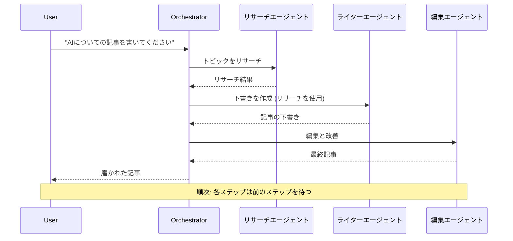
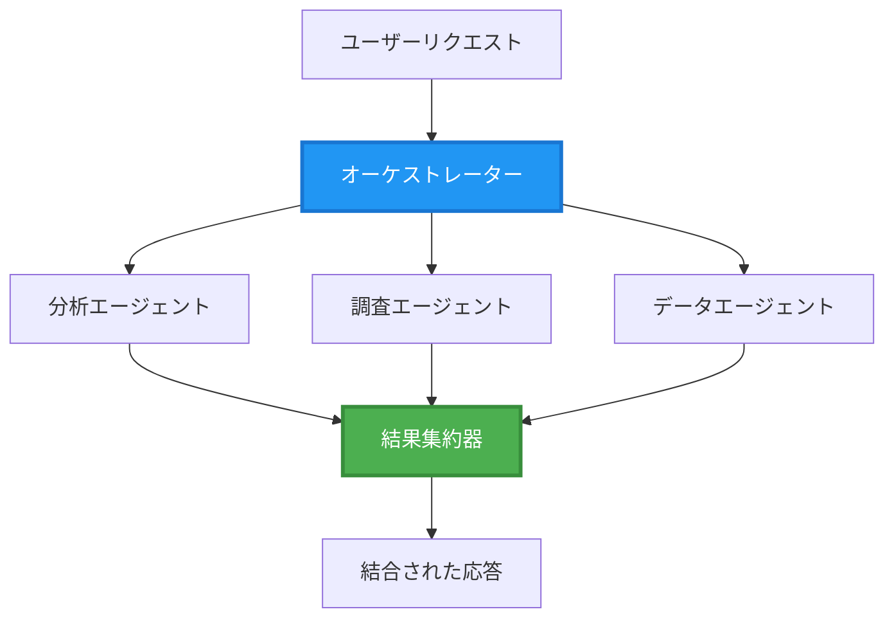
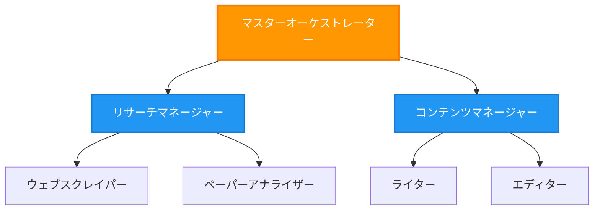
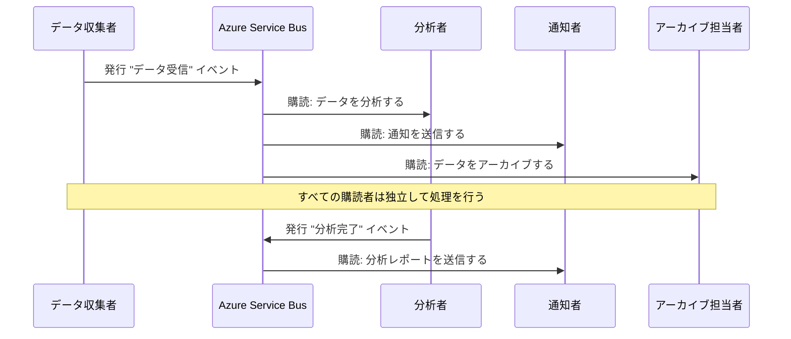
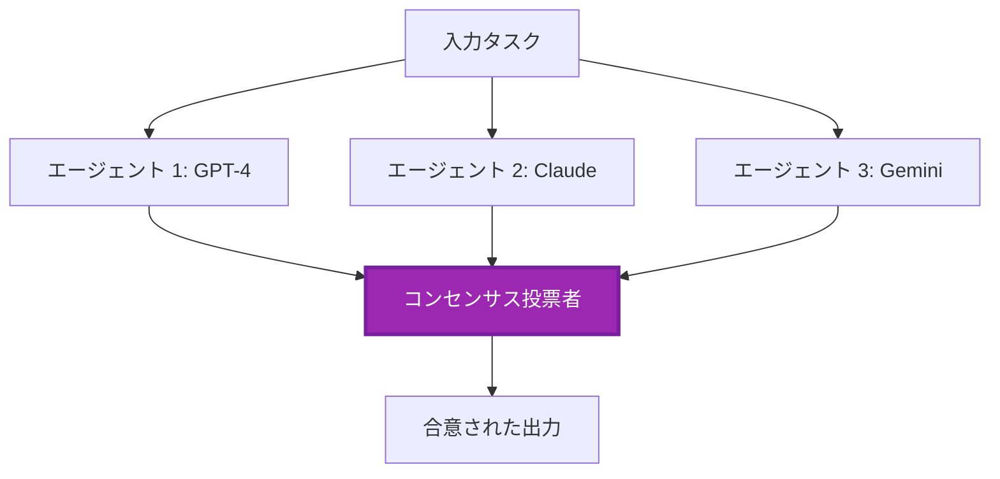
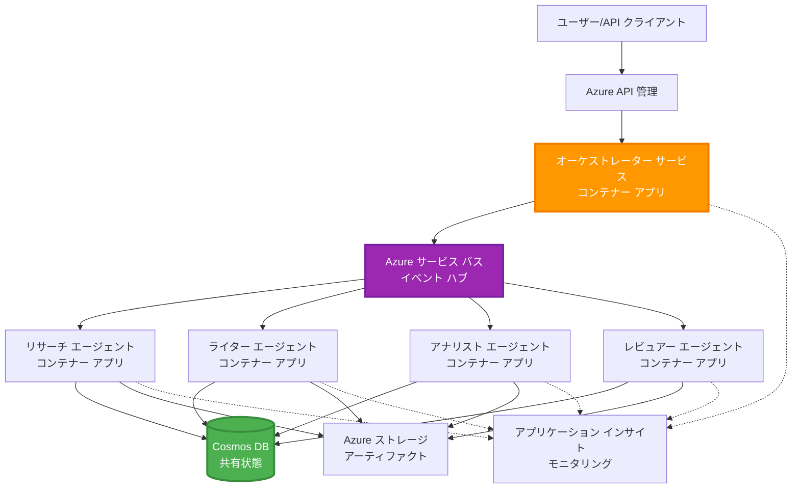

# マルチエージェント協調パターン

⏱️ **推定時間**: 60-75分 | 💰 **推定コスト**: ~$100-300/月 | ⭐ **複雑度**: 上級

**📚 学習パス:**
- ← 前: [キャパシティプランニング](capacity-planning.md) - リソースのサイズ設定とスケーリング戦略
- 🎯 **現在地**: マルチエージェント協調パターン (オーケストレーション、通信、状態管理)
- → 次: [SKU選択](sku-selection.md) - 適切なAzureサービスの選択
- 🏠 [コースホーム](../../README.md)

---

## 学べること

このレッスンを完了することで、以下を学べます:
- **マルチエージェントアーキテクチャ**のパターンとその使用タイミングを理解する
- **オーケストレーションパターン**を実装する (集中型、分散型、階層型)
- **エージェント通信**戦略を設計する (同期型、非同期型、イベント駆動型)
- 分散エージェント間での**共有状態**を管理する
- Azure上で**マルチエージェントシステム**をデプロイする
- 実際のAIシナリオに**協調パターン**を適用する
- 分散エージェントシステムを監視しデバッグする

## マルチエージェント協調が重要な理由

### 進化: シングルエージェントからマルチエージェントへ

**シングルエージェント (シンプル):**
```
User → Agent → Response
```
- ✅ 理解と実装が簡単
- ✅ 単純なタスクには高速
- ❌ 単一モデルの能力に制限される
- ❌ 複雑なタスクを並列化できない
- ❌ 専門性がない

**マルチエージェントシステム (高度):**
```
           ┌─────────────┐
           │ Orchestrator│
           └──────┬──────┘
        ┌─────────┼─────────┐
        │         │         │
    ┌───▼──┐  ┌──▼───┐  ┌──▼────┐
    │Agent1│  │Agent2│  │Agent3 │
    │(Plan)│  │(Code)│  │(Review)│
    └──────┘  └──────┘  └───────┘
```
- ✅ 特定のタスクに特化したエージェント
- ✅ 並列実行による高速化
- ✅ モジュール化され、保守が容易
- ✅ 複雑なワークフローに対応可能
- ⚠️ 協調ロジックが必要

**例え**: シングルエージェントはすべてのタスクを1人で行うようなもの。マルチエージェントは、研究者、コーダー、レビュアー、ライターなど、専門スキルを持つチームが協力して作業するようなもの。

---

## 基本的な協調パターン

### パターン1: 順次協調 (責任の連鎖)

**使用するタイミング**: タスクが特定の順序で完了する必要があり、各エージェントが前の出力を基に作業する場合。


**利点:**
- ✅ データフローが明確
- ✅ デバッグが容易
- ✅ 実行順序が予測可能

**制限:**
- ❌ 遅い (並列処理なし)
- ❌ 1つの失敗が全体をブロック
- ❌ 相互依存タスクを処理できない

**使用例:**
- コンテンツ作成パイプライン (調査 → 執筆 → 編集 → 公開)
- コード生成 (計画 → 実装 → テスト → デプロイ)
- レポート生成 (データ収集 → 分析 → 可視化 → 要約)

---

### パターン2: 並列協調 (ファンアウト/ファンイン)

**使用するタイミング**: 独立したタスクが同時に実行でき、結果を最後に統合する場合。


**利点:**
- ✅ 高速 (並列実行)
- ✅ フォールトトレラント (部分的な結果が許容される)
- ✅ 水平スケール可能

**制限:**
- ⚠️ 結果が順不同で到着する可能性
- ⚠️ 集約ロジックが必要
- ⚠️ 状態管理が複雑

**使用例:**
- 複数ソースからのデータ収集 (API + データベース + ウェブスクレイピング)
- 競合分析 (複数モデルが解を生成し、最適なものを選択)
- 翻訳サービス (複数言語への同時翻訳)

---

### パターン3: 階層型協調 (マネージャー-ワーカー)

**使用するタイミング**: サブタスクを含む複雑なワークフローで、委任が必要な場合。


**利点:**
- ✅ 複雑なワークフローに対応
- ✅ モジュール化され、保守が容易
- ✅ 責任範囲が明確

**制限:**
- ⚠️ アーキテクチャが複雑
- ⚠️ 高いレイテンシー (複数の協調レイヤー)
- ⚠️ 高度なオーケストレーションが必要

**使用例:**
- 企業文書処理 (分類 → ルーティング → 処理 → アーカイブ)
- 多段階データパイプライン (取り込み → クリーン → 変換 → 分析 → レポート)
- 複雑な自動化ワークフロー (計画 → リソース割り当て → 実行 → 監視)

---

### パターン4: イベント駆動型協調 (パブリッシュ-サブスクライブ)

**使用するタイミング**: エージェントがイベントに反応し、疎結合が求められる場合。


**利点:**
- ✅ エージェント間の疎結合
- ✅ 新しいエージェントの追加が容易 (サブスクライブするだけ)
- ✅ 非同期処理
- ✅ レジリエント (メッセージの永続性)

**制限:**
- ⚠️ 最終的な一貫性
- ⚠️ デバッグが複雑
- ⚠️ メッセージ順序の課題

**使用例:**
- リアルタイム監視システム (アラート、ダッシュボード、ログ)
- マルチチャネル通知 (メール、SMS、プッシュ通知、Slack)
- データ処理パイプライン (同じデータを複数の消費者が利用)

---

### パターン5: 合意ベースの協調 (投票/クォーラム)

**使用するタイミング**: 複数のエージェントからの合意が必要な場合。


**利点:**
- ✅ 高精度 (複数の意見)
- ✅ フォールトトレラント (少数の失敗が許容される)
- ✅ 品質保証が組み込まれている

**制限:**
- ❌ コストが高い (複数のモデル呼び出し)
- ❌ 遅い (すべてのエージェントを待つ必要がある)
- ⚠️ コンフリクト解決が必要

**使用例:**
- コンテンツモデレーション (複数モデルがコンテンツをレビュー)
- コードレビュー (複数のリンター/アナライザー)
- 医療診断 (複数のAIモデル、専門家の検証)

---

## アーキテクチャ概要

### Azure上の完全なマルチエージェントシステム


**主要コンポーネント:**

| コンポーネント | 目的 | Azureサービス |
|----------------|------|---------------|
| **APIゲートウェイ** | エントリーポイント、レート制限、認証 | API Management |
| **オーケストレーター** | エージェントワークフローの調整 | Container Apps |
| **メッセージキュー** | 非同期通信 | Service Bus / Event Hubs |
| **エージェント** | 特化型AIワーカー | Container Apps / Functions |
| **状態ストア** | 共有状態、タスク追跡 | Cosmos DB |
| **アーティファクトストレージ** | ドキュメント、結果、ログ | Blob Storage |
| **監視** | 分散トレーシング、ログ | Application Insights |

---

## 前提条件

### 必要なツール

```bash
# Azure Developer CLI を確認する
azd version
# ✅ 期待値: azd バージョン 1.0.0 以上

# Azure CLI を確認する
az --version
# ✅ 期待値: azure-cli 2.50.0 以上

# Docker を確認する (ローカルテスト用)
docker --version
# ✅ 期待値: Docker バージョン 20.10 以上
```

### Azureの要件

- 有効なAzureサブスクリプション
- 以下を作成する権限:
  - Container Apps
  - Service Bus名前空間
  - Cosmos DBアカウント
  - ストレージアカウント
  - Application Insights

### 知識の前提条件

以下を完了している必要があります:
- [構成管理](../getting-started/configuration.md)
- [認証とセキュリティ](../getting-started/authsecurity.md)
- [マイクロサービスの例](../../../../examples/microservices)

---

## 実装ガイド

### プロジェクト構造

```
multi-agent-system/
├── azure.yaml                    # AZD configuration
├── infra/
│   ├── main.bicep               # Main infrastructure
│   ├── core/
│   │   ├── servicebus.bicep     # Message queue
│   │   ├── cosmos.bicep         # State store
│   │   ├── storage.bicep        # Artifact storage
│   │   └── monitoring.bicep     # Application Insights
│   └── app/
│       ├── orchestrator.bicep   # Orchestrator service
│       └── agent.bicep          # Agent template
└── src/
    ├── orchestrator/            # Orchestration logic
    │   ├── app.py
    │   ├── workflows.py
    │   └── Dockerfile
    ├── agents/
    │   ├── research/            # Research agent
    │   ├── writer/              # Writer agent
    │   ├── analyst/             # Analyst agent
    │   └── reviewer/            # Reviewer agent
    └── shared/
        ├── state_manager.py     # Shared state logic
        └── message_handler.py   # Message handling
```

---

## レッスン1: 順次協調パターン

### 実装: コンテンツ作成パイプライン

調査 → 執筆 → 編集 → 公開の順次パイプラインを構築します。

### 1. AZD構成

**ファイル: `azure.yaml`**

```yaml
name: content-pipeline
metadata:
  template: multi-agent-sequential@1.0.0

services:
  orchestrator:
    project: ./src/orchestrator
    language: python
    host: containerapp
  
  research-agent:
    project: ./src/agents/research
    language: python
    host: containerapp
  
  writer-agent:
    project: ./src/agents/writer
    language: python
    host: containerapp
  
  editor-agent:
    project: ./src/agents/editor
    language: python
    host: containerapp
```

### 2. インフラ: 協調用Service Bus

**ファイル: `infra/core/servicebus.bicep`**

```bicep
param name string
param location string
param tags object = {}

resource serviceBusNamespace 'Microsoft.ServiceBus/namespaces@2022-10-01-preview' = {
  name: name
  location: location
  tags: tags
  sku: {
    name: 'Standard'
    tier: 'Standard'
  }
  properties: {
    minimumTlsVersion: '1.2'
  }
}

// Queue for orchestrator → research agent
resource researchQueue 'Microsoft.ServiceBus/namespaces/queues@2022-10-01-preview' = {
  parent: serviceBusNamespace
  name: 'research-tasks'
  properties: {
    maxDeliveryCount: 3
    lockDuration: 'PT5M'
    deadLetteringOnMessageExpiration: true
  }
}

// Queue for research agent → writer agent
resource writerQueue 'Microsoft.ServiceBus/namespaces/queues@2022-10-01-preview' = {
  parent: serviceBusNamespace
  name: 'writer-tasks'
  properties: {
    maxDeliveryCount: 3
    lockDuration: 'PT5M'
  }
}

// Queue for writer agent → editor agent
resource editorQueue 'Microsoft.ServiceBus/namespaces/queues@2022-10-01-preview' = {
  parent: serviceBusNamespace
  name: 'editor-tasks'
  properties: {
    maxDeliveryCount: 3
    lockDuration: 'PT5M'
  }
}

output namespace string = serviceBusNamespace.name
output connectionString string = listKeys('${serviceBusNamespace.id}/AuthorizationRules/RootManageSharedAccessKey', serviceBusNamespace.apiVersion).primaryConnectionString
```

### 3. 共有状態マネージャー

**ファイル: `src/shared/state_manager.py`**

```python
from azure.cosmos import CosmosClient, PartitionKey
from datetime import datetime
import os

class StateManager:
    """Manages shared state across agents using Cosmos DB"""
    
    def __init__(self):
        endpoint = os.environ['COSMOS_ENDPOINT']
        key = os.environ['COSMOS_KEY']
        
        self.client = CosmosClient(endpoint, key)
        self.database = self.client.get_database_client('agent-state')
        self.container = self.database.get_container_client('tasks')
    
    def create_task(self, task_id: str, task_type: str, input_data: dict):
        """Create a new task"""
        task = {
            'id': task_id,
            'type': task_type,
            'status': 'pending',
            'input': input_data,
            'created_at': datetime.utcnow().isoformat(),
            'steps': []
        }
        self.container.create_item(task)
        return task
    
    def update_task_step(self, task_id: str, step_name: str, result: dict):
        """Update task with completed step"""
        task = self.container.read_item(task_id, partition_key=task_id)
        
        task['steps'].append({
            'name': step_name,
            'completed_at': datetime.utcnow().isoformat(),
            'result': result
        })
        
        self.container.replace_item(task_id, task)
        return task
    
    def complete_task(self, task_id: str, final_result: dict):
        """Mark task as complete"""
        task = self.container.read_item(task_id, partition_key=task_id)
        task['status'] = 'completed'
        task['result'] = final_result
        task['completed_at'] = datetime.utcnow().isoformat()
        self.container.replace_item(task_id, task)
        return task
    
    def get_task(self, task_id: str):
        """Retrieve task state"""
        return self.container.read_item(task_id, partition_key=task_id)
```

### 4. オーケストレーターサービス

**ファイル: `src/orchestrator/app.py`**

```python
from flask import Flask, request, jsonify
from azure.servicebus import ServiceBusClient, ServiceBusMessage
import json
import uuid
import os
from shared.state_manager import StateManager

app = Flask(__name__)
state_manager = StateManager()

# サービスバス接続
servicebus_connection_str = os.environ['SERVICEBUS_CONNECTION_STRING']
servicebus_client = ServiceBusClient.from_connection_string(servicebus_connection_str)

@app.route('/health', methods=['GET'])
def health():
    return jsonify({'status': 'healthy', 'service': 'orchestrator'})

@app.route('/create-content', methods=['POST'])
def create_content():
    """
    Sequential workflow: Research → Write → Edit → Publish
    """
    data = request.json
    topic = data.get('topic')
    
    if not topic:
        return jsonify({'error': 'Topic required'}), 400
    
    # 状態ストアでタスクを作成
    task_id = str(uuid.uuid4())
    task = state_manager.create_task(
        task_id=task_id,
        task_type='content_creation',
        input_data={'topic': topic}
    )
    
    # 研究エージェントにメッセージを送信（最初のステップ）
    sender = servicebus_client.get_queue_sender('research-tasks')
    message = ServiceBusMessage(
        body=json.dumps({
            'task_id': task_id,
            'topic': topic,
            'next_queue': 'writer-tasks'  # 結果を送信する場所
        }),
        content_type='application/json'
    )
    
    with sender:
        sender.send_messages(message)
    
    return jsonify({
        'task_id': task_id,
        'status': 'started',
        'workflow': 'sequential',
        'steps': ['research', 'write', 'edit', 'publish'],
        'message': 'Content creation pipeline initiated'
    }), 202

@app.route('/task/<task_id>', methods=['GET'])
def get_task_status(task_id):
    """Check task status"""
    try:
        task = state_manager.get_task(task_id)
        return jsonify(task)
    except Exception as e:
        return jsonify({'error': str(e)}), 404

if __name__ == '__main__':
    app.run(host='0.0.0.0', port=8080)
```

### 5. 調査エージェント

**ファイル: `src/agents/research/app.py`**

```python
from azure.servicebus import ServiceBusClient, ServiceBusMessage
from openai import AzureOpenAI
import json
import os
import time
from shared.state_manager import StateManager

# クライアントを初期化する
state_manager = StateManager()
servicebus_client = ServiceBusClient.from_connection_string(
    os.environ['SERVICEBUS_CONNECTION_STRING']
)

openai_client = AzureOpenAI(
    api_key=os.environ['AZURE_OPENAI_API_KEY'],
    api_version="2024-02-01",
    azure_endpoint=os.environ['AZURE_OPENAI_ENDPOINT']
)

def process_research_task(message_data):
    """Process research request and pass to writer"""
    task_id = message_data['task_id']
    topic = message_data['topic']
    next_queue = message_data['next_queue']
    
    print(f"🔬 Researching: {topic}")
    
    # 調査のためにAzure OpenAIを呼び出す
    response = openai_client.chat.completions.create(
        model="gpt-4",
        messages=[
            {"role": "system", "content": "You are a research assistant. Provide comprehensive research on the given topic."},
            {"role": "user", "content": f"Research this topic thoroughly: {topic}"}
        ],
        max_tokens=1500
    )
    
    research_results = response.choices[0].message.content
    
    # 状態を更新する
    state_manager.update_task_step(
        task_id=task_id,
        step_name='research',
        result={'research': research_results}
    )
    
    # 次のエージェント（ライター）に送信する
    sender = servicebus_client.get_queue_sender(next_queue)
    message = ServiceBusMessage(
        body=json.dumps({
            'task_id': task_id,
            'topic': topic,
            'research': research_results,
            'next_queue': 'editor-tasks'
        }),
        content_type='application/json'
    )
    
    with sender:
        sender.send_messages(message)
    
    print(f"✅ Research complete for task {task_id}")

def main():
    """Listen to research queue"""
    receiver = servicebus_client.get_queue_receiver('research-tasks')
    
    print("🔬 Research Agent started, listening for tasks...")
    
    with receiver:
        while True:
            messages = receiver.receive_messages(max_wait_time=5)
            for message in messages:
                try:
                    message_data = json.loads(str(message))
                    process_research_task(message_data)
                    receiver.complete_message(message)
                except Exception as e:
                    print(f"❌ Error processing message: {e}")
                    receiver.abandon_message(message)

if __name__ == '__main__':
    main()
```

### 6. ライターエージェント

**ファイル: `src/agents/writer/app.py`**

```python
from azure.servicebus import ServiceBusClient, ServiceBusMessage
from openai import AzureOpenAI
import json
import os
from shared.state_manager import StateManager

state_manager = StateManager()
servicebus_client = ServiceBusClient.from_connection_string(
    os.environ['SERVICEBUS_CONNECTION_STRING']
)

openai_client = AzureOpenAI(
    api_key=os.environ['AZURE_OPENAI_API_KEY'],
    api_version="2024-02-01",
    azure_endpoint=os.environ['AZURE_OPENAI_ENDPOINT']
)

def process_writing_task(message_data):
    """Write article based on research"""
    task_id = message_data['task_id']
    topic = message_data['topic']
    research = message_data['research']
    next_queue = message_data['next_queue']
    
    print(f"✍️ Writing article: {topic}")
    
    # Azure OpenAIを呼び出して記事を書く
    response = openai_client.chat.completions.create(
        model="gpt-4",
        messages=[
            {"role": "system", "content": "You are a professional writer. Write engaging, well-structured articles."},
            {"role": "user", "content": f"Based on this research:\n\n{research}\n\nWrite a comprehensive article about: {topic}"}
        ],
        max_tokens=2000
    )
    
    article_draft = response.choices[0].message.content
    
    # 状態を更新する
    state_manager.update_task_step(
        task_id=task_id,
        step_name='writing',
        result={'draft': article_draft}
    )
    
    # 編集者に送る
    sender = servicebus_client.get_queue_sender(next_queue)
    message = ServiceBusMessage(
        body=json.dumps({
            'task_id': task_id,
            'topic': topic,
            'draft': article_draft
        }),
        content_type='application/json'
    )
    
    with sender:
        sender.send_messages(message)
    
    print(f"✅ Article draft complete for task {task_id}")

def main():
    """Listen to writer queue"""
    receiver = servicebus_client.get_queue_receiver('writer-tasks')
    
    print("✍️ Writer Agent started, listening for tasks...")
    
    with receiver:
        while True:
            messages = receiver.receive_messages(max_wait_time=5)
            for message in messages:
                try:
                    message_data = json.loads(str(message))
                    process_writing_task(message_data)
                    receiver.complete_message(message)
                except Exception as e:
                    print(f"❌ Error: {e}")
                    receiver.abandon_message(message)

if __name__ == '__main__':
    main()
```

### 7. エディターエージェント

**ファイル: `src/agents/editor/app.py`**

```python
from azure.servicebus import ServiceBusClient
from openai import AzureOpenAI
import json
import os
from shared.state_manager import StateManager

state_manager = StateManager()
servicebus_client = ServiceBusClient.from_connection_string(
    os.environ['SERVICEBUS_CONNECTION_STRING']
)

openai_client = AzureOpenAI(
    api_key=os.environ['AZURE_OPENAI_API_KEY'],
    api_version="2024-02-01",
    azure_endpoint=os.environ['AZURE_OPENAI_ENDPOINT']
)

def process_editing_task(message_data):
    """Edit and finalize article"""
    task_id = message_data['task_id']
    topic = message_data['topic']
    draft = message_data['draft']
    
    print(f"📝 Editing article: {topic}")
    
    # Azure OpenAIを呼び出して編集する
    response = openai_client.chat.completions.create(
        model="gpt-4",
        messages=[
            {"role": "system", "content": "You are an expert editor. Improve grammar, clarity, and structure."},
            {"role": "user", "content": f"Edit and improve this article:\n\n{draft}"}
        ],
        max_tokens=2000
    )
    
    final_article = response.choices[0].message.content
    
    # タスクを完了としてマークする
    state_manager.complete_task(
        task_id=task_id,
        final_result={
            'topic': topic,
            'final_article': final_article,
            'word_count': len(final_article.split())
        }
    )
    
    print(f"✅ Article finalized for task {task_id}")

def main():
    """Listen to editor queue"""
    receiver = servicebus_client.get_queue_receiver('editor-tasks')
    
    print("📝 Editor Agent started, listening for tasks...")
    
    with receiver:
        while True:
            messages = receiver.receive_messages(max_wait_time=5)
            for message in messages:
                try:
                    message_data = json.loads(str(message))
                    process_editing_task(message_data)
                    receiver.complete_message(message)
                except Exception as e:
                    print(f"❌ Error: {e}")
                    receiver.abandon_message(message)

if __name__ == '__main__':
    main()
```

### 8. デプロイとテスト

```bash
# 初期化してデプロイする
azd init
azd up

# オーケストレーターのURLを取得する
ORCHESTRATOR_URL=$(azd env get-values | grep ORCHESTRATOR_URL | cut -d '=' -f2 | tr -d '"')

# コンテンツを作成する
curl -X POST $ORCHESTRATOR_URL/create-content \
  -H "Content-Type: application/json" \
  -d '{"topic": "The Future of AI in Healthcare"}'
```

**✅ 期待される出力:**
```json
{
  "task_id": "a1b2c3d4-e5f6-7890-abcd-ef1234567890",
  "status": "started",
  "workflow": "sequential",
  "steps": ["research", "write", "edit", "publish"],
  "message": "Content creation pipeline initiated"
}
```

**タスク進捗の確認:**
```bash
TASK_ID="a1b2c3d4-e5f6-7890-abcd-ef1234567890"
curl $ORCHESTRATOR_URL/task/$TASK_ID
```

**✅ 期待される出力 (完了):**
```json
{
  "id": "a1b2c3d4-e5f6-7890-abcd-ef1234567890",
  "type": "content_creation",
  "status": "completed",
  "steps": [
    {
      "name": "research",
      "completed_at": "2025-11-19T10:30:00Z",
      "result": {"research": "..."}
    },
    {
      "name": "writing",
      "completed_at": "2025-11-19T10:32:00Z",
      "result": {"draft": "..."}
    }
  ],
  "result": {
    "topic": "The Future of AI in Healthcare",
    "final_article": "...",
    "word_count": 1500
  }
}
```

---

## レッスン2: 並列協調パターン

### 実装: マルチソース調査アグリゲーター

複数のソースから同時に情報を収集する並列システムを構築します。

### 並列オーケストレーター

**ファイル: `src/orchestrator/parallel_workflow.py`**

```python
from flask import Flask, request, jsonify
from azure.servicebus import ServiceBusClient, ServiceBusMessage
import json
import uuid
import os
from shared.state_manager import StateManager

app = Flask(__name__)
state_manager = StateManager()

servicebus_client = ServiceBusClient.from_connection_string(
    os.environ['SERVICEBUS_CONNECTION_STRING']
)

@app.route('/research-parallel', methods=['POST'])
def research_parallel():
    """
    Parallel workflow: Multiple agents work simultaneously
    """
    data = request.json
    query = data.get('query')
    
    task_id = str(uuid.uuid4())
    task = state_manager.create_task(
        task_id=task_id,
        task_type='parallel_research',
        input_data={
            'query': query,
            'agents': ['web', 'academic', 'news', 'social']
        }
    )
    
    # ファンアウト: すべてのエージェントに同時に送信
    agents = [
        ('web-research-queue', 'web'),
        ('academic-research-queue', 'academic'),
        ('news-research-queue', 'news'),
        ('social-research-queue', 'social')
    ]
    
    for queue_name, agent_type in agents:
        sender = servicebus_client.get_queue_sender(queue_name)
        message = ServiceBusMessage(
            body=json.dumps({
                'task_id': task_id,
                'query': query,
                'agent_type': agent_type,
                'result_queue': 'aggregation-queue'
            }),
            content_type='application/json'
        )
        
        with sender:
            sender.send_messages(message)
    
    return jsonify({
        'task_id': task_id,
        'status': 'started',
        'workflow': 'parallel',
        'agents_dispatched': 4,
        'message': 'Parallel research initiated'
    }), 202

if __name__ == '__main__':
    app.run(host='0.0.0.0', port=8080)
```

### 集約ロジック

**ファイル: `src/agents/aggregator/app.py`**

```python
from azure.servicebus import ServiceBusClient
import json
import os
from collections import defaultdict
from shared.state_manager import StateManager

state_manager = StateManager()
servicebus_client = ServiceBusClient.from_connection_string(
    os.environ['SERVICEBUS_CONNECTION_STRING']
)

# タスクごとの結果を追跡する
task_results = defaultdict(list)
expected_agents = 4  # ウェブ、学術、ニュース、ソーシャル

def process_result(message_data):
    """Aggregate results from parallel agents"""
    task_id = message_data['task_id']
    agent_type = message_data['agent_type']
    result = message_data['result']
    
    # 結果を保存する
    task_results[task_id].append({
        'agent': agent_type,
        'data': result
    })
    
    print(f"📊 Received result from {agent_type} agent ({len(task_results[task_id])}/{expected_agents})")
    
    # すべてのエージェントが完了したか確認する（ファンイン）
    if len(task_results[task_id]) == expected_agents:
        print(f"✅ All agents completed for task {task_id}. Aggregating...")
        
        # 結果を結合する
        aggregated = {
            'query': message_data['query'],
            'sources': task_results[task_id],
            'summary': generate_summary(task_results[task_id])
        }
        
        # 完了としてマークする
        state_manager.complete_task(task_id, aggregated)
        
        # クリーンアップする
        del task_results[task_id]
        
        print(f"✅ Aggregation complete for task {task_id}")

def generate_summary(results):
    """Generate summary from all sources"""
    summaries = [r['data'].get('summary', '') for r in results]
    return '\n\n'.join(summaries)

def main():
    """Listen to aggregation queue"""
    receiver = servicebus_client.get_queue_receiver('aggregation-queue')
    
    print("📊 Aggregator started, listening for results...")
    
    with receiver:
        while True:
            messages = receiver.receive_messages(max_wait_time=5)
            for message in messages:
                try:
                    message_data = json.loads(str(message))
                    process_result(message_data)
                    receiver.complete_message(message)
                except Exception as e:
                    print(f"❌ Error: {e}")
                    receiver.abandon_message(message)

if __name__ == '__main__':
    main()
```

**並列パターンの利点:**
- ⚡ **4倍高速** (エージェントが同時に実行)
- 🔄 **フォールトトレラント** (部分的な結果が許容される)
- 📈 **スケーラブル** (エージェントを簡単に追加可能)

---

## 実践演習

### 演習1: タイムアウト処理の追加 ⭐⭐ (中級)

**目標**: アグリゲーターが遅いエージェントを永遠に待たないようにタイムアウトロジックを実装する。

**手順**:

1. **アグリゲーターにタイムアウト追跡を追加:**

```python
from datetime import datetime, timedelta

task_timeouts = {}  # task_id -> 有効期限

def process_result(message_data):
    task_id = message_data['task_id']
    
    # 最初の結果にタイムアウトを設定
    if task_id not in task_timeouts:
        task_timeouts[task_id] = datetime.utcnow() + timedelta(seconds=30)
    
    task_results[task_id].append({
        'agent': message_data['agent_type'],
        'data': message_data['result']
    })
    
    # 完了またはタイムアウトしたか確認
    if len(task_results[task_id]) == expected_agents or \
       datetime.utcnow() > task_timeouts[task_id]:
        
        print(f"📊 Aggregating with {len(task_results[task_id])}/{expected_agents} results")
        
        aggregated = {
            'query': message_data['query'],
            'sources': task_results[task_id],
            'completed_agents': len(task_results[task_id]),
            'timed_out': len(task_results[task_id]) < expected_agents
        }
        
        state_manager.complete_task(task_id, aggregated)
        
        # クリーンアップ
        del task_results[task_id]
        del task_timeouts[task_id]
```

2. **人工的な遅延でテスト:**

```python
# 1つのエージェントで遅延を追加して、処理の遅さをシミュレートする
import time
time.sleep(35)  # 30秒のタイムアウトを超える
```

3. **デプロイと検証:**

```bash
azd deploy aggregator

# タスクを送信する
curl -X POST $ORCHESTRATOR_URL/research-parallel \
  -H "Content-Type: application/json" \
  -d '{"query": "AI safety research"}'

# 30秒後に結果を確認する
curl $ORCHESTRATOR_URL/task/$TASK_ID
```

**✅ 成功基準:**
- ✅ エージェントが完了しなくても30秒後にタスクが完了する
- ✅ 応答に部分的な結果が含まれる (`"timed_out": true`)
- ✅ 利用可能な結果が返される (4エージェント中3つ)

**時間**: 20-25分

---

### 演習2: リトライロジックの実装 ⭐⭐⭐ (上級)

**目標**: 失敗したエージェントタスクを自動的にリトライする。

**手順**:

1. **オーケストレーターにリトライ追跡を追加:**

```python
from dataclasses import dataclass
from typing import Dict

@dataclass
class RetryConfig:
    max_retries: int = 3
    backoff_seconds: int = 5

retry_counts: Dict[str, int] = {}  # message_id -> retry_count

def send_with_retry(queue_name: str, message_data: dict, retry_config: RetryConfig):
    """Send message with retry metadata"""
    message_id = message_data.get('message_id', str(uuid.uuid4()))
    message_data['message_id'] = message_id
    message_data['retry_count'] = retry_counts.get(message_id, 0)
    message_data['max_retries'] = retry_config.max_retries
    
    sender = servicebus_client.get_queue_sender(queue_name)
    message = ServiceBusMessage(
        body=json.dumps(message_data),
        content_type='application/json',
        message_id=message_id
    )
    
    with sender:
        sender.send_messages(message)
```

2. **エージェントにリトライハンドラーを追加:**

```python
def process_with_retry(message, receiver, process_func):
    """Process message with automatic retry on failure"""
    try:
        message_data = json.loads(str(message))
        
        # メッセージを処理する
        process_func(message_data)
        
        # 成功 - 完了
        receiver.complete_message(message)
        
    except Exception as e:
        message_id = message.message_id
        retry_count = message_data.get('retry_count', 0)
        max_retries = message_data.get('max_retries', 3)
        
        if retry_count < max_retries:
            # 再試行: 放棄してカウントを増やして再キュー
            print(f"⚠️ Retry {retry_count + 1}/{max_retries} for message {message_id}")
            
            message_data['retry_count'] = retry_count + 1
            
            # 遅延をつけて同じキューに送り返す
            time.sleep(5 * (retry_count + 1))  # 指数バックオフ
            send_with_retry(queue_name, message_data, RetryConfig())
            
            receiver.complete_message(message)  # 元のものを削除する
        else:
            # 最大再試行回数を超過 - デッドレターキューに移動
            print(f"❌ Max retries exceeded for message {message_id}")
            receiver.dead_letter_message(
                message,
                reason="MaxRetriesExceeded",
                error_description=str(e)
            )
```

3. **デッドレタキューを監視:**

```python
def monitor_dead_letters():
    """Check dead letter queue for failed messages"""
    receiver = servicebus_client.get_queue_receiver(
        'research-queue',
        sub_queue='deadletter'
    )
    
    with receiver:
        messages = receiver.receive_messages(max_wait_time=5)
        for message in messages:
            print(f"☠️ Dead letter: {message.message_id}")
            print(f"Reason: {message.dead_letter_reason}")
            print(f"Description: {message.dead_letter_error_description}")
```

**✅ 成功基準:**
- ✅ 失敗したタスクが自動的にリトライされる (最大3回まで)
- ✅ リトライ間に指数バックオフ (5秒、10秒、15秒)
- ✅ 最大リトライ後、メッセージがデッドレタキューに送られる
- ✅ デッドレタキューを監視し再実行可能

**時間**: 30-40分

---

### 演習3: サーキットブレーカーの実装 ⭐⭐⭐ (上級)

**目標**: 失敗中のエージェントへのリクエストを停止し、連鎖的な失敗を防ぐ。

**手順**:

1. **サーキットブレーククラスを作成:**

```python
from enum import Enum
from datetime import datetime, timedelta

class CircuitState(Enum):
    CLOSED = "closed"      # 通常の操作
    OPEN = "open"          # 失敗、リクエストを拒否
    HALF_OPEN = "half_open"  # 回復したかテスト中

class CircuitBreaker:
    def __init__(self, failure_threshold=5, timeout_seconds=60):
        self.failure_threshold = failure_threshold
        self.timeout_seconds = timeout_seconds
        self.failure_count = 0
        self.last_failure_time = None
        self.state = CircuitState.CLOSED
    
    def call(self, func):
        """Execute function with circuit breaker protection"""
        if self.state == CircuitState.OPEN:
            # タイムアウトが切れたか確認
            if datetime.utcnow() - self.last_failure_time > timedelta(seconds=self.timeout_seconds):
                self.state = CircuitState.HALF_OPEN
                print("🔄 Circuit breaker: HALF_OPEN (testing)")
            else:
                raise Exception(f"Circuit breaker OPEN for agent. Try again in {self.timeout_seconds}s")
        
        try:
            result = func()
            
            # 成功
            if self.state == CircuitState.HALF_OPEN:
                self.state = CircuitState.CLOSED
                self.failure_count = 0
                print("✅ Circuit breaker: CLOSED (recovered)")
            
            return result
            
        except Exception as e:
            self.failure_count += 1
            self.last_failure_time = datetime.utcnow()
            
            if self.failure_count >= self.failure_threshold:
                self.state = CircuitState.OPEN
                print(f"🔴 Circuit breaker: OPEN (too many failures)")
            
            raise e
```

2. **エージェント呼び出しに適用:**

```python
# オーケストレーター内で
agent_circuits = {
    'web': CircuitBreaker(failure_threshold=5, timeout_seconds=60),
    'academic': CircuitBreaker(failure_threshold=5, timeout_seconds=60),
    'news': CircuitBreaker(failure_threshold=5, timeout_seconds=60),
    'social': CircuitBreaker(failure_threshold=5, timeout_seconds=60)
}

def send_to_agent(agent_type, message_data):
    """Send with circuit breaker protection"""
    circuit = agent_circuits[agent_type]
    
    try:
        circuit.call(lambda: send_message(agent_type, message_data))
    except Exception as e:
        print(f"⚠️ Skipping {agent_type} agent: {e}")
        # 他のエージェントを続行
```

3. **サーキットブレーカーをテスト:**

```bash
# 繰り返しの失敗をシミュレートする（1つのエージェントを停止）
az containerapp stop --name web-research-agent --resource-group rg-agents

# 複数のリクエストを送信する
for i in {1..10}; do
  curl -X POST $ORCHESTRATOR_URL/research-parallel \
    -H "Content-Type: application/json" \
    -d '{"query": "test query '$i'"}'
  sleep 2
done

# ログを確認する - 5回の失敗後に回路が開いているはず
azd logs orchestrator --tail 50
```

**✅ 成功基準:**
- ✅ 5回の失敗後、サーキットがオープン (リクエストを拒否)
- ✅ 60秒後、サーキットがハーフオープン (回復をテスト)
- ✅ 他のエージェントは通常通り動作
- ✅ エージェントが回復するとサーキットが自動的にクローズ

**時間**: 40-50分

---

## 監視とデバッグ

### Application Insightsを使用した分散トレーシング

**ファイル: `src/shared/tracing.py`**

```python
from opencensus.ext.azure.log_exporter import AzureLogHandler
from opencensus.ext.azure.trace_exporter import AzureExporter
from opencensus.trace import config_integration
from opencensus.trace.tracer import Tracer
from opencensus.trace.samplers import AlwaysOnSampler
import logging
import os

# トレースを設定する
config_integration.trace_integrations(['requests', 'logging'])

connection_string = os.environ.get('APPLICATIONINSIGHTS_CONNECTION_STRING')

# トレーサーを作成する
tracer = Tracer(
    exporter=AzureExporter(connection_string=connection_string),
    sampler=AlwaysOnSampler()
)

# ロギングを設定する
logger = logging.getLogger(__name__)
logger.addHandler(AzureLogHandler(connection_string=connection_string))
logger.setLevel(logging.INFO)

def trace_agent_call(agent_name, task_id, operation):
    """Trace agent operations"""
    with tracer.span(name=f'{agent_name}.{operation}') as span:
        span.add_attribute('agent', agent_name)
        span.add_attribute('task_id', task_id)
        span.add_attribute('operation', operation)
        
        try:
            result = operation()
            span.add_attribute('status', 'success')
            return result
        except Exception as e:
            span.add_attribute('status', 'error')
            span.add_attribute('error', str(e))
            raise
```

### Application Insightsクエリ

**マルチエージェントワークフローの追跡:**

```kusto
// Trace complete workflow for a task
traces
| where customDimensions.task_id == "a1b2c3d4-..."
| project timestamp, message, customDimensions.agent, customDimensions.operation
| order by timestamp asc
```

**エージェントパフォーマンスの比較:**

```kusto
// Compare agent execution times
dependencies
| where name contains "agent"
| summarize 
    avg_duration = avg(duration),
    p95_duration = percentile(duration, 95),
    count = count()
  by agent = tostring(customDimensions.agent)
| order by avg_duration desc
```

**失敗分析:**

```kusto
// Find which agents fail most
exceptions
| where customDimensions.agent != ""
| summarize 
    failure_count = count(),
    unique_errors = dcount(outerMessage)
  by agent = tostring(customDimensions.agent)
| order by failure_count desc
```

---

## コスト分析

### マルチエージェントシステムのコスト (月額見積もり)

| コンポーネント | 構成 | コスト |
|----------------|------|--------|
| **オーケストレーター** | 1 Container App (1 vCPU, 2GB) | $30-50 |
| **4エージェント** | 4 Container Apps (0.5 vCPU, 1GB each) | $60-120 |
| **Service Bus** | Standard tier, 10M messages | $10-20 |
| **Cosmos DB** | Serverless, 5GB storage, 1M RUs | $25-50 |
| **Blob Storage** | 10GB storage, 100K operations | $5-10 |
| **Application Insights** | 5GB ingestion | $10-15 |
| **Azure OpenAI** | GPT-4, 10M tokens | $100-300 |
| **合計** | | **$240-565/月** |

### コスト最適化戦略

1. **可能な限りサーバーレスを使用:**
   ```bicep
   // Cosmos DB serverless (no minimum cost)
   properties: {
     databaseAccountOfferType: 'Standard'
     capabilities: [{ name: 'EnableServerless' }]
   }
   ```

2. **アイドル時にエージェントをゼロにスケール:**
   ```bicep
   scale: {
     minReplicas: 0  // Scale to zero when no messages
     maxReplicas: 10
   }
   ```

3. **Service Busでバッチ処理を使用:**
   ```python
   # メッセージをバッチで送信する（より安価）
   sender.send_messages([message1, message2, message3])
   ```

4. **頻繁に使用される結果をキャッシュ:**
   ```python
   # Azure Cache for Redis を使用する
   if cache.exists(query_hash):
       return cache.get(query_hash)
   ```

---

## ベストプラクティス

### ✅ 推奨事項:

1. **冪等性のある操作を使用**
   ```python
   # エージェントは同じメッセージを複数回安全に処理できます
   def process_task(task_id):
       if state_manager.task_exists(task_id):
           print(f"Task {task_id} already processed, skipping")
           return
       # タスクを処理中...
   ```

2. **包括的なログを実装**
   ```python
   logger.info(f"Agent: {agent_name}, Task: {task_id}, Action: {action}")
   ```

3. **相関IDを使用**
   ```python
   # タスクIDをワークフロー全体に渡す
   message_data = {
       'task_id': task_id,  # 相関ID
       'timestamp': datetime.utcnow().isoformat()
   }
   ```

4. **メッセージのTTL (有効期限) を設定**
   ```bicep
   properties: {
     defaultMessageTimeToLive: 'PT1H'  // 1 hour max
   }
   ```

5. **デッドレタキューを監視**
   ```python
   # 失敗したメッセージの定期的な監視
   monitor_dead_letters()
   ```

### ❌ 非推奨事項:

1. **循環依存を作成しない**
   ```python
   # ❌ 悪い: エージェントA → エージェントB → エージェントA（無限ループ）
   # ✅ 良い: 明確な有向非巡回グラフ（DAG）を定義する
   ```

2. **エージェントスレッドをブロックしない**
   ```python
   # ❌ 悪い: 同期的な待機
   while not task_complete:
       time.sleep(1)
   
   # ✅ 良い: メッセージキューのコールバックを使用
   ```

3. **部分的な失敗を無視しない**
   ```python
   # ❌ 悪い: 1つのエージェントが失敗すると、全体のワークフローが失敗する
   # ✅ 良い: エラー指標付きで部分的な結果を返す
   ```

4. **無限リトライを使用しない**
@@CODE_BLOCK_48
## トラブルシューティングガイド

### 問題: メッセージがキューに滞留する

**症状:**
- メッセージがキューに溜まる
- エージェントが処理しない
- タスクのステータスが「保留」のまま

**診断:**
```bash
# キューの深さを確認する
az servicebus queue show \
  --namespace-name mybus \
  --name research-tasks \
  --query "countDetails"

# エージェントの健康状態を確認する
azd logs research-agent --tail 50
```

**解決策:**

1. **エージェントのレプリカを増やす:**
   ```bash
   az containerapp update \
     --name research-agent \
     --min-replicas 3 \
     --max-replicas 10
   ```

2. **デッドレターキューを確認する:**
   ```bash
   az servicebus queue show \
     --namespace-name mybus \
     --name research-tasks \
     --query "countDetails.deadLetterMessageCount"
   ```

---

### 問題: タスクがタイムアウトする/完了しない

**症状:**
- タスクのステータスが「進行中」のまま
- 一部のエージェントは完了するが、他は完了しない
- エラーメッセージが表示されない

**診断:**
```bash
# タスクの状態を確認する
curl $ORCHESTRATOR_URL/task/$TASK_ID

# Application Insightsを確認する
# クエリを実行する: traces | where customDimensions.task_id == "..."
```

**解決策:**

1. **アグリゲーターにタイムアウトを実装する (演習1)**

2. **エージェントの障害を確認する:**
   ```bash
   azd logs --follow | grep "ERROR\|FAIL"
   ```

3. **すべてのエージェントが稼働していることを確認する:**
   ```bash
   az containerapp list \
     --resource-group rg-agents \
     --query "[].{name:name, status:properties.runningStatus}"
   ```

---

## 詳しく学ぶ

### 公式ドキュメント
- [Azure Service Bus](https://learn.microsoft.com/azure/service-bus-messaging/service-bus-messaging-overview)
- [Cosmos DB](https://learn.microsoft.com/azure/cosmos-db/introduction)
- [Container Apps DAPR](https://learn.microsoft.com/azure/container-apps/dapr-overview)
- [マルチエージェントデザインパターン](https://learn.microsoft.com/azure/architecture/guide/ai/multi-agent-systems)

### このコースの次のステップ
- ← 前: [キャパシティプランニング](capacity-planning.md)
- → 次: [SKU選択](sku-selection.md)
- 🏠 [コースホーム](../../README.md)

### 関連例
- [マイクロサービスの例](../../../../examples/microservices) - サービス通信パターン
- [Azure OpenAIの例](../../../../examples/azure-openai-chat) - AI統合

---

## まとめ

**学んだこと:**
- ✅ 5つのコーディネーションパターン (順次、並列、階層型、イベント駆動型、コンセンサス)
- ✅ Azureでのマルチエージェントアーキテクチャ (Service Bus, Cosmos DB, Container Apps)
- ✅ 分散エージェント間の状態管理
- ✅ タイムアウト処理、リトライ、サーキットブレーカー
- ✅ 分散システムの監視とデバッグ
- ✅ コスト最適化戦略

**重要なポイント:**
1. **適切なパターンを選ぶ** - 順次は順序が必要なワークフローに、並列は速度重視、イベント駆動型は柔軟性重視
2. **状態を慎重に管理する** - Cosmos DBなどを使用して共有状態を管理
3. **障害を優雅に処理する** - タイムアウト、リトライ、サーキットブレーカー、デッドレターキュー
4. **すべてを監視する** - 分散トレーシングはデバッグに不可欠
5. **コストを最適化する** - ゼロスケール、サーバーレス、キャッシュの実装

**次のステップ:**
1. 実践演習を完了する
2. 自分のユースケースに合わせたマルチエージェントシステムを構築する
3. [SKU選択](sku-selection.md)を学び、パフォーマンスとコストを最適化する

---

<!-- CO-OP TRANSLATOR DISCLAIMER START -->
**免責事項**:  
この文書は、AI翻訳サービス[Co-op Translator](https://github.com/Azure/co-op-translator)を使用して翻訳されています。正確性を期すよう努めておりますが、自動翻訳には誤りや不正確な部分が含まれる可能性があります。原文（元の言語で記載された文書）を信頼できる情報源としてご参照ください。重要な情報については、専門の人間による翻訳をお勧めします。本翻訳の使用に起因する誤解や誤認について、当方は一切の責任を負いかねます。
<!-- CO-OP TRANSLATOR DISCLAIMER END -->