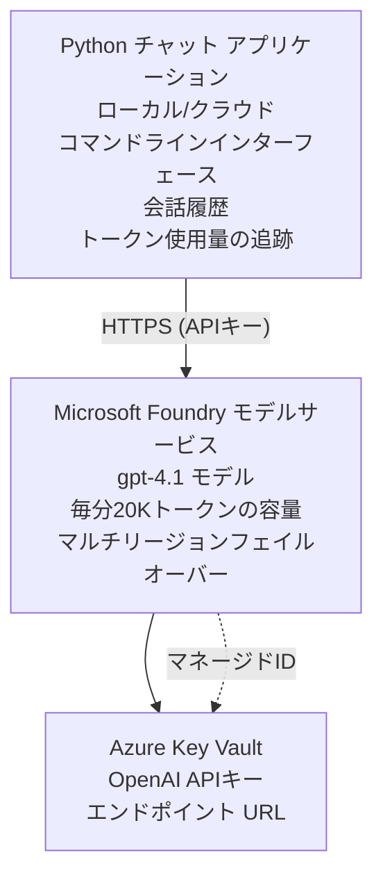

# Microsoft Foundry Models チャットアプリケーション

**Learning Path:** 中級 ⭐⭐ | **Time:** 35-45 分 | **Cost:** $50-200/月

Azure Developer CLI (azd) を使用してデプロイされた完全な Microsoft Foundry Models チャットアプリケーションです。この例は gpt-4.1 のデプロイ、API アクセスの保護、およびシンプルなチャットインターフェースを示します。

## 🎯 学習目標

- gpt-4.1 モデルで Microsoft Foundry Models サービスをデプロイする
- Key Vault を使って OpenAI API キーを保護する
- Python でシンプルなチャットインターフェースを構築する
- トークン使用量とコストを監視する
- レート制限とエラーハンドリングを実装する

## 📦 含まれるもの

✅ **Microsoft Foundry Models Service** - gpt-4.1 モデルのデプロイ  
✅ **Python Chat App** - シンプルなコマンドラインチャットインターフェース  
✅ **Key Vault Integration** - API キーの安全な保管  
✅ **ARM Templates** - 完全なインフラストラクチャをコードで管理  
✅ **Cost Monitoring** - トークン使用量の追跡  
✅ **Rate Limiting** - クォータの枯渇を防ぐ  

## Architecture



## 前提条件

### 必要なもの

- **Azure Developer CLI (azd)** - [インストール ガイド](https://learn.microsoft.com/azure/developer/azure-developer-cli/install-azd)
- **Azure サブスクリプション** (OpenAI へのアクセス権) - [アクセスをリクエスト](https://aka.ms/oai/access)
- **Python 3.9+** - [Python をインストール](https://www.python.org/downloads/)

### 前提条件の確認

```bash
# azd のバージョンを確認（1.5.0 以上が必要）
azd version

# Azure へのログインを確認
azd auth login

# Python のバージョンを確認
python --version  # または python3 --version

# OpenAI へのアクセスを確認（Azure ポータルで確認）
az cognitiveservices account list-skus \
  --kind OpenAI \
  --location eastus
```

> **⚠️ 重要:** Microsoft Foundry Models は申請の承認が必要です。まだ申請していない場合は [aka.ms/oai/access](https://aka.ms/oai/access) をご覧ください。承認には通常 1-2 営業日かかります。

## ⏱️ デプロイのタイムライン

| フェーズ | 所要時間 | 起こること |
|-------|----------|--------------|
| 前提条件の確認 | 2-3 分 | OpenAI のクォータが利用可能かを確認 |
| インフラをデプロイ | 8-12 分 | OpenAI、Key Vault、モデルのデプロイを作成 |
| アプリケーションを設定 | 2-3 分 | 環境と依存関係を設定 |
| <strong>合計</strong> | **12-18 分** | gpt-4.1 でチャットする準備が整います |

**注意:** 初回の OpenAI デプロイはモデルのプロビジョニングにより時間がかかる場合があります。

## クイックスタート

```bash
# サンプルに移動する
cd examples/azure-openai-chat

# 環境を初期化する
azd env new myopenai

# すべてをデプロイする (インフラ + 構成)
azd up
# 次の操作を求められます:
# 1. Azure サブスクリプションを選択する
# 2. OpenAI が利用可能なリージョンを選択する (例: eastus, eastus2, westus)
# 3. デプロイに12-18分待つ

# Python の依存関係をインストールする
pip install -r requirements.txt

# チャットを開始する!
python chat.py
```

**予想される出力:**
```
🤖 Microsoft Foundry Models Chat Application
Connected to: gpt-4.1 (eastus)
Type your message (or 'quit' to exit)

You: Hello! Tell me about Microsoft Foundry Models.
Assistant: Microsoft Foundry Models Service provides REST API access to OpenAI's powerful language models including gpt-4.1, GPT-3.5-Turbo, and Embeddings...

[Tokens used: 145 | Estimated cost: $0.0044]
```

## ✅ デプロイの検証

### ステップ 1: Azure リソースを確認

```bash
# デプロイされたリソースを表示
azd show

# 期待される出力は次のとおりです:
# - OpenAI サービス: (リソース名)
# - Key Vault: (リソース名)
# - デプロイ: gpt-4.1
# - リージョン: eastus (または選択したリージョン)
```

### ステップ 2: OpenAI API をテスト

```bash
# OpenAI のエンドポイントとキーを取得する
OPENAI_ENDPOINT=$(azd env get-value AZURE_OPENAI_ENDPOINT)
OPENAI_KEY=$(azd env get-value AZURE_OPENAI_API_KEY)

# API 呼び出しをテストする
curl "$OPENAI_ENDPOINT/openai/deployments/gpt-4.1/chat/completions?api-version=2024-08-01-preview" \
  -H "Content-Type: application/json" \
  -H "api-key: $OPENAI_KEY" \
  -d '{
    "messages": [{"role": "user", "content": "Say hello!"}],
    "max_tokens": 50
  }'
```

**予想される応答:**
```json
{
  "choices": [
    {
      "message": {
        "role": "assistant",
        "content": "Hello! How can I assist you today?"
      }
    }
  ],
  "usage": {
    "prompt_tokens": 8,
    "completion_tokens": 9,
    "total_tokens": 17
  }
}
```

### ステップ 3: Key Vault へのアクセスを検証

```bash
# Key Vault 内のシークレットを一覧表示する
KV_NAME=$(azd env get-value AZURE_KEY_VAULT_NAME)

az keyvault secret list \
  --vault-name $KV_NAME \
  --query "[].name" \
  --output table
```

**期待されるシークレット:**
- `openai-api-key`
- `openai-endpoint`

**成功基準:**
- ✅ gpt-4.1 で OpenAI サービスがデプロイされている
- ✅ API 呼び出しが有効な応答を返す
- ✅ シークレットが Key Vault に保存されている
- ✅ トークン使用量の追跡が機能している

## プロジェクト構成

```
azure-openai-chat/
├── README.md                   ✅ This guide
├── azure.yaml                  ✅ AZD configuration
├── infra/                      ✅ Infrastructure as Code
│   ├── main.bicep             ✅ Main Bicep template
│   ├── main.parameters.json   ✅ Parameters
│   └── openai.bicep           ✅ OpenAI resource definition
├── src/                        ✅ Application code
│   ├── chat.py                ✅ Chat interface
│   ├── config.py              ✅ Configuration loader
│   └── requirements.txt       ✅ Python dependencies
└── .gitignore                  ✅ Git ignore rules
```

## アプリケーションの機能

### チャットインターフェース (`chat.py`)

チャットアプリケーションには以下が含まれます:

- <strong>会話履歴</strong> - メッセージ間でコンテキストを維持
- <strong>トークンカウント</strong> - 使用量を追跡し、コストを見積もる
- <strong>エラーハンドリング</strong> - レート制限や API エラーを適切に処理
- <strong>コスト見積もり</strong> - メッセージごとのリアルタイムコスト計算
- <strong>ストリーミングサポート</strong> - オプションのストリーミング応答

### コマンド

チャット中に使用できるコマンド:
- `quit` または `exit` - セッションを終了
- `clear` - 会話履歴をクリア
- `tokens` - 合計トークン使用量を表示
- `cost` - 推定合計コストを表示

### 設定 (`config.py`)

環境変数から設定を読み込みます:
```python
AZURE_OPENAI_ENDPOINT  # Key Vault から
AZURE_OPENAI_API_KEY   # Key Vault から
AZURE_OPENAI_MODEL     # デフォルト: gpt-4.1
AZURE_OPENAI_MAX_TOKENS # デフォルト: 800
```

## 使用例

### 基本チャット

```bash
python chat.py
```

### カスタムモデルでチャット

```bash
export AZURE_OPENAI_MODEL=gpt-35-turbo
python chat.py
```

### ストリーミングチャット

```bash
python chat.py --stream
```

### 例: 会話

```
You: Explain Microsoft Foundry Models Service in 3 sentences.
Assistant: Microsoft Foundry Models Service is Microsoft Azure's cloud platform offering 
that provides access to OpenAI's powerful language models. It enables developers 
to integrate capabilities like gpt-4.1 into their applications with enterprise-grade 
security and compliance. The service includes features for content filtering, 
abuse monitoring, and responsible AI practices.

[Tokens used: 89 | Estimated cost: $0.0027]

You: What models are available?
Assistant: Microsoft Foundry Models Service offers several model families including gpt-4.1 
(most capable), GPT-3.5-Turbo (faster and cost-effective), and Embeddings models 
for vector search. Each model has different capabilities, pricing, and token limits.

[Tokens used: 67 | Estimated cost: $0.0020]

Total session: 156 tokens | $0.0047
```

## コスト管理

### トークン価格 (gpt-4.1)

| モデル | 入力 (1K トークンあたり) | 出力 (1K トークンあたり) |
|-------|----------------------|------------------------|
| gpt-4.1 | $0.03 | $0.06 |
| GPT-3.5-Turbo | $0.0015 | $0.002 |

### 推定月間コスト

使用パターンに基づく:

| 使用レベル | メッセージ/日 | トークン/日 | 月間コスト |
|-------------|--------------|------------|--------------|
| <strong>ライト</strong> | 20 メッセージ | 3,000 トークン | $3-5 |
| <strong>中程度</strong> | 100 メッセージ | 15,000 トークン | $15-25 |
| <strong>ヘビー</strong> | 500 メッセージ | 75,000 トークン | $75-125 |

**基本インフラコスト:** $1-2/月 (Key Vault + 最小限のコンピュート)

### コスト最適化のヒント

```bash
# 1. より簡単なタスクにはGPT-3.5-Turboを使用する（20倍安い）
export AZURE_OPENAI_MODEL=gpt-35-turbo

# 2. 応答を短くするために最大トークン数を減らす
export AZURE_OPENAI_MAX_TOKENS=400

# 3. トークン使用量を監視する
python chat.py --show-tokens

# 4. 予算アラートを設定する
az consumption budget create \
  --budget-name "openai-budget" \
  --amount 50 \
  --time-grain Monthly
```

## 監視

### トークン使用量の表示

```bash
# Azureポータルで：
# OpenAI リソース → メトリクス → 「Token Transaction」を選択

# または Azure CLI を使用して：
az monitor metrics list \
  --resource $(azd env get-value AZURE_OPENAI_RESOURCE_ID) \
  --metric "TokenTransaction" \
  --start-time $(date -u -d '1 hour ago' '+%Y-%m-%dT%H:%M:%S') \
  --interval PT1M
```

### API ログの表示

```bash
# 診断ログをストリームする
az monitor diagnostic-settings create \
  --resource $(azd env get-value AZURE_OPENAI_RESOURCE_ID) \
  --name openai-logs \
  --logs '[{"category": "Audit", "enabled": true}]' \
  --workspace $(azd env get-value LOG_ANALYTICS_WORKSPACE_ID)

# クエリログ
az monitor log-analytics query \
  --workspace $(azd env get-value LOG_ANALYTICS_WORKSPACE_ID) \
  --analytics-query "AzureDiagnostics | where Category == 'Audit' | top 10 by TimeGenerated"
```

## トラブルシューティング

### 問題: "Access Denied" エラー

**症状:** API 呼び出し時に 403 Forbidden が発生する

**解決策:**
```bash
# 1. OpenAIへのアクセスが承認されていることを確認する
az cognitiveservices account show \
  --name $(azd env get-value AZURE_OPENAI_NAME) \
  --resource-group $(azd env get-value AZURE_RESOURCE_GROUP)

# 2. APIキーが正しいことを確認する
azd env get-value AZURE_OPENAI_API_KEY

# 3. エンドポイントURLの形式を確認する
azd env get-value AZURE_OPENAI_ENDPOINT
# 次の形式である必要があります: https://[name].openai.azure.com/
```

### 問題: "Rate Limit Exceeded"

**症状:** 429 Too Many Requests が返される

**解決策:**
```bash
# 1. 現在のクォータを確認する
az cognitiveservices account deployment show \
  --name $(azd env get-value AZURE_OPENAI_NAME) \
  --resource-group $(azd env get-value AZURE_RESOURCE_GROUP) \
  --deployment-name gpt-4.1

# 2. クォータの増加をリクエストする（必要な場合）
# Azure ポータル → OpenAI リソース → クォータ → 増加をリクエスト

# 3. 再試行ロジックを実装する（既に chat.py にあります）
# アプリケーションは指数的バックオフで自動的に再試行します
```

### 問題: "Model Not Found"

**症状:** デプロイ時に 404 エラー

**解決策:**
```bash
# 1. 利用可能なデプロイメントを一覧表示する
az cognitiveservices account deployment list \
  --name $(azd env get-value AZURE_OPENAI_NAME) \
  --resource-group $(azd env get-value AZURE_RESOURCE_GROUP)

# 2. 環境内のモデル名を確認する
echo $AZURE_OPENAI_MODEL

# 3. 正しいデプロイメント名に更新する
export AZURE_OPENAI_MODEL=gpt-4.1  # または gpt-35-turbo
```

### 問題: 高いレイテンシ

**症状:** 応答時間が遅い (>5 秒)

**解決策:**
```bash
# 1. リージョンごとのレイテンシを確認する
# ユーザーに最も近いリージョンにデプロイする

# 2. 応答を高速化するために max_tokens を減らす
export AZURE_OPENAI_MAX_TOKENS=400

# 3. より良いユーザー体験のためにストリーミングを利用する
python chat.py --stream
```

## セキュリティのベストプラクティス

### 1. API キーの保護

```bash
# キーをソース管理に決してコミットしない
# Key Vault を使用する（既に構成済み）

# キーを定期的にローテーションする
az cognitiveservices account keys regenerate \
  --name $(azd env get-value AZURE_OPENAI_NAME) \
  --resource-group $(azd env get-value AZURE_RESOURCE_GROUP) \
  --key-name key1
```

### 2. コンテンツフィルタリングの実装

```python
# Microsoft Foundry Modelsには組み込みのコンテンツフィルタリング機能が含まれています
# Azure ポータルで構成:
# OpenAI リソース → コンテンツフィルター → カスタムフィルターを作成

# カテゴリ: ヘイト、性的コンテンツ、暴力、自傷行為
# レベル: 低、中、高のフィルタリング
```

### 3. マネージドIDの使用 (本番環境)

```bash
# 本番環境のデプロイでは、マネージドIDを使用してください
# APIキーの代わりに（アプリをAzureでホスティングする必要があります）

# infra/openai.bicep を更新して以下を含めてください:
# identity: { type: 'SystemAssigned' }
```

## 開発

### ローカルでの実行

```bash
# 依存関係をインストールする
pip install -r src/requirements.txt

# 環境変数を設定する
export AZURE_OPENAI_ENDPOINT="https://[name].openai.azure.com/"
export AZURE_OPENAI_API_KEY="your-api-key"
export AZURE_OPENAI_MODEL="gpt-4.1"

# アプリケーションを実行する
python src/chat.py
```

### テストの実行

```bash
# テストの依存関係をインストールする
pip install pytest pytest-cov

# テストを実行する
pytest tests/ -v

# カバレッジを有効にして
pytest tests/ --cov=src --cov-report=html
```

### モデルデプロイの更新

```bash
# 異なるモデルバージョンをデプロイする
az cognitiveservices account deployment create \
  --name $(azd env get-value AZURE_OPENAI_NAME) \
  --resource-group $(azd env get-value AZURE_RESOURCE_GROUP) \
  --deployment-name gpt-35-turbo \
  --model-name gpt-35-turbo \
  --model-version "0613" \
  --model-format OpenAI \
  --sku-capacity 20 \
  --sku-name "Standard"
```

## クリーンアップ

```bash
# すべての Azure リソースを削除する
azd down --force --purge

# これにより以下が削除されます:
# - OpenAI サービス
# - Key Vault (90日間のソフトデリート付き)
# - リソース グループ
# - すべてのデプロイと構成
```

## 次のステップ

### この例を拡張する

1. **Web インターフェースを追加** - React/Vue フロントエンドを構築する
   ```bash
   # azure.yaml にフロントエンドサービスを追加する
   # Azure Static Web Apps にデプロイする
   ```

2. **RAG を実装** - Azure AI Search によるドキュメント検索を追加
   ```python
   # Azure AI Searchを統合する
   # ドキュメントをアップロードし、ベクターインデックスを作成する
   ```

3. **Function Calling を追加** - ツールの利用を有効にする
   ```python
   # chat.pyで関数を定義する
   # gpt-4.1に外部APIを呼び出させる
   ```

4. <strong>マルチモデルサポート</strong> - 複数モデルをデプロイ
   ```bash
   # gpt-35-turbo と埋め込みモデルを追加
   # モデルルーティングのロジックを実装する
   ```

### 関連する例

- **[Retail Multi-Agent](../retail-scenario.md)** - 高度なマルチエージェントアーキテクチャ
- **[Database App](../../../../examples/database-app)** - 永続ストレージを追加
- **[Container Apps](../../../../examples/container-app)** - コンテナ化されたサービスとしてデプロイ

### 学習リソース

- 📚 [AZD 入門コース](../../README.md) - コースのホーム
- 📚 [Microsoft Foundry Models Documentation](https://learn.microsoft.com/azure/ai-services/openai/) - 公式ドキュメント
- 📚 [OpenAI API リファレンス](https://platform.openai.com/docs/api-reference) - API の詳細
- 📚 [Responsible AI](https://www.microsoft.com/ai/responsible-ai) - ベストプラクティス

## 追加リソース

### ドキュメント
- **[Microsoft Foundry Models Service](https://learn.microsoft.com/azure/ai-services/openai/)** - 完全ガイド
- **[gpt-4.1 Models](https://learn.microsoft.com/azure/ai-services/openai/concepts/models)** - モデルの機能
- **[Content Filtering](https://learn.microsoft.com/azure/ai-services/openai/concepts/content-filter)** - セーフティ機能
- **[Azure Developer CLI](https://learn.microsoft.com/azure/developer/azure-developer-cli/)** - azd リファレンス

### チュートリアル
- **[OpenAI Quickstart](https://learn.microsoft.com/azure/ai-services/openai/quickstart)** - 初回デプロイ
- **[Chat Completions](https://learn.microsoft.com/azure/ai-services/openai/how-to/chatgpt)** - チャットアプリの構築
- **[Function Calling](https://learn.microsoft.com/azure/ai-services/openai/how-to/function-calling)** - 高度な機能

### ツール
- **[Microsoft Foundry Models Studio](https://oai.azure.com/)** - Web ベースのプレイグラウンド
- **[Prompt Engineering Guide](https://platform.openai.com/docs/guides/prompt-engineering)** - より良いプロンプトの作成
- **[Token Calculator](https://platform.openai.com/tokenizer)** - トークン使用量の見積もり

### コミュニティ
- **[Azure AI Discord](https://discord.gg/azure)** - コミュニティからサポートを得る
- **[GitHub Discussions](https://github.com/Azure-Samples/openai/discussions)** - Q&A フォーラム
- **[Azure Blog](https://azure.microsoft.com/blog/tag/azure-openai-service/)** - 最新情報

---

**🎉 成功!** Microsoft Foundry Models をデプロイし、動作するチャットアプリケーションを構築しました。gpt-4.1 の機能を試し、さまざまなプロンプトやユースケースで実験を始めてください。

**質問がありますか?** [Issue を開く](https://github.com/microsoft/AZD-for-beginners/issues) または [よくある質問](../../resources/faq.md) を確認してください。

**コスト注意:** テスト終了後は継続的な請求を避けるために `azd down` を実行することを忘れないでください（アクティブ使用の場合、約 $50-100/月）。

---

<!-- CO-OP TRANSLATOR DISCLAIMER START -->
**免責事項**：
本書類は AI 翻訳サービス [Co-op Translator](https://github.com/Azure/co-op-translator) を使用して翻訳されています。正確性を期していますが、自動翻訳には誤りや不正確な部分が含まれる可能性があることをご承知おきください。原文の原語版が正式な情報源とみなされるべきです。重要な情報については、専門の人間による翻訳を推奨します。本翻訳の利用により生じたいかなる誤解や解釈違いについても、当方は責任を負いかねます。
<!-- CO-OP TRANSLATOR DISCLAIMER END -->