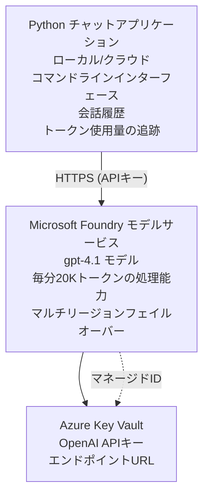

# Microsoft Foundry Models チャットアプリケーション

**Learning Path:** 中級 ⭐⭐ | **Time:** 35-45 分 | **Cost:** $50-200/月

Azure Developer CLI (azd) を使用してデプロイされた完全な Microsoft Foundry Models チャットアプリケーションの例です。この例では gpt-4.1 のデプロイ、セキュアな API アクセス、およびシンプルなチャットインターフェイスを示します。

## 🎯 学習内容

- gpt-4.1 モデルで Microsoft Foundry Models サービスをデプロイする
- Key Vault で OpenAI API キーを安全に管理する
- Python でシンプルなチャットインターフェイスを構築する
- トークン使用量とコストを監視する
- レート制限とエラー処理を実装する

## 📦 含まれるもの

✅ **Microsoft Foundry Models Service** - gpt-4.1 モデルのデプロイ  
✅ **Python Chat App** - シンプルなコマンドラインチャットインターフェイス  
✅ **Key Vault Integration** - API キーの安全な格納  
✅ **ARM Templates** - 完全なインフラストラクチャをコード化  
✅ **Cost Monitoring** - トークン使用量の追跡  
✅ **Rate Limiting** - クォータ枯渇の防止  

## Architecture


## Prerequisites

### Required

- **Azure Developer CLI (azd)** - [インストールガイド](https://learn.microsoft.com/azure/developer/azure-developer-cli/install-azd)
- **Azure subscription** with OpenAI access - [アクセスをリクエスト](https://aka.ms/oai/access)
- **Python 3.9+** - [Python をインストール](https://www.python.org/downloads/)

### Verify Prerequisites

```bash
# azd のバージョンを確認（1.5.0 以上が必要）
azd version

# Azure へのログインを確認
azd auth login

# Python のバージョンを確認
python --version  # または python3 --version

# OpenAI へのアクセスを確認（Azure ポータルで確認）
az cognitiveservices account list-skus \
  --kind OpenAI \
  --location eastus
```

> **⚠️ 重要:** Microsoft Foundry Models は申請による承認が必要です。まだ申請していない場合は、[aka.ms/oai/access](https://aka.ms/oai/access) をご確認ください。承認には通常 1-2 営業日かかります。

## ⏱️ デプロイのタイムライン

| フェーズ | 所要時間 | 内容 |
|-------|----------|--------------|
| 前提条件の確認 | 2-3 分 | OpenAI のクォータ可用性を確認 |
| インフラのデプロイ | 8-12 分 | OpenAI、Key Vault、モデル展開の作成 |
| アプリケーションの設定 | 2-3 分 | 環境と依存関係を設定 |
| <strong>合計</strong> | **12-18 分** | gpt-4.1 でチャットできる状態になります |

**注意:** 初回の OpenAI デプロイはモデルのプロビジョニングにより時間がかかる場合があります。

## クイックスタート

```bash
# サンプルに移動してください
cd examples/azure-openai-chat

# 環境を初期化してください
azd env new myopenai

# すべてをデプロイしてください (インフラ + 構成)
azd up
# 次の操作が求められます:
# 1. Azure サブスクリプションを選択してください
# 2. OpenAI が利用可能なリージョンを選択してください (例: eastus, eastus2, westus)
# 3. デプロイが完了するまで12～18分お待ちください

# Python の依存関係をインストールしてください
pip install -r requirements.txt

# チャットを始めてください!
python chat.py
```

**期待される出力:**
```
🤖 Microsoft Foundry Models Chat Application
Connected to: gpt-4.1 (eastus)
Type your message (or 'quit' to exit)

You: Hello! Tell me about Microsoft Foundry Models.
Assistant: Microsoft Foundry Models Service provides REST API access to OpenAI's powerful language models including gpt-4.1, GPT-3.5-Turbo, and Embeddings...

[Tokens used: 145 | Estimated cost: $0.0044]
```

## ✅ デプロイの確認

### ステップ 1: Azure リソースの確認

```bash
# 展開されたリソースを表示
azd show

# 期待される出力は次のとおりです:
# - OpenAI サービス: (リソース名)
# - Key Vault: (リソース名)
# - デプロイ: gpt-4.1
# - 場所: eastus (または選択したリージョン)
```

### ステップ 2: OpenAI API のテスト

```bash
# OpenAIのエンドポイントとキーを取得する
OPENAI_ENDPOINT=$(azd env get-value AZURE_OPENAI_ENDPOINT)
OPENAI_KEY=$(azd env get-value AZURE_OPENAI_API_KEY)

# API呼び出しをテストする
curl "$OPENAI_ENDPOINT/openai/deployments/gpt-4.1/chat/completions?api-version=2024-08-01-preview" \
  -H "Content-Type: application/json" \
  -H "api-key: $OPENAI_KEY" \
  -d '{
    "messages": [{"role": "user", "content": "Say hello!"}],
    "max_tokens": 50
  }'
```

**期待される応答:**
```json
{
  "choices": [
    {
      "message": {
        "role": "assistant",
        "content": "Hello! How can I assist you today?"
      }
    }
  ],
  "usage": {
    "prompt_tokens": 8,
    "completion_tokens": 9,
    "total_tokens": 17
  }
}
```

### ステップ 3: Key Vault アクセスの確認

```bash
# Key Vault のシークレットを一覧表示する
KV_NAME=$(azd env get-value AZURE_KEY_VAULT_NAME)

az keyvault secret list \
  --vault-name $KV_NAME \
  --query "[].name" \
  --output table
```

**期待されるシークレット:**
- `openai-api-key`
- `openai-endpoint`

**成功基準:**
- ✅ gpt-4.1 で OpenAI サービスがデプロイされている
- ✅ API コールが有効なレスポンスを返す
- ✅ シークレットが Key Vault に保存されている
- ✅ トークン使用量の追跡が機能している

## プロジェクト構成

```
azure-openai-chat/
├── README.md                   ✅ This guide
├── azure.yaml                  ✅ AZD configuration
├── infra/                      ✅ Infrastructure as Code
│   ├── main.bicep             ✅ Main Bicep template
│   ├── main.parameters.json   ✅ Parameters
│   └── openai.bicep           ✅ OpenAI resource definition
├── src/                        ✅ Application code
│   ├── chat.py                ✅ Chat interface
│   ├── config.py              ✅ Configuration loader
│   └── requirements.txt       ✅ Python dependencies
└── .gitignore                  ✅ Git ignore rules
```

## アプリケーションの機能

### チャットインターフェイス (`chat.py`)

チャットアプリケーションには以下が含まれます:

- <strong>会話履歴</strong> - メッセージ間でコンテキストを維持
- <strong>トークンカウント</strong> - 使用量を追跡しコストを見積もる
- <strong>エラー処理</strong> - レート制限や API エラーを適切に処理
- <strong>コスト見積もり</strong> - メッセージごとのリアルタイムコスト計算
- <strong>ストリーミングサポート</strong> - オプションのストリーミング応答

### コマンド

チャット中に使用できるコマンド:
- `quit` or `exit` - セッションを終了
- `clear` - 会話履歴をクリア
- `tokens` - 総トークン使用量を表示
- `cost` - 推定合計コストを表示

### 設定 (`config.py`)

環境変数から設定を読み込みます:
```python
AZURE_OPENAI_ENDPOINT  # Key Vault から
AZURE_OPENAI_API_KEY   # Key Vault から
AZURE_OPENAI_MODEL     # 既定: gpt-4.1
AZURE_OPENAI_MAX_TOKENS # 既定: 800
```

## 使用例

### 基本チャット

```bash
python chat.py
```

### カスタムモデルでチャット

```bash
export AZURE_OPENAI_MODEL=gpt-35-turbo
python chat.py
```

### ストリーミングでチャット

```bash
python chat.py --stream
```

### 例の会話

```
You: Explain Microsoft Foundry Models Service in 3 sentences.
Assistant: Microsoft Foundry Models Service is Microsoft Azure's cloud platform offering 
that provides access to OpenAI's powerful language models. It enables developers 
to integrate capabilities like gpt-4.1 into their applications with enterprise-grade 
security and compliance. The service includes features for content filtering, 
abuse monitoring, and responsible AI practices.

[Tokens used: 89 | Estimated cost: $0.0027]

You: What models are available?
Assistant: Microsoft Foundry Models Service offers several model families including gpt-4.1 
(most capable), GPT-3.5-Turbo (faster and cost-effective), and Embeddings models 
for vector search. Each model has different capabilities, pricing, and token limits.

[Tokens used: 67 | Estimated cost: $0.0020]

Total session: 156 tokens | $0.0047
```

## コスト管理

### トークン価格（gpt-4.1）

| モデル | 入力（1K トークンあたり） | 出力（1K トークンあたり） |
|-------|----------------------|------------------------|
| gpt-4.1 | $0.03 | $0.06 |
| GPT-3.5-Turbo | $0.0015 | $0.002 |

### 推定月間コスト

利用パターンに基づく:

| 利用レベル | 1日あたりのメッセージ数 | 1日あたりのトークン数 | 月間コスト |
|-------------|--------------|------------|--------------|
| <strong>ライト</strong> | 20 メッセージ | 3,000 トークン | $3-5 |
| <strong>モデレート</strong> | 100 メッセージ | 15,000 トークン | $15-25 |
| <strong>ヘビー</strong> | 500 メッセージ | 75,000 トークン | $75-125 |

**基本インフラコスト:** $1-2/月（Key Vault + 最小限のコンピュート）

### コスト最適化のヒント

```bash
# 1. より簡単なタスクには GPT-3.5-Turbo を使用する（20倍安価）
export AZURE_OPENAI_MODEL=gpt-35-turbo

# 2. 最大トークン数を減らして応答を短くする
export AZURE_OPENAI_MAX_TOKENS=400

# 3. トークン使用量を監視する
python chat.py --show-tokens

# 4. 予算アラートを設定する
az consumption budget create \
  --budget-name "openai-budget" \
  --amount 50 \
  --time-grain Monthly
```

## モニタリング

### トークン使用量の表示

```bash
# Azure ポータルで:
# OpenAI リソース → メトリクス → 「Token Transaction」を選択

# または Azure CLI で:
az monitor metrics list \
  --resource $(azd env get-value AZURE_OPENAI_RESOURCE_ID) \
  --metric "TokenTransaction" \
  --start-time $(date -u -d '1 hour ago' '+%Y-%m-%dT%H:%M:%S') \
  --interval PT1M
```

### API ログの表示

```bash
# ストリーム診断ログ
az monitor diagnostic-settings create \
  --resource $(azd env get-value AZURE_OPENAI_RESOURCE_ID) \
  --name openai-logs \
  --logs '[{"category": "Audit", "enabled": true}]' \
  --workspace $(azd env get-value LOG_ANALYTICS_WORKSPACE_ID)

# クエリログ
az monitor log-analytics query \
  --workspace $(azd env get-value LOG_ANALYTICS_WORKSPACE_ID) \
  --analytics-query "AzureDiagnostics | where Category == 'Audit' | top 10 by TimeGenerated"
```

## トラブルシューティング

### 問題: "Access Denied" エラー

**症状:** API 呼び出し時に 403 Forbidden

**解決策:**
```bash
# 1. OpenAIへのアクセスが承認されていることを確認する
az cognitiveservices account show \
  --name $(azd env get-value AZURE_OPENAI_NAME) \
  --resource-group $(azd env get-value AZURE_RESOURCE_GROUP)

# 2. APIキーが正しいか確認する
azd env get-value AZURE_OPENAI_API_KEY

# 3. エンドポイントURLの形式を確認する
azd env get-value AZURE_OPENAI_ENDPOINT
# 次の形式であるべき: https://[name].openai.azure.com/
```

### 問題: "Rate Limit Exceeded"

**症状:** 429 Too Many Requests

**解決策:**
```bash
# 1. 現在のクォータを確認する
az cognitiveservices account deployment show \
  --name $(azd env get-value AZURE_OPENAI_NAME) \
  --resource-group $(azd env get-value AZURE_RESOURCE_GROUP) \
  --deployment-name gpt-4.1

# 2. クォータの増加を申請する（必要な場合）
# Azure ポータルに移動 → OpenAI リソース → クォータ → 増加をリクエスト

# 3. 再試行ロジックを実装する（既に chat.py にあります）
# アプリケーションは指数バックオフで自動的に再試行します
```

### 問題: "Model Not Found"

**症状:** デプロイ時に 404 エラー

**解決策:**
```bash
# 1. 利用可能なデプロイメントを一覧表示する
az cognitiveservices account deployment list \
  --name $(azd env get-value AZURE_OPENAI_NAME) \
  --resource-group $(azd env get-value AZURE_RESOURCE_GROUP)

# 2. 環境内のモデル名を確認する
echo $AZURE_OPENAI_MODEL

# 3. 正しいデプロイメント名に更新する
export AZURE_OPENAI_MODEL=gpt-4.1  # または gpt-35-turbo
```

### 問題: 高いレイテンシ

**症状:** 応答が遅い（>5 秒）

**解決策:**
```bash
# 1. 地域ごとのレイテンシを確認する
# ユーザーに最も近いリージョンにデプロイする

# 2. より高速な応答のためにmax_tokensを減らす
export AZURE_OPENAI_MAX_TOKENS=400

# 3. より良いUXのためにストリーミングを使用する
python chat.py --stream
```

## セキュリティのベストプラクティス

### 1. API キーの保護

```bash
# キーをソース管理に決してコミットしないでください
# Key Vault を使用してください（既に構成済み）

# キーを定期的にローテーションしてください
az cognitiveservices account keys regenerate \
  --name $(azd env get-value AZURE_OPENAI_NAME) \
  --resource-group $(azd env get-value AZURE_RESOURCE_GROUP) \
  --key-name key1
```

### 2. コンテンツフィルタリングの実装

```python
# Microsoft Foundry Modelsには組み込みのコンテンツフィルタリングが含まれています
# Azure ポータルで設定:
# OpenAI リソース → コンテンツ フィルター → カスタム フィルターを作成

# カテゴリ: ヘイト、性的コンテンツ、暴力、自傷行為
# レベル: 低、中、高のフィルタリング
```

### 3. マネージドIDを使用する（本番）

```bash
# 本番環境へのデプロイでは、マネージド アイデンティティを使用してください
# APIキーの代わりに使用してください（アプリを Azure 上でホストする必要があります）

# infra/openai.bicep を更新して次を含めてください:
# identity: { type: 'SystemAssigned' }
```

## 開発

### ローカルで実行

```bash
# 依存関係をインストールする
pip install -r src/requirements.txt

# 環境変数を設定する
export AZURE_OPENAI_ENDPOINT="https://[name].openai.azure.com/"
export AZURE_OPENAI_API_KEY="your-api-key"
export AZURE_OPENAI_MODEL="gpt-4.1"

# アプリケーションを実行する
python src/chat.py
```

### テストを実行

```bash
# テストの依存関係をインストールする
pip install pytest pytest-cov

# テストを実行する
pytest tests/ -v

# カバレッジを有効にして
pytest tests/ --cov=src --cov-report=html
```

### モデルデプロイの更新

```bash
# 異なるモデルバージョンをデプロイする
az cognitiveservices account deployment create \
  --name $(azd env get-value AZURE_OPENAI_NAME) \
  --resource-group $(azd env get-value AZURE_RESOURCE_GROUP) \
  --deployment-name gpt-35-turbo \
  --model-name gpt-35-turbo \
  --model-version "0613" \
  --model-format OpenAI \
  --sku-capacity 20 \
  --sku-name "Standard"
```

## クリーンアップ

```bash
# すべての Azure リソースを削除する
azd down --force --purge

# これにより次のものが削除されます:
# - OpenAI サービス
# - Key Vault (90日間のソフトデリート付き)
# - リソース グループ
# - すべてのデプロイおよび構成
```

## 次のステップ

### この例の拡張

1. **Web インターフェイスを追加** - React/Vue フロントエンドを構築  
   ```bash
   # フロントエンドサービスを azure.yaml に追加する
   # Azure Static Web Apps にデプロイする
   ```

2. **RAG を実装** - Azure AI Search を使ったドキュメント検索を追加  
   ```python
   # Azure Cognitive Search を統合する
   # ドキュメントをアップロードしてベクトルインデックスを作成する
   ```

3. <strong>ファンクションコーリングを追加</strong> - ツールの使用を有効にする  
   ```python
   # chat.py に関数を定義する
   # gpt-4.1 に外部 API を呼び出させる
   ```

4. <strong>マルチモデルサポート</strong> - 複数モデルをデプロイ  
   ```bash
   # gpt-35-turbo と埋め込みモデルを追加する
   # モデルのルーティングロジックを実装する
   ```

### 関連例

- **[Retail Multi-Agent](../retail-scenario.md)** - 進んだマルチエージェントアーキテクチャ
- **[Database App](../../../../examples/database-app)** - 永続ストレージを追加
- **[Container Apps](../../../../examples/container-app)** - コンテナ化されたサービスとしてデプロイ

### 学習リソース

- 📚 [AZD For Beginners Course](../../README.md) - コースのメインページ
- 📚 [Microsoft Foundry Models ドキュメント](https://learn.microsoft.com/azure/ai-services/openai/) - 公式ドキュメント
- 📚 [OpenAI API リファレンス](https://platform.openai.com/docs/api-reference) - API の詳細
- 📚 [責任ある AI](https://www.microsoft.com/ai/responsible-ai) - ベストプラクティス

## 追加リソース

### ドキュメント
- **[Microsoft Foundry Models Service](https://learn.microsoft.com/azure/ai-services/openai/)** - 完全なガイド
- **[gpt-4.1 モデル](https://learn.microsoft.com/azure/ai-services/openai/concepts/models)** - モデルの機能
- **[コンテンツフィルタリング](https://learn.microsoft.com/azure/ai-services/openai/concepts/content-filter)** - セーフティ機能
- **[Azure Developer CLI](https://learn.microsoft.com/azure/developer/azure-developer-cli/)** - azd リファレンス

### チュートリアル
- **[OpenAI Quickstart](https://learn.microsoft.com/azure/ai-services/openai/quickstart)** - 最初のデプロイ
- **[Chat Completions](https://learn.microsoft.com/azure/ai-services/openai/how-to/chatgpt)** - チャットアプリの構築
- **[Function Calling](https://learn.microsoft.com/azure/ai-services/openai/how-to/function-calling)** - 高度な機能

### ツール
- **[Microsoft Foundry Models Studio](https://oai.azure.com/)** - Web ベースのプレイグラウンド
- **[Prompt Engineering Guide](https://platform.openai.com/docs/guides/prompt-engineering)** - プロンプト作成のガイド
- **[Token Calculator](https://platform.openai.com/tokenizer)** - トークン使用量を見積もる

### コミュニティ
- **[Azure AI Discord](https://discord.gg/azure)** - コミュニティから支援を得る
- **[GitHub Discussions](https://github.com/Azure-Samples/openai/discussions)** - Q&A フォーラム
- **[Azure Blog](https://azure.microsoft.com/blog/tag/azure-openai-service/)** - 最新情報

---

**🎉 おめでとうございます！** Microsoft Foundry Models をデプロイし、動作するチャットアプリケーションを構築しました。gpt-4.1 の機能を試し、さまざまなプロンプトやユースケースを試してください。

**質問がありますか？** [Issue を開く](https://github.com/microsoft/AZD-for-beginners/issues) または [よくある質問](../../resources/faq.md) を確認してください

**コスト注意:** テストが終わったら継続的な課金を避けるために `azd down` を実行することを忘れないでください（アクティブ使用で約 $50-100/月）。

---

<!-- CO-OP TRANSLATOR DISCLAIMER START -->
**免責事項**:
この文書は AI 翻訳サービス [Co-op トランスレーター](https://github.com/Azure/co-op-translator) を使用して翻訳されました。正確性には努めていますが、自動翻訳には誤りや不正確な表現が含まれている可能性があることをご了承ください。原文（原言語版）を権威ある出典とみなしてください。重要な情報については、専門の翻訳者による翻訳を推奨します。本翻訳の利用に起因するいかなる誤解や誤訳についても、当社は責任を負いません。
<!-- CO-OP TRANSLATOR DISCLAIMER END -->