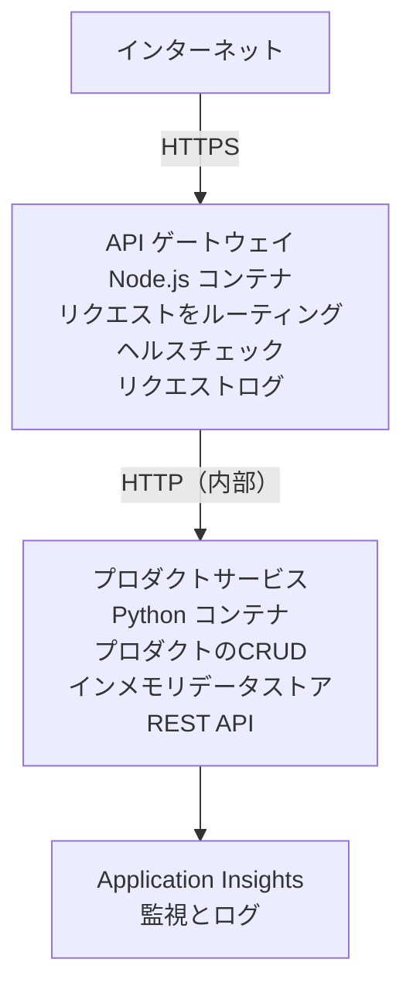

# マイクロサービスアーキテクチャ - Container App 例

⏱️ <strong>推定時間</strong>: 25-35 分 | 💰 <strong>推定コスト</strong>: 約 $50-100/月 | ⭐ <strong>複雑さ</strong>: 上級

これは AZD CLI を使用して Azure Container Apps にデプロイする、<strong>簡略化されているが機能する</strong> マイクロサービスアーキテクチャの例です。この例は、実用的な2サービス構成でのサービス間通信、コンテナオーケストレーション、および監視を示します。

> **📚 学習アプローチ**: この例は最小の2サービスアーキテクチャ（API Gateway + バックエンドサービス）から始め、実際にデプロイして学べます。基礎を習得した後、完全なマイクロサービスエコシステムへの拡張方法を案内します。

## 学べること

この例を完了することで、以下を学べます:
- 複数のコンテナを Azure Container Apps にデプロイする方法
- 内部ネットワーキングを用いたサービス間通信の実装
- 環境に基づくスケーリングとヘルスチェックの設定
- Application Insights を用いた分散アプリケーションの監視
- マイクロサービスのデプロイパターンとベストプラクティスの理解
- 単純なアーキテクチャから複雑な構成へ段階的に拡張する方法

## アーキテクチャ

### フェーズ1: 構築するもの（この例に含まれる）


**なぜシンプルから始めるのか？**
- ✅ 素早くデプロイして理解できる（25-35 分）
- ✅ 複雑さを避けてコアなマイクロサービスパターンを学べる
- ✅ 編集・実験できる動作するコード
- ✅ 学習コストが低い（約 $50-100/月 vs $300-1400/月）
- ✅ データベースやメッセージキューを追加する前に自信を築ける

<strong>例え</strong>: これは運転を学ぶことに似ています。空の駐車場（2サービス）から始めて基本を習得し、やがて市街地の交通（データベースを伴う5+サービス）へ進みます。

### フェーズ2: 将来的な拡張（参照アーキテクチャ）

一度2サービスアーキテクチャを習得したら、次のように拡張できます:

```
Full Architecture (Not Included - For Reference)
├── API Gateway (✅ Included)
├── Product Service (✅ Included)
├── Order Service (🔜 Add next)
├── User Service (🔜 Add next)
├── Notification Service (🔜 Add last)
├── Azure Service Bus (🔜 For async communication)
├── Cosmos DB (🔜 For product persistence)
├── Azure SQL (🔜 For order management)
└── Azure Storage (🔜 For file storage)
```

手順については末尾の「拡張ガイド」セクションを参照してください。

## 含まれる機能

✅ <strong>サービス検出</strong>: コンテナ間の自動 DNS ベースの検出  
✅ <strong>ロードバランシング</strong>: レプリカ間の組み込みロードバランシング  
✅ <strong>自動スケーリング</strong>: HTTP リクエストに基づくサービス毎の独立したスケーリング  
✅ <strong>ヘルスモニタリング</strong>: 両サービスの liveness と readiness プローブ  
✅ <strong>分散ログ</strong>: Application Insights を用いた集中ログ収集  
✅ <strong>内部ネットワーキング</strong>: セキュアなサービス間通信  
✅ <strong>コンテナオーケストレーション</strong>: 自動デプロイとスケーリング  
✅ <strong>ゼロダウンタイムの更新</strong>: リビジョン管理によるローリングアップデート  

## 前提条件

### 必要なツール

開始する前に、以下のツールがインストールされていることを確認してください:

1. **[Azure Developer CLI (azd)](https://learn.microsoft.com/azure/developer/azure-developer-cli/install-azd)**（バージョン 1.0.0 以上）
   ```bash
   azd version
   # 期待される出力: azd のバージョン 1.0.0 以上
   ```

2. **[Azure CLI](https://learn.microsoft.com/cli/azure/install-azure-cli)**（バージョン 2.50.0 以上）
   ```bash
   az --version
   # 期待される出力: azure-cli 2.50.0 以上
   ```

3. **[Docker](https://www.docker.com/get-started)**（ローカル開発/テスト用 - 任意）
   ```bash
   docker --version
   # 期待される出力: Docker バージョン 20.10 以上
   ```

### Azure の要件

- 有効な **Azure サブスクリプション**（[無料アカウントを作成](https://azure.microsoft.com/free/)）
- サブスクリプション内でリソースを作成する権限
- サブスクリプションまたはリソースグループでの **Contributor** ロール

### 知識の前提

これは <strong>上級レベル</strong> の例です。以下が望まれます:
- [シンプルな Flask API の例](../../../../../examples/container-app/simple-flask-api) を完了していること
- マイクロサービスアーキテクチャの基本理解
- REST API と HTTP に関する基礎知識
- コンテナの基本概念の理解

**Container Apps が初めてですか？** 基礎を学ぶにはまず [シンプルな Flask API の例](../../../../../examples/container-app/simple-flask-api) を実行してください。

## クイックスタート（ステップバイステップ）

### ステップ1: クローンして移動

```bash
git clone https://github.com/microsoft/AZD-for-beginners.git
cd AZD-for-beginners/examples/container-app/microservices
```

**✓ 成功チェック**: `azure.yaml` が表示されていることを確認してください:
```bash
ls
# 期待される: README.md、azure.yaml、infra/、src/
```

### ステップ2: Azure に認証

```bash
azd auth login
```

これによりブラウザが開き、Azure 認証が行われます。Azure の資格情報でサインインしてください。

**✓ 成功チェック**: 次のような表示があるはずです:
```
Logged in to Azure.
```

### ステップ3: 環境の初期化

```bash
azd init
```

<strong>表示されるプロンプト</strong>:
- **Environment name**: 短い名前を入力（例: `microservices-dev`）
- **Azure subscription**: サブスクリプションを選択
- **Azure location**: リージョンを選択（例: `eastus`, `westeurope`）

**✓ 成功チェック**: 次のような表示があるはずです:
```
SUCCESS: New project initialized!
```

### ステップ4: インフラとサービスをデプロイ

```bash
azd up
```

<strong>実行される内容</strong>（所要時間 8-12 分）:
1. Container Apps 環境を作成
2. 監視用の Application Insights を作成
3. API Gateway コンテナ（Node.js）をビルド
4. Product Service コンテナ（Python）をビルド
5. 両コンテナを Azure にデプロイ
6. ネットワーキングとヘルスチェックを構成
7. 監視とログ収集をセットアップ

**✓ 成功チェック**: 次のような表示があるはずです:
```
SUCCESS: Your application was deployed to Azure in X minutes Y seconds.
Endpoint: https://api-gateway-<unique-id>.azurecontainerapps.io
```

**⏱️ 所要時間**: 8-12 分

### ステップ5: デプロイのテスト

```bash
# ゲートウェイのエンドポイントを取得
GATEWAY_URL=$(azd env get-values | grep API_GATEWAY_URL | cut -d '=' -f2 | tr -d '"')

# API Gateway のヘルスチェックを行う
curl $GATEWAY_URL/health

# 期待される出力:
# {"status":"healthy","service":"api-gateway","timestamp":"2025-11-19T10:30:00Z"}
```

<strong>ゲートウェイ経由でプロダクトサービスをテスト</strong>:
```bash
# 製品を一覧表示
curl $GATEWAY_URL/api/products

# 期待される出力:
# [
#   {"id":1,"name":"ノートパソコン","price":999.99,"stock":50},
#   {"id":2,"name":"マウス","price":29.99,"stock":200},
#   {"id":3,"name":"キーボード","price":79.99,"stock":150}
# ]
```

**✓ 成功チェック**: 両方のエンドポイントがエラーなく JSON データを返すこと。

---

**🎉 おめでとうございます！** マイクロサービスアーキテクチャを Azure にデプロイできました！

## プロジェクト構成

すべての実装ファイルが含まれています—これは完全に動作する例です:

```
microservices/
│
├── README.md                         # This file
├── azure.yaml                        # AZD configuration
├── .gitignore                        # Git ignore patterns
│
├── infra/                           # Infrastructure as Code (Bicep)
│   ├── main.bicep                   # Main orchestration
│   ├── abbreviations.json           # Naming conventions
│   ├── core/                        # Shared infrastructure
│   │   ├── container-apps-environment.bicep  # Container environment + registry
│   │   └── monitor.bicep            # Application Insights + Log Analytics
│   └── app/                         # Service definitions
│       ├── api-gateway.bicep        # API Gateway container app
│       └── product-service.bicep    # Product Service container app
│
└── src/                             # Application source code
    ├── api-gateway/                 # Node.js API Gateway
    │   ├── app.js                   # Express server with routing
    │   ├── package.json             # Node dependencies
    │   └── Dockerfile               # Container definition
    └── product-service/             # Python Product Service
        ├── main.py                  # Flask API with product data
        ├── requirements.txt         # Python dependencies
        └── Dockerfile               # Container definition
```

**各コンポーネントの役割:**

**インフラストラクチャ (infra/)**:
- `main.bicep`: すべての Azure リソースと依存関係をオーケストレーション
- `core/container-apps-environment.bicep`: Container Apps 環境と Azure Container Registry を作成
- `core/monitor.bicep`: 分散ログ用の Application Insights を設定
- `app/*.bicep`: スケーリングとヘルスチェックを含む個別の Container App 定義

**API Gateway (src/api-gateway/)**:
- 外部向けサービスでバックエンドサービスへリクエストをルーティング
- ロギング、エラーハンドリング、リクエスト転送を実装
- サービス間の HTTP 通信を示す例

**Product Service (src/product-service/)**:
- インメモリのプロダクトカタログを持つ内部サービス（簡易化のため）
- ヘルスチェックを備えた REST API
- バックエンドマイクロサービスのパターン例

## サービス概要

### API Gateway (Node.js/Express)

<strong>ポート</strong>: 8080  
<strong>アクセス</strong>: パブリック（外部イングレス）  
<strong>目的</strong>: 受信リクエストを適切なバックエンドサービスへルーティング  

<strong>エンドポイント</strong>:
- `GET /` - サービス情報
- `GET /health` - ヘルスチェックエンドポイント
- `GET /api/products` - Product Service へ転送（一覧取得）
- `GET /api/products/:id` - Product Service へ転送（ID で取得）

<strong>主要機能</strong>:
- axios によるリクエストルーティング
- 中央集約型のロギング
- エラーハンドリングとタイムアウト管理
- 環境変数によるサービス検出
- Application Insights 統合

<strong>コードハイライト</strong> (`src/api-gateway/app.js`):
```javascript
// 内部サービス間の通信
app.get('/api/products', async (req, res) => {
  const response = await axios.get(`${PRODUCT_SERVICE_URL}/products`);
  res.json(response.data);
});
```

### Product Service (Python/Flask)

<strong>ポート</strong>: 8000  
<strong>アクセス</strong>: 内部のみ（外部イングレスなし）  
<strong>目的</strong>: インメモリデータによるプロダクトカタログの管理  

<strong>エンドポイント</strong>:
- `GET /` - サービス情報
- `GET /health` - ヘルスチェックエンドポイント
- `GET /products` - 全プロダクト一覧
- `GET /products/<id>` - ID によるプロダクト取得

<strong>主要機能</strong>:
- Flask による RESTful API
- インメモリのプロダクトストア（シンプル、データベース不要）
- プローブによるヘルスモニタリング
- 構造化ログ
- Application Insights 統合

<strong>データモデル</strong>:
```python
{
  "id": 1,
  "name": "Laptop",
  "description": "High-performance laptop",
  "price": 999.99,
  "stock": 50
}
```

**なぜ内部のみなのか？**
Product Service は公開されていません。すべてのリクエストは API Gateway 経由で行われ、これにより:
- セキュリティ: 制御されたアクセスポイント
- 柔軟性: バックエンドを変更してもクライアントに影響を与えない
- 監視: リクエストの集中ログ

## サービス間通信の理解

### サービス間の通信方法

この例では、API Gateway は Product Service と **内部 HTTP コール** を用いて通信します:

```javascript
// APIゲートウェイ (src/api-gateway/app.js)
const PRODUCT_SERVICE_URL = process.env.PRODUCT_SERVICE_URL;

// 内部のHTTPリクエストを行う
const response = await axios.get(`${PRODUCT_SERVICE_URL}/products`);
```

<strong>要点</strong>:

1. **DNS ベースの検出**: Container Apps は内部サービス用の DNS を自動で提供します
   - Product Service FQDN: `product-service.internal.<environment>.azurecontainerapps.io`
   - 簡略化して: `http://product-service`（Container Apps が解決します）

2. <strong>公開されない</strong>: Product Service は Bicep 内で `external: false`
   - Container Apps 環境内のみアクセス可能
   - インターネットからは到達不可

3. <strong>環境変数</strong>: サービス URL はデプロイ時に注入されます
   - Bicep が内部 FQDN をゲートウェイに渡す
   - アプリケーションコードにハードコードされた URL は無し

<strong>例え</strong>: 受付が公の窓口（API Gateway）で、Product Service は社内の部屋（内部のみ）です。訪問者は受付を通らないと部屋に行けません。

## デプロイオプション

### フルデプロイ（推奨）

```bash
# インフラと両方のサービスをデプロイする
azd up
```

これによりデプロイされます:
1. Container Apps 環境
2. Application Insights
3. Container Registry
4. API Gateway コンテナ
5. Product Service コンテナ

<strong>時間</strong>: 8-12 分

### 個別サービスのデプロイ

```bash
# 最初の azd up 実行後に、1つのサービスだけをデプロイする
azd deploy api-gateway

# または product サービスをデプロイする
azd deploy product-service
```

<strong>ユースケース</strong>: あるサービスのコードを更新し、そのサービスだけを再デプロイしたい場合。

### 設定の更新

```bash
# スケーリングパラメータを変更する
azd env set GATEWAY_MAX_REPLICAS 30

# 新しい構成で再デプロイする
azd up
```

## 設定

### スケーリング構成

両サービスはそれぞれの Bicep ファイルで HTTP ベースのオートスケーリングが設定されています:

**API Gateway**:
- 最小レプリカ数: 2（可用性のため常に最低2）
- 最大レプリカ数: 20
- スケールトリガー: レプリカあたり同時 50 リクエスト

**Product Service**:
- 最小レプリカ数: 1（必要に応じてゼロへスケール可）
- 最大レプリカ数: 10
- スケールトリガー: レプリカあたり同時 100 リクエスト

<strong>スケーリングのカスタマイズ</strong>（`infra/app/*.bicep` 内）:
```bicep
scale: {
  minReplicas: 1
  maxReplicas: 10
  rules: [
    {
      name: 'http-scale-rule'
      http: {
        metadata: {
          concurrentRequests: '100'  // Adjust this
        }
      }
    }
  ]
}
```

### リソース割り当て

**API Gateway**:
- CPU: 1.0 vCPU
- メモリ: 2 GiB
- 理由: 外部トラフィックを処理するため

**Product Service**:
- CPU: 0.5 vCPU
- メモリ: 1 GiB
- 理由: 軽量なインメモリ操作

### ヘルスチェック

両サービスには liveness と readiness のプローブが含まれています:

```bicep
probes: [
  {
    type: 'Liveness'
    httpGet: {
      path: '/health'
      port: 8080
    }
    initialDelaySeconds: 10
    periodSeconds: 30
  }
  {
    type: 'Readiness'
    httpGet: {
      path: '/health'
      port: 8080
    }
    initialDelaySeconds: 5
    periodSeconds: 10
  }
]
```

<strong>これが意味すること</strong>:
- **Liveness**: ヘルスチェックが失敗した場合、Container Apps はコンテナを再起動します
- **Readiness**: 準備ができていない場合、Container Apps はそのレプリカへのトラフィックを止めます


## 監視と可観測性

### サービスログの表示

```bash
# azd monitor を使ってログを表示する
azd monitor --logs

# または特定の Container Apps 用に Azure CLI を使用する:
# API Gateway のログをストリーミングする
az containerapp logs show --name api-gateway --resource-group $RG_NAME --follow

# 最近の product service のログを表示する
az containerapp logs show --name product-service --resource-group $RG_NAME --tail 100
```

<strong>想定される出力</strong>:
```
[api-gateway] API Gateway listening on port 8080
[api-gateway] Product Service URL: http://product-service
[api-gateway] GET /api/products 200 - 45ms
[product-service] Retrieved 5 products
```

### Application Insights のクエリ

Azure ポータルで Application Insights にアクセスし、次のクエリを実行します:

<strong>遅いリクエストを見つける</strong>:
```kusto
requests
| where timestamp > ago(1h)
| where duration > 1000  // Requests taking >1 second
| summarize count() by name, cloud_RoleName
| order by count_ desc
```

<strong>サービス間呼び出しを追跡する</strong>:
```kusto
dependencies
| where timestamp > ago(1h)
| where type == "Http"
| project timestamp, name, target, duration, success
| order by timestamp desc
```

<strong>サービス別のエラー率</strong>:
```kusto
exceptions
| where timestamp > ago(24h)
| summarize errorCount = count() by cloud_RoleName, type
| order by errorCount desc
```

<strong>時間経過によるリクエストボリューム</strong>:
```kusto
requests
| where timestamp > ago(1h)
| summarize requestCount = count() by bin(timestamp, 5m), cloud_RoleName
| render timechart
```

### 監視ダッシュボードへのアクセス

```bash
# Application Insights の詳細を取得する
azd env get-values | grep APPLICATIONINSIGHTS

# Azure ポータルのモニタリングを開く
az monitor app-insights component show \
  --app $(azd env get-values | grep APPLICATIONINSIGHTS_CONNECTION_STRING | cut -d '=' -f2) \
  --resource-group $(azd env get-values | grep AZURE_RESOURCE_GROUP | cut -d '=' -f2) \
  --query "appId" -o tsv
```

### ライブメトリクス

1. Azure ポータルで Application Insights に移動
2. 「Live Metrics」をクリック
3. リアルタイムのリクエスト、失敗、パフォーマンスを確認
4. これを実行してテスト: `curl $(azd env get-values | grep API_GATEWAY_URL | cut -d '=' -f2 | tr -d '"')/api/products`

## 実践演習

[注: デプロイ検証、データの変更、オートスケーリングテスト、エラー処理、3番目のサービスの追加を含む詳細なステップバイステップの演習については、上の「実践演習」セクション全文を参照してください。]

## コスト分析

### 推定月額コスト（この2サービス例）

| リソース | 構成 | 推定コスト |
|----------|--------------|----------------|
| API Gateway | 2-20 レプリカ, 1 vCPU, 2GB RAM | $30-150 |
| Product Service | 1-10 レプリカ, 0.5 vCPU, 1GB RAM | $15-75 |
| Container Registry | Basic tier | $5 |
| Application Insights | 1-2 GB/月 | $5-10 |
| Log Analytics | 1 GB/月 | $3 |
| <strong>合計</strong> | | **$58-243/月** |

<strong>使用状況別のコスト内訳</strong>:
- <strong>軽負荷</strong>（テスト/学習）: 約 $60/月
- <strong>中程度の負荷</strong>（小規模プロダクション）: 約 $120/月
- <strong>高負荷</strong>（繁忙期）: 約 $240/月

### コスト最適化のヒント

1. <strong>開発時はゼロへスケール</strong>:
   ```bicep
   scale: {
     minReplicas: 0  // Save $30-40/month when not in use
     maxReplicas: 10
   }
   ```

2. **Cosmos DB を追加する場合はコンシュンプションプランを使用**:
   - 使用した分だけ支払う
   - 最低料金なし

3. **Application Insights のサンプリングを設定**:
   ```javascript
   appInsights.defaultClient.config.samplingPercentage = 50; // リクエストの50%をサンプリングする
   ```

4. <strong>不要時はクリーンアップ</strong>:
   ```bash
   azd down
   ```

### 無料枠のオプション

学習/テスト用として検討してください:
- Azure の無料クレジットを使用する (最初の30日間)
- レプリカを最小限にする
- テスト後に削除する (継続的な課金なし)

---

## クリーンアップ

継続的な課金を避けるため、すべてのリソースを削除してください:
```bash
azd down --force --purge
```

<strong>確認プロンプト</strong>:
```
? Total resources to delete: 6, are you sure you want to continue? (y/N)
```

確認するには `y` と入力してください。

<strong>削除されるもの</strong>:
- Container Apps 環境
- 両方の Container Apps (gateway と product サービス)
- Container レジストリ
- Application Insights
- Log Analytics ワークスペース
- リソース グループ

**✓ クリーンアップを確認**:
```bash
az group list --query "[?starts_with(name,'rg-microservices')]" --output table
```

空のはずです。

---

## 拡張ガイド: 2サービスから5+サービスへ

この2サービス構成を習得したら、拡張方法は次のとおりです:

### フェーズ1: データベース永続化の追加 (次のステップ)

**Product サービス向けに Cosmos DB を追加する**:

1. `infra/core/cosmos.bicep` を作成:
   ```bicep
   resource cosmosAccount 'Microsoft.DocumentDB/databaseAccounts@2023-04-15' = {
     name: name
     location: location
     kind: 'GlobalDocumentDB'
     properties: {
       databaseAccountOfferType: 'Standard'
       locations: [{ locationName: location, failoverPriority: 0 }]
     }
   }
   ```

2. プロダクトサービスを更新して、インメモリデータの代わりに Cosmos DB を使用する

3. 推定追加コスト: ~$25/月 (サーバーレス)

### フェーズ2: 3つ目のサービスを追加 (注文管理)

<strong>注文サービスを作成</strong>:

1. 新しいフォルダー: `src/order-service/` (Python/Node.js/C#)
2. 新しい Bicep: `infra/app/order-service.bicep`
3. API Gateway を更新して `/api/orders` にルーティングする
4. 注文の永続化のために Azure SQL Database を追加する

<strong>アーキテクチャは次のようになります</strong>:
```
API Gateway → Product Service (Cosmos DB)
           → Order Service (Azure SQL)
```

### フェーズ3: 非同期通信を追加 (Service Bus)

<strong>イベント駆動アーキテクチャを実装</strong>:

1. Azure Service Bus を追加: `infra/core/servicebus.bicep`
2. Product Service が "ProductCreated" イベントを発行する
3. Order Service が製品イベントを購読する
4. イベントを処理する通知サービスを追加する

<strong>パターン</strong>: リクエスト/レスポンス (HTTP) + イベント駆動 (Service Bus)

### フェーズ4: ユーザー認証を追加

<strong>ユーザーサービスを実装</strong>:

1. `src/user-service/` を作成 (Go/Node.js)
2. Azure AD B2C またはカスタム JWT 認証を追加する
3. API Gateway がトークンを検証する
4. 各サービスがユーザー権限を確認する

### フェーズ5: 本番準備

<strong>次のコンポーネントを追加</strong>:
- Azure Front Door (グローバル負荷分散)
- Azure Key Vault (シークレット管理)
- Azure Monitor Workbooks (カスタムダッシュボード)
- CI/CD パイプライン (GitHub Actions)
- Blue-Green デプロイ
- すべてのサービスの Managed Identity

<strong>本番環境向けフルアーキテクチャのコスト</strong>: ~$300-1,400/month

---

## 詳細

### 関連ドキュメント
- [Azure Container Apps ドキュメント](https://learn.microsoft.com/azure/container-apps/)
- [マイクロサービス アーキテクチャ ガイド](https://learn.microsoft.com/azure/architecture/guide/architecture-styles/microservices)
- [分散トレーシング用 Application Insights](https://learn.microsoft.com/azure/azure-monitor/app/distributed-tracing)
- [Azure Developer CLI ドキュメント](https://learn.microsoft.com/azure/developer/azure-developer-cli/)

### このコースの次のステップ
- ← 前: [シンプルな Flask API](../../../../../examples/container-app/simple-flask-api) - 初心者向けの単一コンテナ例
- → 次: [AI 統合ガイド](../../../../../examples/docs/ai-foundry) - AI 機能を追加
- 🏠 [コースホーム](../../README.md)

### 比較: 何をいつ使うか

<strong>単一コンテナアプリ</strong> (シンプルな Flask API の例):
- ✅ シンプルなアプリケーション
- ✅ モノリシックなアーキテクチャ
- ✅ デプロイが速い
- ❌ スケーラビリティに限界がある
- <strong>コスト</strong>: ~$15-50/month

<strong>マイクロサービス</strong> (この例):
- ✅ 複雑なアプリケーション
- ✅ サービスごとの独立スケーリング
- ✅ チームの自律性 (サービスごとに別チーム)
- ❌ 管理がより複雑
- <strong>コスト</strong>: ~$60-250/month

**Kubernetes (AKS)**:
- ✅ 最大の制御性と柔軟性
- ✅ マルチクラウドの移植性
- ✅ 高度なネットワーキング
- ❌ Kubernetes の専門知識が必要
- <strong>コスト</strong>: 最低でも ~$150-500/month

<strong>推奨</strong>: まずは Container Apps (この例) で始め、Kubernetes 固有の機能が必要になったら AKS に移行してください。

---

## よくある質問

**Q: なぜ5つ以上ではなく2サービスだけなのですか？**  
A: 教育的な進行のためです。まずはシンプルな例で基礎（サービス間通信、監視、スケーリング）を習得し、その後で複雑さを追加します。ここで学ぶパターンは100サービスのアーキテクチャにも適用できます。

**Q: 自分でサービスを追加できますか？**  
A: もちろんです！上の拡張ガイドに従ってください。新しいサービスは同じパターンに従います: src フォルダーを作成し、Bicep ファイルを作成し、azure.yaml を更新してデプロイします。

**Q: これは本番対応ですか？**  
A: しっかりした基盤です。本番運用にするには、Managed Identity、Key Vault、永続データベース、CI/CD パイプライン、監視アラート、バックアップ戦略を追加してください。

**Q: なぜ Dapr や他のサービスメッシュを使わないのですか？**  
A: 学習を簡単にするためです。まずはネイティブな Container Apps のネットワーキングを理解し、その後で高度なシナリオに Dapr を重ねてください。

**Q: ローカルでのデバッグはどうすればよいですか？**  
A: Docker でサービスをローカル実行してください:
```bash
cd src/api-gateway
docker build -t local-gateway .
docker run -p 8080:8080 -e PRODUCT_SERVICE_URL=http://localhost:8000 local-gateway
```

**Q: 異なるプログラミング言語を使えますか？**  
A: はい！この例では Node.js (gateway) + Python (product service) を示しています。コンテナで動作する任意の言語を組み合わせることができます。

**Q: Azure のクレジットがない場合は？**  
A: Azure の無料枠を利用する（新規アカウントは最初の30日間）か、短期間テストしてすぐに削除してください。

---

> **🎓 学習パスの概要**: 自動スケーリング、内部ネットワーキング、集中監視、そして本番対応パターンを備えたマルチサービスアーキテクチャのデプロイ方法を学びました。この基盤により、複雑な分散システムやエンタープライズ向けマイクロサービスのアーキテクチャへの準備が整います。

**📚 コースナビゲーション:**
- ← 前: [シンプルな Flask API](../../../../../examples/container-app/simple-flask-api)
- → 次: [データベース統合の例](../../../../../examples/database-app)
- 🏠 [コースホーム](../../../README.md)
- 📖 [Container Apps ベストプラクティス](../../../docs/chapter-04-infrastructure/deployment-guide.md)

---

<!-- CO-OP TRANSLATOR DISCLAIMER START -->
**免責事項**:
本書類は AI 翻訳サービス [Co-op 翻訳](https://github.com/Azure/co-op-translator) を用いて翻訳されました。正確性には努めておりますが、自動翻訳には誤りや不正確な箇所が含まれる可能性があることにご注意ください。原文（原言語）の文書が権威ある情報源と見なされるべきです。重要な情報については、専門の人間による翻訳を推奨します。本翻訳の利用により生じた誤解や誤訳について、当社はいかなる責任も負いません。
<!-- CO-OP TRANSLATOR DISCLAIMER END -->