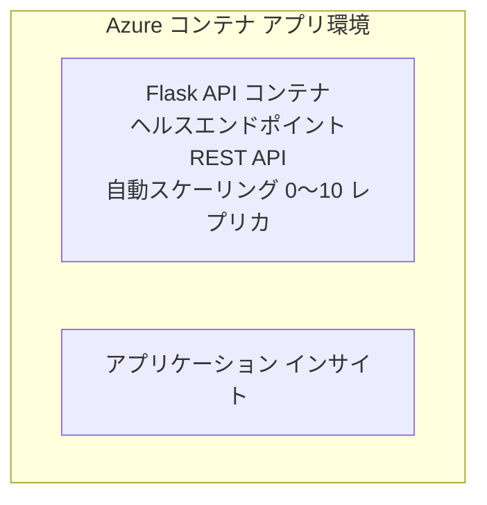

# Simple Flask API - Container App の例

**Learning Path:** Beginner ⭐ | **Time:** 25-35 minutes | **Cost:** $0-15/month

Azure Developer CLI (azd) を使用して Azure Container Apps にデプロイされた、完全に動作する Python Flask REST API のサンプルです。この例ではコンテナーのデプロイ、自動スケーリング、監視の基本を示します。

## 🎯 学べること

- コンテナ化された Python アプリケーションを Azure にデプロイする
- scale-to-zero を使った自動スケーリングを構成する
- ヘルスプローブとレディネスチェックを実装する
- アプリケーションのログとメトリックを監視する
- 高速デプロイのために Azure Developer CLI を使用する

## 📦 含まれるもの

✅ **Flask Application** - CRUD 操作を備えた完全な REST API (`src/app.py`)  
✅ **Dockerfile** - 本番向けコンテナ構成  
✅ **Bicep Infrastructure** - Container Apps 環境と API デプロイ  
✅ **AZD Configuration** - ワンコマンドでのデプロイ設定  
✅ **Health Probes** - liveness と readiness チェックを構成済み  
✅ **Auto-scaling** - HTTP 負荷に基づく 0-10 レプリカ  

## Architecture


## Prerequisites

### 必要なもの
- **Azure Developer CLI (azd)** - [インストール ガイド](https://learn.microsoft.com/azure/developer/azure-developer-cli/install-azd)
- **Azure subscription** - [無料アカウント](https://azure.microsoft.com/free/)
- **Docker Desktop** - [Docker をインストール](https://www.docker.com/products/docker-desktop/)（ローカルテスト用）

### 前提条件の確認

```bash
# azd のバージョンを確認 (1.5.0 以上が必要)
azd version

# Azure へのログインを確認
azd auth login

# Docker を確認 (任意、ローカルテスト用)
docker --version
```

## ⏱️ デプロイタイムライン

| Phase | Duration | What Happens |
|-------|----------|--------------||
| Environment setup | 30 seconds | Create azd environment |
| Build container | 2-3 minutes | Docker build Flask app |
| Provision infrastructure | 3-5 minutes | Create Container Apps, registry, monitoring |
| Deploy application | 2-3 minutes | Push image and deploy to Container Apps |
| **Total** | **8-12 minutes** | Complete deployment ready |

## クイックスタート

```bash
# 例に移動
cd examples/container-app/simple-flask-api

# 環境を初期化する（一意の名前を選択）
azd env new myflaskapi

# すべてをデプロイする（インフラストラクチャ＋アプリケーション）
azd up
# 次の操作を求められます:
# 1. Azure サブスクリプションを選択
# 2. ロケーションを選択（例: eastus2）
# 3. デプロイに8～12分かかります

# API エンドポイントを取得する
azd env get-values

# API をテストする
curl $(azd env get-value API_ENDPOINT)/health
```

**Expected Output:**
```json
{
  "status": "healthy",
  "timestamp": "2025-11-19T10:30:00Z",
  "service": "simple-flask-api",
  "version": "1.0.0"
}
```

## ✅ デプロイの検証

### ステップ 1: デプロイ状況の確認

```bash
# デプロイ済みのサービスを表示
azd show

# 期待される出力は次のとおり:
# - サービス: api
# - エンドポイント: https://ca-api-[env].xxx.azurecontainerapps.io
# - ステータス: 実行中
```

### ステップ 2: API エンドポイントのテスト

```bash
# APIエンドポイントを取得
API_URL=$(azd env get-value API_ENDPOINT)

# ヘルスチェックを行う
curl $API_URL/health

# ルートエンドポイントをテスト
curl $API_URL/

# アイテムを作成する
curl -X POST $API_URL/api/items \
  -H "Content-Type: application/json" \
  -d '{"name": "Test Item", "description": "My first item"}'

# すべてのアイテムを取得する
curl $API_URL/api/items
```

**成功基準:**
- ✅ ヘルスエンドポイントが HTTP 200 を返す
- ✅ ルートエンドポイントが API 情報を表示する
- ✅ POST がアイテムを作成し HTTP 201 を返す
- ✅ GET が作成したアイテムを返す

### ステップ 3: ログの表示

```bash
# azd monitor を使ってライブログをストリーミングする
azd monitor --logs

# または Azure CLI を使用する:
az containerapp logs show --name api --resource-group $RG_NAME --follow

# 次の内容が表示されるはずです:
# - Gunicorn の起動メッセージ
# - HTTP リクエストログ
# - アプリケーションの情報ログ
```

## プロジェクト構成

```
simple-flask-api/
├── azure.yaml              # AZD configuration
├── infra/
│   ├── main.bicep         # Main infrastructure
│   ├── main.parameters.json
│   └── app/
│       ├── container-env.bicep
│       └── api.bicep
└── src/
    ├── app.py             # Flask application
    ├── requirements.txt
    └── Dockerfile
```

## API エンドポイント

| Endpoint | Method | Description |
|----------|--------|-------------|
| `/health` | GET | ヘルスチェック |
| `/api/items` | GET | すべてのアイテムを一覧表示 |
| `/api/items` | POST | 新しいアイテムを作成 |
| `/api/items/{id}` | GET | 特定のアイテムを取得 |
| `/api/items/{id}` | PUT | アイテムを更新 |
| `/api/items/{id}` | DELETE | アイテムを削除 |

## 設定

### 環境変数

```bash
# カスタム構成を設定する
azd env set PORT 8000
azd env set LOG_LEVEL info
azd env set MAX_REPLICAS 20
```

### スケーリング構成

API は HTTP トラフィックに基づいて自動的にスケールします:
- **Min Replicas**: 0（アイドル時はゼロにスケール）
- **Max Replicas**: 10
- **Concurrent Requests per Replica**: 50

## 開発

### ローカルで実行

```bash
# 依存関係をインストールする
cd src
pip install -r requirements.txt

# アプリを実行する
python app.py

# ローカルでテストする
curl http://localhost:8000/health
```

### コンテナのビルドとテスト

```bash
# Dockerイメージをビルドする
docker build -t flask-api:local ./src

# コンテナをローカルで実行する
docker run -p 8000:8000 flask-api:local

# コンテナをテストする
curl http://localhost:8000/health
```

## デプロイ

### フルデプロイ

```bash
# インフラストラクチャとアプリケーションをデプロイする
azd up
```

### コードのみのデプロイ

```bash
# アプリケーションコードのみをデプロイする（インフラは変更しない）
azd deploy api
```

### 設定の更新

```bash
# 環境変数を更新
azd env set API_KEY "new-api-key"

# 新しい設定で再デプロイ
azd deploy api
```

## 監視

### ログの表示

```bash
# azd monitor を使用してライブログをストリーミングする
azd monitor --logs

# または Container Apps 用の Azure CLI を使用する:
az containerapp logs show --name api --resource-group $RG_NAME --follow

# 最後の100行を表示する
az containerapp logs show --name api --resource-group $RG_NAME --tail 100
```

### メトリクスの監視

```bash
# Azure Monitor ダッシュボードを開く
azd monitor --overview

# 特定のメトリックを表示する
az monitor metrics list \
  --resource $(azd show --output json | jq -r '.services.api.resourceId') \
  --metric "Requests,ResponseTime"
```

## テスト

### ヘルスチェック

```bash
curl $(azd show --output json | jq -r '.services.api.endpoint')/health
```

Expected response:
```json
{
  "status": "healthy",
  "timestamp": "2025-11-19T10:30:00Z"
}
```

### アイテムの作成

```bash
curl -X POST $(azd show --output json | jq -r '.services.api.endpoint')/api/items \
  -H "Content-Type: application/json" \
  -d '{"name": "Test Item", "description": "A test item"}'
```

### すべてのアイテムを取得

```bash
curl $(azd show --output json | jq -r '.services.api.endpoint')/api/items
```

## コスト最適化

このデプロイは scale-to-zero を使用するため、API がリクエストを処理しているときのみ課金されます:

- <strong>アイドル時のコスト</strong>: 約 $0/月（ゼロにスケール）
- <strong>アクティブ時のコスト</strong>: レプリカあたり約 $0.000024/秒
- <strong>月間想定コスト</strong>（軽負荷）: $5-15

### コストをさらに削減する方法

```bash
# 開発用に最大レプリカ数を縮小する
azd env set MAX_REPLICAS 3

# アイドルタイムアウトを短くする
azd env set SCALE_TO_ZERO_TIMEOUT 300  # 5分
```

## トラブルシューティング

### コンテナが起動しない

```bash
# Azure CLI を使ってコンテナのログを確認する
az containerapp logs show --name api --resource-group $RG_NAME --tail 100

# Docker イメージがローカルでビルドされることを確認する
docker build -t test ./src
```

### API にアクセスできない

```bash
# ingressが外部であることを確認する
az containerapp show --name api --resource-group rg-simple-flask-api \
  --query properties.configuration.ingress.external
```

### 応答時間が長い

```bash
# CPU/メモリ使用率を確認する
az monitor metrics list \
  --resource $(azd show --output json | jq -r '.services.api.resourceId') \
  --metric "CPUPercentage,MemoryPercentage"

# 必要に応じてリソースをスケールアップする
az containerapp update --name api --resource-group rg-simple-flask-api \
  --cpu 1.0 --memory 2Gi
```

## クリーンアップ

```bash
# すべてのリソースを削除する
azd down --force --purge
```

## 次のステップ

### この例を拡張する

1. **Add Database** - Azure Cosmos DB または SQL Database を統合する
   ```bash
   # infra/main.bicep に Cosmos DB モジュールを追加する
   # データベース接続を追加するために app.py を更新する
   ```

2. **Add Authentication** - Azure AD または API キーを実装する
   ```python
   # app.py に認証ミドルウェアを追加する
   from functools import wraps
   ```

3. **Set Up CI/CD** - GitHub Actions ワークフロー
   ```yaml
   # Create .github/workflows/deploy.yml
   name: Deploy to Azure
   on: [push]
   ```

4. **Add Managed Identity** - Azure サービスへのアクセスを安全にする
   ```bicep
   # Update infra/app/api.bicep
   identity: { type: 'SystemAssigned' }
   ```

### 関連する例

- **[Database App](../../../../../examples/database-app)** - SQL Database を使用した完全な例
- **[Microservices](../../../../../examples/container-app/microservices)** - マルチサービスアーキテクチャ
- **[Container Apps Master Guide](../README.md)** - すべてのコンテナパターン

### 学習リソース

- 📚 [AZD For Beginners Course](../../../README.md) - メインコースのホーム
- 📚 [Container Apps Patterns](../README.md) - さらなるデプロイパターン
- 📚 [AZD Templates Gallery](https://azure.github.io/awesome-azd/) - コミュニティテンプレート

## 追加リソース

### ドキュメント
- **[Flask Documentation](https://flask.palletsprojects.com/)** - Flask フレームワークガイド
- **[Azure Container Apps](https://learn.microsoft.com/azure/container-apps/)** - 公式 Azure ドキュメント
- **[Azure Developer CLI](https://learn.microsoft.com/azure/developer/azure-developer-cli/)** - azd コマンドリファレンス

### チュートリアル
- **[Container Apps Quickstart](https://learn.microsoft.com/azure/container-apps/quickstart-portal)** - 最初のアプリをデプロイする
- **[Python on Azure](https://learn.microsoft.com/azure/developer/python/)** - Python 開発ガイド
- **[Bicep Language](https://learn.microsoft.com/azure/azure-resource-manager/bicep/)** - インフラストラクチャをコード化する言語

### ツール
- **[Azure Portal](https://portal.azure.com)** - リソースを視覚的に管理
- **[VS Code Azure Extension](https://marketplace.visualstudio.com/items?itemName=ms-azuretools.vscode-azurecontainerapps)** - IDE 連携

---

**🎉 おめでとうございます！** 自動スケーリングと監視を備えた本番対応の Flask API を Azure Container Apps にデプロイしました。

**Questions?** [Open an issue](https://github.com/microsoft/AZD-for-beginners/issues) or check the [FAQ](../../../resources/faq.md)

---

<!-- CO-OP TRANSLATOR DISCLAIMER START -->
**免責事項**:
本書は AI 翻訳サービス [Co-op トランスレーター](https://github.com/Azure/co-op-translator) を使用して翻訳されました。正確性には最善を尽くしていますが、自動翻訳には誤りや不正確さが含まれる可能性があることをご承知おきください。原文（原言語版）を正式な参照元とみなしてください。重要な情報については、専門の人間による翻訳を推奨します。本翻訳の使用に起因するいかなる誤解や誤訳についても、当方は責任を負いません。
<!-- CO-OP TRANSLATOR DISCLAIMER END -->